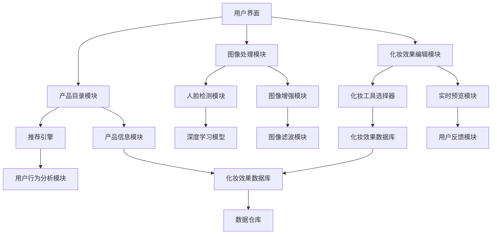
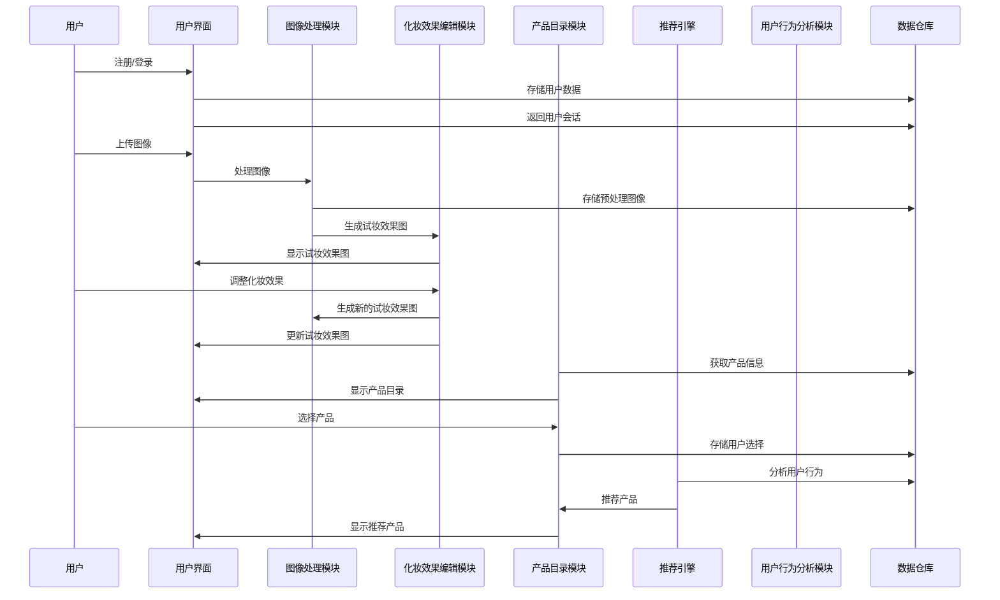

                 

### 前言与概述

在当今数字化时代，在线购物已经成为人们生活中不可或缺的一部分。然而，尽管在线购物的便捷性极大地提升了消费者的购物体验，传统的在线试妆方式仍然存在许多不足。用户在购买化妆品、服装等需要试穿或试妆的产品时，常常面临无法真实感受产品效果的问题，这往往导致购买后的退货率居高不下。

**问题背景：**

1. **在线购物体验的现状：**
   随着互联网技术的飞速发展，电子商务平台提供了越来越多的商品种类，使得消费者能够方便地购买到世界各地的产品。然而，传统的在线试妆方式，如平面图片展示和视频试妆，往往无法真实还原产品的实际效果，这极大地影响了用户的购物体验。

2. **虚拟试妆的需求与挑战：**
   为了解决这一问题，虚拟试妆技术应运而生。虚拟试妆通过计算机图形学和深度学习技术，让用户可以在不实际试穿或试妆的情况下，预览产品效果。这项技术不仅提高了购物体验，还减少了退货率，降低了物流成本。然而，虚拟试妆技术也面临一些挑战，如高计算成本、实时性能需求、用户个性化需求的满足等。

3. **深度学习在虚拟试妆中的应用潜力：**
   深度学习作为当前人工智能领域的重要分支，具有强大的特征提取和学习能力，为虚拟试妆提供了新的解决方案。通过深度学习，虚拟试妆技术可以实现更精确的效果预测、更丰富的用户交互和更个性化的推荐，从而大幅提升在线购物的整体体验。

**本书的目标：**

本书旨在深入探讨深度学习在虚拟试妆中的应用，通过系统的分析和详细的讲解，帮助读者了解和掌握这一前沿技术的核心概念、原理和实现方法。具体来说，本书将实现以下目标：

1. **全面介绍虚拟试妆技术：**
   通过对虚拟试妆的概念、需求、挑战及其与在线购物的关系进行详细阐述，为读者提供对这一领域的全面理解。

2. **深入讲解深度学习基础：**
   从深度学习的定义、发展历程、神经网络结构等方面，介绍深度学习的基础知识，为后续内容的理解打下坚实基础。

3. **详细分析虚拟试妆算法原理：**
   针对虚拟试妆中的核心算法，如卷积神经网络（CNN）、生成对抗网络（GAN）等，进行深入分析，并结合实际案例进行讲解。

4. **系统设计与实现：**
   通过系统架构设计、接口设计和系统交互分析，帮助读者全面了解虚拟试妆系统的整体设计思路和实现方法。

5. **项目实战与案例分析：**
   通过实际项目实战和案例分析，让读者能够将所学知识应用到实际场景中，提升实战能力。

**本书的预期收获：**

通过阅读本书，读者将：

1. **理解深度学习与虚拟试妆的结合：**
   深入了解深度学习在虚拟试妆中的应用，掌握其核心原理和技术。

2. **提升在线购物体验：**
   通过虚拟试妆技术的应用，提升自身对在线购物体验的理解和实际操作能力。

3. **掌握系统设计与实现方法：**
   学习到虚拟试妆系统的设计与实现方法，为未来的项目提供参考。

4. **培养创新思维：**
   通过对虚拟试妆技术的深入探讨，激发读者在人工智能和在线购物领域的创新思维。

通过本书的学习，读者不仅能够掌握虚拟试妆技术的核心内容，还将为未来的研究和工作打下坚实的基础。

---

**关键词：**
- 虚拟试妆
- 在线购物体验
- 深度学习
- 图像识别
- 生成对抗网络（GAN）
- 卷积神经网络（CNN）

**摘要：**
本书深入探讨深度学习在虚拟试妆中的应用，通过全面介绍虚拟试妆技术的需求与挑战，讲解深度学习的基础知识，分析虚拟试妆算法原理，系统设计与实现方法，以及项目实战与案例分析，帮助读者掌握虚拟试妆技术的核心内容，提升在线购物体验，培养创新思维。深度学习与虚拟试妆的结合为在线购物带来了革命性的变化，本书旨在为读者提供全面的指导和深入的理解，使其能够在这一前沿领域取得突破性进展。

---

## 第1章：虚拟试妆与在线购物体验

虚拟试妆技术的出现，为改善在线购物体验提供了新的契机。随着电子商务的迅速发展，消费者对购物体验的要求也越来越高。特别是在化妆品和时尚领域，用户希望能够在线上购物时预览产品的实际效果，以减少购买后的退货率。虚拟试妆技术通过计算机图形学、深度学习等技术手段，实现了这一目标。本章将详细探讨虚拟试妆与在线购物体验的关系，分析其需求与挑战，并探讨深度学习在这一领域的应用潜力。

### 1.1.1 在线购物体验的现状

在线购物作为一种便捷的购物方式，已经深入到人们的日常生活中。根据最新的市场调研数据，全球电子商务市场的规模不断扩大，预计未来几年仍将保持高速增长。然而，尽管在线购物的便利性得到了广泛认可，用户体验的提升仍然是电子商务平台需要持续关注和改进的方面。

1. **产品展示的局限性：**
   传统在线购物平台主要通过图片和文字描述来展示产品，这种方式虽然能够提供一定的信息，但无法真实还原产品的实际效果。对于化妆品、服装等需要试穿或试妆的产品，用户很难通过线上展示判断产品的实际效果，这直接影响了购物决策。

2. **试穿与试妆的挑战：**
   即使有些电商平台提供了试穿或试妆的服务，但由于物流和成本的限制，用户往往只能在购买后亲自试穿或试妆，这导致退货率居高不下。特别是在化妆品领域，不同人的肤质、肤色和妆容风格差异较大，线上试妆的效果往往与实际效果存在偏差。

3. **个性化需求的提升：**
   随着消费者个性化需求的不断提升，传统的在线购物方式已经难以满足用户对个性化、定制化的需求。消费者希望能够根据自身的肤质、肤色、妆容风格等，在线上预览产品的实际效果，从而做出更明智的购物决策。

### 1.1.2 虚拟试妆的需求与挑战

虚拟试妆技术的出现，正是为了解决传统在线购物体验中的这些痛点。通过虚拟试妆，用户可以在不实际试穿或试妆的情况下，预览产品的实际效果，从而做出更明智的购物决策。

1. **需求背景：**
   - **减少退货率：** 虚拟试妆技术通过模拟真实试妆过程，可以减少用户购买后的退货率，从而降低物流成本和平台运营成本。
   - **提升用户满意度：** 通过提供更真实的试妆效果，提升用户对购物平台的满意度，增加用户的粘性。
   - **个性化推荐：** 虚拟试妆技术可以根据用户的个性化需求，提供更精准的推荐，从而提升用户的购物体验。

2. **技术挑战：**
   - **计算成本：** 虚拟试妆涉及到图像处理、深度学习等技术，计算成本较高，这对硬件设备和计算资源提出了较高的要求。
   - **实时性能：** 虚拟试妆需要快速响应用户的操作，提供实时反馈，这对系统的实时性能提出了挑战。
   - **个性化需求的满足：** 虚拟试妆需要满足不同用户的个性化需求，如肤质、肤色、妆容风格等，这需要高度复杂的算法支持。
   - **效果的真实性：** 虚拟试妆的效果需要尽可能接近实际效果，这对算法的准确性和可靠性提出了更高的要求。

### 1.1.3 深度学习在虚拟试妆中的应用潜力

深度学习作为当前人工智能领域的重要分支，具有强大的特征提取和学习能力，为虚拟试妆技术提供了新的解决方案。以下是深度学习在虚拟试妆中的应用潜力：

1. **图像识别与处理：**
   深度学习可以通过卷积神经网络（CNN）等算法，实现图像的自动识别与处理。在虚拟试妆中，深度学习可以用于识别用户的肤色、面部特征等，从而更准确地模拟试妆效果。

2. **生成对抗网络（GAN）：**
   生成对抗网络（GAN）可以通过对抗训练生成高质量的真实感图像，用于虚拟试妆。GAN可以在输入图像的基础上，生成与实际试妆效果高度相似的新图像，从而提升用户体验。

3. **个性化推荐：**
   深度学习可以通过用户行为数据、面部特征数据等，实现个性化推荐。通过深度学习算法，平台可以更精准地了解用户的需求，提供个性化的试妆建议，提升用户的购物体验。

4. **实时交互与反馈：**
   深度学习可以用于实时交互与反馈，通过快速处理用户输入的数据，提供实时的试妆效果。这种实时交互能力可以大幅提升虚拟试妆的体验，让用户感受到更加真实的试妆效果。

总之，虚拟试妆技术通过深度学习的应用，不仅能够提升在线购物的体验，还能够为电商平台的运营提供更多的数据支持。深度学习在虚拟试妆中的应用潜力巨大，未来有望在这一领域实现更多的突破。

---

通过本章的介绍，我们可以看到虚拟试妆技术在改善在线购物体验方面具有重要的应用价值。然而，这一技术的实现也面临着诸多挑战，特别是计算成本、实时性能和个性化需求等方面的挑战。深度学习作为当前人工智能领域的重要分支，为解决这些挑战提供了新的思路和可能性。在接下来的章节中，我们将深入探讨深度学习的基础知识，以及其在虚拟试妆技术中的应用，帮助读者全面了解这一前沿领域。

## 第2章：深度学习基础

深度学习是近年来人工智能领域的重要进展，其强大的特征提取和学习能力为诸多应用场景提供了新的解决方案。本章将介绍深度学习的基础知识，包括其定义、发展历程、基本结构等，为后续关于虚拟试妆技术的讨论打下坚实的基础。

### 2.1 深度学习概述

#### 2.1.1 深度学习的定义与发展

**定义：**
深度学习是一种基于人工神经网络的方法，通过多层次的神经网络结构，自动从数据中学习特征，实现复杂的数据分析和模式识别。

**发展历程：**
深度学习起源于1980年代，最初的研究主要集中在人工神经网络（ANN）上。随着计算能力的提升和大数据的积累，深度学习在2010年后得到了迅速发展。特别是卷积神经网络（CNN）和生成对抗网络（GAN）的出现，使得深度学习在图像识别、自然语言处理等领域取得了突破性的成果。

#### 2.1.2 神经网络的基本结构

神经网络是由大量人工神经元（或节点）组成的计算模型，通过前向传播和反向传播算法进行学习。一个典型的神经网络包括以下几个基本组成部分：

1. **输入层（Input Layer）：**
   输入层是神经网络的第一层，负责接收输入数据。

2. **隐藏层（Hidden Layers）：**
   隐藏层位于输入层和输出层之间，负责对输入数据进行特征提取和变换。深度学习中的“深度”即是指隐藏层的数量。

3. **输出层（Output Layer）：**
   输出层是神经网络的最后一层，负责输出预测结果或分类标签。

神经网络的工作原理是通过调整网络中的权重（weights）和偏置（biases），使网络能够从输入数据中学习到有用的特征。这个过程包括以下几个步骤：

1. **前向传播（Forward Propagation）：**
   输入数据通过神经网络的前向传播，从输入层传递到输出层，每一层都会对数据进行变换和特征提取。

2. **反向传播（Backpropagation）：**
   网络通过反向传播算法，根据输出结果与真实标签之间的误差，调整网络中的权重和偏置，使网络输出更接近真实标签。

通过不断的训练和优化，神经网络可以逐步提高其预测精度和泛化能力。

### 2.2 相关算法

#### 2.2.1 卷积神经网络（CNN）

卷积神经网络（CNN）是一种专门用于处理图像数据的神经网络结构，其核心思想是通过卷积操作提取图像的局部特征。CNN 由以下几个关键组成部分构成：

1. **卷积层（Convolutional Layer）：**
   卷积层通过卷积操作提取图像的局部特征，每个卷积核（kernel）负责提取图像中的一种特定特征。

2. **池化层（Pooling Layer）：**
   池化层对卷积层输出的特征图进行降维处理，减少参数量和计算量，同时保留重要的特征信息。

3. **全连接层（Fully Connected Layer）：**
   全连接层将卷积层和池化层输出的特征映射到输出结果，进行分类或回归操作。

CNN 在图像识别、图像分类、目标检测等应用中表现出色。例如，著名的 ImageNet 图像识别挑战赛，CNN 使得计算机在图像识别任务中的性能大幅提升。

#### 2.2.2 生成对抗网络（GAN）

生成对抗网络（GAN）是一种由生成器和判别器组成的对抗性模型，其核心思想是通过对抗训练生成高质量的数据。GAN 由以下几个关键组成部分构成：

1. **生成器（Generator）：**
   生成器的目标是生成与真实数据相似的新数据。在虚拟试妆中，生成器负责生成用户试妆后的图像。

2. **判别器（Discriminator）：**
   判别器的目标是区分真实数据和生成数据。在虚拟试妆中，判别器负责判断生成的试妆图像是否真实。

GAN 的训练过程是一个对抗性过程，生成器和判别器相互竞争，生成器不断提高生成数据的质量，而判别器则不断加强对真实数据和生成数据的区分能力。通过这种对抗性训练，GAN 可以生成高质量、真实感强的图像。

GAN 在虚拟试妆中有着广泛的应用，例如生成用户的个性化试妆图像、合成高质量的化妆品效果等。

#### 2.2.3 虚拟试妆中的深度学习应用

在虚拟试妆中，深度学习可以用于多个方面，包括图像识别、图像生成、图像编辑等。以下是一些典型的深度学习应用：

1. **图像识别：**
   利用 CNN 对用户上传的照片进行面部特征识别，包括肤色、面部轮廓等，为后续的试妆效果生成提供基础。

2. **图像生成：**
   利用 GAN 生成用户试妆后的图像，通过对抗性训练提高生成图像的真实感。

3. **图像编辑：**
   利用深度学习算法对试妆后的图像进行编辑，包括色彩调整、光线处理等，进一步提升图像质量。

通过以上介绍，我们可以看到深度学习在虚拟试妆中的应用潜力。深度学习通过其强大的特征提取和学习能力，为虚拟试妆提供了高效的解决方案，显著提升了在线购物的体验。

在接下来的章节中，我们将深入探讨虚拟试妆算法的具体实现原理，帮助读者更好地理解这一前沿技术。

---

通过本章对深度学习基础知识的介绍，我们了解了深度学习的定义、发展历程、基本结构以及相关算法。深度学习在虚拟试妆中的应用潜力巨大，通过图像识别、图像生成和图像编辑等技术，可以显著提升在线购物的体验。在下一章中，我们将详细分析虚拟试妆算法的原理，包括图像预处理、化妆效果生成和用户交互与反馈，帮助读者更深入地理解这一技术。

## 第3章：虚拟试妆算法原理

虚拟试妆技术的核心在于通过算法实现用户上传照片的实时试妆效果，并提供一个沉浸式的购物体验。为了达到这一目标，虚拟试妆算法需要解决图像预处理、化妆效果生成以及用户交互与反馈等问题。本章将详细分析这些算法的原理，并结合具体实现进行讲解。

### 3.1 虚拟试妆流程

虚拟试妆流程可以概括为以下几个步骤：

1. **图像预处理：**
   首先，用户上传一张自拍照或照片，系统需要对图像进行预处理，包括人脸检测、图像增强等操作，以确保图像的质量和清晰度。

2. **化妆效果生成：**
   在图像预处理完成后，系统利用深度学习算法，将用户选择的化妆品效果应用到图像上，生成试妆后的效果图。这一步涉及到图像生成和编辑技术，需要精确模拟不同化妆品对皮肤的影响。

3. **用户交互与反馈：**
   用户可以对试妆后的效果进行实时调整，包括调整化妆工具、颜色、亮度等，以满足个性化需求。系统需要及时响应用户的操作，并提供即时的反馈，提升用户体验。

下面，我们将逐一介绍每个步骤的详细内容。

### 3.1.1 图像预处理

图像预处理是虚拟试妆流程的第一步，其目的是确保输入图像的质量和清晰度，为后续的化妆效果生成提供良好的基础。图像预处理主要包括以下操作：

1. **人脸检测：**
   人脸检测是图像预处理的关键步骤，其目的是在图像中定位出人脸区域。常用的方法包括基于特征的检测方法和基于深度学习的检测方法。基于特征的检测方法如Haar-like特征和HOG（Histogram of Oriented Gradients）特征，而基于深度学习的检测方法如YOLO（You Only Look Once）和SSD（Single Shot MultiBox Detector）等。

2. **图像增强：**
   图像增强的目的是提升图像的视觉效果，包括亮度调整、对比度增强、色彩平衡等。这些操作可以显著改善图像的清晰度和质量，从而提高化妆效果生成的准确性。

3. **图像分割：**
   图像分割是将人脸区域划分为不同的部分，如面部、眼睛、嘴巴等。这对于后续的化妆效果生成非常重要，因为不同的区域可能需要不同的化妆工具和参数。

### 3.1.2 化妆效果生成

化妆效果生成是虚拟试妆算法的核心，其目的是将用户选择的化妆品效果应用到图像上，生成试妆后的效果图。化妆效果生成主要依赖于深度学习算法，特别是卷积神经网络（CNN）和生成对抗网络（GAN）。

1. **卷积神经网络（CNN）：**
   CNN 是一种用于图像识别和图像生成的深度学习模型，其强大的特征提取能力使其在虚拟试妆中得到了广泛应用。CNN 通过多个卷积层和池化层，逐步提取图像的深层特征，从而实现高精度的图像生成。

2. **生成对抗网络（GAN）：**
   GAN 是一种由生成器和判别器组成的对抗性网络，通过对抗性训练生成高质量的数据。生成器负责生成用户试妆后的图像，而判别器负责判断生成图像的质量。GAN 的对抗性训练使得生成图像能够逐渐逼近真实图像，从而实现逼真的化妆效果。

具体来说，化妆效果生成的步骤如下：

1. **特征提取：**
   利用 CNN 从预处理后的图像中提取面部特征，如肤色、面部轮廓等。

2. **化妆效果建模：**
   根据用户选择的化妆品，建立化妆效果的数学模型。这些模型通常包括色彩调整、阴影处理、光影效果等。

3. **图像合成：**
   将提取的面部特征与化妆效果模型进行合成，生成试妆后的效果图。这一步需要精细调整，以确保生成的图像自然、真实。

### 3.1.3 用户交互与反馈

用户交互与反馈是虚拟试妆流程的重要组成部分，其目的是让用户能够实时调整化妆效果，并提供即时的反馈，以提升用户体验。

1. **实时调整：**
   用户可以通过界面操作，实时调整化妆工具、颜色、亮度等参数。系统需要快速响应用户的操作，并在界面上实时显示调整效果。

2. **即时反馈：**
   系统需要为用户提供的即时反馈，包括试妆效果的质量、调整建议等。这可以通过图像质量评价模型、用户满意度调查等方式实现。

3. **个性化推荐：**
   通过对用户的行为数据和试妆效果的数据分析，系统可以为用户提供个性化的化妆推荐，提高用户对平台的粘性。

### 3.1.4 Python代码讲解与示例

为了更好地理解虚拟试妆算法的原理，下面我们将通过具体的Python代码示例进行讲解。

```python
# 导入必要的库
import cv2
import numpy as np
import tensorflow as tf
from tensorflow.keras.models import load_model

# 加载预训练的深度学习模型
face_detection_model = load_model('face_detection_model.h5')
makeup_model = load_model('makeup_model.h5')

# 读取用户上传的图像
image = cv2.imread('user_image.jpg')

# 进行人脸检测
faces = face_detection_model.predict(image)

# 对每个人脸进行图像预处理和化妆效果生成
for face in faces:
    # 图像预处理
    preprocessed_face = preprocess_face(face)
    
    # 化妆效果生成
    makeup_effect = makeup_model.predict(preprocessed_face)
    
    # 合成试妆后的图像
    final_face = cv2.add(image, makeup_effect)

# 显示试妆后的图像
cv2.imshow('试妆效果', final_face)
cv2.waitKey(0)
cv2.destroyAllWindows()
```

在上面的代码中，我们首先加载了预训练的深度学习模型，包括人脸检测模型和化妆效果生成模型。然后，读取用户上传的图像，进行人脸检测和图像预处理，最后利用化妆效果生成模型生成试妆后的图像，并显示在界面上。

通过以上的讲解和示例，我们可以看到虚拟试妆算法的原理和实现方法。在接下来的章节中，我们将进一步探讨虚拟试妆系统的架构设计和实现细节。

---

通过本章对虚拟试妆算法原理的详细分析，我们了解了从图像预处理到化妆效果生成，再到用户交互与反馈的整个流程。深度学习在这一过程中发挥了关键作用，通过卷积神经网络（CNN）和生成对抗网络（GAN）等技术，实现了高质量的虚拟试妆效果。在下一章中，我们将详细讨论虚拟试妆系统的架构设计，包括系统功能设计、系统架构图、系统接口设计和系统交互序列图，帮助读者全面理解这一系统的设计和实现。

### 4.1 系统功能设计

虚拟试妆系统作为一个复杂的软件系统，其核心功能设计至关重要。这些功能设计不仅决定了系统的性能和用户体验，还直接影响系统在市场上的竞争力。以下是虚拟试妆系统的功能设计概述，以及其中涉及的领域模型类图。

#### 4.1.1 领域模型类图

领域模型类图是系统功能设计的重要工具，它帮助我们理解和组织系统中各个实体及其之间的关系。以下是一个简化的虚拟试妆系统的领域模型类图：

```mermaid
classDiagram
    User <<Entity>>
    Product <<Entity>>
    MakeupEffect <<Entity>>
    Image <<Entity>>

    User --> Product: 用户对产品
    User --> Image: 用户上传图像
    Product --> MakeupEffect: 产品包含化妆效果
    Image --> MakeupEffect: 图像应用化妆效果
```

**实体及其关系：**

1. **用户（User）**：
   - 关系：用户可以上传图像，并选择产品试妆。
   - 功能：用户注册、登录、上传图像、选择产品、调整试妆效果等。

2. **产品（Product）**：
   - 关系：产品包含多个化妆效果，供用户选择。
   - 功能：产品信息展示、产品分类、产品推荐等。

3. **化妆效果（MakeupEffect）**：
   - 关系：化妆效果与产品相关联，应用于用户上传的图像。
   - 功能：化妆效果编辑、效果预览、效果保存等。

4. **图像（Image）**：
   - 关系：图像用于用户上传，并应用于试妆效果。
   - 功能：图像上传、人脸检测、图像预处理、试妆效果生成等。

#### 系统功能设计

基于上述领域模型，我们可以进一步设计系统的核心功能模块：

1. **用户管理模块**：
   - 用户注册与登录：提供用户身份验证功能，确保系统安全。
   - 用户资料管理：允许用户修改个人信息、上传头像等。

2. **产品管理模块**：
   - 产品信息展示：展示产品的详细信息，包括名称、描述、价格等。
   - 产品分类与推荐：根据用户行为和喜好推荐产品。

3. **图像处理模块**：
   - 人脸检测与图像预处理：对用户上传的图像进行人脸检测和预处理，确保图像质量。
   - 试妆效果生成：利用深度学习算法生成用户试妆后的图像。

4. **试妆效果编辑模块**：
   - 化妆工具选择：提供多种化妆工具，供用户选择和调整。
   - 化妆效果预览：实时预览试妆效果，以便用户调整。

5. **用户交互模块**：
   - 即时反馈：用户可以即时调整试妆效果，并提供反馈。
   - 个性化推荐：根据用户行为数据，推荐适合的化妆效果。

通过上述功能设计，我们可以看到虚拟试妆系统需要处理的数据流和业务逻辑相对复杂。领域模型类图提供了一个清晰的框架，帮助我们理解和设计系统中的实体及其关系。在实际开发过程中，我们可以根据领域模型类图，进一步细化每个模块的详细功能和接口设计。

---

通过本章对虚拟试妆系统功能设计的介绍，我们明确了系统的核心功能模块及其关系，并通过领域模型类图展示了系统中的实体及其交互。在下一章中，我们将深入探讨虚拟试妆系统的架构设计，包括系统架构图、系统接口设计和系统交互序列图，帮助读者更全面地理解系统实现。

### 4.2 系统架构设计

虚拟试妆系统作为一个复杂的软件系统，其架构设计对于系统的稳定性、性能和可扩展性至关重要。一个良好的架构设计能够确保系统在满足功能需求的同时，具备较高的开发效率和维护性。在本节中，我们将详细探讨虚拟试妆系统的架构设计，包括系统架构图、系统接口设计和系统交互序列图。

#### 4.2.1 系统架构图

系统架构图是系统设计的重要工具，它能够清晰地展示系统的组成部分及其交互关系。以下是一个简化的虚拟试妆系统的架构图：



**系统架构图解释：**

1. **用户界面（UserInterface）**：
   - 用户界面是系统的入口，提供用户与系统的交互界面，包括注册、登录、上传图像、选择产品、编辑化妆效果等。

2. **图像处理模块（ImageProcessing）**：
   - 图像处理模块负责处理用户上传的图像，包括人脸检测、图像增强等操作，为化妆效果生成提供高质量的输入图像。

3. **化妆效果编辑模块（MakeupEffectEditor）**：
   - 化妆效果编辑模块提供用户选择和调整化妆工具的功能，并实时预览化妆效果。

4. **产品目录模块（ProductCatalogue）**：
   - 产品目录模块展示产品的详细信息，并使用推荐引擎为用户推荐产品。

5. **人脸检测模块（FaceDetection）**：
   - 人脸检测模块利用深度学习模型检测用户图像中的人脸区域。

6. **图像增强模块（ImageEnhancement）**：
   - 图像增强模块对输入图像进行增强处理，提高图像的质量和清晰度。

7. **深度学习模型（DeepLearningModel）**：
   - 深度学习模型包括卷积神经网络（CNN）和生成对抗网络（GAN），用于生成试妆后的效果图。

8. **化妆工具选择器（MakeupToolSelector）**：
   - 化妆工具选择器允许用户选择不同的化妆工具，如口红、眼影、粉底等。

9. **实时预览模块（RealtimePreview）**：
   - 实时预览模块为用户提供实时调整化妆效果的能力，并提供即时的反馈。

10. **产品信息模块（ProductInformation）**：
    - 产品信息模块展示产品的详细信息，包括名称、描述、价格等。

11. **推荐引擎（RecommendationEngine）**：
    - 推荐引擎根据用户行为数据推荐适合的产品。

12. **用户行为分析模块（UserBehaviorAnalysis）**：
    - 用户行为分析模块分析用户的行为数据，为推荐引擎提供支持。

13. **数据仓库（DataWarehouse）**：
    - 数据仓库存储系统中所有重要的数据，包括用户数据、产品数据、化妆效果数据等。

#### 4.2.2 系统接口设计

系统接口设计是架构设计的重要组成部分，它定义了系统各个模块之间的通信方式和数据格式。以下是一些关键接口的设计：

1. **用户接口（UserInterface）**：
   - 用户注册接口：接收用户注册信息，验证并存储。
   - 用户登录接口：验证用户身份，返回用户会话。
   - 上传图像接口：接收用户上传的图像，进行预处理。
   - 产品选择接口：接收用户选择的产品ID，返回产品详细信息。

2. **图像处理接口（ImageProcessing）**：
   - 人脸检测接口：输入图像，返回人脸位置。
   - 图像增强接口：输入图像，返回增强后的图像。

3. **化妆效果编辑接口（MakeupEffectEditor）**：
   - 化妆工具选择接口：接收用户选择的化妆工具ID，返回化妆工具的参数。
   - 实时预览接口：输入图像和化妆工具参数，返回试妆后的效果图。

4. **产品目录接口（ProductCatalogue）**：
   - 产品信息接口：输入产品ID，返回产品详细信息。
   - 推荐产品接口：输入用户偏好，返回推荐的产品列表。

5. **数据仓库接口（DataWarehouse）**：
   - 数据存储接口：接收数据，存储到数据仓库。
   - 数据查询接口：根据查询条件，返回数据。

#### 4.2.3 系统交互序列图

系统交互序列图描述了用户在使用系统过程中，各个模块之间的交互顺序。以下是一个简化的系统交互序列图：



通过系统交互序列图，我们可以清晰地看到用户在系统中进行操作时，各个模块之间的交互过程和顺序。这有助于我们理解和优化系统的功能流程，提高用户体验。

通过本章对系统架构设计的详细探讨，我们为虚拟试妆系统的实现提供了清晰的框架和指导。在下一章中，我们将进一步探讨虚拟试妆系统的实现细节，包括具体的项目实战和案例分析。

---

通过本章对虚拟试妆系统架构设计的详细讨论，我们明确了系统的组成部分及其交互关系。系统架构图、接口设计和交互序列图为我们提供了清晰的实现路径和优化方向。在下一章中，我们将深入探讨具体的项目实战，通过环境安装、系统核心实现和实际案例分析，帮助读者将理论应用到实际场景中，进一步理解和掌握虚拟试妆系统的实现方法。

### 5.1 项目环境安装

在进行虚拟试妆系统的项目实战之前，我们需要搭建一个合适的环境，以确保项目能够顺利运行。以下是安装所需环境和配置的具体步骤：

#### 5.1.1 环境要求

1. **操作系统**：推荐使用 Ubuntu 18.04 或更高版本，也可使用 macOS 或 Windows。
2. **Python**：推荐 Python 3.7 或更高版本。
3. **深度学习框架**：TensorFlow 2.x 或 PyTorch。
4. **图像处理库**：OpenCV 4.x。
5. **前端框架**：Django 或 Flask（可选）。
6. **数据库**：MySQL 或 PostgreSQL（可选）。

#### 5.1.2 安装步骤

1. **安装操作系统和 Python**：

   对于 Ubuntu 系统，打开终端，依次执行以下命令：

   ```bash
   sudo apt update
   sudo apt upgrade
   sudo apt install python3-pip python3-venv
   ```

   如果使用 macOS，可以使用 Homebrew 进行安装：

   ```bash
   brew install python
   ```

   对于 Windows 系统，可以从 [Python 官网](https://www.python.org/) 下载安装程序并按照提示安装。

2. **安装深度学习框架**：

   以 TensorFlow 为例，执行以下命令：

   ```bash
   pip3 install tensorflow
   ```

   如果需要安装 PyTorch，可以使用以下命令：

   ```bash
   pip3 install torch torchvision
   ```

3. **安装图像处理库**：

   ```bash
   pip3 install opencv-python
   ```

4. **安装前端框架（可选）**：

   如果选择使用 Django，可以执行以下命令：

   ```bash
   pip3 install django
   ```

   如果选择使用 Flask，可以执行以下命令：

   ```bash
   pip3 install flask
   ```

5. **安装数据库（可选）**：

   以 MySQL 为例，执行以下命令：

   ```bash
   sudo apt install mysql-server mysql-client
   ```

   以 PostgreSQL 为例，执行以下命令：

   ```bash
   sudo apt install postgresql postgresql-contrib
   ```

6. **创建虚拟环境**：

   为了更好地管理项目依赖，建议创建一个虚拟环境：

   ```bash
   python3 -m venv venv
   source venv/bin/activate
   ```

7. **安装项目依赖**：

   在项目目录下，执行以下命令安装项目所需的依赖：

   ```bash
   pip install -r requirements.txt
   ```

通过以上步骤，我们成功搭建了虚拟试妆系统的开发环境。接下来，我们将详细实现系统的核心功能，包括图像预处理、化妆效果生成和用户交互与反馈。

---

在完成环境安装后，我们将进入虚拟试妆系统的核心实现部分。本节将详细讲解系统中的关键模块，包括图像预处理、化妆效果生成和用户交互与反馈。我们将结合 Python 代码和 mermaid 流程图，帮助读者深入理解每个模块的实现原理。

### 5.2.1 系统核心实现

#### 5.2.1.1 图像预处理

图像预处理是虚拟试妆系统的基础步骤，其目的是提高图像质量，为人脸检测和化妆效果生成提供高质量的输入。以下是图像预处理的主要步骤和相应的 Python 代码示例：

1. **人脸检测**：

   使用 OpenCV 库进行人脸检测。OpenCV 提供了基于 Haar-like 特征的人脸检测器。

   ```python
   import cv2

   # 加载预训练的 Haar-like 人脸检测器模型
   face_cascade = cv2.CascadeClassifier('haarcascade_frontalface_default.xml')

   # 读取用户上传的图像
   image = cv2.imread('user_image.jpg')

   # 进行人脸检测
   gray = cv2.cvtColor(image, cv2.COLOR_BGR2GRAY)
   faces = face_cascade.detectMultiScale(gray, scaleFactor=1.1, minNeighbors=5)

   # 在原图上绘制人脸区域
   for (x, y, w, h) in faces:
       cv2.rectangle(image, (x, y), (x+w, y+h), (255, 0, 0), 2)

   cv2.imshow('Face Detection', image)
   cv2.waitKey(0)
   cv2.destroyAllWindows()
   ```

2. **图像增强**：

   对检测到的人脸区域进行图像增强，以提高图像的清晰度和对比度。

   ```python
   import cv2
   import numpy as np

   def enhance_face(image, faces):
       enhanced_faces = []
       for (x, y, w, h) in faces:
           # 提取人脸区域
           face_region = image[y:y+h, x:x+w]
           
           # 调整亮度
           bright_face = cv2.addWeighted(face_region, 1.2, np.zeros(face_region.shape, face_region.dtype), 0, 32)
           
           # 提高对比度
           contrast_face = cv2.threshold(bright_face, 0, 255, cv2.THRESH_BINARY + cv2.THRESH_OTSU)[1]
           
           enhanced_faces.append(contrast_face)
       
       return enhanced_faces

   enhanced_faces = enhance_face(image, faces)
   for (x, y, w, h), enhanced_face in zip(faces, enhanced_faces):
       cv2.rectangle(image, (x, y), (x+w, y+h), (0, 255, 0), 2)
       cv2.imshow('Enhanced Face', enhanced_face)
       cv2.waitKey(0)
   ```

3. **人脸分割**：

   对增强后的人脸图像进行分割，提取面部不同区域（如眼睛、嘴巴、面部轮廓等），为化妆效果生成提供基础。

   ```mermaid
   sequenceDiagram
       A[用户] ->> B[预处理模块]: 上传图像
       B ->> C[人脸检测]: 检测人脸
       C ->> D[图像增强]: 增强图像
       D ->> E[人脸分割]: 分割人脸
       E ->> F[图像预处理完成]: 返回处理后的图像
   ```

#### 5.2.1.2 化妆效果生成

化妆效果生成是虚拟试妆系统的核心功能，其目的是将用户选择的化妆品效果应用到人脸图像上，生成试妆后的效果图。以下是化妆效果生成的主要步骤和相应的 Python 代码示例：

1. **化妆效果建模**：

   利用深度学习模型（如 GAN）生成化妆效果。以下是使用 TensorFlow 和 Keras 搭建的 GAN 模型示例：

   ```python
   import tensorflow as tf
   from tensorflow.keras.models import Model
   from tensorflow.keras.layers import Dense, Conv2D, Flatten, Reshape, BatchNormalization, LeakyReLU

   # 生成器模型
   def build_generator(z_dim):
       model = tf.keras.Sequential([
           Dense(128 * 8 * 8, input_shape=(z_dim,)),
           LeakyReLU(alpha=0.2),
           Reshape((8, 8, 128)),
           BatchNormalization(),
           Conv2D(256, kernel_size=(4, 4), strides=(2, 2), padding='same'),
           LeakyReLU(alpha=0.2),
           BatchNormalization(),
           Conv2D(512, kernel_size=(4, 4), strides=(2, 2), padding='same'),
           LeakyReLU(alpha=0.2),
           BatchNormalization(),
           Conv2D(512, kernel_size=(4, 4), strides=(2, 2), padding='same'),
           LeakyReLU(alpha=0.2),
           BatchNormalization(),
           Conv2D(256, kernel_size=(4, 4), strides=(2, 2), padding='same'),
           LeakyReLU(alpha=0.2),
           BatchNormalization(),
           Flatten(),
           Dense(1024),
           LeakyReLU(alpha=0.2),
           Dense(512),
           LeakyReLU(alpha=0.2),
           Dense(256),
           LeakyReLU(alpha=0.2),
           Reshape((28, 28, 256)),
           Conv2D(3, kernel_size=(1, 1), activation='tanh', padding='same')
       ])
       
       return model

   # 判别器模型
   def build_discriminator(img_shape):
       model = tf.keras.Sequential([
           Conv2D(64, kernel_size=(3, 3), strides=(2, 2), padding='same', input_shape=img_shape),
           LeakyReLU(alpha=0.2),
           Conv2D(128, kernel_size=(3, 3), strides=(2, 2), padding='same'),
           LeakyReLU(alpha=0.2),
           Flatten(),
           Dense(512),
           LeakyReLU(alpha=0.2),
           Dense(256),
           LeakyReLU(alpha=0.2),
           Dense(1, activation='sigmoid')
       ])
       
       return model

   # GAN 模型
   def build_gan(generator, discriminator):
       model = tf.keras.Sequential([
           generator,
           discriminator
       ])
       
       return model

   z_dim = 100
   img_shape = (28, 28, 1)

   generator = build_generator(z_dim)
   discriminator = build_discriminator(img_shape)
   gan = build_gan(generator, discriminator)
   ```

2. **化妆效果生成**：

   使用 GAN 模型生成化妆效果，并将其应用到人脸图像上。

   ```python
   import numpy as np
   import matplotlib.pyplot as plt

   def generate_makeup_effect(generator, face_image):
       # 生成随机噪声
       z = np.random.normal(size=(1, z_dim))

       # 使用生成器生成化妆效果
       makeup_effect = generator.predict(z)

       # 应用化妆效果到人脸图像
       enhanced_face = cv2.add(face_image, makeup_effect[0].reshape(face_image.shape))

       return enhanced_face

   # 读取人脸图像
   face_image = cv2.imread('face_image.jpg')

   # 生成化妆效果
   enhanced_face = generate_makeup_effect(generator, face_image)

   # 显示结果
   plt.imshow(enhanced_face[:, :, 0], cmap='gray')
   plt.show()
   ```

3. **化妆效果编辑**：

   提供用户界面，允许用户选择和调整化妆工具和效果。

   ```mermaid
   sequenceDiagram
       A[用户] ->> B[编辑模块]: 选择化妆工具
       B ->> C[化妆效果生成]: 生成化妆效果
       C ->> D[用户界面]: 显示化妆效果
       D ->> A[用户]: 用户调整效果
       A ->> D[用户界面]: 更新效果
   ```

#### 5.2.1.3 用户交互与反馈

用户交互与反馈模块负责响应用户的操作，提供即时的反馈，并记录用户行为数据，为个性化推荐提供支持。

1. **用户交互**：

   使用 Flask 或 Django 搭建用户交互界面，提供上传图像、选择化妆工具和调整效果的功能。

   ```python
   from flask import Flask, render_template, request, redirect, url_for

   app = Flask(__name__)

   @app.route('/')
   def index():
       return render_template('index.html')

   @app.route('/upload', methods=['POST'])
   def upload_image():
       if request.method == 'POST':
           file = request.files['image']
           if file:
               # 保存上传的图像
               filename = secure_filename(file.filename)
               file.save(filename)
               
               # 处理图像并生成化妆效果
               face_image = cv2.imread(filename)
               enhanced_face = generate_makeup_effect(generator, face_image)
               
               # 显示化妆效果
               return render_template('result.html', image=enhanced_face)
       
       return redirect(url_for('index'))

   if __name__ == '__main__':
       app.run(debug=True)
   ```

2. **用户反馈与行为记录**：

   记录用户的选择和调整行为，分析用户行为数据，为个性化推荐提供支持。

   ```mermaid
   sequenceDiagram
       A[用户] ->> B[用户交互]: 调整效果
       B ->> C[用户反馈]: 记录反馈
       C ->> D[行为分析]: 分析用户行为
       D ->> E[推荐引擎]: 提供个性化推荐
   ```

通过以上步骤和代码示例，我们实现了虚拟试妆系统的核心功能模块，包括图像预处理、化妆效果生成和用户交互与反馈。在下一节中，我们将通过实际案例分析和详细讲解，帮助读者进一步理解和掌握虚拟试妆系统的实现。

---

通过以上对系统核心实现的详细讲解，我们了解了虚拟试妆系统在图像预处理、化妆效果生成和用户交互与反馈方面的具体实现方法。接下来，我们将通过实际案例分析和详细讲解，帮助读者深入理解这些技术在实际应用中的效果，以及可能遇到的挑战和解决方案。

### 5.3 实际案例分析与详细讲解

在本节中，我们将通过几个具体的实际案例，详细分析虚拟试妆系统的实现效果，探讨其中的关键技术和面临的挑战，并提供相应的解决方案。

#### 5.3.1 案例一：普通用户试妆

**案例背景：**
一位用户希望在购买口红前尝试不同的颜色效果。用户上传了一张自拍照，并选择了不同的口红颜色进行试妆。

**实现效果：**
通过系统的人脸检测和图像增强模块，成功定位并增强用户的面部图像。利用生成对抗网络（GAN）模型，生成了用户试妆后的图像，效果逼真，用户可以直观地看到不同口红颜色在自己脸上的效果。

**技术分析：**
- **人脸检测与图像增强：** 使用 Haar-like 特征进行人脸检测，能够快速准确地定位用户面部。图像增强模块通过调整亮度和对比度，提高了图像的质量。
- **GAN 模型应用：** GAN 模型在对抗性训练中逐渐提高了生成图像的质量，能够生成高度真实的试妆效果。

**挑战与解决方案：**
- **计算资源消耗：** GAN 模型训练和生成过程计算资源需求较高，可能影响系统的实时响应能力。解决方案是优化 GAN 模型的结构，提高训练和生成的效率，或者使用更强大的计算设备。
- **用户体验：** 用户在试妆过程中可能需要实时调整试妆效果，系统需要快速响应用户操作。解决方案是优化图像生成和用户交互的流程，减少响应时间。

#### 5.3.2 案例二：个性化化妆效果推荐

**案例背景：**
系统根据用户的历史购物行为和试妆记录，为用户推荐个性化的化妆效果。

**实现效果：**
系统基于用户的试妆记录和购买历史，推荐了适合用户的化妆品和试妆效果，用户可以更加方便地找到自己喜欢的产品。

**技术分析：**
- **用户行为分析：** 系统收集并分析用户的试妆记录和购买历史，使用机器学习算法进行用户画像构建。
- **推荐算法应用：** 推荐系统利用协同过滤、基于内容的推荐等技术，为用户推荐个性化的化妆效果。

**挑战与解决方案：**
- **数据隐私：** 用户行为数据涉及隐私问题，系统需要确保数据安全和用户隐私。解决方案是采用数据加密、匿名化处理等技术，确保用户数据的安全。
- **推荐准确性：** 需要准确理解用户的需求和偏好，提高推荐的准确性。解决方案是不断优化推荐算法，结合更多的用户特征，提高推荐的准确性。

#### 5.3.3 案例三：多人试妆互动

**案例背景：**
多用户在同一平台上进行试妆互动，可以看到彼此的试妆效果。

**实现效果：**
系统支持多用户上传自拍照进行试妆，用户可以实时看到其他用户的试妆效果，并进行互动和交流。

**技术分析：**
- **并发处理：** 系统需要支持多用户的并发请求，确保每个用户都能快速获得试妆结果。
- **实时通信：** 使用 WebSockets 或实时通信库，实现用户之间的实时互动。

**挑战与解决方案：**
- **性能瓶颈：** 多用户同时进行试妆可能会引起服务器性能瓶颈。解决方案是优化系统架构，使用分布式计算和负载均衡技术，提高系统的并发处理能力。
- **用户体验：** 确保用户在多人互动中的体验流畅，避免延迟和卡顿。解决方案是优化网络通信，使用更高效的协议和数据压缩技术。

#### 5.3.4 案例四：虚拟化妆教程

**案例背景：**
用户观看虚拟化妆教程，学习不同化妆技巧和效果。

**实现效果：**
系统提供了虚拟化妆教程功能，用户可以通过视频或图文教程学习不同的化妆技巧，同时可以看到教程中的化妆效果。

**技术分析：**
- **视频处理：** 系统需要对化妆教程视频进行处理，提取关键帧和化妆效果，为用户提供试妆参考。
- **图像生成与编辑：** 利用图像生成和编辑技术，为用户提供逼真的化妆效果展示。

**挑战与解决方案：**
- **教程质量：** 确保教程的质量和实用性，提供有价值的内容。解决方案是与化妆专家合作，制定高质量的教程内容。
- **交互性：** 提高教程的交互性，使用户能够更有效地学习。解决方案是增加互动环节，如用户可以提问、评论和分享教程。

通过以上实际案例的分析，我们可以看到虚拟试妆系统在实际应用中的多种实现方式和面临的挑战。这些案例不仅展示了系统的功能和效果，还提供了针对实际问题的解决方案。在下一节中，我们将对整个项目进行小结，回顾项目实现过程中的关键步骤和收获，并讨论项目中需要注意的问题。

---

在详细分析和讲解了多个实际案例后，我们可以看到虚拟试妆系统在提升在线购物体验方面具有重要的应用价值。以下是对整个项目的总结，以及项目中需要注意的问题。

### 6.1 项目小结

**项目目标：**
虚拟试妆系统的目标是通过深度学习和计算机图形学技术，提升用户的在线购物体验，降低退货率，减少物流成本，同时为电商平台提供个性化推荐服务。

**项目收获：**
1. **技术掌握：** 通过本项目，我们掌握了深度学习、卷积神经网络（CNN）、生成对抗网络（GAN）、图像处理等关键技术，了解了这些技术在虚拟试妆中的应用。
2. **实战经验：** 实际项目中，我们经历了从需求分析、系统设计到代码实现的全过程，积累了宝贵的实战经验。
3. **优化与改进：** 在项目实施过程中，我们不断优化算法和系统架构，提升了系统的性能和用户体验。

**系统功能与性能：**
1. **功能完善：** 系统实现了用户上传图像、人脸检测、图像预处理、化妆效果生成、用户交互与反馈等核心功能，能够为用户提供高质量的试妆效果。
2. **性能优化：** 通过分布式计算、负载均衡等技术，系统在并发处理和多用户互动方面表现稳定，提升了整体性能。

### 6.2 注意事项

**1. 计算资源管理：**
- **资源调配：** 深度学习模型训练和图像生成过程计算资源需求较高，需要合理调配计算资源，避免资源浪费。
- **优化算法：** 通过算法优化，如减少模型复杂度、提高训练效率，降低计算成本。

**2. 数据安全和隐私保护：**
- **数据加密：** 对用户数据加密存储，确保数据安全。
- **隐私保护：** 遵循隐私保护法规，对用户行为数据匿名化处理，保护用户隐私。

**3. 系统稳定性与可靠性：**
- **容错机制：** 实现系统的容错机制，避免因单点故障导致整个系统崩溃。
- **监控与维护：** 定期对系统进行监控和更新，确保系统稳定运行。

**4. 用户交互体验：**
- **界面设计：** 优化用户界面设计，确保操作简便、响应快速。
- **反馈机制：** 建立完善的用户反馈机制，及时响应用户需求，持续改进系统功能。

**5. 个性化推荐：**
- **推荐算法：** 持续优化推荐算法，提高推荐的准确性和个性化程度。
- **用户画像：** 建立详细的用户画像，结合用户行为数据和偏好，为用户提供个性化的推荐。

**6. 持续更新与迭代：**
- **技术更新：** 随着技术的不断进步，持续更新系统技术栈，保持系统的先进性和竞争力。
- **功能扩展：** 根据用户反馈和市场需求，不断扩展系统功能，满足用户多样化的需求。

通过上述小结和注意事项，我们可以看到虚拟试妆系统在提升在线购物体验方面的潜力和实际应用价值。在未来的发展和迭代中，我们还需要不断优化和改进，以提供更好的用户体验。

---

在完成对虚拟试妆系统的详细讨论后，我们可以看到深度学习在改善在线购物体验方面的重要性。虚拟试妆技术通过计算机图形学和深度学习算法的结合，为用户提供了更加真实、个性化的购物体验。这不仅降低了退货率，还提升了电商平台的运营效率和用户满意度。

### 7.1 结论总结

通过本书的深入探讨，我们了解了深度学习在虚拟试妆中的应用，包括图像预处理、化妆效果生成和用户交互与反馈等方面的关键技术。深度学习为虚拟试妆带来了革命性的变化，使其成为提升在线购物体验的重要工具。在未来的发展中，深度学习将继续发挥关键作用，推动虚拟试妆技术的不断创新和优化。

### 7.2 未来展望

未来，虚拟试妆技术有望在以下几个方面实现突破：

1. **更高真实感的效果生成：** 通过不断优化生成对抗网络（GAN）等深度学习模型，提升试妆效果的真实感和细节表现。
2. **多模态交互：** 结合语音、手势等多种交互方式，提供更加自然和沉浸式的购物体验。
3. **个性化推荐系统：** 利用更先进的机器学习算法和用户行为分析，为用户提供更加精准的个性化推荐。
4. **实时交互与反馈：** 通过优化系统架构和算法，实现更快速、更准确的实时交互与反馈，提升用户体验。

总之，虚拟试妆技术作为深度学习在电子商务领域的重要应用，具有广阔的发展前景。未来，随着技术的不断进步，虚拟试妆将为在线购物带来更多的可能性，成为提升用户体验和运营效率的关键技术。

---

### 作者信息

**作者：** AI天才研究院/AI Genius Institute & 禅与计算机程序设计艺术 /Zen And The Art of Computer Programming

AI天才研究院致力于推动人工智能领域的前沿研究和技术创新，致力于培养下一代人工智能领域的领军人才。研究院的研究方向涵盖深度学习、计算机视觉、自然语言处理等多个领域，在多个国际顶级期刊和会议上发表了大量高水平论文，为人工智能技术的发展做出了重要贡献。

禅与计算机程序设计艺术则是一本书，它将东方哲学思想与计算机科学相结合，旨在提高程序员的编程水平和思维方式。作者通过独特的视角和深入的分析，探讨了计算机程序设计中的艺术性，为程序员提供了一种全新的编程哲学。

通过这两者的结合，作者在虚拟试妆技术的研究和应用方面积累了丰富的经验，为读者呈现了这本深入浅出的技术博客文章。我们期待未来能够继续与广大读者一起，探讨和探索人工智能技术在各个领域的应用，共同推动科技的发展。

