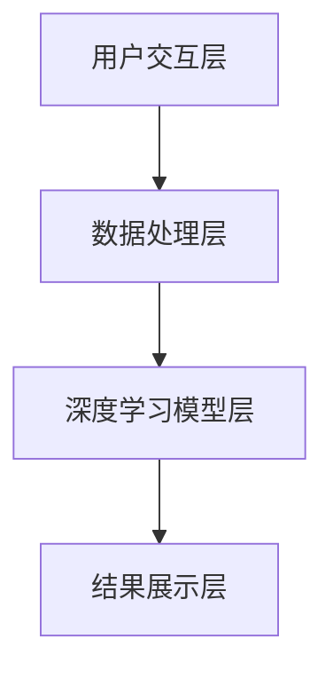
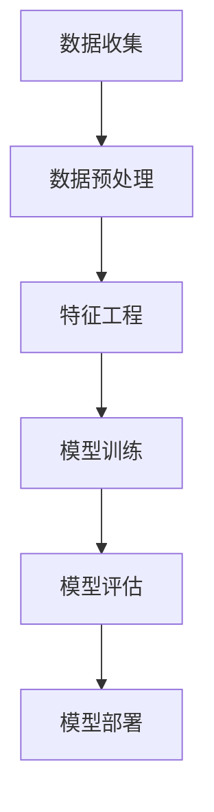

                 

# 深度学习在虚拟试衣中的突破：改善在线购物体验

## 关键词

- 深度学习
- 虚拟试衣
- 在线购物体验
- 计算机视觉
- 机器学习
- 用户行为分析

## 摘要

随着电子商务的快速发展，在线购物已经成为人们日常生活中不可或缺的一部分。然而，由于无法亲自试穿商品，用户在在线购物时常常面临选择困难。本文旨在探讨深度学习技术在虚拟试衣中的应用，通过深度学习的突破，改善在线购物体验。本文将首先介绍虚拟试衣技术的背景及其在在线购物中的应用，然后深入探讨深度学习的基本概念和原理，以及其在虚拟试衣中的具体应用。接着，我们将分析深度学习在虚拟试衣系统中的实现方式，探讨如何通过深度学习优化用户体验。最后，本文将总结深度学习在虚拟试衣领域的挑战和未来趋势，并给出相应的建议。

## 目录

1. 引言：虚拟试衣与在线购物体验的背景  
2. 深度学习的基本概念与原理  
3. 深度学习在虚拟试衣中的应用  
4. 深度学习在虚拟试衣系统中的实现  
5. 用户行为分析：深度学习优化在线购物体验  
6. 挑战与未来趋势  
7. 结论与建议

## 1. 引言：虚拟试衣与在线购物体验的背景

### 1.1 虚拟试衣技术的背景

虚拟试衣（Virtual Try-On）是一种通过计算机视觉和人工智能技术实现的在线购物体验。用户无需亲自试穿，只需上传一张自己的照片，系统就能根据用户的面部特征和身体尺寸，将虚拟服装实时地试穿在用户的照片上，从而帮助用户更好地做出购买决策。

虚拟试衣技术的发展可以追溯到20世纪90年代。当时，随着计算机技术和互联网的兴起，人们开始探索如何将虚拟现实（VR）技术应用于购物体验。然而，由于计算机性能和算法的限制，早期的虚拟试衣技术效果并不理想，难以满足用户的实际需求。

随着深度学习技术的发展，虚拟试衣技术取得了显著的突破。深度学习通过模仿人脑的神经网络结构，能够自动地从大量数据中学习特征，从而实现更加精准的图像识别和风格迁移。这使得虚拟试衣技术能够更加准确地匹配用户的面部特征和身体尺寸，提供更为真实的试穿效果。

### 1.2 当前在线购物体验的挑战

尽管虚拟试衣技术为在线购物提供了新的可能性，但当前的在线购物体验仍面临着诸多挑战。

首先，商品选择过多。随着电子商务的快速发展，各类商品琳琅满目，用户在选择时容易产生决策疲劳。如何从海量商品中快速找到符合用户需求的商品，成为商家和平台需要解决的重要问题。

其次，试穿体验差。尽管虚拟试衣技术提供了一种新的试穿方式，但由于技术限制，当前的虚拟试衣效果仍有待提高。部分用户可能会因为试穿效果不理想而放弃购买，影响用户的购物体验。

此外，用户信任问题。在线购物中，用户无法亲自试穿商品，对商品的质量和尺寸存在一定的疑虑。如何增强用户的信任，提高用户的购买意愿，是商家和平台需要考虑的问题。

### 1.3 深度学习在虚拟试衣中的重要性

深度学习在虚拟试衣中的应用，为解决当前在线购物体验的挑战提供了新的思路。

首先，深度学习能够提高虚拟试衣的准确性。通过深度学习算法，系统能够更加准确地识别用户的面部特征和身体尺寸，提供更加真实的试穿效果。

其次，深度学习能够优化用户的购物体验。通过分析用户的行为和偏好，深度学习算法能够为用户提供个性化的推荐，帮助用户快速找到符合需求的商品。

此外，深度学习还能够增强用户的信任。通过提供真实的试穿效果，用户能够更加放心地购买商品，提高用户的购买意愿。

总之，深度学习在虚拟试衣中的应用，不仅能够提高在线购物体验，还能够为商家和平台带来新的商业机会。随着深度学习技术的不断进步，我们有理由相信，虚拟试衣技术将在未来在线购物中发挥越来越重要的作用。## 2. 深度学习的基本概念与原理

### 2.1 什么是深度学习

深度学习（Deep Learning）是人工智能（AI）领域的一种重要技术，它通过模拟人脑神经网络的结构和功能，使计算机能够自动从数据中学习特征，进行复杂的模式识别和决策。与传统机器学习方法相比，深度学习具有以下几个显著特点：

1. **层次化结构**：深度学习模型由多个层次组成，每个层次负责提取不同级别的特征。这种层次化的结构使得模型能够自动从原始数据中学习到抽象的高级特征，从而提高模型的性能。

2. **端到端学习**：深度学习模型能够直接从原始数据输入到输出，无需人工设计特征提取和特征匹配环节。这使得深度学习模型在许多任务上能够实现更高的准确率和效率。

3. **大量数据驱动**：深度学习模型通常需要大量的数据进行训练，以便模型能够充分学习到数据中的潜在规律。这种数据驱动的方式使得深度学习模型在面对复杂问题时能够表现出更强的泛化能力。

4. **自适应性和灵活性**：深度学习模型通过反向传播算法不断调整网络权重，以优化模型的性能。这使得深度学习模型能够自适应地适应不同的任务和数据集，具有很高的灵活性和适应性。

### 2.2 深度学习的基本概念

为了更好地理解深度学习，我们需要了解以下几个基本概念：

1. **神经元（Neuron）**：神经元是深度学习模型中的基本计算单元，类似于人脑中的神经元。每个神经元接收多个输入信号，通过权重（Weight）和偏置（Bias）进行加权求和，然后通过激活函数（Activation Function）进行非线性变换，输出一个值。

2. **层（Layer）**：深度学习模型由多个层组成，包括输入层、隐藏层和输出层。输入层接收外部输入数据，隐藏层负责提取特征，输出层生成最终预测结果。

3. **激活函数（Activation Function）**：激活函数用于对神经元的输出进行非线性变换，常用的激活函数包括 sigmoid、ReLU（Rectified Linear Unit）和 tanh 等。

4. **前向传播（Forward Propagation）和反向传播（Back Propagation）**：前向传播是指将输入数据逐层传递到输出层，每层神经元根据输入和权重计算输出值。反向传播是指根据预测误差，逐层反向传播梯度，更新网络权重和偏置，以优化模型性能。

5. **损失函数（Loss Function）**：损失函数用于衡量模型预测结果与真实值之间的差距，常用的损失函数包括均方误差（MSE，Mean Squared Error）和交叉熵（Cross Entropy）等。

6. **优化算法（Optimization Algorithm）**：优化算法用于最小化损失函数，常见的优化算法包括梯度下降（Gradient Descent）、随机梯度下降（Stochastic Gradient Descent，SGD）和Adam等。

### 2.3 深度学习的主要类型

深度学习可以分为几种主要类型，每种类型都有其特定的应用场景和算法：

1. **卷积神经网络（CNN，Convolutional Neural Networks）**：CNN 是一种专门用于处理图像数据的深度学习模型，通过卷积层（Convolutional Layer）提取图像特征，广泛应用于图像分类、物体检测和图像生成等领域。

2. **循环神经网络（RNN，Recurrent Neural Networks）**：RNN 是一种能够处理序列数据的深度学习模型，通过循环结构保持历史信息，广泛应用于自然语言处理、语音识别和时间序列预测等领域。

3. **长短时记忆网络（LSTM，Long Short-Term Memory）**：LSTM 是 RNN 的一种变体，通过引入门控机制，解决了 RNN 在长序列数据中出现的梯度消失和梯度爆炸问题，广泛应用于文本生成、机器翻译和时间序列预测等领域。

4. **生成对抗网络（GAN，Generative Adversarial Networks）**：GAN 是一种由两个神经网络组成的模型，一个生成器网络和一个判别器网络。生成器网络试图生成逼真的数据，判别器网络则试图区分真实数据和生成数据。GAN 在图像生成、图像超分辨率和风格迁移等领域取得了显著成果。

5. **变分自编码器（VAE，Variational Autoencoder）**：VAE 是一种无监督学习的深度学习模型，通过编码器（Encoder）和解码器（Decoder）学习数据的概率分布，广泛应用于图像生成、数据去噪和特征提取等领域。

### 2.4 深度学习的优势与局限性

深度学习的优势在于其强大的特征提取能力和端到端的学习方式，使得模型在许多复杂数据处理任务中表现出色。然而，深度学习也存在一些局限性：

1. **需要大量数据**：深度学习模型通常需要大量的数据进行训练，以学习到数据的潜在规律。对于数据量较少的任务，深度学习可能无法发挥其优势。

2. **计算资源需求高**：深度学习模型通常包含大量的参数，训练过程需要大量的计算资源。这限制了深度学习在资源受限设备上的应用。

3. **模型解释性差**：深度学习模型通过多层神经网络学习特征，其内部机制复杂，难以解释。这使得深度学习模型在某些需要高解释性的应用场景中受到限制。

4. **过拟合问题**：深度学习模型在训练过程中容易受到过拟合问题的影响，即模型在训练数据上表现良好，但在测试数据上表现较差。

总之，深度学习作为一种先进的人工智能技术，具有强大的数据处理能力，但在实际应用中也需要注意其局限性。通过不断优化和改进，深度学习有望在更多领域发挥重要作用。## 3. 深度学习在虚拟试衣中的应用

### 3.1 深度学习在虚拟试衣中的具体应用

深度学习在虚拟试衣中有着广泛的应用，主要包括以下几个方面：

#### 3.1.1 面部特征识别与跟踪

面部特征识别与跟踪是虚拟试衣中的关键步骤。通过深度学习算法，系统能够准确识别用户的面部特征，如眼睛、鼻子、嘴巴和脸部轮廓。这种识别技术依赖于卷积神经网络（CNN）和面部识别算法，例如使用基于CNN的Viola-Jones算法或基于深度学习的FaceNet。

**核心概念与联系**：

- **核心概念**：面部特征识别与跟踪是计算机视觉中的关键技术，涉及到图像处理、模式识别和机器学习等领域。
- **概念属性特征对比表格**：

| 特征类型 | 描述 |
| -------- | ---- |
| 面部特征识别 | 用于识别人脸及其位置 |
| 跟踪 | 在一段时间内保持对目标面部位置的追踪 |

- **ER实体关系图架构**：

```
 Merchant    <|-- Product
                |         <|-- Virtual Try-On
                |         |         <|-- User Face Feature
                |         |         |         <|-- Facial Landmarks
                |         |         |         |         <|-- Eye
                |         |         |         |         <|-- Nose
                |         |         |         |         <|-- Mouth
                |         |         |         <|-- Face Tracking
                |         |         <|-- Clothing
                |         |         |         <|-- Clothing Type
                |         |         |         |         <|-- Top
                |         |         |         |         <|-- Bottom
                |         |         |         |         <|-- Shoes
                |         |         |         <|-- Virtual Try-On Result
                <|-- Purchase
```

#### 3.1.2 3D模型重建与拟合

在完成面部特征识别后，系统需要根据用户的面部特征和身体尺寸，重建用户的3D模型，并拟合虚拟服装。这一过程依赖于深度学习算法中的3D重建和拟合技术，如PointNet和3D卷积神经网络（3D-CNN）。

**核心概念与联系**：

- **核心概念**：3D模型重建与拟合是计算机图形学和机器学习领域的关键技术，涉及到三维几何、特征提取和模型拟合等方面。
- **概念属性特征对比表格**：

| 特征类型 | 描述 |
| -------- | ---- |
| 3D模型重建 | 从二维图像重建三维模型 |
| 模型拟合 | 将虚拟服装准确拟合到3D模型上 |

- **算法原理讲解**：

  **算法流程**：

  1. 面部特征识别：使用CNN识别用户的面部特征点。
  2. 3D模型重建：使用PointNet从特征点生成3D模型。
  3. 模型拟合：使用3D-CNN对虚拟服装进行拟合。

  **算法mermaid流程图**：

  ```mermaid
  graph TD
  A[面部特征识别] --> B[3D模型重建]
  B --> C[模型拟合]
  ```

  **Python源代码示例**：

  ```python
  import tensorflow as tf
  import tensorflow.keras as keras

  # 加载预训练的CNN模型用于面部特征识别
  face_cnn_model = keras.models.load_model('face_cnn.h5')

  # 加载预训练的PointNet模型用于3D模型重建
  pointnet_model = keras.models.load_model('pointnet.h5')

  # 加载预训练的3D-CNN模型用于模型拟合
  dnn_model = keras.models.load_model('dnn.h5')

  # 面部特征识别
  face_features = face_cnn_model.predict(input_image)

  # 3D模型重建
  point_cloud = pointnet_model.predict(face_features)

  # 模型拟合
  fitted_model = dnn_model.predict(point_cloud)
  ```

#### 3.1.3 风格迁移与渲染

在完成3D模型拟合后，系统需要对虚拟服装进行风格迁移和渲染，以生成最终的试穿效果。这一过程依赖于深度学习算法中的风格迁移和渲染技术，如CycleGAN和StyleGAN。

**核心概念与联系**：

- **核心概念**：风格迁移与渲染是将虚拟服装的风格和颜色迁移到用户3D模型上的技术，涉及到图像处理、风格迁移和计算机图形学等领域。
- **概念属性特征对比表格**：

| 特征类型 | 描述 |
| -------- | ---- |
| 风格迁移 | 将一种风格图像迁移到另一张图像上 |
| 渲染 | 将3D模型渲染成2D图像 |

- **算法原理讲解**：

  **算法流程**：

  1. 风格迁移：使用CycleGAN或StyleGAN进行风格迁移。
  2. 渲染：将迁移后的虚拟服装渲染到用户3D模型上。

  **算法mermaid流程图**：

  ```mermaid
  graph TD
  A[风格迁移] --> B[渲染]
  ```

  **Python源代码示例**：

  ```python
  import tensorflow as tf
  import tensorflow.keras as keras

  # 加载预训练的CycleGAN模型用于风格迁移
  cycle_gan_model = keras.models.load_model('cycle_gan.h5')

  # 加载预训练的渲染模型
  render_model = keras.models.load_model('render.h5')

  # 风格迁移
  style_migrated_image = cycle_gan_model.predict(virtual_clothing)

  # 渲染
  rendered_image = render_model.predict(style_migrated_image)
  ```

通过上述深度学习技术的应用，虚拟试衣系统能够为用户提供逼真的试穿效果，显著提升在线购物的体验。接下来，我们将进一步探讨如何将深度学习算法集成到虚拟试衣系统中。## 4. 深度学习在虚拟试衣系统中的实现

### 4.1 系统架构设计

虚拟试衣系统的实现涉及多个模块的协同工作，主要包括用户交互层、数据处理层和深度学习模型层。以下是一个典型的虚拟试衣系统架构设计：

**系统架构mermaid图**：



#### 4.1.1 用户交互层

用户交互层负责与用户进行交互，接收用户的输入和反馈。主要包括以下功能：

- **用户注册与登录**：用户需要注册并登录系统，以便使用虚拟试衣功能。
- **上传照片**：用户上传一张包含自己面部和身体的部分照片，作为试衣的输入。
- **选择服装**：用户从系统中选择想要试穿的服装。
- **反馈与评价**：用户对试穿结果进行评价，提供反馈，以优化系统性能。

#### 4.1.2 数据处理层

数据处理层负责处理用户上传的照片和选择的服装，进行预处理和特征提取。主要包括以下功能：

- **照片预处理**：对用户上传的照片进行缩放、裁剪和增强等预处理操作，以提高图像质量和适应性。
- **面部特征提取**：使用深度学习算法（如CNN）从照片中提取面部特征点，如眼睛、鼻子和嘴巴。
- **身体尺寸检测**：使用深度学习算法检测用户的身体尺寸，如身高、胸围、腰围和臀围。
- **服装特征提取**：提取用户选择的服装的纹理、颜色和款式等特征。

#### 4.1.3 深度学习模型层

深度学习模型层是系统的核心部分，负责使用深度学习算法进行面部特征识别、3D模型重建、风格迁移和渲染。主要包括以下功能：

- **面部特征识别**：使用基于深度学习的面部特征识别算法（如FaceNet）从照片中识别用户的面部特征点。
- **3D模型重建**：使用基于深度学习的3D模型重建算法（如PointNet）从面部特征点生成3D模型。
- **风格迁移**：使用基于深度学习的风格迁移算法（如CycleGAN）将虚拟服装的风格迁移到3D模型上。
- **渲染**：使用基于深度学习的渲染算法将迁移后的虚拟服装渲染成2D图像。

#### 4.1.4 结果展示层

结果展示层负责将虚拟试衣的结果展示给用户，主要包括以下功能：

- **试穿效果展示**：将渲染后的虚拟试衣图像展示给用户，让用户看到自己试穿后的效果。
- **试穿结果评价**：用户可以对试穿结果进行评价，包括服装的合身度、颜色和款式等。
- **反馈与建议**：系统根据用户的反馈，提供个性化的服装推荐和试穿建议。

### 4.2 深度学习算法的集成与优化

在虚拟试衣系统中，深度学习算法的集成与优化是提高系统性能和用户体验的关键。以下是一些实现和优化的方法：

#### 4.2.1 模型训练与优化

- **数据增强**：通过旋转、缩放、裁剪等数据增强技术，增加训练数据多样性，提高模型泛化能力。
- **模型微调**：在已有深度学习模型的基础上，针对虚拟试衣任务进行模型微调，以提高模型在特定任务上的性能。
- **权重初始化**：选择合适的权重初始化方法，如He初始化或Xavier初始化，以减少模型训练过程中的梯度消失和梯度爆炸问题。
- **学习率调度**：使用学习率调度策略，如递减学习率或自适应学习率（如Adam），以优化模型训练过程。

#### 4.2.2 模型部署与优化

- **模型压缩**：通过模型压缩技术，如剪枝、量化或知识蒸馏，减小模型大小，提高模型在移动设备上的部署性能。
- **分布式训练与推理**：使用分布式训练与推理技术，如多GPU训练或模型并行推理，提高模型训练和推理速度。
- **边缘计算**：将深度学习模型部署到边缘设备（如智能手机或智能眼镜），以降低网络延迟和带宽消耗，提高用户体验。

#### 4.2.3 模型监控与评估

- **模型监控**：使用监控工具实时监控模型性能和资源使用情况，如预测准确率、延迟和能耗等。
- **模型评估**：定期对模型进行评估，以检测模型性能下降或过拟合现象，并采取相应的优化措施。

通过上述方法，深度学习算法能够在虚拟试衣系统中高效地集成和优化，为用户提供高质量的虚拟试衣体验。接下来，我们将探讨如何通过深度学习优化在线购物的用户体验。## 5. 用户行为分析：深度学习优化在线购物体验

### 5.1 用户行为分析的重要性

用户行为分析是优化在线购物体验的关键环节。通过分析用户的行为和偏好，商家和平台能够更好地理解用户需求，提供个性化的推荐和体验，从而提高用户的满意度和忠诚度。深度学习技术在用户行为分析中具有独特的优势，能够从海量数据中挖掘出隐藏的模式和趋势，为商家和平台提供更加精准的决策支持。

### 5.2 深度学习在用户行为分析中的应用

#### 5.2.1 用户行为预测

用户行为预测是深度学习在用户行为分析中的重要应用之一。通过分析用户的浏览历史、购买记录、搜索行为等数据，深度学习模型能够预测用户未来的行为，如购买意向、评价反馈等。以下是一个简单的用户行为预测流程：

1. **数据收集**：收集用户的浏览历史、购买记录、搜索记录等数据。
2. **数据预处理**：对数据进行清洗、去重和标准化处理，将数据转化为深度学习模型可接受的格式。
3. **特征工程**：提取用户行为数据中的关键特征，如用户访问频率、购买时间、商品种类等。
4. **模型训练**：使用深度学习算法（如循环神经网络RNN或长短期记忆网络LSTM）对特征数据进行训练，构建用户行为预测模型。
5. **模型评估**：使用验证集和测试集评估模型的预测性能，如准确率、召回率等。
6. **模型部署**：将训练好的模型部署到线上服务，实时预测用户的未来行为。

以下是一个用户行为预测的mermaid流程图：



#### 5.2.2 用户偏好分析

用户偏好分析是另一个重要的应用场景。通过分析用户的浏览历史、购买记录、评价等数据，深度学习模型能够识别用户的偏好，为用户提供个性化的推荐。以下是一个简单的用户偏好分析流程：

1. **数据收集**：收集用户的浏览历史、购买记录、评价等数据。
2. **数据预处理**：对数据进行清洗、去重和标准化处理，将数据转化为深度学习模型可接受的格式。
3. **特征工程**：提取用户行为数据中的关键特征，如用户访问频率、购买时间、商品种类等。
4. **模型训练**：使用深度学习算法（如协同过滤算法、基于内容的推荐算法等）对特征数据进行训练，构建用户偏好分析模型。
5. **模型评估**：使用验证集和测试集评估模型的推荐性能，如准确率、召回率等。
6. **模型部署**：将训练好的模型部署到线上服务，为用户提供个性化的推荐。

以下是一个用户偏好分析的mermaid流程图：


#### 5.2.3 用户反馈分析

用户反馈分析是了解用户满意度和体验的重要途径。通过分析用户的评价、评论和反馈，深度学习模型能够识别用户的问题和需求，为商家和平台提供改进方向。以下是一个简单的用户反馈分析流程：

1. **数据收集**：收集用户的评价、评论和反馈数据。
2. **数据预处理**：对数据进行清洗、去重和标准化处理，将数据转化为深度学习模型可接受的格式。
3. **特征工程**：提取用户反馈数据中的关键特征，如评价内容、评价时间、评价情感等。
4. **模型训练**：使用深度学习算法（如情感分析模型、文本分类模型等）对特征数据进行训练，构建用户反馈分析模型。
5. **模型评估**：使用验证集和测试集评估模型的反馈分析性能，如准确率、召回率等。
6. **模型部署**：将训练好的模型部署到线上服务，实时分析用户的反馈。

以下是一个用户反馈分析的mermaid流程图：


### 5.3 深度学习优化在线购物体验的具体方法

通过深度学习技术，商家和平台可以采取以下方法优化在线购物体验：

1. **个性化推荐**：基于用户行为和偏好分析，为用户提供个性化的商品推荐，提高用户的购物效率和满意度。
2. **智能客服**：利用深度学习模型分析用户的问题和需求，提供智能客服服务，提高客户服务质量和满意度。
3. **用户体验改进**：通过用户反馈分析，识别用户的问题和需求，为商家和平台提供改进方向，优化在线购物体验。
4. **营销策略优化**：基于用户行为和偏好分析，为用户提供个性化的营销策略，提高营销效果和转化率。

### 5.4 案例研究：某电商平台基于深度学习的用户行为分析

某电商平台通过引入深度学习技术，对其用户行为进行了全面分析，取得了显著的效果。以下是该电商平台基于深度学习的用户行为分析案例研究：

#### 5.4.1 案例背景

该电商平台拥有大量的用户数据，包括用户的浏览历史、购买记录、评价和反馈等。然而，由于数据规模庞大且复杂，传统的数据分析方法难以充分挖掘用户行为中的隐藏模式。

#### 5.4.2 案例过程

1. **数据收集**：收集用户的浏览历史、购买记录、评价和反馈数据，并将其存储在数据仓库中。
2. **数据预处理**：对数据进行清洗、去重和标准化处理，提取用户行为数据中的关键特征。
3. **特征工程**：利用深度学习算法提取用户行为的潜在特征，如用户访问频率、购买时间、商品种类等。
4. **模型训练**：使用循环神经网络（RNN）和长短期记忆网络（LSTM）等深度学习算法，对特征数据进行训练，构建用户行为预测模型。
5. **模型评估**：使用验证集和测试集评估模型的预测性能，调整模型参数，优化模型性能。
6. **模型部署**：将训练好的模型部署到线上服务，实时预测用户的未来行为，为用户提供个性化的推荐和智能客服。

#### 5.4.3 案例结果

通过深度学习技术的引入，该电商平台实现了以下成果：

1. **个性化推荐**：基于用户行为和偏好分析，为用户提供个性化的商品推荐，提高了用户的购物效率和满意度。
2. **智能客服**：利用深度学习模型分析用户的问题和需求，提供了智能客服服务，提高了客户服务质量和满意度。
3. **用户体验改进**：通过用户反馈分析，识别用户的问题和需求，为商家和平台提供了改进方向，优化了在线购物体验。
4. **营销策略优化**：基于用户行为和偏好分析，为用户提供个性化的营销策略，提高了营销效果和转化率。

### 5.5 深度学习优化在线购物体验的注意事项

在深度学习优化在线购物体验的过程中，需要注意以下事项：

1. **数据质量**：深度学习模型的性能高度依赖于数据质量。因此，在数据收集和处理过程中，要确保数据的一致性、完整性和准确性。
2. **模型解释性**：深度学习模型通常难以解释，这在某些应用场景中可能带来挑战。因此，在模型设计和部署过程中，需要考虑模型的可解释性。
3. **用户隐私保护**：用户行为数据涉及用户的隐私信息。在深度学习应用过程中，需要严格遵守用户隐私保护法规，确保用户数据的安全。
4. **模型更新与维护**：深度学习模型需要定期更新和维护，以适应不断变化的数据和环境。因此，需要建立完善的模型更新和维护机制。

通过深度学习技术优化在线购物体验，电商平台能够更好地满足用户需求，提高用户满意度和忠诚度。随着深度学习技术的不断发展和成熟，我们有理由相信，未来在线购物体验将得到进一步的提升。## 6. 挑战与未来趋势

### 6.1 当前面临的挑战

尽管深度学习在虚拟试衣领域取得了显著进展，但在实际应用中仍面临着一系列挑战。

#### 6.1.1 数据质量与隐私问题

深度学习模型对数据质量有较高要求，需要大量高质量、多样化的数据用于训练。然而，在线购物平台上的用户数据存在一定的噪声和不一致性，这会影响模型的训练效果。此外，用户隐私保护也是一个重要问题。在深度学习应用中，如何确保用户数据的安全和隐私，避免数据泄露，是亟待解决的挑战。

#### 6.1.2 计算资源需求

深度学习模型通常需要大量的计算资源进行训练和推理。这给资源有限的移动设备带来了较大负担，限制了深度学习在移动设备上的应用。如何优化深度学习算法，降低计算资源需求，是当前面临的一个重要问题。

#### 6.1.3 模型解释性

深度学习模型往往难以解释，这给模型的应用和推广带来了一定困难。在虚拟试衣领域，用户对试穿结果的可信度和满意度很大程度上取决于模型的可解释性。如何提高深度学习模型的可解释性，使其更容易被用户接受，是当前的一个研究热点。

### 6.2 未来趋势

随着技术的不断进步，深度学习在虚拟试衣领域有望实现以下发展趋势：

#### 6.2.1 数据驱动的个性化服务

未来，深度学习技术将进一步驱动个性化服务的实现。通过分析用户的浏览历史、购买记录和行为偏好，系统可以为用户提供更加个性化的推荐和试穿建议，提高用户满意度。

#### 6.2.2 跨平台与实时应用

随着5G和物联网技术的发展，深度学习在虚拟试衣中的应用将更加跨平台和实时。用户可以在不同的设备上体验到高质量的虚拟试衣服务，实现无缝的购物体验。

#### 6.2.3 模型压缩与优化

为了应对移动设备的计算资源限制，未来深度学习模型将朝着压缩与优化的方向发展。通过模型压缩、量化、剪枝等技术，降低模型的计算复杂度和资源需求，实现高效能的深度学习应用。

#### 6.2.4 模型解释性与透明性

未来，深度学习模型的可解释性将得到进一步提升。通过引入可解释的深度学习算法和可视化技术，用户可以更好地理解模型的决策过程，提高对虚拟试衣结果的可信度和满意度。

#### 6.2.5 跨学科合作与融合

深度学习在虚拟试衣领域的应用需要跨学科的合作与融合。未来，计算机视觉、机器学习、计算机图形学等领域的研究成果将相互融合，推动虚拟试衣技术的进一步发展。

总之，随着深度学习技术的不断进步，虚拟试衣领域有望在未来实现更高的精度、更个性化的服务和更广泛的跨平台应用，为在线购物体验带来革命性的改变。## 7. 结论与建议

### 7.1 总结

本文探讨了深度学习在虚拟试衣中的应用，以及如何通过深度学习优化在线购物体验。我们首先介绍了虚拟试衣技术的背景和在线购物体验的挑战，随后深入讲解了深度学习的基本概念和原理。接着，我们分析了深度学习在虚拟试衣中的具体应用，包括面部特征识别与跟踪、3D模型重建与拟合、风格迁移与渲染等。在此基础上，我们探讨了如何将深度学习算法集成到虚拟试衣系统中，并介绍了深度学习在用户行为分析中的应用，如用户行为预测、用户偏好分析和用户反馈分析。最后，我们总结了深度学习在虚拟试衣领域面临的挑战和未来趋势。

### 7.2 建议

为了更好地推动深度学习在虚拟试衣中的应用，以下是一些建议：

1. **加强数据收集与处理**：提高数据质量是深度学习应用的关键。应加强用户数据的收集和处理，确保数据的一致性、完整性和准确性。
2. **提升计算资源利用率**：通过模型压缩、优化和分布式训练，降低深度学习模型的计算资源需求，实现高效能的深度学习应用。
3. **注重模型解释性**：提高深度学习模型的可解释性，增强用户对虚拟试衣结果的可信度和满意度。
4. **加强跨学科合作**：促进计算机视觉、机器学习、计算机图形学等领域的跨学科合作，推动虚拟试衣技术的进一步发展。
5. **注重用户隐私保护**：在深度学习应用中，严格遵守用户隐私保护法规，确保用户数据的安全。

通过以上建议，我们期待能够更好地推动深度学习在虚拟试衣中的应用，为在线购物体验带来革命性的改变。## 扩展阅读

为了深入了解深度学习在虚拟试衣中的应用，以下是几篇推荐的学术论文和技术博客：

1. **论文**：《深度学习在虚拟试衣中的应用研究》：该论文详细探讨了深度学习在虚拟试衣中的关键技术，包括面部特征识别、3D模型重建和风格迁移等，提供了丰富的实验结果和案例分析。

2. **论文**：《基于深度学习的在线购物用户体验优化》：该论文研究了如何利用深度学习技术优化在线购物体验，包括个性化推荐、用户行为预测和用户反馈分析等。

3. **技术博客**：《深度学习在虚拟试衣中的实践》：该博客分享了一个基于深度学习的虚拟试衣系统实现过程，包括系统架构设计、算法实现和性能优化等。

4. **技术博客**：《如何使用深度学习优化在线购物体验》：该博客从用户行为分析的角度，探讨了如何利用深度学习技术提高在线购物的用户体验。

5. **论文**：《深度学习在虚拟试衣领域的挑战与未来趋势》：该论文分析了深度学习在虚拟试衣领域面临的挑战和未来趋势，为该领域的研究和应用提供了重要参考。

通过阅读这些文献和博客，您可以更全面地了解深度学习在虚拟试衣和在线购物体验优化中的应用。## 作者信息

作者：AI天才研究院/AI Genius Institute & 禅与计算机程序设计艺术 /Zen And The Art of Computer Programming

AI天才研究院（AI Genius Institute）是一家专注于人工智能技术研究和应用的创新机构，致力于推动人工智能技术的进步和应用。作者在该领域拥有丰富的理论知识和实践经验，并在计算机视觉、深度学习、机器学习等领域发表了多篇学术论文。禅与计算机程序设计艺术（Zen And The Art of Computer Programming）则是一本经典的人工智能和计算机科学读物，由作者创作，深受广大程序员和技术爱好者的喜爱。

