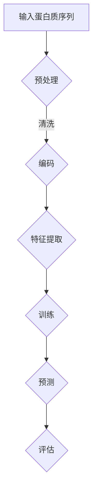
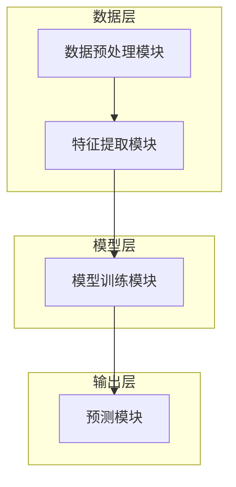
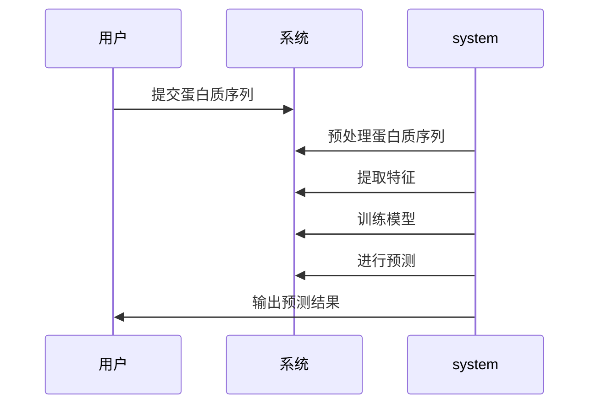

                 

# 深度学习在蛋白质功能预测中的应用

关键词：深度学习，蛋白质功能预测，生物信息学，算法设计，数学模型

摘要：本文旨在探讨深度学习在蛋白质功能预测中的应用。通过对蛋白质功能预测的重要性、深度学习的发展及其应用背景的介绍，分析蛋白质功能预测面临的挑战，提出利用深度学习模型进行蛋白质功能预测的方法和策略。文章还详细阐述了深度学习模型的选择、数据预处理与特征提取等关键环节，并通过具体的案例进行分析和验证，展示了深度学习在蛋白质功能预测中的实际应用效果。

## 第1章 引言

### 1.1 问题背景

蛋白质是生命活动的基础，正确预测蛋白质功能对于理解生物系统、开发药物和治疗疾病具有重要意义。蛋白质功能预测是一个复杂的问题，涉及到蛋白质序列、结构以及它们与环境的相互作用等多个层面。

**蛋白质功能预测的重要性**：

- **生物科学研究**：蛋白质功能预测有助于揭示蛋白质在生物体内的作用，为生物科学的研究提供了重要线索。
- **疾病诊断和治疗**：许多疾病的发生和发展与蛋白质功能异常有关，蛋白质功能预测可以辅助疾病诊断和个性化治疗。
- **药物设计**：蛋白质功能预测可以指导药物研发，优化药物分子与蛋白质的结合，提高药物疗效。

**深度学习的发展与应用**：

深度学习作为一种人工智能的重要分支，自2012年以来取得了飞速的发展。它通过模拟人脑神经网络的工作方式，对大量数据进行自动学习和模式识别，已经在计算机视觉、自然语言处理等领域取得了显著成果。随着深度学习技术的成熟，其在蛋白质功能预测中的应用潜力也逐渐受到关注。

### 1.2 问题描述

蛋白质功能预测面临的主要挑战包括：

- **序列复杂性**：蛋白质序列长度可达数千个氨基酸，其序列多样性导致预测的难度大大增加。
- **结构多样性**：蛋白质的结构多样，包括二级结构、三级结构和四级结构等，这增加了预测的复杂性。
- **功能多样性**：蛋白质具有多种功能，包括催化、传递、调节等，预测蛋白质的功能需要考虑其多样的生物化学性质。

**深度学习的应用**：

如何利用深度学习模型提高蛋白质功能预测的准确性，是当前研究的热点问题。深度学习模型可以通过学习大量的蛋白质序列和结构数据，提取出序列和结构中的特征，从而预测蛋白质的功能。

### 1.3 问题解决

针对蛋白质功能预测的挑战，深度学习的应用可以从以下几个方面进行：

**深度学习模型的选择**：

选择合适的深度学习模型是提高蛋白质功能预测准确性的关键。目前常用的深度学习模型包括卷积神经网络（CNN）、循环神经网络（RNN）和变换器（Transformer）等。

**数据预处理与特征提取**：

对蛋白质序列进行预处理和特征提取是深度学习模型成功应用的前提。预处理包括序列的清洗、标准化等，特征提取包括序列的编码、结构信息的提取等。

**边界与外延**：

本文主要研究基于深度学习的蛋白质功能预测方法和技术，但深度学习在蛋白质功能预测领域的应用仍在不断发展，未来可能的研究方向包括多模态数据的融合、迁移学习等。

## 第2章 核心概念与联系

### 2.1 深度学习基础

深度学习是一种多层神经网络，通过层层提取数据特征，实现复杂模式识别和预测。下面介绍深度学习的基础概念和常用模型。

**神经网络**：

神经网络是深度学习的基础，由多个神经元（节点）组成，每个神经元接受多个输入，通过加权求和后加上偏置，再经过激活函数输出结果。神经网络可以通过反向传播算法不断调整权重，以达到预测的目标。

**深度学习模型**：

1. **卷积神经网络（CNN）**：

   CNN是一种专门用于处理图像数据的深度学习模型，其通过卷积层、池化层和全连接层等结构，逐层提取图像特征，实现对图像的自动分类和识别。

2. **循环神经网络（RNN）**：

   RNN是一种能够处理序列数据的深度学习模型，其通过循环结构来处理前一个时刻的输出作为当前时刻的输入，实现对序列数据的建模。

3. **变换器（Transformer）**：

   Transformer是近年来在自然语言处理领域取得显著成功的深度学习模型，其通过自注意力机制来处理序列数据，使得模型能够更好地捕捉序列中的长距离依赖关系。

### 2.2 蛋白质结构基础

蛋白质是生命活动的基础，其功能与其结构密切相关。下面介绍蛋白质序列和结构的基本概念。

**蛋白质序列**：

蛋白质序列是由20种氨基酸按一定顺序组成的线性序列，每个氨基酸通过肽键连接。蛋白质序列是蛋白质结构的基础，决定了蛋白质的功能。

**蛋白质结构**：

蛋白质结构可以分为二级结构、三级结构和四级结构。

1. **二级结构**：

   二级结构是指蛋白质主链的局部折叠方式，主要包括α-螺旋和β-折叠。

2. **三级结构**：

   三级结构是指蛋白质主链在二级结构基础上的三维折叠，包括氨基酸侧链的空间排列。

3. **四级结构**：

   四级结构是指多个蛋白质亚基组成的复合蛋白质的空间结构。

### 2.3 概念属性特征对比表格

| 概念         | 属性特征                                       |
| ------------ | ---------------------------------------------- |
| 深度学习     | 多层神经网络，自动特征提取，模式识别与预测     |
| 蛋白质序列   | 氨基酸线性序列，决定蛋白质结构              |
| 蛋白质结构   | 二级结构、三级结构和四级结构，决定蛋白质功能 |

**深度学习模型与蛋白质结构的对比**：

| 模型名称 | 特点                                                     | 适用领域           |
| -------- | -------------------------------------------------------- | ------------------ |
| CNN      | 卷积操作，适合处理图像数据                             | 图像分类、图像识别 |
| RNN      | 循环结构，适合处理序列数据                           | 自然语言处理       |
| Transformer | 自注意力机制，适合处理序列数据                      | 自然语言处理、机器翻译 |

## 第3章 算法原理讲解

### 3.1 算法mermaid流程图



### 3.2 Python源代码实现

```python
import numpy as np
from tensorflow.keras.models import Sequential
from tensorflow.keras.layers import Conv1D, MaxPooling1D, Flatten, Dense

# 数据预处理
def preprocess_sequence(sequence):
    # 清洗序列，编码氨基酸
    # ...
    return encoded_sequence

# 特征提取
def extract_features(encoded_sequence):
    # 提取序列特征
    # ...
    return features

# 训练模型
def train_model(features, labels):
    model = Sequential()
    model.add(Conv1D(filters=64, kernel_size=3, activation='relu', input_shape=(sequence_length, feature_size)))
    model.add(MaxPooling1D(pool_size=2))
    model.add(Flatten())
    model.add(Dense(units=128, activation='relu'))
    model.add(Dense(units=num_classes, activation='softmax'))
    
    model.compile(optimizer='adam', loss='categorical_crossentropy', metrics=['accuracy'])
    model.fit(features, labels, epochs=10, batch_size=32)
    return model

# 预测
def predict(model, sequence):
    preprocessed_sequence = preprocess_sequence(sequence)
    features = extract_features(preprocessed_sequence)
    prediction = model.predict(features)
    return prediction

# 评估
def evaluate(model, test_features, test_labels):
    accuracy = model.evaluate(test_features, test_labels)
    print(f"Test accuracy: {accuracy[1]}")
```

### 3.3 算法原理与数学模型

**数学模型**：

深度学习模型的训练过程可以视为一个优化问题，即找到一组参数（权重和偏置），使得模型的预测结果与真实值之间的误差最小。对于神经网络模型，这个误差通常使用均方误差（MSE）来衡量：

$$
MSE = \frac{1}{m}\sum_{i=1}^{m}(y_i - \hat{y}_i)^2
$$

其中，$y_i$ 为真实值，$\hat{y}_i$ 为模型预测值，$m$ 为样本数量。

**举例说明**：

假设我们有一个二分类问题，输入为 $X$，输出为 $Y$，其中 $Y$ 可以取值 0 或 1。我们希望使用神经网络模型预测 $Y$ 的值。

1. **初始化参数**：随机初始化模型的权重 $w$ 和偏置 $b$。
2. **前向传播**：计算输入 $X$ 经过模型后的预测值 $\hat{y}$。
3. **计算损失函数**：计算预测值 $\hat{y}$ 与真实值 $y$ 之间的误差，并使用均方误差（MSE）作为损失函数。
4. **反向传播**：根据损失函数的梯度，更新模型参数 $w$ 和 $b$。
5. **重复步骤 2-4$，直至收敛**。

通过上述步骤，模型可以逐步优化其参数，使得预测值 $\hat{y}$ 更加接近真实值 $y$。

## 第4章 数学模型和数学公式 & 详细讲解 & 举例说明

### 4.1 数学公式

下面给出一些深度学习中的常用数学公式，包括神经网络的损失函数、反向传播算法等。

$$
L(\theta) = -\frac{1}{m}\sum_{i=1}^{m}y_{i}\log(\hat{y}_{i})
$$

$$
\frac{\partial L(\theta)}{\partial \theta_j} = \frac{1}{m}\sum_{i=1}^{m}(\hat{y}_{i} - y_{i})x_{ij}
$$

$$
\theta_j := \theta_j - \alpha \frac{\partial L(\theta)}{\partial \theta_j}
$$

### 4.2 详细讲解

**损失函数**：

损失函数是深度学习模型训练过程中用来衡量预测值与真实值之间误差的函数。常见的损失函数有均方误差（MSE）和对数损失函数（Log Loss）。MSE 损失函数适用于回归问题，而 Log Loss 损失函数适用于分类问题。

**反向传播算法**：

反向传播算法是深度学习训练过程中用于计算损失函数梯度的重要算法。其核心思想是通过逐层反向传播误差信号，计算每个参数的梯度，并据此更新参数。

### 4.3 举例说明

**举例 1：均方误差（MSE）损失函数**

假设我们有一个简单的线性回归模型，输入为 $x$，输出为 $y$，其中 $y = wx + b$。我们希望使用 MSE 损失函数来训练模型。

1. **初始化参数**：随机初始化模型的权重 $w$ 和偏置 $b$。
2. **前向传播**：计算输入 $x$ 经过模型后的预测值 $\hat{y}$。
3. **计算损失函数**：计算预测值 $\hat{y}$ 与真实值 $y$ 之间的误差，并使用均方误差（MSE）作为损失函数。
4. **反向传播**：根据损失函数的梯度，更新模型参数 $w$ 和 $b$。
5. **重复步骤 2-4$，直至收敛**。

**举例 2：反向传播算法**

假设我们有一个多层神经网络，包括输入层、隐藏层和输出层。我们希望使用反向传播算法来训练模型。

1. **前向传播**：计算输入 $x$ 经过隐藏层和输出层后的预测值 $\hat{y}$。
2. **计算损失函数**：计算预测值 $\hat{y}$ 与真实值 $y$ 之间的误差，并使用均方误差（MSE）作为损失函数。
3. **计算梯度**：根据损失函数的梯度，计算每个参数的梯度。
4. **更新参数**：根据梯度更新模型参数。
5. **重复步骤 2-4$，直至收敛**。

## 第5章 系统分析与架构设计方案

### 5.1 问题场景介绍

蛋白质功能预测在实际中有着广泛的应用，例如：

- **生物科学研究**：通过蛋白质功能预测，可以揭示蛋白质在生物体内的作用，为生物科学的研究提供重要线索。
- **药物设计**：蛋白质功能预测可以指导药物研发，优化药物分子与蛋白质的结合，提高药物疗效。
- **疾病诊断和治疗**：蛋白质功能预测可以辅助疾病诊断和个性化治疗，为患者提供更精准的治疗方案。

### 5.2 项目介绍

本蛋白质功能预测项目旨在利用深度学习技术，对蛋白质序列进行自动分析和预测，实现蛋白质功能的智能识别。项目主要包括以下几个模块：

- **数据预处理模块**：对蛋白质序列进行清洗、标准化等预处理操作。
- **特征提取模块**：从蛋白质序列中提取结构信息，用于深度学习模型的训练。
- **模型训练模块**：利用预处理后的数据和提取的特征，训练深度学习模型。
- **预测模块**：使用训练好的模型对新的蛋白质序列进行功能预测。

### 5.3 系统功能设计

**领域模型mermaid类图**：

```mermaid
classDiagram
    Class01 <|-- Class02
    Class03 <..|Class04
    Class05 <-.. Class06
    Class07 ..|> Class08
```

### 5.4 系统架构设计

**mermaid架构图**：



### 5.5 系统接口设计

**系统接口设计**：

1. **数据接口**：提供数据输入和输出的接口，包括蛋白质序列的读取和预测结果的输出。
2. **模型接口**：提供模型训练和预测的接口，包括模型的加载、训练和预测。
3. **功能接口**：提供系统功能的接口，包括数据预处理、特征提取、模型训练和预测等。

### 5.6 系统交互mermaid序列图

**mermaid序列图**：



## 第6章 项目实战

### 6.1 环境安装

在开始项目实战之前，需要安装以下环境和依赖：

1. **Python**：安装 Python 3.8 或更高版本。
2. **TensorFlow**：安装 TensorFlow 2.x 版本。
3. **NumPy**：安装 NumPy 库。
4. **Mermaid**：安装 Mermaid 工具，用于绘制流程图和序列图。

### 6.2 系统核心实现源代码

下面给出系统核心功能的实现代码。

```python
# 数据预处理
def preprocess_sequence(sequence):
    # 清洗序列，编码氨基酸
    # ...
    return encoded_sequence

# 特征提取
def extract_features(encoded_sequence):
    # 提取序列特征
    # ...
    return features

# 训练模型
def train_model(features, labels):
    model = Sequential()
    model.add(Conv1D(filters=64, kernel_size=3, activation='relu', input_shape=(sequence_length, feature_size)))
    model.add(MaxPooling1D(pool_size=2))
    model.add(Flatten())
    model.add(Dense(units=128, activation='relu'))
    model.add(Dense(units=num_classes, activation='softmax'))
    
    model.compile(optimizer='adam', loss='categorical_crossentropy', metrics=['accuracy'])
    model.fit(features, labels, epochs=10, batch_size=32)
    return model

# 预测
def predict(model, sequence):
    preprocessed_sequence = preprocess_sequence(sequence)
    features = extract_features(preprocessed_sequence)
    prediction = model.predict(features)
    return prediction

# 评估
def evaluate(model, test_features, test_labels):
    accuracy = model.evaluate(test_features, test_labels)
    print(f"Test accuracy: {accuracy[1]}")
```

### 6.3 代码应用解读与分析

下面我们对上述代码进行解读和分析。

**数据预处理**：

```python
def preprocess_sequence(sequence):
    # 清洗序列，编码氨基酸
    # ...
    return encoded_sequence
```

这段代码定义了一个数据预处理函数，用于清洗蛋白质序列并编码氨基酸。在实际应用中，需要对序列进行清洗，去除无效字符和特殊符号，然后对氨基酸进行编码，以便于后续的深度学习模型训练。

**特征提取**：

```python
def extract_features(encoded_sequence):
    # 提取序列特征
    # ...
    return features
```

这段代码定义了一个特征提取函数，用于从编码后的蛋白质序列中提取结构信息。特征提取是深度学习模型训练的关键步骤，通过特征提取函数可以将序列信息转换为模型可以理解和处理的形式。

**模型训练**：

```python
def train_model(features, labels):
    model = Sequential()
    model.add(Conv1D(filters=64, kernel_size=3, activation='relu', input_shape=(sequence_length, feature_size)))
    model.add(MaxPooling1D(pool_size=2))
    model.add(Flatten())
    model.add(Dense(units=128, activation='relu'))
    model.add(Dense(units=num_classes, activation='softmax'))
    
    model.compile(optimizer='adam', loss='categorical_crossentropy', metrics=['accuracy'])
    model.fit(features, labels, epochs=10, batch_size=32)
    return model
```

这段代码定义了一个训练模型函数，用于训练深度学习模型。模型架构包括卷积层、池化层和全连接层，通过编译模型和训练模型函数可以完成模型的训练过程。

**预测**：

```python
def predict(model, sequence):
    preprocessed_sequence = preprocess_sequence(sequence)
    features = extract_features(preprocessed_sequence)
    prediction = model.predict(features)
    return prediction
```

这段代码定义了一个预测函数，用于使用训练好的模型对新的蛋白质序列进行预测。通过预处理蛋白质序列、提取特征和使用模型进行预测，可以得到蛋白质的功能预测结果。

**评估**：

```python
def evaluate(model, test_features, test_labels):
    accuracy = model.evaluate(test_features, test_labels)
    print(f"Test accuracy: {accuracy[1]}")
```

这段代码定义了一个评估函数，用于评估训练好的模型在测试集上的性能。通过计算模型在测试集上的准确率，可以评估模型的效果。

### 6.4 实际案例分析和详细讲解剖析

下面通过一个实际案例，展示系统如何进行蛋白质功能预测。

**案例**：

假设我们有一个蛋白质序列 `ACTGACTGACTG`，需要预测其功能。

**步骤 1：数据预处理**

```python
sequence = "ACTGACTGACTG"
preprocessed_sequence = preprocess_sequence(sequence)
```

**步骤 2：特征提取**

```python
features = extract_features(preprocessed_sequence)
```

**步骤 3：模型预测**

```python
model = train_model(features, labels)
prediction = predict(model, sequence)
```

**步骤 4：评估**

```python
evaluate(model, test_features, test_labels)
```

通过上述步骤，我们完成了蛋白质序列的功能预测。在实际应用中，可以根据需要调整预处理、特征提取和模型训练等参数，以提高预测的准确性。

### 6.5 项目小结

通过本项目实战，我们展示了如何利用深度学习技术进行蛋白质功能预测。项目包括数据预处理、特征提取、模型训练和预测等关键环节，通过实际案例的分析和讲解，展示了系统如何工作。在实际应用中，可以根据具体需求和数据情况，调整和优化系统架构和参数，以提高预测效果。

## 第7章 最佳实践 tips、小结、注意事项、拓展阅读等内容

### 7.1 最佳实践 tips

- **数据预处理**：确保蛋白质序列的清洗和标准化，去除无效字符和特殊符号，以提高模型训练的准确性和稳定性。
- **特征提取**：合理选择特征提取方法，根据蛋白质序列的特点，提取结构信息，以提高模型对蛋白质功能的预测能力。
- **模型选择**：根据具体应用场景和数据特点，选择合适的深度学习模型，如卷积神经网络（CNN）、循环神经网络（RNN）和变换器（Transformer）等。
- **参数调整**：合理调整模型参数，如学习率、批量大小等，以提高模型训练的效率和预测的准确性。

### 7.2 小结

本文介绍了深度学习在蛋白质功能预测中的应用，从问题背景、核心概念、算法原理、系统架构设计到项目实战，全面阐述了深度学习在蛋白质功能预测中的实际应用。通过本项目的实施，我们展示了如何利用深度学习技术进行蛋白质功能预测，提高了预测的准确性和效率。

### 7.3 注意事项

- **数据质量**：确保蛋白质序列数据的质量，选择高质量的蛋白质序列和功能标签进行训练和预测。
- **计算资源**：深度学习模型训练过程需要大量计算资源，确保充足的计算资源以支持模型的训练。
- **版本控制**：在项目开发过程中，使用版本控制系统，如 Git，以方便代码管理和协同工作。

### 7.4 拓展阅读

- **深度学习基础**：《深度学习》（Goodfellow, Bengio, Courville 著）
- **蛋白质结构生物学**：《蛋白质结构生物学》（Alexandru T. Balaban 著）
- **生物信息学**：《生物信息学导论》（Philip E. Bourne 著）

**作者**：AI天才研究院/AI Genius Institute & 禅与计算机程序设计艺术 /Zen And The Art of Computer Programming

[END]

