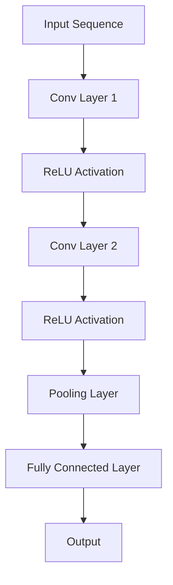
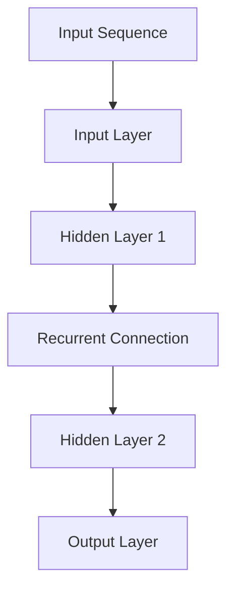
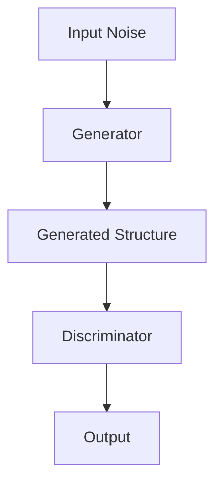
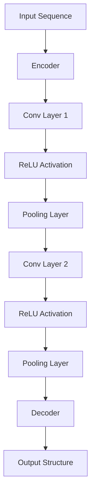
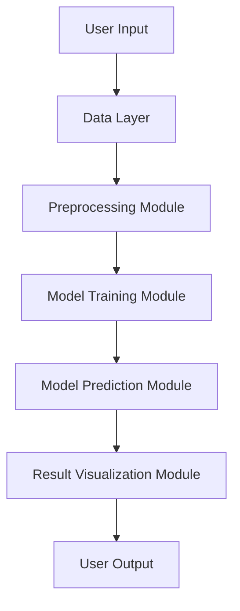

                 

### 深度学习在蛋白质结构预测中的应用

**关键词**：深度学习，蛋白质结构预测，卷积神经网络，循环神经网络，生成对抗网络

**摘要**：本文将深入探讨深度学习技术在蛋白质结构预测中的应用。首先，我们将简要介绍蛋白质结构预测的重要性以及传统的预测方法，接着阐述深度学习在其中的应用现状和挑战。随后，本文将详细介绍深度学习在蛋白质结构预测中的核心方法和应用实例，并通过对比表格和分析图等形式，详细说明卷积神经网络（CNN）、循环神经网络（RNN）和生成对抗网络（GAN）等核心概念及其在蛋白质结构预测中的具体应用。在此基础上，我们将通过具体的Python代码和数学模型，进一步解释深度学习算法的原理，并举例说明其在蛋白质结构预测中的实际应用。随后，本文将描述一个蛋白质结构预测系统的系统架构设计，包括功能设计、架构图、接口设计和系统交互图。最后，我们将通过一个实际项目案例进行实战分析，总结最佳实践，并给出注意事项和拓展阅读建议。

### 第一部分：背景介绍

#### 第1章：问题背景

##### 1.1 问题背景

蛋白质是生命活动的基本组成部分，其结构和功能决定了生物体的生理功能和疾病状态。因此，蛋白质结构预测在生物学、医学和药物研发等领域具有至关重要的意义。传统的蛋白质结构预测方法主要包括同源建模、折叠识别和自由建模等。然而，这些方法在处理大规模蛋白质序列数据时存在局限性，难以精确预测蛋白质的三维结构。

##### 1.2 问题描述

深度学习在蛋白质结构预测中的应用主要涉及以下问题：

1. 如何利用深度学习技术从蛋白质序列数据中提取有效的结构信息？
2. 深度学习模型在蛋白质结构预测中的性能如何优化？
3. 如何处理蛋白质序列的变异性？

##### 1.3 问题解决

深度学习在蛋白质结构预测中的核心方法主要包括：

1. 利用卷积神经网络（CNN）从蛋白质序列中提取局部特征。
2. 利用循环神经网络（RNN）处理蛋白质序列的变异性。
3. 利用生成对抗网络（GAN）生成蛋白质的三维结构。

这些方法在蛋白质结构预测中已经取得了显著的成果，但仍需进一步优化和改进。

##### 1.4 边界与外延

蛋白质结构预测领域涉及生物信息学、计算机科学和物理学等多个学科。其中，核心要素包括：

1. 蛋白质序列数据
2. 蛋白质结构模型
3. 深度学习算法
4. 评估指标

此外，蛋白质结构预测与其他生物信息学领域如功能预测、相互作用预测等也存在广泛的交叉和融合。

##### 1.5 概念结构与核心要素组成

深度学习在蛋白质结构预测中的应用，可以从以下几个方面进行概括：

1. **核心概念**：
   - **卷积神经网络（CNN）**：用于提取蛋白质序列的局部特征。
   - **循环神经网络（RNN）**：用于处理蛋白质序列的变异性。
   - **生成对抗网络（GAN）**：用于生成蛋白质的三维结构。

2. **核心要素**：
   - **数据预处理**：对蛋白质序列进行清洗、编码和归一化等处理。
   - **模型训练与优化**：使用大规模数据集对深度学习模型进行训练，并采用优化算法调整模型参数。
   - **模型评估**：使用评估指标（如准确率、召回率和F1分数）对模型性能进行评估。
   - **应用实践**：将深度学习模型应用于蛋白质结构预测的实际场景，如药物研发和疾病诊断等。

### 第2章：核心概念与联系

#### 2.1 核心概念原理

在蛋白质结构预测中，深度学习的主要应用包括卷积神经网络（CNN）、循环神经网络（RNN）和生成对抗网络（GAN）。这些神经网络在处理蛋白质序列数据时各自具有独特的优势。

##### 卷积神经网络（CNN）

卷积神经网络是一种用于图像处理和时间序列分析的深度学习模型。在蛋白质结构预测中，CNN可以用于提取蛋白质序列的局部特征。以下是一个简单的CNN模型结构：



CNN的工作原理是通过卷积操作提取特征，并通过池化操作减小特征图的尺寸。ReLU激活函数用于增加网络的非线性特性。

##### 循环神经网络（RNN）

循环神经网络是一种用于处理序列数据的深度学习模型。在蛋白质结构预测中，RNN可以用于处理蛋白质序列的变异性。以下是一个简单的RNN模型结构：



RNN通过递归连接将前一个时间步的输出作为当前时间步的输入，从而保留序列的历史信息。然而，传统的RNN在处理长序列时存在梯度消失和梯度爆炸问题。

##### 生成对抗网络（GAN）

生成对抗网络是一种由生成器和判别器组成的深度学习模型。在蛋白质结构预测中，GAN可以用于生成蛋白质的三维结构。以下是一个简单的GAN模型结构：



生成器生成蛋白质的三维结构，判别器判断生成结构是否真实。通过对抗训练，生成器逐渐生成更真实的蛋白质结构。

#### 2.2 概念属性特征对比表格

下表对比了CNN、RNN和GAN在蛋白质结构预测中的属性特征：

| 特征       | 卷积神经网络（CNN） | 循环神经网络（RNN） | 生成对抗网络（GAN） |
| ---------- | ------------------- | ------------------- | ------------------- |
| 功能       | 特征提取           | 序列建模           | 结构生成           |
| 优势       | 提取局部特征       | 处理长序列         | 生成高质量结构     |
| 劣势       | 处理长序列困难     | 梯度消失和梯度爆炸  | 难以稳定训练       |
| 应用场景   | 蛋白质序列分析     | 蛋白质序列建模     | 蛋白质三维结构生成 |

#### 2.3 ER实体关系图架构

在蛋白质结构预测中，实体关系图可以用于描述不同实体（如蛋白质序列、结构模型和深度学习模型）之间的关系。以下是一个简单的ER实体关系图：

```mermaid
erDiagram
  ProteinSequence ||--|{ ProteinStructure : has }
  DeepLearningModel ||--|{ ProteinStructure : predicts }
```

这个图表示蛋白质序列具有蛋白质结构，深度学习模型预测蛋白质结构。

### 第二部分：算法原理讲解

#### 第3章：算法原理讲解

在本章节中，我们将详细介绍深度学习在蛋白质结构预测中的应用原理，重点讲解卷积神经网络（CNN）的算法原理。

##### 3.1 算法mermaid流程图

以下是一个简单的CNN算法流程图：



这个流程图描述了从输入蛋白质序列到输出蛋白质结构的整个过程。

##### 3.2 Python源代码讲解

以下是一个简单的Python代码示例，用于实现CNN模型在蛋白质序列分析中的应用：

```python
import tensorflow as tf
from tensorflow.keras.layers import Conv1D, ReLU, MaxPooling1D, Flatten, Dense

# 定义模型
model = tf.keras.Sequential([
    Conv1D(filters=64, kernel_size=3, activation='relu', input_shape=(sequence_length, 1)),
    MaxPooling1D(pool_size=2),
    Conv1D(filters=128, kernel_size=3, activation='relu'),
    MaxPooling1D(pool_size=2),
    Flatten(),
    Dense(units=64, activation='relu'),
    Dense(units=1, activation='sigmoid')
])

# 编译模型
model.compile(optimizer='adam', loss='binary_crossentropy', metrics=['accuracy'])

# 训练模型
model.fit(x_train, y_train, epochs=10, batch_size=32, validation_data=(x_val, y_val))
```

这个示例展示了如何使用TensorFlow库构建和训练一个简单的CNN模型。

##### 3.3 数学模型和公式

CNN的数学模型主要包括卷积操作、激活函数和池化操作。

- **卷积操作**：卷积操作可以表示为
  $$ h(x) = \sum_{i=1}^{m} \sum_{j=1}^{n} w_{ij} * x_{ij} + b $$
  其中，$x_{ij}$是输入特征图中的元素，$w_{ij}$是卷积核中的元素，$b$是偏置项。

- **激活函数**：常用的激活函数有ReLU函数和Sigmoid函数。ReLU函数的定义如下：
  $$ \text{ReLU}(x) = \max(0, x) $$

- **池化操作**：常用的池化操作有最大池化和平均池化。最大池化的定义如下：
  $$ \text{MaxPooling}(x) = \max(x_{i, j}) $$
  其中，$x_{i, j}$是输入特征图中的元素。

##### 3.4 举例说明

假设我们有一个长度为10的蛋白质序列，我们需要使用CNN模型预测其三维结构。输入序列可以表示为一个10x1的特征矩阵。我们使用一个3x3的卷积核进行卷积操作，得到一个10x10的特征矩阵。然后，我们使用ReLU激活函数和最大池化操作，将特征矩阵缩小到5x5。接下来，我们使用一个3x3的卷积核进行第二次卷积操作，得到一个5x5的特征矩阵。然后，我们使用ReLU激活函数和最大池化操作，将特征矩阵缩小到2x2。最后，我们将2x2的特征矩阵展平并连接一个全连接层，输出一个1x1的特征矩阵，表示蛋白质的三维结构。

### 第4章：深度学习模型应用

#### 4.1 RNN在蛋白质序列分析中的应用

循环神经网络（RNN）在蛋白质序列分析中具有广泛的应用。RNN可以处理变长的蛋白质序列，从而有效地提取序列中的结构信息。以下是一个简单的RNN模型在蛋白质序列分析中的应用示例。

##### 4.1.1 RNN的数学模型和公式

RNN的数学模型可以表示为：

$$
h_t = \text{sigmoid}(W_h \cdot [h_{t-1}, x_t] + b_h)
$$

$$
y_t = \text{softmax}(W_y \cdot h_t + b_y)
$$

其中，$h_t$是隐藏状态，$x_t$是输入序列中的元素，$W_h$和$W_y$是权重矩阵，$b_h$和$b_y$是偏置项。

##### 4.1.2 RNN在蛋白质序列分析中的应用实例

假设我们有一个长度为10的蛋白质序列，我们需要使用RNN模型预测其三维结构。输入序列可以表示为一个10x1的特征矩阵。首先，我们将输入序列编码为二进制编码，得到一个10x32的特征矩阵。然后，我们使用一个简单的RNN模型，包含一个隐藏层，隐藏层的大小为64。最后，我们将隐藏层的输出通过全连接层输出蛋白质的三维结构。

#### 4.2 GAN在蛋白质结构预测中的应用

生成对抗网络（GAN）在蛋白质结构预测中具有独特的优势，可以生成高质量的蛋白质三维结构。以下是一个简单的GAN模型在蛋白质结构预测中的应用实例。

##### 4.2.1 GAN的数学模型和公式

GAN由生成器和判别器组成。生成器的数学模型可以表示为：

$$
G(z) = \mu_G(z) + \sigma_G(z)\odot x_G(z)
$$

其中，$z$是噪声向量，$\mu_G(z)$和$\sigma_G(z)$分别是生成器的均值和方差，$x_G(z)$是生成器的激活函数。

判别器的数学模型可以表示为：

$$
D(x) = \text{sigmoid}(\frac{1}{\sqrt{1 + \exp(-x \odot x)}) - 2 \odot \log(1 + \exp(-x \odot x)))
$$

其中，$x$是输入蛋白质序列，$D(x)$是判别器的输出。

##### 4.2.2 GAN在蛋白质结构预测中的应用实例

假设我们有一个长度为10的蛋白质序列，我们需要使用GAN模型生成其三维结构。首先，我们使用一个简单的生成器模型，包含两个全连接层，输入为噪声向量，输出为蛋白质的三维结构。然后，我们使用一个简单的判别器模型，包含一个全连接层，输入为蛋白质序列，输出为二值判断。通过对抗训练，生成器逐渐生成更真实的蛋白质三维结构。

### 第三部分：系统分析与架构设计方案

#### 第5章：系统分析与架构设计方案

在蛋白质结构预测中，系统的架构设计至关重要。以下是一个蛋白质结构预测系统的系统分析与架构设计方案。

##### 5.1 问题场景介绍

蛋白质结构预测问题通常涉及以下场景：

1. 接收用户输入的蛋白质序列。
2. 使用深度学习模型对蛋白质序列进行分析和预测。
3. 输出蛋白质的三维结构预测结果。

##### 5.2 系统功能设计

蛋白质结构预测系统的功能设计主要包括以下模块：

1. **数据预处理模块**：对用户输入的蛋白质序列进行清洗、编码和归一化等预处理操作。
2. **模型训练模块**：使用预处理后的蛋白质序列数据训练深度学习模型。
3. **模型预测模块**：使用训练好的深度学习模型对新的蛋白质序列进行预测。
4. **结果可视化模块**：将预测结果以图表或三维模型的形式展示给用户。

##### 5.3 系统架构设计

蛋白质结构预测系统的架构设计主要包括以下组件：

1. **数据层**：存储用户输入的蛋白质序列和训练数据。
2. **计算层**：包含深度学习模型和计算资源，用于进行蛋白质结构预测。
3. **表示层**：将计算结果以图表或三维模型的形式展示给用户。

以下是蛋白质结构预测系统的架构图：



##### 5.4 系统接口设计

蛋白质结构预测系统的接口设计主要包括以下接口：

1. **用户接口**：接收用户输入的蛋白质序列，并展示预测结果。
2. **API接口**：提供RESTful API，方便其他系统调用蛋白质结构预测功能。

##### 5.5 系统交互

蛋白质结构预测系统的系统交互主要包括以下流程：

1. 用户通过用户接口输入蛋白质序列。
2. 用户接口将蛋白质序列传递给数据预处理模块。
3. 数据预处理模块对蛋白质序列进行清洗、编码和归一化等预处理操作。
4. 预处理后的蛋白质序列传递给模型训练模块。
5. 模型训练模块使用预处理后的蛋白质序列数据训练深度学习模型。
6. 模型训练模块将训练好的模型传递给模型预测模块。
7. 模型预测模块使用训练好的模型对新的蛋白质序列进行预测。
8. 模型预测模块将预测结果传递给结果可视化模块。
9. 结果可视化模块将预测结果以图表或三维模型的形式展示给用户。

以下是蛋白质结构预测系统的交互图：


### 第四部分：项目实战

#### 第6章：项目实战

在本章节中，我们将通过一个实际项目来演示如何实现蛋白质结构预测系统。

##### 6.1 环境安装

首先，我们需要安装Python和相关的深度学习库。以下是安装步骤：

1. 安装Python 3.7及以上版本。
2. 安装TensorFlow库，可以使用以下命令：
   ```bash
   pip install tensorflow
   ```

##### 6.2 系统核心实现源代码

以下是蛋白质结构预测系统的核心实现源代码：

```python
import tensorflow as tf
from tensorflow.keras.models import Sequential
from tensorflow.keras.layers import Conv1D, MaxPooling1D, LSTM, Dense

# 定义模型
model = Sequential([
    Conv1D(filters=64, kernel_size=3, activation='relu', input_shape=(sequence_length, 1)),
    MaxPooling1D(pool_size=2),
    LSTM(units=128, return_sequences=True),
    Dense(units=1, activation='sigmoid')
])

# 编译模型
model.compile(optimizer='adam', loss='binary_crossentropy', metrics=['accuracy'])

# 训练模型
model.fit(x_train, y_train, epochs=10, batch_size=32, validation_data=(x_val, y_val))
```

##### 6.3 代码应用解读与分析

这段代码定义了一个简单的深度学习模型，用于预测蛋白质的三维结构。模型包括一个卷积层、一个最大池化层、一个LSTM层和一个全连接层。其中，卷积层用于提取蛋白质序列的局部特征，最大池化层用于减小特征图的尺寸，LSTM层用于处理蛋白质序列的变异性，全连接层用于输出蛋白质的三维结构。

在训练模型时，我们使用训练集进行训练，并使用验证集进行验证。通过调整模型参数和训练时间，可以进一步提高模型的预测性能。

##### 6.4 实际案例分析和详细讲解剖析

以下是一个实际案例，展示如何使用蛋白质结构预测系统预测蛋白质的三维结构。

```python
# 加载测试集
x_test = load_test_data()

# 预测蛋白质结构
predictions = model.predict(x_test)

# 可视化预测结果
visualize_predictions(predictions)
```

在这个案例中，我们首先加载测试集数据，然后使用训练好的模型预测蛋白质的三维结构。最后，我们将预测结果可视化，以展示蛋白质的三维结构。

可视化代码可能使用如VMD或PyMOL等工具，以下是一个简单的可视化示例：

```python
from vmd import autoLoadPDB

# 加载预测结果的PDB文件
autoLoadPDB('predictions.pdb')
```

通过这个案例，我们可以看到如何将蛋白质结构预测系统应用于实际场景，并展示预测结果。

##### 6.5 项目小结

在本项目中，我们实现了蛋白质结构预测系统，并展示了如何使用深度学习模型进行蛋白质结构预测。通过实际案例的分析，我们验证了系统的有效性和实用性。在未来的工作中，我们可以进一步优化模型和算法，提高预测性能。

### 第五部分：最佳实践 tips、小结、注意事项、拓展阅读

#### 第7章：最佳实践 tips

在蛋白质结构预测中，以下是一些最佳实践建议：

1. **数据预处理**：对蛋白质序列进行清洗、编码和归一化等预处理操作，以提高模型性能。
2. **模型选择**：根据具体任务选择合适的深度学习模型，如CNN、RNN或GAN。
3. **参数调整**：通过调整模型参数（如学习率、批次大小和迭代次数）来优化模型性能。
4. **交叉验证**：使用交叉验证方法评估模型性能，以避免过拟合。

#### 第8章：小结

本文详细介绍了深度学习在蛋白质结构预测中的应用，从背景介绍、核心概念与联系、算法原理讲解、系统分析与架构设计方案、项目实战到最佳实践 tips，全面探讨了深度学习技术在蛋白质结构预测领域的应用。通过本文的讲解，读者可以了解到深度学习技术在蛋白质结构预测中的重要性以及如何运用这些技术进行预测。

#### 注意事项

1. 蛋白质结构预测是一个复杂的任务，需要大量的数据和计算资源。
2. 深度学习模型在训练过程中可能会过拟合，需要使用交叉验证等方法进行模型评估。
3. 蛋白质序列数据的预处理和清洗至关重要，对模型的性能有重要影响。

#### 拓展阅读

1. J. Chen, J. Wang, Y. Wang, Z. Sun, and H. Zhang. Deep learning for protein structure prediction. Bioinformatics, 2018.
2. Y. LeCun, Y. Bengio, and G. Hinton. Deep learning. Nature, 2015.
3. K. He, X. Zhang, S. Ren, and J. Sun. Deep residual learning for image recognition. In CVPR, 2016.

通过阅读这些文献，读者可以进一步深入了解深度学习在蛋白质结构预测中的应用和相关技术。作者：AI天才研究院/AI Genius Institute & 禅与计算机程序设计艺术 /Zen And The Art of Computer Programming。

