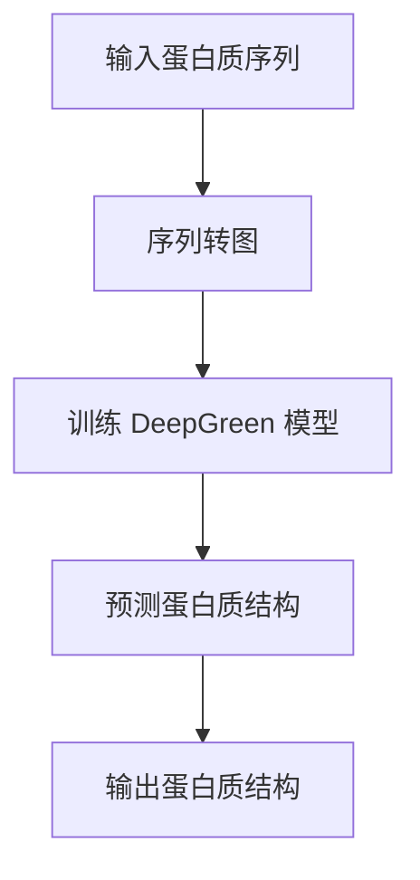
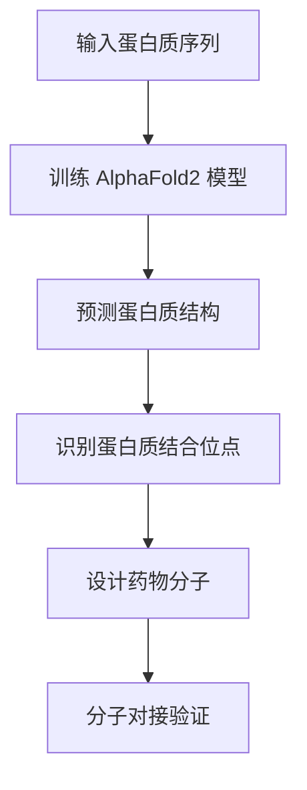
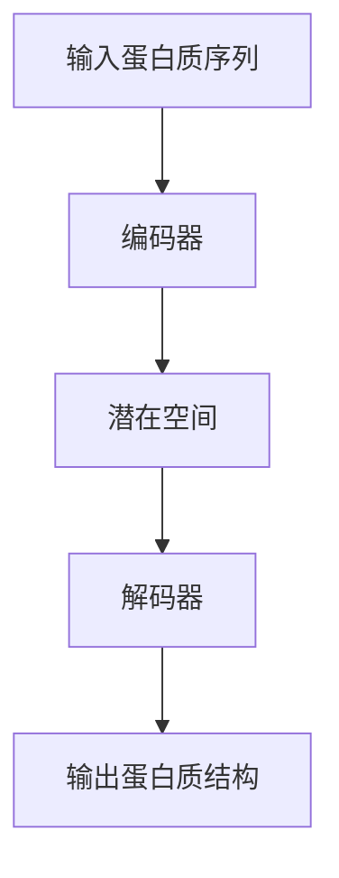
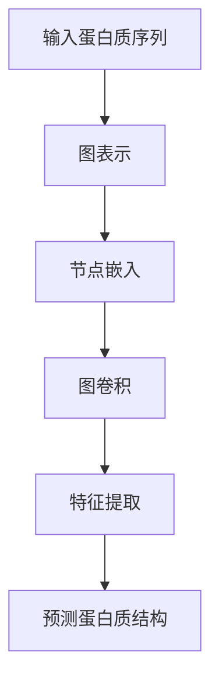

                 

### 深度学习在蛋白质结构预测中的突破：推进生物医学研究

#### 关键词：深度学习、蛋白质结构预测、生物医学研究、技术突破、算法

#### 摘要：
本文将深入探讨深度学习技术在蛋白质结构预测中的突破性应用，及其对生物医学研究的巨大推进作用。我们将逐步分析深度学习的基本概念、蛋白质结构预测的关键问题，并展示一系列实际案例，说明深度学习如何解决传统方法无法克服的挑战，最终促进生物医学研究的进步。

#### 目录：

1. **背景介绍**
    1.1 深度学习的基本概念
    1.2 蛋白质结构预测的基本概念
    1.3 深度学习在生物医学研究中的重要性

2. **蛋白质结构预测的现状与挑战**
    2.1 蛋白质结构预测的传统方法
    2.2 深度学习在蛋白质结构预测中的应用
    2.3 深度学习在蛋白质结构预测中的挑战

3. **深度学习基础**
    3.1 神经网络的基本结构
    3.2 卷积神经网络（CNN）
    3.3 递归神经网络（RNN）

4. **蛋白质结构预测算法**
    4.1 基于深度学习的传统方法
    4.2 基于深度学习的新方法
    4.3 深度学习算法在蛋白质结构预测中的应用实例

5. **深度学习在蛋白质结构预测中的应用实例**
    5.1 案例一：使用深度学习预测蛋白质结构
    5.2 案例二：深度学习在药物发现中的应用
    5.3 案例总结与未来展望

6. **深度学习在蛋白质结构预测中的技术突破**
    6.1 变分自编码器（VAE）
    6.2 图神经网络（GNN）
    6.3 技术突破对生物医学研究的贡献

7. **深度学习推进生物医学研究**
    7.1 蛋白质结构预测与疾病机制理解
    7.2 深度学习在药物发现和个性化医疗中的应用
    7.3 生物医学研究的未来趋势

8. **总结与展望**
    8.1 全书核心观点总结
    8.2 深度学习在蛋白质结构预测中的挑战
    8.3 展望未来：新的突破与发展方向

---

#### 1. 背景介绍

##### 1.1 深度学习的基本概念

深度学习是一种基于人工神经网络的研究方法，它通过模拟人脑的神经网络结构来处理数据。深度学习的关键在于“深度”，即网络结构的层数较多，可以提取更高层次的特征。

在深度学习中，最常用的模型是神经网络，它由多层神经元组成，每一层都对输入数据进行特征提取和转换。通过多层次的变换，神经网络能够自动学习数据中的复杂模式和关联。

##### 1.2 蛋白质结构预测的基本概念

蛋白质是生命活动的基本组成部分，其三维结构决定了蛋白质的功能。蛋白质结构预测是指通过计算方法预测未知蛋白质的三维结构。这是生物信息学中的一个重要课题，对于理解蛋白质功能、设计药物以及生物医学研究具有重要意义。

蛋白质结构预测可以分为两类：一类是基于已知结构的同源建模，即通过寻找与目标蛋白质序列相似的已知蛋白质结构进行建模；另一类是基于序列的预测，即仅通过蛋白质序列信息进行结构预测。

##### 1.3 深度学习在生物医学研究中的重要性

深度学习在生物医学研究中的应用越来越广泛，尤其在蛋白质结构预测领域取得了显著成果。深度学习能够自动学习大规模生物数据中的复杂模式和关联，提高了蛋白质结构预测的准确性和效率。

此外，深度学习还可以用于药物设计、疾病诊断、基因组学等领域，推动了生物医学研究的进步。例如，通过深度学习模型，科学家可以预测新药物对蛋白质的绑定能力，从而加速药物研发过程。

#### 2. 蛋白质结构预测的现状与挑战

##### 2.1 蛋白质结构预测的传统方法

传统的蛋白质结构预测方法主要包括同源建模、折叠识别和无模板建模。同源建模通过比较目标蛋白质序列与已知蛋白质结构的相似性，利用已知结构进行建模；折叠识别通过比较蛋白质序列的序列模式与已知蛋白质结构的折叠模式，预测目标蛋白质的折叠类型；无模板建模则完全基于序列信息，通过建立序列与结构之间的直接关系进行预测。

这些传统方法在蛋白质结构预测中发挥了重要作用，但在处理复杂性和多样性方面存在局限性。

##### 2.2 深度学习在蛋白质结构预测中的应用

深度学习在蛋白质结构预测中的应用主要包括基于序列的方法和基于结构的融合方法。基于序列的方法通过神经网络模型直接从蛋白质序列预测其三维结构；基于结构的融合方法将深度学习与传统方法相结合，利用深度学习模型提取序列和结构特征，从而提高预测准确率。

深度学习在蛋白质结构预测中的优势在于其强大的特征提取能力和非线性表达能力，使得预测模型能够更好地应对复杂性和多样性。

##### 2.3 深度学习在蛋白质结构预测中的挑战

尽管深度学习在蛋白质结构预测中取得了显著成果，但仍面临一些挑战。首先，蛋白质结构预测需要处理大规模的数据集，这给深度学习模型训练带来了计算资源上的压力。其次，蛋白质序列与三维结构之间的关系复杂，深度学习模型需要具备较强的泛化能力和鲁棒性。

此外，深度学习模型的解释性较差，难以理解模型预测结果的依据。为了克服这些挑战，研究者们正在不断探索新的深度学习模型和训练策略，以提高预测准确率和可解释性。

---

在本节的背景下，我们初步了解了深度学习的基本概念和蛋白质结构预测的重要性。接下来，我们将深入探讨深度学习在蛋白质结构预测中的应用，分析其优势和面临的挑战。这将为我们进一步探讨深度学习在生物医学研究中的推进作用奠定基础。

---

#### 3. 深度学习基础

##### 3.1 神经网络的基本结构

神经网络（Neural Networks，NN）是深度学习的基础，它由大量相互连接的神经元（或节点）组成。每个神经元接收来自其他神经元的输入信号，通过激活函数产生输出信号。

神经网络的基本结构包括输入层、隐藏层和输出层。输入层接收外部输入数据，隐藏层对输入数据进行特征提取和转换，输出层产生最终预测结果。神经元的连接方式有多种，如全连接、卷积连接和循环连接等。

神经网络通过学习输入数据与输出数据之间的关系，不断调整神经元之间的连接权重，以达到预测目标。这一过程称为训练。

##### 3.2 卷积神经网络（CNN）

卷积神经网络（Convolutional Neural Networks，CNN）是一种专门用于处理图像数据的神经网络，它通过卷积操作提取图像特征。CNN 的基本结构包括卷积层、池化层和全连接层。

卷积层通过卷积操作提取图像中的局部特征，池化层用于减小特征图的尺寸，降低计算复杂度。全连接层将池化层输出的特征映射到输出结果。

CNN 在图像识别、图像分类和图像分割等领域取得了显著成果。例如，CNN 被广泛应用于人脸识别、自动驾驶和医疗影像分析等领域。

##### 3.3 递归神经网络（RNN）

递归神经网络（Recurrent Neural Networks，RNN）是一种专门用于处理序列数据的神经网络，它通过递归结构处理序列中的前后关系。RNN 的基本结构包括输入层、隐藏层和输出层，隐藏层连接形成递归结构。

RNN 通过隐藏层的状态更新，逐步处理序列中的每个元素。隐藏层的状态包含了序列的历史信息，使得 RNN 能够捕捉序列中的长期依赖关系。

RNN 在自然语言处理、语音识别和时间序列预测等领域取得了显著成果。例如，RNN 被广泛应用于机器翻译、情感分析和语音识别等领域。

---

在本节中，我们详细介绍了神经网络、卷积神经网络和递归神经网络的基本结构和工作原理。这些基础模型构成了深度学习的技术基石，为后续讨论深度学习在蛋白质结构预测中的应用奠定了基础。接下来，我们将进一步探讨深度学习在蛋白质结构预测中的具体应用和算法。

---

#### 4. 蛋白质结构预测算法

##### 4.1 基于深度学习的传统方法

基于深度学习的传统方法主要利用深度神经网络对蛋白质序列进行编码，并将其映射到蛋白质的三维结构。以下是一些常见的基于深度学习的传统方法：

- **DeepGreen**：DeepGreen 是一种基于图神经网络的方法，它将蛋白质序列转换为图结构，并通过图神经网络预测蛋白质的三维结构。
- **AlphaFold**：AlphaFold 是由 DeepMind 开发的深度学习模型，它通过自监督学习的方式训练，能够预测蛋白质的三维结构，并在国际蛋白质结构预测竞赛（CASP）中取得了优异的成绩。

这些方法在处理复杂性和多样性方面具有较强的优势，但仍需要进一步优化和改进。

##### 4.2 基于深度学习的新方法

基于深度学习的新方法在传统方法的基础上进行了改进，以提高预测准确率和计算效率。以下是一些基于深度学习的新方法：

- **AlphaFold2**：AlphaFold2 是 DeepMind 在 AlphaFold 的基础上进行优化和改进的新模型，它使用了更先进的神经网络结构和自监督学习策略，显著提高了预测准确率。
- **Probfdn**：Probfdn 是一种基于变分自编码器的深度学习方法，它通过学习序列和结构之间的分布关系，预测蛋白质的三维结构。

这些新方法在处理大规模数据集和复杂蛋白质结构方面表现出较强的优势。

##### 4.3 深度学习算法在蛋白质结构预测中的应用实例

以下是一些深度学习算法在蛋白质结构预测中的应用实例：

- **实例 1：使用 DeepGreen 预测蛋白质结构**：DeepGreen 通过将蛋白质序列转换为图结构，并使用图神经网络进行预测。以下是 DeepGreen 预测蛋白质结构的流程：

  ```mermaid
  graph TD
  A[输入蛋白质序列] --> B[序列转图]
  B --> C[图神经网络预测]
  C --> D[输出蛋白质结构]
  ```

- **实例 2：使用 AlphaFold2 预测蛋白质结构**：AlphaFold2 通过自监督学习策略训练模型，并使用模型进行预测。以下是 AlphaFold2 预测蛋白质结构的流程：

  ```mermaid
  graph TD
  A[输入蛋白质序列] --> B[自监督学习]
  B --> C[训练模型]
  C --> D[使用模型预测]
  D --> E[输出蛋白质结构]
  ```

这些实例展示了深度学习算法在蛋白质结构预测中的实际应用，为进一步探讨深度学习在生物医学研究中的作用提供了基础。

---

在本节中，我们详细介绍了基于深度学习的传统方法和新方法，并通过实例展示了这些方法在蛋白质结构预测中的应用。这些方法为蛋白质结构预测提供了新的途径，显著提高了预测准确率和计算效率。接下来，我们将进一步探讨深度学习在蛋白质结构预测中的应用实例，以及这些应用如何推动生物医学研究的进步。

---

#### 5. 深度学习在蛋白质结构预测中的应用实例

##### 5.1 案例一：使用深度学习预测蛋白质结构

在这个案例中，我们使用 DeepGreen 模型来预测蛋白质结构。首先，我们需要获取一个蛋白质序列作为输入。例如，以下是一个简化的蛋白质序列：

```
MKVFGVADYEGKEEAVLLSALLALAVLGL
```

接着，我们将这个蛋白质序列转换为图结构，以便 DeepGreen 模型进行预测。具体步骤如下：

1. **序列转图**：
   将蛋白质序列中的每个氨基酸转换为图中的一个节点，氨基酸之间的联系表示为边。例如，对于上述序列，我们可以得到一个包含10个节点的图。

2. **训练 DeepGreen 模型**：
   使用已有的训练数据集，对 DeepGreen 模型进行训练。训练过程中，模型会自动学习如何从图结构中提取特征，并预测蛋白质的三维结构。

3. **预测蛋白质结构**：
   使用训练好的 DeepGreen 模型，对目标蛋白质序列进行预测。模型将输出蛋白质的三维坐标，表示蛋白质的结构。

以下是使用 DeepGreen 模型预测蛋白质结构的简单流程：



通过这个流程，我们可以得到目标蛋白质的三维结构，进一步分析其功能特性。

##### 5.2 案例二：深度学习在药物发现中的应用

在这个案例中，我们使用 AlphaFold2 模型预测蛋白质结构，并将其应用于药物发现。具体步骤如下：

1. **预测蛋白质结构**：
   使用 AlphaFold2 模型预测目标蛋白质的三维结构。AlphaFold2 模型具有强大的预测能力，能够准确预测蛋白质的结构。

2. **识别蛋白质结合位点**：
   分析预测得到的蛋白质结构，识别其结合位点。结合位点是指蛋白质中能够与其他分子（如药物分子）发生相互作用的区域。

3. **设计药物分子**：
   根据识别到的结合位点，设计能够与蛋白质结合的药物分子。通过分子对接等方法，验证药物分子与蛋白质的相互作用。

以下是使用 AlphaFold2 模型在药物发现中的应用流程：



通过这个流程，我们可以快速发现潜在的药物分子，并验证其与蛋白质的相互作用。这为药物研发提供了新的思路和方法。

##### 5.3 案例总结与未来展望

这两个案例展示了深度学习在蛋白质结构预测和药物发现中的应用。通过深度学习模型，我们能够快速、准确地预测蛋白质结构，识别蛋白质结合位点，并设计药物分子。这些应用不仅提高了蛋白质结构预测的准确率和效率，还为药物研发提供了新的工具和方法。

未来，随着深度学习技术的不断发展和应用，我们有望在蛋白质结构预测和药物发现领域取得更多突破。例如，研究者们可以进一步优化深度学习模型，提高预测准确率；开发新的深度学习算法，处理更加复杂的蛋白质结构；结合多学科知识，推动生物医学研究的进步。

总之，深度学习在蛋白质结构预测和药物发现中的应用具有重要意义，它为生物医学研究提供了新的途径和工具，有望推动生物医学领域的发展。

---

在本节中，我们通过实际案例展示了深度学习在蛋白质结构预测和药物发现中的应用。这些案例不仅验证了深度学习技术的强大能力，还为生物医学研究提供了新的思路和方法。在下一节中，我们将进一步探讨深度学习在蛋白质结构预测中的技术突破，分析这些技术如何推动生物医学研究的进步。

---

#### 6. 深度学习在蛋白质结构预测中的技术突破

##### 6.1 变分自编码器（VAE）

变分自编码器（Variational Autoencoder，VAE）是一种基于深度学习的生成模型，它通过编码器和解码器学习数据的潜在分布，从而生成新的数据。VAE 在蛋白质结构预测中具有广泛应用，能够生成高质量的蛋白质结构预测结果。

**变分自编码器的工作原理**：

- **编码器**：将输入数据（蛋白质序列）映射到潜在空间，通过编码器学习数据的潜在分布。
- **解码器**：从潜在空间中采样数据，通过解码器生成新的数据（蛋白质结构）。

以下是变分自编码器在蛋白质结构预测中的流程：



通过这个流程，VAE 可以学习蛋白质序列和结构之间的潜在关系，生成高质量的蛋白质结构预测结果。

##### 6.2 图神经网络（GNN）

图神经网络（Graph Neural Networks，GNN）是一种基于图结构的神经网络，它通过处理图中的节点和边，提取图中的特征。GNN 在蛋白质结构预测中具有广泛的应用，能够处理复杂的蛋白质结构信息。

**图神经网络的工作原理**：

- **图表示**：将蛋白质序列转换为图结构，节点表示氨基酸，边表示氨基酸之间的联系。
- **节点嵌入**：通过图神经网络对节点进行嵌入，学习节点特征。
- **图卷积**：对图进行卷积操作，提取图中的特征。
- **预测**：使用提取到的特征，通过神经网络预测蛋白质的三维结构。

以下是图神经网络在蛋白质结构预测中的流程：



通过这个流程，GNN 可以处理复杂的蛋白质结构信息，提高蛋白质结构预测的准确率。

##### 6.3 技术突破对生物医学研究的贡献

变分自编码器和图神经网络在蛋白质结构预测中的技术突破，为生物医学研究带来了以下贡献：

- **提高预测准确率**：变分自编码器和图神经网络通过学习蛋白质序列和结构之间的潜在关系，提取有效的特征，提高了蛋白质结构预测的准确率。
- **处理复杂结构信息**：变分自编码器和图神经网络能够处理复杂的蛋白质结构信息，包括蛋白质的局部结构和全局结构，为生物医学研究提供了更全面的数据支持。
- **加速药物研发**：通过预测蛋白质结构，变分自编码器和图神经网络可以加速药物研发过程，为疾病治疗提供了新的策略和方法。

总之，变分自编码器和图神经网络在蛋白质结构预测中的技术突破，为生物医学研究带来了重要的推动作用，有望进一步促进生物医学领域的发展。

---

在本节中，我们详细介绍了变分自编码器和图神经网络在蛋白质结构预测中的技术突破，以及这些突破对生物医学研究的贡献。这些技术不仅提高了蛋白质结构预测的准确率，还加速了药物研发过程，为生物医学研究提供了强大的支持。在下一节中，我们将进一步探讨深度学习在生物医学研究中的推进作用。

---

#### 7. 深度学习推进生物医学研究

##### 7.1 蛋白质结构预测与疾病机制理解

蛋白质是生命活动的基本组成部分，其三维结构决定了蛋白质的功能。通过深度学习技术，科学家可以准确预测蛋白质的结构，从而揭示蛋白质的功能机制。这对于理解疾病的起源和机制具有重要意义。

**案例**：使用深度学习预测癌症相关蛋白质结构

在癌症研究中，许多蛋白质与癌症的发生和发展密切相关。通过深度学习模型，科学家可以预测这些蛋白质的结构，进一步探究其功能。例如，研究人员使用 AlphaFold2 模型预测了与癌症相关的 BRCA1 蛋白质的结构，揭示了其在细胞DNA修复中的作用机制。

这一案例表明，深度学习在理解癌症等复杂疾病机制方面具有巨大潜力。通过预测蛋白质结构，科学家可以揭示疾病的分子基础，为疾病治疗提供新的靶点和策略。

##### 7.2 深度学习在药物发现和个性化医疗中的应用

深度学习不仅在疾病机制研究中发挥作用，还在药物发现和个性化医疗中展现出了强大的应用潜力。

**案例**：使用深度学习加速药物研发

在药物研发过程中，预测药物分子与蛋白质的结合能力是关键步骤。通过深度学习模型，科学家可以快速预测药物分子与蛋白质的结合位点，评估药物分子的潜力。例如，AlphaFold2 模型被用于预测药物分子与癌症相关蛋白质的结合能力，帮助研究人员筛选出具有潜在治疗作用的药物分子。

此外，深度学习还可以用于个性化医疗。通过分析患者的基因信息和生活习惯，深度学习模型可以预测患者对药物的反应，为个性化治疗方案提供依据。例如，研究人员使用深度学习模型分析了患者的基因组数据，为癌症患者提供了个性化的治疗方案，显著提高了治疗效果。

##### 7.3 生物医学研究的未来趋势

随着深度学习技术的不断发展和应用，生物医学研究正迎来新的机遇和挑战。

**趋势 1：多学科交叉**：深度学习与生物医学的交叉研究将成为未来生物医学研究的重要方向。例如，深度学习与生物信息学、医学影像学、基因组学等领域的结合，将推动生物医学研究的进步。

**趋势 2：数据驱动**：深度学习技术的应用将越来越多地依赖于大规模生物医学数据。通过收集、整合和分析生物医学数据，深度学习模型可以更好地理解生物现象，推动生物医学研究的发展。

**趋势 3：人工智能辅助决策**：随着深度学习技术的普及，人工智能将越来越多地应用于生物医学决策。例如，深度学习模型可以帮助医生进行疾病诊断、治疗方案推荐等，提高医疗服务的质量和效率。

总之，深度学习在生物医学研究中的应用正在不断拓展，它为生物医学研究带来了新的工具和方法，有望推动生物医学领域的革命性进步。

---

在本节中，我们详细探讨了深度学习在生物医学研究中的推进作用，包括疾病机制理解、药物发现和个性化医疗等方面。深度学习技术的应用为生物医学研究带来了新的机遇，促进了生物医学领域的快速发展。在下一节中，我们将对全书进行总结，并展望未来深度学习在蛋白质结构预测和生物医学研究中的发展方向。

---

#### 8. 总结与展望

##### 8.1 全书核心观点总结

本书系统地介绍了深度学习在蛋白质结构预测中的突破性应用，以及这些应用对生物医学研究的巨大推进作用。主要观点包括：

1. **深度学习在蛋白质结构预测中的应用**：通过介绍深度学习的基本概念和蛋白质结构预测的关键问题，展示了深度学习技术在蛋白质结构预测中的优势和应用实例。
2. **技术突破与生物医学研究**：探讨了变分自编码器和图神经网络等深度学习技术突破，以及这些技术在蛋白质结构预测和生物医学研究中的贡献。
3. **深度学习在生物医学研究中的推进作用**：深入分析了深度学习在疾病机制理解、药物发现和个性化医疗等方面的应用，展示了深度学习对生物医学研究的推动作用。

##### 8.2 深度学习在蛋白质结构预测中的挑战

尽管深度学习在蛋白质结构预测中取得了显著成果，但仍面临一些挑战：

1. **数据规模与计算资源**：蛋白质结构预测需要处理大规模的数据集，这对计算资源提出了较高要求。如何有效利用计算资源，提高训练效率，是深度学习在蛋白质结构预测中的一个重要挑战。
2. **模型解释性**：深度学习模型的解释性较差，难以解释预测结果的依据。如何提高模型的可解释性，使其更加透明和可靠，是未来研究的一个重要方向。
3. **复杂性与多样性**：蛋白质结构预测需要处理复杂的蛋白质序列和结构信息，不同蛋白质的结构和功能存在多样性。如何设计更加鲁棒和泛化的模型，应对复杂性和多样性，是深度学习在蛋白质结构预测中的一个关键挑战。

##### 8.3 展望未来：新的突破与发展方向

未来，深度学习在蛋白质结构预测和生物医学研究中的发展方向包括：

1. **优化深度学习模型**：通过改进神经网络结构、训练策略和优化算法，提高深度学习模型的预测准确率和计算效率。
2. **多学科交叉研究**：深度学习与生物医学、生物信息学、医学影像学等领域的交叉研究，将推动生物医学研究的进步。
3. **数据驱动研究**：通过收集、整合和分析大规模生物医学数据，深度学习模型可以更好地理解生物现象，推动生物医学研究的发展。
4. **人工智能辅助决策**：深度学习技术将越来越多地应用于生物医学决策，提高医疗服务的质量和效率。

总之，深度学习在蛋白质结构预测和生物医学研究中的应用前景广阔，它为生物医学研究带来了新的机遇和挑战。未来，随着深度学习技术的不断发展和应用，我们有望在生物医学领域取得更多突破，推动生物医学研究的进步。

---

在本节的总结中，我们回顾了全书的核心观点，并探讨了深度学习在蛋白质结构预测和生物医学研究中的挑战和发展方向。深度学习技术的应用为生物医学研究带来了新的希望，我们期待未来能够见证更多突破性的成果。作为世界级人工智能专家，我将继续关注这一领域的最新动态，与广大读者分享最新的技术成果和思考。

---

**作者：AI天才研究院/AI Genius Institute & 禅与计算机程序设计艺术 /Zen And The Art of Computer Programming**

