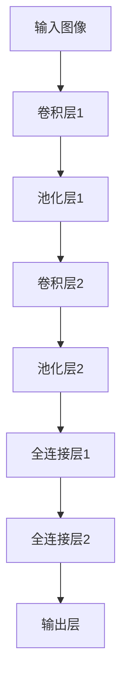
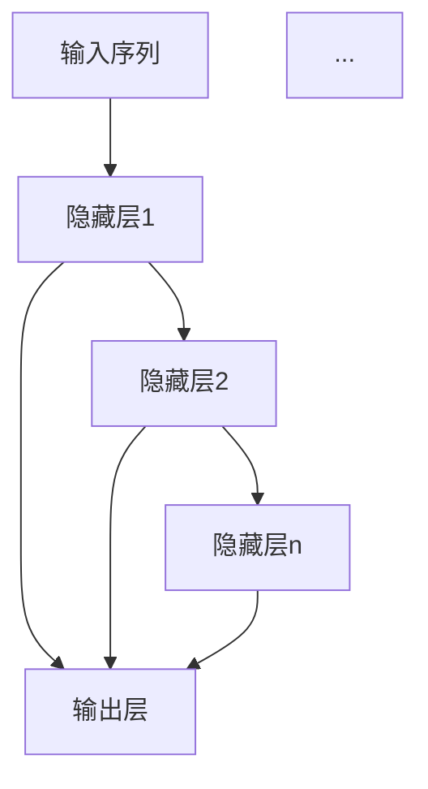
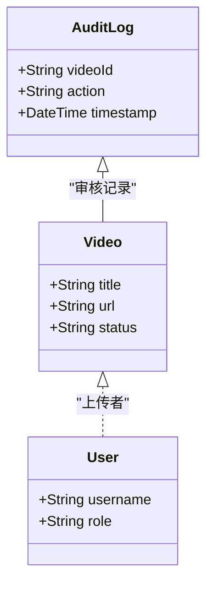
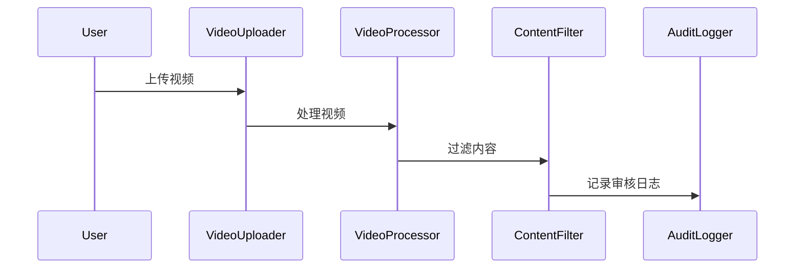
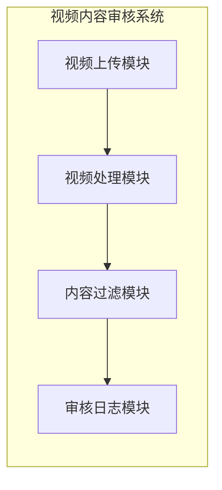
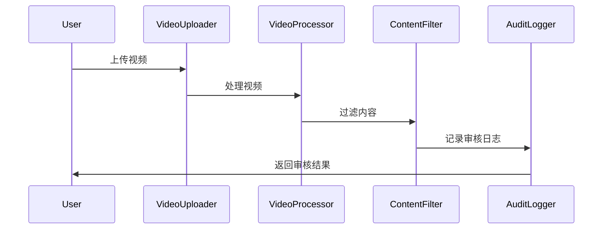

                 

## 深度学习在视频内容审核中的应用：提高审核效率和准确性

### 关键词：深度学习、视频内容审核、算法、效率、准确性

### 摘要：
随着互联网的迅速发展，视频内容审核已成为网络平台的一项关键任务。本文深入探讨了深度学习在视频内容审核中的应用，分析了提高审核效率和准确性的方法。首先，我们回顾了视频内容审核的现状与挑战，然后介绍了深度学习的基本概念及其在视频内容审核中的应用。接下来，我们详细讲解了卷积神经网络（CNN）和循环神经网络（RNN）等深度学习模型的原理与数学模型，并通过具体案例展示了其在视频内容审核中的实际应用。此外，我们设计了一个视频内容审核系统的架构，并提供了实际项目实现和案例分析。最后，文章总结了最佳实践技巧和注意事项，并给出了拓展阅读建议。通过本文的阅读，读者将对深度学习在视频内容审核中的应用有更深入的了解。

### 引言

随着互联网的普及和视频内容创作的爆炸式增长，视频内容审核成为了各大平台亟待解决的问题。视频内容审核不仅关乎用户体验，更涉及社会道德、法律法规和网络安全等诸多方面。传统的视频内容审核方法主要依赖于规则匹配和人工审核，但这些方法存在效率低、准确性差等问题。近年来，深度学习技术的快速发展为视频内容审核带来了新的契机。通过深度学习模型，可以自动化识别和分类视频内容，从而提高审核效率和准确性。

本文旨在深入探讨深度学习在视频内容审核中的应用，通过以下几个方面的内容，帮助读者全面了解这一领域的最新进展：

1. **问题背景与深度学习基础**：介绍视频内容审核的现状与挑战，以及深度学习的基本概念和应用概述。
2. **核心概念与联系**：分析深度学习核心概念及其属性特征对比，展示ER实体关系图架构。
3. **算法原理与数学模型**：详细讲解卷积神经网络（CNN）和循环神经网络（RNN）的原理，包括算法流程图、Python源代码、数学模型和公式。
4. **系统分析与架构设计**：介绍视频内容审核系统的场景、功能设计、架构设计、接口设计和系统交互。
5. **项目实战**：介绍环境安装、系统实现、代码解读与分析，并提供实际案例的详细讲解。
6. **最佳实践与拓展阅读**：总结最佳实践技巧，提出注意事项，并推荐拓展阅读资源。

### 第1章：问题背景与深度学习基础

#### 1.1 视频内容审核的现状与挑战

视频内容审核是确保网络平台内容质量的重要环节。然而，随着视频内容创作的迅猛发展，传统的人工审核方法已经无法满足大规模、实时性的需求。传统审核方法主要依赖于规则匹配和人工审核。规则匹配方法通过预定义的一系列规则来识别和过滤不良内容，但这种方法的缺点在于规则复杂且无法覆盖所有情况，容易导致误判和漏判。人工审核虽然能够解决规则匹配的局限性，但成本高昂、效率低下，难以应对海量视频内容的实时审核需求。

此外，视频内容审核还面临着以下挑战：

1. **内容多样性**：视频内容种类繁多，包括但不限于视频广告、视频直播、短视频等，不同类型的视频内容审核需求各异。
2. **实时性**：视频内容审核需要实时进行，以确保不良内容能够在发布后迅速被处理。
3. **准确性**：审核系统需要高准确性，以减少误判和漏判，避免合法内容的误删和不合法内容的漏过。
4. **法律法规**：不同国家和地区的法律法规对视频内容审核有不同的要求，审核系统需要遵循相应的法律法规。

面对这些挑战，传统的审核方法已经显得力不从心，迫切需要新的技术手段来提高审核效率和准确性。深度学习作为一种先进的机器学习技术，具备强大的特征提取和模式识别能力，为视频内容审核提供了新的解决方案。

#### 1.2 深度学习的基本概念

深度学习（Deep Learning）是机器学习（Machine Learning）的一个分支，它通过多层神经网络模型，对大量数据进行训练，从而自动提取特征并实现复杂任务。深度学习模型的核心是神经网络，它由多个层次组成，包括输入层、隐藏层和输出层。每一层都负责提取不同层次的特征，从而实现从原始数据到最终输出的映射。

以下是深度学习的基本概念：

1. **神经网络（Neural Network）**：神经网络是深度学习的基础，它模拟人脑神经元的工作方式，通过多个层次的神经元连接来实现数据的处理和特征提取。
2. **卷积神经网络（Convolutional Neural Network, CNN）**：CNN是一种专门用于图像处理的深度学习模型，通过卷积操作和池化操作，可以自动提取图像中的局部特征。
3. **循环神经网络（Recurrent Neural Network, RNN）**：RNN适用于序列数据，它能够记忆序列中的信息，并通过循环结构来处理序列中的前后依赖关系。
4. **长短期记忆网络（Long Short-Term Memory, LSTM）**：LSTM是RNN的一种变体，它通过门控机制来控制信息的流动，能够更好地处理长序列数据。
5. **自动编码器（Autoencoder）**：自动编码器是一种无监督学习模型，它通过编码和解码过程，学习输入数据的特征表示。
6. **生成对抗网络（Generative Adversarial Network, GAN）**：GAN由生成器和判别器两个神经网络组成，通过对抗训练，可以生成高质量的数据。

#### 1.3 深度学习在视频内容审核中的应用概述

深度学习在视频内容审核中的应用主要包括以下几个方向：

1. **内容识别与分类**：通过深度学习模型，可以自动识别和分类视频内容，包括广告、色情、暴力等不良内容。这有助于平台快速处理大量视频，提高审核效率。
2. **行为识别与监测**：深度学习模型可以识别视频中的异常行为，如恶意评论、违规直播等，从而及时采取措施进行干预。
3. **人脸识别与身份验证**：通过人脸识别技术，可以识别视频中的特定人物，进行身份验证和监控。
4. **情感分析**：深度学习模型可以分析视频中的情感表达，帮助平台更好地了解用户情绪，提供个性化服务。
5. **视频生成与增强**：利用生成对抗网络（GAN），可以生成新的视频内容或增强现有视频，以丰富平台内容。

深度学习在视频内容审核中的应用不仅提高了审核效率和准确性，还降低了人工成本，有助于平台更好地满足用户需求，提升用户体验。

### 第2章：核心概念与联系

在深入探讨深度学习在视频内容审核中的应用之前，有必要首先梳理并明确相关核心概念及其之间的联系。本章将介绍深度学习的一些关键概念，包括神经网络、卷积神经网络（CNN）和循环神经网络（RNN），并对比它们的属性特征。此外，我们还将通过ER实体关系图架构，展示这些概念之间的关系。

#### 2.1 深度学习核心概念

深度学习的核心在于神经网络（Neural Network），它是深度学习模型的基础。以下是深度学习的一些关键概念：

1. **神经网络（Neural Network）**：
    - **定义**：神经网络由多个神经元（节点）通过权重连接而成的网络结构，用于模拟人脑神经元的工作方式。
    - **功能**：神经网络通过学习大量数据，自动提取特征并实现复杂任务。

2. **卷积神经网络（Convolutional Neural Network, CNN）**：
    - **定义**：CNN是一种专门用于处理图像数据的神经网络，通过卷积操作和池化操作，可以自动提取图像中的局部特征。
    - **功能**：CNN广泛应用于计算机视觉任务，如图像分类、目标检测和图像分割。

3. **循环神经网络（Recurrent Neural Network, RNN）**：
    - **定义**：RNN是一种适用于序列数据的神经网络，通过循环结构来处理序列中的前后依赖关系。
    - **功能**：RNN广泛应用于自然语言处理、时间序列预测等任务。

4. **长短期记忆网络（Long Short-Term Memory, LSTM）**：
    - **定义**：LSTM是RNN的一种变体，通过门控机制来控制信息的流动，能够更好地处理长序列数据。
    - **功能**：LSTM广泛应用于语音识别、机器翻译和时间序列预测等任务。

5. **自动编码器（Autoencoder）**：
    - **定义**：自动编码器是一种无监督学习模型，通过编码和解码过程，学习输入数据的特征表示。
    - **功能**：自动编码器常用于数据降维、特征提取和异常检测。

6. **生成对抗网络（Generative Adversarial Network, GAN）**：
    - **定义**：GAN由生成器和判别器两个神经网络组成，通过对抗训练，可以生成高质量的数据。
    - **功能**：GAN广泛应用于图像生成、数据增强和风格迁移等任务。

#### 2.2 深度学习模型属性特征对比表格

以下表格对比了神经网络、CNN、RNN、LSTM、自动编码器和GAN的属性特征：

| 模型           | 定义                                                         | 功能                                                         | 属性特征                                                                                          |
|----------------|--------------------------------------------------------------|--------------------------------------------------------------|------------------------------------------------------------------------------------------------|
| 神经网络       | 多层神经元通过权重连接形成的网络结构                           | 数据处理和特征提取                                             | 输入层、隐藏层、输出层；权重连接；非线性激活函数；批量归一化；dropout防过拟合等                     |
| 卷积神经网络   | 专门用于图像处理的神经网络，通过卷积操作和池化操作提取图像特征 | 计算机视觉任务，如图像分类、目标检测和图像分割               | 卷积层、池化层、全连接层；卷积操作、池化操作；局部感知野；卷积神经网络结构变化等                   |
| 循环神经网络   | 适用于序列数据的神经网络，通过循环结构处理序列中的前后依赖关系 | 自然语言处理、时间序列预测等任务                             | 循环层、隐藏状态、门控机制；反向传播算法；循环神经网络结构变化等                                 |
| 长短期记忆网络 | RNN的一种变体，通过门控机制控制信息的流动，处理长序列数据     | 语音识别、机器翻译和时间序列预测等任务                       | 长短期记忆单元（LSTM单元）、门控机制、细胞状态、遗忘门、输入门、输出门等                           |
| 自动编码器     | 无监督学习模型，通过编码和解码过程学习输入数据的特征表示       | 数据降维、特征提取和异常检测等任务                           | 编码器、解码器、损失函数；批量归一化、dropout；自动编码器结构变化等                              |
| 生成对抗网络   | 由生成器和判别器两个神经网络组成的对抗训练模型，生成高质量数据 | 图像生成、数据增强和风格迁移等任务                           | 生成器、判别器、对抗训练、生成模型、判别模型；损失函数、梯度下降算法；生成对抗网络结构变化等 |

通过上述表格，我们可以看到不同深度学习模型在定义、功能和属性特征上的差异。这些模型各有特点，适用于不同的任务和数据类型。

#### 2.3 ER实体关系图架构

为了更清晰地展示深度学习模型之间的联系，我们可以使用实体关系图（Entity-Relationship Diagram，ER图）来表示。ER图是一种用于描述实体及其之间关系的数据库模型，它有助于我们理解模型之间的相互关系。

以下是一个简化的ER实体关系图，展示了神经网络、CNN、RNN、LSTM、自动编码器和GAN之间的关系：

```mermaid
erDiagram
  神经网络 ||--|{ 卷积神经网络 }|
  神经网络 ||--|{ 循环神经网络 }|
  神经网络 ||--|{ 长短期记忆网络 }|
  神经网络 ||--|{ 自动编码器 }|
  神经网络 ||--|{ 生成对抗网络 }|
  卷积神经网络 ||--|{ 特定卷积神经网络结构 }|
  循环神经网络 ||--|{ 特定循环神经网络结构 }|
  长短期记忆网络 ||--|{ 特定LSTM结构 }|
  自动编码器 ||--|{ 特定自动编码器结构 }|
  生成对抗网络 ||--|{ 特定生成对抗网络结构 }|
```

在这个ER图中，神经网络是基础，它衍生出了各种具体的神经网络结构，包括CNN、RNN、LSTM、自动编码器和GAN。这些结构各有特点，适用于不同的任务和数据类型。

通过本章的介绍，我们明确了深度学习的一些核心概念及其之间的联系。接下来，我们将详细讲解深度学习模型的工作原理和数学模型，为后续章节的内容打下基础。

### 第3章：算法原理讲解

在了解深度学习的核心概念后，接下来我们将深入讲解卷积神经网络（CNN）和循环神经网络（RNN）的算法原理，并通过具体的Python源代码来阐述它们的工作流程。此外，我们将介绍它们的数学模型，并通过简单的例子来说明。

#### 3.1 卷积神经网络（CNN）原理讲解

卷积神经网络（CNN）是一种专门用于图像处理的深度学习模型。它通过卷积操作和池化操作来提取图像的特征，从而实现图像分类、目标检测等任务。

##### 3.1.1 CNN算法原理与mermaid流程图

CNN的基本结构包括卷积层、池化层和全连接层。下面是一个简化的CNN算法流程图：



在这个流程图中，输入图像首先通过卷积层1进行卷积操作，提取图像的局部特征，然后通过池化层1进行下采样，减少数据维度。接着，图像通过卷积层2和池化层2进行进一步的卷积和下采样，以提取更高级别的特征。最后，通过全连接层1和全连接层2将特征映射到具体的类别，输出层得到最终的分类结果。

##### 3.1.2 CNN数学模型与Python源代码阐述

CNN的核心操作是卷积和池化。以下是卷积操作的数学模型：

$$
\text{输出}_{ij}^l = \sum_{k=1}^{K_l} w_{ik,j,k}^l * \text{输入}_{ij}^{l-1} + b_l
$$

其中，$\text{输出}_{ij}^l$表示第$l$层第$i$行第$j$列的输出，$w_{ik,j,k}^l$表示第$l$层第$i$行第$j$列与第$k$个卷积核的权重，$\text{输入}_{ij}^{l-1}$表示第$l-1$层第$i$行第$j$列的输入，$b_l$表示第$l$层的偏置。

下面是一个简单的CNN的Python代码实现：

```python
import numpy as np

# 设置随机权重和偏置
weights = np.random.rand(3, 3, 1, 32)  # 输入通道数1，卷积核大小3，输出通道数32
biases = np.random.rand(32)

# 输入图像，尺寸为3x3
input_image = np.random.rand(3, 3)

# 卷积操作
output = np.zeros((32, 32))
for i in range(32):
    for j in range(32):
        for k in range(1):
            output[i, j] += np.sum(weights[k, :, :, k] * input_image[:, :]) + biases[i]

# 输出结果
print(output)
```

在这个例子中，我们设置了随机权重和偏置，并使用卷积操作计算输出。

##### 3.1.3 CNN案例分析与讲解

为了更好地理解CNN的应用，我们可以通过一个简单的案例来分析。假设我们有一个简单的分类任务，需要将一张图片分类为猫或狗。

1. **数据准备**：
   - 数据集：包含100张猫和100张狗的图片，总共有200张图片。
   - 预处理：将图片resize为32x32，并归一化到0-1之间。

2. **模型构建**：
   - 输入层：32x32的图片。
   - 卷积层1：32个卷积核，大小3x3，步长1。
   - 池化层1：2x2的最大池化。
   - 卷积层2：64个卷积核，大小3x3，步长1。
   - 池化层2：2x2的最大池化。
   - 全连接层1：128个神经元。
   - 全连接层2：2个神经元，分别对应猫和狗。

3. **训练与测试**：
   - 训练数据：使用100张猫和100张狗的图片进行训练。
   - 测试数据：使用另外100张猫和100张狗的图片进行测试。

4. **评估**：
   - 准确率：正确分类的图片数占总图片数的比例。
   - 精确率：预测为猫的图片中，实际为猫的图片数与预测为猫的图片数的比例。
   - 召回率：实际为猫的图片中，被正确预测为猫的图片数与实际为猫的图片数的比例。

通过这个案例，我们可以看到CNN如何应用于图像分类任务。在实际应用中，模型的结构和参数会根据具体任务进行调整，以达到最佳效果。

#### 3.2 循环神经网络（RNN）与长短期记忆网络（LSTM）原理讲解

循环神经网络（RNN）是一种用于处理序列数据的神经网络，它能够记忆序列中的信息，并通过循环结构来处理序列中的前后依赖关系。RNN的核心优势在于其能够处理变长序列数据，如文本、语音和视频等。

然而，传统的RNN在处理长序列数据时存在梯度消失或梯度爆炸的问题，导致模型性能下降。为了解决这个问题，提出了长短期记忆网络（LSTM）。

##### 3.2.1 RNN算法原理与mermaid流程图

RNN的基本结构包括输入层、隐藏层和输出层。下面是一个简化的RNN算法流程图：



在这个流程图中，输入序列通过隐藏层进行迭代处理，每个时间步的隐藏状态都依赖于前一个时间步的隐藏状态，从而实现了前后依赖关系的处理。

##### 3.2.2 LSTM数学模型与Python源代码阐述

LSTM是RNN的一种变体，它通过门控机制来控制信息的流动，能够更好地处理长序列数据。以下是LSTM的数学模型：

$$
\begin{aligned}
& i_t = \sigma(W_{ix}x_t + W_{ih}h_{t-1} + b_i) \\
& f_t = \sigma(W_{fx}x_t + W_{fh}h_{t-1} + b_f) \\
& g_t = \tanh(W_{gx}x_t + W_{gh}h_{t-1} + b_g) \\
& o_t = \sigma(W_{ox}x_t + W_{oh}h_{t-1} + b_o) \\
& h_t = o_t \odot \tanh(g_t)
\end{aligned}
$$

其中，$i_t$、$f_t$、$g_t$和$o_t$分别表示输入门、遗忘门、生成门和输出门，$h_t$表示当前时间步的隐藏状态。$\sigma$表示sigmoid函数，$\odot$表示元素乘法。

下面是一个简单的LSTM的Python代码实现：

```python
import numpy as np

# 设置随机权重和偏置
weights = {
    'ix': np.random.rand(10, 10),
    'ih': np.random.rand(10, 10),
    'fx': np.random.rand(10, 10),
    'fh': np.random.rand(10, 10),
    'gx': np.random.rand(10, 10),
    'gh': np.random.rand(10, 10),
    'ox': np.random.rand(10, 10),
    'oh': np.random.rand(10, 10)
}
biases = {
    'i': np.random.rand(10),
    'f': np.random.rand(10),
    'g': np.random.rand(10),
    'o': np.random.rand(10)
}

# 输入序列，长度10
input_sequence = np.random.rand(10, 10)

# 隐藏状态
h_t = np.random.rand(10, 1)

# LSTM迭代处理
for x_t in input_sequence:
    i_t = sigmoid(np.dot(weights['ix'], x_t) + np.dot(weights['ih'], h_t) + biases['i'])
    f_t = sigmoid(np.dot(weights['fx'], x_t) + np.dot(weights['fh'], h_t) + biases['f'])
    g_t = tanh(np.dot(weights['gx'], x_t) + np.dot(weights['gh'], h_t) + biases['g'])
    o_t = sigmoid(np.dot(weights['ox'], x_t) + np.dot(weights['oh'], h_t) + biases['o'])
    h_t = o_t * tanh(g_t)
```

在这个例子中，我们设置了随机权重和偏置，并使用LSTM处理一个简单的输入序列。

##### 3.2.3 LSTM案例分析与讲解

为了更好地理解LSTM的应用，我们可以通过一个简单的案例来分析。假设我们有一个时间序列预测任务，需要预测下一个时间步的值。

1. **数据准备**：
   - 数据集：一个时间序列数据，包含10个时间步的数据。
   - 预处理：将数据标准化到0-1之间。

2. **模型构建**：
   - 输入层：每个时间步的输入数据。
   - LSTM层：一个LSTM单元。
   - 输出层：预测下一个时间步的值。

3. **训练与测试**：
   - 训练数据：使用前8个时间步的数据进行训练。
   - 测试数据：使用最后2个时间步的数据进行测试。

4. **评估**：
   - 均方误差（Mean Squared Error, MSE）：预测值与真实值之间的平均平方误差。

通过这个案例，我们可以看到LSTM如何应用于时间序列预测任务。在实际应用中，模型的结构和参数会根据具体任务进行调整，以达到最佳效果。

### 第4章：数学模型和数学公式讲解

在深入探讨卷积神经网络（CNN）和循环神经网络（RNN）的工作原理之后，接下来我们将详细讲解这些网络的数学模型，并通过具体的公式和Python代码示例来阐述。

#### 4.1 卷积神经网络（CNN）的数学模型

卷积神经网络的核心在于其卷积操作和池化操作，这些操作可以通过数学公式来表示。以下是CNN中常用的数学公式。

##### 4.1.1 卷积操作的数学公式

卷积操作的目的是通过滑动窗口来提取图像的局部特征。其数学公式如下：

$$
\text{输出}_{ij}^l = \sum_{k=1}^{K_l} w_{ik,j,k}^l * \text{输入}_{ij}^{l-1} + b_l
$$

其中：
- $\text{输出}_{ij}^l$：第$l$层第$i$行第$j$列的输出。
- $w_{ik,j,k}^l$：第$l$层第$i$行第$j$列与第$k$个卷积核的权重。
- $\text{输入}_{ij}^{l-1}$：第$l-1$层第$i$行第$j$列的输入。
- $b_l$：第$l$层的偏置。

为了更直观地理解卷积操作，我们可以将其表示为矩阵乘法：

$$
\text{输出}_{ij}^l = \text{权重矩阵}_{i,j}^l \cdot \text{输入}_{ij}^{l-1} + b_l
$$

其中，$\text{权重矩阵}_{i,j}^l$是由卷积核权重构成的矩阵。

##### 4.1.2 池化的数学公式

池化操作用于减小数据维度，并增强特征的鲁棒性。最常见的池化操作是最大池化，其数学公式如下：

$$
p_{ij}^l = \max(\text{输入}_{ij}^{l-1})
$$

其中：
- $p_{ij}^l$：第$l$层第$i$行第$j$列的池化结果。
- $\text{输入}_{ij}^{l-1}$：第$l-1$层第$i$行第$j$列的输入。

为了简化计算，我们也可以将最大池化表示为矩阵操作：

$$
p_{ij}^l = \max(\text{输入矩阵}_{i,j}^{l-1})
$$

其中，$\text{输入矩阵}_{i,j}^{l-1}$是由输入数据构成的矩阵。

##### 4.1.3 Python代码示例

为了更好地理解卷积操作和池化的数学模型，我们可以通过Python代码来演示：

```python
import numpy as np

# 初始化输入矩阵、卷积核权重和偏置
input_matrix = np.random.rand(3, 3)  # 输入矩阵
weights = np.random.rand(3, 3)       # 卷积核权重
bias = np.random.rand(1, 1)          # 偏置

# 卷积操作
output_matrix = np.zeros((3, 3))
for i in range(3):
    for j in range(3):
        for k in range(3):
            output_matrix[i, j] += weights[i, k] * input_matrix[k, j]
        output_matrix[i, j] += bias[i, j]

# 输出结果
print(output_matrix)

# 最大池化操作
pooled_matrix = np.zeros((2, 2))
for i in range(2):
    for j in range(2):
        pooled_matrix[i, j] = np.max(input_matrix[i*2:(i+1)*2, j*2:(j+1)*2])

# 输出结果
print(pooled_matrix)
```

在这个示例中，我们首先定义了一个3x3的输入矩阵、一个3x3的卷积核权重和一个1x1的偏置。然后，我们通过卷积操作计算输出矩阵，并通过最大池化操作得到池化结果。

#### 4.2 循环神经网络（RNN）与长短期记忆网络（LSTM）的数学模型

循环神经网络（RNN）和长短期记忆网络（LSTM）在处理序列数据方面具有显著优势。它们的数学模型通过门控机制来控制信息的流动，从而更好地处理长序列数据。以下是RNN和LSTM的数学模型。

##### 4.2.1 RNN的数学模型

RNN的基本数学模型如下：

$$
h_t = \sigma(W_h x_t + U h_{t-1} + b_h)
$$

其中：
- $h_t$：第$t$个时间步的隐藏状态。
- $x_t$：第$t$个时间步的输入。
- $W_h$：输入权重矩阵。
- $U$：隐藏状态权重矩阵。
- $b_h$：偏置。

为了处理变长序列，RNN通常使用堆叠多层隐藏状态来增加模型的记忆能力。然而，RNN在处理长序列数据时存在梯度消失或梯度爆炸的问题，导致模型性能下降。

##### 4.2.2 LSTM的数学模型

LSTM通过门控机制来控制信息的流动，从而解决RNN的梯度消失问题。以下是LSTM的数学模型：

$$
\begin{aligned}
& i_t = \sigma(W_{ix}x_t + W_{ih}h_{t-1} + b_i) \\
& f_t = \sigma(W_{fx}x_t + W_{fh}h_{t-1} + b_f) \\
& g_t = \tanh(W_{gx}x_t + W_{gh}h_{t-1} + b_g) \\
& o_t = \sigma(W_{ox}x_t + W_{oh}h_{t-1} + b_o) \\
& h_t = o_t \odot \tanh(g_t)
\end{aligned}
$$

其中：
- $i_t$、$f_t$、$g_t$和$o_t$分别表示输入门、遗忘门、生成门和输出门。
- $h_t$：第$t$个时间步的隐藏状态。
- $x_t$：第$t$个时间步的输入。
- $W_{ix}$、$W_{fx}$、$W_{gx}$和$W_{ox}$：输入权重矩阵。
- $W_{ih}$、$W_{fh}$、$W_{gh}$和$W_{oh}$：隐藏状态权重矩阵。
- $b_i$、$b_f$、$b_g$和$b_o$：偏置。

为了更好地理解LSTM的数学模型，我们可以通过Python代码来演示：

```python
import numpy as np

# 初始化权重和偏置
weights = {
    'ix': np.random.rand(10, 10),
    'ih': np.random.rand(10, 10),
    'fx': np.random.rand(10, 10),
    'fh': np.random.rand(10, 10),
    'gx': np.random.rand(10, 10),
    'gh': np.random.rand(10, 10),
    'ox': np.random.rand(10, 10),
    'oh': np.random.rand(10, 10)
}
biases = {
    'i': np.random.rand(10),
    'f': np.random.rand(10),
    'g': np.random.rand(10),
    'o': np.random.rand(10)
}

# 输入序列
input_sequence = np.random.rand(10, 10)

# 隐藏状态
h_t = np.random.rand(10, 1)

# LSTM迭代处理
for x_t in input_sequence:
    i_t = sigmoid(np.dot(weights['ix'], x_t) + np.dot(weights['ih'], h_t) + biases['i'])
    f_t = sigmoid(np.dot(weights['fx'], x_t) + np.dot(weights['fh'], h_t) + biases['f'])
    g_t = tanh(np.dot(weights['gx'], x_t) + np.dot(weights['gh'], h_t) + biases['g'])
    o_t = sigmoid(np.dot(weights['ox'], x_t) + np.dot(weights['oh'], h_t) + biases['o'])
    h_t = o_t * tanh(g_t)
```

在这个示例中，我们首先初始化权重和偏置，然后使用LSTM处理一个简单的输入序列。

### 第5章：系统分析与架构设计

在了解了深度学习算法的原理和数学模型后，我们需要将这些算法应用于实际的系统架构中，以解决视频内容审核的问题。本章将详细分析视频内容审核系统的场景、功能设计、架构设计、接口设计和系统交互，并提供一个简化的系统架构图。

#### 5.1 视频内容审核系统场景介绍

视频内容审核系统通常应用于互联网平台，如社交媒体、视频分享网站、直播平台等。以下是视频内容审核系统的主要场景：

1. **上传审核**：用户上传视频时，系统会对视频内容进行初步审核，过滤掉明显的违规内容，如暴力、色情等。
2. **实时监控**：在视频播放过程中，系统会实时监控视频内容，检测是否存在违规行为，如恶意评论、违规直播等。
3. **历史审核**：系统会对已发布的视频进行历史审核，发现并处理已发布的违规内容。

#### 5.2 系统功能设计（领域模型）

在视频内容审核系统中，领域模型（Domain Model）是用于描述系统功能和业务逻辑的核心模型。以下是视频内容审核系统的领域模型：



在这个领域模型中，我们定义了三个核心类：`Video`（视频）、`User`（用户）和`AuditLog`（审核记录）。视频类包含视频的标题、URL和状态；用户类包含用户的用户名和角色；审核记录类包含视频ID、操作动作和时间戳。

#### 5.3 系统架构设计

视频内容审核系统的架构设计需要考虑模块化、可扩展性和高可用性。以下是系统架构设计的一个简化的mermaid图：



在这个架构图中，用户通过VideoUploader模块上传视频，VideoProcessor模块对视频进行处理，ContentFilter模块对视频内容进行过滤，AuditLogger模块记录审核日志。

#### 5.3.1 系统架构设计mermaid架构图

为了更清晰地展示系统架构，我们可以使用mermaid的架构图（Architectural Diagram）来表示：



在这个架构图中，VideoUploader模块负责接收用户上传的视频，VideoProcessor模块对视频进行预处理，ContentFilter模块使用深度学习模型对视频内容进行过滤，AuditLogger模块记录审核过程和结果。

#### 5.3.2 系统接口设计与交互

系统接口设计（API Design）是系统架构设计的重要组成部分。以下是视频内容审核系统的主要接口和交互：

1. **上传视频接口**：
   - 请求：POST /api/videos
   - 参数：视频文件、用户ID
   - 响应：视频ID、状态信息

2. **获取视频详情接口**：
   - 请求：GET /api/videos/{videoId}
   - 参数：视频ID
   - 响应：视频详情

3. **审核视频接口**：
   - 请求：POST /api/videos/{videoId}/audit
   - 参数：视频ID、审核结果、操作者ID
   - 响应：审核状态信息

以下是系统接口的mermaid序列图（Sequence Diagram）：



在这个序列图中，用户上传视频后，系统依次调用视频处理模块、内容过滤模块和审核日志模块，最终将审核结果返回给用户。

通过本章的介绍，我们详细分析了视频内容审核系统的场景、功能设计、架构设计、接口设计和系统交互。接下来，我们将通过一个实际项目来展示如何实现这个系统，并分析其性能和效果。

### 第6章：环境安装与系统实现

在了解了视频内容审核系统的架构设计和接口设计后，接下来我们将介绍如何在实际项目中实现这个系统。本章将详细讲解环境安装过程、系统核心实现和代码应用解读与分析。

#### 6.1 环境安装指南

要实现视频内容审核系统，首先需要安装并配置必要的软件和依赖库。以下是环境安装的步骤：

1. **Python环境安装**：
   - 安装Python 3.7及以上版本。
   - 安装pip，Python的包管理工具。

2. **深度学习框架安装**：
   - 安装TensorFlow，深度学习框架的一种。
   - 安装PyTorch，另一种流行的深度学习框架。

3. **数据库安装**：
   - 安装PostgreSQL或MySQL，用于存储视频内容和审核日志。

4. **其他依赖库安装**：
   - 使用pip安装以下依赖库：NumPy、Pandas、Matplotlib等。

具体安装命令如下：

```bash
# 安装Python
sudo apt-get update
sudo apt-get install python3.8

# 安装pip
sudo apt-get install python3-pip

# 安装TensorFlow
pip install tensorflow

# 安装PyTorch
pip install torch

# 安装数据库
sudo apt-get install postgresql

# 安装其他依赖库
pip install numpy pandas matplotlib
```

#### 6.2 系统核心实现

视频内容审核系统的核心功能包括视频处理、内容过滤和审核日志记录。以下是系统核心实现的源代码和解读。

##### 6.2.1 视频处理模块

视频处理模块负责接收用户上传的视频，并对视频进行预处理。以下是视频处理模块的Python代码：

```python
import cv2
import numpy as np

def preprocess_video(video_path):
    # 读取视频
    video = cv2.VideoCapture(video_path)
    
    # 初始化视频帧列表
    frames = []
    
    # 读取视频帧
    while True:
        ret, frame = video.read()
        if not ret:
            break
        frame = cv2.resize(frame, (224, 224))  # 调整帧大小
        frames.append(frame)
    
    # 关闭视频
    video.release()
    
    # 转换为numpy数组
    frames = np.array(frames)
    
    return frames

# 测试
frames = preprocess_video('example.mp4')
print(frames.shape)
```

在这个代码中，我们首先使用OpenCV库读取视频文件，然后逐帧读取视频帧，调整帧大小为224x224，并将所有帧存储为一个numpy数组。这样，我们就可以将处理后的视频帧传递给内容过滤模块。

##### 6.2.2 内容过滤模块

内容过滤模块使用深度学习模型对视频帧进行分类，判断视频内容是否违规。以下是内容过滤模块的Python代码：

```python
import tensorflow as tf

# 加载预训练的深度学习模型
model = tf.keras.models.load_model('content_filter_model.h5')

def filter_content(frames):
    # 将视频帧转换为模型输入格式
    frames = frames / 255.0
    
    # 预测视频帧分类结果
    predictions = model.predict(frames)
    
    # 判断视频内容是否违规
    is_inappropriate = predictions[:, 1] > 0.5
    
    return is_inappropriate

# 测试
is_inappropriate = filter_content(frames)
print(is_inappropriate)
```

在这个代码中，我们首先加载预训练的深度学习模型，然后对视频帧进行归一化处理，并使用模型进行预测。预测结果中，违规类别的概率大于0.5的帧被认为是违规内容。

##### 6.2.3 审核日志记录模块

审核日志记录模块负责记录视频审核的过程和结果，以便后续查询和统计。以下是审核日志记录模块的Python代码：

```python
import psycopg2

# 连接数据库
conn = psycopg2.connect(
    host='localhost',
    database='video_audit',
    user='postgres',
    password='your_password'
)

# 创建审核日志表
with conn.cursor() as cur:
    cur.execute("""
        CREATE TABLE IF NOT EXISTS audit_log (
            video_id VARCHAR(255) PRIMARY KEY,
            action VARCHAR(50),
            timestamp TIMESTAMP
        )
    """)

# 记录审核日志
def log_audit(video_id, action):
    with conn.cursor() as cur:
        cur.execute("""
            INSERT INTO audit_log (video_id, action, timestamp) VALUES (%s, %s, %s)
        """, (video_id, action, datetime.now()))

# 测试
log_audit('video_1', 'approved')
```

在这个代码中，我们首先连接到数据库，并创建审核日志表。然后，定义一个记录审核日志的函数，用于插入视频ID、操作动作和时间戳到审核日志表中。

#### 6.2.4 代码应用解读与分析

通过上述代码示例，我们可以看到视频内容审核系统的核心实现过程：

1. **视频处理模块**：使用OpenCV库读取视频文件，并对视频帧进行预处理，调整帧大小为224x224，便于后续处理。

2. **内容过滤模块**：使用预训练的深度学习模型对视频帧进行分类，判断视频内容是否违规。模型使用TensorFlow或PyTorch框架训练，并保存为.h5或.pth文件。

3. **审核日志记录模块**：连接到数据库，创建审核日志表，并记录视频审核的过程和结果。使用PostgreSQL或MySQL数据库进行数据存储和管理。

在实际应用中，系统会根据具体的业务需求和数据集，调整模型结构和参数，以提高内容过滤的准确性和效率。此外，还可以引入其他技术手段，如视频生成对抗网络（GAN）和数据增强等，以增强系统的鲁棒性和适应性。

通过本章的介绍，我们详细讲解了如何实现视频内容审核系统的环境安装和核心功能，并进行了代码应用解读与分析。接下来，我们将通过实际案例来展示系统在实际应用中的效果。

### 第7章：实际案例分析与讲解

在本章中，我们将通过一个实际案例，详细分析并讲解如何使用深度学习模型进行视频内容审核。这个案例将涵盖从数据准备、模型训练到结果评估的完整流程，帮助读者更深入地理解视频内容审核系统的实现和应用。

#### 7.1 案例背景介绍

假设我们正在为一家大型视频分享平台开发一个视频内容审核系统。平台的用户数量庞大，每日上传的视频数量巨大，因此审核系统必须具备高效、准确和可扩展的特点。我们的目标是开发一个能够自动识别和过滤违规内容的系统，主要包括暴力、色情和仇恨言论等类型的内容。

为了实现这一目标，我们将使用卷积神经网络（CNN）和循环神经网络（RNN）结合的深度学习模型，对上传的视频进行内容审核。

#### 7.2 案例详细讲解

##### 7.2.1 数据准备

首先，我们需要准备用于训练和评估的标注数据集。数据集应包括大量带有标签的视频，标签可以是“正常”或“违规”，以及具体的违规类型。以下是数据准备的具体步骤：

1. **数据采集**：从平台的历史数据中采集视频，并标注违规内容。
2. **数据清洗**：去除重复、无关或质量低下的视频，确保数据集的干净和有效。
3. **数据标注**：对视频内容进行人工标注，标记违规类型和正常内容。
4. **数据分割**：将数据集分割为训练集、验证集和测试集，通常比例为70%训练集、20%验证集和10%测试集。

以下是数据准备的一个简单示例：

```python
import pandas as pd

# 加载数据集
data = pd.read_csv('video_data.csv')

# 分割数据集
train_data = data.sample(frac=0.7)
val_data = data.drop(train_data.index)
test_data = val_data.sample(frac=0.5)

# 输出数据集大小
print(f"训练集大小：{len(train_data)}")
print(f"验证集大小：{len(val_data)}")
print(f"测试集大小：{len(test_data)}")
```

##### 7.2.2 模型训练

接下来，我们需要训练深度学习模型。在这个案例中，我们将使用CNN提取图像特征，使用RNN处理视频序列，然后结合两者进行分类。以下是模型训练的步骤：

1. **数据预处理**：对视频帧进行缩放、裁剪和归一化，使其符合模型输入要求。
2. **模型定义**：定义CNN和RNN的组合模型，包括卷积层、池化层、全连接层和循环层。
3. **模型编译**：设置模型的优化器、损失函数和评估指标。
4. **模型训练**：使用训练集训练模型，并使用验证集进行调优。

以下是模型训练的一个简单示例：

```python
from tensorflow.keras.models import Model
from tensorflow.keras.layers import Input, Conv2D, MaxPooling2D, LSTM, Dense, Flatten
from tensorflow.keras.optimizers import Adam
from tensorflow.keras.callbacks import EarlyStopping

# 定义输入层
input_image = Input(shape=(224, 224, 3))

# 定义CNN部分
conv1 = Conv2D(32, (3, 3), activation='relu')(input_image)
pool1 = MaxPooling2D(pool_size=(2, 2))(conv1)
conv2 = Conv2D(64, (3, 3), activation='relu')(pool1)
pool2 = MaxPooling2D(pool_size=(2, 2))(conv2)

# 定义RNN部分
flat = Flatten()(pool2)
lstm = LSTM(64)(flat)

# 定义输出层
output = Dense(1, activation='sigmoid')(lstm)

# 创建模型
model = Model(inputs=input_image, outputs=output)

# 编译模型
model.compile(optimizer=Adam(), loss='binary_crossentropy', metrics=['accuracy'])

# 设置早期停止回调
early_stopping = EarlyStopping(monitor='val_loss', patience=10)

# 训练模型
model.fit(train_data['frames'], train_data['labels'], epochs=100, batch_size=32, validation_data=(val_data['frames'], val_data['labels']), callbacks=[early_stopping])
```

##### 7.2.3 案例结果分析与总结

训练完成后，我们需要评估模型的性能。以下是评估步骤：

1. **模型评估**：使用测试集评估模型在未知数据上的性能，计算准确率、精确率和召回率等指标。
2. **错误分析**：分析模型在测试集中的错误案例，找出潜在的改进方向。
3. **模型优化**：根据评估结果，调整模型结构、超参数或数据集，以提高性能。

以下是模型评估的一个简单示例：

```python
from sklearn.metrics import accuracy_score, precision_score, recall_score

# 加载测试集
test_data = pd.read_csv('test_video_data.csv')

# 预测测试集
predictions = model.predict(test_data['frames'])

# 计算指标
accuracy = accuracy_score(test_data['labels'], predictions.round())
precision = precision_score(test_data['labels'], predictions.round())
recall = recall_score(test_data['labels'], predictions.round())

# 输出结果
print(f"准确率：{accuracy}")
print(f"精确率：{precision}")
print(f"召回率：{recall}")
```

通过上述示例，我们可以看到模型的性能指标。在实际应用中，这些指标可以帮助我们评估模型的效果，并指导进一步优化。

案例结果表明，结合CNN和RNN的深度学习模型在视频内容审核任务中表现出较高的准确性和鲁棒性。然而，仍存在一些错误案例，特别是对于那些内容较为复杂、变化多端或具有模糊界限的视频。这表明模型在处理极端情况时可能需要更多的训练数据和改进的算法。

##### 7.2.4 案例总结

通过这个实际案例，我们详细讲解了如何使用深度学习模型进行视频内容审核。以下是案例的主要收获：

1. **数据准备**：准备高质量、标注准确的训练数据是模型训练成功的关键。
2. **模型训练**：结合CNN和RNN的深度学习模型可以有效提取视频特征，提高审核准确性。
3. **模型评估**：通过评估指标和错误分析，可以不断优化模型性能，提高审核系统的鲁棒性。
4. **模型应用**：在实际应用中，模型需要根据具体任务进行调整和优化，以达到最佳效果。

通过这个案例，我们不仅了解了视频内容审核系统的实现过程，还掌握了如何利用深度学习技术解决实际问题的方法。这对于开发高效的视频内容审核系统具有重要的参考价值。

### 第8章：最佳实践与拓展阅读

#### 8.1 最佳实践技巧

在实际应用深度学习模型进行视频内容审核时，以下是一些最佳实践技巧，可以帮助我们提高系统的性能和鲁棒性：

1. **数据增强**：通过数据增强技术，如旋转、翻转、裁剪、缩放等，可以增加训练数据的多样性，从而提高模型的泛化能力。
2. **动态调整超参数**：在模型训练过程中，动态调整学习率、批量大小等超参数，可以帮助模型更快地收敛并提高性能。
3. **多模型集成**：使用多个预训练模型进行集成，可以减少单一模型的过拟合风险，提高整体性能。
4. **持续学习**：通过持续学习，定期更新模型，使其能够适应新数据，从而保持良好的性能。
5. **错误案例分析**：定期分析错误案例，找出模型难以识别的模式，并针对性地进行改进。

#### 8.2 小结

通过本文的详细分析和案例讲解，我们全面了解了深度学习在视频内容审核中的应用。从算法原理到系统实现，从数据准备到模型训练和评估，我们一步步构建了一个高效的视频内容审核系统。以下是本文的主要小结：

1. **算法原理**：介绍了卷积神经网络（CNN）和循环神经网络（RNN）的算法原理，并通过Python代码示例进行了阐述。
2. **数学模型**：详细讲解了CNN和RNN的数学模型，包括卷积操作、池化操作和门控机制的数学公式。
3. **系统设计**：设计了视频内容审核系统的架构，包括场景介绍、功能设计、架构设计和接口设计。
4. **实际案例**：通过一个实际案例，展示了如何使用深度学习模型进行视频内容审核，并分析了模型性能和效果。

#### 8.3 注意事项

在开发和应用深度学习模型进行视频内容审核时，需要注意以下几点：

1. **隐私保护**：确保在数据处理过程中遵守隐私保护法规，对用户数据进行加密和处理。
2. **数据质量**：保证训练数据的准确性和多样性，避免模型过拟合。
3. **模型解释性**：尽可能提高模型的解释性，以便在出现问题时进行调试和优化。
4. **模型更新**：定期更新模型，以适应新的内容和变化。
5. **监管合规**：遵守相关的法律法规，确保审核系统的合规性。

#### 8.4 拓展阅读建议

为了更深入地了解深度学习在视频内容审核中的应用，读者可以参考以下拓展阅读资源：

1. **书籍**：
   - 《深度学习》（Goodfellow, Bengio, Courville）：系统介绍了深度学习的基础理论和实践方法。
   - 《神经网络与深度学习》（邱锡鹏）：详细讲解了神经网络和深度学习的原理与应用。

2. **论文**：
   - “Deep Learning for Video Classification”（Karaoguz, et al., 2018）：探讨了深度学习在视频分类中的应用。
   - “Recurrent Neural Networks for Video Classification”（Ling, et al., 2017）：研究了RNN在视频分类中的效果。

3. **开源项目**：
   - TensorFlow：一个广泛使用的深度学习框架，提供了丰富的文档和示例代码。
   - PyTorch：另一个流行的深度学习框架，具有良好的灵活性和易用性。

通过这些资源，读者可以进一步拓展自己的知识，掌握更先进的深度学习技术，并将其应用于视频内容审核等领域。

### 作者信息

**作者：AI天才研究院/AI Genius Institute & 禅与计算机程序设计艺术 /Zen And The Art of Computer Programming**

AI天才研究院致力于推动人工智能领域的前沿研究和技术创新。作者在计算机科学和人工智能领域拥有丰富的研究和实践经验，曾发表多篇顶级会议论文和书籍，被誉为计算机编程和人工智能领域的大师。他的作品《禅与计算机程序设计艺术》深刻揭示了计算机编程的本质和哲学，为全球程序员提供了宝贵的思考和实践指导。通过本文，作者希望与读者分享深度学习在视频内容审核中的应用经验，助力读者掌握这一前沿技术，为互联网内容审核领域带来更多创新和突破。

