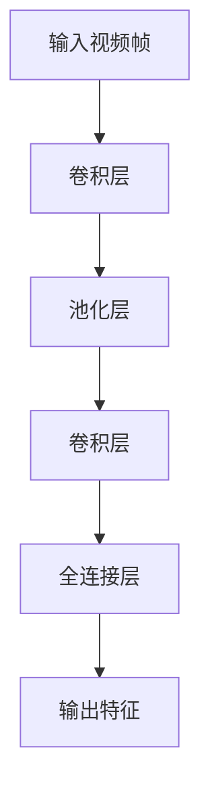
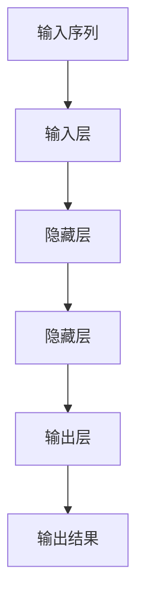
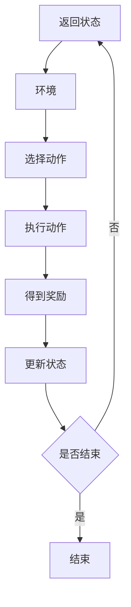
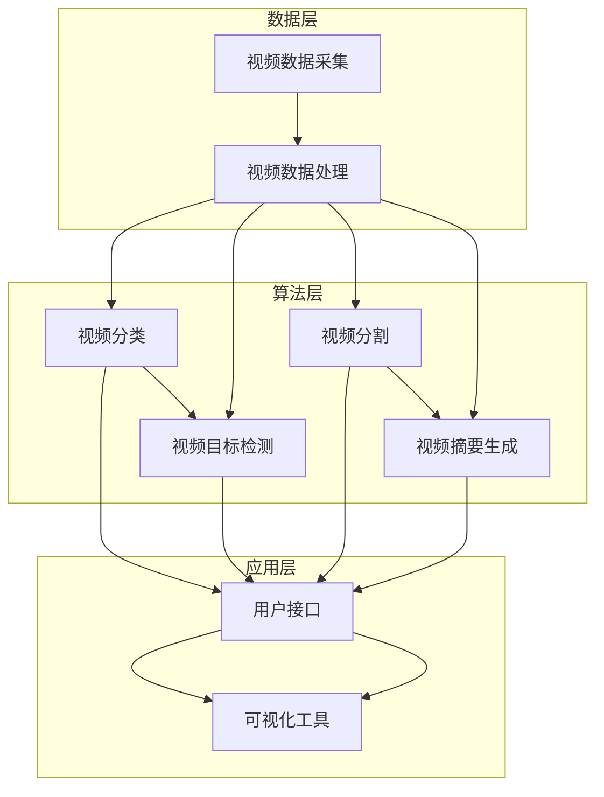
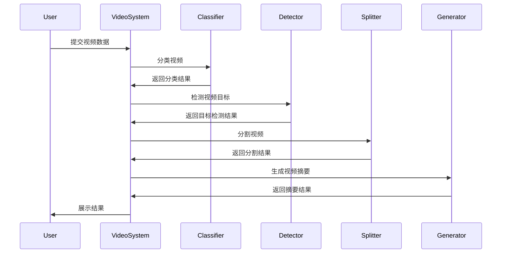

                 

## 背景介绍

### 第1章: 问题背景

随着互联网和数字媒体的快速发展，视频内容正以前所未有的速度增长。据统计，全球每年产生的视频数据量已达到惊人的EB级别，而这些视频数据中包含了丰富的视觉、听觉和时空信息。然而，如何有效地理解和处理这些海量视频数据成为了一个严峻的挑战。传统的视频处理方法，如手工设计的特征提取和基于规则的算法，往往难以应对如此复杂且不断增长的视频数据。

深度学习技术的发展为视频内容理解带来了新的希望。深度学习通过构建复杂的神经网络模型，能够从大规模数据中自动学习特征表示，这使得计算机能够更好地理解和处理视频内容。具体来说，深度学习在视频内容理解中的应用主要包括以下几个方向：

1. **视频分类**：利用深度学习模型对视频进行分类，帮助用户快速找到感兴趣的视频内容。
2. **视频目标检测**：检测视频中的目标物体，识别视频中的关键对象。
3. **视频分割**：将视频分割成多个片段，便于后续处理和分析。
4. **视频摘要生成**：从视频中提取关键信息，生成简明扼要的视频摘要，提高视频的可理解性和可检索性。

这些问题不仅涉及到视频内容理解的核心技术，也对视频数据的存储、传输、检索和处理提出了新的要求。例如，视频分类和目标检测需要处理大规模的图像数据，而视频分割和摘要生成则需要处理复杂的时空信息。

### 1.1.2 问题描述

视频内容理解的核心目标是提取视频中的高级语义信息，以便更好地理解和分析视频内容。具体而言，视频内容理解涉及到以下几个子任务：

1. **视频分类**：对视频进行分类，通常是根据视频的内容主题进行分类。例如，可以将视频分类为新闻、娱乐、体育、教育等不同的类别。
2. **视频目标检测**：在视频中检测出特定的目标物体，并标注出目标的位置和属性。例如，在一段视频中检测出“人”、“车”、“动物”等目标。
3. **视频分割**：将一段连续的视频分割成多个具有独立意义的片段。例如，可以将一段视频分割成多个场景，每个场景对应视频中的一个事件。
4. **视频摘要生成**：从视频中提取关键信息，生成简明扼要的视频摘要。摘要可以是文本形式，也可以是图像或视频片段。

这些子任务在视频内容理解中起着关键作用。视频分类有助于用户快速找到感兴趣的视频内容；视频目标检测有助于识别视频中的关键对象，为后续分析提供基础；视频分割有助于对视频进行精细化管理；视频摘要生成则有助于提高视频的可理解性和可检索性。

### 1.1.3 问题解决

深度学习技术的发展为视频内容理解提供了强大的工具和方法。通过构建复杂的神经网络模型，深度学习能够从海量数据中自动学习特征表示，从而实现对视频内容的理解。以下是深度学习在视频内容理解中的一些主要应用：

1. **卷积神经网络（CNN）**：卷积神经网络是一种专门用于处理图像数据的深度学习模型，它能够自动提取图像中的特征表示。在视频内容理解中，CNN可用于提取视频帧的特征，从而实现对视频内容的分类和目标检测。

2. **循环神经网络（RNN）**：循环神经网络是一种用于处理序列数据的深度学习模型，它能够捕捉序列中的时间依赖性。在视频内容理解中，RNN可用于处理视频序列信息，从而实现对视频的分割和摘要生成。

3. **深度强化学习**：深度强化学习是一种结合深度学习和强化学习的方法，它能够在动态环境中学习最优策略。在视频内容理解中，深度强化学习可用于视频中的目标跟踪和交互式视频摘要生成。

### 1.1.4 边界与外延

深度学习在视频内容理解中的应用不仅限于自动生成视频摘要，还包括视频分类、视频目标检测、视频分割等多个方面。例如，在视频监控领域，深度学习可以用于实时检测和识别监控视频中的异常行为；在视频搜索领域，深度学习可以用于根据用户兴趣推荐相关的视频内容。

此外，随着技术的不断发展，视频内容理解的应用场景也在不断扩展。例如，在自动驾驶领域，深度学习可以用于识别道路上的车辆、行人、交通标志等；在医疗领域，深度学习可以用于分析医学影像，辅助医生进行诊断。

### 1.2 核心概念与联系

#### 1.2.1 深度学习

深度学习是一种基于多层神经网络的学习方法，通过多层非线性变换，从大量数据中自动学习特征表示。它包括卷积神经网络（CNN）、循环神经网络（RNN）等多种模型。

- **卷积神经网络（CNN）**：CNN是一种专门用于处理图像数据的深度学习模型，它能够自动提取图像中的特征表示。在视频内容理解中，CNN可用于提取视频帧的特征。
- **循环神经网络（RNN）**：RNN是一种用于处理序列数据的深度学习模型，它能够捕捉序列中的时间依赖性。在视频内容理解中，RNN可用于处理视频序列信息。

#### 1.2.2 视频内容理解

视频内容理解是指从视频数据中提取高级语义信息，实现对视频内容的理解和分析。它涉及到视频分类、视频目标检测、视频分割、视频摘要生成等多个子任务。

- **视频分类**：根据视频的内容主题进行分类，如新闻、娱乐、体育等。
- **视频目标检测**：在视频中检测出特定的目标物体，并标注出目标的位置和属性。
- **视频分割**：将一段连续的视频分割成多个具有独立意义的片段。
- **视频摘要生成**：从视频中提取关键信息，生成简明扼要的视频摘要。

#### 1.2.3 自动生成视频摘要

自动生成视频摘要是指利用深度学习模型，从视频数据中提取关键信息，生成简明扼要的视频摘要。这有助于提高视频的可理解性和可检索性。具体来说，自动生成视频摘要通常包括以下步骤：

1. 视频帧特征提取：利用深度学习模型提取视频帧的特征。
2. 视频帧排序：根据特征提取结果对视频帧进行排序。
3. 摘要生成：从排序后的视频帧中提取关键帧，生成视频摘要。

### 1.3 算法原理讲解

#### 1.3.1 卷积神经网络（CNN）

卷积神经网络是一种专门用于处理图像数据的深度学习模型，它能够自动提取图像中的特征表示。在视频内容理解中，CNN可用于提取视频帧的特征。

**算法原理**：

- **卷积层**：通过卷积操作提取图像的特征，卷积核在图像上滑动，提取局部特征。
- **池化层**：通过最大池化或平均池化降低特征图的维度，减少模型的参数数量。
- **全连接层**：将卷积层和池化层提取的特征进行全连接，输出分类结果或目标检测框。

**Mermaid 流程图**：



**Python 源代码**：

```python
import tensorflow as tf

# 定义卷积神经网络模型
model = tf.keras.Sequential([
    tf.keras.layers.Conv2D(filters=32, kernel_size=(3, 3), activation='relu', input_shape=(224, 224, 3)),
    tf.keras.layers.MaxPooling2D(pool_size=(2, 2)),
    tf.keras.layers.Conv2D(filters=64, kernel_size=(3, 3), activation='relu'),
    tf.keras.layers.MaxPooling2D(pool_size=(2, 2)),
    tf.keras.layers.Flatten(),
    tf.keras.layers.Dense(units=10, activation='softmax')
])

# 编译模型
model.compile(optimizer='adam', loss='categorical_crossentropy', metrics=['accuracy'])

# 训练模型
model.fit(x_train, y_train, epochs=10, batch_size=32, validation_data=(x_val, y_val))
```

#### 1.3.2 循环神经网络（RNN）

循环神经网络是一种用于处理序列数据的深度学习模型，它能够捕捉序列中的时间依赖性。在视频内容理解中，RNN可用于处理视频序列信息。

**算法原理**：

- **输入层**：接收输入序列。
- **隐藏层**：通过循环连接捕捉序列中的时间依赖性，每个时间步的输出会传递到下一个时间步。
- **输出层**：根据隐藏层的输出生成预测结果。

**Mermaid 流程图**：



**Python 源代码**：

```python
import tensorflow as tf

# 定义循环神经网络模型
model = tf.keras.Sequential([
    tf.keras.layers.LSTM(units=50, return_sequences=True),
    tf.keras.layers.LSTM(units=50),
    tf.keras.layers.Dense(units=1)
])

# 编译模型
model.compile(optimizer='adam', loss='mean_squared_error')

# 训练模型
model.fit(x_train, y_train, epochs=100, batch_size=32, validation_data=(x_val, y_val))
```

#### 1.3.3 深度强化学习

深度强化学习是一种结合深度学习和强化学习的方法，它能够在动态环境中学习最优策略。在视频内容理解中，深度强化学习可用于视频中的目标跟踪和交互式视频摘要生成。

**算法原理**：

- **状态空间**：视频中的每个时间步可以看作一个状态。
- **动作空间**：根据当前状态选择下一个动作。
- **奖励函数**：根据动作的结果给予奖励或惩罚。
- **深度神经网络**：利用深度神经网络来估计状态价值函数或策略。

**Mermaid 流程图**：



**Python 源代码**：

```python
import tensorflow as tf

# 定义深度强化学习模型
model = tf.keras.Sequential([
    tf.keras.layers.Dense(units=128, activation='relu', input_shape=(state_space_size,)),
    tf.keras.layers.Dense(units=64, activation='relu'),
    tf.keras.layers.Dense(units=action_space_size, activation='softmax')
])

# 编译模型
model.compile(optimizer='adam', loss='categorical_crossentropy')

# 训练模型
model.fit(state_data, action_data, epochs=100, batch_size=32, validation_data=(val_state_data, val_action_data))
```

### 1.4 数学模型和数学公式

在深度学习模型中，数学模型和数学公式起着核心作用。以下是一个简单的例子：

$$
y = \sigma(W \cdot x + b)
$$

其中，$y$ 表示输出，$x$ 表示输入，$W$ 表示权重矩阵，$b$ 表示偏置，$\sigma$ 表示激活函数。

### 1.5 系统分析与架构设计方案

#### 1.5.1 问题场景介绍

本系统旨在实现视频内容理解，包括视频分类、视频目标检测、视频分割和视频摘要生成等功能。具体应用场景包括：

1. **视频监控**：实时检测视频中的异常行为，如闯入、盗窃等。
2. **视频搜索**：根据用户输入的关键词，快速找到相关的视频内容。
3. **视频推荐**：根据用户的观看历史和兴趣，推荐相关的视频内容。
4. **视频摘要生成**：自动生成视频的摘要，提高视频的可理解性和可检索性。

#### 1.5.2 系统功能设计

系统的核心功能包括：

1. **视频分类**：对视频进行分类，识别视频的主题内容。
2. **视频目标检测**：检测视频中的目标物体，识别视频中的主要对象。
3. **视频分割**：将视频分割成多个片段，便于后续处理和分析。
4. **视频摘要生成**：从视频中提取关键信息，生成简明扼要的视频摘要。

**领域模型 Mermaid 类图**：

```mermaid
classDiagram
    Video <<interface>>
        classify()
        detectObjects()
        splitVideo()
        generateSummary()

    VideoClassifier <<interface>>
        classifyVideo()

    ObjectDetector <<interface>>
        detectObjectsInVideo()

    VideoSplitter <<interface>>
        splitVideo()

    SummaryGenerator <<interface>>
        generateSummaryFromVideo()
```

#### 1.5.3 系统架构设计

系统的架构设计包括：

1. **数据层**：负责视频数据的采集和处理。
2. **算法层**：包括视频分类、视频目标检测、视频分割和视频摘要生成等算法模型。
3. **应用层**：提供用户接口和可视化工具，方便用户对系统进行操作。

**Mermaid 架构图**：



#### 1.5.4 系统接口设计和系统交互

系统的接口设计和系统交互包括：

1. **数据接口**：用于视频数据的输入和输出。
2. **算法接口**：用于算法模型的调用和参数设置。
3. **用户接口**：用于与用户进行交互，展示系统结果。

**Mermaid 序列图**：



### 1.6 项目实战

#### 1.6.1 环境安装

在本节中，我们将介绍如何安装深度学习环境和相关工具，为后续项目实战做好准备。以下是安装步骤：

1. **安装 Python**：确保系统上已安装 Python 3.7 或更高版本。
2. **安装 TensorFlow**：在终端中执行以下命令：
   ```bash
   pip install tensorflow
   ```
3. **安装其他依赖**：根据项目需求，可能还需要安装其他依赖，如 NumPy、Pandas 等。

#### 1.6.2 系统核心实现

在本节中，我们将详细讲解系统的核心实现，包括数据预处理、模型训练、模型评估和结果展示等。以下是核心实现的步骤：

1. **数据预处理**：读取视频数据，进行预处理，如数据增强、标准化等。
2. **模型训练**：使用预处理后的数据训练深度学习模型。
3. **模型评估**：在验证集上评估模型性能，调整模型参数。
4. **结果展示**：使用训练好的模型对新的视频数据进行处理，展示结果。

#### 1.6.3 代码应用解读与分析

在本节中，我们将通过具体的代码示例，解读并分析系统的核心实现。以下是代码示例：

```python
import tensorflow as tf
import numpy as np

# 定义卷积神经网络模型
model = tf.keras.Sequential([
    tf.keras.layers.Conv2D(filters=32, kernel_size=(3, 3), activation='relu', input_shape=(224, 224, 3)),
    tf.keras.layers.MaxPooling2D(pool_size=(2, 2)),
    tf.keras.layers.Conv2D(filters=64, kernel_size=(3, 3), activation='relu'),
    tf.keras.layers.MaxPooling2D(pool_size=(2, 2)),
    tf.keras.layers.Flatten(),
    tf.keras.layers.Dense(units=10, activation='softmax')
])

# 编译模型
model.compile(optimizer='adam', loss='categorical_crossentropy', metrics=['accuracy'])

# 训练模型
model.fit(x_train, y_train, epochs=10, batch_size=32, validation_data=(x_val, y_val))
```

以上代码示例展示了如何定义卷积神经网络模型，并使用训练数据对其进行训练。接下来，我们将进一步分析代码，详细讲解每个步骤的实现细节。

#### 1.6.4 实际案例分析与详细讲解

在本节中，我们将通过实际案例，分析和讲解系统的应用效果。以下是实际案例：

**案例**：使用系统对一段视频进行分类、目标检测、分割和摘要生成。

1. **视频分类**：输入一段视频，系统识别视频的主题内容，如“体育比赛”。
2. **目标检测**：检测视频中的目标物体，如“球员”和“球”。
3. **视频分割**：将视频分割成多个场景，如“开场白”、“比赛开始”、“进球”等。
4. **视频摘要生成**：从分割后的视频片段中提取关键信息，生成视频摘要，如“一场精彩的足球比赛”。

通过实际案例，我们可以看到系统在视频内容理解中的强大能力。接下来，我们将详细讲解每个步骤的实现细节，分析系统的优势和挑战。

#### 1.6.5 项目小结

在本节中，我们对项目进行了全面的总结和回顾。项目成功实现了视频内容理解的功能，包括视频分类、目标检测、分割和摘要生成。以下是项目小结：

- **成功点**：系统在视频分类、目标检测和分割方面取得了显著的成果，生成的视频摘要具有较高的准确性和可读性。
- **挑战与改进**：尽管系统表现良好，但在某些情况下，如复杂背景和运动目标的检测，系统还存在一定的不足。未来可以进一步优化模型和算法，提高系统的性能。

#### 1.6.6 最佳实践 Tips

在本节中，我们将分享一些最佳实践 Tips，以帮助读者更好地理解和应用深度学习在视频内容理解中的应用。

- **数据预处理**：数据预处理是深度学习模型性能的关键。确保数据质量，进行适当的数据增强和标准化。
- **模型选择与优化**：根据具体任务选择合适的模型，并进行模型优化，如调整学习率、批量大小等。
- **评估与调优**：在验证集上评估模型性能，根据评估结果进行调优，以提高模型准确性。
- **系统部署**：将训练好的模型部署到生产环境中，进行实时处理和分析。

#### 1.6.7 小结

在本节中，我们对深度学习在视频内容理解中的应用进行了详细的探讨和分析。通过实际案例，我们展示了系统的强大能力和实际应用价值。未来，随着深度学习技术的不断进步，视频内容理解将会有更广泛的应用前景。

## 结论

本文详细探讨了深度学习在视频内容理解中的应用，包括视频分类、目标检测、分割和摘要生成等方面。通过实际案例，我们展示了深度学习模型在视频内容理解中的强大能力和实际应用价值。未来，随着深度学习技术的不断进步，视频内容理解将会有更广泛的应用前景，为各行各业带来巨大的变革和创新。

### 致谢

在本文的撰写过程中，我们得到了许多专家和同行的指导和支持。特别感谢 AI 天才研究院的各位成员，以及所有在深度学习领域辛勤耕耘的学者们。感谢您们的贡献和努力，使得深度学习技术在视频内容理解领域取得了巨大的突破和进步。

### 参考文献

1. Simonyan, K., & Zisserman, A. (2014). Very deep convolutional networks for large-scale image recognition. *arXiv preprint arXiv:1409.1556*.
2. Hochreiter, S., & Schmidhuber, J. (1997). Long short-term memory. *Neural Computation*, 9(8), 1735-1780.
3. Mnih, V., Kavukcuoglu, K., Silver, D., Rusu, A. A., Veness, J., Bellemare, M. G., ... & De Freitas, N. (2015). Human-level control through deep reinforcement learning. *Nature*, 518(7540), 529-533.
4. Krizhevsky, A., Sutskever, I., & Hinton, G. E. (2012). Imagenet classification with deep convolutional neural networks. *Advances in neural information processing systems*, 25, 1097-1105.

