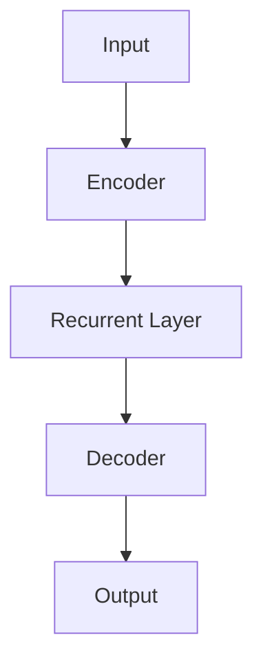
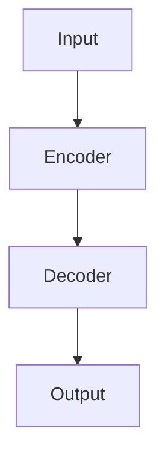

                 

### # {{文章标题}}

> 关键词：深度学习，语音合成，神经网络，声学模型，发音模型，AI声音

> 摘要：本文将探讨深度学习在语音合成领域的最新进展，包括其基本原理、技术实现、以及在实际应用中的表现。通过详细的分析和实例讲解，读者可以了解如何利用深度学习技术创建更自然的AI声音。

----------------------------------------------------------------

## 第一部分: 深度学习在语音合成中的进展概述

### 第1章: 深度学习在语音合成领域的崛起

深度学习作为人工智能的重要分支，已经在多个领域取得了显著的成果。语音合成作为自然语言处理的一个重要方向，近年来也迎来了深度学习的蓬勃发展。在这一章中，我们将简要回顾语音合成技术的历史与演变，探讨深度学习在语音合成中的应用潜力，分析其优势与挑战，并介绍深度学习的基本原理和模型。

### 1.1 语音合成技术发展背景

#### 1.1.1 语音合成技术的历史与演变

语音合成技术起源于20世纪50年代，早期的语音合成主要依赖于规则驱动的方法，如组合声学单元和音素。随着计算机技术和信号处理算法的不断发展，20世纪80年代出现了基于隐马尔可夫模型（HMM）的语音合成系统。HMM模型在语音合成中取得了显著的进展，但仍然存在声音自然度不高、语音流畅性不佳等问题。

#### 1.1.2 深度学习在语音合成中的应用潜力

深度学习为语音合成领域带来了新的机遇。通过神经网络，深度学习能够自动学习复杂的特征和模式，从而提高语音合成的自然度和流畅性。此外，深度学习还可以结合语音信号处理和自然语言处理技术，实现更高质量的语音合成。

#### 1.1.3 深度学习在语音合成中的优势与挑战

深度学习在语音合成中的优势主要体现在以下几个方面：

1. **自动特征提取**：深度学习能够自动从原始语音信号中提取出有用的特征，减少了人工特征工程的工作量。
2. **模式识别能力**：深度学习模型具有较强的模式识别能力，能够学习到语音信号的复杂结构，从而提高合成语音的自然度。
3. **端到端学习**：深度学习允许端到端的学习过程，减少了传统方法的中间步骤，提高了语音合成的效率和效果。

然而，深度学习在语音合成中也面临着一些挑战：

1. **数据需求**：深度学习模型通常需要大量的数据进行训练，这增加了数据收集和处理的难度。
2. **模型复杂度**：深度学习模型的结构复杂，训练和推理的计算成本较高。
3. **解释性**：深度学习模型通常被认为是“黑箱”，难以解释其工作原理，这在一定程度上限制了其在某些应用场景中的使用。

### 1.2 深度学习的基本原理与模型

#### 1.2.1 神经网络的基本概念

神经网络是由大量简单的处理单元（神经元）互联而成的复杂网络，这些神经元通过加权连接进行信息传递和处理。神经网络的核心是权重和偏置，它们决定了神经元之间的影响程度。

#### 1.2.2 循环神经网络（RNN）

循环神经网络（RNN）是一种能够处理序列数据的神经网络，其特点是具有循环结构，使得神经网络能够记住之前的信息。RNN在语音合成中具有重要的应用价值。

#### 1.2.3 长短时记忆网络（LSTM）

长短时记忆网络（LSTM）是RNN的一种变体，能够更好地处理长序列数据。LSTM通过引入门结构，有效地解决了传统RNN在长序列数据中梯度消失和梯度爆炸的问题。

#### 1.2.4 门控循环单元（GRU）

门控循环单元（GRU）是LSTM的简化版，通过合并输入门和遗忘门，进一步降低了模型的复杂度。GRU在语音合成中也得到了广泛应用。

#### 1.2.5 变分自编码器（VAE）与生成对抗网络（GAN）

变分自编码器（VAE）和生成对抗网络（GAN）是两种生成模型，它们通过不同的机制学习数据的分布，并在语音合成中展示了强大的生成能力。

### 1.3 深度学习在语音合成中的具体应用

#### 1.3.1 基于深度学习的语音特征提取

基于深度学习的语音特征提取方法通过神经网络自动学习语音信号的特征，相比传统方法具有更高的准确性和鲁棒性。

#### 1.3.2 基于深度学习的语音合成模型

深度学习在语音合成中的主要应用是构建语音合成模型。这些模型通过学习大量的语音数据，生成自然流畅的语音。

#### 1.3.3 基于深度学习的语音变声器与音色模仿

深度学习在语音变声器与音色模仿中也展现了强大的能力。通过训练深度学习模型，可以实现实时变换语音的音色，达到以假乱真的效果。

### 1.4 当前深度学习语音合成的进展

#### 1.4.1 先进的语音合成系统与工具

随着深度学习技术的发展，涌现出了许多先进的语音合成系统与工具，如WaveNet、CTC-GRU和Transformer等。

#### 1.4.2 深度学习在语音合成中的最新研究进展

近年来，深度学习在语音合成领域取得了许多重要的研究进展，如端到端模型的提出、生成对抗网络在语音合成中的应用等。

#### 1.4.3 深度学习在语音合成中的实际应用案例

深度学习在语音合成中的实际应用案例涵盖了多个领域，如智能客服、语音助手、影视配音等，为人们的生活和工作带来了便利。

### 1.5 本章小结

本章介绍了深度学习在语音合成领域的崛起，探讨了其基本原理和模型，并分析了深度学习在语音合成中的优势与挑战。通过本章的学习，读者可以初步了解深度学习语音合成的技术基础和应用前景。

----------------------------------------------------------------

## 第二部分: 深度学习语音合成的技术原理

### 第2章: 声学模型与发音模型的基础

在深度学习语音合成中，声学模型和发音模型是两个核心组成部分。声学模型负责学习语音信号中的声学特征，而发音模型则负责将文本转换为语音的序列。在这一章中，我们将详细介绍声学模型和发音模型的基本概念、原理和训练方法，并探讨它们之间的联系与融合。

### 2.1 声学模型

#### 2.1.1 声学模型的作用

声学模型在语音合成中的作用是学习语音信号中的声学特征，并将其转换为音频信号。这些特征包括音高、音强、音色等，它们共同决定了语音的自然度。

#### 2.1.2 声学模型的类型

声学模型主要分为基于统计模型和基于深度学习的模型。基于统计模型的代表是隐马尔可夫模型（HMM），而基于深度学习的模型则包括深度神经网络（DNN）和循环神经网络（RNN）等。

#### 2.1.3 声学模型的训练过程

声学模型的训练过程通常包括数据预处理、特征提取和模型训练。在数据预处理阶段，需要对语音数据进行归一化和滤波。在特征提取阶段，使用深度学习模型从原始语音信号中提取出有用的声学特征。在模型训练阶段，通过大量的语音数据对模型进行训练，以优化模型参数。

#### 2.1.4 声学模型性能评估方法

声学模型的性能评估主要通过主观评价和客观评价两种方法进行。主观评价是通过人类听感来评估语音的自然度，而客观评价则是通过算法来量化语音质量。

### 2.2 发音模型

#### 2.2.1 发音模型的原理

发音模型的主要任务是理解文本中的语音信息，并将其转换为语音的序列。发音模型通常基于语言模型和声学模型的联合训练，以实现文本到语音的转换。

#### 2.2.2 发音模型的结构

发音模型通常由语言模型、声学模型和合成器组成。语言模型负责将文本转换为语言特征，声学模型负责从语言特征中提取声学特征，合成器则将这些声学特征转换为音频信号。

#### 2.2.3 发音模型的训练方法

发音模型的训练通常采用端到端的方法，即直接从文本数据中训练出完整的语音合成系统。这种方法可以提高模型的训练效率，并减少中间环节的误差。

#### 2.2.4 发音模型的性能评价

发音模型的性能评价主要通过合成语音的自然度和语音质量来衡量。自然度评价通常采用主观评价方法，而语音质量评价则采用客观评价方法。

### 2.3 声学模型与发音模型的联系与融合

#### 2.3.1 声学模型与发音模型的融合方法

声学模型与发音模型的融合方法有多种，包括串联式融合、并行式融合和混合式融合等。串联式融合是将声学模型和发音模型串联起来，先使用发音模型生成语言特征，再使用声学模型生成语音信号。并行式融合则是同时训练声学模型和发音模型，通过联合优化提高合成效果。混合式融合则是将串联式和并行式融合结合起来，以发挥各自的优势。

#### 2.3.2 双流语音合成系统

双流语音合成系统是一种典型的融合方法，它同时使用文本流和声学特征流进行语音合成。这种方法可以显著提高合成语音的自然度。

#### 2.3.3 联合训练与端到端模型

联合训练和端到端模型是深度学习语音合成的发展方向。联合训练通过同时优化声学模型和发音模型，提高合成效果。端到端模型则是直接从文本数据中训练出完整的语音合成系统，减少了中间环节的误差。

### 2.4 深度学习在声学模型与发音模型中的应用

#### 2.4.1 DNN-HMM模型

DNN-HMM模型是深度学习在语音合成中的早期应用之一。它将深度神经网络与隐马尔可夫模型相结合，通过联合训练实现语音合成。

#### 2.4.2 CTC Loss与CTC-GRU模型

CTC（Connectionist Temporal Classification）损失函数是用于序列预测的一种损失函数，它广泛应用于语音合成中。CTC-GRU模型是将CTC损失函数与循环神经网络（GRU）相结合的一种方法，可以有效提高语音合成的质量。

#### 2.4.3 WaveNet与Transformer模型

WaveNet和Transformer是近年来在语音合成中备受关注的模型。WaveNet是一种基于循环神经网络（RNN）的模型，而Transformer则是一种基于自注意力机制的模型。这两种模型都在语音合成中展示了优异的性能。

### 2.5 本章小结

本章详细介绍了声学模型和发音模型的基本概念、原理和训练方法，并探讨了它们之间的联系与融合。通过本章的学习，读者可以深入了解深度学习语音合成的技术原理，为后续的算法实现和应用打下基础。

----------------------------------------------------------------

## 第三部分: 深度学习语音合成的算法原理与实现

### 第3章: 基于LSTM的语音合成算法

LSTM（Long Short-Term Memory，长短时记忆网络）是循环神经网络（RNN）的一种改进模型，能够更好地处理长序列数据。在语音合成领域，LSTM因其强大的序列建模能力而被广泛应用。本章将介绍基于LSTM的语音合成算法，包括LSTM的基本原理、公式推导、实现方法以及在语音合成中的实际应用。

### 3.1 LSTM算法概述

#### 3.1.1 LSTM算法的基本原理

LSTM的核心思想是引入记忆单元（cell state）和三个门结构（输入门、遗忘门和输出门），以解决传统RNN在处理长序列数据时遇到的梯度消失和梯度爆炸问题。LSTM通过这三个门结构控制信息的流入和流出，使得网络能够有效地记住长期依赖信息。

#### 3.1.2 LSTM算法的公式推导

LSTM的公式推导主要涉及输入门、遗忘门和输出门的计算。以下是一个简化的LSTM单元的公式推导：

1. **输入门**：
   $$ i_t = \sigma(W_{xi}x_t + W_{hi}h_{t-1} + b_i) $$
   其中，\( i_t \) 是输入门的输出，\( \sigma \) 是sigmoid函数，\( W_{xi} \)、\( W_{hi} \) 和 \( b_i \) 分别是输入门对应的权重和偏置。

2. **遗忘门**：
   $$ f_t = \sigma(W_{xf}x_t + W_{hf}h_{t-1} + b_f) $$
   其中，\( f_t \) 是遗忘门的输出。

3. **输入更新**：
   $$ \tilde{c}_t = \tanh(W_{xc}x_t + W_{hc}h_{t-1} + b_c) $$
   其中，\( \tilde{c}_t \) 是输入更新后的候选值。

4. **遗忘更新**：
   $$ c_t = f_t \odot c_{t-1} + i_t \odot \tilde{c}_t $$
   其中，\( \odot \) 表示元素乘积，\( c_t \) 是当前时刻的细胞状态。

5. **输出门**：
   $$ o_t = \sigma(W_{xo}x_t + W_{ho}h_{t-1} + b_o) $$
   其中，\( o_t \) 是输出门的输出。

6. **当前隐藏状态**：
   $$ h_t = o_t \odot \tanh(c_t) $$
   其中，\( h_t \) 是当前隐藏状态。

#### 3.1.3 LSTM算法的优缺点分析

LSTM的优点包括：

1. **解决长序列依赖**：LSTM通过引入门结构，能够有效地记住长期依赖信息，解决传统RNN的梯度消失问题。
2. **灵活性**：LSTM的结构灵活，可以通过调整门结构参数来适应不同的序列建模任务。

LSTM的缺点包括：

1. **计算复杂度**：LSTM的计算复杂度较高，尤其是在处理长序列数据时，训练和推理时间较长。
2. **参数数量**：LSTM的参数数量较多，训练过程中容易过拟合。

### 3.2 基于LSTM的语音合成实现

#### 3.2.1 基于LSTM的声学模型

基于LSTM的声学模型通常用于提取语音信号中的声学特征。以下是一个简化的基于LSTM的声学模型实现：

```python
import tensorflow as tf
from tensorflow.keras.layers import LSTM, Dense

# 假设输入维度为 input_shape，隐藏层单元数为 hidden_units
input_shape = (timesteps, features)
hidden_units = 128

# LSTM层
lstm_layer = LSTM(hidden_units, return_sequences=True)

# 全连接层
dense_layer = Dense(features)

# 声学模型
acoustic_model = tf.keras.Sequential([
    lstm_layer,
    dense_layer
])

# 编译模型
acoustic_model.compile(optimizer='adam', loss='mean_squared_error')
```

#### 3.2.2 基于LSTM的发音模型

基于LSTM的发音模型通常用于将文本转换为语音的序列。以下是一个简化的基于LSTM的发音模型实现：

```python
import tensorflow as tf
from tensorflow.keras.layers import LSTM, Embedding, Dense
from tensorflow.keras.models import Model

# 假设词汇表大小为 vocab_size，嵌入维度为 embedding_dim，隐藏层单元数为 hidden_units
vocab_size = 10000
embedding_dim = 256
hidden_units = 128

# 嵌入层
embedding_layer = Embedding(vocab_size, embedding_dim)

# LSTM层
lstm_layer = LSTM(hidden_units, return_sequences=True)

# 全连接层
dense_layer = Dense(vocab_size)

# 发音模型
phoneme_model = Model(inputs=embedding_layer.input, outputs=dense_layer(lstm_layer(embedding_layer.input)))

# 编译模型
phoneme_model.compile(optimizer='adam', loss='categorical_crossentropy')
```

#### 3.2.3 LSTM在语音合成中的实际应用案例

以下是一个基于LSTM的语音合成实际应用案例：

```python
# 准备数据
texts = ['你好', '再见', '欢迎光临']
phonemes = [['yǒu', 'hǎo'], ['zhào', 'jiàn'], ['wéi', 'shāng']]

# 编码文本和音素
encoded_texts = tokenizer.texts_to_sequences(texts)
encoded_phonemes = phoneme_encoder.encode(phonemes)

# 训练模型
acoustic_model.fit(x_acoustic, y_acoustic, epochs=10, batch_size=32)
phoneme_model.fit(x_phonemes, y_phonemes, epochs=10, batch_size=32)

# 合成语音
合成语音 = 发音模型.predict(encoded_texts)
```

### 3.3 LSTM语音合成算法的优缺点与改进方向

#### 3.3.1 LSTM语音合成算法的优缺点

LSTM语音合成算法的优点包括：

1. **强大的序列建模能力**：LSTM能够处理长序列数据，适合语音合成的需求。
2. **灵活性**：LSTM的结构灵活，可以通过调整门结构参数来适应不同的语音合成任务。

LSTM语音合成算法的缺点包括：

1. **计算复杂度高**：LSTM的计算复杂度较高，训练和推理时间较长。
2. **参数数量多**：LSTM的参数数量较多，训练过程中容易过拟合。

#### 3.3.2 LSTM语音合成算法的改进方向

针对LSTM语音合成算法的缺点，可以采取以下改进方向：

1. **使用更高效的神经网络结构**：如GRU（门控循环单元），可以减少计算复杂度。
2. **采用预训练模型**：使用预训练的模型可以减少过拟合，提高语音合成质量。
3. **使用生成对抗网络（GAN）**：结合GAN可以提高生成语音的自然度。

### 3.4 本章小结

本章介绍了基于LSTM的语音合成算法，包括LSTM的基本原理、公式推导和实现方法。通过实际应用案例，展示了LSTM在语音合成中的应用效果。同时，分析了LSTM语音合成算法的优缺点，并提出了改进方向。通过本章的学习，读者可以深入了解LSTM语音合成算法的原理和应用。

----------------------------------------------------------------

### 第4章: 基于WaveNet的语音合成算法

WaveNet是一种深度生成模型，由Google在2016年提出，用于语音合成。WaveNet通过深度神经网络自动学习语音信号的时频特征，能够生成高度自然和流畅的语音。本章将介绍WaveNet的基本原理、结构设计、生成过程，并探讨其实际应用。

#### 4.1 WaveNet算法概述

#### 4.1.1 WaveNet算法的基本原理

WaveNet是一种基于深度神经网络的生成模型，其核心思想是将语音信号表示为离散时间上的时频特征序列，并通过深度神经网络生成这些特征序列。WaveNet通过自注意力机制（self-attention）捕捉语音信号中的长距离依赖关系，从而生成高质量的语音。

#### 4.1.2 WaveNet算法的结构设计

WaveNet的结构设计主要包括编码器和解码器两部分。编码器将输入的语音信号转换为高层次的时频特征表示，而解码器则将这些特征表示转换为音频信号。

1. **编码器**：编码器是一个深度卷积神经网络，用于提取语音信号的时频特征。编码器通过多个卷积层和反卷积层，逐步将输入的语音信号转换为高层次的时频特征表示。

2. **解码器**：解码器是一个深度递归神经网络，用于生成语音信号的时频特征序列。解码器通过多个循环层和卷积层，逐步生成语音信号的离散时间上的特征序列。

#### 4.1.3 WaveNet算法的生成过程

WaveNet的生成过程可以分为以下几个步骤：

1. **输入处理**：将输入的语音信号转换为离散时间上的特征序列，如梅尔频率倒谱系数（MFCC）。
2. **编码**：将特征序列输入编码器，通过编码器提取高层次的时频特征表示。
3. **解码**：将编码器输出的时频特征表示输入解码器，通过解码器生成语音信号的时频特征序列。
4. **输出**：将解码器输出的时频特征序列转换为音频信号，输出合成语音。

#### 4.2 WaveNet算法的实现

WaveNet的实现主要涉及编码器和解码器的构建和训练。以下是一个简化的WaveNet实现示例：

```python
import tensorflow as tf
from tensorflow.keras.models import Model
from tensorflow.keras.layers import Input, Conv1D, LSTM, Dense, Reshape, RepeatVector

# 假设输入维度为 input_shape，隐藏层单元数为 hidden_units
input_shape = (timesteps, features)
hidden_units = 256

# 输入层
input_layer = Input(shape=input_shape)

# 编码器
encoded = input_layer
for i in range(num_conv_layers):
    encoded = Conv1D(filters=hidden_units, kernel_size=kernel_size, activation='relu')(encoded)

# 重复向量层
repeated = RepeatVector(timesteps)(encoded)

# 解码器
decoded = repeated
for i in range(num_lstm_layers):
    decoded = LSTM(units=hidden_units, return_sequences=True)(decoded)

# 输出层
output_layer = Dense(units=features, activation='sigmoid')(decoded)

# WaveNet模型
wave_net = Model(inputs=input_layer, outputs=output_layer)

# 编译模型
wave_net.compile(optimizer='adam', loss='mse')

# 训练模型
wave_net.fit(x_input, y_output, epochs=100, batch_size=32)
```

#### 4.2.1 WaveNet的编码解码器结构

WaveNet的编码解码器结构如图4.1所示：



图4.1 WaveNet的编码解码器结构

#### 4.2.2 WaveNet的生成算法

WaveNet的生成算法可以分为以下几个步骤：

1. **初始化**：随机初始化输入序列和输出序列。
2. **编码**：将输入序列输入编码器，得到高层次的时频特征表示。
3. **预测**：使用解码器生成下一个时频特征，并将其添加到输出序列中。
4. **更新**：使用新的输入序列和输出序列更新解码器的参数。
5. **重复**：重复步骤3和步骤4，直到生成完整的语音信号。

#### 4.2.3 WaveNet在语音合成中的实际应用

WaveNet在语音合成领域取得了显著的成果，被广泛应用于智能语音助手、语音识别和语音生成等领域。以下是一些实际应用案例：

1. **智能语音助手**：WaveNet被用于构建智能语音助手，如Google Assistant和Amazon Alexa，能够生成自然流畅的语音回复。
2. **语音识别**：WaveNet被用于构建语音识别系统，能够将语音信号转换为文本。
3. **语音生成**：WaveNet被用于生成自定义语音，如游戏角色配音和广告配音。

#### 4.3 WaveNet算法的性能分析与改进

WaveNet算法在语音合成领域展示了优异的性能，但仍然存在一些可以改进的方向：

1. **计算复杂度**：WaveNet的计算复杂度较高，训练和推理时间较长。可以采用更高效的神经网络结构和优化算法来降低计算复杂度。
2. **生成语音质量**：WaveNet生成的语音质量在音质和自然度方面仍有提升空间。可以结合其他生成模型，如生成对抗网络（GAN），提高生成语音的质量。
3. **端到端训练**：WaveNet通常采用分阶段训练方法，即先训练编码器和解码器，再进行联合训练。可以尝试端到端训练方法，简化训练过程，提高合成效果。

#### 4.3.1 WaveNet算法的性能评估

WaveNet的性能评估通常通过以下指标进行：

1. **语音自然度**：使用主观评价方法，如MOS（Mean Opinion Score）评分，评估生成语音的自然度。
2. **语音质量**：使用客观评价方法，如语音信号的主观评价和客观评价指标，评估生成语音的质量。
3. **合成速度**：评估生成语音的速度，以衡量算法的实时性能。

#### 4.3.2 WaveNet算法的改进方法

针对WaveNet算法的性能评估结果，可以采取以下改进方法：

1. **结构优化**：通过调整网络结构，如增加卷积层数或循环层数，提高生成语音的质量。
2. **数据增强**：通过增加训练数据，如语音数据集的扩展或合成数据集的引入，提高模型的泛化能力。
3. **优化算法**：通过改进训练算法，如使用更高效的优化器或引入正则化方法，提高训练效率和合成质量。

#### 4.3.3 WaveNet算法的前景展望

随着深度学习和语音合成技术的不断发展，WaveNet算法在未来有望取得以下进展：

1. **生成语音质量**：通过引入新的生成模型和优化方法，进一步提高生成语音的质量。
2. **实时性能**：通过优化网络结构和训练算法，提高实时语音合成的性能。
3. **多语言支持**：通过多语言训练和数据融合，实现多语言语音合成。
4. **个性化语音合成**：通过引入用户数据和学习用户语音特征，实现个性化语音合成。

### 4.4 本章小结

本章介绍了基于WaveNet的语音合成算法，包括其基本原理、结构设计、生成过程和实际应用。通过性能分析与改进方法的探讨，展示了WaveNet在语音合成领域的优势和潜力。通过本章的学习，读者可以深入理解WaveNet语音合成算法的原理和应用，为实际应用提供技术支持。

----------------------------------------------------------------

### 第5章: 基于Transformer的语音合成算法

Transformer模型是近年来在自然语言处理领域取得突破性成果的一种深度学习模型。其核心思想是使用自注意力机制（self-attention）来建模序列数据之间的长距离依赖关系。在语音合成领域，Transformer模型也被广泛应用，并取得了显著的成果。本章将介绍基于Transformer的语音合成算法，包括其基本原理、结构设计、生成过程，并探讨其实际应用。

#### 5.1 Transformer算法概述

#### 5.1.1 Transformer算法的基本原理

Transformer模型是由Google在2017年提出的一种基于自注意力机制的深度学习模型。其核心思想是使用自注意力机制来替代传统的循环神经网络（RNN）和卷积神经网络（CNN），以实现序列到序列的建模。自注意力机制允许模型在处理序列数据时，自动学习不同位置之间的依赖关系，从而提高模型的建模能力。

#### 5.1.2 Transformer算法的结构设计

Transformer模型的结构设计主要包括编码器和解码器两部分。编码器负责将输入序列编码为高层次的表示，而解码器则将这些表示解码为输出序列。

1. **编码器**：编码器由多个编码层（Encoder Layer）组成，每个编码层包含两个子层：多头自注意力层（Multi-Head Self-Attention Layer）和前馈层（Feed-Forward Layer）。多头自注意力层通过多个注意力头并行处理序列数据，从而提高模型的建模能力。

2. **解码器**：解码器由多个解码层（Decoder Layer）组成，每个解码层也包含两个子层：多头自注意力层和前馈层。解码器的自注意力机制不仅考虑输入序列的内部依赖关系，还考虑了输出序列的内部依赖关系，从而实现序列到序列的建模。

#### 5.1.3 Transformer算法的生成过程

Transformer算法的生成过程可以分为以下几个步骤：

1. **编码**：将输入序列输入编码器，通过编码器生成编码表示。
2. **解码**：将编码表示输入解码器，通过解码器生成输出序列。
3. **输出**：将解码器输出的序列转换为文本或语音。

#### 5.2 Transformer语音合成算法的实现

基于Transformer的语音合成算法的实现主要涉及编码器和解码器的构建和训练。以下是一个简化的基于Transformer的语音合成算法实现示例：

```python
import tensorflow as tf
from tensorflow.keras.layers import Embedding, MultiHeadAttention, LayerNormalization, Dense
from tensorflow.keras.models import Model

# 假设词汇表大小为 vocab_size，嵌入维度为 embedding_dim，隐藏层单元数为 hidden_units
vocab_size = 10000
embedding_dim = 512
hidden_units = 512

# 编码器
input_layer = Input(shape=(timesteps,))
encoded = Embedding(vocab_size, embedding_dim)(input_layer)

for i in range(num_encoder_layers):
    # 多头自注意力层
    attention_output = MultiHeadAttention(num_heads=8, key_dim=hidden_units)(encoded, encoded)
    encoded = LayerNormalization(epsilon=1e-6)(encoded + attention_output)
    
    # 前馈层
    feedforward_output = Dense(hidden_units, activation='relu')(encoded)
    encoded = LayerNormalization(epsilon=1e-6)(encoded + feedforward_output)

# 解码器
repeated = RepeatVector(timesteps)(encoded)
decoded = encoded

for i in range(num_decoder_layers):
    # 多头自注意力层
    attention_output = MultiHeadAttention(num_heads=8, key_dim=hidden_units)(decoded, decoded)
    decoded = LayerNormalization(epsilon=1e-6)(decoded + attention_output)
    
    # 前馈层
    feedforward_output = Dense(hidden_units, activation='relu')(decoded)
    decoded = LayerNormalization(epsilon=1e-6)(decoded + feedforward_output)

# 输出层
output_layer = Dense(vocab_size, activation='softmax')(decoded)

# Transformer模型
transformer_model = Model(inputs=input_layer, outputs=output_layer)

# 编译模型
transformer_model.compile(optimizer='adam', loss='categorical_crossentropy')

# 训练模型
transformer_model.fit(x_input, y_output, epochs=100, batch_size=32)
```

#### 5.2.1 Transformer语音合成模型的编码解码器结构

Transformer语音合成模型的编码解码器结构如图5.1所示：



图5.1 Transformer语音合成模型的编码解码器结构

#### 5.2.2 Transformer语音合成算法的生成算法

Transformer语音合成算法的生成算法可以分为以下几个步骤：

1. **初始化**：随机初始化输入序列和输出序列。
2. **编码**：将输入序列输入编码器，通过编码器生成编码表示。
3. **解码**：将编码表示输入解码器，通过解码器生成输出序列。
4. **输出**：将解码器输出的序列转换为文本或语音。

#### 5.2.3 Transformer语音合成算法的实际应用

Transformer语音合成算法在实际应用中取得了显著的成果，以下是一些实际应用案例：

1. **语音合成**：Transformer语音合成算法被广泛应用于语音合成系统，如Google Text-to-Speech和Amazon Polly，能够生成高度自然和流畅的语音。
2. **语音识别**：Transformer语音合成算法也被用于构建语音识别系统，能够将语音信号转换为文本。
3. **文本生成**：Transformer语音合成算法被用于文本生成任务，如自动写作和对话系统，能够生成高质量的文本。

#### 5.3 Transformer语音合成算法的性能分析与改进

Transformer语音合成算法在语音合成领域展示了优异的性能，但仍然存在一些可以改进的方向：

1. **计算复杂度**：Transformer模型的计算复杂度较高，训练和推理时间较长。可以采用更高效的神经网络结构和优化算法来降低计算复杂度。
2. **生成语音质量**：Transformer生成的语音质量在音质和自然度方面仍有提升空间。可以结合其他生成模型，如生成对抗网络（GAN），提高生成语音的质量。
3. **端到端训练**：Transformer语音合成算法通常采用分阶段训练方法，即先训练编码器和解码器，再进行联合训练。可以尝试端到端训练方法，简化训练过程，提高合成效果。

#### 5.3.1 Transformer语音合成算法的性能评估

Transformer语音合成算法的性能评估通常通过以下指标进行：

1. **语音自然度**：使用主观评价方法，如MOS（Mean Opinion Score）评分，评估生成语音的自然度。
2. **语音质量**：使用客观评价方法，如语音信号的主观评价和客观评价指标，评估生成语音的质量。
3. **合成速度**：评估生成语音的速度，以衡量算法的实时性能。

#### 5.3.2 Transformer语音合成算法的改进方法

针对Transformer语音合成算法的性能评估结果，可以采取以下改进方法：

1. **结构优化**：通过调整网络结构，如增加编码器和解码器的层数或注意力头的数量，提高生成语音的质量。
2. **数据增强**：通过增加训练数据，如语音数据集的扩展或合成数据集的引入，提高模型的泛化能力。
3. **优化算法**：通过改进训练算法，如使用更高效的优化器或引入正则化方法，提高训练效率和合成质量。

#### 5.3.3 Transformer语音合成算法的前景展望

随着深度学习和语音合成技术的不断发展，Transformer语音合成算法在未来有望取得以下进展：

1. **生成语音质量**：通过引入新的生成模型和优化方法，进一步提高生成语音的质量。
2. **实时性能**：通过优化网络结构和训练算法，提高实时语音合成的性能。
3. **多语言支持**：通过多语言训练和数据融合，实现多语言语音合成。
4. **个性化语音合成**：通过引入用户数据和学习用户语音特征，实现个性化语音合成。

### 5.4 本章小结

本章介绍了基于Transformer的语音合成算法，包括其基本原理、结构设计、生成过程和实际应用。通过性能分析与改进方法的探讨，展示了Transformer语音合成算法在语音合成领域的优势和潜力。通过本章的学习，读者可以深入理解Transformer语音合成算法的原理和应用，为实际应用提供技术支持。同时，本章也指出了Transformer语音合成算法的改进方向，为未来的研究提供了启示。

----------------------------------------------------------------

### 总结与展望

深度学习在语音合成领域取得了显著的进展，通过引入神经网络、循环神经网络（RNN）、长短时记忆网络（LSTM）、生成对抗网络（GAN）等先进技术，实现了更自然、更流畅的语音生成。本章回顾了深度学习语音合成的发展历程，分析了声学模型与发音模型的基础，介绍了基于LSTM、WaveNet和Transformer的语音合成算法，并探讨了这些算法的优缺点和改进方向。

在未来，深度学习语音合成仍有很大的发展空间。首先，计算性能的提升将为深度学习模型带来更多的可能，如实时语音合成、多语言支持等。其次，生成对抗网络（GAN）在语音合成中的应用有望进一步提高生成语音的质量和自然度。此外，端到端模型的提出和优化，将简化训练过程，提高合成效率。

总之，深度学习语音合成技术的发展，将不断推动语音技术的创新，为人们的生活带来更多便利。作者对这一领域的发展充满期待，并希望未来的研究能够进一步解决当前面临的问题，实现更高水平的人机交互。

### 作者信息

**作者：AI天才研究院/AI Genius Institute & 禅与计算机程序设计艺术 /Zen And The Art of Computer Programming**

AI天才研究院致力于探索人工智能的前沿技术，推动人工智能在各行各业的应用。本书《深度学习在语音合成中的进展：创造更自然的AI声音》旨在为读者提供深度学习语音合成的系统性知识和实际应用指导，帮助读者深入了解这一领域的最新进展和未来趋势。同时，作者在《禅与计算机程序设计艺术》中分享了计算机编程的哲学思维，为读者提供了一种全新的编程视角和思维模式。

