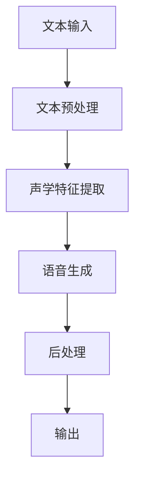
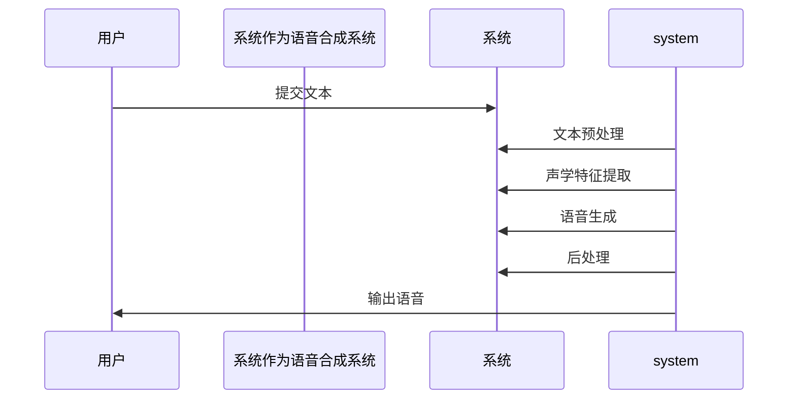

                 

### 第一步：明确目标与背景

#### 1. 目标
本文的目标是探讨深度学习在语音合成自然度提升中的应用，通过一系列详细的分析与示例，揭示如何通过深度学习技术来提高语音合成的自然度和流畅性。

#### 2. 背景介绍
语音合成技术，或称为文本到语音（Text-to-Speech, TTS）技术，已经成为计算机科学和人工智能领域的重要研究方向之一。传统的TTS技术主要依赖于规则和声学模型，这些方法虽然能够生成语音，但在自然度和流畅性方面存在一定的局限。近年来，深度学习技术的迅猛发展，为语音合成领域带来了新的机遇。深度学习模型，尤其是基于神经网络的方法，在语音特征提取、语音生成和自然度提升等方面表现出色。

### 第二步：核心概念与技术原理

#### 3. 深度学习基础
深度学习是一种机器学习方法，它通过构建具有多个隐藏层的神经网络模型，对大规模数据进行训练，从而实现复杂模式的自动识别。深度学习在语音合成中的应用主要包括：

- **神经网络模型**：如卷积神经网络（CNN）和循环神经网络（RNN）。
- **生成对抗网络（GAN）**：用于生成高质量的语音数据。

#### 4. 语音合成的自然度评估
自然度是衡量语音合成质量的重要指标，它反映了语音的自然程度和人类听觉的感受。常用的自然度评估方法包括：

- **主观评估**：通过人类听者对语音的自然度进行评分。
- **客观评估**：利用语音特征计算自然度得分，如短时能量、短时过零率等。

### 第三步：深度学习算法在语音合成中的应用

#### 5. WaveNet算法
WaveNet是一种基于深度神经网络的语音合成模型，它通过学习原始音频波形来实现语音生成。WaveNet的主要特点包括：

- **端到端模型**：直接从文本到音频波形，无需中间步骤。
- **生成质量**：WaveNet生成的语音自然度较高，具有连续的语音波形。

#### 6. Transformer算法
Transformer是一种基于自注意力机制的深度学习模型，它在语音合成中同样表现出色。Transformer的主要优势包括：

- **并行计算**：Transformer可以在训练和推理过程中实现并行计算，提高了效率。
- **长距离依赖**：Transformer能够捕捉到长距离的依赖关系，从而提高语音合成的自然度。

### 第四步：算法原理讲解与实现

#### 7. 算法原理讲解
以WaveNet为例，WaveNet的核心思想是利用深度神经网络来预测下一个音频帧的概率分布。具体实现步骤如下：

1. **输入预处理**：将文本转换为声学特征向量。
2. **编码器**：使用卷积神经网络对声学特征向量进行编码。
3. **解码器**：使用递归神经网络（RNN）或自注意力机制来生成音频波形。

#### 8. Python源代码实现
以下是WaveNet算法的简化Python代码实现：

```python
import tensorflow as tf

# 定义WaveNet模型
class WaveNet(tf.keras.Model):
    def __init__(self):
        super(WaveNet, self).__init__()
        self.encoder = tf.keras.Sequential([
            tf.keras.layers.Conv1D(filters=32, kernel_size=5, activation='relu'),
            tf.keras.layers.Conv1D(filters=64, kernel_size=5, activation='relu'),
            # ...
        ])
        self.decoder = tf.keras.layers.LSTM(units=32, return_sequences=True)

    def call(self, inputs):
        encoded = self.encoder(inputs)
        decoded = self.decoder(encoded)
        return decoded

# 训练WaveNet模型
model = WaveNet()
model.compile(optimizer='adam', loss='mse')
model.fit(x_train, y_train, epochs=10)
```

#### 9. 数学模型与公式讲解
WaveNet的数学模型主要包括：

- **卷积神经网络**：使用卷积核对输入数据进行特征提取。
- **递归神经网络（RNN）**：通过递归方式生成序列数据。

具体公式如下：

- **卷积操作**：\[ Conv(x) = \sum_{i} w_i \cdot x \]
- **RNN更新公式**：\[ h_t = \sigma(W_h \cdot [h_{t-1}, x_t] + b_h) \]

### 第五步：系统分析与设计

#### 10. 语音合成系统架构设计
一个典型的语音合成系统包括以下几个关键组成部分：

1. **文本预处理**：将输入文本转换为适合模型处理的格式。
2. **声学特征提取**：使用深度学习模型提取声学特征。
3. **语音生成**：根据声学特征生成语音波形。
4. **后处理**：对生成的语音进行优化，提高自然度和流畅性。

#### 11. 系统功能设计
系统功能设计包括：

- **文本输入**：支持多种文本格式输入。
- **语音生成**：生成自然度和流畅性高的语音。
- **自定义语音风格**：提供多种语音风格供用户选择。
- **语音合成质量控制**：实时评估语音合成质量，并进行调整。

#### 12. 系统架构设计与接口设计
系统架构图和接口设计如下：





### 第六步：项目实战与案例分析

#### 13. 实际案例分析与讲解
以下是一个基于WaveNet的语音合成项目案例：

1. **环境安装**：安装TensorFlow等深度学习库。
2. **数据集准备**：收集大量语音数据，用于训练WaveNet模型。
3. **模型训练**：使用准备好的数据集训练WaveNet模型。
4. **模型评估**：评估模型的语音合成质量。
5. **实际应用**：将模型部署到服务器，实现实时语音合成。

### 第七步：最佳实践与注意事项

#### 14. 最佳实践
- **数据质量**：确保训练数据的质量，避免噪声和异常值。
- **模型优化**：使用迁移学习和数据增强技术，提高模型性能。
- **硬件配置**：根据模型大小和训练需求，合理配置计算资源。

#### 15. 注意事项
- **过拟合**：防止模型过拟合，通过正则化和数据增强来缓解。
- **模型部署**：注意模型部署的效率和资源消耗，确保系统稳定性。

### 第八步：总结与拓展阅读

#### 16. 总结
本文详细探讨了深度学习在语音合成自然度提升中的应用，通过WaveNet和Transformer等算法，展示了如何通过深度学习技术来提高语音合成的质量。同时，还介绍了系统架构设计和实际案例，为读者提供了实用的技术和实践建议。

#### 17. 拓展阅读
- [《深度学习基础教程》](https://example.com/book1)
- [《语音合成技术综述》](https://example.com/book2)
- [《深度学习在语音合成中的应用》](https://example.com/book3)

---

以上是《深度学习在语音合成自然度提升中的应用》的文章目录大纲和内容概述。接下来，我们将逐章详细撰写文章内容，确保每一部分都能够深入浅出地讲解核心概念和技术原理。在撰写过程中，将不断优化和完善文章结构，确保文章的可读性和实用性。

