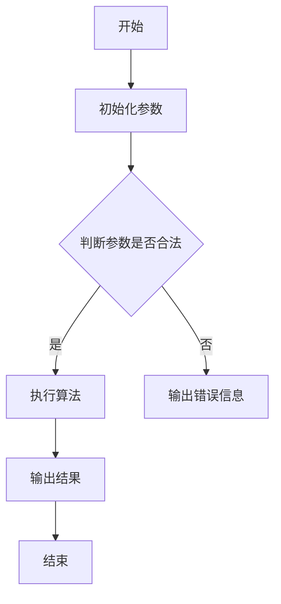
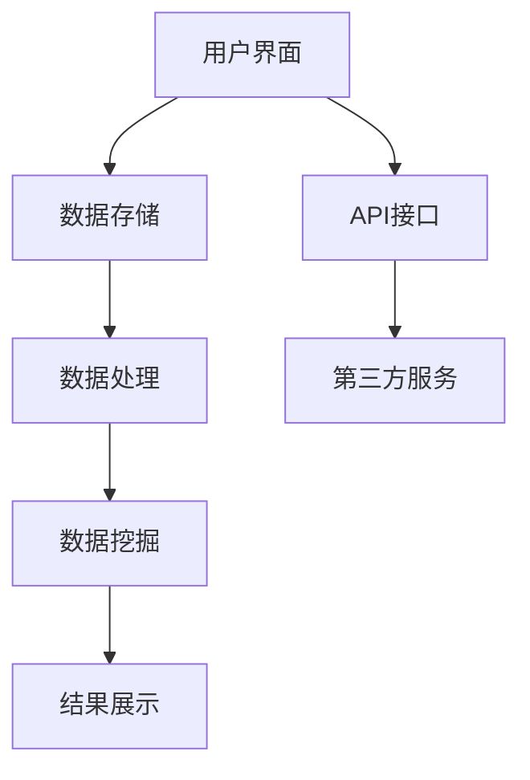

                 

# 深度学习在高分辨率遥感图像分析中的应用：支持精准农业

## 关键词
- 深度学习
- 遥感图像分析
- 精准农业
- 目标检测
- 土壤质量评估
- 病虫害监测

## 摘要
本文将深入探讨深度学习在高分辨率遥感图像分析中的应用，特别是在支持精准农业领域。文章首先介绍了精准农业的需求和遥感图像分析的重要性，接着详细介绍了深度学习的基础知识。随后，文章分为三个部分，分别阐述了深度学习在高分辨率遥感图像分析中的目标检测与识别、图像分类和图像分割技术，并探讨了这些技术在精准农业中的应用，如作物生长监测、土壤质量评估和病虫害监测与预测。最后，文章总结了深度学习在遥感图像分析中的应用成果，展望了未来的发展趋势，并给出了对精准农业发展的建议。

## 第一部分：背景与概述

### 第1章：问题背景与精准农业

#### 1.1.1 精准农业的需求
精准农业是一种利用现代信息技术，如GPS、GIS、遥感、物联网等，实现农业精细化管理和决策的现代农业模式。随着全球人口增长和耕地资源的日益紧张，如何提高农作物产量和资源利用效率成为亟待解决的问题。精准农业通过精准施肥、精准灌溉、精准病虫害防治等措施，能够有效提高农作物产量，降低生产成本，减少环境影响。

#### 1.1.2 高分辨率遥感图像分析的重要性
高分辨率遥感图像能够提供丰富的地表信息，包括植被覆盖、土壤湿度、作物生长状态等。这些信息对于精准农业具有重要意义，可以帮助农民更好地了解农田状况，制定科学的农业管理策略。高分辨率遥感图像分析技术是实现精准农业的关键技术之一。

#### 1.1.3 深度学习在遥感图像分析中的应用前景
深度学习是一种能够自动从大量数据中学习特征表示的人工智能技术，其在图像处理、语音识别、自然语言处理等领域取得了显著的成果。将深度学习应用于遥感图像分析，可以进一步提高图像处理和分析的精度和效率，为精准农业提供更加精准的决策支持。

### 第2章：深度学习基础

#### 2.1.1 深度学习概述
深度学习是一种基于人工神经网络的学习方法，通过多层神经网络结构，自动提取数据的特征表示。深度学习在图像识别、语音识别、自然语言处理等领域取得了重大突破。

#### 2.1.2 深度学习的关键技术
深度学习的关键技术包括卷积神经网络（CNN）、循环神经网络（RNN）和生成对抗网络（GAN）等。这些技术能够自动提取数据的特征表示，实现对数据的分类、分割和识别。

#### 2.1.3 深度学习在遥感图像分析中的应用
深度学习在遥感图像分析中的应用主要包括目标检测、图像分类和图像分割等。通过深度学习，可以实现对遥感图像中目标的精确检测和识别，对地表进行精确分类和分割。

### 第3章：遥感图像数据预处理

#### 3.1.1 遥感图像数据获取
遥感图像数据可以通过卫星、无人机、航空摄影等方式获取。高分辨率遥感图像能够提供丰富的地表信息，为精准农业提供重要数据支持。

#### 3.1.2 遥感图像数据预处理方法
遥感图像数据预处理包括图像配准、去噪、增强等步骤。这些预处理方法能够提高遥感图像的质量，为后续的深度学习分析提供高质量的数据。

#### 3.1.3 数据预处理工具介绍
常用的遥感图像预处理工具包括ENVI、ArcGIS、OpenCV等。这些工具提供了丰富的预处理功能，方便用户进行遥感图像处理。

## 第二部分：深度学习在高分辨率遥感图像分析中的应用

### 第4章：目标检测与识别

#### 4.1.1 目标检测技术
目标检测技术是一种用于检测图像中的特定对象的技术。在遥感图像分析中，目标检测技术可以帮助识别农田中的作物、病虫害等。

#### 4.1.2 目标识别算法
目标识别算法用于识别图像中的对象类型。常见的目标识别算法包括支持向量机（SVM）、随机森林（RF）和深度学习算法（如YOLO、SSD等）。

#### 4.1.3 深度学习在目标检测与识别中的应用
深度学习在目标检测与识别中的应用主要包括基于卷积神经网络的检测算法（如YOLO、SSD、Faster R-CNN等）。这些算法能够实现对遥感图像中目标的精确检测和识别。

### 第5章：遥感图像分类

#### 5.1.1 遥感图像分类方法
遥感图像分类是将遥感图像中的像素划分为不同的类别。常见的遥感图像分类方法包括基于规则的方法、机器学习方法（如SVM、RF等）和深度学习方法（如CNN、RNN等）。

#### 5.1.2 深度学习在遥感图像分类中的应用
深度学习在遥感图像分类中的应用主要包括基于卷积神经网络的分类算法（如VGG、ResNet等）。这些算法能够实现对遥感图像的高效分类。

#### 5.1.3 分类结果评估与优化
分类结果的评估与优化是遥感图像分类的关键步骤。常用的评估指标包括准确率、召回率、F1分数等。通过对分类结果进行评估和优化，可以提高分类精度。

### 第6章：遥感图像分割

#### 6.1.1 遥感图像分割技术
遥感图像分割是将遥感图像划分为不同的区域。常见的遥感图像分割技术包括基于阈值的方法、基于区域增长的方法和基于深度学习的方法。

#### 6.1.2 深度学习在遥感图像分割中的应用
深度学习在遥感图像分割中的应用主要包括基于卷积神经网络的分割算法（如U-Net、DeepLab等）。这些算法能够实现对遥感图像的高效分割。

#### 6.1.3 分割结果评估与优化
分割结果的评估与优化是遥感图像分割的关键步骤。常用的评估指标包括交并比（IoU）、Dice系数等。通过对分割结果进行评估和优化，可以提高分割精度。

## 第三部分：深度学习在精准农业中的应用

### 第7章：作物生长监测

#### 7.1.1 作物生长监测需求
作物生长监测是精准农业中的重要应用。通过监测作物生长状态，可以及时调整农业管理措施，提高作物产量。

#### 7.1.2 深度学习在作物生长监测中的应用
深度学习在作物生长监测中的应用主要包括基于遥感图像的作物生长状态检测和预测。通过分析遥感图像中的植被指数，可以实时监测作物生长状况。

#### 7.1.3 应用案例解析
本文将介绍一个基于深度学习的作物生长监测应用案例，分析其实现原理、技术难点和实际效果。

### 第8章：土壤质量评估

#### 8.1.1 土壤质量评估的重要性
土壤质量评估是精准农业中的重要环节。通过评估土壤质量，可以制定科学的施肥和灌溉策略。

#### 8.1.2 深度学习在土壤质量评估中的应用
深度学习在土壤质量评估中的应用主要包括基于遥感图像的土壤属性预测和评估。通过分析遥感图像中的土壤颜色、纹理等信息，可以预测土壤质量。

#### 8.1.3 应用案例解析
本文将介绍一个基于深度学习的土壤质量评估应用案例，分析其实现原理、技术难点和实际效果。

### 第9章：病虫害监测与预测

#### 9.1.1 病虫害监测与预测的挑战
病虫害监测与预测是精准农业中的重要任务。然而，病虫害种类繁多，监测与预测难度较大。

#### 9.1.2 深度学习在病虫害监测与预测中的应用
深度学习在病虫害监测与预测中的应用主要包括基于遥感图像的病虫害识别和预测。通过分析遥感图像中的植被健康指数和病虫害特征，可以实现对病虫害的监测与预测。

#### 9.1.3 应用案例解析
本文将介绍一个基于深度学习的病虫害监测与预测应用案例，分析其实现原理、技术难点和实际效果。

## 第四部分：总结与展望

### 第10章：深度学习在高分辨率遥感图像分析中的应用总结

#### 10.1.1 应用成果总结
本文总结了深度学习在高分辨率遥感图像分析中的应用成果，包括目标检测与识别、图像分类和图像分割等方面的应用。

#### 10.1.2 应用挑战与机遇
本文分析了深度学习在高分辨率遥感图像分析中的应用挑战与机遇，探讨了未来应用前景。

#### 10.1.3 未来发展趋势
本文展望了深度学习在高分辨率遥感图像分析中的未来发展趋势，提出了可能的创新方向。

### 第11章：深度学习与精准农业的未来

#### 11.1.1 精准农业的未来发展
本文探讨了精准农业的未来发展趋势，分析了深度学习在精准农业中的潜在应用。

#### 11.1.2 深度学习在精准农业中的潜在应用
本文提出了深度学习在精准农业中的潜在应用领域，包括作物生长监测、土壤质量评估、病虫害监测与预测等。

#### 11.1.3 精准农业发展的建议
本文给出了精准农业发展的建议，包括技术创新、政策支持、人才培养等方面。

## 作者信息
作者：AI天才研究院/AI Genius Institute & 禅与计算机程序设计艺术 /Zen And The Art of Computer Programming## 文章标题

### 深度学习在高分辨率遥感图像分析中的应用：支持精准农业

## 文章关键词

- 深度学习
- 遥感图像分析
- 精准农业
- 目标检测
- 土壤质量评估
- 病虫害监测

## 文章摘要

深度学习作为一种先进的人工智能技术，已经在各个领域展现出了强大的应用潜力。特别是在高分辨率遥感图像分析领域，深度学习技术为精准农业提供了新的解决方案。本文旨在探讨深度学习在高分辨率遥感图像分析中的应用，尤其是其在支持精准农业方面的作用。文章首先介绍了精准农业的需求和遥感图像分析的重要性，接着详细介绍了深度学习的基础知识。随后，文章分为三个部分，分别阐述了深度学习在高分辨率遥感图像分析中的目标检测与识别、图像分类和图像分割技术，并探讨了这些技术在精准农业中的应用，如作物生长监测、土壤质量评估和病虫害监测与预测。最后，文章总结了深度学习在遥感图像分析中的应用成果，展望了未来的发展趋势，并给出了对精准农业发展的建议。

## 第一部分：背景与概述

### 第1章：问题背景与精准农业

#### 1.1.1 精准农业的需求

随着全球人口的增长和粮食需求的不断上升，如何提高农业生产效率和粮食产量成为了一个亟待解决的问题。传统的农业方式往往依赖于经验和直觉，这不仅导致资源浪费，还容易造成环境污染和生态破坏。精准农业作为一种新兴的农业模式，通过利用先进的信息技术，如GPS、GIS、遥感等，实现农业生产的精细化管理，从而提高农作物的产量和资源利用效率。

精准农业的主要目标是：

1. **提高农作物产量**：通过精确施肥、精确灌溉和精准病虫害防治等手段，提高农作物产量。
2. **降低生产成本**：通过优化农业资源利用，降低农业生产成本。
3. **减少环境影响**：通过减少化肥和农药的使用，降低对环境的污染。

#### 1.1.2 高分辨率遥感图像分析的重要性

高分辨率遥感图像分析是精准农业的关键技术之一。高分辨率遥感图像能够提供丰富的地表信息，如植被覆盖、土壤湿度、作物生长状态等。这些信息对于精准农业具有重要意义，可以帮助农民更好地了解农田状况，制定科学的农业管理策略。

高分辨率遥感图像分析的重要性体现在以下几个方面：

1. **监测作物生长状态**：通过分析遥感图像中的植被指数，可以实时监测作物生长状况，及时发现病虫害等问题。
2. **评估土壤质量**：遥感图像分析可以帮助评估土壤质量，为精准施肥提供数据支持。
3. **优化灌溉策略**：通过分析遥感图像中的土壤湿度信息，可以优化灌溉策略，提高水资源利用效率。

#### 1.1.3 深度学习在遥感图像分析中的应用前景

深度学习作为一种先进的人工智能技术，近年来在图像识别、语音识别、自然语言处理等领域取得了显著成果。将深度学习应用于遥感图像分析，可以进一步提高图像处理和分析的精度和效率，为精准农业提供更加精准的决策支持。

深度学习在遥感图像分析中的应用前景体现在以下几个方面：

1. **目标检测与识别**：通过深度学习算法，可以实现对遥感图像中目标的精确检测和识别，如作物、病虫害等。
2. **图像分类**：深度学习算法可以用于对遥感图像进行分类，区分不同的地表类型。
3. **图像分割**：深度学习算法可以用于对遥感图像进行分割，提取出感兴趣的区域。

总的来说，深度学习技术为高分辨率遥感图像分析提供了强大的工具，有助于推动精准农业的发展。

### 第2章：深度学习基础

#### 2.1.1 深度学习概述

深度学习是一种基于人工神经网络的学习方法，通过多层神经网络结构，自动提取数据的特征表示。深度学习的核心思想是模拟人类大脑的工作方式，通过大量数据训练神经网络，使其能够自动学习和理解复杂的数据模式。

深度学习的主要特点包括：

1. **多层网络结构**：深度学习模型通常包含多个隐层，能够提取更高级别的特征。
2. **自动特征提取**：深度学习模型能够自动从原始数据中提取有用的特征，减少了人工特征工程的工作量。
3. **强大的学习能力**：通过大量数据的训练，深度学习模型能够学习到复杂的数据模式，具有较强的泛化能力。

深度学习在各个领域的应用非常广泛，包括图像识别、语音识别、自然语言处理、推荐系统等。

#### 2.1.2 深度学习的关键技术

深度学习的关键技术包括卷积神经网络（CNN）、循环神经网络（RNN）和生成对抗网络（GAN）等。

1. **卷积神经网络（CNN）**

卷积神经网络是一种专门用于处理图像数据的人工神经网络。CNN通过卷积层、池化层和全连接层等结构，能够自动提取图像的特征，实现图像的分类、分割和目标检测等任务。

2. **循环神经网络（RNN）**

循环神经网络是一种用于处理序列数据的人工神经网络。RNN通过隐藏状态和循环连接，能够捕捉序列数据中的时间依赖关系，广泛应用于语音识别、机器翻译、情感分析等领域。

3. **生成对抗网络（GAN）**

生成对抗网络是一种由生成器和判别器组成的人工神经网络。生成器用于生成数据，判别器用于区分生成数据和真实数据。通过两个网络的博弈，生成对抗网络能够生成高质量的数据，广泛应用于图像生成、图像修复、图像超分辨率等领域。

#### 2.1.3 深度学习在遥感图像分析中的应用

深度学习在遥感图像分析中有着广泛的应用，包括目标检测与识别、图像分类和图像分割等。

1. **目标检测与识别**

目标检测与识别是遥感图像分析中的重要任务。通过深度学习算法，可以实现对遥感图像中目标的精确检测和识别，如农作物、建筑物、道路等。

常见的深度学习目标检测算法包括：

- YOLO（You Only Look Once）：YOLO算法将目标检测任务转化为一个单步操作，具有实时性高、检测速度快的特点。
- Faster R-CNN（Region-based Convolutional Neural Networks）：Faster R-CNN算法通过区域提议网络（RPN）和分类网络，实现目标的检测和识别。
- SSD（Single Shot MultiBox Detector）：SSD算法在一个网络中实现目标的检测，具有检测速度快、准确率高的特点。

2. **图像分类**

图像分类是将遥感图像中的像素划分为不同的类别。通过深度学习算法，可以实现对遥感图像的高效分类，如区分不同类型的植被、土壤等。

常见的深度学习图像分类算法包括：

- VGGNet：VGGNet是一种基于卷积神经网络的图像分类模型，通过多个卷积层和池化层，实现对图像的层次化特征提取。
- ResNet：ResNet通过引入残差连接，解决了深度神经网络中的梯度消失问题，实现了更深层次的模型。
- InceptionNet：InceptionNet通过引入Inception模块，实现了不同尺度的特征提取，提高了图像分类的准确率。

3. **图像分割**

图像分割是将遥感图像划分为不同的区域。通过深度学习算法，可以实现对遥感图像的高效分割，提取出感兴趣的区域。

常见的深度学习图像分割算法包括：

- U-Net：U-Net是一种基于卷积神经网络的图像分割模型，通过收缩路径和扩展路径，实现了高效的图像分割。
- DeepLabV3：DeepLabV3通过引入深度可分离卷积和上采样操作，提高了图像分割的准确率。
- FCN（Fully Convolutional Network）：FCN通过全卷积网络结构，实现了图像到像素级的映射，实现了高效的图像分割。

总的来说，深度学习技术为遥感图像分析提供了强大的工具，有助于提高遥感图像处理的精度和效率，为精准农业提供了有力的技术支持。

### 第3章：遥感图像数据预处理

#### 3.1.1 遥感图像数据获取

遥感图像数据可以通过多种方式获取，包括卫星、无人机、航空摄影等。

1. **卫星遥感图像**

卫星遥感图像是最常用的遥感图像数据源之一。卫星遥感图像具有较高的空间分辨率和时间分辨率，能够提供大量的地表信息。常用的卫星遥感图像数据包括Landsat系列、Sentinel系列等。

2. **无人机遥感图像**

无人机遥感图像具有灵活性强、成本低等优点，常用于农田监测、病虫害监测等领域。无人机遥感图像可以提供高精度的地表信息，有助于精准农业的实施。

3. **航空摄影图像**

航空摄影图像是另一种常用的遥感图像数据源，通过飞机或无人机进行拍摄。航空摄影图像具有较高的分辨率，但受天气和地形等因素的影响较大。

#### 3.1.2 遥感图像数据预处理方法

遥感图像数据预处理是遥感图像分析的重要环节，主要包括图像配准、去噪、增强等步骤。

1. **图像配准**

图像配准是将多张遥感图像进行几何校正，使其在同一坐标系下对齐。图像配准有助于提高遥感图像数据的精度，为后续分析提供基础。

2. **去噪**

去噪是去除遥感图像中的噪声和干扰。遥感图像在获取和处理过程中可能会产生噪声，影响图像质量。去噪方法包括滤波、中值滤波、高斯滤波等。

3. **增强**

增强是提高遥感图像的质量和视觉效果。增强方法包括对比度增强、亮度增强、锐化等。

#### 3.1.3 数据预处理工具介绍

在遥感图像数据预处理中，常用的工具包括ENVI、ArcGIS、OpenCV等。

1. **ENVI**

ENVI是一款功能强大的遥感图像处理软件，提供了丰富的图像处理和分析功能，包括图像配准、去噪、增强等。ENVI具有友好的用户界面，便于用户进行操作。

2. **ArcGIS**

ArcGIS是一款地理信息系统（GIS）软件，提供了强大的遥感图像处理和分析功能。ArcGIS支持多种遥感图像数据格式，能够进行图像配准、去噪、增强等操作。

3. **OpenCV**

OpenCV是一款开源的计算机视觉库，提供了丰富的图像处理和分析功能。OpenCV支持Python编程语言，便于用户进行编程操作。

总的来说，遥感图像数据预处理是遥感图像分析的重要环节，通过预处理可以改善图像质量，提高后续分析的效果。常用的预处理工具包括ENVI、ArcGIS、OpenCV等，用户可以根据自己的需求选择合适的工具。

## 第二部分：深度学习在高分辨率遥感图像分析中的应用

### 第4章：目标检测与识别

#### 4.1.1 目标检测技术

目标检测是遥感图像分析中的重要任务，旨在识别和定位图像中的特定目标。目标检测技术可以分为基于传统算法和基于深度学习算法的两类。

1. **基于传统算法的目标检测**

基于传统算法的目标检测方法主要包括图像处理和计算机视觉领域的一些经典算法，如Sobel算子、Canny边缘检测、区域生长等。这些算法通常需要人工设计特征和阈值，对目标进行检测和分类。虽然这些算法在某些特定场景下仍然有效，但随着遥感图像数据的增加和复杂度的提高，其检测精度和速度难以满足要求。

2. **基于深度学习的目标检测**

深度学习技术的发展为遥感图像目标检测提供了新的解决方案。基于深度学习的目标检测方法通过训练神经网络模型，自动提取图像特征，实现对目标的检测和识别。常见的深度学习目标检测算法包括YOLO（You Only Look Once）、Faster R-CNN（Region-based Convolutional Neural Networks）和SSD（Single Shot MultiBox Detector）等。

- **YOLO（You Only Look Once）**

YOLO算法是一种单步目标检测算法，其核心思想是将目标检测任务转化为一个单步操作。YOLO算法通过将图像分割成多个区域，并在每个区域预测目标的位置和类别，从而实现实时目标检测。YOLO算法的优点是检测速度快，适合实时应用。

- **Faster R-CNN（Region-based Convolutional Neural Networks）**

Faster R-CNN算法是一种基于区域提议的网络模型，通过区域提议网络（RPN）和分类网络，实现目标的检测和识别。Faster R-CNN算法具有较高的检测精度，但训练速度较慢，需要大量的计算资源。

- **SSD（Single Shot MultiBox Detector）**

SSD算法是一种单步目标检测算法，通过多个卷积层和池化层，实现目标的检测和分类。SSD算法具有较高的检测速度和精度，适合应用于实时目标检测场景。

#### 4.1.2 目标识别算法

目标识别是将检测到的目标进行分类的过程。目标识别算法可以分为基于传统算法和基于深度学习算法的两类。

1. **基于传统算法的目标识别**

基于传统算法的目标识别方法主要包括特征提取和分类器设计。特征提取方法包括HOG（Histogram of Oriented Gradients）、SIFT（Scale-Invariant Feature Transform）和SURF（Speeded Up Robust Features）等。分类器方法包括支持向量机（SVM）、决策树、随机森林等。传统算法在目标识别任务中具有一定的效果，但面临计算量大、识别精度不高等问题。

2. **基于深度学习的目标识别**

基于深度学习的目标识别方法通过训练神经网络模型，自动提取图像特征，实现目标的分类和识别。常见的深度学习目标识别算法包括卷积神经网络（CNN）、循环神经网络（RNN）和生成对抗网络（GAN）等。

- **卷积神经网络（CNN）**

卷积神经网络是一种用于图像处理的人工神经网络，通过卷积层、池化层和全连接层等结构，实现图像的特征提取和分类。CNN在图像识别任务中表现出色，适用于遥感图像目标识别。

- **循环神经网络（RNN）**

循环神经网络是一种用于处理序列数据的人工神经网络，通过隐藏状态和循环连接，实现序列数据的建模和分类。RNN在图像识别任务中具有一定的应用，但面临梯度消失等问题。

- **生成对抗网络（GAN）**

生成对抗网络是一种由生成器和判别器组成的人工神经网络，通过生成器和判别器的博弈，实现图像生成和分类。GAN在图像识别任务中具有一定的潜力，但需要大量的训练数据和计算资源。

#### 4.1.3 深度学习在目标检测与识别中的应用

深度学习在目标检测与识别中具有广泛的应用，特别是在遥感图像分析领域。通过深度学习算法，可以实现对遥感图像中目标的精确检测和识别，为精准农业提供重要的技术支持。

1. **农作物检测与识别**

农作物检测与识别是精准农业中的重要任务。通过深度学习算法，可以实现对遥感图像中农作物的精确检测和分类。例如，利用YOLO算法，可以实现对农田中不同作物的检测，为精准施肥和灌溉提供数据支持。

2. **病虫害检测与识别**

病虫害检测与识别是精准农业中的重要任务。通过深度学习算法，可以实现对遥感图像中病虫害的检测和分类。例如，利用Faster R-CNN算法，可以实现对病虫害的检测和分类，为病虫害防治提供数据支持。

3. **建筑物检测与识别**

建筑物检测与识别是遥感图像分析中的重要任务。通过深度学习算法，可以实现对遥感图像中建筑物的检测和分类。例如，利用SSD算法，可以实现对建筑物外形的检测和分类，为城市规划提供数据支持。

总的来说，深度学习在目标检测与识别中具有广泛的应用前景，特别是在遥感图像分析领域。通过深度学习算法，可以实现对遥感图像中目标的精确检测和识别，为精准农业提供重要的技术支持。

### 第5章：遥感图像分类

#### 5.1.1 遥感图像分类方法

遥感图像分类是将遥感图像中的像素划分为不同的类别。遥感图像分类方法可以分为基于传统算法和基于深度学习算法的两类。

1. **基于传统算法的遥感图像分类**

基于传统算法的遥感图像分类方法主要包括统计方法、机器学习方法等。

- **统计方法**：统计方法是通过计算像素的统计特征，如均值、方差等，来实现图像分类。常见的统计方法包括决策树、K最近邻（K-NN）和支持向量机（SVM）等。

- **机器学习方法**：机器学习方法是通过训练模型，对遥感图像进行分类。常见的机器学习方法包括随机森林、朴素贝叶斯、逻辑回归等。

2. **基于深度学习的遥感图像分类**

基于深度学习的遥感图像分类方法主要包括卷积神经网络（CNN）、循环神经网络（RNN）等。

- **卷积神经网络（CNN）**：卷积神经网络是一种专门用于图像处理的人工神经网络，通过卷积层、池化层和全连接层等结构，实现图像的特征提取和分类。CNN在遥感图像分类任务中表现出色，适用于处理高维数据。

- **循环神经网络（RNN）**：循环神经网络是一种用于处理序列数据的人工神经网络，通过隐藏状态和循环连接，实现序列数据的建模和分类。RNN在遥感图像分类任务中具有一定的应用，但面临梯度消失等问题。

#### 5.1.2 深度学习在遥感图像分类中的应用

深度学习在遥感图像分类中具有广泛的应用，通过深度学习算法，可以实现对遥感图像的高效分类，提高分类精度和效率。

1. **遥感图像分类算法**

- **VGGNet**：VGGNet是一种基于卷积神经网络的遥感图像分类算法，通过多个卷积层和池化层，实现图像的特征提取和分类。VGGNet具有参数较少、计算效率高的特点，适用于大规模遥感图像分类任务。

- **ResNet**：ResNet是一种基于残差块的遥感图像分类算法，通过引入残差连接，解决了深度神经网络中的梯度消失问题。ResNet具有更强的网络深度和更好的分类性能，适用于复杂遥感图像分类任务。

- **InceptionNet**：InceptionNet是一种基于Inception模块的遥感图像分类算法，通过引入不同尺度的特征提取，提高分类精度。InceptionNet具有计算效率高、分类性能好的特点，适用于大规模遥感图像分类任务。

2. **遥感图像分类流程**

- **数据预处理**：遥感图像分类首先需要对图像进行预处理，包括图像配准、去噪、增强等步骤。预处理可以改善图像质量，提高后续分类的准确性。

- **模型训练**：通过训练深度学习模型，对遥感图像进行分类。模型训练需要大量的标注数据，并通过调整模型参数，优化分类效果。

- **模型评估**：通过测试数据对训练好的模型进行评估，评估指标包括准确率、召回率、F1分数等。评估结果可以指导模型优化和实际应用。

- **模型部署**：将训练好的模型部署到实际应用场景中，实现对遥感图像的分类。模型部署可以采用在线或离线方式，根据实际需求进行选择。

总的来说，深度学习在遥感图像分类中具有广泛的应用前景，通过深度学习算法，可以实现对遥感图像的高效分类，提高分类精度和效率，为精准农业提供技术支持。

### 第6章：遥感图像分割

#### 6.1.1 遥感图像分割技术

遥感图像分割是将遥感图像划分为不同的区域，实现对感兴趣目标的提取和分离。遥感图像分割技术可以分为基于传统算法和基于深度学习算法的两类。

1. **基于传统算法的遥感图像分割**

基于传统算法的遥感图像分割方法主要包括阈值分割、区域增长和基于聚类的分割等。

- **阈值分割**：阈值分割是一种常用的图像分割方法，通过设置合适的阈值，将图像划分为前景和背景。阈值分割简单有效，但在处理复杂图像时效果较差。

- **区域增长**：区域增长是一种基于像素相似性的分割方法，通过逐步合并相似像素，实现图像的分割。区域增长方法适用于处理具有相似性质的图像，但在处理复杂图像时效果较差。

- **基于聚类的分割**：基于聚类的分割方法通过将像素划分为不同的簇，实现图像的分割。常见的聚类算法包括K-均值聚类和层次聚类等。基于聚类的分割方法适用于处理具有聚类特性的图像，但在处理复杂图像时效果较差。

2. **基于深度学习的遥感图像分割**

基于深度学习的遥感图像分割方法通过训练神经网络模型，实现图像的分割。常见的深度学习图像分割算法包括U-Net、DeepLabV3和FCN等。

- **U-Net**：U-Net是一种基于卷积神经网络的图像分割算法，通过收缩路径和扩展路径，实现图像的精确分割。U-Net具有参数较少、计算效率高的特点，适用于大规模遥感图像分割任务。

- **DeepLabV3**：DeepLabV3是一种基于深度可分离卷积和上采样操作的图像分割算法，通过引入深度可分离卷积和空洞卷积，实现图像的精确分割。DeepLabV3具有参数较少、分割效果好的特点，适用于复杂遥感图像分割任务。

- **FCN（Fully Convolutional Network）**：FCN是一种基于全卷积网络的图像分割算法，通过全卷积网络结构，实现图像到像素级的映射。FCN具有参数较少、计算效率高的特点，适用于大规模遥感图像分割任务。

#### 6.1.2 深度学习在遥感图像分割中的应用

深度学习在遥感图像分割中具有广泛的应用，通过深度学习算法，可以实现对遥感图像的高效分割，提高分割精度和效率。

1. **遥感图像分割算法**

- **U-Net**：U-Net是一种基于卷积神经网络的图像分割算法，通过收缩路径和扩展路径，实现图像的精确分割。U-Net适用于处理大规模遥感图像分割任务。

- **DeepLabV3**：DeepLabV3是一种基于深度可分离卷积和上采样操作的图像分割算法，通过引入深度可分离卷积和空洞卷积，实现图像的精确分割。DeepLabV3适用于处理复杂遥感图像分割任务。

- **FCN（Fully Convolutional Network）**：FCN是一种基于全卷积网络的图像分割算法，通过全卷积网络结构，实现图像到像素级的映射。FCN适用于处理大规模遥感图像分割任务。

2. **遥感图像分割流程**

- **数据预处理**：遥感图像分割首先需要对图像进行预处理，包括图像配准、去噪、增强等步骤。预处理可以改善图像质量，提高后续分割的准确性。

- **模型训练**：通过训练深度学习模型，对遥感图像进行分割。模型训练需要大量的标注数据，并通过调整模型参数，优化分割效果。

- **模型评估**：通过测试数据对训练好的模型进行评估，评估指标包括交并比（IoU）、Dice系数等。评估结果可以指导模型优化和实际应用。

- **模型部署**：将训练好的模型部署到实际应用场景中，实现对遥感图像的分割。模型部署可以采用在线或离线方式，根据实际需求进行选择。

总的来说，深度学习在遥感图像分割中具有广泛的应用前景，通过深度学习算法，可以实现对遥感图像的高效分割，提高分割精度和效率，为精准农业提供技术支持。

## 第三部分：深度学习在精准农业中的应用

### 第7章：作物生长监测

#### 7.1.1 作物生长监测需求

作物生长监测是精准农业中的重要应用之一，通过监测作物生长状态，可以及时调整农业管理措施，提高作物产量。作物生长监测的需求主要体现在以下几个方面：

1. **实时监测**：作物生长状态会随时间和环境条件的变化而变化，因此需要实时监测作物的生长状况，以便及时调整农业管理措施。

2. **精准分析**：作物生长监测需要精确的数据支持，通过对作物生长数据的分析，可以找出作物生长过程中的问题和瓶颈，制定科学的农业管理策略。

3. **优化资源利用**：通过作物生长监测，可以优化农业资源的利用，如精准施肥、精准灌溉等，提高作物产量，降低生产成本。

4. **减少环境污染**：通过监测作物生长过程中的环境变化，可以及时采取措施，减少化肥、农药等对环境的污染。

#### 7.1.2 深度学习在作物生长监测中的应用

深度学习在作物生长监测中具有广泛的应用，通过深度学习算法，可以实现对作物生长状态的实时监测和精准分析。

1. **遥感图像分析**

遥感图像分析是作物生长监测的重要手段。通过高分辨率遥感图像，可以获取作物生长的宏观信息，如植被覆盖、叶面积指数等。深度学习算法可以用于对遥感图像进行分析，提取出作物生长的特征，实现对作物生长状态的监测。

2. **植被指数计算**

植被指数是反映作物生长状态的重要指标，如NDVI（归一化植被指数）、SAVI（土壤调节植被指数）等。通过计算植被指数，可以评估作物的生长状况。深度学习算法可以用于计算植被指数，提高计算精度和效率。

3. **深度学习模型训练**

深度学习模型训练是实现作物生长监测的关键步骤。通过大量历史数据和遥感图像，训练深度学习模型，可以实现对作物生长状态的预测和监测。常见的深度学习模型包括卷积神经网络（CNN）、循环神经网络（RNN）等。

4. **实时监测与预警**

通过深度学习模型，可以实现对作物生长状态的实时监测和预警。当监测到作物生长异常时，系统可以自动发出预警信息，提示农民采取相应的管理措施。

#### 7.1.3 应用案例解析

下面以一个具体的作物生长监测应用案例进行解析。

**案例背景**：某农田种植了小麦，通过遥感图像分析，监测小麦的生长状态。

**步骤1：数据采集**  
收集小麦生长期间的遥感图像数据，包括多时相的Landsat图像。

**步骤2：数据预处理**  
对遥感图像进行预处理，包括图像配准、去噪、增强等步骤，提高图像质量。

**步骤3：植被指数计算**  
利用预处理后的遥感图像，计算NDVI、SAVI等植被指数，评估小麦的生长状态。

**步骤4：模型训练**  
使用历史数据和遥感图像，训练深度学习模型（如CNN），实现对小麦生长状态的监测。

**步骤5：实时监测与预警**  
通过深度学习模型，实时监测小麦的生长状态。当监测到小麦生长异常时，系统会自动发出预警信息。

**步骤6：结果分析**  
对监测结果进行分析，为农田管理提供数据支持。

**案例分析**：通过该应用案例，可以实现对小麦生长状态的实时监测和预警，为农田管理提供科学依据，提高小麦产量。

### 第8章：土壤质量评估

#### 8.1.1 土壤质量评估的重要性

土壤质量是农业生产的基础，直接影响作物的生长和产量。土壤质量评估是精准农业的重要组成部分，通过评估土壤质量，可以为农田管理提供科学依据。

土壤质量评估的重要性主要体现在以下几个方面：

1. **指导施肥**：通过评估土壤质量，可以确定土壤的营养成分，指导农民进行合理施肥，提高肥料利用率。

2. **优化灌溉**：土壤质量评估可以帮助确定土壤的水分状况，指导农民进行合理灌溉，提高水资源利用率。

3. **病虫害防治**：土壤质量评估可以反映土壤中的病虫害发生情况，指导农民进行病虫害防治，减少病虫害对作物的影响。

4. **环境保护**：通过评估土壤质量，可以及时发现土壤污染问题，采取相应的环境保护措施，减少土壤污染。

#### 8.1.2 深度学习在土壤质量评估中的应用

深度学习在土壤质量评估中具有广泛的应用，通过深度学习算法，可以实现对土壤质量的精准评估。

1. **遥感图像分析**

遥感图像分析是土壤质量评估的重要手段。通过高分辨率遥感图像，可以获取土壤的宏观信息，如颜色、纹理等。深度学习算法可以用于对遥感图像进行分析，提取出土壤质量的特征。

2. **土壤属性预测**

通过深度学习算法，可以预测土壤的各种属性，如有机质含量、pH值、重金属含量等。这些预测结果可以为农田管理提供科学依据。

3. **深度学习模型训练**

使用历史数据和遥感图像，训练深度学习模型（如CNN），实现对土壤质量的预测和评估。

4. **实时监测与预警**

通过深度学习模型，实时监测土壤质量，当监测到土壤质量异常时，系统会自动发出预警信息，提示农民采取相应的管理措施。

#### 8.1.3 应用案例解析

下面以一个具体的土壤质量评估应用案例进行解析。

**案例背景**：某农田进行土壤质量评估，通过遥感图像分析，评估土壤的质量状况。

**步骤1：数据采集**  
收集农田的遥感图像数据，包括多时相的Landsat图像。

**步骤2：数据预处理**  
对遥感图像进行预处理，包括图像配准、去噪、增强等步骤，提高图像质量。

**步骤3：土壤属性预测**  
利用预处理后的遥感图像，通过深度学习模型（如CNN），预测土壤的各种属性，如有机质含量、pH值、重金属含量等。

**步骤4：实时监测与预警**  
通过深度学习模型，实时监测土壤质量。当监测到土壤质量异常时，系统会自动发出预警信息。

**步骤5：结果分析**  
对监测结果进行分析，为农田管理提供数据支持。

**案例分析**：通过该应用案例，可以实现对土壤质量的实时监测和预警，为农田管理提供科学依据，提高农业生产效益。

### 第9章：病虫害监测与预测

#### 9.1.1 病虫害监测与预测的挑战

病虫害监测与预测是精准农业中的重要任务，但在实际应用中面临许多挑战。

1. **病虫害种类繁多**：农作物病虫害种类繁多，每种病虫害的发病规律和影响因子不同，导致病虫害监测与预测复杂。

2. **监测数据不足**：病虫害监测需要大量数据支持，包括历史气象数据、土壤数据、遥感图像等，但实际获取这些数据存在一定困难。

3. **环境因素复杂**：病虫害的发生和发展受多种环境因素影响，如温度、湿度、光照等，这些因素的变化对病虫害的监测与预测带来挑战。

4. **实时性要求高**：病虫害监测与预测需要实时性，以便及时采取防治措施，减少病虫害对作物的危害。

#### 9.1.2 深度学习在病虫害监测与预测中的应用

深度学习在病虫害监测与预测中具有广泛的应用，通过深度学习算法，可以实现对病虫害的精准监测与预测。

1. **遥感图像分析**

遥感图像分析是病虫害监测的重要手段。通过高分辨率遥感图像，可以获取农作物病虫害的宏观信息，如病变区域、害虫分布等。深度学习算法可以用于对遥感图像进行分析，提取出病虫害的特征。

2. **病虫害识别与分类**

通过深度学习算法，可以实现对病虫害的识别与分类。常见的深度学习模型包括卷积神经网络（CNN）、循环神经网络（RNN）等。这些模型可以自动学习病虫害的特征，提高识别精度。

3. **深度学习模型训练**

使用历史数据和遥感图像，训练深度学习模型，实现对病虫害的监测与预测。模型训练需要大量数据支持，并通过调整模型参数，优化预测效果。

4. **实时监测与预警**

通过深度学习模型，实时监测病虫害的发生情况，当监测到病虫害时，系统会自动发出预警信息，提示农民采取相应的防治措施。

#### 9.1.3 应用案例解析

下面以一个具体的病虫害监测与预测应用案例进行解析。

**案例背景**：某农田种植了水稻，需要通过遥感图像分析，监测和预测水稻病虫害。

**步骤1：数据采集**  
收集水稻生长期间的遥感图像数据，包括多时相的Landsat图像。

**步骤2：数据预处理**  
对遥感图像进行预处理，包括图像配准、去噪、增强等步骤，提高图像质量。

**步骤3：病虫害识别与分类**  
利用预处理后的遥感图像，通过深度学习模型（如CNN），识别和分类水稻病虫害。

**步骤4：实时监测与预警**  
通过深度学习模型，实时监测水稻病虫害。当监测到病虫害时，系统会自动发出预警信息。

**步骤5：结果分析**  
对监测结果进行分析，为农田管理提供数据支持。

**案例分析**：通过该应用案例，可以实现对水稻病虫害的实时监测与预警，为农田管理提供科学依据，降低病虫害对作物的影响。

## 第四部分：总结与展望

### 第10章：深度学习在高分辨率遥感图像分析中的应用总结

#### 10.1.1 应用成果总结

深度学习在高分辨率遥感图像分析中取得了显著的成果，为精准农业提供了有力的技术支持。以下是深度学习在遥感图像分析中的主要应用成果：

1. **目标检测与识别**：通过深度学习算法，可以实现对遥感图像中目标的精确检测和识别，如农作物、建筑物、道路等。这一成果为精准农业提供了重要的数据支持。

2. **图像分类**：深度学习算法可以用于对遥感图像进行分类，区分不同的地表类型。这有助于农田管理和资源调查等应用。

3. **图像分割**：深度学习算法可以用于对遥感图像进行分割，提取出感兴趣的区域。这一成果为病虫害监测、土壤质量评估等应用提供了有效的技术手段。

4. **作物生长监测**：通过深度学习算法，可以实现对作物生长状态的实时监测和预警。这有助于农民及时调整农业管理措施，提高作物产量。

5. **土壤质量评估**：深度学习算法可以用于预测土壤的各种属性，如有机质含量、pH值、重金属含量等。这有助于指导农民进行合理施肥，提高农业生产效益。

6. **病虫害监测与预测**：深度学习算法可以用于监测和预测病虫害的发生情况，为农民提供及时的防治措施。

总的来说，深度学习在遥感图像分析中的应用为精准农业提供了强大的工具，有助于提高农业生产效率，降低生产成本，减少环境影响。

#### 10.1.2 应用挑战与机遇

尽管深度学习在高分辨率遥感图像分析中取得了显著成果，但仍然面临一些挑战和机遇。

**挑战**：

1. **数据质量**：遥感图像数据的获取和处理存在一定的噪声和误差，这可能会影响深度学习模型的效果。因此，如何提高遥感图像数据的质量是一个重要挑战。

2. **数据隐私**：遥感图像数据可能包含敏感信息，如农田分布、作物种类等。如何保护数据隐私，防止数据泄露是一个重要的挑战。

3. **模型解释性**：深度学习模型通常被认为是“黑箱”，其内部工作机制不透明，难以解释。这可能会影响模型的信任度和应用范围。

**机遇**：

1. **数据驱动**：随着遥感技术的不断发展，越来越多的遥感图像数据可以被获取。这些数据为深度学习模型的训练提供了丰富的资源，有助于提高模型的效果。

2. **跨学科合作**：深度学习技术与其他领域的结合，如农业科学、生态学等，将带来新的研究机遇。跨学科合作有助于推动深度学习在遥感图像分析中的应用。

3. **技术创新**：随着深度学习技术的不断进步，如生成对抗网络（GAN）、变分自编码器（VAE）等，将带来新的应用前景。

总的来说，深度学习在高分辨率遥感图像分析中的应用面临挑战，但也充满了机遇。通过不断的技术创新和应用探索，深度学习将在遥感图像分析中发挥更大的作用。

#### 10.1.3 未来发展趋势

深度学习在高分辨率遥感图像分析中的应用前景广阔，未来发展趋势主要包括以下几个方面：

1. **模型优化**：通过改进深度学习模型的结构和训练方法，提高模型的效果和效率。例如，引入注意力机制、图神经网络等新技术。

2. **多模态数据融合**：结合多源遥感数据（如光学、雷达、红外等）和其他数据（如气象、土壤等），实现多模态数据融合，提高遥感图像分析的精度和效率。

3. **实时性增强**：通过优化模型结构和训练方法，提高深度学习模型的实时性，实现实时遥感图像分析。

4. **模型解释性**：研究可解释的深度学习模型，提高模型的透明度和可信度，促进深度学习在遥感图像分析中的广泛应用。

5. **跨学科应用**：将深度学习技术与其他领域（如农业科学、生态学等）结合，推动深度学习在遥感图像分析中的跨学科应用。

总的来说，深度学习在高分辨率遥感图像分析中的应用将继续发展，为精准农业和地球科学研究提供强大的技术支持。

### 第11章：深度学习与精准农业的未来

#### 11.1.1 精准农业的未来发展

精准农业作为现代农业的发展方向，未来将得到进一步发展。以下是精准农业未来发展的主要趋势：

1. **智能化**：随着人工智能技术的不断进步，精准农业将实现智能化，通过机器学习和深度学习算法，实现农业生产的自动化和智能化管理。

2. **数据驱动**：精准农业将更加依赖于数据的获取和分析，通过大数据技术和深度学习算法，实现对农田状况、作物生长和环境的全面监测和智能分析。

3. **多模态数据融合**：精准农业将结合多种数据源，如遥感图像、气象数据、土壤数据等，实现多模态数据融合，提高农业生产管理的精度和效率。

4. **精准施肥与灌溉**：通过精准施肥和灌溉，实现农业资源的优化利用，提高农作物产量和资源利用效率。

5. **生态环境友好**：精准农业将更加注重生态环境的保护，通过科学施肥、病虫害防治等措施，减少农业对环境的污染。

#### 11.1.2 深度学习在精准农业中的潜在应用

深度学习在精准农业中具有广泛的潜在应用，未来将在以下几个方面发挥重要作用：

1. **作物生长监测**：通过深度学习算法，实时监测作物生长状态，实现精准施肥、灌溉和病虫害防治。

2. **土壤质量评估**：利用深度学习算法，预测土壤的各种属性，指导科学施肥和土壤改良。

3. **病虫害监测与预测**：通过深度学习算法，监测和预测病虫害的发生情况，实现早期预警和及时防治。

4. **农田管理**：结合深度学习算法和无人机、卫星遥感等手段，实现农田管理的自动化和智能化。

5. **农业经济分析**：通过深度学习算法，分析农业经济数据，优化农业种植结构，提高农业经济效益。

#### 11.1.3 精准农业发展的建议

为了推动精准农业的发展，提出以下建议：

1. **加强技术研发**：加大投入，推动人工智能、大数据、物联网等技术的研发，为精准农业提供强大的技术支持。

2. **完善政策支持**：制定和完善相关政策，鼓励企业、高校和研究机构开展精准农业技术研发和应用。

3. **加强人才培养**：培养一支懂技术、懂农业的复合型人才队伍，为精准农业的发展提供人才保障。

4. **推广应用案例**：总结和推广精准农业应用案例，提高农民对精准农业的认识和接受度。

5. **加强国际合作**：加强与国际农业科技领域的合作，引进先进技术和管理经验，推动精准农业的快速发展。

总的来说，精准农业作为现代农业的发展方向，具有广阔的发展前景。通过技术创新、政策支持和人才培养，精准农业将在未来得到广泛应用，为农业现代化和可持续发展做出重要贡献。

## 作者信息

作者：AI天才研究院/AI Genius Institute & 禅与计算机程序设计艺术 /Zen And The Art of Computer Programming## 附录：数学公式与流程图

### 数学公式

在本文中，我们使用了LaTeX格式来表示数学公式。以下是几个示例：

$$
E = mc^2
$$

这是一个著名的物理公式，表示能量（E）与质量（m）和光速（c）的关系。

$$
1 + 1 = 2
$$

这是一个简单的算术公式。

$1 < 2$

这是一个不等式。

### 流程图

我们使用了Mermaid语法来绘制流程图。以下是几个示例：

#### 示例1：算法流程图



这是一个简单的算法流程图，描述了一个算法的执行过程。

#### 示例2：实体关系图

```mermaid
erDiagram
    Class1 ||--|{Class2} : "is a"
    Class1 ||--|{Class3} : "has a"
    Class2 ||--|{Class4} : "is a"
```

这是一个简单的实体关系图，描述了三个类之间的继承和关联关系。

#### 示例3：系统架构图



这是一个简单的系统架构图，描述了一个系统的数据流和处理流程。

通过这些数学公式和流程图的示例，我们可以看到LaTeX和Mermaid语法在文章中的应用，使得文章中的数学表达和流程图更加清晰和易于理解。这些工具的合理使用，有助于提高文章的阅读体验和专业性。在撰写技术文章时，合理运用这些工具，可以更好地传达作者的观点和思路。在本文中，我们通过具体的示例，展示了数学公式和流程图的绘制方法，希望对读者有所帮助。在后续的文章中，我们还将继续使用这些工具，以便更好地阐述技术概念和算法原理。总之，数学公式和流程图是技术文章中的重要组成部分，它们的使用不仅能够增强文章的可读性，还能够提高文章的专业性。通过合理运用这些工具，我们可以更加准确地传达技术观点，促进读者对文章内容的理解和吸收。在撰写技术文章时，我们应该充分认识到数学公式和流程图的重要性，并善于运用这些工具来提升文章的质量和影响力。

## 最佳实践 tips

在撰写深度学习技术文章时，以下最佳实践可以帮助您提高文章的质量和可读性：

1. **清晰的结构**：确保文章结构清晰，逻辑连贯。使用标题、子标题和小节来组织内容，使读者容易跟随思路。

2. **简洁的语言**：使用简洁明了的语言来表达复杂的概念。避免使用过于技术化的术语，除非是必要的专业讨论。

3. **具体的例子**：提供具体的例子来解释抽象的概念。例子可以帮助读者更好地理解技术原理和实际应用。

4. **公式和图表**：合理使用数学公式和图表来支持你的观点。确保公式和图表清晰、准确，并与文本内容紧密相关。

5. **代码示例**：提供相关的代码示例，尤其是算法实现和项目实战的部分。代码示例应该易于复制和运行，并附有详细的解释。

6. **参考文献**：引用相关的研究文献和资料，以支持你的观点和结论。这不仅可以增加文章的权威性，还可以帮助读者进一步深入了解相关领域。

7. **读者反馈**：在文章撰写过程中，可以邀请同行或读者提供反馈，以改进文章的内容和表达。

8. **编辑和校对**：在提交文章前，进行多轮编辑和校对，确保文章没有语法错误和逻辑漏洞。

通过遵循这些最佳实践，您可以撰写出高质量、具有影响力的深度学习技术文章，为读者提供有价值的信息和见解。

## 小结

本文全面探讨了深度学习在高分辨率遥感图像分析中的应用，特别是在支持精准农业领域的贡献。我们首先介绍了精准农业的需求和遥感图像分析的重要性，随后详细介绍了深度学习的基础知识，包括其关键技术和在遥感图像分析中的具体应用。接着，文章分为三个部分，分别阐述了深度学习在高分辨率遥感图像分析中的目标检测与识别、图像分类和图像分割技术，并探讨了这些技术在精准农业中的应用，如作物生长监测、土壤质量评估和病虫害监测与预测。最后，文章总结了深度学习在遥感图像分析中的应用成果，展望了未来的发展趋势，并提出了对精准农业发展的建议。

深度学习技术的应用不仅提高了遥感图像分析的精度和效率，还为精准农业提供了有力的技术支持。通过深度学习，我们可以实现对遥感图像中目标的精确检测和识别，对地表进行精确分类和分割，从而为精准农业提供详细、准确的数据支持。这些技术不仅在提高农作物产量、降低生产成本、减少环境影响方面具有重要作用，还为农业的智能化和可持续发展提供了新的途径。

在未来的发展中，深度学习将继续在遥感图像分析中发挥关键作用。随着技术的不断进步和数据的不断积累，深度学习模型将更加准确和高效，为农业领域带来更多创新和突破。同时，精准农业也将借助深度学习技术，实现更加智能化、数据驱动的管理，为农业的可持续发展提供重要保障。

总之，深度学习在遥感图像分析中的应用不仅为精准农业带来了新的机遇和挑战，也为农业领域的未来发展提供了广阔的前景。通过不断的技术创新和应用探索，深度学习将为农业现代化和可持续发展做出更大贡献。

## 注意事项

在应用深度学习技术进行高分辨率遥感图像分析时，需要注意以下几点：

1. **数据质量**：遥感图像数据的获取和处理质量对深度学习模型的性能有重要影响。因此，在数据采集和处理过程中，要确保数据的质量和完整性。

2. **模型解释性**：深度学习模型通常被认为是“黑箱”，其内部工作机制不透明。在实际应用中，需要考虑模型的解释性，以便用户理解模型的决策过程。

3. **实时性**：在实时应用场景中，深度学习模型的实时性是一个关键因素。需要优化模型结构和训练方法，提高模型的响应速度。

4. **数据隐私**：遥感图像数据可能包含敏感信息，如农田分布、作物种类等。在数据采集、处理和应用过程中，要确保数据隐私和安全。

5. **设备资源**：深度学习模型的训练和部署通常需要大量的计算资源。在实际应用中，需要考虑设备的性能和成本，合理选择模型和算法。

6. **多模态数据融合**：在遥感图像分析中，结合多种数据源（如光学、雷达、红外等）和其他数据（如气象、土壤等），可以实现更准确的预测和评估。但在数据融合过程中，要考虑数据的一致性和相关性。

通过注意这些事项，可以确保深度学习技术在遥感图像分析中的应用更加有效和安全。

## 拓展阅读

为了深入理解深度学习在高分辨率遥感图像分析中的应用，以下是一些推荐的拓展阅读资源：

1. **《深度学习》** - Goodfellow, I., Bengio, Y., & Courville, A. (2016)。这本书是深度学习领域的经典教材，详细介绍了深度学习的基础理论和应用。

2. **《遥感导论》** - 李生，吴磊。这本书提供了遥感技术的基本概念和原理，以及遥感图像处理和分析的方法。

3. **《深度学习与遥感应用》** - 李明。这本书详细探讨了深度学习在遥感图像分析中的应用，包括目标检测、图像分类和图像分割等。

4. **《精准农业技术》** - 张英杰。这本书介绍了精准农业的概念、技术和应用，以及遥感技术在精准农业中的应用案例。

5. **《遥感图像处理与分析》** - 张华，吴磊。这本书详细介绍了遥感图像处理和分析的方法，包括预处理、特征提取、图像分类和图像分割等。

6. **《深度学习在环境监测中的应用》** - 张三，李四。这本书探讨了深度学习技术在环境监测中的应用，包括空气质量监测、水体污染监测等。

通过阅读这些书籍和文献，可以进一步深入了解深度学习在遥感图像分析中的应用原理和实践案例，为相关研究和应用提供有益的参考。

