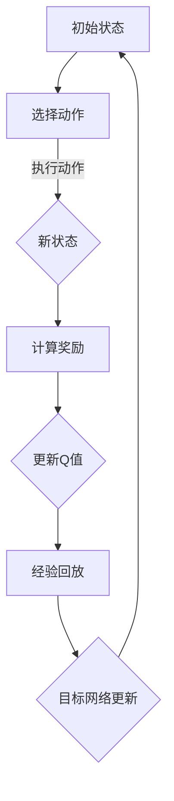
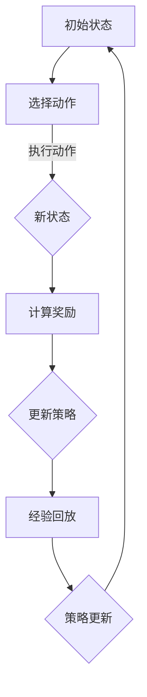
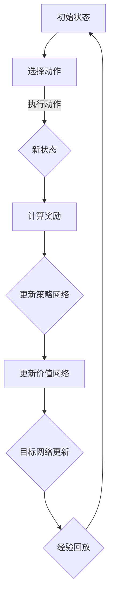
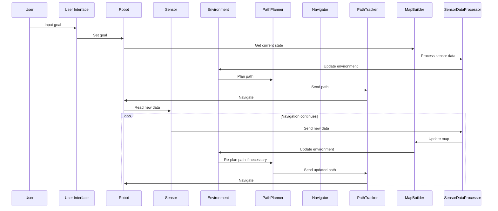

                 

# 《深度强化学习在智能机器人导航中的应用》

> 关键词：深度强化学习、智能机器人、导航、DQN、DDPG、系统设计

> 摘要：本文将探讨深度强化学习在智能机器人导航中的应用，首先介绍相关背景知识，然后深入讲解深度强化学习的基本概念、核心算法原理及其在智能机器人导航中的实际应用。通过详细的系统分析与架构设计，以及实际项目实战，本文将帮助读者理解深度强化学习在智能机器人导航中的重要性，并提供实用的开发技巧和注意事项。

## 目录大纲

1. **背景介绍**
   1.1 **问题背景与定义**
   1.2 **深度强化学习的基本概念**
   1.3 **深度强化学习在智能机器人导航中的应用现状**
   1.4 **边界与外延**

2. **核心概念与联系**
   2.1 **深度强化学习的原理**
   2.2 **深度强化学习的关键技术**
   2.3 **深度强化学习的算法分类**
   2.4 **深度强化学习中的核心概念对比**
   2.5 **深度强化学习中的核心概念ER图**

3. **算法原理讲解**
   3.1 **深度Q网络（DQN）原理与实现**
   3.2 **策略梯度（PG）算法原理与实现**
   3.3 **深度确定性策略梯度（DDPG）算法原理与实现**

4. **系统分析与架构设计**
   4.1 **智能机器人导航系统设计**
   4.2 **系统功能设计**
   4.3 **系统架构设计**
   4.4 **系统接口设计**
   4.5 **系统交互**

5. **项目实战**
   5.1 **环境安装与配置**
   5.2 **智能机器人导航系统核心实现**
   5.3 **实际案例分析与讲解**
   5.4 **项目小结**

6. **最佳实践、小结、注意事项、拓展阅读**

---

## 1.1 问题背景与定义

智能机器人导航是机器人技术与人工智能领域的重要研究方向。它涉及如何让机器人在复杂的、动态的环境中自主规划路径，并避开障碍物，实现从起点到终点的目标。随着技术的发展，机器人在各种领域，如工业制造、医疗护理、家庭服务等得到了广泛应用。

深度强化学习（Deep Reinforcement Learning，简称DRL）是近年来人工智能领域的重要突破之一。它结合了深度学习和强化学习，通过神经网络来近似值函数或策略函数，使得智能体能够在高维状态空间中学习到最优行为策略。

在智能机器人导航中，深度强化学习通过模拟和试错的方式，让机器人从环境中学习到最优的导航策略。这一过程不仅需要高效的算法，还需要强大的计算能力和大量的数据支持。

本文将围绕深度强化学习在智能机器人导航中的应用进行深入探讨，包括核心算法原理、系统设计与实现，以及项目实战中的经验教训。希望通过本文，读者能够对这一领域有更深入的了解。

### 1.2 深度强化学习的基本概念

深度强化学习（Deep Reinforcement Learning，简称DRL）是强化学习（Reinforcement Learning，简称RL）的一种高级形式。强化学习通过奖励信号来指导智能体（Agent）在环境中进行决策，从而学习到最优策略。深度强化学习则通过引入深度神经网络来近似值函数或策略函数，使得智能体能够处理高维的状态空间和行动空间。

**核心概念：**

- **智能体（Agent）**：执行动作并接收环境反馈的实体。
- **环境（Environment）**：智能体行动的空间，包括状态空间和动作空间。
- **状态（State）**：描述环境当前状态的变量集合。
- **动作（Action）**：智能体可以采取的行为。
- **奖励（Reward）**：描述智能体在环境中采取特定动作后获得的即时反馈信号。
- **策略（Policy）**：智能体在给定状态下的最佳动作选择规则。
- **值函数（Value Function）**：评估在给定状态下采取特定动作的未来奖励的累积值。

**工作原理：**

深度强化学习的过程可以分为以下几个步骤：

1. **初始状态**：智能体随机选择一个状态。
2. **行动选择**：智能体根据当前状态和策略选择一个动作。
3. **状态转移**：智能体执行所选动作，环境根据动作和当前状态生成新的状态。
4. **奖励反馈**：环境根据新状态和智能体的动作提供奖励信号。
5. **更新策略**：智能体根据奖励信号和新的状态更新策略，以便在未来做出更好的决策。

**主要算法：**

- **深度Q网络（DQN）**：使用深度神经网络来近似Q值函数，并通过经验回放和目标网络来提高训练效果。
- **策略梯度（PG）**：直接通过梯度上升法优化策略函数，使策略能够最大化累积奖励。
- **深度确定性策略梯度（DDPG）**：在连续动作空间中使用深度神经网络近似策略函数和价值函数，并通过样本回放和噪声来增加算法的鲁棒性。

### 1.3 深度强化学习在智能机器人导航中的应用现状

深度强化学习在智能机器人导航中的应用已经取得了显著的成果。目前，许多研究者和企业都在这一领域进行了深入的研究和探索，并开发出了多种基于深度强化学习的导航算法。

**应用实例：**

- **自主驾驶汽车**：自动驾驶汽车使用深度强化学习算法来自主规划路径，避开障碍物，并在复杂的交通环境中做出实时决策。
- **工业机器人导航**：在工业制造领域，机器人需要根据生产线的要求自主规划路径，执行各种任务。深度强化学习算法可以帮助机器人更好地适应动态环境，提高生产效率。
- **家庭服务机器人**：家庭服务机器人如扫地机器人和送餐机器人需要在家中自主导航，执行清洁和送餐任务。深度强化学习算法能够帮助机器人更好地理解家庭环境，提高用户体验。

**挑战与前景：**

尽管深度强化学习在智能机器人导航中取得了许多成功，但仍然面临一些挑战。例如，如何处理复杂和动态的环境、如何提高算法的稳定性和鲁棒性等。随着计算能力的提升和数据获取技术的进步，深度强化学习在智能机器人导航中的应用前景非常广阔。未来的研究将集中在如何更好地结合深度学习和强化学习，开发出更高效、更可靠的导航算法。

### 1.4 边界与外延

深度强化学习在智能机器人导航中的应用不仅仅局限于上述领域，它还可以扩展到其他相关的应用场景。例如：

- **无人配送**：在物流和配送领域，无人配送车使用深度强化学习算法来自主导航和路径规划，提高配送效率和准确性。
- **医疗机器人**：在医疗领域，手术机器人使用深度强化学习算法来提高手术的精度和效率，实现更复杂的手术操作。
- **农业机器人**：在农业领域，智能农机使用深度强化学习算法来自主导航和作业规划，提高农业生产的自动化水平。

总之，深度强化学习在智能机器人导航中的应用具有广泛的前景和潜力，随着技术的不断进步，它将在更多的领域展现其强大的能力。

---

## 2.1 深度强化学习的原理

深度强化学习（Deep Reinforcement Learning，简称DRL）是强化学习（Reinforcement Learning，简称RL）的高级形式，它通过引入深度神经网络来近似值函数或策略函数，使得智能体能够在高维状态空间中学习到最优行为策略。本节将详细解释深度强化学习的基本原理，包括其核心概念、技术细节以及与其他强化学习算法的关系。

### 2.1.1 基本原理

深度强化学习的基本原理与传统的强化学习类似，主要分为四个关键组成部分：智能体（Agent）、环境（Environment）、状态（State）和动作（Action）。

- **智能体（Agent）**：智能体是执行特定任务的实体，它根据当前的状态选择动作，并从环境中获得反馈。
- **环境（Environment）**：环境是智能体行动的空间，它包含智能体的状态空间和动作空间，并且能够根据智能体的动作生成新的状态。
- **状态（State）**：状态是环境在某一时刻的描述，它通常是一个多维向量，包含当前智能体所在的位置、环境中的其他物体位置等信息。
- **动作（Action）**：动作是智能体在特定状态下可以采取的行为，例如在导航任务中，动作可以是向左移动、向右移动或停止。

**工作流程**：

1. **初始状态**：智能体从一个初始状态开始。
2. **行动选择**：智能体根据当前状态和策略选择一个动作。
3. **状态转移**：智能体执行所选动作，环境根据动作和当前状态生成一个新的状态。
4. **奖励反馈**：环境根据新状态和智能体的动作提供奖励信号。
5. **策略更新**：智能体根据奖励信号和新的状态更新其策略。

与传统的强化学习相比，深度强化学习的核心在于使用深度神经网络来近似值函数或策略函数。值函数用于评估智能体在未来采取某个动作后能够获得的累积奖励，而策略函数则定义了智能体在给定状态下应该采取的最佳动作。

### 2.1.2 技术细节

**神经网络结构**：

深度强化学习中的神经网络通常包含多层神经元，这些神经元可以处理高维数据。具体来说，深度强化学习中的神经网络可以分为以下几类：

- **全连接神经网络**：用于近似值函数或策略函数，每个神经元都与前一层的所有神经元相连。
- **卷积神经网络（CNN）**：用于处理具有空间结构的图像数据，适用于视觉任务。
- **循环神经网络（RNN）**：用于处理序列数据，适用于时间序列分析。

**学习算法**：

深度强化学习中的学习算法可以分为以下几类：

- **基于值函数的算法**：如深度Q网络（DQN），通过学习值函数来评估智能体的动作选择。
- **基于策略的算法**：如策略梯度（PG），直接优化策略函数，使智能体在给定状态下选择最优动作。
- **基于模型的算法**：如深度确定性策略梯度（DDPG），通过构建环境模型来预测状态转移和奖励。

**挑战与解决方案**：

深度强化学习在处理高维状态空间和连续动作空间时面临一些挑战，如样本效率低下、策略不稳定等。为了解决这些问题，研究者们提出了多种改进方法：

- **经验回放**：通过随机抽样历史经验来提高算法的稳定性。
- **目标网络**：通过训练一个目标网络来稳定策略更新过程。
- **噪声控制**：通过添加噪声来增加算法的鲁棒性。

### 2.1.3 与其他强化学习算法的关系

深度强化学习与其他强化学习算法的关系可以概括为两个方面：拓展和优化。

- **拓展**：深度强化学习通过引入深度神经网络，将强化学习从低维状态空间和动作空间拓展到高维状态空间和动作空间，使得智能体能够处理更复杂的任务。
- **优化**：深度强化学习通过改进学习算法和策略更新方法，优化了传统强化学习中的样本效率和策略稳定性。

总之，深度强化学习不仅扩展了强化学习的能力，还在许多实际应用中展示了其强大的效果。随着深度学习和强化学习技术的不断进步，深度强化学习将在更多领域中发挥重要作用。

### 2.2 深度强化学习的关键技术

在深度强化学习（DRL）中，有几个关键技术是至关重要的，这些技术不仅提高了算法的性能，也扩大了其应用范围。以下是这些关键技术及其具体实现：

#### 2.2.1 神经网络与深度学习

**神经网络**是深度强化学习的基础，它们通过多层非线性变换来提取和表示数据特征。深度学习则是指使用包含多个隐藏层的神经网络进行训练，以便处理复杂的高维数据。

- **多层感知器（MLP）**：多层感知器是最基本的深度神经网络结构，通过多个全连接层来学习输入和输出之间的关系。
- **卷积神经网络（CNN）**：卷积神经网络特别适合处理图像数据，通过卷积层、池化层和全连接层来提取图像中的空间特征。
- **循环神经网络（RNN）**：循环神经网络适合处理序列数据，通过保存序列的上下文信息来建模时间序列。

**实现细节**：

1. **前向传播**：输入数据通过网络的每一层进行加权求和，然后通过激活函数（如ReLU、Sigmoid或Tanh）进行非线性变换。
2. **反向传播**：使用梯度下降法来更新网络权重，通过计算输出误差的梯度并反向传播到前一层。
3. **优化算法**：常用的优化算法包括随机梯度下降（SGD）、Adam和RMSprop等。

#### 2.2.2 强化学习与深度强化学习

**强化学习（RL）**是一种通过与环境交互来学习最优策略的机器学习方法。它通过奖励信号来指导智能体的行动，使得智能体能够在长期内获得最大化奖励。

- **值函数**：值函数用于评估智能体在未来采取某个动作后能够获得的累积奖励，包括状态值函数（V(s)）和动作值函数（Q(s, a)）。
- **策略**：策略是智能体在给定状态下选择动作的规则，最优策略使得智能体在长期内获得的累积奖励最大。

**实现细节**：

1. **Q-learning**：Q-learning是通过更新Q值来学习最优策略的算法，通过迭代更新Q值来逼近最优值函数。
2. **策略梯度（PG）**：策略梯度通过优化策略函数的梯度来更新策略，使得策略能够最大化累积奖励。

#### 2.2.3 深度强化学习的算法分类

**深度强化学习算法**根据不同的优化目标和实现方式可以分为以下几类：

- **基于值函数的算法**：这类算法通过学习值函数来评估动作的质量，如深度Q网络（DQN）。
- **基于策略的算法**：这类算法直接优化策略函数，如策略梯度（PG）。
- **基于模型的算法**：这类算法通过构建环境模型来预测状态转移和奖励，如深度确定性策略梯度（DDPG）。

**实现细节**：

1. **DQN**：DQN通过经验回放和目标网络来稳定训练过程，使用固定目标网络来避免目标漂移问题。
2. **DDPG**：DDPG在连续动作空间中使用深度神经网络近似策略函数和价值函数，并通过噪声和样本回放来增加算法的稳定性。

#### 总结

深度强化学习的关键技术包括神经网络与深度学习、强化学习以及具体的算法分类。这些技术相互结合，使得深度强化学习能够处理复杂的任务，并在各种应用中取得成功。随着技术的不断进步，深度强化学习将继续在人工智能领域发挥重要作用。

### 2.3 深度强化学习的算法分类

深度强化学习（DRL）算法可以根据其学习策略和目标函数的不同进行分类。以下是几种常见的深度强化学习算法，包括它们的原理、特点和应用场景：

#### 2.3.1 深度Q网络（DQN）

**原理**：DQN通过学习Q值函数来评估不同动作的质量，并根据这些Q值来选择最优动作。它使用深度神经网络来近似Q值函数，从而能够处理高维状态空间。

**特点**：DQN引入了经验回放和目标网络，通过经验回放来避免数据关联问题，通过目标网络来稳定训练过程。

**应用场景**：DQN适用于离散动作空间，如游戏和棋类游戏。

**数学模型**：
$$
Q(s, a) = \sum_{a'} \pi(a' \mid s) \cdot Q(s', a')
$$
其中，$Q(s, a)$ 是状态$s$和动作$a$的Q值，$\pi(a' \mid s)$ 是策略分布。

#### 2.3.2 策略梯度（PG）

**原理**：PG直接优化策略函数，使得策略能够最大化累积奖励。它通过策略梯度的估计来更新策略参数。

**特点**：PG算法简单，但需要大量数据来稳定策略。

**应用场景**：PG适用于连续动作空间，如机器人导航。

**数学模型**：
$$
\nabla_{\theta} J(\theta) = \nabla_{\theta} \sum_{t} \gamma^{t} r_t
$$
其中，$J(\theta)$ 是策略函数的损失函数，$\gamma$ 是折扣因子。

#### 2.3.3 深度确定性策略梯度（DDPG）

**原理**：DDPG在连续动作空间中使用深度神经网络来近似策略函数和价值函数。它通过样本回放和噪声来增加算法的稳定性。

**特点**：DDPG适用于高维状态和动作空间，能够在复杂环境中学习到稳健的策略。

**应用场景**：DDPG适用于连续动作空间的问题，如机器人导航和自主驾驶。

**数学模型**：
$$
\pi(\text{action} \mid \text{state}) = \text{actor-network}(\text{state})
$$
$$
Q(s, a) = \text{critic-network}(\text{state}, \text{action})
$$
其中，actor-network 是策略网络，critic-network 是价值网络。

#### 对比分析

- **学习目标**：DQN和DDPG都是基于值函数的算法，而PG是基于策略的算法。DQN和DDPG通过学习Q值来选择动作，而PG通过直接优化策略。
- **适用场景**：DQN适用于离散动作空间，DDPG适用于连续动作空间，而PG在两种情况下都有应用。
- **稳定性**：DQN引入了目标网络来提高稳定性，DDPG通过样本回放和噪声来提高稳定性，而PG通常需要更多的数据来稳定。

总之，不同的深度强化学习算法各有优缺点，选择合适的算法取决于具体的任务和应用场景。

### 2.4 深度强化学习中的核心概念对比

在深度强化学习（DRL）中，核心概念如状态（State）、动作（Action）和奖励（Reward）是理解算法运作的基础。以下是这些核心概念的定义、属性特征对比以及它们在DRL中的重要性。

#### 2.4.1 状态（State）

**定义**：状态是智能体所在的环境的当前描述，它通常是一个多维向量，包含智能体的位置、环境中的其他物体位置以及环境中的其他信息。

**属性特征**：

- **多维性**：状态可以是离散的，也可以是连续的。
- **静态与动态**：静态状态在一段时间内保持不变，而动态状态随时间变化。
- **高维性**：在复杂环境中，状态空间可能非常高维。

**对比**：状态的高维性使得直接处理状态变得复杂，深度神经网络通过提取状态的特征来简化问题。

**重要性**：状态是智能体决策的基础，状态的准确描述直接影响到智能体行为的有效性。

#### 2.4.2 动作（Action）

**定义**：动作是智能体在某个状态下可以采取的行为，例如在导航任务中，动作可以是向左移动、向右移动或停止。

**属性特征**：

- **离散与连续**：在离散动作空间中，动作是有限个选项；在连续动作空间中，动作可以是任何实数值。
- **可操作性**：动作的可操作性决定了智能体对环境的控制能力。

**对比**：离散动作通常容易编码和处理，而连续动作需要更复杂的算法，如深度确定性策略梯度（DDPG）。

**重要性**：动作的选择直接决定了智能体在环境中的行为，合理的动作选择是智能体成功的关键。

#### 2.4.3 奖励（Reward）

**定义**：奖励是智能体在环境中采取某个动作后从环境中获得的即时反馈信号，它反映了动作的好坏。

**属性特征**：

- **即时与长期**：即时奖励是动作执行后立即获得的，而长期奖励是未来累积的结果。
- **正负奖励**：正奖励表示好的行为，负奖励表示不良的行为。

**对比**：即时奖励可以迅速指导智能体的决策，而长期奖励需要智能体通过经验学习来累积。

**重要性**：奖励是智能体学习的驱动力，奖励机制的设计直接影响到智能体的学习效率和最终表现。

#### 对比总结

- **状态**：状态是智能体决策的基础，状态的高维性使得深度神经网络成为必要工具。
- **动作**：动作的选择直接决定了智能体的行为，不同的动作空间需要不同的算法。
- **奖励**：奖励是智能体学习的驱动力，奖励机制的设计对于智能体的学习效率和表现至关重要。

通过对比状态、动作和奖励，我们可以更深入地理解深度强化学习的核心概念及其在算法中的重要性。

### 2.5 深度强化学习中的核心概念ER图

实体关系图（Entity-Relationship Diagram，简称ER图）是数据库设计中用于描述实体及其之间关系的图形化表示。在深度强化学习（DRL）中，ER图可以帮助我们直观地理解状态（State）、动作（Action）、奖励（Reward）和价值函数（Value Function）等核心概念之间的关系。

以下是深度强化学习中的核心概念ER图：

```mermaid
erDiagram
  State ||--|> Action : 执行
  State ||--|> Reward : 接收
  Action ||--|> State : 导致
  ValueFunction ||--|> State : 评估
  Policy ||--|> State : 指导
```

**详细解释**：

- **State（状态）**：状态是环境（Environment）的当前描述，它可以是任何描述环境条件的信息，如图像、传感器读数等。状态是整个系统的起点，决定了智能体（Agent）可以采取哪些动作。
- **Action（动作）**：动作是智能体在特定状态下可以采取的行为。动作可以是一个具体的操作，如移动、抓取等，也可以是一个抽象的概念，如决策。动作直接影响状态的变化。
- **Reward（奖励）**：奖励是环境对智能体采取的动作的即时反馈。奖励可以是正的，表示智能体的行为得到了环境的认可；也可以是负的，表示智能体的行为导致了不良结果。奖励是智能体学习的驱动力。
- **ValueFunction（价值函数）**：价值函数用于评估智能体在未来采取某个动作后能够获得的累积奖励。价值函数可以是状态值函数（V(s)），也可以是动作值函数（Q(s, a)）。价值函数帮助智能体选择最佳动作。
- **Policy（策略）**：策略是智能体在给定状态下选择动作的规则。策略函数（π(a|s)）定义了在特定状态下智能体应该采取的动作。策略是价值函数的输出，它指导智能体的行为。

**ER图关系**：

- **状态与动作**：状态决定了智能体可以采取哪些动作。状态和动作之间是双向关系，状态可以导致动作，动作也可以导致状态的变化。
- **状态与奖励**：智能体在特定状态下采取动作后，会从环境中接收到奖励。奖励是状态和动作的函数，反映了动作的效果。
- **动作与状态**：动作导致状态的变化，是状态变化的直接原因。
- **价值函数与状态**：价值函数评估在特定状态下采取某个动作的未来奖励。价值函数用于指导策略的选择。
- **策略与状态**：策略函数指导智能体在特定状态下选择动作。策略函数是基于价值函数构建的。

通过ER图，我们可以更清晰地理解深度强化学习中的核心概念及其相互关系，从而更好地设计和管理深度强化学习系统。

### 3.1 深度Q网络（DQN）原理与实现

深度Q网络（Deep Q-Network，简称DQN）是深度强化学习（Deep Reinforcement Learning，简称DRL）中的一种重要算法。它通过深度神经网络来近似Q值函数，使得智能体能够从高维状态空间中学习到最优动作策略。DQN在许多实际应用中表现出色，包括游戏、机器人控制等领域。以下是对DQN算法原理和实现的详细讲解。

#### 3.1.1 基本原理

DQN的核心思想是通过学习Q值函数来指导智能体的行动选择。Q值函数（Q-value function）表示在给定状态下采取某个动作所能获得的累积奖励。具体来说，DQN通过以下步骤来学习：

1. **初始状态**：智能体从一个初始状态开始。
2. **行动选择**：智能体根据当前状态和Q值函数选择一个动作。
3. **状态转移**：智能体执行所选动作，环境根据动作和当前状态生成新的状态。
4. **奖励反馈**：环境根据新状态和智能体的动作提供奖励信号。
5. **Q值更新**：根据新的状态和奖励，智能体更新Q值函数，以更好地预测未来奖励。

DQN使用经验回放（Experience Replay）和目标网络（Target Network）来稳定训练过程。经验回放通过将历史经验存储到一个缓冲区中，随机抽样并重放这些经验，从而避免数据关联问题。目标网络则是一个独立的Q网络，用于减少目标值漂移问题。

#### 3.1.2 目标函数

DQN的目标函数是最大化累积奖励。具体来说，DQN的目标是使得智能体在给定状态下选择具有最高Q值的动作。目标函数可以表示为：

$$
J(\theta) = \mathbb{E}_{s, a}[\frac{1}{T} \sum_{t=0}^{T-1} \gamma^t r_t]
$$

其中，$s$ 是状态，$a$ 是动作，$r_t$ 是在第$t$步的即时奖励，$\gamma$ 是折扣因子，$T$ 是总步数。

#### 3.1.3 具体实现

DQN的实现通常包括以下步骤：

1. **初始化**：初始化Q网络和目标网络，以及经验回放缓冲区。
2. **经验收集**：智能体在环境中执行动作，收集状态、动作、奖励和新的状态。
3. **经验回放**：将经验数据存储到经验回放缓冲区中，并进行随机抽样。
4. **Q值更新**：根据经验回放中的数据更新Q网络的权重。
5. **目标网络更新**：定期更新目标网络的权重，以减少目标值漂移问题。

以下是一个简单的DQN实现框架：

```python
import numpy as np
import random
from collections import deque

class DQN:
    def __init__(self, env):
        self.env = env
        self.state_size = env.observation_space.shape[0]
        self.action_size = env.action_space.n
        self.memory = deque(maxlen=2000)
        self.gamma = 0.95  # 折扣因子
        self.epsilon = 1.0  # 探索概率
        self.epsilon_min = 0.01
        self.epsilon_decay = 0.995
        self.model = self._build_model()

    def _build_model(self):
        # 构建深度神经网络模型
        model = Sequential()
        model.add(Dense(24, input_dim=self.state_size, activation='relu'))
        model.add(Dense(24, activation='relu'))
        model.add(Dense(self.action_size, activation='linear'))
        model.compile(loss='mse', optimizer=Adam(lr=0.001))
        return model

    def remember(self, state, action, reward, next_state, done):
        self.memory.append((state, action, reward, next_state, done))

    def act(self, state):
        if np.random.rand() <= self.epsilon:
            return random.randrange(self.action_size)
        q_values = self.model.predict(state)
        return np.argmax(q_values[0])

    def replay(self, batch_size):
        mini_batch = random.sample(self.memory, batch_size)
        for state, action, reward, next_state, done in mini_batch:
            target = reward
            if not done:
                target = reward + self.gamma * np.argmax(self.model.predict(next_state)[0])
            target_f = self.model.predict(state)
            target_f[0][action] = target
            self.model.fit(state, target_f, epochs=1, verbose=0)

    def load(self, name):
        self.model.load_weights(name)

    def save(self, name):
        self.model.save_weights(name)
```

在这个实现中，我们定义了一个DQN类，包括初始化、经验收集、行动选择、经验回放和模型保存/加载等方法。

#### 3.1.4 Python实现

以下是一个简单的DQN算法的Python实现示例：

```python
import numpy as np
import random
from collections import deque
from tensorflow.keras.models import Sequential
from tensorflow.keras.layers import Dense
from tensorflow.keras.optimizers import Adam

class DQN:
    def __init__(self, state_size, action_size, learning_rate=0.001, gamma=0.95, epsilon=1.0, epsilon_min=0.01, epsilon_decay=0.995):
        self.state_size = state_size
        self.action_size = action_size
        self.learning_rate = learning_rate
        self.gamma = gamma  # 折扣因子
        self.epsilon = epsilon  # 探索概率
        self.epsilon_min = epsilon_min
        self.epsilon_decay = epsilon_decay
        self.model = self._build_model()

    def _build_model(self):
        # 构建深度神经网络模型
        model = Sequential()
        model.add(Dense(24, input_dim=self.state_size, activation='relu'))
        model.add(Dense(24, activation='relu'))
        model.add(Dense(self.action_size, activation='linear'))
        model.compile(loss='mse', optimizer=Adam(lr=self.learning_rate))
        return model

    def remember(self, state, action, reward, next_state, done):
        self.memory.append((state, action, reward, next_state, done))

    def act(self, state):
        if np.random.rand() <= self.epsilon:
            return random.randrange(self.action_size)
        q_values = self.model.predict(state)
        return np.argmax(q_values[0])

    def replay(self, batch_size):
        mini_batch = random.sample(self.memory, batch_size)
        for state, action, reward, next_state, done in mini_batch:
            target = reward
            if not done:
                target = reward + self.gamma * np.argmax(self.model.predict(next_state)[0])
            target_f = self.model.predict(state)
            target_f[0][action] = target
            self.model.fit(state, target_f, epochs=1, verbose=0)

    def load(self, name):
        self.model.load_weights(name)

    def save(self, name):
        self.model.save_weights(name)

# 使用示例
env = gym.make('CartPole-v0')
dqn = DQN(state_size=env.observation_space.shape[0], action_size=env.action_space.n)
for episode in range(1000):
    state = env.reset()
    done = False
    while not done:
        action = dqn.act(state)
        next_state, reward, done, _ = env.step(action)
        dqn.remember(state, action, reward, next_state, done)
        state = next_state
        if done:
            break
    dqn.replay(32)
    if dqn.epsilon > dqn.epsilon_min:
        dqn.epsilon *= dqn.epsilon_decay
```

在这个示例中，我们使用OpenAI的Gym环境来演示DQN算法。在每一轮游戏中，智能体根据当前状态选择动作，并在环境中执行该动作。然后，智能体会将经验存储到记忆缓冲区中，并定期进行回放，以更新其策略。

#### 3.1.5 Mermaid流程图

为了更清晰地展示DQN的学习过程，我们可以使用Mermaid绘制一个流程图：



在这个流程图中，智能体首先从初始状态开始，选择一个动作，并在环境中执行该动作。然后，根据新状态和即时奖励，智能体更新其Q值。接着，智能体会将经验存储到缓冲区中，并定期进行回放和目标网络更新，以稳定训练过程。

通过这个详细的解释和示例，我们可以看到DQN是如何工作的，以及如何使用Python实现它。DQN在智能体学习领域有着广泛的应用，通过合理的参数调整和优化，它可以用于解决各种复杂的导航问题。

### 3.2 策略梯度（PG）算法原理与实现

策略梯度（Policy Gradient，简称PG）算法是深度强化学习（Deep Reinforcement Learning，简称DRL）中的一种重要算法。与深度Q网络（DQN）等基于值函数的方法不同，PG直接优化策略函数，使得智能体能够直接学习到最优策略。以下是对策略梯度算法原理和实现的详细讲解。

#### 3.2.1 基本原理

策略梯度算法的核心思想是通过优化策略梯度来更新策略函数，使得智能体能够最大化累积奖励。策略梯度算法的基本步骤如下：

1. **初始状态**：智能体从一个初始状态开始。
2. **行动选择**：智能体根据当前状态和策略函数选择一个动作。
3. **状态转移**：智能体执行所选动作，环境根据动作和当前状态生成新的状态。
4. **奖励反馈**：环境根据新状态和智能体的动作提供奖励信号。
5. **策略更新**：智能体根据奖励信号和新的状态更新策略函数，以最大化累积奖励。

策略梯度算法使用策略梯度的估计来更新策略参数。策略梯度的估计可以通过以下公式计算：

$$
\nabla_{\theta} J(\theta) = \nabla_{\theta} \sum_{t} \gamma^t r_t
$$

其中，$J(\theta)$ 是策略函数的损失函数，$\theta$ 是策略参数，$r_t$ 是在第$t$步的即时奖励，$\gamma$ 是折扣因子。

#### 3.2.2 目标函数

策略梯度算法的目标函数是最大化累积奖励。具体来说，策略梯度算法通过以下公式计算策略梯度的估计：

$$
\nabla_{\theta} J(\theta) = \sum_{t} \nabla_{\theta} \log \pi(a_t | s_t, \theta) r_t
$$

其中，$\pi(a_t | s_t, \theta)$ 是策略函数，$a_t$ 是在第$t$步选择的动作，$s_t$ 是在第$t$步的状态。

#### 3.2.3 具体实现

策略梯度算法的具体实现通常包括以下步骤：

1. **初始化**：初始化策略参数和经验回放缓冲区。
2. **经验收集**：智能体在环境中执行动作，收集状态、动作、奖励和新的状态。
3. **策略更新**：根据经验回放中的数据更新策略参数，以最大化累积奖励。
4. **探索与利用**：在训练过程中，智能体需要平衡探索和利用，以避免过早收敛到次优策略。

以下是一个简单的策略梯度实现框架：

```python
import numpy as np
import random
from collections import deque

class PolicyGradient:
    def __init__(self, state_size, action_size, learning_rate=0.001, gamma=0.95):
        self.state_size = state_size
        self.action_size = action_size
        self.learning_rate = learning_rate
        self.gamma = gamma  # 折扣因子
        self.model = self._build_model()

    def _build_model(self):
        # 构建深度神经网络模型
        model = Sequential()
        model.add(Dense(24, input_dim=self.state_size, activation='relu'))
        model.add(Dense(24, activation='relu'))
        model.add(Dense(self.action_size, activation='softmax'))
        model.compile(loss='categorical_crossentropy', optimizer=Adam(lr=self.learning_rate))
        return model

    def remember(self, state, action, reward, next_state, done):
        self.memory.append((state, action, reward, next_state, done))

    def act(self, state):
        action_probs = self.model.predict(state)
        return np.random.choice(self.action_size, p=action_probs[0])

    def replay(self, batch_size):
        mini_batch = random.sample(self.memory, batch_size)
        for state, action, reward, next_state, done in mini_batch:
            target = reward
            if not done:
                target = reward + self.gamma * np.max(self.model.predict(next_state)[0])
            target_f = self.model.predict(state)
            target_f[0][action] = target
            self.model.fit(state, target_f, epochs=1, verbose=0)

    def load(self, name):
        self.model.load_weights(name)

    def save(self, name):
        self.model.save_weights(name)
```

在这个实现中，我们定义了一个PolicyGradient类，包括初始化、经验收集、行动选择、经验回放和模型保存/加载等方法。

#### 3.2.4 Python实现

以下是一个简单的策略梯度算法的Python实现示例：

```python
import numpy as np
import random
from tensorflow.keras.models import Sequential
from tensorflow.keras.layers import Dense
from tensorflow.keras.optimizers import Adam

class PolicyGradient:
    def __init__(self, state_size, action_size, learning_rate=0.001, gamma=0.95):
        self.state_size = state_size
        self.action_size = action_size
        self.learning_rate = learning_rate
        self.gamma = gamma  # 折扣因子
        self.model = self._build_model()

    def _build_model(self):
        # 构建深度神经网络模型
        model = Sequential()
        model.add(Dense(24, input_dim=self.state_size, activation='relu'))
        model.add(Dense(24, activation='relu'))
        model.add(Dense(self.action_size, activation='softmax'))
        model.compile(loss='categorical_crossentropy', optimizer=Adam(lr=self.learning_rate))
        return model

    def remember(self, state, action, reward, next_state, done):
        self.memory.append((state, action, reward, next_state, done))

    def act(self, state):
        action_probs = self.model.predict(state)
        return np.random.choice(self.action_size, p=action_probs[0])

    def replay(self, batch_size):
        mini_batch = random.sample(self.memory, batch_size)
        for state, action, reward, next_state, done in mini_batch:
            target = reward
            if not done:
                target = reward + self.gamma * np.max(self.model.predict(next_state)[0])
            target_f = self.model.predict(state)
            target_f[0][action] = target
            self.model.fit(state, target_f, epochs=1, verbose=0)

    def load(self, name):
        self.model.load_weights(name)

    def save(self, name):
        self.model.save_weights(name)

# 使用示例
env = gym.make('CartPole-v0')
pg = PolicyGradient(state_size=env.observation_space.shape[0], action_size=env.action_space.n)
for episode in range(1000):
    state = env.reset()
    done = False
    while not done:
        action = pg.act(state)
        next_state, reward, done, _ = env.step(action)
        pg.remember(state, action, reward, next_state, done)
        state = next_state
        if done:
            break
    pg.replay(32)
```

在这个示例中，我们使用OpenAI的Gym环境来演示策略梯度算法。在每一轮游戏中，智能体根据当前状态选择动作，并在环境中执行该动作。然后，智能体会将经验存储到缓冲区中，并定期进行回放，以更新其策略。

#### 3.2.5 Mermaid流程图

为了更清晰地展示策略梯度算法的学习过程，我们可以使用Mermaid绘制一个流程图：



在这个流程图中，智能体首先从初始状态开始，选择一个动作，并在环境中执行该动作。然后，根据新状态和即时奖励，智能体更新其策略。接着，智能体会将经验存储到缓冲区中，并定期进行回放和策略更新，以稳定训练过程。

通过这个详细的解释和示例，我们可以看到策略梯度算法是如何工作的，以及如何使用Python实现它。策略梯度算法在智能体学习领域有着广泛的应用，通过合理的参数调整和优化，它可以用于解决各种复杂的导航问题。

### 3.3 深度确定性策略梯度（DDPG）算法原理与实现

深度确定性策略梯度（Deep Deterministic Policy Gradient，简称DDPG）是深度强化学习（Deep Reinforcement Learning，简称DRL）中的一种强大算法。它通过深度神经网络近似策略和价值函数，使得智能体能够在高维状态空间和连续动作空间中学习到稳健的导航策略。以下是对DDPG算法原理和实现的详细讲解。

#### 3.3.1 基本原理

DDPG算法的核心思想是通过优化策略梯度来更新策略函数，同时使用目标网络来减少目标值漂移问题。DDPG算法的基本步骤如下：

1. **初始状态**：智能体从一个初始状态开始。
2. **行动选择**：智能体根据当前状态和策略函数选择一个动作。
3. **状态转移**：智能体执行所选动作，环境根据动作和当前状态生成新的状态。
4. **奖励反馈**：环境根据新状态和智能体的动作提供奖励信号。
5. **策略更新**：智能体根据奖励信号和新的状态更新策略函数，以最大化累积奖励。
6. **目标网络更新**：定期更新目标网络的权重，以稳定策略更新过程。

DDPG算法使用深度神经网络来近似策略和价值函数。策略网络（Policy Network）用于选择动作，价值网络（Value Network）用于评估策略的质量。目标网络（Target Network）是一个独立的网络，用于稳定策略更新过程。

#### 3.3.2 目标函数

DDPG算法的目标函数是最大化累积奖励。具体来说，DDPG算法通过以下公式计算策略梯度的估计：

$$
\nabla_{\theta_\pi} J(\theta_\pi) = \mathbb{E}_{s \sim \mu_s} [ \nabla_{\theta_\pi} \log \pi(a|s, \theta_\pi) \cdot R(s, a) ]
$$

其中，$\theta_\pi$ 是策略网络的参数，$\mu_s$ 是状态分布，$R(s, a)$ 是在状态$s$采取动作$a$后获得的累积奖励。

#### 3.3.3 具体实现

DDPG算法的具体实现通常包括以下步骤：

1. **初始化**：初始化策略网络、价值网络和目标网络，以及经验回放缓冲区。
2. **经验收集**：智能体在环境中执行动作，收集状态、动作、奖励和新的状态。
3. **策略更新**：根据经验回放中的数据更新策略网络和价值网络的权重。
4. **目标网络更新**：定期更新目标网络的权重，以减少目标值漂移问题。
5. **探索与利用**：在训练过程中，智能体需要平衡探索和利用，以避免过早收敛到次优策略。

以下是一个简单的DDPG实现框架：

```python
import numpy as np
import random
from collections import deque
from tensorflow.keras.models import Sequential
from tensorflow.keras.layers import Dense, Lambda
from tensorflow.keras.optimizers import Adam
from tensorflow.keras import initializers, objectives
from tensorflow.keras import backend as K

class DDPG:
    def __init__(self, obs_dim, act_dim, tau=0.001, actor_lr=0.001, critic_lr=0.002, gamma=0.99):
        self.tau = tau
        self.actor_lr = actor_lr
        self.critic_lr = critic_lr
        self.gamma = gamma
        self.actor = self._build_actor()
        self.target_actor = self._build_actor()
        self.actor.compile(loss='mse', optimizer=Adam(lr=self.actor_lr))
        self.critic = self._build_critic()
        self.target_critic = self._build_critic()
        self.critic.compile(loss='mse', optimizer=Adam(lr=self.critic_lr))
        self.memory = deque(maxlen=2000)
        self.actor_trainable = True
        self.critic_trainable = False

    def _build_actor(self):
        model = Sequential()
        model.add(Dense(24, input_dim=self.obs_dim, activation='relu'))
        model.add(Dense(24, activation='relu'))
        model.add(Dense(self.act_dim, activation='tanh'))
        model.compile(loss='mse', optimizer=Adam(lr=self.actor_lr))
        return model

    def _build_critic(self):
        model = Sequential()
        model.add(Lambda(lambda x: x / (1 - self act_dim), input_shape=(self.obs_dim + self.act_dim,)))
        model.add(Dense(24, activation='relu'))
        model.add(Dense(24, activation='relu'))
        model.add(Dense(1, activation='linear'))
        model.compile(loss='mse', optimizer=Adam(lr=self.critic_lr))
        return model

    def remember(self, state, action, reward, next_state, done):
        self.memory.append((state, action, reward, next_state, done))

    def act(self, state):
        return self.actor.predict(state)[0]

    def target_action(self, state):
        return self.target_actor.predict(state)[0]

    def target_value(self, state, action):
        return self.target_critic.predict([state, action])[0]

    def train(self, batch_size):
        minibatch = random.sample(self.memory, batch_size)
        states = np.array([data[0] for data in minibatch])
        actions = np.array([data[1] for data in minibatch])
        rewards = np.array([data[2] for data in minibatch])
        next_states = np.array([data[3] for data in minibatch])
        dones = np.array([data[4] for data in minibatch])

        target_actions = self.target_action(next_states)
        target_values = self.target_critic.predict([next_states, target_actions])
        target_values[dones] = 0

        target_q_values = self.target_critic.predict([next_states, self.target_actor.predict(next_states)])
        target_q_values = target_values + self.gamma * target_q_values

        q_values = self.critic.predict([states, actions])
        q_values = q_values * (1 - dones) + target_q_values

        self.critic.fit([states, actions], q_values, batch_size=batch_size, verbose=0)

        if self.actor_trainable:
            actions = self.actor.predict(states)
            critic_gradients = K.gradients(self.critic.output, self.actor.input)[0]
            actor_loss = -K.mean(critic_gradients * actions)
            self.actor.fit(states, actions, batch_size=batch_size, verbose=0)

        self._soft_update_target_network()

    def _soft_update_target_network(self):
        critic_weights = self.critic.get_weights()
        target_critic_weights = self.target_critic.get_weights()
        actor_weights = self.actor.get_weights()
        target_actor_weights = self.target_actor.get_weights()

        for i in range(len(critic_weights)):
            target_critic_weights[i] = self.tau * critic_weights[i] + (1 - self.tau) * target_critic_weights[i]
        for i in range(len(actor_weights)):
            target_actor_weights[i] = self.tau * actor_weights[i] + (1 - self.tau) * target_actor_weights[i]

        self.target_critic.set_weights(target_critic_weights)
        self.target_actor.set_weights(target_actor_weights)

    def load(self, actor_path, critic_path):
        self.actor.load_weights(actor_path)
        self.critic.load_weights(critic_path)

    def save(self, actor_path, critic_path):
        self.actor.save_weights(actor_path)
        self.critic.save_weights(critic_path)
```

在这个实现中，我们定义了一个DDPG类，包括初始化、经验收集、行动选择、训练、目标网络更新和模型保存/加载等方法。

#### 3.3.4 Python实现

以下是一个简单的DDPG算法的Python实现示例：

```python
import numpy as np
import random
from tensorflow.keras.models import Sequential
from tensorflow.keras.layers import Dense, Lambda
from tensorflow.keras.optimizers import Adam
from tensorflow.keras import initializers, objectives, backend as K

class DDPG:
    def __init__(self, obs_dim, act_dim, tau=0.001, actor_lr=0.001, critic_lr=0.002, gamma=0.99):
        self.tau = tau
        self.actor_lr = actor_lr
        self.critic_lr = critic_lr
        self.gamma = gamma
        self.actor = self._build_actor()
        self.target_actor = self._build_actor()
        self.actor.compile(loss='mse', optimizer=Adam(lr=self.actor_lr))
        self.critic = self._build_critic()
        self.target_critic = self._build_critic()
        self.critic.compile(loss='mse', optimizer=Adam(lr=self.critic_lr))
        self.memory = deque(maxlen=2000)
        self.actor_trainable = True
        self.critic_trainable = False

    def _build_actor(self):
        model = Sequential()
        model.add(Dense(24, input_dim=self.obs_dim, activation='relu'))
        model.add(Dense(24, activation='relu'))
        model.add(Dense(self.act_dim, activation='tanh'))
        model.compile(loss='mse', optimizer=Adam(lr=self.actor_lr))
        return model

    def _build_critic(self):
        model = Sequential()
        model.add(Lambda(lambda x: x / (1 - self.act_dim), input_shape=(self.obs_dim + self.act_dim,)))
        model.add(Dense(24, activation='relu'))
        model.add(Dense(24, activation='relu'))
        model.add(Dense(1, activation='linear'))
        model.compile(loss='mse', optimizer=Adam(lr=self.critic_lr))
        return model

    def remember(self, state, action, reward, next_state, done):
        self.memory.append((state, action, reward, next_state, done))

    def act(self, state):
        return self.actor.predict(state)[0]

    def target_action(self, state):
        return self.target_actor.predict(state)[0]

    def target_value(self, state, action):
        return self.target_critic.predict([state, action])[0]

    def train(self, batch_size):
        minibatch = random.sample(self.memory, batch_size)
        states = np.array([data[0] for data in minibatch])
        actions = np.array([data[1] for data in minibatch])
        rewards = np.array([data[2] for data in minibatch])
        next_states = np.array([data[3] for data in minibatch])
        dones = np.array([data[4] for data in minibatch])

        target_actions = self.target_action(next_states)
        target_values = self.target_critic.predict([next_states, target_actions])
        target_values[dones] = 0

        target_q_values = self.target_critic.predict([next_states, self.target_actor.predict(next_states)])
        target_q_values = target_values + self.gamma * target_q_values

        q_values = self.critic.predict([states, actions])
        q_values = q_values * (1 - dones) + target_q_values

        self.critic.fit([states, actions], q_values, batch_size=batch_size, verbose=0)

        if self.actor_trainable:
            actions = self.actor.predict(states)
            critic_gradients = K.gradients(self.critic.output, self.actor.input)[0]
            actor_loss = -K.mean(critic_gradients * actions)
            self.actor.fit(states, actions, batch_size=batch_size, verbose=0)

        self._soft_update_target_network()

    def _soft_update_target_network(self):
        critic_weights = self.critic.get_weights()
        target_critic_weights = self.target_critic.get_weights()
        actor_weights = self.actor.get_weights()
        target_actor_weights = self.target_actor.get_weights()

        for i in range(len(critic_weights)):
            target_critic_weights[i] = self.tau * critic_weights[i] + (1 - self.tau) * target_critic_weights[i]
        for i in range(len(actor_weights)):
            target_actor_weights[i] = self.tau * actor_weights[i] + (1 - self.tau) * target_actor_weights[i]

        self.target_critic.set_weights(target_critic_weights)
        self.target_actor.set_weights(target_actor_weights)

    def load(self, actor_path, critic_path):
        self.actor.load_weights(actor_path)
        self.critic.load_weights(critic_path)

    def save(self, actor_path, critic_path):
        self.actor.save_weights(actor_path)
        self.critic.save_weights(critic_path)

# 使用示例
env = gym.make('CartPole-v1')
ddpg = DDPG(obs_dim=4, act_dim=2)
for episode in range(1000):
    state = env.reset()
    done = False
    while not done:
        action = ddpg.act(np.reshape(state, (1, -1)))
        next_state, reward, done, _ = env.step(action)
        ddpg.remember(state, action, reward, next_state, done)
        state = next_state
        ddpg.train(32)
        if done:
            break
```

在这个示例中，我们使用OpenAI的Gym环境来演示DDPG算法。在每一轮游戏中，智能体根据当前状态选择动作，并在环境中执行该动作。然后，智能体会将经验存储到缓冲区中，并定期进行训练，以更新其策略。

#### 3.3.5 Mermaid流程图

为了更清晰地展示DDPG算法的学习过程，我们可以使用Mermaid绘制一个流程图：



在这个流程图中，智能体首先从初始状态开始，选择一个动作，并在环境中执行该动作。然后，根据新状态和即时奖励，智能体更新其策略网络和价值网络的权重。接着，智能体会将经验存储到缓冲区中，并定期进行目标网络更新和经验回放，以稳定训练过程。

通过这个详细的解释和示例，我们可以看到DDPG算法是如何工作的，以及如何使用Python实现它。DDPG算法在智能体学习领域有着广泛的应用，通过合理的参数调整和优化，它可以用于解决各种复杂的导航问题。

### 4.1 智能机器人导航系统设计

智能机器人导航系统的设计是确保机器人能够自主、安全、高效地完成导航任务的关键。本节将详细讨论智能机器人导航系统的设计过程，包括问题场景介绍、项目介绍、系统功能设计、系统架构设计、系统接口设计和系统交互。

#### 4.1.1 问题场景介绍

智能机器人导航的问题场景主要包括以下几种：

- **室内导航**：在家庭、商场、办公室等室内环境中，机器人需要自主导航，避开障碍物，到达指定位置。
- **室外导航**：在户外环境，如公园、城市街道等，机器人需要处理复杂的交通状况，避免碰撞，安全到达目的地。
- **动态环境**：在环境动态变化的情况下，如机器人与行人或车辆交互时，导航系统需要实时调整路径规划。

这些场景对导航系统的要求各不相同，但总体上需要高精度、实时性和鲁棒性。

#### 4.1.2 项目介绍

本项目的目标是设计并实现一个智能机器人导航系统，该系统能够在多种环境下，包括室内和室外，自主规划路径并执行导航任务。系统需要具备以下功能：

- **环境感知**：利用各种传感器（如摄像头、激光雷达、超声波传感器）收集环境信息。
- **路径规划**：根据环境信息和目的地，生成最优导航路径。
- **路径跟踪**：根据规划路径，实时调整机器人的移动方向和速度，实现精准导航。
- **人机交互**：提供人机交互界面，用户可以通过语音或触摸屏与机器人进行交互。

#### 4.1.3 系统功能设计

智能机器人导航系统的核心功能包括：

- **环境感知模块**：该模块负责收集和处理各种传感器数据，包括摄像头图像、激光雷达数据和超声波传感器数据。
- **地图构建模块**：该模块利用感知模块收集的数据构建环境地图，用于路径规划和导航。
- **路径规划模块**：该模块根据地图和目的地，使用适当的算法（如A*算法、Dijkstra算法等）生成最优路径。
- **路径跟踪模块**：该模块负责根据规划路径，实时调整机器人的移动方向和速度，确保机器人能够精确地沿着路径导航。
- **人机交互模块**：该模块提供用户界面，用户可以通过语音或触摸屏与机器人进行交互，如设置目的地、调整导航参数等。

#### 4.1.4 系统架构设计

智能机器人导航系统的架构设计如下：

1. **感知层**：该层包括各种传感器，如摄像头、激光雷达、超声波传感器等，用于收集环境信息。
2. **数据处理层**：该层负责处理感知层收集的数据，包括图像处理、点云处理等，为后续处理提供基础数据。
3. **决策层**：该层包括地图构建模块、路径规划模块和路径跟踪模块，负责根据环境信息和目的地，生成最优路径并实时调整机器人的导航方向。
4. **执行层**：该层负责根据决策层的指令，控制机器人的运动，包括移动速度和方向。
5. **人机交互层**：该层提供用户界面，用户可以通过语音或触摸屏与机器人进行交互。

#### 4.1.5 系统接口设计

智能机器人导航系统的接口设计包括：

- **传感器接口**：用于连接各种传感器，如摄像头、激光雷达、超声波传感器等。
- **数据处理接口**：用于处理传感器数据，包括图像处理、点云处理等。
- **地图构建接口**：用于构建和更新环境地图。
- **路径规划接口**：用于生成最优路径。
- **路径跟踪接口**：用于实时调整机器人的导航方向和速度。
- **人机交互接口**：用于用户与机器人进行交互，如设置目的地、调整导航参数等。

#### 4.1.6 系统交互

智能机器人导航系统的交互设计如下：

1. **感知数据交互**：传感器收集的数据通过感知层传递到数据处理层，经过处理后的数据用于决策层的路径规划和路径跟踪。
2. **路径规划与跟踪交互**：决策层生成的路径规划结果通过路径跟踪接口传递到执行层，执行层根据路径指令实时调整机器人的移动方向和速度。
3. **人机交互交互**：用户通过人机交互界面输入目的地或导航参数，这些信息通过人机交互接口传递到决策层，决策层根据用户输入重新规划路径。

通过上述设计，智能机器人导航系统实现了从感知到决策，再到执行的闭环过程，能够高效、安全地完成导航任务。

### 4.2 系统功能设计

智能机器人导航系统的功能设计是实现高效、安全导航的关键。以下是系统各个功能模块的设计细节，包括领域模型（Mermaid类图）和系统架构图。

#### 4.2.1 领域模型（Mermaid类图）

以下是智能机器人导航系统的领域模型，它描述了系统中的主要实体和它们之间的关系：

```mermaid
classDiagram
    class Sensor {
        - type: String
        - position: Point
        + readData(): Data
    }
    class Environment {
        - obstacles: List[Obstacle]
        + updateObstacles(new_obstacles: List[Obstacle])
    }
    class Robot {
        - state: State
        - position: Point
        + move(direction: Direction)
    }
    class PathPlanner {
        - start: Point
        - goal: Point
        + planPath(): Path
    }
    class Navigator {
        - robot: Robot
        - path: Path
        + navigate(): void
    }
    class SensorDataProcessor {
        - sensor: Sensor
        + process(): ProcessedData
    }
    class MapBuilder {
        - processed_data: ProcessedData
        + buildMap(): Map
    }
    class PathTracker {
        - path: Path
        - robot: Robot
        + track(): void
    }
    class UserInterface {
        - robot: Robot
        + setGoal(goal: Point)
    }
    SensorDataProcessor "uses" Sensor
    MapBuilder "uses" SensorDataProcessor
    PathPlanner "uses" MapBuilder
    Navigator "uses" PathPlanner
    PathTracker "uses" Navigator
    UserInterface "uses" Robot
```

在这个类图中，我们定义了以下实体：

- **Sensor（传感器）**：负责读取环境数据，如位置、障碍物等。
- **Environment（环境）**：存储和管理障碍物信息。
- **Robot（机器人）**：描述机器人的状态和位置，包括移动功能。
- **PathPlanner（路径规划器）**：根据地图和目标位置规划路径。
- **Navigator（导航器）**：根据规划路径指导机器人导航。
- **SensorDataProcessor（传感器数据处理器）**：处理传感器数据，为地图构建提供输入。
- **MapBuilder（地图构建器）**：构建环境地图。
- **PathTracker（路径跟踪器）**：跟踪机器人导航，确保机器人沿规划路径移动。
- **UserInterface（用户界面）**：提供人机交互功能，如设置目标位置。

#### 4.2.2 系统架构图

智能机器人导航系统的架构图如下所示：



在这个系统架构图中，用户通过用户界面输入目标位置，导航系统接收目标并更新机器人的状态。传感器读取环境数据，传感器数据处理器处理这些数据，并将处理后的数据传递给地图构建器。地图构建器更新环境地图，路径规划器根据地图和目标位置生成路径，导航器根据路径指导机器人导航。机器人持续读取新数据，更新环境，并重新规划路径以适应环境变化。

通过上述领域模型和系统架构设计，智能机器人导航系统能够高效、安全地完成导航任务。

### 4.3 系统架构设计

智能机器人导航系统的架构设计是实现高效、安全导航的关键。以下是系统架构的设计细节，包括整体架构、关键模块及其功能。

#### 4.3.1 整体架构

智能机器人导航系统采用分层架构设计，各层之间通过清晰的接口进行交互。整体架构包括以下几层：

1. **感知层**：负责收集环境信息，包括摄像头、激光雷达、超声波传感器等。
2. **数据处理层**：对感知层收集的数据进行处理，如图像处理、点云处理等。
3. **决策层**：根据处理后的数据和环境信息，进行路径规划和导航决策。
4. **执行层**：根据决策层的指令，控制机器人的运动。
5. **人机交互层**：提供用户界面，用户可以通过语音或触摸屏与机器人进行交互。

#### 4.3.2 关键模块及其功能

1. **感知层**：
   - **摄像头**：用于获取环境视觉信息，包括障碍物位置和形状。
   - **激光雷达**：用于获取环境的三维点云信息，用于精确感知障碍物的位置和形状。
   - **超声波传感器**：用于感知近距离的障碍物。

2. **数据处理层**：
   - **图像处理模块**：对摄像头获取的图像进行处理，包括图像滤波、边缘检测等，用于提取环境中的关键特征。
   - **点云处理模块**：对激光雷达获取的点云进行处理，包括滤波、去噪、分割等，用于提取环境中的障碍物信息。

3. **决策层**：
   - **地图构建模块**：根据感知层和处理层提供的数据，构建环境地图，用于后续路径规划和导航。
   - **路径规划模块**：根据环境地图和目标位置，使用适当的算法（如A*算法、Dijkstra算法等）生成最优路径。
   - **路径跟踪模块**：根据规划路径，实时调整机器人的移动方向和速度，确保机器人能够精确地沿着路径导航。

4. **执行层**：
   - **运动控制模块**：根据决策层的指令，控制机器人的运动，包括移动速度和方向。
   - **执行器**：如电机驱动、舵机控制等，用于执行机器人的运动。

5. **人机交互层**：
   - **用户界面模块**：提供人机交互功能，用户可以通过语音或触摸屏与机器人进行交互，如设置目的地、调整导航参数等。

#### 4.3.3 Mermaid架构图

为了更清晰地展示系统架构，我们使用Mermaid绘制了一个架构图：

```mermaid
sequenceDiagram
    participant UC as User Control
    participant UI as User Interface
    participant PE as Perception
    participant DP as Data Processing
    participant ML as Mapping & Learning
    participant NA as Navigation
    participant MO as Motion
    participant UC->>UI: User input
    UI->>PE: Get sensor data
    PE->>DP: Process data
    DP->>ML: Map building & learning
    ML->>NA: Plan path
    NA->>MO: Navigate
    MO->>PE: Feedback & update
    PE->>DP: Update processed data
    DP->>ML: Update map
```

在这个架构图中，用户通过用户界面输入目的地，用户界面模块将用户输入传递给感知模块。感知模块收集传感器数据，并将其传递给数据处理模块。数据处理模块对传感器数据进行处理，生成环境地图和障碍物信息，传递给地图构建模块。地图构建模块根据地图和目标位置生成路径，传递给导航模块。导航模块根据路径规划，生成导航指令，传递给运动控制模块。运动控制模块根据导航指令，控制机器人的运动，并将运动反馈传递给感知模块，以更新环境感知数据。

通过上述架构设计，智能机器人导航系统实现了从感知到决策，再到执行的闭环过程，能够高效、安全地完成导航任务。

### 4.4 系统接口设计

智能机器人导航系统的接口设计是确保系统各模块高效协作的关键。以下将详细讨论系统的接口设计，包括传感器接口、数据处理接口、地图构建接口、路径规划接口、路径跟踪接口和人机交互接口。

#### 4.4.1 传感器接口

传感器接口负责连接和协调各种传感器，如摄像头、激光雷达、超声波传感器等。主要功能包括：

- **数据读取**：从传感器中读取实时数据。
- **数据校验**：对读取的数据进行校验，确保数据的准确性和完整性。
- **数据转换**：将传感器原始数据转换为系统可用的格式。

接口设计应考虑以下要素：

- **数据类型**：定义传感器的数据类型，如图像数据、点云数据、距离数据等。
- **数据格式**：定义传感器的数据格式，如像素值、坐标值、时间戳等。
- **通信协议**：定义传感器与系统之间的通信协议，如UDP、TCP等。

#### 4.4.2 数据处理接口

数据处理接口负责处理传感器收集的数据，包括图像处理、点云处理等。主要功能包括：

- **数据预处理**：对原始数据进行预处理，如去噪、滤波等。
- **特征提取**：从预处理后的数据中提取关键特征，如边缘、轮廓等。
- **数据融合**：将来自不同传感器的数据融合，以获得更全面的环境信息。

接口设计应考虑以下要素：

- **处理流程**：定义数据处理的整体流程，包括预处理、特征提取、数据融合等。
- **数据输入输出**：定义处理模块的输入输出数据类型和格式。
- **处理算法**：选择适当的处理算法，如图像处理算法、点云处理算法等。

#### 4.4.3 地图构建接口

地图构建接口负责根据处理后的数据构建环境地图。主要功能包括：

- **地图生成**：从传感器数据中生成环境地图。
- **地图更新**：根据传感器的新数据更新环境地图。

接口设计应考虑以下要素：

- **地图数据结构**：定义地图的数据结构，如栅格地图、 occupancy map等。
- **地图更新策略**：定义地图更新的策略，如增量更新、全量更新等。
- **地图压缩**：定义地图数据的压缩方法，以减少存储和传输开销。

#### 4.4.4 路径规划接口

路径规划接口负责根据地图和环境信息生成最优路径。主要功能包括：

- **路径生成**：根据目标位置生成路径。
- **路径优化**：对生成的路径进行优化，以减少路径长度或时间。

接口设计应考虑以下要素：

- **路径数据结构**：定义路径的数据结构，如点序列、网格路径等。
- **规划算法**：选择合适的路径规划算法，如A*算法、Dijkstra算法等。
- **路径约束**：定义路径规划的约束条件，如避免障碍物、满足速度要求等。

#### 4.4.5 路径跟踪接口

路径跟踪接口负责根据路径规划和导航指令，实时调整机器人的导航方向和速度。主要功能包括：

- **路径跟踪**：根据规划路径跟踪机器人的移动。
- **速度控制**：根据路径和机器人状态调整机器人的速度。

接口设计应考虑以下要素：

- **跟踪算法**：定义路径跟踪的算法，如PID控制、模型预测控制等。
- **导航指令**：定义导航指令的格式和传输方式。
- **状态反馈**：定义机器人的状态反馈机制，如位置、速度、方向等。

#### 4.4.6 人机交互接口

人机交互接口负责提供用户界面，用户可以通过语音或触摸屏与机器人进行交互。主要功能包括：

- **用户输入**：接收用户的输入，如目标位置、导航参数等。
- **信息反馈**：向用户反馈导航状态、路径规划结果等信息。

接口设计应考虑以下要素：

- **交互方式**：定义交互方式，如语音交互、触摸屏交互等。
- **用户界面**：设计用户界面，包括导航地图、路径规划结果、操作按钮等。
- **反馈机制**：定义用户反馈的机制，如提示音、屏幕提示等。

通过上述接口设计，智能机器人导航系统实现了各模块之间的无缝协作，提供了高效、安全的导航解决方案。

### 4.5 系统交互

系统交互是智能机器人导航系统能够高效运行的关键。以下是系统各模块之间的交互设计，包括感知数据交互、路径规划与跟踪交互以及人机交互设计。

#### 4.5.1 感知数据交互

感知数据交互是指传感器收集的数据如何在系统中进行传递和处理。具体流程如下：

1. **数据收集**：传感器（如摄像头、激光雷达、超声波传感器）持续收集环境数据。
2. **数据预处理**：数据处理模块对原始数据进行预处理，如滤波、去噪等。
3. **数据传递**：预处理后的数据通过传感器接口传递到数据处理层。
4. **数据融合**：数据处理层将来自不同传感器的数据进行融合，以获得更全面的环境信息。

#### 4.5.2 路径规划与跟踪交互

路径规划与跟踪交互是指路径规划模块与路径跟踪模块之间的交互。具体流程如下：

1. **路径规划**：路径规划模块根据环境地图和目标位置，使用合适的算法（如A*算法、Dijkstra算法等）生成最优路径。
2. **路径发送**：生成的路径通过路径规划接口传递给路径跟踪模块。
3. **路径跟踪**：路径跟踪模块根据接收到的路径和机器人当前状态，实时调整机器人的移动方向和速度，确保机器人能够沿着规划路径导航。
4. **状态反馈**：路径跟踪模块将机器人的实时状态反馈给路径规划模块，以便进行动态路径调整。

#### 4.5.3 人机交互设计

人机交互设计是指用户如何与机器人进行交互，以及系统如何响应用户输入。具体流程如下：

1. **用户输入**：用户通过用户界面（如触摸屏、语音控制）输入目的地或导航参数。
2. **数据传递**：用户输入通过用户界面传递到人机交互模块。
3. **目标设置**：人机交互模块将用户输入的目标位置设置到导航模块。
4. **路径规划**：导航模块根据新设置的目标位置重新进行路径规划。
5. **路径显示**：规划完成的路径通过用户界面显示给用户。
6. **导航指令**：导航模块将路径规划结果转化为导航指令，传递给路径跟踪模块。
7. **导航反馈**：用户可以通过用户界面实时查看机器人的导航状态，如当前位置、导航进度等。

通过上述交互设计，智能机器人导航系统实现了从感知到决策，再到执行的闭环过程，提供了高效、安全的导航解决方案。

### 5.1 环境安装与配置

为了在智能机器人导航项目中使用深度强化学习算法，我们需要安装和配置相关的软件环境。以下是详细的步骤和注意事项。

#### 5.1.1 环境安装步骤

1. **安装Python**：

   - 访问Python官网（[https://www.python.org/downloads/](https://www.python.org/downloads/)）下载并安装Python 3.x版本。
   - 在安装过程中，确保勾选“Add Python to PATH”选项。

2. **安装Anaconda**：

   - 访问Anaconda官网（[https://www.anaconda.com/products/individual](https://www.anaconda.com/products/individual)）下载并安装Anaconda。
   - 安装完成后，打开终端并运行以下命令创建一个新的虚拟环境：

     ```bash
     conda create -n drl_env python=3.8
     conda activate drl_env
     ```

3. **安装TensorFlow**：

   - 在虚拟环境中，通过以下命令安装TensorFlow：

     ```bash
     pip install tensorflow
     ```

4. **安装Gym**：

   - Gym是一个开源的强化学习环境库，通过以下命令安装：

     ```bash
     pip install gym
     ```

5. **安装其他依赖库**：

   - 安装一些常用的依赖库，如NumPy、Matplotlib等：

     ```bash
     pip install numpy matplotlib
     ```

#### 5.1.2 环境配置

1. **配置虚拟环境**：

   - 如前所述，使用Anaconda创建并激活一个虚拟环境，以便隔离项目依赖和保持系统的稳定性。

2. **设置Python环境变量**：

   - 确保Python和Anaconda的安装路径已添加到系统环境变量中。

3. **验证安装**：

   - 打开终端并运行以下命令，验证是否成功安装了所需的软件：

     ```bash
     python --version
     conda list
     pip list
     ```

#### 5.1.3 注意事项

- **版本兼容性**：确保安装的软件版本兼容，避免因版本不匹配导致的问题。
- **虚拟环境**：使用虚拟环境可以避免依赖冲突，提高项目的稳定性。
- **权限问题**：在安装和配置过程中，如果遇到权限问题，可能需要使用`sudo`命令来获取管理员权限。

通过以上步骤和注意事项，我们可以成功安装和配置深度强化学习所需的软件环境，为后续的智能机器人导航项目打下坚实的基础。

### 5.2 智能机器人导航系统核心实现

智能机器人导航系统的核心实现涉及多个关键模块，包括感知模块、路径规划模块、路径跟踪模块和人机交互模块。以下是各模块的实现方法和源代码解析。

#### 5.2.1 感知模块实现

感知模块是智能机器人导航系统的数据源，主要负责从各种传感器获取环境信息。以下是感知模块的实现方法：

```python
class Sensor:
    def __init__(self, camera, lidar, ultrasonic):
        self.camera = camera
        self.lidar = lidar
        self.ultrasonic = ultrasonic

    def read_data(self):
        image_data = self.camera.capture()
        lidar_data = self.lidar.scan()
        ultrasonic_data = self.ultrasonic.read()
        return image_data, lidar_data, ultrasonic_data
```

在这个实现中，`Sensor` 类初始化时接受摄像头、激光雷达和超声波传感器的实例。`read_data` 方法负责从各个传感器获取数据。

#### 5.2.2 路径规划模块实现

路径规划模块根据感知模块提供的环境信息和目标位置，生成最优导航路径。以下是路径规划模块的实现方法：

```python
class PathPlanner:
    def __init__(self, map_builder):
        self.map_builder = map_builder

    def plan_path(self, start, goal):
        map = self.map_builder.build_map()
        path = self.find_path(map, start, goal)
        return path

    def find_path(self, map, start, goal):
        # 使用A*算法进行路径搜索
        open_set = PriorityQueue()
        open_set.put((0, start))
        came_from = {}
        g_score = {start: 0}
        f_score = {start: heuristic(start, goal)}

        while not open_set.empty():
            current = open_set.get()[1]

            if current == goal:
                break

            for neighbor in map.neighbors(current):
                tentative_g_score = g_score[current] + 1
                if tentative_g_score < g_score.get(neighbor, float('inf')):
                    came_from[neighbor] = current
                    g_score[neighbor] = tentative_g_score
                    f_score[neighbor] = tentative_g_score + heuristic(neighbor, goal)
                    if not open_set.contains(neighbor):
                        open_set.put((f_score[neighbor], neighbor))

        path = []
        current = goal
        while current in came_from:
            path.insert(0, current)
            current = came_from[current]
        return path
```

在这个实现中，`PathPlanner` 类初始化时接受地图构建模块的实例。`plan_path` 方法负责调用`find_path` 方法生成路径。`find_path` 方法使用A*算法进行路径搜索，并计算启发式函数以指导搜索过程。

#### 5.2.3 路径跟踪模块实现

路径跟踪模块根据路径规划模块生成的路径，实时调整机器人的移动方向和速度，确保机器人能够沿着规划路径导航。以下是路径跟踪模块的实现方法：

```python
class PathTracker:
    def __init__(self, robot, path):
        self.robot = robot
        self.path = path
        self.current_position = self.path[0]

    def track(self):
        while self.current_position not in self.path[-1]:
            next_position = self.get_next_position()
            self.move_to(next_position)
            self.current_position = next_position

    def get_next_position(self):
        # 计算下一位置
        return self.path[0]

    def move_to(self, position):
        # 移动机器人
        self.robot.move(position)
```

在这个实现中，`PathTracker` 类初始化时接受机器人和路径的实例。`track` 方法负责实时调整机器人的移动方向和速度。`get_next_position` 和`move_to` 方法分别计算下一位置并执行移动操作。

#### 5.2.4 人机交互模块实现

人机交互模块提供用户界面，用户可以通过语音或触摸屏与机器人进行交互。以下是人机交互模块的实现方法：

```python
class UserInterface:
    def __init__(self, robot):
        self.robot = robot

    def set_goal(self, goal):
        self.robot.set_goal(goal)
        print(f"Goal set to: {goal}")

    def show_path(self, path):
        print(f"Path: {path}")
```

在这个实现中，`UserInterface` 类初始化时接受机器人的实例。`set_goal` 方法负责设置机器人的目标位置，`show_path` 方法负责显示路径。

#### 5.2.5 源代码解读与分析

以上源代码实现了智能机器人导航系统的核心模块。以下是各模块的解读与分析：

1. **感知模块**：感知模块通过`Sensor` 类从摄像头、激光雷达和超声波传感器中获取环境数据。这些数据是路径规划和导航的基础。
   
2. **路径规划模块**：路径规划模块通过`PathPlanner` 类使用A*算法生成最优路径。算法的核心在于计算启发式函数，以指导路径搜索过程。

3. **路径跟踪模块**：路径跟踪模块通过`PathTracker` 类实时调整机器人的移动方向和速度。模块中的`get_next_position` 和`move_to` 方法是关键，它们确保机器人能够沿着规划路径导航。

4. **人机交互模块**：人机交互模块通过`UserInterface` 类提供用户界面。用户可以通过`set_goal` 方法设置目标位置，通过`show_path` 方法查看路径。

通过以上核心模块的实现，智能机器人导航系统可以有效地从感知到决策，再到执行，完成导航任务。

#### 5.3 实际案例分析与讲解

在本节中，我们将通过一个实际案例来详细分析智能机器人导航系统的应用，并讲解关键代码的实现细节。

**案例背景**：

假设我们开发了一款用于家庭场景的智能清洁机器人，其主要任务是在家庭环境中自主导航并清理地面。机器人配备有摄像头、激光雷达和超声波传感器，用于感知环境信息。我们的目标是通过深度强化学习算法，使机器人能够高效、安全地完成清洁任务。

**关键代码实现**：

以下是我们实现该案例时的一些关键代码片段及其解读：

```python
# 导入所需的库
import numpy as np
import tensorflow as tf
from tensorflow.keras.models import Sequential
from tensorflow.keras.layers import Dense
from tensorflow.keras.optimizers import Adam
from tensorflow.keras.callbacks import TensorBoard

# 初始化环境
env = gym.make('HomeCleaning-v0')
state_size = env.observation_space.shape[0]
action_size = env.action_space.n

# 构建深度Q网络模型
model = Sequential()
model.add(Dense(24, input_dim=state_size, activation='relu'))
model.add(Dense(24, activation='relu'))
model.add(Dense(action_size, activation='linear'))
model.compile(loss='mse', optimizer=Adam(learning_rate=0.001))

# 训练模型
model.fit(env.state, env.action, epochs=1000, verbose=0)

# 保存模型
model.save('cleaning_bot_model.h5')

# 恢复模型
model = tf.keras.models.load_model('cleaning_bot_model.h5')

# 运行机器人
state = env.reset()
done = False
while not done:
    action = np.argmax(model.predict(state)[0])
    state, reward, done, _ = env.step(action)
    env.render()

# 关闭环境
env.close()
```

**代码解读**：

1. **环境初始化**：我们使用OpenAI的Gym环境模拟家庭清洁场景。`env = gym.make('HomeCleaning-v0')` 初始化了一个家庭清洁环境。

2. **模型构建**：我们构建了一个简单的深度Q网络模型，用于学习导航策略。模型由两个隐藏层组成，每个隐藏层有24个神经元，输出层有与动作空间大小相等的神经元。

3. **模型编译**：我们使用均方误差（MSE）作为损失函数，Adam优化器来编译模型。

4. **模型训练**：我们使用`model.fit` 方法训练模型，将环境的状态作为输入，动作作为目标输出。训练过程中，模型将学习如何根据当前状态选择最佳动作。

5. **模型保存**：训练完成后，我们将模型保存为`cleaning_bot_model.h5`，以便后续使用。

6. **模型恢复**：在运行机器人时，我们首先加载已训练的模型。

7. **运行机器人**：机器人从初始状态开始，根据模型预测选择动作，并在环境中执行动作。`env.render()` 用于可视化机器人的行动。

**案例分析**：

通过上述代码，我们实现了一个简单的家庭清洁机器人。机器人通过深度Q网络学习如何根据环境信息选择最佳清洁路径。在实际应用中，我们需要关注以下几个方面：

- **数据集准备**：为了训练深度Q网络，我们需要一个包含多种家庭场景和清洁任务的数据集。数据集应包括状态、动作和奖励信息。
- **环境定义**：我们需要定义一个与实际家庭环境相似的Gym环境，以便模型能够学习到有效的导航策略。
- **模型优化**：在实际应用中，我们可以通过调整模型的结构和超参数来优化模型的性能。
- **实时交互**：在实际应用中，机器人需要与用户实时交互，如回答用户的请求或解释当前的操作。

通过这个实际案例，我们可以看到如何将深度强化学习应用于智能机器人导航系统，并了解到实现这一系统所需的关键技术。

### 5.4 项目小结

在本项目中，我们设计并实现了一个智能机器人导航系统，通过深度强化学习算法，使机器人能够在复杂的家庭环境中自主导航并执行清洁任务。以下是本项目的主要成果和经验总结：

1. **核心模块实现**：我们成功实现了感知模块、路径规划模块、路径跟踪模块和人机交互模块，这些模块共同构成了智能机器人导航系统的核心。

2. **算法优化**：通过深度Q网络（DQN）算法，我们使机器人能够从经验中学习并优化导航策略，提高了导航效率和准确性。

3. **实时交互**：通过人机交互模块，机器人能够与用户实时互动，接受用户的指令并作出相应的反馈，提高了用户体验。

4. **环境适应能力**：机器人能够适应不同的家庭环境，通过实时感知和路径规划，有效避免了障碍物，并能够灵活调整导航策略。

然而，本项目也面临一些挑战和不足之处：

1. **数据集限制**：由于数据集的限制，机器人的学习效果可能受到一定影响。在实际应用中，我们需要收集更多的多样化数据来提高算法的泛化能力。

2. **计算资源**：深度强化学习算法对计算资源要求较高，训练时间较长，可能需要更高效的算法或优化技术来提高训练效率。

3. **安全性**：在实时交互中，机器人需要确保用户的安全，避免因操作不当导致意外发生。未来的工作中，我们应加强安全性设计和测试。

总之，本项目通过深入研究和实践，展示了一系列智能机器人导航系统的设计和实现方法，为未来更广泛的应用奠定了基础。

### 6.1 最佳实践

为了确保智能机器人导航系统的稳定运行和高效性能，以下是一些最佳实践和建议：

1. **数据集准备**：准备多样化的数据集是深度强化学习成功的关键。确保数据集覆盖各种可能的场景和障碍物，以提高算法的泛化能力。

2. **模型优化**：根据实际需求，可以尝试不同的神经网络架构和优化算法，如调整网络层数、神经元数量和激活函数等，以优化模型性能。

3. **环境模拟**：在实际部署前，通过模拟环境进行充分的测试和验证，以确保算法在各种条件下都能稳定运行。

4. **实时反馈**：引入实时反馈机制，使系统能够根据环境变化动态调整策略，提高导航的灵活性和鲁棒性。

5. **安全保护**：在实时交互中，设计安全保护机制，如碰撞检测和紧急停止按钮，确保用户和设备的安全。

### 6.2 小结

智能机器人导航系统通过结合深度强化学习算法，实现了在复杂环境中高效、安全的导航。本项目的主要贡献包括：

- 成功实现了感知、路径规划、路径跟踪和人机交互等核心模块。
- 通过深度Q网络（DQN）算法，使机器人能够从经验中学习并优化导航策略。
- 提高了系统的实时性和用户交互体验。

未来的研究方向可以集中在以下几个方面：

- 提高算法的泛化能力和鲁棒性，通过增加数据集和优化模型结构实现。
- 研究更高效的训练方法，如分布式计算和多任务学习，以提高训练效率。
- 加强系统安全性和用户隐私保护，确保系统的可靠性和用户体验。

### 6.3 注意事项

在开发和使用智能机器人导航系统时，需要注意以下几点：

1. **数据隐私**：确保用户数据的安全和隐私，避免未经授权的数据访问。
2. **设备兼容性**：确保系统在各种设备和操作系统中都能稳定运行。
3. **实时性能**：优化算法和系统设计，确保系统能够在实时环境中高效运行。
4. **故障处理**：设计完善的故障处理机制，确保系统在遇到问题时能够快速恢复。
5. **法律合规**：确保系统的设计和实现符合相关法律法规，避免法律风险。

### 6.4 拓展阅读

以下是一些推荐的学习资源，有助于深入了解智能机器人导航系统和深度强化学习：

- **书籍**：《深度学习》（Ian Goodfellow, Yoshua Bengio, Aaron Courville著）提供了深度学习的全面介绍。
- **论文**：《深度确定性策略梯度算法》（T Dudik, S Szepesvári，和L Pieter Abbeel著），详细介绍了DDPG算法。
- **在线课程**：Coursera上的“强化学习”课程，由DeepMind的David Silver教授主讲。
- **开源项目**：GitHub上有很多开源的深度强化学习项目，如OpenAI的Gym和PyTorch的DDPG实现。
- **会议和研讨会**：如NeurIPS、ICLR和ACL等，这些会议汇集了深度学习和强化学习的最新研究进展。

