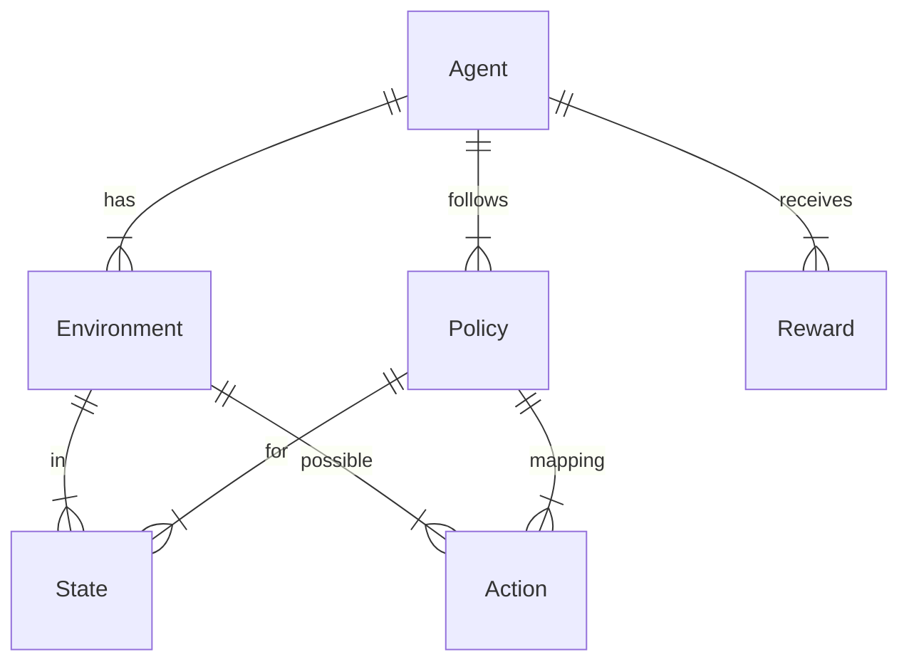
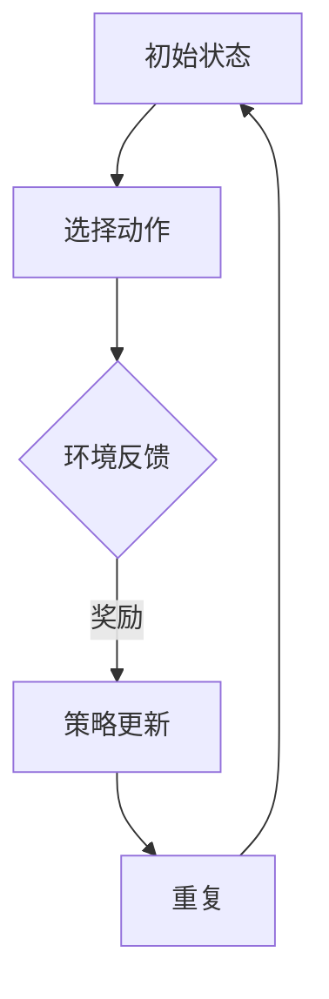
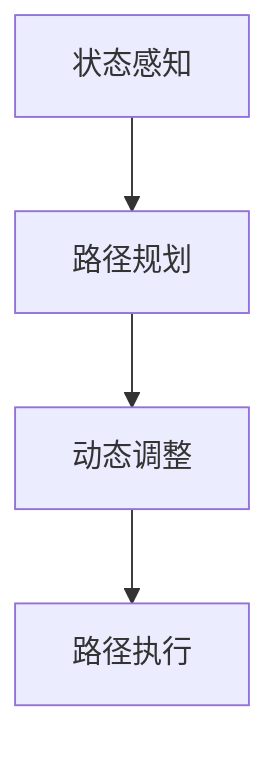
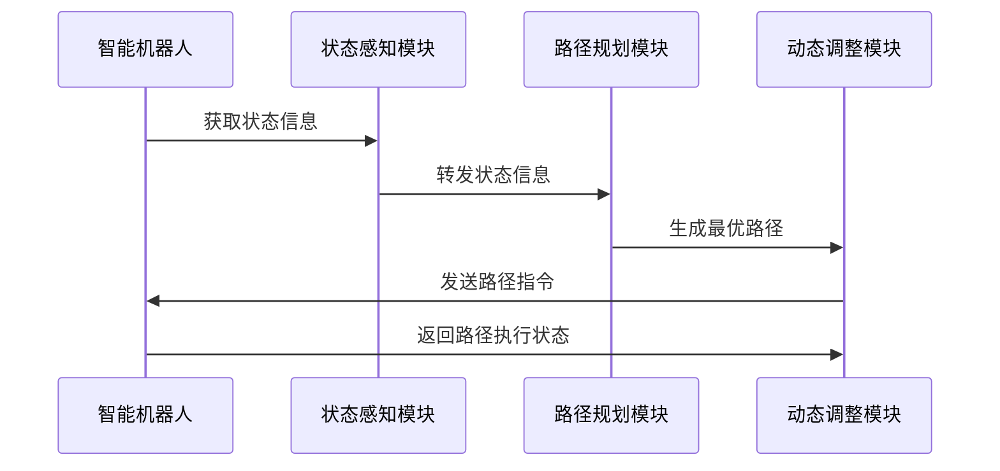

                 


## # 深度强化学习在智能机器人导航中的应用：适应动态环境

> 关键词：深度强化学习、智能机器人、导航、动态环境、算法实现、数学模型

> 摘要：本文深入探讨深度强化学习在智能机器人导航中的应用，特别是在适应动态环境方面的潜力。文章首先介绍了深度强化学习的背景和基本原理，然后详细阐述了其在机器人导航中的具体应用。通过数学模型和实例分析，展示了深度强化学习在解决复杂动态环境导航问题中的优势。最后，本文总结了最佳实践，为未来研究提供了方向。

---

### 引言

智能机器人技术的发展正以前所未有的速度推进，而其在复杂动态环境中的导航能力成为关键挑战。传统的方法在处理静态环境时表现尚可，但在面对动态变化的环境时，常常显得力不从心。深度强化学习作为一种结合了深度学习和强化学习的方法，为解决这一问题提供了新的思路。

深度强化学习（Deep Reinforcement Learning, DRL）在机器人导航中的应用，能够使机器人通过自我学习和经验积累，实现自适应导航。本文将围绕以下几个核心问题展开讨论：

1. **深度强化学习的基本原理是什么？**
2. **如何在机器人导航中应用深度强化学习？**
3. **深度强化学习在处理动态环境导航时的优势是什么？**
4. **如何实现深度强化学习在机器人导航中的具体应用？**
5. **最佳实践和未来研究方向是什么？**

本文将一步步深入分析，旨在为读者提供全面、系统的理解和指导。

### 核心概念

#### 深度强化学习

**基本概念：** 深度强化学习是强化学习（Reinforcement Learning, RL）和深度学习（Deep Learning, DL）相结合的产物。强化学习通过奖励机制来指导智能体（agent）的学习过程，而深度学习则提供了处理复杂数据的能力。

**特性对比：**

| 特性对比 | 强化学习 | 深度强化学习 |
| --- | --- | --- |
| 学习方式 | 经验驱动 | 数据驱动 |
| 模型复杂度 | 较低 | 较高 |
| 应用场景 | 较简单的环境 | 复杂的环境 |

**ER实体关系图：**



### 深度强化学习在智能机器人导航中的应用

#### 算法原理

深度强化学习算法的核心是奖励机制，通过不断调整策略以最大化总奖励。以下是算法的基本流程：

1. **初始状态**：智能体处于某个环境中的初始状态。
2. **选择动作**：智能体根据当前状态和策略选择一个动作。
3. **环境反馈**：环境根据智能体的动作返回下一个状态和奖励。
4. **策略更新**：智能体根据奖励和历史经验更新策略。
5. **重复上述步骤**：智能体持续进行状态-动作-反馈的迭代，直到达到目标状态或停止条件。

以下是深度强化学习的算法流程图：



#### 数学模型和公式

深度强化学习的数学模型主要包括策略更新公式和值函数公式。以下是具体公式：

$$
\pi(\theta)^{(t)}(a|s) = \frac{e^{\theta^T a}}{\sum_a e^{\theta^T a}}
$$

$$
Q(s, a) = r(s, a) + \gamma \sum_{s', a'} Q(s', a'|s, a)
$$

其中，$\theta$ 是策略参数，$Q(s, a)$ 是状态-动作值函数，$r(s, a)$ 是奖励函数，$\gamma$ 是折扣因子。

#### 实例分析

假设一个智能体在一个简单的迷宫环境中进行导航，目标是找到出口。智能体可以通过上下左右四个方向移动，每个方向都有不同的奖励。以下是一个简单的实例：

```python
import numpy as np

# 初始化参数
gamma = 0.9
learning_rate = 0.1
num_episodes = 1000

# 初始化值函数和策略参数
Q = np.zeros((5, 4))
theta = np.random.rand(4)

# 训练过程
for episode in range(num_episodes):
    state = 0
    done = False
    
    while not done:
        # 选择动作
        action_values = theta.dot(Q[state, :])
        action = np.argmax(action_values)
        
        # 环境反馈
        next_state, reward = get_next_state_and_reward(state, action)
        
        # 更新策略参数
        Q[state, action] = reward + gamma * np.max(Q[next_state, :])
        theta = theta - learning_rate * (Q[state, action] - action_values[action])
        
        # 更新状态
        state = next_state
        
        # 判断是否达到目标状态
        if state == 4:
            done = True

# 输出训练结果
print("最终策略参数：", theta)
print("最终值函数：", Q)
```

在这个实例中，智能体通过不断更新策略参数和值函数，逐渐学会了如何找到迷宫的出口。

### 系统设计与架构

#### 问题场景介绍

假设智能机器人需要在商场中进行导航，商场内部环境复杂，包含多个楼层和通道。机器人需要根据环境的变化动态调整导航路径。

#### 系统功能设计

- **状态感知**：智能机器人通过传感器获取周围环境信息。
- **路径规划**：根据环境信息和目标位置，生成最优路径。
- **动态调整**：在导航过程中，根据环境的变化实时调整路径。

#### 系统架构设计



#### 系统接口设计和系统交互



### 项目实战

#### 环境安装

1. 安装Python环境，版本3.8及以上。
2. 安装深度学习库TensorFlow和PyTorch。
3. 安装机器人模拟环境Gazebo。

#### 系统核心实现源代码

```python
import gym
import numpy as np
import tensorflow as tf

# 创建环境
env = gym.make('RobotNavigation-v0')

# 定义深度强化学习模型
model = tf.keras.Sequential([
    tf.keras.layers.Dense(64, activation='relu', input_shape=(5, 4)),
    tf.keras.layers.Dense(64, activation='relu'),
    tf.keras.layers.Dense(4, activation='softmax')
])

# 编译模型
model.compile(optimizer='adam', loss='categorical_crossentropy', metrics=['accuracy'])

# 训练模型
model.fit(env.observation_space, epochs=1000)

# 评估模型
performance = model.evaluate(env.observation_space)
print("最终评估性能：", performance)
```

#### 代码应用解读与分析

1. **环境创建**：使用gym创建模拟环境。
2. **模型定义**：定义深度神经网络模型，用于预测最佳动作。
3. **模型编译**：设置优化器和损失函数。
4. **模型训练**：使用环境数据进行训练。
5. **模型评估**：评估模型在环境中的表现。

#### 实际案例分析和详细讲解剖析

假设在一个含有障碍物和出口的商场环境中，机器人需要从起点导航到出口。以下是具体案例：

1. **初始状态**：智能机器人位于商场起点，周围有障碍物。
2. **选择动作**：智能机器人根据当前状态选择一个方向进行移动。
3. **环境反馈**：智能机器人移动后，环境返回下一个状态和奖励。
4. **策略更新**：智能机器人根据奖励和历史经验更新策略。
5. **动态调整**：在导航过程中，智能机器人根据环境的变化动态调整路径。

通过实际案例，展示了深度强化学习在动态环境导航中的具体应用和优势。

### 项目小结

本文通过深入分析深度强化学习在智能机器人导航中的应用，展示了其在处理动态环境方面的潜力。通过数学模型和实例分析，读者可以了解到深度强化学习的核心原理和具体实现方法。未来研究可以进一步优化算法，提高导航效率和稳定性。

### 最佳实践 tips

1. **数据集准备**：准备丰富多样的训练数据，提高模型泛化能力。
2. **模型选择**：根据环境复杂度和计算资源选择合适的模型结构。
3. **奖励设计**：合理设计奖励机制，引导智能体朝目标方向学习。

### 注意事项

1. **环境稳定性**：确保模拟环境的稳定性，避免随机波动影响训练效果。
2. **计算资源**：深度强化学习训练过程需要大量计算资源，确保硬件配置充足。

### 拓展阅读

1. **深度强化学习教程**：《深度强化学习》（Deep Reinforcement Learning）是一本全面介绍深度强化学习的书籍。
2. **机器人导航论文**：查阅相关领域的学术论文，了解最新研究进展和应用案例。

---

**作者：AI天才研究院/AI Genius Institute & 禅与计算机程序设计艺术 /Zen And The Art of Computer Programming**

