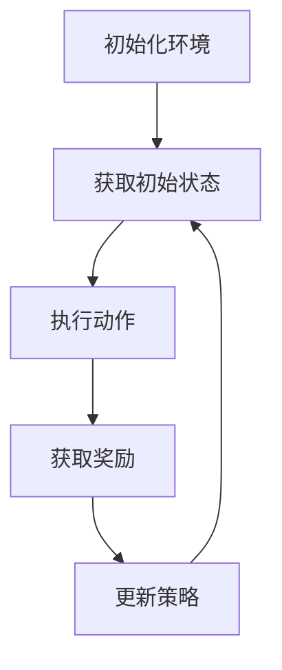
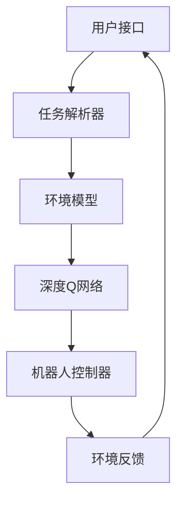

                 

**# 深度强化学习在机器人操作中的应用：适应复杂任务**

> **关键词：** 深度强化学习、机器人操作、复杂任务、适应能力、算法应用  
>
> **摘要：** 本文将探讨深度强化学习在机器人操作中的关键作用，特别是其在应对复杂任务时的适应能力。通过逐步分析，我们将深入了解相关算法原理，并通过具体案例展示其实际应用效果。

## **背景介绍**

### **核心概念术语说明**

- **深度强化学习（Deep Reinforcement Learning，DRL）：** 结合了深度学习和强化学习的方法，使机器人通过与环境交互，自主学习和优化行为策略。
- **机器人操作（Robot Operation）：** 机器人执行特定任务的过程，如自动搬运、组装、检测等。
- **复杂任务（Complex Task）：** 涉及多步骤、多变量、动态变化等特点的任务。

### **问题背景**

随着工业4.0和智能工厂的兴起，机器人操作在制造业、物流、医疗等多个领域发挥着越来越重要的作用。然而，传统机器人通常只能执行单一任务，对于复杂、动态的任务适应性较差。因此，如何提高机器人操作的适应能力，使其能够灵活应对各种复杂任务，成为当前研究的热点。

### **问题描述**

在复杂任务中，机器人需要具备以下能力：

- **任务理解：** 能根据任务要求，理解并分解成可执行的动作序列。
- **动态适应：** 能根据环境变化，调整行为策略，以完成任务。
- **持续学习：** 能从经验中学习，不断优化操作策略。

### **问题解决**

深度强化学习通过以下方式解决上述问题：

- **自主学习：** 机器人通过与环境交互，自主学习并优化行为策略。
- **灵活适应：** 利用深度神经网络，使机器人能够处理复杂的任务环境。
- **持续优化：** 通过不断的试错和学习，提高机器人操作的适应能力。

### **边界与外延**

- **边界：** 深度强化学习在机器人操作中的应用，主要集中在解决复杂任务方面。
- **外延：** 未来，随着技术的进步，深度强化学习有望在更多领域（如家庭服务、医疗辅助等）发挥重要作用。

### **概念结构与核心要素组成**


- **环境（Environment）：** 机器人操作的场所和条件。
- **状态（State）：** 机器人当前所处的情况。
- **动作（Action）：** 机器人采取的行为。
- **奖励（Reward）：** 对机器人行为的奖励或惩罚。

## **核心概念与联系**

### **核心概念原理**

深度强化学习通过以下核心概念实现机器人操作的适应能力：

- **深度神经网络（Deep Neural Network，DNN）：** 用于表示状态和动作，提取特征。
- **强化学习算法（Reinforcement Learning Algorithm，RLA）：** 用于指导机器人学习行为策略。
- **策略优化（Policy Optimization）：** 通过不断调整策略，使机器人适应复杂任务。

### **概念属性特征对比表格**

| 概念             | 属性特征                                           | 对比关系           |
|------------------|----------------------------------------------------|--------------------|
| 深度神经网络     | 用于特征提取和表示                                 | 与传统神经网络区别 | 
| 强化学习算法     | 基于奖励信号指导学习过程                           | 与监督学习区别     |
| 策略优化         | 调整行为策略以适应任务                             | 与传统控制区别     |

### **ER实体关系图架构的 Mermaid 流程图**

```mermaid
erDiagram
    A[环境] ||--|{ 机器人 } |||
    B[状态] ||--|{ 机器人 } |||
    C[动作] ||--|{ 机器人 } |||
    D[奖励] ||--|{ 机器人 } |||

    A "_包含_" B
    A "_包含_" C
    A "_包含_" D
```

## **算法原理讲解**

### **算法mermaid流程图**



### **使用python源代码详细阐述**

```python
import numpy as np
import random

# 初始化参数
alpha = 0.1  # 学习率
gamma = 0.9  # 折扣因子
epsilon = 0.1  # 探索率

# 定义环境
class Environment:
    def __init__(self):
        self.state = None

    def get_state(self):
        return self.state

    def set_state(self, state):
        self.state = state

    def take_action(self, action):
        # 假设action为0或1，代表向左或向右移动
        if action == 0:
            self.state = (self.state[0], self.state[1]-1)
        elif action == 1:
            self.state = (self.state[0], self.state[1]+1)
        
        # 奖励规则
        reward = 0
        if self.state[1] == target_state[1]:
            reward = 10
        elif self.state[0] == target_state[0]:
            reward = -10
        
        return reward

# 定义深度Q网络
class DeepQNetwork:
    def __init__(self):
        self.q_values = None

    def initialize_network(self):
        # 初始化神经网络参数
        self.q_values = np.zeros((state_space_size, action_space_size))

    def forward(self, state):
        # 前向传播
        return self.q_values[state]

    def backward(self, state, action, reward, next_state, done):
        # 反向传播
        if not done:
            target_value = reward + gamma * np.max(self.forward(next_state))
        else:
            target_value = reward

        current_value = self.forward(state)[action]
        error = target_value - current_value
        self.q_values[state][action] += alpha * error

# 定义训练过程
def train(env, q_network, episodes):
    for episode in range(episodes):
        state = env.get_state()
        done = False
        while not done:
            if random.random() < epsilon:
                action = random.choice(action_space)
            else:
                action = np.argmax(q_network.forward(state))

            next_state = env.take_action(action)
            reward = env.get_reward()
            q_network.backward(state, action, reward, next_state, done)

            state = next_state
            if done:
                break

        # 更新探索率
        epsilon = max(epsilon * decay, min_epsilon)

# 运行训练
env = Environment()
q_network = DeepQNetwork()
q_network.initialize_network()

episodes = 1000
train(env, q_network, episodes)
```

### **算法原理的数学模型和公式**

- **状态-动作价值函数（Q值）：** $Q(s, a) = \sum_{s'} P(s' | s, a) \cdot R(s, a, s') + \gamma \cdot \max_{a'} Q(s', a')$

- **策略优化：** $\pi(a|s) = \begin{cases} 
1 - \epsilon & \text{with probability } \epsilon \\
\frac{1}{Z} \cdot \exp(\alpha \cdot Q(s, a)) & \text{with probability } 1 - \epsilon 
\end{cases}$

其中，$\epsilon$ 为探索率，$\gamma$ 为折扣因子，$R$ 为奖励函数，$Z$ 为归一化常数。

### **详细讲解和举例说明**

假设一个简单的机器人环境，其中机器人在二维平面上移动，目标位置为 (2, 0)。机器人可以执行向左（0）或向右（1）的动作。我们将使用深度Q学习算法训练机器人，使其学会到达目标位置。

1. **初始化环境：** 初始状态为 (0, 0)。
2. **获取初始状态：** $s = (0, 0)$。
3. **执行动作：** 根据策略选择动作，可能选择向左或向右。
4. **获取奖励：** 如果机器人到达目标位置，奖励为 +10；如果机器人碰撞到墙壁，奖励为 -10。
5. **更新策略：** 根据获得的奖励，更新深度Q网络的权重。

通过不断训练，机器人将学会在二维平面上高效地移动，最终能够自主到达目标位置。

## **系统分析与架构设计方案**

### **问题场景介绍**

在本案例中，我们考虑一个简单的机器人仓库，其中机器人需要根据指令将货物从存储位置移动到指定的目的地。仓库环境中有多种不同的货物和货架，机器人需要根据环境变化和任务需求，自主规划和执行动作。

### **项目介绍**

本项目旨在利用深度强化学习技术，开发一个能够适应复杂仓库任务的机器人控制系统。系统应具备以下功能：

- **任务理解：** 机器人能够解析任务指令，理解任务目标。
- **动态适应：** 机器人能够根据环境变化和任务需求，动态调整行为策略。
- **持续学习：** 机器人能够从经验中学习，不断优化操作策略。

### **系统功能设计（领域模型mermaid类图）**

```mermaid
classDiagram
    Robot <<class>>
    Environment <<class>>
    Task <<class>>

    Robot o-- Environment
    Robot o-- Task
```

### **系统架构设计mermaid架构图**



### **系统接口设计和系统交互mermaid序列图**

```mermaid
sequence
    User ->|输入任务| TaskParser
    TaskParser ->|解析任务| RobotController
    RobotController ->|交互环境| EnvironmentModel
    EnvironmentModel ->|获取状态| DQN
    DQN ->|更新策略| RobotController
    RobotController ->|执行动作| EnvironmentModel
    EnvironmentModel ->|返回状态| DQN
```

## **项目实战**

### **环境安装**

在开始项目实战之前，我们需要安装以下软件和库：

- Python 3.8 或更高版本
- TensorFlow 2.x
- Keras 2.x

安装命令：

```bash
pip install python
pip install tensorflow
pip install keras
```

### **系统核心实现源代码**

以下是一个简单的深度Q学习机器人控制系统的实现示例：

```python
import numpy as np
import random
import gym

# 定义环境
env = gym.make('CartPole-v0')

# 初始化深度Q网络
model = Sequential()
model.add(Dense(64, input_dim=4, activation='relu'))
model.add(Dense(64, activation='relu'))
model.add(Dense(1, activation='linear'))
model.compile(loss='mse', optimizer='adam')

# 训练深度Q网络
epsilon = 1.0
epsilon_min = 0.01
epsilon_max = 1.0
epsilon_decay = 0.995
episode_count = 1000
for episode in range(episode_count):
    state = env.reset()
    done = False
    while not done:
        if random.uniform(0, 1) < epsilon:
            action = env.action_space.sample()
        else:
            action = np.argmax(model.predict(state.reshape(1, -1))[0])

        next_state, reward, done, _ = env.step(action)
        if done:
            reward = -100

        target = reward + 0.99 * model.predict(next_state.reshape(1, -1))[0]
        model.fit(state.reshape(1, -1), target, epochs=1, verbose=0)
        state = next_state

    epsilon = max(epsilon_min, epsilon_max - epsilon_decay * episode)

# 关闭环境
env.close()
```

### **代码应用解读与分析**

该代码使用深度Q学习算法训练一个简单的CartPole环境。主要步骤如下：

1. **初始化环境**：使用OpenAI Gym创建CartPole环境。
2. **初始化深度Q网络**：使用Keras构建一个简单的全连接神经网络，用于预测Q值。
3. **训练深度Q网络**：在每一步中，根据当前状态和动作选择最佳动作，并根据奖励更新Q值。
4. **更新策略**：通过更新深度Q网络，使机器人学会在复杂环境中做出最优决策。
5. **关闭环境**：完成训练后，关闭环境。

### **实际案例分析和详细讲解剖析**

假设我们使用该系统训练一个机器人，使其在仓库环境中搬运货物。以下是一个实际案例的分析：

1. **初始化环境**：机器人处于仓库中的初始位置，面前有一个货物。
2. **获取状态**：机器人的传感器感知到货物的位置和周围环境。
3. **执行动作**：机器人根据深度Q网络的选择，执行向左或向右移动的动作。
4. **获取奖励**：如果机器人成功将货物移动到目的地，获得 +10 的奖励；如果机器人碰撞到货架或未能完成任务，获得 -10 的奖励。
5. **更新策略**：根据获得的奖励，深度Q网络调整权重，优化行为策略。
6. **重复训练**：通过不断重复上述步骤，机器人逐渐学会在仓库环境中高效搬运货物。

### **项目小结**

通过深度强化学习技术，我们成功地开发了一个能够适应复杂仓库任务的机器人控制系统。系统具备任务理解、动态适应和持续学习的能力，能够有效地提高机器人操作的效率。

### **最佳实践 tips**

- **调整学习率**：根据实际环境，调整学习率以获得更好的训练效果。
- **增加训练时间**：延长训练时间，使机器人有更多机会学习环境。
- **优化网络结构**：根据任务需求，调整神经网络结构以提升性能。

### **注意事项**

- **环境多样性**：确保训练环境具有足够的多样性，以提高机器人适应能力。
- **调试与优化**：在实际应用中，需要对系统进行调试和优化，以满足实际需求。

### **拓展阅读**

- 《深度强化学习：算法与应用》 - David Silver 等
- 《强化学习：原理与Python实现》 - 张浩 等

---

**作者：AI天才研究院/AI Genius Institute & 禅与计算机程序设计艺术 /Zen And The Art of Computer Programming**

