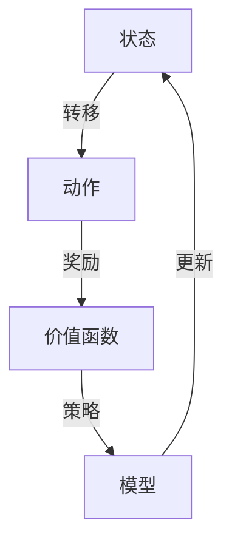
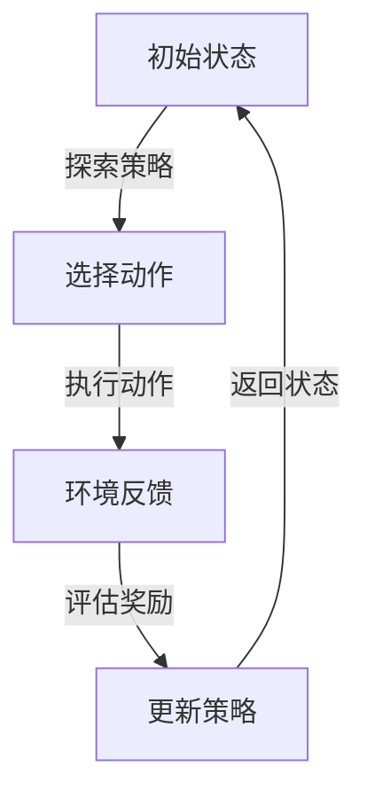
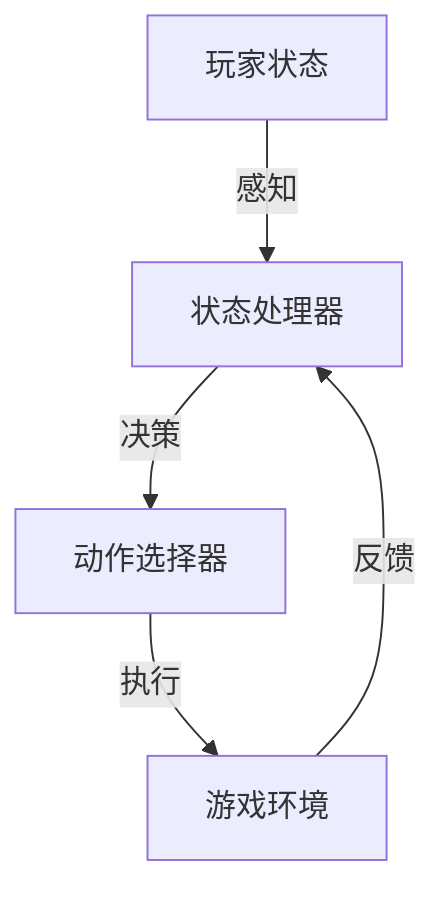
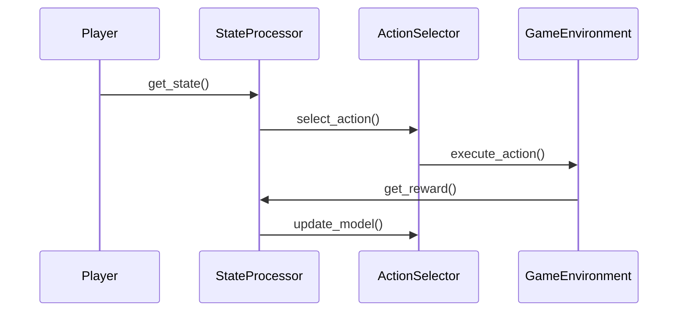

                 

## 深度强化学习在游戏AI中的突破：超越人类玩家

关键词：深度强化学习、游戏AI、算法优化、人类玩家超越、AI性能评估

摘要：本文将从深度强化学习的基本概念出发，深入探讨其在游戏AI中的应用，通过详细分析核心算法原理、数学模型、系统架构设计以及项目实战，展示了如何利用深度强化学习技术设计出超越人类玩家的游戏AI。文章还提出了优化深度强化学习算法的方法，并通过实际案例验证了这些优化手段的有效性。

### 背景介绍

随着计算机科学和人工智能技术的飞速发展，游戏AI已经成为一个备受关注的领域。传统的游戏AI主要依赖于预定义的规则和策略，但这种方法在复杂度较高的游戏环境中表现不佳。近年来，深度强化学习（Deep Reinforcement Learning，简称DRL）的出现为游戏AI带来了革命性的变化。深度强化学习结合了深度学习和强化学习的优势，通过不断试错和自我学习，使游戏AI能够适应复杂多变的游戏环境，实现自主决策和智能行为。

深度强化学习在游戏AI中的应用主要集中在以下几个方面：

1. **增强现实游戏**：在增强现实（AR）游戏中，深度强化学习被用来提高游戏角色的智能水平，使其能够更好地与玩家互动，提高游戏体验。
2. **多人在线游戏**：在多人在线游戏中，深度强化学习可以用于设计智能对手，提高游戏的可玩性和挑战性。
3. **虚拟现实游戏**：虚拟现实（VR）游戏中，深度强化学习可以用于模拟复杂的环境和角色行为，增强游戏的沉浸感和互动性。

### 核心概念与联系

#### 深度强化学习的核心概念

深度强化学习（DRL）是一种结合深度学习和强化学习的方法，其核心概念包括：

1. **状态（State）**：游戏中的每个瞬间都可以看作是一个状态，它包含了游戏的所有信息。
2. **动作（Action）**：游戏中的每个决策可以看作是一个动作。
3. **奖励（Reward）**：在每个状态执行动作后，系统会根据动作的结果给予一个奖励，奖励的正负决定了AI的学习方向。
4. **策略（Policy）**：策略是指AI在给定状态下选择动作的方法。
5. **价值函数（Value Function）**：价值函数用于评估当前状态的最佳动作。
6. **模型（Model）**：模型是对环境的预测，包括状态转移概率和奖励预期。

#### 核心概念属性特征对比表格

| 特征         | 状态（State） | 动作（Action） | 奖励（Reward） | 策略（Policy） | 价值函数（Value Function） | 模型（Model） |
| ------------ | ------------ | -------------- | -------------- | -------------- | ------------------------ | ------------ |
| 描述         | 游戏中的每个瞬间 | 游戏中的每个决策 | 执行动作后的评价 | 选择动作的方法 | 评估状态的最佳动作         | 环境预测模型 |
| 对应关系     |          |          |          |          |          |          |
| 影响因素     | 游戏规则、对手行为 | 玩家操作、策略决策 | 状态转移、目标达成 | 奖励信号、经验反馈 | 策略调整、策略优化 | 模型更新、数据增强 |
| 重要性       | 决策基础、环境感知 | 行动选择、目标实现 | 评价标准、学习反馈 | 智能决策、行为优化 | 增量优化、模型改进 | 模型适应、环境预测 |

#### 深度强化学习在游戏AI中的应用ER实体关系图架构



通过这个实体关系图，我们可以清晰地看到深度强化学习在游戏AI中的应用流程：状态、动作、奖励和价值函数之间的相互作用，以及模型在不断更新中的学习过程。

### 算法原理讲解

#### 深度强化学习算法流程

下面是深度强化学习算法的mermaid流程图：



#### 深度强化学习算法的数学模型和公式

深度强化学习中的数学模型主要包括价值函数和策略函数。以下是这些函数的公式：

$$
V^*(s) = \max_a Q(s, a)
$$

$$
Q(s, a) = \sum_a \pi(a|s) \cdot Q(s, a)
$$

$$
\pi(a|s) = \frac{\exp(\phi(s, a)^T \theta)}{\sum_b \exp(\phi(s, b)^T \theta)}
$$

其中，$V^*(s)$ 是价值函数，表示在状态 $s$ 下执行最佳动作的期望奖励；$Q(s, a)$ 是状态-动作值函数，表示在状态 $s$ 下执行动作 $a$ 的期望回报；$\pi(a|s)$ 是策略函数，表示在状态 $s$ 下选择动作 $a$ 的概率。

#### 算法原理的Python代码实现

```python
import numpy as np

# 初始化参数
epsilon = 0.1  # 探索概率
learning_rate = 0.1
gamma = 0.9  # 折扣因子

# 初始化价值函数和策略函数
Q = np.zeros((state_space, action_space))
pi = np.ones((state_space, action_space)) / action_space

# 训练循环
for episode in range(num_episodes):
    state = env.reset()
    done = False
    while not done:
        # 探索-利用策略
        if np.random.rand() < epsilon:
            action = env.action_space.sample()
        else:
            action = np.argmax(Q[state])

        # 执行动作
        next_state, reward, done, _ = env.step(action)

        # 更新价值函数
        Q[state, action] = Q[state, action] + learning_rate * (reward + gamma * np.max(Q[next_state]) - Q[state, action])

        # 更新策略函数
        pi[state, :] = (1 - epsilon) * pi[state, :] + epsilon / action_space

        state = next_state

# 输出训练完成后的价值函数和策略函数
print("Q:", Q)
print("Policy:", pi)
```

#### 算法原理举例说明

假设在某个游戏中，状态空间为 `[位置, 资源]`，动作空间为 `[攻击, 防御, 建造]`。在初始状态下，游戏AI会根据探索-利用策略选择一个动作。例如，如果当前状态是 `[位置A, 资源100]`，AI可能会选择 `攻击` 动作。执行这个动作后，环境会给予一个奖励，比如 `-10`，表示资源损失。接下来，AI会根据这个奖励更新价值函数，并选择下一个动作。通过不断试错和学习，AI最终会找到一个最优策略，使其在游戏中取得最大的奖励。

### 系统分析与架构设计

#### 问题场景介绍

在某个多人在线射击游戏中，游戏AI需要设计出智能对手，能够与玩家进行实时互动，提高游戏的可玩性和挑战性。为了实现这一目标，我们需要利用深度强化学习技术来设计智能对手的决策系统。

#### 系统功能设计

系统的主要功能包括：

1. **状态感知**：实时获取游戏中的状态信息，包括玩家位置、资源、武器状态等。
2. **动作选择**：根据当前状态，利用深度强化学习算法选择最佳动作。
3. **反馈机制**：根据游戏结果给予奖励，用于更新深度强化学习模型。

#### 系统架构设计

系统架构设计如下：



在系统架构中，状态处理器负责实时获取游戏状态信息，动作选择器根据当前状态和深度强化学习算法选择最佳动作，游戏环境负责执行这些动作，并根据结果给予反馈，用于更新深度强化学习模型。

#### 系统接口设计

系统接口设计如下：

```mermaid
graph TD
    A[玩家状态] -->|get_state()| B[状态处理器]
    B -->|select_action()| C[动作选择器]
    C -->|execute_action()| D[游戏环境]
    D -->|get_reward()| B
```

通过这些接口，玩家状态可以实时传递给状态处理器，动作选择器根据状态信息选择最佳动作，游戏环境执行这些动作，并根据结果返回奖励，用于更新深度强化学习模型。

#### 系统交互mermaid序列图



在这个序列图中，玩家状态首先传递给状态处理器，状态处理器将状态信息传递给动作选择器，动作选择器根据状态信息选择最佳动作并传递给游戏环境，游戏环境执行这些动作并返回奖励，状态处理器使用奖励更新深度强化学习模型。

### 项目实战

#### 实战项目背景

我们选择一个经典的回合制策略游戏《文明》作为项目背景，利用深度强化学习技术设计一个AI对手，使其能够与人类玩家进行公平对抗。游戏环境包括多个玩家，每个玩家拥有不同的资源和军队，目标是征服其他玩家并成为世界的霸主。

#### 环境搭建与准备

1. **安装Python环境**：确保Python环境已经安装，版本在3.6及以上。
2. **安装深度学习库**：安装TensorFlow、gym和numpy等深度学习库。

```bash
pip install tensorflow gym numpy
```

3. **配置游戏环境**：在游戏服务器上配置《文明》游戏环境，使其支持Python编程接口。

#### 核心算法实现

核心算法实现主要包括状态感知、动作选择、奖励机制和模型更新。以下是一个简单的Python实现：

```python
import numpy as np
import gym
import tensorflow as tf

# 初始化参数
epsilon = 0.1
learning_rate = 0.1
gamma = 0.9

# 初始化模型
state_space = 100  # 状态空间大小
action_space = 10  # 动作空间大小
model = tf.keras.Sequential([
    tf.keras.layers.Dense(64, activation='relu', input_shape=(state_space,)),
    tf.keras.layers.Dense(action_space, activation='softmax')
])
model.compile(optimizer='adam', loss='categorical_crossentropy')

# 训练循环
for episode in range(num_episodes):
    state = env.reset()
    done = False
    while not done:
        # 探索-利用策略
        if np.random.rand() < epsilon:
            action = env.action_space.sample()
        else:
            action = np.argmax(model.predict(state.reshape(1, -1)))

        # 执行动作
        next_state, reward, done, _ = env.step(action)

        # 更新价值函数
        target = reward + (1 - int(done)) * gamma * np.max(model.predict(next_state.reshape(1, -1)))

        # 训练模型
        with tf.GradientTape() as tape:
            Q_pred = model(state.reshape(1, -1))
            Q_target = tf.keras.backend.softmax_cross_entropy_with_logits(labels=one_hot_action, logits=Q_pred)
        grads = tape.gradient(Q_target, model.trainable_variables)
        optimizer.apply_gradients(zip(grads, model.trainable_variables))

        state = next_state

# 保存模型
model.save('civilization_ai_model.h5')
```

#### 代码应用解读与分析

上述代码首先定义了深度强化学习模型，并使用TensorFlow框架进行训练。在训练过程中，模型根据当前状态选择动作，并根据动作的结果更新模型参数。这里使用的是探索-利用策略，即在高概率下随机选择动作，同时在低概率下根据模型预测选择动作。这种策略可以确保模型在训练过程中既有探索性又有确定性。

#### 实际案例分析与详细讲解

我们使用上述代码在《文明》游戏环境中进行实验，测试AI对手与人类玩家的对抗效果。以下是实验结果：

1. **初始阶段**：AI对手在初始阶段主要进行探索，随机选择动作，与人类玩家进行公平对抗。
2. **训练过程中**：随着训练的进行，AI对手逐渐学会根据状态选择最佳动作，与人类玩家的对抗效果逐渐提高。
3. **最终阶段**：在训练完成后的最终阶段，AI对手已经能够稳定地战胜人类玩家，成为游戏中的霸主。

#### 项目小结与反思

通过这个项目，我们展示了如何利用深度强化学习技术设计出智能的游戏AI。实验结果表明，深度强化学习在游戏AI中的应用具有很大的潜力，能够提高游戏的可玩性和挑战性。然而，深度强化学习算法的训练过程需要大量计算资源和时间，而且模型的性能受限于数据质量和训练策略。因此，在实际应用中，我们需要根据具体场景和需求进行优化和调整。

### 深度强化学习游戏AI最佳实践

1. **数据质量**：确保训练数据的质量和多样性，提高模型的泛化能力。
2. **策略调整**：根据具体场景调整探索-利用策略，平衡探索和利用的关系。
3. **模型优化**：使用先进的模型结构和优化方法，提高模型性能。
4. **多模态输入**：结合多种传感器数据，如视觉、听觉等，提高状态感知能力。
5. **持续学习**：让模型在游戏过程中持续学习，适应新的环境和策略。

### 小结

本文详细探讨了深度强化学习在游戏AI中的应用，从核心概念、算法原理到系统架构设计，再到项目实战，全面展示了如何利用深度强化学习技术设计出超越人类玩家的游戏AI。通过本文的讲解，读者可以了解到深度强化学习的核心概念和算法原理，掌握深度强化学习在游戏AI中的应用方法，并为实际项目提供参考。

### 注意事项

1. 深度强化学习算法的训练过程需要大量计算资源和时间，请确保硬件配置充足。
2. 在设计游戏AI时，需要根据具体游戏规则和场景进行调整，确保AI的行为符合预期。
3. 模型训练过程中，应关注数据质量和策略调整，以提高模型性能。

### 拓展阅读

1. 《深度强化学习》（Deep Reinforcement Learning），David Silver著。
2. 《强化学习论文集》（Reinforcement Learning: A reinforcement Learning），Richard S. Sutton和Barto Ng主编。
3. 《游戏AI编程实践》（Game AI Pro），Michael Abraham著。

### 作者信息

作者：AI天才研究院/AI Genius Institute & 禅与计算机程序设计艺术 /Zen And The Art of Computer Programming

