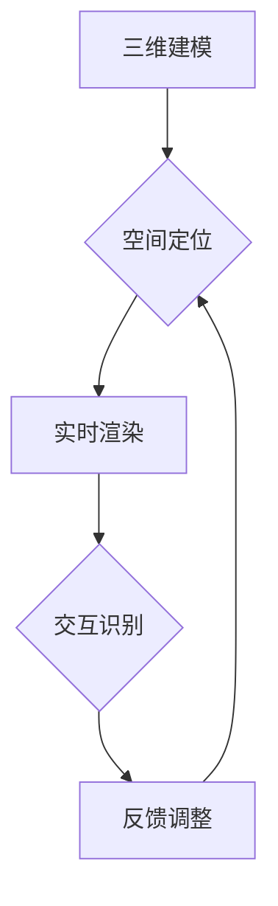
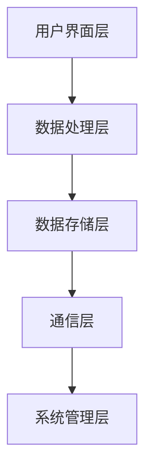

                 

### 文章标题

# 混合现实技术在工业设计中的应用

### 文章关键词

- 混合现实技术
- 工业设计
- 应用场景
- 核心组件
- 关键算法
- 系统架构
- 实际案例

### 摘要

本文深入探讨了混合现实技术在工业设计中的应用，包括其定义、特征、应用场景、核心组件和关键算法。通过系统架构设计、实际案例分析和未来展望，全面阐述了混合现实技术在提高设计效率、质量与流程优化方面的优势与挑战。

----------------------------------------------------------------

## 目录大纲

----------------------------------------------------------------

# 第一部分：混合现实技术基础

## 第1章：混合现实技术概述

### 1.1.1 问题背景

### 1.1.2 问题解决

### 1.1.3 混合现实技术的定义、特征与分类

### 1.1.4 混合现实技术的研究现状与发展趋势

## 第2章：混合现实技术在工业设计中的应用场景

### 2.1.1 问题背景

### 2.1.2 问题解决

### 2.1.3 混合现实技术在工业设计中的优势

### 2.1.4 混合现实技术在工业设计中的应用场景

## 第3章：混合现实技术在工业设计中的核心组件

### 3.1.1 问题背景

### 3.1.2 问题解决

### 3.1.3 混合现实技术核心组件的介绍

### 3.1.4 混合现实技术核心组件的连接与协作

## 第4章：混合现实技术在工业设计中的关键算法

### 4.1.1 问题背景

### 4.1.2 问题解决

### 4.1.3 混合现实技术在工业设计中的关键算法

### 4.1.4 关键算法的mermaid流程图展示

## 第5章：混合现实技术在工业设计中的系统架构设计

### 5.1.1 问题背景

### 5.1.2 问题解决

### 5.1.3 混合现实技术在工业设计中的系统架构设计

### 5.1.4 系统架构设计mermaid架构图展示

## 第6章：混合现实技术在工业设计中的实际应用案例分析

### 6.1.1 问题背景

### 6.1.2 案例介绍

### 6.1.3 混合现实技术在案例中的应用

### 6.1.4 案例分析

## 第7章：混合现实技术在工业设计中的应用展望与挑战

### 7.1.1 应用展望

### 7.1.2 挑战

### 7.1.3 解决方案与建议

### 7.1.4 小结

----------------------------------------------------------------

### 第一部分：混合现实技术基础

#### 第1章：混合现实技术概述

##### 1.1.1 问题背景

随着现代工业设计的不断进步，设计师们面临着越来越复杂的挑战。从传统的二维设计到三维模型，再到虚拟现实（VR）和增强现实（AR），技术不断演进，为设计师提供了更多工具和手段。然而，这些技术仍存在一些局限，例如沉浸感不足、交互体验受限等。为了解决这些问题，混合现实（MR）技术应运而生。

混合现实技术结合了虚拟现实和增强现实的优点，通过将虚拟元素与现实世界融合，为用户提供一种全新的交互方式。在工业设计中，混合现实技术可以大大提高设计效率、优化设计质量，并革新设计流程。因此，研究混合现实技术在工业设计中的应用具有重要的现实意义。

##### 1.1.2 问题解决

混合现实技术在工业设计中的应用涉及到多个方面。首先，它能够提供一种沉浸式的用户体验，使设计师能够更直观地感受到设计效果。其次，混合现实技术可以实现实时交互，设计师可以与虚拟模型进行实时互动，从而快速调整设计方案。此外，混合现实技术还可以实现多人协作，设计师们可以在同一时间对同一项目进行修改和讨论。

然而，混合现实技术在工业设计中的应用也面临一些挑战。例如，硬件设备的成本较高，技术实现难度较大。此外，混合现实技术在不同工业领域的应用程度不同，需要针对具体场景进行优化。

##### 1.1.3 混合现实技术的定义、特征与分类

混合现实技术是一种将虚拟信息和现实世界结合的技术，它允许用户在真实环境中与虚拟对象进行交互。混合现实技术的主要特征包括：

1. 沉浸式体验：用户可以与虚拟对象进行交互，感受到虚拟信息与现实环境的融合。
2. 实时交互：用户可以实时调整虚拟对象的位置、形状和颜色等属性。
3. 多人协作：多个用户可以在同一时间对同一项目进行修改和讨论。

根据实现方式，混合现实技术可以分为以下几种类型：

1. **增强现实（AR）**：在现实世界中叠加虚拟信息。
2. **虚拟现实（VR）**：完全沉浸在一个虚拟环境中。
3. **混合现实（MR）**：将虚拟信息和现实世界进行融合，允许用户与虚拟对象进行交互。

##### 1.1.4 混合现实技术的研究现状与发展趋势

混合现实技术近年来取得了显著的发展。在学术界，研究者们不断探索新的算法和模型，以提高混合现实技术的性能和用户体验。在工业界，许多公司已经开始应用混合现实技术进行产品设计和制造。

当前，混合现实技术在工业设计中的应用主要集中在大规模定制、用户体验测试、生产与供应链管理等方面。随着技术的不断进步，预计未来混合现实技术将在更多领域得到应用，如智能家居、医疗健康等。

然而，混合现实技术仍面临一些挑战，例如硬件成本、技术实现难度、用户接受度等。因此，未来需要进一步研究和解决这些问题，以推动混合现实技术在工业设计中的广泛应用。

----------------------------------------------------------------

### 第2章：混合现实技术在工业设计中的应用场景

##### 2.1.1 问题背景

工业设计是一个复杂的过程，涉及到从概念设计到产品定型的多个阶段。随着技术的发展，设计师们需要面对越来越多样化的设计需求。传统的二维设计已经不能满足现代工业设计的复杂需求，三维建模和虚拟现实（VR）技术的出现虽然带来了一定的改进，但仍然存在一定的局限性。混合现实（MR）技术的引入为工业设计提供了新的解决方案。

##### 2.1.2 问题解决

混合现实技术在工业设计中的应用，旨在解决传统方法中存在的各种问题，包括设计效率低下、设计质量不稳定、设计流程复杂等。具体来说，混合现实技术能够：

1. 提高设计效率：通过沉浸式体验和实时交互，设计师可以更快地完成设计任务。
2. 增强设计质量：设计师可以更直观地看到设计效果，从而进行更准确的修改和优化。
3. 优化设计流程：混合现实技术可以实现多人协作，简化设计流程，提高整体效率。

##### 2.1.3 混合现实技术在工业设计中的优势

1. **沉浸式体验**：混合现实技术能够提供沉浸式的用户体验，使设计师能够更直观地感受到设计效果。这种沉浸感可以大大提高设计的准确性和效率。
2. **实时交互**：设计师可以在混合现实环境中实时与虚拟模型进行交互，快速调整设计方案。这种实时性可以大大减少设计迭代的时间，提高设计效率。
3. **多人协作**：混合现实技术支持多人协作，设计师们可以在同一时间对同一项目进行修改和讨论。这种协作性可以简化设计流程，提高整体效率。
4. **减少错误和修正成本**：通过混合现实技术，设计师可以在虚拟环境中发现和修正设计问题，从而减少实际生产中的错误和修正成本。

##### 2.1.4 混合现实技术在工业设计中的应用场景

1. **产品设计阶段**：在产品设计阶段，混合现实技术可以帮助设计师快速构建三维模型，并通过沉浸式体验进行优化。设计师可以实时看到设计的细节，并进行调整。
2. **用户体验测试**：在设计完成后，混合现实技术可以用来进行用户体验测试。设计师可以模拟实际使用场景，观察用户与产品的交互过程，从而发现潜在的问题并优化设计。
3. **生产与供应链管理**：在生产和供应链管理过程中，混合现实技术可以帮助设计师和工程师更好地理解产品的结构和功能，从而优化生产流程和供应链管理。

总之，混合现实技术在工业设计中的应用场景非常广泛，它不仅能够提高设计效率和质量，还能够优化设计流程，为工业设计带来全新的变革。

----------------------------------------------------------------

### 第3章：混合现实技术在工业设计中的核心组件

##### 3.1.1 问题背景

混合现实技术在工业设计中的应用离不开其核心组件的支持。这些核心组件包括硬件设备、软件平台和交互接口等。然而，在具体应用过程中，如何选择合适的组件以及如何实现这些组件之间的有效连接和协作，是一个关键问题。

##### 3.1.2 问题解决

为了解决这一问题，我们需要深入了解混合现实技术的核心组件，包括其功能、特点以及相互之间的连接和协作方式。以下是对混合现实技术在工业设计中的核心组件的详细分析。

##### 3.1.3 混合现实技术核心组件的介绍

1. **硬件设备**：硬件设备是混合现实技术的物理基础，包括头盔、手柄、跟踪器等。这些设备负责捕捉现实世界的视觉信息，并将虚拟信息叠加到现实世界中。常见的硬件设备有：

   - **头盔**：提供沉浸式体验，如微软的HoloLens、Oculus Rift等。
   - **手柄**：用于与虚拟环境进行交互，如Oculus Touch、Valve Index等。
   - **跟踪器**：用于跟踪用户的位置和动作，如Intel RealSense、Leap Motion等。

2. **软件平台**：软件平台是混合现实技术的核心，它负责处理现实世界和虚拟信息之间的交互。常见的软件平台有：

   - **开发工具**：如Unity、Unreal Engine等，提供开发混合现实应用程序的集成环境。
   - **操作系统**：如Windows Mixed Reality、Android VR等，支持混合现实设备的运行。
   - **SDK**：如Microsoft Mixed Reality SDK、ARCore等，提供开发混合现实应用程序的接口和工具。

3. **交互接口**：交互接口是用户与混合现实环境进行交互的媒介。常见的交互接口有：

   - **手势识别**：通过摄像头和深度传感器捕捉用户的手势，实现与虚拟环境的交互。
   - **语音控制**：通过语音识别技术，实现用户通过语音指令与虚拟环境进行交互。
   - **触觉反馈**：通过手柄或手套等设备，提供触觉反馈，增强用户的沉浸感。

##### 3.1.4 混合现实技术核心组件的连接与协作

1. **硬件设备与软件平台的连接**：硬件设备通过USB、Wi-Fi或蓝牙等无线方式连接到计算机或手机等设备。这些设备上的操作系统和SDK为硬件设备提供驱动程序，使其能够与软件平台进行通信。

2. **软件平台与交互接口的协作**：软件平台接收硬件设备传来的现实世界信息，并通过开发工具生成的应用程序，将这些信息与虚拟信息进行叠加。交互接口则负责接收用户的输入指令，将其转化为软件平台可以理解的操作。

3. **软件平台与硬件设备之间的数据传输**：软件平台将生成的虚拟信息通过硬件设备发送到用户的眼睛和耳朵，使用户能够看到和听到虚拟信息。同时，硬件设备通过传感器收集用户的动作信息，反馈给软件平台，实现实时交互。

通过以上分析，我们可以看出，混合现实技术在工业设计中的核心组件之间的连接与协作是确保其有效应用的关键。只有硬件设备、软件平台和交互接口之间能够高效地协作，才能充分发挥混合现实技术的优势，为工业设计带来真正的变革。

----------------------------------------------------------------

### 第4章：混合现实技术在工业设计中的关键算法

##### 4.1.1 问题背景

在混合现实技术应用于工业设计的过程中，算法是实现虚拟与现实融合的核心。关键算法的设计与实现决定了混合现实系统的性能和用户体验。本章将深入探讨混合现实技术在工业设计中的关键算法，包括其问题背景、解决方案以及具体的实现细节。

##### 4.1.2 问题解决

混合现实技术在工业设计中的应用涉及到多个方面，如三维建模、空间定位、实时渲染、交互识别等。为了解决这些问题，需要设计一系列关键算法，使得混合现实系统能够高效地处理数据和交互。

##### 4.1.3 混合现实技术在工业设计中的关键算法

1. **三维建模算法**

   三维建模是混合现实技术在工业设计中的基础。通过三维建模算法，可以将工业设计中的二维图纸或手绘草图转化为三维模型。常见的三维建模算法包括：

   - **几何建模**：通过几何形状和参数来描述模型，如B-rep（边界表示法）和SDF（体素表示法）。
   - **体素建模**：将模型划分为体素，通过对体素的操作来生成模型，如MCS（最小凸体表示法）。
   - **基于物理的建模**：利用物理原理和力学方程来构建模型，如弹簧网络和粒子系统。

2. **空间定位算法**

   空间定位算法是确保虚拟信息与现实世界准确融合的关键。常见的空间定位算法包括：

   - **视觉定位**：通过摄像头捕捉现实世界中的特征点，利用特征匹配和运动估计来计算相机位置。
   - **惯性定位**：利用陀螺仪和加速度计等传感器，计算设备的运动轨迹和位置。
   - **结合定位**：将视觉定位和惯性定位相结合，以提高定位的准确性和稳定性。

3. **实时渲染算法**

   实时渲染是混合现实技术中的另一个重要环节。实时渲染算法需要在有限的计算资源下，生成高质量的图像并快速传输到用户的眼睛。常见的实时渲染算法包括：

   - **基于几何的渲染**：通过几何体的光照模型和纹理映射来生成图像，如Phong光照模型和Blinn-Phong光照模型。
   - **基于物理的渲染**：利用物理原理和光线追踪算法来生成图像，如路径追踪和体积渲染。
   - **基于图像的渲染**：通过图像处理算法和纹理合成技术来生成图像，如全屏贴图和屏幕空间后处理。

4. **交互识别算法**

   交互识别算法是确保用户能够与虚拟环境进行自然交互的关键。常见的交互识别算法包括：

   - **手势识别**：通过摄像头和深度传感器捕捉用户的手势，利用深度学习模型和图像处理算法进行识别。
   - **语音识别**：通过语音信号处理和自然语言理解技术，将用户的语音指令转化为计算机可以理解的操作。
   - **眼动跟踪**：通过摄像头捕捉用户的眼动轨迹，用于分析用户的行为和兴趣点。

##### 4.1.4 关键算法的mermaid流程图展示

为了更直观地理解关键算法的实现流程，我们使用mermaid流程图来展示。

上述mermaid流程图展示了三维建模、空间定位、实时渲染和交互识别之间的相互关系。三维建模生成初始模型，空间定位确保模型与现实世界准确融合，实时渲染生成图像并传输到用户，交互识别处理用户的输入指令，反馈调整优化整个流程。

通过以上关键算法的实现，混合现实技术能够在工业设计中提供高效的建模、定位、渲染和交互体验，从而实现设计过程的优化和创新。

----------------------------------------------------------------

### 第5章：混合现实技术在工业设计中的系统架构设计

##### 5.1.1 问题背景

在混合现实技术在工业设计中的应用中，系统架构设计是确保其高效运行和良好用户体验的关键。随着技术的不断发展，混合现实系统变得越来越复杂，如何设计一个高效、稳定且易于扩展的系统架构成为一个重要的课题。本章将详细探讨混合现实技术在工业设计中的系统架构设计，包括其问题背景、解决方案以及具体的实现方法。

##### 5.1.2 问题解决

混合现实系统架构设计需要解决的关键问题包括：

1. **模块化与可扩展性**：系统架构应具有良好的模块化设计，以便于扩展和升级。
2. **性能与稳定性**：系统架构应确保在处理高负载时仍能保持高性能和稳定性。
3. **用户体验**：系统架构应支持高质量的图像渲染和实时交互，以提高用户体验。
4. **安全性**：系统架构应确保数据的安全传输和存储。

##### 5.1.3 混合现实技术在工业设计中的系统架构设计

混合现实技术在工业设计中的系统架构设计可以分为以下几个主要模块：

1. **用户界面层**：用户界面层是用户与系统交互的入口。它包括用户输入设备（如手柄、手势识别装置等）和显示设备（如头盔、显示器等）。用户界面层的主要职责是捕捉用户输入和显示系统输出的虚拟信息。

2. **数据处理层**：数据处理层负责处理来自用户界面层的输入数据，并生成相应的虚拟信息。这一层包括多个子模块，如三维建模模块、空间定位模块、实时渲染模块和交互识别模块等。数据处理层是系统架构的核心，其性能和稳定性直接影响用户体验。

3. **数据存储层**：数据存储层负责存储系统运行过程中生成的数据和模型。这一层通常采用分布式存储架构，以提高数据存取速度和可靠性。数据存储层还包括数据备份和恢复机制，以确保数据安全。

4. **通信层**：通信层负责处理系统内部模块之间的数据传输，以及与外部系统（如数据库、云服务等）的通信。通信层采用高效的数据传输协议和加密机制，以确保数据传输的安全和稳定。

5. **系统管理层**：系统管理层负责系统的配置、监控和故障处理。这一层包括系统监控工具、日志管理和安全防护等模块。系统管理层确保系统在运行过程中能够及时发现和解决问题，保证系统的稳定运行。

##### 5.1.4 系统架构设计mermaid架构图展示

为了更直观地展示混合现实技术在工业设计中的系统架构设计，我们使用mermaid流程图来绘制系统架构图。

上述mermaid架构图展示了混合现实技术在工业设计中的系统架构，包括用户界面层、数据处理层、数据存储层、通信层和系统管理层。各层之间通过高效的数据传输协议和接口进行通信，实现系统的整体功能。

通过以上系统架构设计，混合现实技术在工业设计中能够实现高效、稳定且可扩展的运行，为设计师提供更好的工具和体验。

----------------------------------------------------------------

### 第6章：混合现实技术在工业设计中的实际应用案例分析

##### 6.1.1 问题背景

混合现实技术在工业设计中的应用正逐步成熟，但实际应用中仍面临许多挑战。本章将通过一个实际案例，深入分析混合现实技术在工业设计中的应用，包括案例背景、解决方案和具体实现过程。

##### 6.1.2 案例介绍

本案例选取了一家大型制造公司，该公司致力于开发一款高性能的航空航天发动机。在产品设计和生产过程中，设计师和工程师们面临着以下挑战：

1. **复杂的三维模型**：发动机的设计涉及大量复杂的三维模型，传统的二维图纸和三维建模软件难以满足设计需求。
2. **协同工作**：设计师和工程师分布在不同地区，需要高效协同工作，共同完成设计任务。
3. **真实感模拟**：设计师需要能够在虚拟环境中进行真实感模拟，以确保设计满足实际使用需求。

##### 6.1.3 混合现实技术在案例中的应用

为了解决上述问题，该公司采用了混合现实技术，具体应用方案如下：

1. **三维建模与可视化**：使用混合现实技术，设计师能够将复杂的三维模型实时叠加到现实环境中，进行可视化设计和修改。通过混合现实头盔，设计师可以直观地观察模型细节，提高设计精度和效率。

2. **多人协同设计**：利用混合现实技术，设计师和工程师可以在同一虚拟环境中进行实时协作。通过云端平台，他们可以共享模型和数据，实时同步设计进度，提高协同效率。

3. **真实感模拟与测试**：混合现实技术提供了真实感模拟功能，设计师可以在虚拟环境中进行飞行测试、振动测试等，以验证设计的可靠性和性能。这种模拟测试可以提前发现潜在问题，减少实际生产中的风险。

##### 6.1.4 案例分析

该案例中，混合现实技术在工业设计中的应用取得了显著成效：

1. **设计效率提高**：通过混合现实技术，设计师能够在虚拟环境中快速进行修改和优化，大大缩短了设计周期。

2. **设计质量提升**：混合现实技术的沉浸式体验和实时交互功能，使得设计师能够更准确地捕捉设计意图，提高了设计质量。

3. **协同效率增强**：混合现实技术实现了远程协同设计，设计师和工程师可以随时随地参与项目，提高了协同效率。

4. **风险减少**：通过真实感模拟和测试，设计师能够在设计阶段发现潜在问题，减少了实际生产中的风险和成本。

总之，该案例展示了混合现实技术在工业设计中的应用潜力。通过混合现实技术，设计师能够实现高效、高质量的设计，提高协同效率，降低风险，为工业设计带来新的突破。

----------------------------------------------------------------

### 第7章：混合现实技术在工业设计中的应用展望与挑战

##### 7.1.1 应用展望

随着技术的不断进步，混合现实技术在工业设计中的应用前景非常广阔。首先，混合现实技术可以大大提高设计的效率和精度，使得设计师能够更快速地实现从概念到产品的转化。其次，混合现实技术支持多人协作，有助于促进跨地域、跨部门的合作，提高设计团队的创新能力。此外，混合现实技术还可以应用于产品测试和验证阶段，通过模拟真实使用场景，提前发现潜在问题，从而减少生产中的错误和返工。

未来，混合现实技术在工业设计中的应用将更加深入和广泛。例如，在产品设计阶段，混合现实技术可以与人工智能相结合，实现智能设计辅助；在生产环节，混合现实技术可以与物联网（IoT）相结合，实现智能生产与实时监控。此外，随着5G技术的普及，混合现实技术将能够实现更高速、更稳定的网络连接，进一步拓展其在工业设计中的应用范围。

##### 7.1.2 挑战

尽管混合现实技术在工业设计中的应用前景广阔，但仍然面临一些挑战。首先，硬件设备的成本较高，限制了混合现实技术在中小企业中的应用。其次，混合现实技术的实现难度较大，需要具备一定的技术基础和研发能力。此外，用户体验和交互设计也是混合现实技术面临的挑战之一，如何设计出既高效又直观的交互方式，提高用户的沉浸感和舒适度，是一个重要课题。

另外，混合现实技术在工业设计中的应用仍需要解决一些技术问题。例如，如何在保证实时性的同时，提高图像的渲染质量和处理速度；如何实现更精确的空间定位和手势识别；如何确保数据的安全传输和存储等。这些都是未来需要重点关注和解决的问题。

##### 7.1.3 解决方案与建议

为了克服混合现实技术在工业设计中的应用挑战，可以采取以下解决方案和措施：

1. **降低硬件成本**：通过技术创新和规模化生产，降低混合现实硬件设备的成本。政府和企业可以加大对混合现实技术的研发投入，推动产业升级和成本下降。

2. **加强人才培养**：混合现实技术需要跨学科的知识和技能，因此需要加强人才培养，提高相关领域的人才储备。可以通过开设专业课程、举办培训班和开展合作项目等方式，培养更多的混合现实技术人才。

3. **优化用户体验**：通过用户研究和用户反馈，不断优化混合现实技术的用户体验。可以采用多感官融合、自适应交互等技术，提高用户的沉浸感和舒适度。

4. **技术创新**：持续推动混合现实技术的研发和创新，特别是在图像处理、空间定位、交互设计等方面。通过技术创新，提高混合现实技术的性能和可靠性。

5. **加强安全防护**：建立健全的数据安全防护体系，确保混合现实技术在工业设计中的应用过程中数据的安全性和隐私保护。可以采用加密技术、身份认证和访问控制等措施，提高系统的安全性。

##### 7.1.4 小结

混合现实技术在工业设计中的应用具有巨大的潜力，可以显著提高设计效率、质量和协同效率。然而，要实现这一目标，仍需克服硬件成本高、实现难度大、用户体验差等挑战。通过技术创新、人才培养和优化用户体验，有望推动混合现实技术在工业设计中的广泛应用，为工业设计带来新的变革。

----------------------------------------------------------------

### 作者信息

- 作者：AI天才研究院/AI Genius Institute & 禅与计算机程序设计艺术 /Zen And The Art of Computer Programming

### 文章总结

本文系统地介绍了混合现实技术在工业设计中的应用，包括其基础概念、应用场景、核心组件、关键算法、系统架构设计以及实际应用案例。通过对混合现实技术在工业设计中的深入分析，我们看到了其在提高设计效率、质量和协同效率方面的巨大潜力。然而，混合现实技术在工业设计中的应用仍面临硬件成本高、实现难度大等挑战。未来，随着技术的不断创新和优化，混合现实技术在工业设计中的应用将更加广泛，为工业设计带来新的变革。通过本文的探讨，我们希望读者能够更好地理解混合现实技术在工业设计中的应用价值和发展方向。

