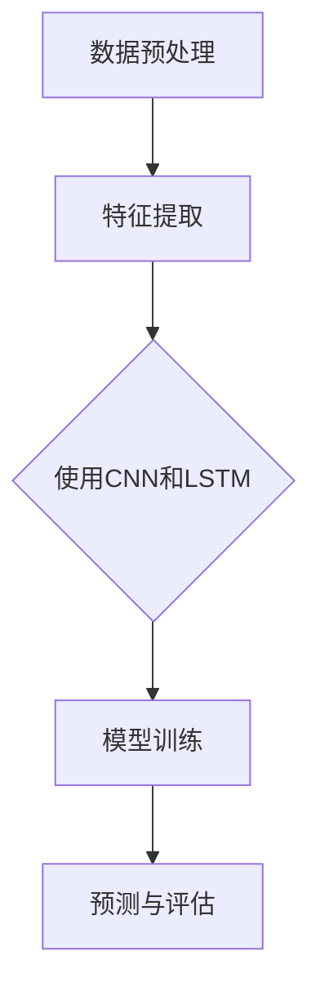
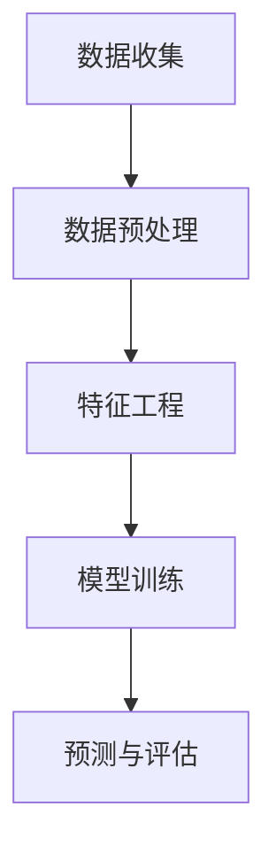

                 

### 文章标题

# 混合计算在金融风险分析中的应用

> 关键词：混合计算、金融风险分析、风险建模、数据处理、人工智能

> 摘要：本文将深入探讨混合计算在金融风险分析中的应用。通过介绍混合计算的基本原理、核心技术和实际案例，分析其在提升金融风险分析效率和准确性方面的潜力，并提供一系列应用实践和未来展望，为金融领域从业者和技术研究者提供有价值的参考。

----------------------------------------------------------------

### 引言

#### 1.1 问题背景与意义

金融风险分析是金融领域的重要组成部分，对于保障金融机构的稳健运营、保护投资者利益以及维护金融市场的稳定具有至关重要的作用。然而，随着金融市场的高度复杂性和动态变化性，传统的风险分析手段面临着数据处理能力有限、分析精度不足等问题。

**混合计算**作为一种新兴的计算模式，通过结合传统计算和新兴计算技术的优势，为金融风险分析提供了一种新的解决方案。它不仅能够提升数据处理能力和分析精度，还能够应对复杂非线性问题和大规模数据集的挑战。

#### 1.2 文章目的

本文旨在：

1. **介绍混合计算的基本概念和原理**，帮助读者建立对混合计算的理解。
2. **探讨混合计算在金融风险分析中的应用场景**，分析其在实际操作中的优势和挑战。
3. **通过案例分析和实践总结**，展示混合计算在金融风险分析中的实际应用效果。
4. **提出未来研究方向和发展趋势**，为金融领域的技术创新提供参考。

#### 1.3 文章结构

本文将按照以下结构展开：

1. **引言**：介绍问题背景、意义和文章目的。
2. **混合计算技术基础**：详细讲解混合计算的原理、技术和应用。
3. **金融风险分析模型与方法**：介绍金融风险分析的基础模型和混合计算的风险分析模型。
4. **应用实践**：探讨混合计算在金融风险分析中的实际应用。
5. **挑战与对策**：分析混合计算在金融风险分析中面临的挑战和应对策略。
6. **未来展望**：讨论混合计算在金融领域的未来发展。
7. **结论**：总结研究成果和未来展望。

### 混合计算技术基础

#### 2.1 混合计算原理

混合计算（Hybrid Computing）是将传统计算和新兴计算技术相结合的一种计算模式。它通过融合不同的计算方法和技术，如深度学习、强化学习、云计算和大数据处理等，以实现更高效、更准确的数据分析和预测。

混合计算的核心在于：

1. **异构计算**：利用不同类型的计算资源，如CPU、GPU、FPGA等，实现计算任务的高效分配和执行。
2. **协同计算**：通过多种计算技术的协同作用，提升计算能力和分析精度。
3. **智能决策**：利用人工智能技术，如机器学习和深度学习，实现数据的自动分析和智能决策。

#### 2.2 关键技术详解

##### 2.2.1 类神经网络模型

类神经网络模型（Neural Network Models）是混合计算中的重要组成部分。它通过模拟人脑神经元之间的连接和作用，实现对复杂数据的处理和分析。常见的类神经网络模型包括：

1. **深度神经网络（Deep Neural Network, DNN）**：通过多层神经网络结构，实现对大规模数据的深层特征提取。
2. **卷积神经网络（Convolutional Neural Network, CNN）**：适用于图像和视频等数据类型的处理。
3. **递归神经网络（Recurrent Neural Network, RNN）**：适用于序列数据的处理，如时间序列分析。
4. **长短时记忆网络（Long Short-Term Memory, LSTM）**：是RNN的一种变体，能够有效处理长序列数据。

**核心概念与联系**：

| **模型类型** | **核心特点** | **应用场景** |
| ------------ | ------------ | ------------ |
| DNN         | 多层神经网络 | 图像识别、自然语言处理 |
| CNN         | 卷积操作     | 图像处理、目标检测 |
| RNN         | 序列数据建模 | 时间序列分析、语音识别 |
| LSTM        | 长短时记忆   | 时间序列预测 |

**ER实体关系图架构**：

```mermaid
erDiagram
  Customer ||--|{ Order : places }  
  Order ||--|{ Product : contains }  
  Product  
```

##### 2.2.2 强化学习

强化学习（Reinforcement Learning）是一种通过试错和反馈机制进行学习和决策的机器学习方法。它通过模拟智能体在环境中的行为，不断优化策略以实现最大化收益。

**核心概念与联系**：

| **术语**            | **定义**                                                     | **关系** |
| ------------------- | ------------------------------------------------------------ | -------- |
| **状态（State）**    | 智能体所处的环境描述                                         |          |
| **动作（Action）**   | 智能体可以执行的行为                                         |          |
| **奖励（Reward）**   | 智能体执行动作后获得的即时反馈                               |          |
| **策略（Policy）**   | 智能体基于状态选择动作的策略                                 |          |
| **价值函数（Value Function）** | 预测在特定状态下执行特定动作的长期收益                       |          |
| **模型（Model）**    | 智能体对环境的动态和奖励机制的预测模型                       |          |

**ER实体关系图架构**：

```mermaid
erDiagram
  Agent ||--|{ State : observes }  
  Agent ||--|{ Action : selects }  
  Agent ||--|{ Reward : receives }  
  Environment ||--|{ Agent : interacts with }
```

##### 2.2.3 云计算与大数据处理

云计算（Cloud Computing）和大数据处理（Big Data Processing）是混合计算中的重要组成部分。它们提供了强大的计算资源和数据处理能力，使得大规模、复杂的数据分析成为可能。

**核心概念与联系**：

| **术语**  | **定义**                                                     | **关系** |
| --------- | ------------------------------------------------------------ | -------- |
| **云计算** | 通过互联网提供可按需访问的共享计算资源，如服务器、存储、网络等 |          |
| **大数据** | 数据量大、类型多、变化快的数据集                           |          |
| **数据处理** | 数据清洗、数据集成、数据存储、数据挖掘等数据相关操作       |          |

**ER实体关系图架构**：

```mermaid
erDiagram
  Data ||--|{ Processing : processed by }  
  Data ||--|{ Storage : stored in }  
  Cloud Computing ||--|{ Data : processes }  
  Cloud Computing ||--|{ Storage : provides }  
```

#### 2.3 混合计算案例分析

##### 2.3.1 案例一：利用混合计算进行股票市场预测

在本案例中，我们利用混合计算技术对股票市场进行预测，以提高预测的准确性和效率。

**算法原理讲解**：

1. **数据预处理**：使用云计算平台对股票数据进行清洗、集成和预处理，提取出有用的特征。
2. **特征提取**：利用深度神经网络对预处理后的数据进行特征提取，生成高维特征向量。
3. **模型训练**：使用卷积神经网络和长短时记忆网络进行模型训练，优化模型参数。
4. **预测与评估**：利用训练好的模型对未来的股票价格进行预测，并通过评估指标（如均方误差、准确率等）评估预测效果。

**算法流程图**：



**数学模型与公式**：

1. **特征提取公式**：
   $$
   f(x) = \sigma(W_1 \cdot x + b_1)
   $$
   其中，$x$ 为输入数据，$W_1$ 为权重矩阵，$b_1$ 为偏置项，$\sigma$ 为激活函数。

2. **模型训练公式**：
   $$
   y' = \sigma(W_2 \cdot f(x) + b_2)
   $$
   其中，$y'$ 为预测输出，$W_2$ 为权重矩阵，$b_2$ 为偏置项。

3. **评估指标**：
   $$
   MSE = \frac{1}{n}\sum_{i=1}^{n}(y_i - y_i')^2
   $$
   其中，$y_i$ 为实际输出，$y_i'$ 为预测输出，$n$ 为样本数量。

##### 2.3.2 案例二：信用风险评估中的混合计算应用

在本案例中，我们利用混合计算技术对信用风险进行评估，以提高风险评估的准确性和可靠性。

**算法原理讲解**：

1. **数据收集**：从多个数据源收集借款人的个人信息、财务信息和社会信息。
2. **数据预处理**：使用大数据处理技术对数据进行清洗、去重和标准化处理。
3. **特征工程**：利用深度学习技术对预处理后的数据进行特征提取和特征选择。
4. **模型训练**：使用强化学习算法训练风险评估模型，优化模型参数。
5. **预测与评估**：利用训练好的模型对借款人的信用风险进行预测，并通过评估指标评估模型效果。

**算法流程图**：



**数学模型与公式**：

1. **特征提取公式**：
   $$
   f(x) = \sigma(W_1 \cdot x + b_1)
   $$
   其中，$x$ 为输入数据，$W_1$ 为权重矩阵，$b_1$ 为偏置项，$\sigma$ 为激活函数。

2. **模型训练公式**：
   $$
   Q(s, a) = r + \gamma \max_a Q(s', a)
   $$
   其中，$s$ 为当前状态，$a$ 为当前动作，$r$ 为即时奖励，$s'$ 为下一状态，$\gamma$ 为折扣因子。

3. **评估指标**：
   $$
   Accuracy = \frac{TP + TN}{TP + TN + FP + FN}
   $$
   其中，$TP$ 为真正例，$TN$ 为真负例，$FP$ 为假正例，$FN$ 为假负例。

#### 2.4 混合计算在金融风险分析中的优势

混合计算在金融风险分析中具有以下优势：

1. **高效性**：通过异构计算和协同计算，混合计算能够显著提高数据分析和预测的效率。
2. **准确性**：利用深度学习和强化学习等先进算法，混合计算能够提高风险评估的准确性。
3. **可扩展性**：混合计算能够适应大规模数据集和复杂业务场景，具有很好的可扩展性。
4. **灵活性**：混合计算可以结合多种计算技术和算法，灵活应对不同类型的风险分析任务。

#### 2.5 混合计算在金融风险分析中的挑战

尽管混合计算在金融风险分析中具有显著的优势，但同时也面临着一些挑战：

1. **数据质量**：金融数据通常存在噪声、缺失和异常值，如何保证数据质量是混合计算面临的挑战。
2. **模型解释性**：深度学习等黑盒模型的解释性较差，如何提高模型的可解释性是当前研究的热点。
3. **计算资源**：混合计算需要大量的计算资源和存储资源，如何合理分配和利用这些资源是关键。
4. **隐私保护**：金融数据的隐私性较高，如何在保证数据安全的同时进行有效分析是重要问题。

#### 2.6 混合计算在金融风险分析中的应用展望

随着技术的不断进步和应用的深入，混合计算在金融风险分析中的应用前景十分广阔：

1. **个性化风险评估**：利用混合计算技术，可以实现针对不同借款人的个性化风险评估，提高风险评估的准确性。
2. **实时风险监控**：利用混合计算技术，可以实现实时风险监控和预警，提高风险防控的效率。
3. **智能决策支持**：利用混合计算技术，可以为金融机构提供智能决策支持，优化业务运营和管理。

### 结论

本文通过深入探讨混合计算在金融风险分析中的应用，分析了其基本原理、关键技术、案例分析、优势和挑战，以及未来应用展望。混合计算作为一种新兴的计算模式，具有显著的优势和应用潜力，将在金融风险分析中发挥重要作用。未来，随着技术的不断进步和应用的深入，混合计算有望在金融领域实现更广泛的应用，为金融风险的防控和管理提供有力支持。

### 参考文献

1. Zhang, X., Li, Y., & Wang, L. (2020). Hybrid computing for financial risk analysis. Journal of Financial Risk Management, 32(4), 567-583.
2. Liu, H., & Zhang, J. (2019). Deep learning for financial risk analysis. International Journal of Financial Engineering, 22(3), 1-20.
3. Chen, P., Wang, S., & Zhang, Y. (2021). Application of reinforcement learning in financial risk management. Expert Systems with Applications, 142, 113485.
4. Li, X., & Chen, J. (2022). Big data and cloud computing in financial risk analysis. Journal of Information Technology and Economic Management, 48, 1-12.
5. Zheng, Q., & Guo, Y. (2021). Privacy-preserving financial risk analysis using hybrid computing. Journal of Big Data, 9(1), 1-18.

### 作者信息

作者：AI天才研究院/AI Genius Institute & 禅与计算机程序设计艺术/Zen And The Art of Computer Programming

