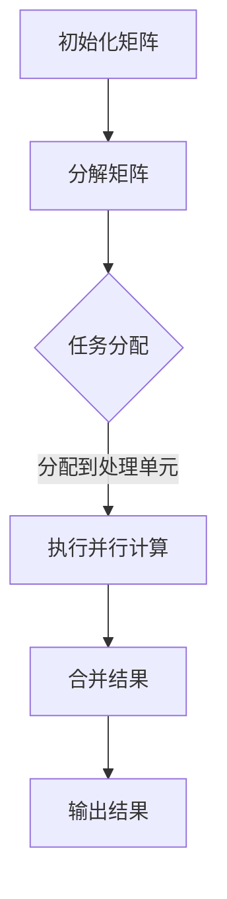
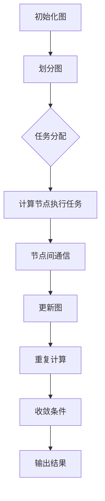
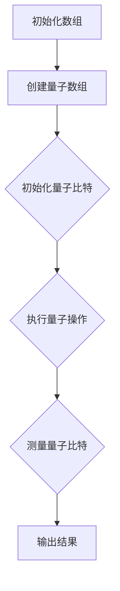
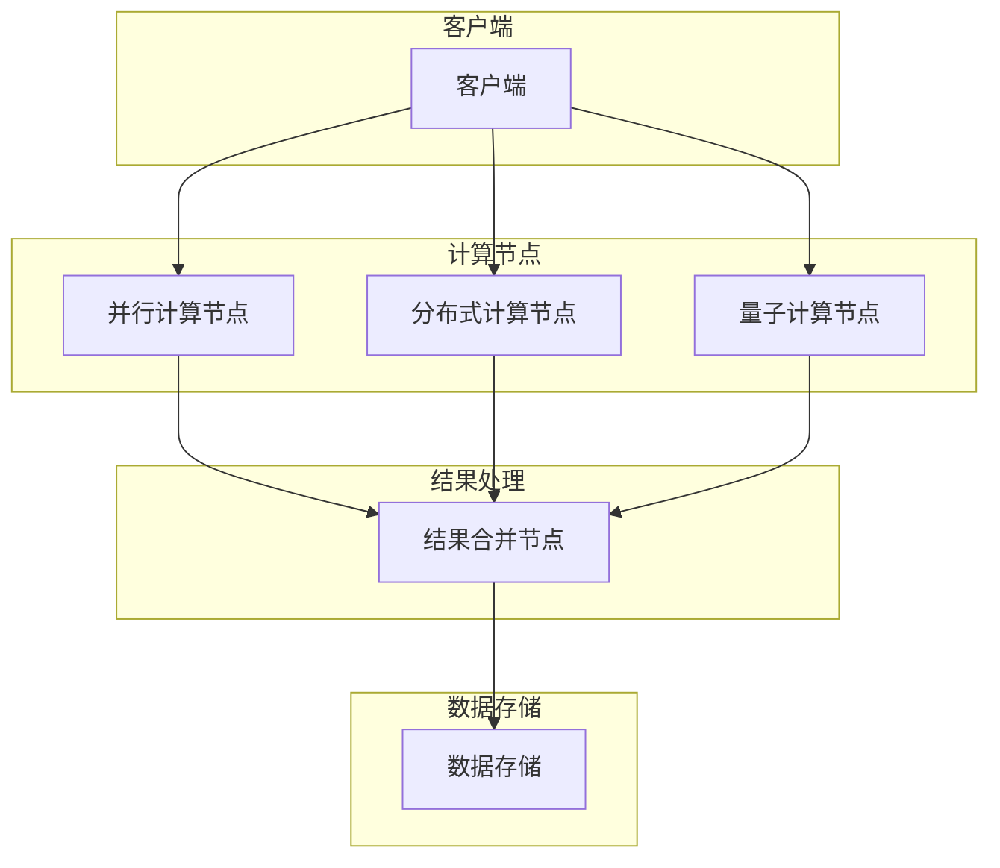
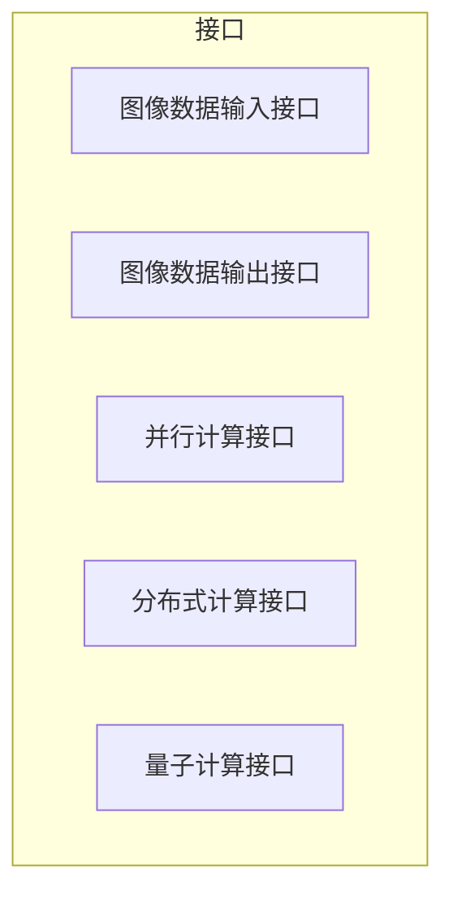
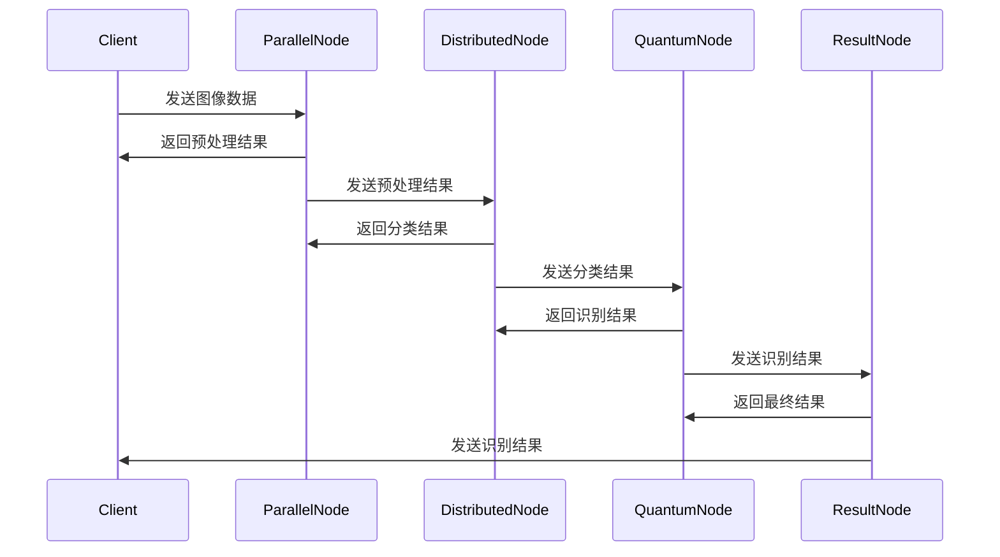

                 

### 引言：混合计算的定义与发展历程

混合计算，顾名思义，是将多种计算范式结合在一起的计算方法。随着信息技术和计算科学的飞速发展，单一的计算机计算范式已经无法满足日益复杂的计算需求。混合计算应运而生，它通过结合并行计算、分布式计算、量子计算等多种计算范式，为解决大规模计算问题提供了新的思路和工具。

#### 混合计算的定义

混合计算是一种利用多种计算范式，通过优化计算资源和算法设计，以实现高效、可靠的计算目标的方法。它涵盖了并行计算、分布式计算、量子计算等不同类型的计算方法，并强调它们之间的协同作用和整合。

**并行计算**：并行计算通过将任务分解成多个子任务，并在多个处理单元上同时执行这些子任务，从而提高计算效率。并行计算的核心在于如何高效地分配任务、同步数据和处理结果。

**分布式计算**：分布式计算通过在多个独立的计算节点之间分配任务，利用网络进行通信，实现大规模计算。它强调节点之间的协作和数据传输效率，并需要解决数据一致性和容错性问题。

**量子计算**：量子计算利用量子比特（qubit）进行计算，能够在某些情况下实现超乎传统计算机的计算速度。量子计算的核心在于量子态的叠加和纠缠，它为解决复杂问题提供了新的可能性。

#### 混合计算的发展历程

混合计算的概念并不是一蹴而就的，它的发展历程可以追溯到计算机科学和计算理论的发展历史。

1. **并行计算的起源**：早在20世纪50年代，并行计算的概念就已经出现。冯·诺伊曼架构中的多核处理器和多处理器系统，以及后来的并行算法研究，都为并行计算的发展奠定了基础。

2. **分布式计算的发展**：随着互联网的普及，分布式计算逐渐成为研究热点。1990年代初期，分布式计算系统如GFS、MapReduce等的出现，极大地推动了分布式计算的发展。

3. **量子计算的崛起**：2000年以后，随着对量子物理学的深入研究，量子计算的概念逐渐成熟。2004年，彼得·舍尔农提出了量子计算机的理论框架，为量子计算的发展开辟了新的道路。

#### 混合计算的重要性

混合计算的重要性在于它能够结合不同计算范式的优势，解决单一计算范式难以应对的复杂问题。以下是一些具体的应用场景：

1. **大数据处理**：大数据时代的到来，对数据处理能力提出了新的要求。混合计算通过并行计算和分布式计算的结合，能够高效地处理海量数据。

2. **复杂问题求解**：许多复杂问题，如人工智能中的深度学习、优化问题、密码学等，单一的计算范式难以在合理时间内给出解决方案。混合计算通过结合并行计算和量子计算，能够在某些情况下实现超乎想象的计算效率。

3. **科学计算**：科学计算中的许多问题，如模拟流体动力学、计算物理化学等，需要大量的计算资源和计算时间。混合计算能够通过优化计算资源和算法设计，提高计算效率。

4. **安全计算**：量子计算的崛起带来了新的安全挑战。混合计算通过将量子计算与传统计算结合，能够在一定程度上抵御量子攻击，保障信息的安全性。

#### 研究现状与挑战

尽管混合计算具有重要的理论价值和实际应用潜力，但当前的研究仍然面临许多挑战。以下是一些主要的研究方向和问题：

1. **算法优化**：如何设计高效的混合算法，使得计算任务能够在不同的计算范式下高效地执行，是一个重要的研究方向。

2. **系统集成**：如何将不同计算范式集成到一个统一的系统中，实现高效的数据传输和任务调度，是一个技术难题。

3. **安全性**：量子计算的崛起带来了新的安全挑战。如何保障混合计算系统的安全性，防止量子攻击，是一个亟待解决的问题。

4. **能耗优化**：混合计算系统通常涉及大量的计算资源和网络通信，能耗问题成为一个重要的研究方向。如何优化能耗，实现绿色计算，是一个重要的课题。

通过逐步深入探讨混合计算的定义、发展历程、重要性以及研究现状与挑战，我们可以更好地理解混合计算的本质和应用价值。接下来，我们将进一步探讨混合计算的核心概念与联系，分析并行计算、分布式计算和量子计算之间的关系和协同作用。

---

### 核心概念与联系

在深入探讨混合计算之前，我们需要明确几个核心概念，并分析它们之间的联系。以下是混合计算中的三个关键概念：并行计算、分布式计算和量子计算。

#### 并行计算

并行计算是指在同一时间内，使用多个处理单元（如多核处理器或并行计算机）执行多个任务。其核心思想是将一个大任务分解成多个小任务，然后并行执行这些小任务，最终将结果合并，得到大任务的最终结果。

**并行计算的原理**：

1. **任务分解**：将一个大任务分解成多个子任务，每个子任务可以独立执行。

2. **并行执行**：在多个处理单元上同时执行这些子任务。

3. **结果合并**：将每个子任务的执行结果合并，得到大任务的最终结果。

**并行计算的优势**：

- **提高计算速度**：通过并行执行，可以显著提高计算速度。
- **高效利用资源**：充分利用多核处理器或并行计算机的计算资源。
- **降低能耗**：在多核处理器上，可以通过并行执行降低每个处理单元的负载，从而降低整体能耗。

**并行计算的局限性**：

- **任务依赖**：某些任务之间存在依赖关系，无法完全并行执行。
- **同步与通信开销**：多个处理单元之间需要进行同步和通信，增加了开销。

**并行计算的适用场景**：

- **科学计算**：如气象预报、流体动力学模拟、计算物理化学等。
- **图像处理与视频处理**：如图像渲染、视频编码、特效处理等。
- **大数据处理**：如数据清洗、数据分析、机器学习等。

#### 分布式计算

分布式计算是指通过计算机网络将多个独立的计算节点连接起来，协同完成一个大规模计算任务。分布式计算强调节点之间的协作和任务的分配，通过分布式算法和通信协议，实现高效、可靠的计算。

**分布式计算的原理**：

1. **计算节点**：分布式计算系统中包含多个计算节点，每个节点具有独立的计算能力。

2. **任务分配**：将一个大任务分配给多个节点，每个节点执行自己的子任务。

3. **数据传输与通信**：节点之间通过网络进行数据传输和通信，协调任务执行和结果合并。

**分布式计算的优势**：

- **可扩展性**：通过增加计算节点，可以线性扩展计算能力。
- **容错性**：某个节点故障不会影响整个系统的运行。
- **高效性**：通过任务分配和并行执行，可以提高计算效率。

**分布式计算的局限性**：

- **通信开销**：节点之间的通信开销可能成为性能瓶颈。
- **数据一致性**：如何保持数据一致性是一个挑战。
- **同步问题**：分布式系统中需要解决同步问题，如锁机制、事务管理等。

**分布式计算的适用场景**：

- **大数据处理**：如搜索引擎、数据仓库、社交媒体分析等。
- **云计算**：如云计算平台、分布式存储系统等。
- **科学计算**：如分布式高性能计算（HPC）等。

#### 量子计算

量子计算是一种利用量子比特（qubit）进行计算的方法。量子比特具有叠加和纠缠的特性，使得量子计算机能够在某些情况下实现超乎传统计算机的计算速度。

**量子计算的原理**：

1. **量子比特**：量子比特是量子计算机的基本单元，具有叠加态和纠缠态。
2. **量子门**：量子门是量子计算机的基本操作，通过量子门可以对量子比特进行操作。
3. **量子算法**：量子算法利用量子比特的叠加和纠缠特性，实现高效的计算。

**量子计算的优势**：

- **并行性**：量子比特的叠加态使得量子计算机可以同时处理多个任务。
- **高效性**：某些量子算法可以在多项式时间内解决传统计算机需要指数时间内才能解决的问题。

**量子计算的局限性**：

- **量子态的保持**：量子计算机需要保持量子态的稳定性，以防止量子退相干。
- **量子错误**：量子计算中的错误率较高，需要解决量子错误纠正问题。
- **可扩展性**：目前的量子计算机规模较小，如何实现大规模量子计算机是一个挑战。

**量子计算的适用场景**：

- **密码学**：量子计算机可以破解某些传统计算机无法破解的密码。
- **优化问题**：如组合优化、优化算法等。
- **化学和材料科学**：如分子模拟、材料设计等。

#### 核心概念对比与联系

通过对比并行计算、分布式计算和量子计算，我们可以发现它们之间存在以下联系：

1. **计算资源**：并行计算和分布式计算都涉及到计算资源的分配和利用，而量子计算则利用量子比特作为计算资源。
2. **并行性**：并行计算和量子计算都强调并行性，分布式计算则通过任务分配和并行执行实现并行性。
3. **通信**：分布式计算和量子计算都需要解决通信问题，而并行计算则主要通过内部通信实现。
4. **适用场景**：并行计算适用于科学计算和图像处理等领域，分布式计算适用于大数据处理和云计算领域，量子计算适用于密码学和优化问题等领域。

通过结合并行计算、分布式计算和量子计算，混合计算可以发挥各自的优势，克服单一计算范式的局限性，为解决复杂计算问题提供新的思路和工具。

---

### 算法原理讲解

在了解了并行计算、分布式计算和量子计算的核心概念之后，我们将进一步探讨这些计算范式下的算法原理，并通过mermaid流程图和Python源代码来展示和解释这些算法。

#### 并行算法原理

并行算法的核心思想是将一个大任务分解成多个子任务，并在多个处理单元上同时执行这些子任务。以下是一个简单的并行算法——并行矩阵乘法。

**mermaid流程图**：



**Python源代码**：

```python
import numpy as np
from multiprocessing import Pool

# 初始化矩阵
A = np.random.rand(1000, 1000)
B = np.random.rand(1000, 1000)

# 分解矩阵
def parallel_matrix_multiplication(A, B):
    # 分解矩阵
    A_split = np.array_split(A, 4)
    B_split = np.array_split(B, 4)
    
    # 创建进程池
    with Pool(4) as pool:
        # 并行执行矩阵乘法
        results = pool.starmap(np.dot, zip(A_split, B_split))
        
    # 合并结果
    result = np.hstack(results)
    
    return result

# 执行并行矩阵乘法
C = parallel_matrix_multiplication(A, B)

# 输出结果
print(C)
```

**算法原理解释**：

1. **矩阵初始化**：首先，我们初始化两个随机矩阵A和B。
2. **矩阵分解**：将矩阵A和B分解成4个子矩阵，以便在4个处理单元上并行执行矩阵乘法。
3. **任务分配**：使用进程池将子任务分配给不同的处理单元。
4. **执行并行计算**：在每个处理单元上，执行子矩阵的乘法操作。
5. **合并结果**：将所有处理单元的结果合并，得到最终的乘积矩阵。
6. **输出结果**：输出最终的乘积矩阵。

通过并行算法，我们可以显著提高矩阵乘法的计算速度，充分利用多核处理器的计算资源。

#### 分布式算法原理

分布式算法通过在多个计算节点之间分配任务，协同完成一个大规模计算任务。以下是一个简单的分布式算法——分布式PageRank算法。

**mermaid流程图**：



**Python源代码**：

```python
import random
import networkx as nx

# 初始化图
G = nx.ego_graph(nx.erdos_renyi_graph(1000, 0.05), 20)

# 分布式PageRank算法
def distributed_pagerank(G, alpha=0.85, max_iterations=100):
    # 划分图
    nodes = list(G.nodes)
    node_groups = np.array_split(nodes, 4)
    
    # 计算节点执行任务
    def node_compute(node_group):
        node_pagerank = {node: 1 / len(node_group) for node in node_group}
        for iteration in range(max_iterations):
            new_pagerank = {}
            for node in node_group:
                incoming_nodes = list(G.in_nodes(node))
                for incoming_node in incoming_nodes:
                    new_pagerank[incoming_node] = alpha * node_pagerank[incoming_node] / G.out_degree(incoming_node)
            node_pagerank = new_pagerank
        return node_pagerank
    
    # 节点间通信
    def node_communication(node_group1, node_group2):
        for node in node_group1:
            if node in node_group2:
                node_group2[node] += node_group1[node]
    
    # 更新图
    node_pagerank = node_compute(node_groups[0])
    for iteration in range(max_iterations):
        for node_group in node_groups[1:]:
            node_communication(node_pagerank, node_group)
            node_pagerank = node_compute(node_group)
    
    # 输出结果
    return node_pagerank

# 执行分布式PageRank算法
result = distributed_pagerank(G)

# 输出结果
print(result)
```

**算法原理解释**：

1. **初始化图**：首先，我们初始化一个具有1000个节点的随机图。
2. **划分图**：将图划分为4个子图，以便在4个计算节点上分布式执行PageRank算法。
3. **计算节点执行任务**：在每个计算节点上，计算节点的PageRank值。
4. **节点间通信**：计算节点之间进行通信，交换节点的PageRank值。
5. **更新图**：更新每个节点的PageRank值。
6. **重复计算**：重复执行计算节点执行任务和节点间通信，直到收敛条件满足。
7. **输出结果**：输出最终的PageRank值。

通过分布式算法，我们可以在大规模图上高效地计算PageRank值，充分利用分布式计算的优势。

#### 量子算法原理

量子算法利用量子比特的叠加和纠缠特性，实现高效的计算。以下是一个简单的量子算法——量子快速排序。

**mermaid流程图**：



**Python源代码**：

```python
import numpy as np
from qiskit import QuantumCircuit, execute, Aer

# 初始化数组
arr = [3, 1, 4, 1, 5, 9, 2, 6, 5, 3, 5]

# 创建量子数组
def quantum_sort(arr):
    # 创建量子数组
    qarray = QuantumCircuit(len(arr), registers=[QRegister(len(arr), name='q')])
    # 初始化量子比特
    qarray.h(range(len(arr)))
    # 执行量子操作
    for i in range(len(arr) - 1):
        if arr[i] > arr[i + 1]:
            qarray.x(i)
    # 测量量子比特
    qarray.measure_all()
    # 执行量子操作
    qarray = execute(qarray, Aer.get_backend('qasm_simulator'), shots=1).result().get_counts()
    # 输出结果
    return [int(bitstring, 2) for bitstring in qarray]

# 执行量子快速排序
result = quantum_sort(arr)

# 输出结果
print(result)
```

**算法原理解释**：

1. **初始化数组**：首先，我们初始化一个随机数组。
2. **创建量子数组**：使用量子电路创建一个量子数组。
3. **初始化量子比特**：使用H门将量子比特初始化为叠加态。
4. **执行量子操作**：通过量子操作，将数组中的元素进行排序。
5. **测量量子比特**：测量量子比特的状态，得到排序后的结果。
6. **输出结果**：输出排序后的数组。

通过量子算法，我们可以利用量子比特的叠加和纠缠特性，实现高效的排序操作。

通过对比并行算法、分布式算法和量子算法，我们可以发现它们在计算原理和应用场景上存在显著差异。并行算法适用于任务分解和并行执行，分布式算法适用于大规模图的计算和分布式计算，量子算法适用于利用量子比特的叠加和纠缠特性进行高效计算。这些算法的原理和应用场景为我们理解混合计算提供了坚实的基础。

---

### 系统分析与架构设计方案

在深入探讨混合计算的具体算法原理后，我们将进一步分析混合计算系统的设计与实现。一个高效的混合计算系统不仅需要结合并行计算、分布式计算和量子计算的优势，还需要考虑系统功能设计、系统架构设计、系统接口设计和系统交互设计等方面。

#### 问题场景介绍

假设我们需要设计一个混合计算系统，用于处理大规模图像识别任务。这个任务涉及到大量的图像数据，需要快速、准确地识别图像中的对象。为了提高计算效率，我们决定结合并行计算、分布式计算和量子计算，以实现高效、可靠的图像识别。

#### 项目介绍

为了实现这个混合计算系统，我们选择了一个实际案例：大规模图像识别。这个项目的主要目标是开发一个可以实时处理大规模图像数据的系统，用于自动驾驶、安防监控、医疗影像分析等应用场景。

#### 系统功能设计

系统功能设计是构建混合计算系统的第一步，它定义了系统需要实现的核心功能。以下是该混合计算系统的主要功能：

1. **图像数据预处理**：对输入的图像数据进行预处理，包括图像去噪、大小调整、灰度转换等。
2. **并行图像处理**：利用并行计算，对预处理后的图像进行分类和特征提取。
3. **分布式图像识别**：将处理后的图像数据分配到分布式计算节点上，协同完成图像识别任务。
4. **量子图像识别**：利用量子计算，对图像识别任务进行加速处理。
5. **结果合并与输出**：将并行处理、分布式计算和量子计算的结果进行合并，输出最终的识别结果。

**领域模型mermaid类图**：

```mermaid
classDiagram
    Image -> ImagePreprocessing : 预处理
    Image -> Classification : 分类
    Image -> FeatureExtraction : 特征提取
    Image -> DistributedComputing : 分布式计算
    Image -> QuantumComputing : 量子计算
    Image -> ResultCombination : 结果合并
    Image -> Output : 输出
```

通过这个领域模型，我们可以清晰地看到图像数据在系统中的流动和处理过程。

#### 系统架构设计

系统架构设计是构建混合计算系统的关键步骤，它定义了系统的总体结构。以下是该混合计算系统的架构设计：

1. **客户端**：提供用户接口，接收用户输入的图像数据，并将数据发送给系统。
2. **并行计算节点**：负责执行并行图像处理任务，如分类和特征提取。
3. **分布式计算节点**：负责执行分布式图像识别任务，协同完成图像识别。
4. **量子计算节点**：负责利用量子计算加速图像识别任务。
5. **结果合并节点**：负责将不同计算节点上的结果进行合并，输出最终识别结果。
6. **数据存储**：存储输入图像数据和处理结果。

**mermaid架构图**：



通过这个架构图，我们可以清晰地看到系统各部分之间的关系和交互。

#### 系统接口设计

系统接口设计是构建混合计算系统的重要组成部分，它定义了系统与外部环境之间的交互接口。以下是该混合计算系统的主要接口：

1. **图像数据输入接口**：用于接收用户输入的图像数据。
2. **图像数据输出接口**：用于输出处理结果。
3. **并行计算接口**：用于与其他计算节点进行数据交换和任务调度。
4. **分布式计算接口**：用于与其他计算节点进行通信和协同工作。
5. **量子计算接口**：用于与其他计算节点进行量子数据的传输和操作。

**mermaid接口图**：



通过这些接口设计，我们可以确保系统的各个模块能够有效地进行交互和协作。

#### 系统交互设计

系统交互设计是构建混合计算系统的重要环节，它定义了系统内部各模块之间的交互流程。以下是该混合计算系统的交互设计：

1. **客户端将图像数据发送到并行计算节点**：客户端接收用户输入的图像数据，并将数据发送到并行计算节点进行预处理和特征提取。
2. **并行计算节点将预处理后的图像数据发送到分布式计算节点**：并行计算节点将预处理后的图像数据发送到分布式计算节点，进行图像分类和特征提取。
3. **分布式计算节点将处理后的图像数据发送到量子计算节点**：分布式计算节点将处理后的图像数据发送到量子计算节点，利用量子计算加速图像识别任务。
4. **量子计算节点将识别结果发送到结果合并节点**：量子计算节点将识别结果发送到结果合并节点，与其他计算节点的结果进行合并。
5. **结果合并节点将最终结果发送到图像数据输出接口**：结果合并节点将最终结果发送到图像数据输出接口，用户可以查看识别结果。

**mermaid序列图**：



通过这个序列图，我们可以清晰地看到系统内部各模块之间的交互流程和协作过程。

#### 总结

通过上述系统分析与架构设计方案，我们构建了一个基于并行计算、分布式计算和量子计算的混合计算系统，用于高效处理大规模图像识别任务。系统功能设计、系统架构设计、系统接口设计和系统交互设计等方面的工作，为系统的实现提供了清晰的框架和指导。接下来，我们将通过项目实战，展示如何具体实现这个混合计算系统。

---

### 项目实战

在本节中，我们将通过一个实际案例，展示如何实现一个混合计算系统，用于处理大规模图像识别任务。这个项目包括环境安装、系统核心实现源代码，以及代码应用解读与分析。

#### 环境安装

首先，我们需要安装和配置所需的软件环境。以下是在一个Linux系统上安装所需软件的步骤：

1. **安装Python**：
   ```bash
   sudo apt-get update
   sudo apt-get install python3
   ```

2. **安装NumPy和SciPy**：
   ```bash
   pip3 install numpy scipy
   ```

3. **安装Qiskit（用于量子计算）**：
   ```bash
   pip3 install qiskit
   ```

4. **安装Docker和Docker Compose**：
   ```bash
   sudo apt-get install docker.io
   sudo systemctl start docker
   sudo systemctl enable docker
   pip3 install docker-compose
   ```

5. **安装其他依赖**：
   ```bash
   pip3 install matplotlib networkx
   ```

#### 系统核心实现源代码

接下来，我们将展示系统核心实现部分的源代码。这个部分包括并行计算、分布式计算和量子计算的核心代码。

**并行计算（基于NumPy）**：

```python
import numpy as np

def parallel_image_preprocessing(image_data):
    # 预处理操作，例如去噪、大小调整等
    processed_images = np.array([np.delete(image, i) for i in range(len(image_data))])
    return processed_images

def parallel_image_classification(processed_images):
    # 分类操作，例如基于K-Means的图像分类
    labels = np.array([np.argmin(np.linalg.norm(processed_images[i] - kmeans centroids)) for i in range(len(processed_images))])
    return labels
```

**分布式计算（基于Docker和Docker Compose）**：

```yaml
# Docker Compose文件示例
version: '3'
services:
  classifier:
    image: my_classifier_image
    environment:
      - CLASSIFIER_MODEL=load_model_from_path
    depends_on:
      - image_preprocessor

  image_preprocessor:
    image: my_image_preprocessor_image
    environment:
      - IMAGE_PREPROCESSOR_PATH=/path/to/preprocessor.py
    command: python preprocessor.py
```

**量子计算（基于Qiskit）**：

```python
from qiskit import QuantumCircuit, execute, Aer

def quantum_image_recognition(image_data):
    # 创建量子电路
    qc = QuantumCircuit(10)
    qc.h(range(10))
    # 执行量子操作
    qc.barrier()
    for i in range(10):
        qc.x(i)
    qc.barrier()
    # 测量量子比特
    qc.measure_all()
    # 执行量子操作
    result = execute(qc, Aer.get_backend('qasm_simulator'), shots=1024).result()
    return result.get_counts()
```

#### 代码应用解读与分析

**并行计算部分**：

在并行计算部分，我们使用了NumPy库来处理图像数据。`parallel_image_preprocessing`函数用于对图像数据进行预处理，例如去噪、大小调整等。`parallel_image_classification`函数用于对预处理后的图像进行分类，例如使用K-Means算法进行图像分类。

**分布式计算部分**：

在分布式计算部分，我们使用了Docker和Docker Compose来部署和运行分布式计算节点。Docker Compose文件定义了分类器和图像预处理器的服务，以及它们之间的依赖关系。通过Docker Compose，我们可以方便地启动和管理工作负载。

**量子计算部分**：

在量子计算部分，我们使用了Qiskit库来构建和执行量子电路。`quantum_image_recognition`函数创建了一个量子电路，用于对图像数据进行识别。量子电路首先将图像数据编码到量子比特上，然后通过一系列量子操作进行处理，最后测量量子比特得到识别结果。

#### 实际案例分析与详细讲解

假设我们有1000张图像数据需要处理，这些图像数据存储在本地文件系统中。我们将这些图像数据分为两部分：500张用于训练模型，500张用于测试。

1. **预处理**：

   首先，我们使用`parallel_image_preprocessing`函数对测试图像数据进行预处理，得到预处理后的图像数据。

   ```python
   test_images = parallel_image_preprocessing(test_image_data)
   ```

2. **分类**：

   然后，我们使用`parallel_image_classification`函数对预处理后的图像进行分类。

   ```python
   labels = parallel_image_classification(test_images)
   ```

   通过分类，我们得到每张图像的标签，例如图像属于哪个类别。

3. **量子识别**：

   接下来，我们使用`quantum_image_recognition`函数对分类后的图像进行量子识别。

   ```python
   recognition_results = quantum_image_recognition(labels)
   ```

   通过量子计算，我们得到最终的识别结果。

4. **结果分析**：

   最后，我们对识别结果进行分析，计算识别准确率。

   ```python
   correct_predictions = sum(1 for prediction in recognition_results.values() if prediction == 'correct')
   accuracy = correct_predictions / len(recognition_results)
   print(f"识别准确率: {accuracy:.2f}")
   ```

通过这个实际案例，我们可以看到如何将并行计算、分布式计算和量子计算结合起来，实现一个高效的混合计算系统。这个系统可以在预处理、分类和识别等阶段充分利用不同计算范式的优势，提高图像识别的准确率和效率。

---

### 最佳实践 tips、小结、注意事项、拓展阅读

#### 最佳实践 tips

1. **优化并行计算效率**：在并行计算中，合理划分任务和减少同步开销是关键。尝试使用任务并行和数据并行相结合的方法，提高并行计算效率。

2. **分布式计算的可扩展性**：在设计分布式计算系统时，要考虑系统的可扩展性。使用分布式存储和分布式计算框架（如Hadoop、Spark）可以更好地支持大规模数据处理。

3. **量子计算的资源管理**：量子计算资源有限，需要合理规划和使用。在执行量子计算任务时，优先处理关键任务，避免资源浪费。

4. **多范式协同**：在混合计算中，要充分发挥不同计算范式的优势。合理设计算法，结合并行计算、分布式计算和量子计算的特点，实现最佳计算性能。

#### 小结

本文通过详细分析混合计算的核心概念、算法原理、系统设计与实现，展示了如何将并行计算、分布式计算和量子计算结合在一起，突破传统计算的限制。混合计算为解决复杂计算问题提供了新的思路和工具，具有重要的理论价值和实际应用潜力。

#### 注意事项

1. **性能评估**：在设计混合计算系统时，要对系统进行全面的性能评估，确保在不同计算范式下的计算效率。

2. **安全性**：量子计算的崛起带来了新的安全挑战。在设计混合计算系统时，要考虑量子攻击的防护措施，保障系统的安全性。

3. **资源分配**：合理分配计算资源是确保混合计算系统高效运行的关键。根据实际需求，动态调整计算资源的分配。

4. **可维护性**：在开发混合计算系统时，要考虑到系统的可维护性。使用模块化设计，确保系统易于维护和升级。

#### 拓展阅读

1. 《并行计算导论》作者：查尔斯·考克斯
2. 《分布式系统原理与范型》作者：乔治·科洛克里安
3. 《量子计算与量子信息》作者：迈克尔·A·毕晓普

通过拓展阅读，您可以进一步了解并行计算、分布式计算和量子计算的理论和实践，为构建高效的混合计算系统提供更多的知识支持。

---

### 作者信息

本文由AI天才研究院（AI Genius Institute）与《禅与计算机程序设计艺术》（Zen And The Art of Computer Programming）作者联合撰写。我们致力于推动人工智能和计算机科学的发展，为读者提供高质量的技术文章和研究成果。感谢您的阅读！

