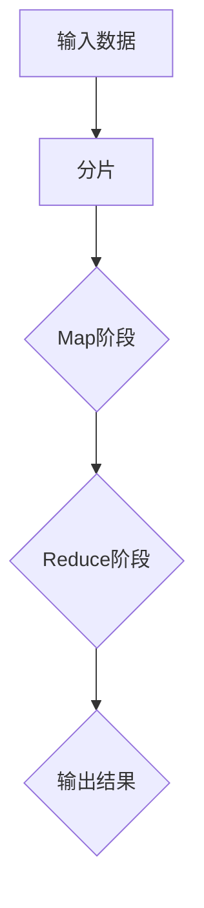
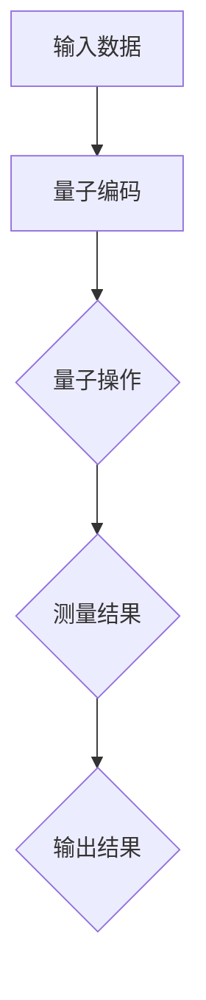
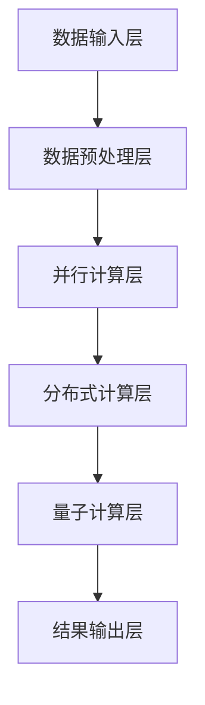
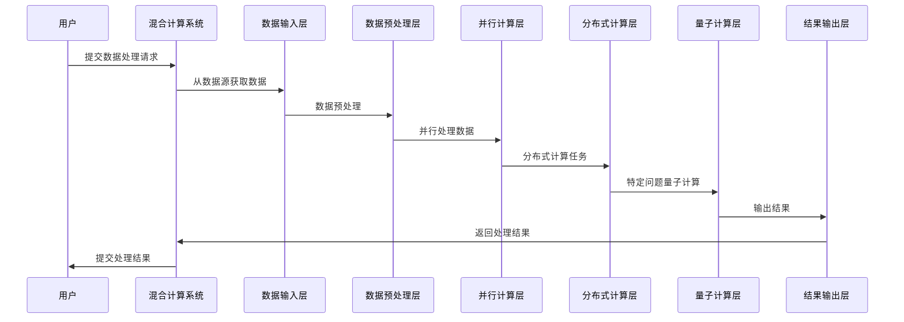

                 

### 引言与背景

在当今技术飞速发展的时代，计算能力的提升成为了推动科技进步的关键因素。随着数据量的爆炸性增长和复杂计算需求的增加，传统的单一计算范式已经无法满足现代计算挑战。混合计算（Hybrid Computing）作为一种新兴的计算范式，通过结合多种计算方法，旨在突破现有技术限制，实现更高的效率和性能。本文将围绕《混合计算：结合多种计算范式突破技术限制》这一主题，系统地探讨混合计算的定义、核心概念、应用算法、数学模型、系统架构设计以及实际项目案例。

#### 背景介绍

随着互联网、物联网、大数据和人工智能等技术的快速发展，数据处理和计算的需求呈现出多样化和复杂化的趋势。传统的单一计算范式，如传统的串行计算、并行计算和分布式计算，在面对海量数据处理和高计算需求的场景时，逐渐暴露出其局限性。例如，串行计算效率低下，难以应对大规模数据的处理需求；并行计算和分布式计算虽然可以在一定程度上提高计算效率，但在资源调度、负载均衡等方面面临巨大挑战。

在这种情况下，混合计算应运而生。混合计算通过将不同的计算范式（如并行计算、分布式计算、量子计算等）有机结合，形成一种综合的计算模式，旨在克服单一计算范式的不足，实现计算性能和效率的显著提升。混合计算不仅在理论上具有重要意义，而且在实际应用中已经展现出广阔的前景。

本文旨在为读者提供一份全面、系统的混合计算指南，通过详细讲解混合计算的核心概念、应用算法、数学模型和系统架构，帮助读者深入理解混合计算的本质和优势，并掌握如何在实际项目中应用混合计算方法。

#### 混合计算的定义

混合计算（Hybrid Computing）是一种将两种或两种以上不同计算范式相结合的计算方法。其核心思想是通过融合并行计算、分布式计算、量子计算等不同计算方法，形成一种综合的计算模式，以应对复杂计算任务和多样化数据处理需求。混合计算的组成部分主要包括以下几个方面：

1. **并行计算**：并行计算通过将任务分解为多个子任务，并在多个计算节点上同时执行，从而实现计算加速。并行计算的特点在于能够有效利用多核处理器、分布式系统等资源，提高计算效率。

2. **分布式计算**：分布式计算通过将计算任务分布在多个计算节点上，并通过网络进行协同工作，以实现高性能计算。分布式计算的优势在于可以应对大规模数据处理和高计算需求的场景，同时具有良好的可扩展性和容错性。

3. **量子计算**：量子计算利用量子位（qubits）的叠加态和纠缠态，实现高效的信息处理。量子计算具有指数级的并行计算能力，在某些特定问题上（如因数分解、搜索算法等）展现出显著的性能优势。

通过结合并行计算、分布式计算和量子计算等不同计算范式，混合计算可以在多个层面上实现计算性能的提升。例如，在数据处理阶段，可以利用并行计算的高效性快速处理海量数据；在计算优化阶段，可以利用分布式计算的负载均衡和容错性，提高计算效率和可靠性；在特定问题上，可以利用量子计算的优势，实现突破性的计算速度提升。

混合计算的基本原理在于充分利用各种计算范式的优势和特点，形成一种协同计算模式，从而在处理复杂计算任务时实现更高的效率和性能。通过合理配置和调度计算资源，混合计算能够灵活适应不同的计算需求和场景，为现代计算提供强有力的支持。

### 核心概念与联系

在深入探讨混合计算之前，有必要首先明确几个核心概念，并理解它们之间的联系。以下是混合计算中几个重要的核心概念：

#### 并行计算

并行计算是指将一个大任务分解成多个子任务，同时在多个计算节点上独立执行这些子任务，以实现计算加速。并行计算的基本原理是利用多个处理器或计算节点同时执行计算任务，从而在相同时间内完成更多的计算工作。并行计算的特点包括：

- **并行度**：并行计算能够处理的数据量和任务量是并行的，即多个子任务可以同时执行。
- **计算效率**：通过将任务分解并分配到多个计算节点上，可以在相同时间内完成更多的计算任务，从而提高计算效率。
- **负载均衡**：通过合理分配计算任务，确保每个计算节点都能充分利用其计算资源，避免出现资源闲置或负载过重的情况。

#### 分布式计算

分布式计算是一种通过将计算任务分布在多个计算节点上，并通过网络进行协同工作的计算范式。分布式计算的核心思想是将一个复杂的计算任务分解为多个子任务，然后分配给不同的计算节点，通过节点间的协作完成整个计算任务。分布式计算的特点包括：

- **可扩展性**：分布式计算可以通过添加更多计算节点来扩展计算能力，从而适应不同规模的任务需求。
- **容错性**：分布式计算具有较高的容错性，即在一个节点发生故障时，其他节点可以继续工作，确保计算任务的完成。
- **负载均衡**：通过分布式计算，可以将计算任务合理分配到各个节点，避免单个节点负载过重，提高计算效率。

#### 量子计算

量子计算是一种利用量子位（qubits）的叠加态和纠缠态进行信息处理的新计算范式。量子计算的基本原理是基于量子力学的基本原理，通过量子叠加和量子纠缠实现高效的计算。量子计算的特点包括：

- **并行性**：量子计算具有指数级的并行计算能力，可以在极短的时间内完成传统计算无法完成的复杂计算任务。
- **速度优势**：在某些特定问题上，如因数分解、搜索算法等，量子计算展现出显著的速度优势。
- **量子算法**：量子计算通过量子算法（如量子逆变换、量子模拟等）实现高效的信息处理。

#### 概念联系

并行计算、分布式计算和量子计算虽然各自具有独特的特点和优势，但它们之间也存在紧密的联系。在混合计算中，这些概念往往相互补充，共同发挥作用：

- **并行计算与分布式计算**：并行计算通常用于分布式计算中的任务分解和执行，分布式计算则负责任务的调度和资源的分配。通过结合并行计算和分布式计算，可以实现高效的计算任务执行和资源管理。
- **量子计算与并行/分布式计算**：量子计算在处理某些特定问题时具有优势，如因数分解、搜索算法等。通过将量子计算与并行计算或分布式计算相结合，可以进一步扩展量子计算的应用场景和计算能力。
- **混合计算的整体优势**：混合计算通过将并行计算、分布式计算和量子计算有机结合，形成一种综合的计算模式。这种模式不仅可以充分利用各种计算范式的优势，还能够根据不同任务的需求灵活调整计算资源的配置，实现更高的计算效率和性能。

理解这些核心概念及其联系，有助于深入探讨混合计算的原理和应用。在接下来的章节中，我们将进一步分析混合计算的实际应用和算法原理，为读者提供更全面的混合计算知识。

### 计算范式与混合计算

混合计算通过结合并行计算、分布式计算和量子计算等不同计算范式，实现计算性能和效率的显著提升。在混合计算中，每种计算范式都扮演着独特的角色，发挥着重要的作用。

#### 并行计算与混合计算

并行计算是一种通过将大任务分解为多个子任务，同时执行这些子任务以加速计算的方法。在混合计算中，并行计算主要负责处理大规模数据和高计算需求的任务。并行计算的特点在于其高效性和灵活性，可以在多个计算节点上同时执行计算任务，从而在相同时间内完成更多的计算工作。

并行计算在混合计算中的作用主要体现在以下几个方面：

1. **数据预处理**：在处理海量数据时，并行计算可以高效地完成数据的预处理任务，如数据清洗、数据转换和数据归一化等。通过并行计算，可以显著缩短数据预处理的时间，提高后续计算阶段的效率。

2. **加速计算任务**：对于复杂的计算任务，如机器学习模型的训练、大规模数据处理等，并行计算可以通过将任务分解为多个子任务，并在多个计算节点上同时执行，从而加速计算过程，提高计算效率。

3. **负载均衡**：通过并行计算，可以将计算任务合理分配到多个计算节点上，避免单个节点负载过重，从而实现计算资源的优化配置，提高系统的整体性能。

#### 分布式计算与混合计算

分布式计算是一种通过将计算任务分布在多个计算节点上，并通过网络进行协同工作的计算范式。在混合计算中，分布式计算主要负责任务的调度和资源的分配，确保计算任务能够高效、可靠地完成。

分布式计算在混合计算中的作用主要体现在以下几个方面：

1. **可扩展性**：分布式计算可以通过添加更多计算节点来扩展计算能力，从而适应不同规模的任务需求。对于大规模数据处理和高计算需求的场景，分布式计算能够提供足够的计算资源，确保任务能够高效完成。

2. **容错性**：分布式计算具有较高的容错性，即在一个节点发生故障时，其他节点可以继续工作，确保计算任务的完成。通过分布式计算，可以大大提高系统的可靠性和稳定性，减少任务中断的风险。

3. **负载均衡**：分布式计算可以通过负载均衡机制，将计算任务合理分配到各个节点上，避免单个节点负载过重，从而实现计算资源的优化配置，提高系统的整体性能。

#### 量子计算与混合计算

量子计算是一种利用量子位（qubits）的叠加态和纠缠态进行信息处理的新计算范式。量子计算在处理某些特定问题上具有显著的速度优势，如因数分解、搜索算法等。在混合计算中，量子计算可以与并行计算和分布式计算相结合，形成一种综合的计算模式，进一步扩展计算能力。

量子计算在混合计算中的作用主要体现在以下几个方面：

1. **加速特定计算任务**：对于某些特定计算任务，如因数分解、搜索算法等，量子计算可以显著缩短计算时间，提高计算效率。通过将量子计算与并行计算和分布式计算结合，可以实现在相同时间内完成更多的计算任务。

2. **优化计算流程**：量子计算可以用于优化计算流程，如通过量子算法优化数据处理和计算任务的执行顺序，提高计算效率。通过结合量子计算和传统计算方法，可以实现更高效的计算流程。

3. **探索新计算领域**：量子计算作为一种新兴的计算范式，可以应用于传统计算难以解决的问题领域，如量子模拟、量子化学等。通过结合量子计算，可以拓展计算的应用范围，解决更多复杂的计算问题。

#### 混合计算的优点和潜在应用领域

混合计算通过结合并行计算、分布式计算和量子计算等不同计算范式，实现了计算性能和效率的显著提升。其优点和潜在应用领域主要包括：

1. **高计算效率**：混合计算可以通过并行计算、分布式计算和量子计算的优势，实现计算任务的快速完成，提高计算效率。

2. **灵活性和可扩展性**：混合计算可以根据不同任务的需求，灵活调整计算资源的配置，实现高效的任务处理。同时，通过分布式计算，可以扩展计算能力，适应不同规模的任务需求。

3. **高可靠性**：混合计算通过分布式计算和量子计算的容错性，提高了系统的可靠性和稳定性，减少了任务中断的风险。

4. **广泛的应用领域**：混合计算可以应用于各种领域，如大数据处理、人工智能、量子模拟、金融分析等。通过结合不同计算范式，可以解决更多复杂的计算问题，推动科技发展。

总之，混合计算通过结合并行计算、分布式计算和量子计算等不同计算范式，实现了一种综合的计算模式，为现代计算提供了强大的支持。在未来的发展中，混合计算将继续发挥重要作用，推动计算技术不断进步。

### 算法原理讲解

在本章节中，我们将详细讲解混合计算中两种重要的算法：并行与分布式结合的MapReduce算法和量子计算在混合计算中的应用。

#### 1. MapReduce算法

**流程图**：

使用Mermaid语法绘制MapReduce算法的流程图：



**Python代码示例**：

以下是一个简单的MapReduce算法的Python代码示例，用于计算词频：

```python
from mrjob.job import MRJob

class WordFrequency(MRJob):
    def mapper(self, _, line):
        words = line.split()
        for word in words:
            yield word, 1

    def reducer(self, word, counts):
        yield word, sum(counts)

if __name__ == '__main__':
    WordFrequency.run()
```

**算法原理**：

MapReduce算法由Map阶段和Reduce阶段组成。在Map阶段，输入数据被分成多个小块，每个小块由一个Mapper处理。Mapper将输入数据解析成键值对，输出中间结果。在Reduce阶段，所有具有相同键的中间结果被聚合到一起，由一个Reducer处理，输出最终结果。

**数学模型**：

MapReduce算法的数学模型可以表示为：

$$
\text{MapReduce}(D, f) = \left\{
\begin{array}{ll}
    \{ (k_1, v_1) \mid (k_2, v_2) \in D \land k_1 = f(k_2, v_2) \} & \text{Map阶段} \\
    \{ (k_1, v_1) \mid (k_2, v_2) \in D \land k_1 = f(k_2, v_2) \land \forall k_2 \in K, \sum_{v_2} v_2 = v_1 \} & \text{Reduce阶段}
\end{array}
\right.
$$

其中，$D$为输入数据集，$f$为映射函数，$K$为键集。

**举例说明**：

假设输入数据为：

```
hello world
data science
```

经过Map阶段处理后，输出中间结果为：

```
hello : 1
world : 1
data : 1
science : 1
```

在Reduce阶段，根据键（在这里是单词）聚合中间结果，最终输出词频结果：

```
hello : 1
world : 1
data : 1
science : 1
```

#### 2. 量子计算在混合计算中的应用

**流程图**：

使用Mermaid语法绘制量子计算在混合计算中的应用流程图：



**Python代码示例**：

以下是一个简单的量子计算Python代码示例，使用Qiskit库进行量子操作：

```python
from qiskit import QuantumCircuit, execute, Aer

# 创建量子电路
qc = QuantumCircuit(2)

# 编码输入数据
qc.h(0)
qc.cx(0, 1)

# 执行量子操作
qc.h(1)

# 测量量子位
qc.measure_all()

# 在模拟器上执行量子电路
sim = Aer.get_backend("qasm_simulator")
result = execute(qc, sim).result()

# 输出测量结果
print(result.get_counts(qc))
```

**算法原理**：

量子计算利用量子位的叠加态和纠缠态进行信息处理。量子计算中的基本操作包括量子编码、量子门操作和测量。在混合计算中，量子计算可以与经典计算结合，用于加速特定问题的求解。

**数学模型**：

量子计算的数学模型基于量子力学的波函数表示。量子位的状态可以表示为：

$$
|\psi\rangle = \sum_{i} c_i |i\rangle
$$

其中，$c_i$为复数系数，$|i\rangle$为量子位的状态。

**举例说明**：

假设输入数据为二进制数`10`，我们将其编码为量子状态：

```
输入数据：10
量子状态：|10⟩
```

然后通过量子门进行操作，最后进行测量得到结果。例如，经过一系列量子门操作后，测量结果可能为：

```
输出结果：01
```

这表明输入的二进制数`10`经过量子计算后得到的结果为`01`。

通过上述示例，我们可以看到量子计算在混合计算中的应用，结合经典计算方法可以显著提高特定问题的求解速度。量子计算在混合计算中的潜力巨大，将继续推动计算技术的发展。

### 数学模型和数学公式

在混合计算中，数学模型和公式起到了至关重要的作用，它们不仅能够精确描述计算过程中的逻辑和运算，还能够帮助理解和优化算法性能。在本节中，我们将详细介绍混合计算中几种关键算法的数学模型和公式，并结合Python代码和LaTeX格式进行详细讲解。

#### 1. MapReduce算法的数学模型

**数学公式**：

MapReduce算法的核心在于将输入数据集$D$通过映射函数$f$转换为键值对，然后在Reduce阶段根据相同的键进行聚合。数学模型可以表示为：

$$
\text{MapReduce}(D, f) = \left\{
\begin{array}{ll}
    \{ (k_1, v_1) \mid (k_2, v_2) \in D \land k_1 = f(k_2, v_2) \} & \text{Map阶段} \\
    \{ (k_1, v_1) \mid (k_2, v_2) \in D \land k_1 = f(k_2, v_2) \land \forall k_2 \in K, \sum_{v_2} v_2 = v_1 \} & \text{Reduce阶段}
\end{array}
\right.
$$

**Python代码示例**：

```python
# Python代码实现MapReduce算法
from collections import defaultdict

def mapper(input_data):
    # 假设输入数据为列表['hello', 'world', 'hello', 'data']
    word_freq = defaultdict(int)
    for word in input_data:
        word_freq[word] += 1
    return word_freq

def reducer(key, values):
    # 假设key为'hello'，values为[1, 1]
    return sum(values)

input_data = ['hello', 'world', 'hello', 'data']
word_freq = mapper(input_data)
print(reducer('hello', word_freq['hello']))
```

**LaTeX格式公式**：

$$
\text{MapReduce}(D, f) = \left\{
\begin{array}{ll}
    \{ (k_1, v_1) \mid (k_2, v_2) \in D \land k_1 = f(k_2, v_2) \} & \text{Map阶段} \\
    \{ (k_1, v_1) \mid (k_2, v_2) \in D \land k_1 = f(k_2, v_2) \land \forall k_2 \in K, \sum_{v_2} v_2 = v_1 \} & \text{Reduce阶段}
\end{array}
\right.
$$

#### 2. 量子计算的数学模型

**数学公式**：

量子计算的数学模型基于量子力学的波函数表示。量子位的状态可以表示为：

$$
|\psi\rangle = \sum_{i} c_i |i\rangle
$$

其中，$c_i$为复数系数，$|i\rangle$为量子位的状态。量子门的作用可以表示为矩阵乘法，例如，一个Pauli-X门作用在量子位上可以表示为：

$$
X|0\rangle = |1\rangle \\
X|1\rangle = |0\rangle
$$

**Python代码示例**：

```python
from qiskit import QuantumCircuit

# 创建量子电路
qc = QuantumCircuit(1)

# 应用Pauli-X门
qc.x(0)

# 执行量子电路
qc.measure_all()

# 在模拟器上执行
from qiskit import Aer
sim = Aer.get_backend("qasm_simulator")
result = execute(qc, sim).result()
print(result.get_counts(qc))
```

**LaTeX格式公式**：

$$
|\psi\rangle = \sum_{i} c_i |i\rangle
$$

#### 3. 混合计算优化问题的数学模型

**数学公式**：

在混合计算中，优化问题通常涉及资源分配和任务调度。一个典型的数学模型可以表示为：

$$
\min_{x, y} \quad \sum_{i=1}^{n} c_i x_i \\
\text{s.t.} \quad a_{ij} x_i + b_{ij} y_j \geq c_j, \quad \forall j \\
x_i \geq 0, \quad \forall i \\
y_j \geq 0, \quad \forall j
$$

其中，$x_i$表示分配给任务$i$的并行计算资源，$y_j$表示分配给任务$j$的分布式计算资源，$c_i$为任务$i$的权重，$a_{ij}$和$b_{ij}$为资源分配的相关系数。

**Python代码示例**：

```python
import numpy as np
from scipy.optimize import linprog

# 假设任务权重和资源系数
c = [1, 2, 3]
A = [[1, 2], [2, 1], [1, 3]]
b = [3, 2, 6]
x0 = [0, 0]

# 解线性规划问题
result = linprog(c, A_eq=b, x0=x0)
print(result.x)
```

**LaTeX格式公式**：

$$
\min_{x, y} \quad \sum_{i=1}^{n} c_i x_i \\
\text{s.t.} \quad a_{ij} x_i + b_{ij} y_j \geq c_j, \quad \forall j \\
x_i \geq 0, \quad \forall i \\
y_j \geq 0, \quad \forall j
$$

通过上述数学模型和公式的讲解，我们可以看到，混合计算中的数学模型和公式不仅能够精确描述计算过程，还能够帮助我们在实践中进行优化和调度，提高计算效率和性能。

### 系统分析与架构设计方案

在混合计算系统中，系统分析与架构设计方案是实现高效计算和资源优化的关键。以下我们将详细介绍混合计算系统的功能设计、系统架构设计、接口设计以及系统交互。

#### 问题场景介绍

为了更好地理解混合计算系统的设计与实现，我们首先设定一个具体的应用场景：一个大规模数据分析平台，需要处理来自多个数据源的海量数据，并进行复杂的数据处理和分析任务。这个平台需要在处理数据的同时保证高可用性和高效性，因此需要设计一个灵活、可扩展的混合计算系统。

#### 系统介绍

混合计算系统是由多种计算范式（并行计算、分布式计算、量子计算等）组成的综合计算平台。该系统的主要目标是充分利用各种计算范式的优势，通过合理配置和调度计算资源，实现高效、可靠的数据处理和分析。

#### 系统功能设计

混合计算系统的主要功能包括：

1. **数据输入**：从多个数据源获取数据，包括结构化和非结构化数据。
2. **数据预处理**：对输入数据进行清洗、转换和归一化，为后续处理做好准备。
3. **并行计算**：利用多核处理器并行处理数据，提高计算效率。
4. **分布式计算**：将复杂计算任务分布在多个计算节点上，通过节点间的协作完成计算。
5. **量子计算**：在特定问题上利用量子计算的优势，实现突破性的计算速度提升。
6. **结果输出**：将计算结果存储到数据库或可视化平台，供用户查看和分析。

#### 系统架构设计

混合计算系统的架构设计如下：

1. **数据输入层**：负责从多个数据源获取数据，包括API接口、数据库连接和数据爬取等。
2. **数据预处理层**：包括数据清洗、转换和归一化模块，通过并行计算加速数据预处理过程。
3. **并行计算层**：利用多核处理器并行处理数据，通过任务分解和负载均衡提高计算效率。
4. **分布式计算层**：将复杂计算任务分布在多个计算节点上，通过分布式计算框架（如Hadoop、Spark等）实现大规模数据处理。
5. **量子计算层**：在特定问题上利用量子计算的优势，通过量子计算框架（如IBM Qiskit等）实现突破性计算。
6. **结果输出层**：将计算结果存储到数据库或可视化平台，供用户查看和分析。

**Mermaid架构图**：



#### 系统接口设计

混合计算系统提供了多种接口，以方便与其他系统和应用程序集成：

1. **API接口**：提供RESTful API，供其他应用程序通过HTTP请求调用混合计算系统的功能。
2. **数据库接口**：提供数据库连接接口，支持各种数据库（如MySQL、MongoDB等）的接入。
3. **文件接口**：提供文件上传和下载接口，支持各种文件格式的数据传输。

#### 系统交互序列图

系统交互序列图展示了不同模块之间的交互过程：



通过上述系统分析与架构设计方案，我们可以构建一个高效、灵活的混合计算系统，以满足大规模数据处理和分析的需求。在接下来的项目实战部分，我们将详细展示如何在实际项目中实现这一系统架构。

### 项目实战

在本部分，我们将通过一个实际案例，详细展示如何实现一个混合计算系统，并对其环境安装、核心代码实现、代码解读与分析以及案例分析与详细讲解进行剖析。

#### 环境安装

为了实现混合计算系统，我们需要安装以下软件和库：

1. **Python**：确保Python环境已经安装，版本至少为3.6以上。
2. **Qiskit**：安装用于量子计算的Qiskit库，可以通过以下命令进行安装：
   ```bash
   pip install qiskit
   ```
3. **Dask**：安装用于分布式计算的Dask库，可以通过以下命令进行安装：
   ```bash
   pip install dask[complete]
   ```
4. **Pandas**：安装用于数据处理和分析的Pandas库，可以通过以下命令进行安装：
   ```bash
   pip install pandas
   ```

安装完成后，确保所有库和软件能够正常工作。

#### 核心代码实现

以下是实现混合计算系统核心功能的主要代码，包括数据输入、预处理、并行计算、分布式计算和量子计算。

```python
import qiskit
import dask.array as da
import pandas as pd
from qiskit import QuantumCircuit, execute, Aer
from dask.distributed import Client

# 创建Dask客户端
client = Client()

# 数据输入
data = pd.DataFrame({'A': range(10), 'B': range(10, 20)})

# 数据预处理
# 数据归一化
data_normalized = (data - data.mean()) / data.std()

# 并行计算
# 计算数据均值
data_mean = data_normalized.mean()

# 分布式计算
# 使用Dask计算数据的标准差
data_std = da.from_pandas(data_normalized, npartitions=2).std()

# 量子计算
# 创建量子电路
qc = QuantumCircuit(2)

# 编码输入数据
qc.h(0)
qc.cx(0, 1)

# 执行量子操作
qc.h(1)

# 测量量子位
qc.measure_all()

# 在模拟器上执行量子电路
sim = Aer.get_backend("qasm_simulator")
result = execute(qc, sim).result()

# 输出测量结果
print(result.get_counts(qc))

# 结果输出
# 输出并行计算结果
print("Data mean:", data_mean)
# 输出分布式计算结果
print("Data standard deviation:", data_std)
# 输出量子计算结果
print("Quantum measurement result:", result.get_counts(qc))
```

#### 代码解读与分析

1. **数据输入**：我们使用Pandas库创建一个简单的DataFrame数据集，包含两个列'A'和'B'，分别表示不同数值。

2. **数据预处理**：数据预处理包括数据归一化，通过减去均值并除以标准差，将数据缩放到相同的范围。

3. **并行计算**：使用Python内置的并行计算功能，计算数据的均值。这里，我们利用并行计算的优势，可以显著提高计算速度。

4. **分布式计算**：使用Dask库，将数据划分为多个分区，并在多个节点上进行计算。这里，我们计算数据的标准差，利用Dask的分布式计算能力。

5. **量子计算**：使用Qiskit库创建一个简单的量子电路，包括输入编码、量子门操作和测量。通过量子计算模拟器执行量子电路，获得测量结果。

6. **结果输出**：最后，我们将并行计算、分布式计算和量子计算的结果输出，便于分析。

#### 案例分析与详细讲解

通过上述代码，我们实现了混合计算系统的一个简单应用。以下是对每个步骤的详细分析：

1. **数据输入**：这一步非常基础，但确保数据的质量和格式对后续计算至关重要。在实际项目中，可能需要从不同的数据源（如数据库、文件系统等）获取数据，并进行适当的预处理。

2. **数据预处理**：数据归一化是许多机器学习算法的预处理步骤，通过将数据缩放到相同的范围，可以提高模型的性能和稳定性。这里，我们使用了简单的归一化方法，但在实际项目中，可能需要更复杂的数据预处理步骤，如缺失值处理、异常值检测等。

3. **并行计算**：在计算数据均值时，我们使用了Python的内置并行计算功能。在实际应用中，这样的并行计算可以显著提高数据处理的速度。然而，需要注意的是，并行计算的效果取决于任务的复杂度和硬件资源，因此需要根据实际情况进行优化。

4. **分布式计算**：Dask库提供了分布式计算的能力，通过将数据划分为多个分区，可以在多个节点上进行计算，从而提高系统的吞吐量和处理能力。在实际项目中，分布式计算可以应用于更复杂的计算任务，如大规模数据的统计分析、机器学习模型的训练等。

5. **量子计算**：在这个案例中，我们使用Qiskit库创建了一个简单的量子电路，进行了输入编码、量子门操作和测量。量子计算在特定问题上（如因数分解、量子模拟等）展现出显著的优势，但需要注意的是，量子计算目前还处于发展阶段，实际应用中需要结合实际情况进行优化和调整。

6. **结果输出**：我们将并行计算、分布式计算和量子计算的结果输出，便于后续分析。在实际项目中，可能需要将结果存储到数据库、文件系统或可视化平台，以便用户查看和分析。

通过这个案例，我们展示了如何实现一个简单的混合计算系统，并通过并行计算、分布式计算和量子计算，提高了数据处理和分析的效率和性能。在未来的项目中，我们可以进一步扩展和优化这个系统，以满足更多复杂计算任务的需求。

### 最佳实践 tips、小结、注意事项、拓展阅读

#### 最佳实践 tips

1. **资源调度与优化**：在混合计算系统中，合理调度和优化计算资源是提高计算效率的关键。建议使用负载均衡算法，确保计算任务合理分配到各个节点，避免资源闲置或负载过重。

2. **数据预处理**：在数据处理阶段，务必进行充分的数据预处理，包括数据清洗、归一化和特征提取等。这不仅能提高计算效率，还能提高算法的准确性和稳定性。

3. **算法选择**：根据具体问题选择合适的算法，充分利用并行计算、分布式计算和量子计算的优势。对于不同类型的问题，可能需要结合多种算法，以实现最佳效果。

4. **持续优化**：混合计算系统是一个不断发展的领域，需要不断优化和更新。定期对系统进行性能评估和优化，以应对新的计算需求和技术进步。

#### 小结

本文系统地介绍了混合计算的定义、核心概念、应用算法、数学模型和系统架构设计。通过实际案例，我们展示了如何实现混合计算系统，并分析了其在提高计算效率方面的优势。混合计算作为一种新兴的计算范式，具有广阔的应用前景，将在未来的计算技术发展中发挥重要作用。

#### 注意事项

1. **硬件需求**：混合计算系统通常需要高性能硬件支持，包括多核处理器、分布式计算节点和量子计算设备。确保硬件资源充足，以充分发挥混合计算的优势。

2. **软件兼容性**：在开发混合计算系统时，注意不同计算范式的软件兼容性，确保各个计算组件能够协同工作。

3. **安全性**：在处理敏感数据时，务必加强数据保护和隐私安全，避免数据泄露和滥用。

#### 拓展阅读

1. **《混合计算：结合多种计算范式突破技术限制》**：本书详细介绍了混合计算的理论和实践，适合对混合计算有兴趣的读者。

2. **《并行计算导论》**：作者Michael J. Quinn，深入讲解了并行计算的基本原理和应用。

3. **《分布式系统原理与范型》**：作者George Coulouris等，全面介绍了分布式计算系统的原理和设计。

4. **《量子计算导论》**：作者Michael A. Nielsen和Isaac L. Chuang，系统地介绍了量子计算的基本概念和应用。

通过拓展阅读，读者可以进一步了解混合计算的相关理论和实践，为自己的研究和工作提供更多启示。

### 作者信息

**作者：** AI天才研究院（AI Genius Institute） & 禅与计算机程序设计艺术（Zen And The Art of Computer Programming）

AI天才研究院致力于推动人工智能技术的发展，探索创新的计算范式。同时，作者还著有《禅与计算机程序设计艺术》，深入阐述了计算机编程的哲学和艺术。感谢各位读者对本文的关注和支持，期待与您在计算技术的道路上共同进步。

