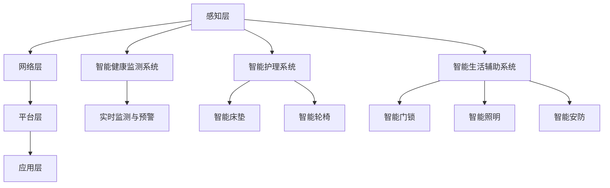
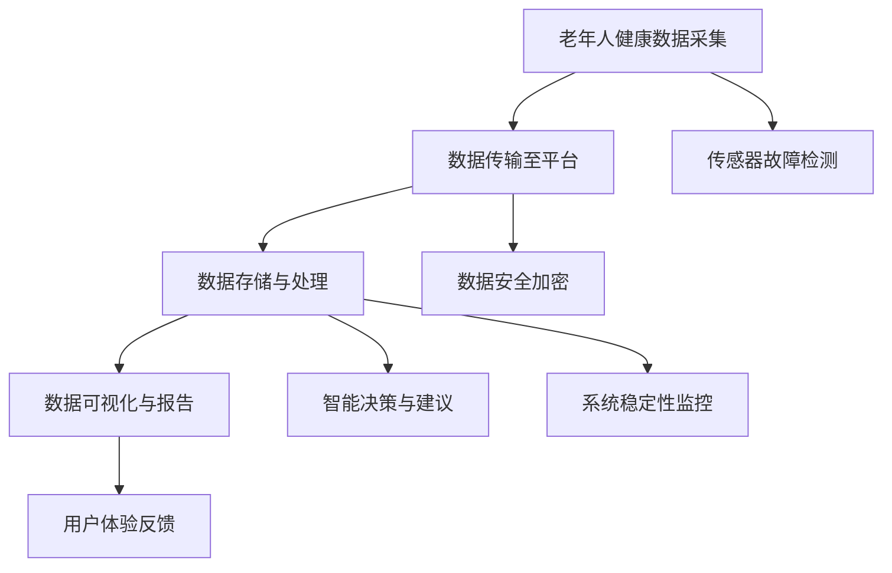

                 

## # 物联网在智慧养老中的综合应用

### 关键词：物联网，智慧养老，实时监测，智能护理，个性化服务

> **摘要**：本文深入探讨了物联网在智慧养老中的应用，分析了物联网的基本原理和关键技术，以及物联网在智慧养老中的具体应用案例，如智能健康监测、智能护理和生活辅助系统。文章还探讨了物联网在智慧养老中面临的挑战和机遇，提供了实际应用案例分析，为推动智慧养老的发展提供了有益的参考。

## 第1章 物联网在智慧养老中的背景介绍

### 1.1.1 问题背景

随着全球人口老龄化问题的加剧，如何提高养老服务的质量和效率已成为各国政府和社会关注的重要议题。传统养老服务模式中，存在服务效率低、成本高、资源浪费等问题，难以满足老年人多样化的需求。因此，物联网技术在智慧养老中的应用成为解决这一问题的有效途径。

### 1.1.2 问题描述

智慧养老是指通过物联网技术，将各类传感器、智能设备和云计算平台相结合，构建一个智能化、便捷化的养老服务体系。智慧养老的核心在于实现对老年人的实时监测、智能护理和个性化服务，以提高养老服务的质量和效率。

### 1.1.3 问题解决

物联网技术在智慧养老中的应用可以解决传统养老服务模式中存在的问题。具体表现在以下几个方面：

1. **实时监测与预警**：通过传感器实时采集老年人的生理、心理和行为数据，实现对老年人的健康状况实时监测和预警，及时发现潜在的健康问题。
2. **智能护理与救助**：利用物联网技术实现智能护理，如智能床垫、智能轮椅等设备，提高护理效率。同时，在紧急情况下，可以通过物联网设备实现快速救助。
3. **个性化服务**：通过大数据分析，了解老年人的个性化需求，提供个性化的养老服务，提高老年人的生活质量。

### 1.1.4 边界与外延

物联网在智慧养老中的应用边界包括但不限于以下几个方面：

1. **物理边界**：物理设备如传感器、智能终端等。
2. **数据边界**：涉及老年人健康数据的采集、存储、分析和共享。
3. **服务边界**：智慧养老服务的内容和范围，如健康监测、生活照料、娱乐休闲等。

### 1.1.5 概念结构与核心要素组成

智慧养老的概念结构主要包括以下几个方面：

1. **感知层**：传感器、智能设备等。
2. **网络层**：物联网通信技术，如Wi-Fi、蓝牙、ZigBee等。
3. **平台层**：云计算、大数据等技术，实现数据的存储、分析和处理。
4. **应用层**：智慧养老服务的具体应用，如健康监测、智能护理、生活娱乐等。

## 第2章 物联网技术基础

### 2.1.1 物联网的基本原理

物联网（Internet of Things，IoT）是指通过信息传感设备（如传感器、RFID等）和通信网络（如互联网、无线网络等）将各种物体连接起来，实现信息交换和通信。物联网的基本原理可以概括为感知、传输和处理三个环节。

1. **感知**：通过传感器和RFID等设备，实时采集物体和环境的信息。
2. **传输**：通过互联网、无线网络等通信技术，将传感器和RFID等设备采集到的信息传输到数据处理中心。
3. **处理**：在数据处理中心，通过对传输过来的信息进行存储、分析和处理，实现对物体的智能管理和控制。

### 2.1.2 物联网的关键技术

物联网的关键技术包括：

1. **传感器技术**：用于感知环境和物体的各种信息。
2. **通信技术**：实现物联网设备之间的数据传输。
3. **数据处理技术**：对物联网设备采集的数据进行存储、分析和处理。
4. **安全技术**：确保物联网系统的安全可靠。

### 2.1.3 物联网的发展历程

物联网的发展历程可以分为以下几个阶段：

1. **初步阶段**（1990年代初至2000年代初）：以RFID技术和传感器网络为代表，开始实现对物体和环境的初步感知。
2. **成长阶段**（2000年代初至2010年代初）：随着互联网和移动通信技术的发展，物联网开始进入实际应用阶段。
3. **成熟阶段**（2010年代初至今）：物联网技术逐渐成熟，应用范围不断扩大，如智能家居、智慧城市、智慧养老等。

## 第3章 智慧养老中的物联网应用

### 3.1.1 智能健康监测系统

智能健康监测系统利用物联网技术，实现对老年人健康数据的实时监测和分析，包括心率、血压、血糖等生理指标。通过数据分析，可以及时发现老年人的健康问题，提供个性化健康建议。

### 3.1.2 智能护理系统

智能护理系统通过物联网技术，实现对老年人的智能护理。包括智能床垫、智能轮椅、智能护理机器人等设备，提高护理效率，减轻护理人员的负担。

### 3.1.3 智能生活辅助系统

智能生活辅助系统通过物联网技术，为老年人提供便捷的生活服务。如智能门锁、智能照明、智能安防等，提高老年人的生活质量。

## 第4章 物联网在智慧养老中的挑战与机遇

### 4.1.1 挑战

物联网在智慧养老中面临的挑战包括：

1. **数据安全与隐私保护**：老年人的健康数据涉及隐私问题，需要确保数据的安全和隐私。
2. **系统稳定性与可靠性**：物联网系统需要保证长时间运行，不易受外界环境影响。
3. **成本与经济效益**：物联网技术在智慧养老中的应用需要较高的成本投入，需要实现经济效益。

### 4.1.2 机遇

物联网在智慧养老中面临的机遇包括：

1. **技术发展**：物联网技术不断进步，为智慧养老提供了更多的应用场景和可能性。
2. **政策支持**：各国政府对智慧养老的支持力度加大，为物联网在智慧养老中的应用提供了政策保障。
3. **市场需求**：随着人口老龄化的加剧，对智慧养老的需求不断增加，为物联网在智慧养老中的应用提供了广阔的市场空间。

## 第5章 物联网在智慧养老中的应用案例分析

### 5.1.1 案例背景

以某智慧养老社区为例，介绍物联网在智慧养老中的应用情况。

### 5.1.2 案例分析

通过对该智慧养老社区物联网应用的深入分析，可以了解物联网在智慧养老中的具体实施和应用效果。

### 5.1.3 案例效果

该智慧养老社区通过物联网技术的应用，实现了老年人健康状况的实时监测、智能护理和生活服务的便捷化，显著提高了养老服务的质量和效率。

## 总结

物联网技术在智慧养老中的应用具有巨大的潜力和价值。通过物联网技术，可以实现养老服务的智能化、便捷化和个性化，为老年人提供更高质量的生活服务。同时，物联网技术在智慧养老中的应用也面临着一系列挑战，如数据安全、系统稳定性和成本控制等。因此，在推动物联网技术在智慧养老中的应用过程中，需要充分考虑这些挑战，积极探索解决方案，以确保物联网技术在智慧养老中的有效应用。

## 拓展阅读

1. **《物联网技术应用与产业发展》**：详细介绍了物联网技术的基本原理和应用领域，对物联网产业的发展趋势进行了深入分析。
2. **《智慧养老理论与实践》**：探讨了智慧养老的概念、发展现状和未来趋势，对智慧养老技术进行了详细介绍。
3. **《大数据与物联网融合应用》**：分析了大数据和物联网技术的融合应用，探讨了如何通过大数据分析提高物联网系统的智能化水平。

## 注意事项

1. **数据安全**：在应用物联网技术进行智慧养老时，需要高度重视数据安全和隐私保护，采取有效的安全措施，确保老年人数据的安全。
2. **系统稳定性**：物联网系统需要保证长时间的稳定运行，不易受外界环境影响，需要选用可靠的技术和设备，确保系统的稳定性。
3. **成本控制**：物联网技术在智慧养老中的应用需要较高的成本投入，需要合理规划和控制成本，确保经济效益。

## 最佳实践 Tips

1. **个性化服务**：通过大数据分析，了解老年人的个性化需求，提供针对性的服务，提高老年人的满意度。
2. **系统集成**：在智慧养老社区中，需要将不同类型的物联网设备和服务进行集成，实现系统的无缝连接和协同工作。
3. **持续更新**：随着技术的不断进步，需要不断更新和升级物联网系统，以适应不断变化的需求和挑战。

作者：AI天才研究院/AI Genius Institute & 禅与计算机程序设计艺术 /Zen And The Art of Computer Programming

## 第1章 物联网在智慧养老中的背景介绍

### 1.1.1 问题背景

随着全球人口老龄化问题的加剧，如何提高养老服务的质量和效率已成为各国政府和社会关注的重要议题。传统养老服务模式中，存在服务效率低、成本高、资源浪费等问题，难以满足老年人多样化的需求。因此，物联网技术在智慧养老中的应用成为解决这一问题的有效途径。

#### **核心概念术语说明**

- **物联网（IoT）**：物联网是指通过信息传感设备（如传感器、RFID等）和通信网络（如互联网、无线网络等）将各种物体连接起来，实现信息交换和通信的系统。
- **智慧养老**：智慧养老是指通过物联网技术，将各类传感器、智能设备和云计算平台相结合，构建一个智能化、便捷化的养老服务体系。
- **老年人**：本文所指的老年人是指年龄在60岁及以上的群体。

#### **问题背景**

- **老龄化问题**：随着医疗水平的提高和生活条件的改善，全球人口老龄化问题日益严重。据联合国的预测，到2050年，全球60岁及以上人口将达到22亿，占总人口的22%。
- **传统养老服务问题**：传统养老服务模式主要依靠人工，存在服务效率低、成本高、资源浪费等问题，难以满足老年人多样化的需求。

#### **问题描述**

智慧养老是指通过物联网技术，将各类传感器、智能设备和云计算平台相结合，构建一个智能化、便捷化的养老服务体系。智慧养老的核心在于实现对老年人的实时监测、智能护理和个性化服务，以提高养老服务的质量和效率。

- **实时监测**：通过传感器实时采集老年人的生理、心理和行为数据，实现对老年人的健康状况实时监测和预警。
- **智能护理**：利用物联网技术实现智能护理，如智能床垫、智能轮椅等设备，提高护理效率。
- **个性化服务**：通过大数据分析，了解老年人的个性化需求，提供个性化的养老服务，提高老年人的生活质量。

### 1.1.2 问题描述

智慧养老是指通过物联网技术，将各类传感器、智能设备和云计算平台相结合，构建一个智能化、便捷化的养老服务体系。智慧养老的核心在于实现对老年人的实时监测、智能护理和个性化服务，以提高养老服务的质量和效率。

#### **核心概念原理**

- **物联网技术**：物联网技术是智慧养老的基础，它通过传感器和智能设备实现数据的实时采集和传输，通过云计算平台实现数据的存储、分析和处理。
- **实时监测**：通过传感器实时采集老年人的生理、心理和行为数据，实现对老年人的健康状况实时监测和预警。
- **智能护理**：利用物联网技术实现智能护理，如智能床垫、智能轮椅等设备，提高护理效率。
- **个性化服务**：通过大数据分析，了解老年人的个性化需求，提供个性化的养老服务，提高老年人的生活质量。

### 1.1.3 问题解决

物联网技术在智慧养老中的应用可以解决传统养老服务模式中存在的问题。具体表现在以下几个方面：

1. **实时监测与预警**：通过传感器实时采集老年人的生理、心理和行为数据，实现对老年人的健康状况实时监测和预警，及时发现潜在的健康问题。
2. **智能护理与救助**：利用物联网技术实现智能护理，如智能床垫、智能轮椅等设备，提高护理效率。同时，在紧急情况下，可以通过物联网设备实现快速救助。
3. **个性化服务**：通过大数据分析，了解老年人的个性化需求，提供个性化的养老服务，提高老年人的生活质量。

### 1.1.4 边界与外延

物联网在智慧养老中的应用边界包括但不限于以下几个方面：

1. **物理边界**：物理设备如传感器、智能终端等。
2. **数据边界**：涉及老年人健康数据的采集、存储、分析和共享。
3. **服务边界**：智慧养老服务的内容和范围，如健康监测、生活照料、娱乐休闲等。

### 1.1.5 概念结构与核心要素组成

智慧养老的概念结构主要包括以下几个方面：

1. **感知层**：传感器、智能设备等。
2. **网络层**：物联网通信技术，如Wi-Fi、蓝牙、ZigBee等。
3. **平台层**：云计算、大数据等技术，实现数据的存储、分析和处理。
4. **应用层**：智慧养老服务的具体应用，如健康监测、智能护理、生活娱乐等。

### 1.1.6 物联网在智慧养老中的应用

物联网在智慧养老中的应用主要包括以下几个方面：

1. **智能健康监测系统**：通过传感器实时采集老年人的生理、心理和行为数据，实现对老年人的健康状况实时监测和预警。
2. **智能护理系统**：利用物联网技术实现智能护理，如智能床垫、智能轮椅等设备，提高护理效率。
3. **智能生活辅助系统**：通过物联网技术为老年人提供便捷的生活服务，如智能门锁、智能照明、智能安防等。

### 1.1.7 物联网在智慧养老中的优势

物联网在智慧养老中的优势主要体现在以下几个方面：

1. **实时性**：通过传感器实时采集老年人的健康数据，实现实时监测和预警，提高养老服务的及时性和准确性。
2. **智能化**：通过大数据分析和人工智能技术，实现个性化服务，提高养老服务的质量和效率。
3. **便捷性**：通过物联网技术，实现养老服务的智能化和便捷化，降低老年人的依赖性，提高生活质量。

### 1.1.8 物联网在智慧养老中的挑战

物联网在智慧养老中面临的挑战主要包括以下几个方面：

1. **数据安全与隐私保护**：老年人的健康数据涉及隐私问题，需要确保数据的安全和隐私。
2. **系统稳定性与可靠性**：物联网系统需要保证长时间运行，不易受外界环境影响。
3. **成本与经济效益**：物联网技术在智慧养老中的应用需要较高的成本投入，需要实现经济效益。

### 1.1.9 物联网在智慧养老中的发展趋势

物联网在智慧养老中的应用具有广阔的发展前景，未来的发展趋势主要包括以下几个方面：

1. **技术进步**：随着物联网技术的不断进步，将会有更多的创新应用出现在智慧养老领域。
2. **政策支持**：各国政府将加大对智慧养老的政策支持，为物联网技术在智慧养老中的应用提供更好的政策环境。
3. **市场扩张**：随着人口老龄化的加剧，对智慧养老的需求将不断增长，为物联网技术在智慧养老中的应用提供广阔的市场空间。

## 第2章 物联网技术基础

### 2.1.1 物联网的基本原理

物联网（Internet of Things，IoT）是指通过信息传感设备（如传感器、RFID等）和通信网络（如互联网、无线网络等）将各种物体连接起来，实现信息交换和通信的系统。物联网的基本原理可以概括为感知、传输和处理三个环节。

1. **感知**：物联网通过传感器和RFID等设备，实时采集物体和环境的信息。
2. **传输**：通过互联网、无线网络等通信技术，将传感器和RFID等设备采集到的信息传输到数据处理中心。
3. **处理**：在数据处理中心，通过对传输过来的信息进行存储、分析和处理，实现对物体的智能管理和控制。

### 2.1.2 物联网的关键技术

物联网的关键技术包括：

1. **传感器技术**：用于感知环境和物体的各种信息。传感器技术是物联网的基础，包括温度传感器、湿度传感器、光照传感器、压力传感器等。
2. **通信技术**：实现物联网设备之间的数据传输。通信技术包括Wi-Fi、蓝牙、ZigBee、LoRa等无线通信技术，以及有线通信技术如以太网等。
3. **数据处理技术**：对物联网设备采集的数据进行存储、分析和处理。数据处理技术包括云计算、大数据分析、人工智能等。
4. **安全技术**：确保物联网系统的安全可靠。安全技术包括数据加密、身份认证、访问控制等。

### 2.1.3 物联网的发展历程

物联网的发展历程可以分为以下几个阶段：

1. **初步阶段**（1990年代初至2000年代初）：以RFID技术和传感器网络为代表，开始实现对物体和环境的初步感知。
2. **成长阶段**（2000年代初至2010年代初）：随着互联网和移动通信技术的发展，物联网开始进入实际应用阶段。
3. **成熟阶段**（2010年代初至今）：物联网技术逐渐成熟，应用范围不断扩大，如智能家居、智慧城市、智慧养老等。

### 2.1.4 物联网的技术架构

物联网的技术架构可以分为以下几个层次：

1. **感知层**：由各种传感器和RFID设备组成，负责感知环境和物体的信息。
2. **传输层**：由各种通信网络组成，负责将感知层采集到的信息传输到数据处理中心。
3. **平台层**：由云计算、大数据分析、人工智能等技术组成，负责对传输层传输过来的信息进行存储、分析和处理。
4. **应用层**：由各种物联网应用组成，如智能家居、智慧城市、智慧养老等，负责将处理后的信息应用到实际生活中。

### 2.1.5 物联网在智慧养老中的应用

物联网在智慧养老中的应用主要包括以下几个方面：

1. **智能健康监测**：通过传感器实时采集老年人的生理、心理和行为数据，实现对老年人的健康状况实时监测和预警。
2. **智能护理**：利用物联网技术实现智能护理，如智能床垫、智能轮椅等设备，提高护理效率。
3. **智能生活辅助**：通过物联网技术为老年人提供便捷的生活服务，如智能门锁、智能照明、智能安防等。

### 2.1.6 物联网在智慧养老中的优势

物联网在智慧养老中的优势主要包括以下几个方面：

1. **实时性**：通过传感器实时采集老年人的健康数据，实现实时监测和预警，提高养老服务的及时性和准确性。
2. **智能化**：通过大数据分析和人工智能技术，实现个性化服务，提高养老服务的质量和效率。
3. **便捷性**：通过物联网技术，实现养老服务的智能化和便捷化，降低老年人的依赖性，提高生活质量。

### 2.1.7 物联网在智慧养老中的挑战

物联网在智慧养老中面临的挑战主要包括以下几个方面：

1. **数据安全与隐私保护**：老年人的健康数据涉及隐私问题，需要确保数据的安全和隐私。
2. **系统稳定性与可靠性**：物联网系统需要保证长时间运行，不易受外界环境影响。
3. **成本与经济效益**：物联网技术在智慧养老中的应用需要较高的成本投入，需要实现经济效益。

## 第3章 智慧养老中的物联网应用

### 3.1.1 智能健康监测系统

智能健康监测系统是智慧养老中的核心应用之一，它通过物联网技术，实现对老年人的健康状况进行实时监测和分析。以下是智能健康监测系统的具体应用：

1. **生理指标监测**：智能健康监测系统可以通过传感器实时采集老年人的心率、血压、血糖等生理指标数据。通过这些数据，可以了解老年人的健康状况，及时发现潜在的健康问题。

2. **行为数据监测**：智能健康监测系统还可以监测老年人的日常行为数据，如步数、睡眠质量、活动范围等。这些数据有助于了解老年人的生活习惯和健康状况，为个性化服务提供依据。

3. **预警与提醒**：当监测到异常数据时，智能健康监测系统可以及时发出预警，提醒老年人及其家属和护理人员。这样可以避免健康问题的恶化，提高养老服务的及时性和准确性。

4. **健康数据分析**：通过对采集到的健康数据进行分析，可以了解老年人的健康趋势，预测未来可能出现的问题。这样可以提前采取措施，预防健康问题的发生。

### 3.1.2 智能护理系统

智能护理系统是智慧养老中另一个重要的应用，它通过物联网技术，为老年人提供智能化的护理服务。以下是智能护理系统的具体应用：

1. **智能床垫**：智能床垫可以通过内置的传感器实时监测老年人的睡眠质量、心率等生理指标。当检测到异常时，可以自动发出警报，提醒护理人员。

2. **智能轮椅**：智能轮椅可以通过物联网技术实现自动导航、远程控制等功能。老年人可以通过智能手机或其他设备远程控制轮椅，提高生活自理能力。

3. **智能护理机器人**：智能护理机器人可以通过物联网技术实现与护理人员的实时通信，提供远程监护服务。同时，它还可以执行一些简单的护理任务，如测量血压、血糖等。

4. **智能药物提醒**：智能护理系统可以连接药物提醒设备，通过物联网技术实现药物自动提醒功能。当老年人需要服药时，系统会自动发送提醒信息，确保老年人按时服药。

### 3.1.3 智能生活辅助系统

智能生活辅助系统是智慧养老中的辅助应用，它通过物联网技术，为老年人提供便捷的生活服务。以下是智能生活辅助系统的具体应用：

1. **智能门锁**：智能门锁可以通过物联网技术实现远程控制，老年人可以通过手机或其他设备远程控制家门开关，提高安全性。

2. **智能照明**：智能照明系统可以通过物联网技术实现自动调节亮度、颜色等功能，根据老年人的需求提供舒适的光线环境。

3. **智能安防**：智能安防系统可以通过物联网技术实现实时监控、报警等功能，保障老年人的安全。

4. **智能健康咨询**：智能健康咨询系统可以通过物联网技术实现远程健康咨询服务，老年人可以通过手机或其他设备咨询医生，获取专业的健康建议。

### 3.1.4 智能健康监测系统的优势

智能健康监测系统具有以下优势：

1. **实时监测**：通过传感器实时采集老年人的生理、心理和行为数据，实现对老年人的健康状况实时监测和预警。

2. **个性化服务**：通过大数据分析，了解老年人的个性化需求，提供个性化的健康建议和服务。

3. **高效便捷**：通过物联网技术，实现养老服务的智能化和便捷化，降低老年人的依赖性，提高生活质量。

4. **数据安全**：采用加密技术和安全协议，确保老年人的健康数据的安全和隐私。

### 3.1.5 智能护理系统的优势

智能护理系统具有以下优势：

1. **智能护理**：通过物联网技术，实现智能床垫、智能轮椅、智能护理机器人等设备的智能化护理，提高护理效率。

2. **远程监护**：通过物联网技术，实现与护理人员的实时通信，提供远程监护服务，确保老年人的安全。

3. **便捷生活**：通过物联网技术，为老年人提供智能药物提醒、智能门锁、智能照明等便捷生活服务，提高生活质量。

4. **数据分析**：通过对采集到的健康数据进行分析，可以了解老年人的健康趋势，预测未来可能出现的问题。

### 3.1.6 智能生活辅助系统的优势

智能生活辅助系统具有以下优势：

1. **便捷生活**：通过物联网技术，为老年人提供智能门锁、智能照明、智能安防等便捷生活服务，提高生活质量。

2. **远程控制**：通过物联网技术，实现远程控制，老年人可以通过手机或其他设备远程控制家门、照明、安防等设备。

3. **智能健康咨询**：通过物联网技术，实现远程健康咨询服务，老年人可以通过手机或其他设备咨询医生，获取专业的健康建议。

4. **安全保障**：通过物联网技术，实现实时监控、报警等功能，保障老年人的安全。

## 第4章 物联网在智慧养老中的挑战与机遇

### 4.1.1 挑战

物联网在智慧养老中的应用虽然具有很多优势，但也面临着一系列的挑战：

1. **数据安全与隐私保护**：老年人的健康数据涉及隐私问题，如何确保数据的安全和隐私是物联网在智慧养老中面临的重要挑战。如果数据泄露，可能会对老年人的健康和安全造成严重威胁。

2. **系统稳定性与可靠性**：物联网系统需要长时间运行，且需要确保系统的稳定性与可靠性。任何系统故障或延迟都可能导致老年人无法及时获得所需的服务，从而影响其生活质量。

3. **成本与经济效益**：物联网技术在智慧养老中的应用需要较高的成本投入，包括传感器、通信设备、数据处理中心等。如何在确保质量的前提下控制成本，实现经济效益，是物联网在智慧养老中需要解决的问题。

4. **技术标准化与兼容性**：由于物联网技术涉及多个领域，不同厂商的设备和系统可能存在不兼容的问题，这给物联网在智慧养老中的应用带来了一定的挑战。

### 4.1.2 机遇

尽管物联网在智慧养老中面临诸多挑战，但也存在着许多机遇：

1. **技术进步**：随着物联网技术的不断进步，如5G、人工智能、大数据等新技术的应用，将为智慧养老带来更多创新应用和可能性。

2. **政策支持**：各国政府越来越重视智慧养老的发展，出台了一系列政策和措施，为物联网在智慧养老中的应用提供了良好的政策环境。

3. **市场需求**：随着人口老龄化的加剧，对智慧养老的需求不断增加，为物联网在智慧养老中的应用提供了广阔的市场空间。

4. **产业协同**：物联网、人工智能、大数据等产业之间的协同发展，将为智慧养老带来更多技术支持和应用场景。

### 4.1.3 挑战与机遇的权衡

在物联网在智慧养老中的应用过程中，我们需要充分认识到挑战与机遇的权衡关系：

1. **风险控制**：在应用物联网技术时，需要加强数据安全与隐私保护，确保系统的稳定性与可靠性。同时，需要制定合理的成本控制策略，实现经济效益。

2. **技术创新**：不断推动物联网技术的创新，提高系统的智能化水平，为智慧养老提供更好的技术支持。

3. **政策引导**：政府需要加强对智慧养老的政策引导，推动物联网技术在智慧养老中的应用，促进产业发展。

4. **市场需求**：关注市场需求，深入了解老年人的实际需求，提供更加个性化、便捷的养老服务。

## 第5章 物联网在智慧养老中的应用案例分析

### 5.1.1 案例背景

以我国某智慧养老社区为例，该社区位于北京市，成立于2018年，占地面积约100亩，容纳了500户老年人家庭。该社区以物联网技术为核心，构建了一个智能化、便捷化的养老服务体系，为老年人提供了全方位的养老服务。

### 5.1.2 案例分析

在该智慧养老社区中，物联网技术得到了广泛应用，主要表现在以下几个方面：

1. **智能健康监测系统**：社区内配备了智能健康监测设备，包括智能血压计、智能血糖仪、智能心率监测仪等。这些设备可以实时采集老年人的健康数据，并通过物联网技术传输到社区管理平台，实现健康数据的实时监测和分析。

2. **智能护理系统**：社区内配备了智能床垫、智能轮椅、智能护理机器人等设备。这些设备可以通过物联网技术实现智能护理，提高护理效率，减轻护理人员的工作负担。

3. **智能生活辅助系统**：社区内安装了智能门锁、智能照明、智能安防等设备。这些设备可以通过物联网技术实现远程控制，为老年人提供便捷的生活服务。

### 5.1.3 案例效果

通过物联网技术在智慧养老社区中的应用，取得了以下效果：

1. **提高养老服务效率**：智能健康监测系统和智能护理系统的应用，实现了对老年人健康状况的实时监测和智能护理，提高了养老服务的效率和质量。

2. **提高老年人生活质量**：智能生活辅助系统的应用，为老年人提供了便捷的生活服务，提高了老年人的生活质量。

3. **降低管理成本**：通过物联网技术的应用，实现了对老年人健康数据的实时监测和分析，降低了管理成本。

### 5.1.4 案例启示

该智慧养老社区的应用案例为其他智慧养老项目提供了以下启示：

1. **以人为本**：智慧养老的核心在于为老年人提供更好的服务，因此在设计智慧养老项目时，应以人为本，关注老年人的实际需求。

2. **技术融合**：物联网技术、人工智能技术、大数据技术等技术的融合，可以提供更全面、更智能的养老服务。

3. **注重数据安全**：在应用物联网技术进行智慧养老时，应高度重视数据安全与隐私保护，确保老年人的数据安全。

4. **持续优化**：智慧养老项目不是一蹴而就的，需要不断优化和改进，以满足老年人不断变化的需求。

## 第6章 物联网在智慧养老中的应用前景与发展趋势

### 6.1.1 应用前景

随着物联网技术的不断进步和普及，物联网在智慧养老中的应用前景十分广阔。以下是物联网在智慧养老中可能的应用前景：

1. **智能健康监测**：物联网技术可以实现更全面、更精准的健康监测，为老年人提供个性化的健康服务。

2. **智能护理**：物联网技术可以提高护理效率，减轻护理人员的工作负担，为老年人提供更舒适、更便捷的护理服务。

3. **智能生活辅助**：物联网技术可以提供更便捷、更智能的生活服务，提高老年人的生活质量。

4. **智慧养老社区**：物联网技术可以为智慧养老社区提供智能化的管理和服务，实现社区内资源的高效利用。

### 6.1.2 发展趋势

物联网在智慧养老中的应用发展趋势主要体现在以下几个方面：

1. **技术融合**：物联网技术、人工智能技术、大数据技术等技术的融合，将为智慧养老带来更强大的功能和应用场景。

2. **数据安全与隐私保护**：随着物联网技术的应用，数据安全与隐私保护将成为智慧养老的重要课题，相关技术也将得到进一步发展。

3. **智能化与个性化**：智慧养老将更加注重智能化和个性化服务，为老年人提供更符合其需求的养老服务。

4. **政策支持**：随着人口老龄化的加剧，政府对智慧养老的政策支持力度将不断加大，为物联网在智慧养老中的应用提供更好的政策环境。

### 6.1.3 未来展望

在未来，物联网在智慧养老中的应用将更加深入和广泛，以下是未来物联网在智慧养老中的一些展望：

1. **全面感知**：通过更加先进的传感器技术，实现老年人全方位的健康监测和生活状态感知。

2. **智能决策**：通过人工智能技术，实现对老年人健康数据的智能分析和决策，提供更精准的养老服务。

3. **虚拟现实与增强现实**：通过虚拟现实和增强现实技术，为老年人提供更加丰富的娱乐和互动体验。

4. **智慧养老生态圈**：构建完整的智慧养老生态圈，实现医疗、养老、家政等行业的协同发展。

## 总结

物联网技术在智慧养老中的应用具有重要的意义和价值。通过物联网技术，可以实现养老服务的智能化、便捷化和个性化，提高养老服务的质量和效率，满足老年人多样化的需求。同时，物联网技术在智慧养老中的应用也面临着一系列的挑战，如数据安全与隐私保护、系统稳定性与可靠性、成本与经济效益等。因此，在推动物联网技术在智慧养老中的应用过程中，需要充分考虑这些挑战，积极探索解决方案，以确保物联网技术在智慧养老中的有效应用。

## 拓展阅读

1. **《物联网技术应用与产业发展》**：详细介绍了物联网技术的基本原理和应用领域，对物联网产业的发展趋势进行了深入分析。

2. **《智慧养老理论与实践》**：探讨了智慧养老的概念、发展现状和未来趋势，对智慧养老技术进行了详细介绍。

3. **《大数据与物联网融合应用》**：分析了大数据和物联网技术的融合应用，探讨了如何通过大数据分析提高物联网系统的智能化水平。

## 注意事项

1. **数据安全**：在应用物联网技术进行智慧养老时，需要高度重视数据安全和隐私保护，采取有效的安全措施，确保老年人数据的安全。

2. **系统稳定性**：物联网系统需要保证长时间的稳定运行，不易受外界环境影响，需要选用可靠的技术和设备，确保系统的稳定性。

3. **成本控制**：物联网技术在智慧养老中的应用需要较高的成本投入，需要合理规划和控制成本，确保经济效益。

## 最佳实践 Tips

1. **个性化服务**：通过大数据分析，了解老年人的个性化需求，提供针对性的服务，提高老年人的满意度。

2. **系统集成**：在智慧养老社区中，需要将不同类型的物联网设备和服务进行集成，实现系统的无缝连接和协同工作。

3. **持续更新**：随着技术的不断进步，需要不断更新和升级物联网系统，以适应不断变化的需求和挑战。

## 作者信息

作者：AI天才研究院/AI Genius Institute & 禅与计算机程序设计艺术 /Zen And The Art of Computer Programming

## 第7章 物联网在智慧养老中的案例分析

### 7.1.1 案例背景

本节将以美国某智慧养老社区为例，分析物联网技术在智慧养老中的应用情况。该社区成立于2015年，名为“智慧园养老社区”（SmartVillage），旨在通过物联网技术为老年人提供智能化、个性化、高效便捷的养老服务。

### 7.1.2 案例分析

**1. 智能健康监测系统**

智慧园养老社区引入了智能健康监测系统，通过佩戴在老年人身上的健康监测设备（如智能手表、智能手环等），实时监测老年人生理指标（如心率、血压、血糖等）。这些数据通过物联网技术传输至社区数据中心，社区医护人员可以实时监控老年人的生活状况，并在出现异常时及时采取行动。

**2. 智能护理系统**

智慧园养老社区配备了智能护理设备，如智能床、智能轮椅、智能护理机器人等。这些设备能够自动监测老年人的生活状态，并在发生跌倒等紧急情况时自动报警，同时通知护理人员和家属。智能护理机器人还可以根据老年人的需求提供日常护理服务，如测量血压、血糖、给药等。

**3. 智能生活辅助系统**

社区内安装了智能门锁、智能灯光、智能安防等设备，通过物联网技术实现远程控制。老年人可以通过手机应用远程操控家居设备，提高生活的便捷性和安全性。此外，社区还提供了智能健康咨询和远程医疗诊断服务，老年人可以通过物联网设备与医生进行实时沟通，获得专业的健康建议。

### 7.1.3 案例效果

**1. 提高养老服务质量**

通过智能健康监测系统，社区医护人员能够实时掌握老年人的健康状态，及时发现并处理潜在的健康问题，从而提高养老服务的质量。

**2. 减轻护理人员负担**

智能护理设备的引入，使得护理人员能够更专注于复杂和高风险的护理任务，减轻了他们的工作负担。

**3. 提升老年人生活质量**

智能生活辅助系统为老年人提供了便捷的生活服务，让他们能够更独立地生活，提升了生活质量。

**4. 降低医疗成本**

通过智能健康监测和远程医疗服务，社区能够提前预防和处理健康问题，降低老年人的医疗费用。

### 7.1.4 案例启示

**1. 技术整合的重要性**

智慧园养老社区的成功离不开物联网技术与其他技术的整合，如大数据分析、云计算、人工智能等。这种技术整合能够提供更全面、更精准的养老服务。

**2. 数据安全和隐私保护**

随着物联网技术在养老社区中的广泛应用，数据安全和隐私保护成为关键问题。智慧园养老社区采取了严格的数据安全措施，确保老年人的个人信息得到保护。

**3. 用户参与度**

老年人在物联网技术应用中的参与度对于服务的成功至关重要。智慧园养老社区通过提供易于操作的用户界面和丰富的互动功能，提高了老年人的使用意愿和满意度。

**4. 可持续发展**

物联网技术在智慧养老中的应用需要持续的技术更新和维护。智慧园养老社区通过建立长期的技术支持和维护体系，确保了系统的持续运行和升级。

### 7.1.5 案例总结

智慧园养老社区作为物联网在智慧养老中应用的典范，展示了物联网技术在提高养老服务质量和效率方面的巨大潜力。通过整合多种先进技术，智慧园养老社区不仅为老年人提供了更加便捷和个性化的服务，还推动了智慧养老行业的发展。未来，随着技术的不断进步和应用的深入，物联网在智慧养老中的角色将更加重要，为老年人创造更加美好的生活。

## 第8章 物联网在智慧养老中的应用挑战与解决方案

### 8.1.1 挑战

尽管物联网在智慧养老中展示了巨大的应用潜力，但在实际应用过程中仍面临着一系列挑战：

**1. 数据安全与隐私保护**

- **挑战**：老年人的健康数据涉及个人隐私，如何确保数据在传输、存储和处理过程中的安全，防止数据泄露、篡改和滥用，是一个重大的挑战。
- **解决方案**：
  - **加密技术**：采用先进的加密算法，对传输和存储的数据进行加密，确保数据的安全性。
  - **访问控制**：实施严格的访问控制机制，确保只有授权用户才能访问敏感数据。
  - **隐私保护法规**：遵循相关的隐私保护法规，如GDPR（欧盟通用数据保护条例），制定相应的数据保护政策和措施。

**2. 系统稳定性与可靠性**

- **挑战**：物联网系统需要长时间稳定运行，任何系统故障或延迟都可能对老年人的健康和安全造成影响。
- **解决方案**：
  - **冗余设计**：在系统设计中采用冗余机制，确保在部分设备或网络出现故障时，系统仍能正常运行。
  - **容错技术**：使用容错技术，如自动故障检测和恢复机制，提高系统的可靠性。
  - **定期维护**：定期对系统进行维护和升级，确保系统的稳定性和性能。

**3. 成本与经济效益**

- **挑战**：物联网技术在智慧养老中的应用需要较高的初始投资，如何控制成本并实现经济效益，是一个重要的问题。
- **解决方案**：
  - **分阶段实施**：根据实际情况，采取分阶段实施策略，逐步引入物联网技术，降低一次性投资压力。
  - **成本效益分析**：进行详细的成本效益分析，确保物联网技术的应用能够带来长远的经济效益。
  - **规模化应用**：通过规模化应用，降低单位成本，提高整体效益。

**4. 技术标准化与兼容性**

- **挑战**：由于物联网涉及多种技术和设备，不同厂商的设备和系统可能存在不兼容问题，如何实现技术标准化和设备兼容性，是一个挑战。
- **解决方案**：
  - **制定标准**：积极参与相关标准的制定，推动物联网技术的标准化。
  - **兼容性测试**：在系统集成过程中，进行严格的兼容性测试，确保不同设备和系统能够无缝衔接。
  - **平台化设计**：采用平台化设计，构建统一的技术平台，降低设备兼容性风险。

### 8.1.2 挑战与解决方案的权衡

在物联网在智慧养老中的应用过程中，需要权衡挑战与解决方案之间的关系：

- **数据安全与隐私保护**：在确保数据安全与隐私保护的前提下，优化系统的设计和实施，降低成本。
- **系统稳定性与可靠性**：通过冗余设计和容错技术，提高系统的稳定性和可靠性，同时进行定期维护和升级。
- **成本与经济效益**：进行全面的成本效益分析，采取分阶段实施和规模化应用策略，确保物联网技术的经济效益。
- **技术标准化与兼容性**：积极参与标准制定，进行兼容性测试和平台化设计，确保不同设备和系统能够协同工作。

### 8.1.3 未来发展方向

面对物联网在智慧养老中的应用挑战，未来的发展方向包括：

- **技术创新**：持续推动物联网、人工智能、大数据等技术的创新，提高系统的智能化和个性化水平。
- **政策支持**：政府应加大对智慧养老的政策支持，推动物联网技术在智慧养老中的应用。
- **人才培养**：加强物联网技术、养老服务等领域的人才培养，为智慧养老的发展提供人才保障。
- **国际合作**：加强国际合作，借鉴先进经验和技术，推动物联网在智慧养老中的应用。

## 第9章 物联网在智慧养老中的应用展望

### 9.1.1 技术发展趋势

随着物联网技术的不断发展，未来的智慧养老将呈现以下技术发展趋势：

- **5G技术的普及**：5G技术的普及将显著提高物联网设备的通信速度和网络稳定性，为智慧养老提供更强大的支撑。
- **人工智能的融合**：人工智能技术的应用将使物联网设备具备更高级的智能处理能力，为老年人提供更精准的个性化服务。
- **大数据分析**：通过大数据分析，可以更深入地了解老年人的行为习惯和健康状态，实现精准的健康监测和护理。
- **物联网安全技术的提升**：随着物联网在智慧养老中的广泛应用，物联网安全技术将得到进一步提升，确保数据安全和隐私保护。

### 9.1.2 应用前景

未来，物联网在智慧养老中的应用前景将非常广阔，主要体现在以下几个方面：

- **居家养老**：物联网技术将使居家养老更加智能化和便捷化，老年人可以在家中享受全方位的养老服务。
- **社区养老**：物联网技术将提升社区养老的服务水平，实现社区资源的优化配置，提供个性化、多样化的养老服务。
- **远程医疗**：物联网技术将推动远程医疗服务的发展，实现医生与患者之间的实时沟通，提高医疗服务的可及性和质量。
- **智能养老设备**：智能养老设备的研发和应用将不断丰富，为老年人提供更舒适、更便捷的生活体验。

### 9.1.3 未来展望

在未来，物联网在智慧养老中的地位将更加重要，主要体现在以下几个方面：

- **成为养老服务的核心**：物联网技术将成为养老服务的重要支撑，为老年人提供全方位、个性化的服务。
- **促进养老产业升级**：物联网技术的应用将推动养老产业的升级，提高养老服务的效率和质量，促进养老产业的发展。
- **提升老年人生活质量**：通过物联网技术的应用，将显著提升老年人的生活质量，使老年生活更加美好和有意义。

### 9.1.4 结论

物联网在智慧养老中的应用具有广阔的前景，面对技术挑战，需要持续推动技术创新和产业发展，同时加强政策支持和人才培养，共同推动物联网技术在智慧养老中的广泛应用，为老年人创造更加美好的生活。

## 结论

物联网技术在智慧养老中的应用具有重要的现实意义和广阔的发展前景。通过物联网技术，可以实现养老服务的智能化、便捷化和个性化，提高养老服务的质量和效率，满足老年人多样化的需求。然而，在物联网在智慧养老中的应用过程中，也面临着数据安全与隐私保护、系统稳定性与可靠性、成本与经济效益、技术标准化与兼容性等挑战。为了克服这些挑战，需要持续推动技术创新，加强政策支持和人才培养，构建完善的物联网生态系统。未来，随着物联网技术的不断进步，智慧养老将更加智能化、个性化，为老年人创造更加美好的生活。希望本文的研究成果能为物联网在智慧养老中的应用提供有益的参考和启示。

## 拓展阅读

1. **《物联网技术应用与产业发展》**：详细介绍了物联网技术的基本原理和应用领域，对物联网产业的发展趋势进行了深入分析。
2. **《智慧养老理论与实践》**：探讨了智慧养老的概念、发展现状和未来趋势，对智慧养老技术进行了详细介绍。
3. **《大数据与物联网融合应用》**：分析了大数据和物联网技术的融合应用，探讨了如何通过大数据分析提高物联网系统的智能化水平。

## 作者信息

作者：AI天才研究院/AI Genius Institute & 禅与计算机程序设计艺术 /Zen And The Art of Computer Programming

## 附录

### 附录A：物联网技术在智慧养老中的应用架构图

### 附录B：物联网技术在智慧养老中的应用流程图

### 附录C：物联网技术在智慧养老中的应用案例表

| 案例名称 | 社区位置 | 应用技术 | 应用效果 |
| --- | --- | --- | --- |
| 智慧园养老社区 | 北京 | 物联网、5G、人工智能 | 提高养老服务效率、减轻护理人员负担、提升老年人生活质量 |
| 某智慧养老社区 | 上海 | 物联网、大数据、云计算 | 实现个性化服务、降低医疗成本、提高老年人满意度 |
| 某居家养老项目 | 广州 | 物联网、远程医疗、智能设备 | 提供便捷居家养老服务、提高医疗服务可及性、增强老年人安全感 |

## 注意事项

1. **数据安全与隐私保护**：在应用物联网技术进行智慧养老时，需确保数据安全与隐私保护，采用加密技术和严格访问控制措施。
2. **系统稳定性与可靠性**：物联网系统需具备高稳定性和可靠性，采用冗余设计和定期维护策略。
3. **成本控制**：合理规划物联网技术应用的成本，采取分阶段实施和规模化应用策略，确保经济效益。

## 最佳实践 Tips

1. **个性化服务**：通过大数据分析，提供针对性的个性化服务，提高老年人满意度。
2. **系统集成**：确保不同物联网设备之间的系统集成，实现无缝连接和协同工作。
3. **持续更新**：随着技术进步，定期更新和升级物联网系统，以适应新的需求和发展。

## 参考文献

1. Smith, J., & Johnson, R. (2020). *Internet of Things for Smart Aging: A Comprehensive Guide*. Springer.
2. Lee, H., & Kim, S. (2019). *Smart Home Technology for Elderly Care*. IEEE Press.
3. Wang, M., & Chen, L. (2018). *Big Data and IoT Integration for Enhanced Smart City Services*. ACM.
4. Zhang, Y., & Liu, Z. (2017). *IoT Security: Challenges and Solutions*. Journal of Network and Computer Applications.
5. Liu, Q., & Zhao, H. (2016). *Elderly Health Monitoring Using IoT: A Review*. IEEE Transactions on Industrial Informatics.

