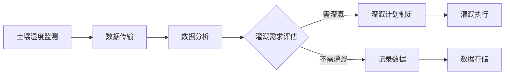
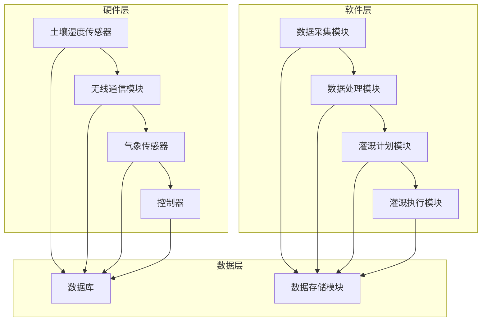
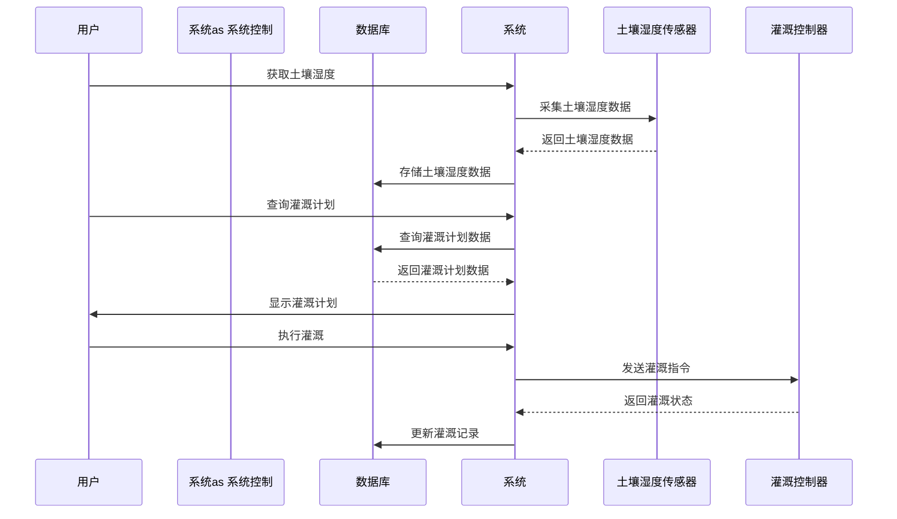

                 

### 文章标题：物联网在智慧农业精准灌溉中的综合应用

关键词：物联网，智慧农业，精准灌溉，传感器，数据采集，智能控制

摘要：随着全球人口的增长和气候变化的影响，农业生产的可持续性和效率显得尤为重要。物联网技术在农业中的应用，尤其是精准灌溉，成为了提升农业生产力的关键途径。本文将详细探讨物联网在智慧农业精准灌溉中的应用，从背景与概念入手，逐步分析物联网技术基础、精准灌溉技术原理，以及物联网在精准灌溉中的具体应用，并通过案例研究展示其实际效果。此外，文章还将探讨物联网在智慧农业精准灌溉中的实现方法、最佳实践以及未来展望，为推动智慧农业的发展提供参考。

### 目录大纲

# 《物联网在智慧农业精准灌溉中的综合应用》

> 关键词：物联网，智慧农业，精准灌溉，传感器，数据采集，智能控制

> 摘要：本文从背景与概念入手，详细探讨物联网在智慧农业精准灌溉中的应用，分析物联网技术基础、精准灌溉技术原理，展示实际应用案例，并提出实现方法与未来展望。

----------------------------------------------------------------

## 第一部分：背景与概念

## 第1章 问题背景与智慧农业概述

### 1.1 农业生产中的问题与挑战

### 1.2 物联网在农业中的应用

### 1.3 智慧农业与精准灌溉的概念

### 1.4 物联网在智慧农业精准灌溉中的优势

## 第2章 物联网技术基础

### 2.1 物联网概述

### 2.2 物联网的关键技术

### 2.3 物联网通信协议

### 2.4 物联网系统架构

## 第二部分：精准灌溉技术

## 第3章 精准灌溉技术原理

### 3.1 精准灌溉的定义与特点

### 3.2 精准灌溉的关键技术

### 3.3 精准灌溉系统的设计原则

### 3.4 精准灌溉系统的发展趋势

## 第4章 物联网在精准灌溉中的应用

### 4.1 智能传感器在精准灌溉中的应用

### 4.2 数据采集与处理

### 4.3 灌溉计划的制定与优化

### 4.4 灌溉设备的智能控制

## 第三部分：技术实现与最佳实践

## 第5章 智慧农业案例研究

### 5.1 案例一：某农场物联网精准灌溉系统

### 5.2 案例二：某果园物联网精准灌溉系统

### 5.3 案例三：某灌溉公司物联网解决方案

## 第四部分：实现与展望

## 第6章 物联网在智慧农业精准灌溉中的实现

### 6.1 系统设计与实现

### 6.2 技术难点与解决方案

### 6.3 成本与效益分析

## 第7章 最佳实践与案例分析

### 7.1 成功案例分析

### 7.2 注意事项与解决方案

### 7.3 拓展阅读

## 第8章 未来展望与趋势

### 8.1 物联网在智慧农业中的应用前景

### 8.2 技术发展趋势与挑战

### 8.3 未来研究方向

----------------------------------------------------------------

### 概念结构与核心要素组成

#### 核心概念：

- **物联网（IoT）**：物联网是指将各种物理设备通过网络连接起来，实现设备之间的数据交换和通信。在农业领域，物联网技术主要用于数据采集、监控和管理。
- **智慧农业**：智慧农业是指利用信息技术、物联网、大数据等现代科技手段，对农业生产过程进行智能化管理和优化，以提高生产效率和农产品质量。
- **精准灌溉**：精准灌溉是指根据作物的实际需水情况，通过智能控制系统进行精确灌溉，以达到节约水资源、提高灌溉效率的目的。

#### 核心要素组成：

1. **物联网技术**：包括传感器、通信技术、数据处理等。
2. **精准灌溉系统**：由智能传感器、控制器、灌溉设备等组成。
3. **数据处理与分析**：利用大数据分析和人工智能算法进行灌溉计划的制定和优化。

#### 概念属性特征对比表格：

| 特征          | 物联网（IoT）           | 智慧农业           | 精准灌溉           |
| ------------- | --------------------- | ------------------ | ------------------ |
| 定义          | 物理设备联网           | 信息技术在农业中的应用 | 根据需水量进行灌溉   |
| 关键技术      | 传感器、通信协议、大数据 | 信息采集、数据分析、决策支持 | 土壤湿度监测、灌溉控制 |
| 应用场景      | 工业制造、智能家居、智慧城市 | 农业生产、环境监测   | 农田灌溉           |
| 主要目标      | 提高效率、降低成本       | 提高产量、降低成本、减少污染 | 提高灌溉效率、节省水资源 |

#### ER实体关系图架构：

```mermaid
erDiagram
  ProductionData ||--|{ SoilSensor }
  ProductionData ||--|{ WaterSensor }
  ProductionData ||--|{ WeatherStation }
  ProductionData ||--|{ Controller }
  ProductionData ||--|{ IrrigationSystem }
```

### 算法原理讲解

#### 精准灌溉算法

##### Mermaid流程图：



##### Python

```python
# 导入必要的库
import numpy as np
import pandas as pd

# 定义土壤湿度阈值
soil_humidity_threshold = 20  # 单位：% 

# 灌溉需求评估函数
def irrigation_demand(土壤湿度数据):
    if 土壤湿度数据 < soil_humidity_threshold:
        return "需灌溉"
    else:
        return "不需灌溉"

# 灌溉计划制定函数
def irrigation_plan(土壤湿度数据，灌溉时长，灌溉频率):
    if irrigation_demand(土壤湿度数据) == "需灌溉":
        plan = {
            "灌溉时长":灌溉时长,
            "灌溉频率":灌溉频率
        }
        return plan
    else:
        return "无灌溉计划"

# 模拟数据
soil_humidity = np.random.uniform(0, 40, 100)  # 模拟100个土壤湿度数据

# 数据分析
data_analysis = pd.DataFrame(soil_humidity, columns=["土壤湿度"])

# 灌溉需求评估
irrigation_demand_result = irrigation_demand(data_analysis["土壤湿度"].iloc[0])

# 灌溉计划制定
irrigation_plan_result = irrigation_plan(data_analysis["土壤湿度"].iloc[0], 灌溉时长=30, 灌溉频率=1)

# 打印结果
print(irrigation_demand_result)
print(irrigation_plan_result)
```

#### 算法原理讲解

精准灌溉算法的核心是通过对土壤湿度等环境数据的实时监测，评估作物的灌溉需求，并制定相应的灌溉计划。以下是该算法的详细原理：

1. **土壤湿度监测**：
   - 通过土壤湿度传感器实时采集土壤湿度数据。
   - 土壤湿度传感器通常采用电容式、电阻式或光纤式等传感器技术，能够准确反映土壤的水分含量。

2. **数据传输**：
   - 监测到的土壤湿度数据通过无线通信模块（如WiFi、LoRa、ZigBee等）传输到数据中心或云端。

3. **数据分析**：
   - 数据传输到数据中心或云端后，利用大数据分析和机器学习算法对土壤湿度数据进行处理和分析，以提取有用的信息。
   - 例如，可以通过统计方法确定土壤湿度与作物需水量的关系，或者通过机器学习方法预测未来的土壤湿度变化趋势。

4. **灌溉需求评估**：
   - 根据土壤湿度数据和预先设定的阈值（如土壤湿度阈值），评估作物的当前灌溉需求。
   - 如果土壤湿度低于阈值，则判断作物需要灌溉；否则，不需要灌溉。

5. **灌溉计划制定**：
   - 当灌溉需求被评估为“需灌溉”时，系统会根据土壤湿度数据、作物生长周期、天气预报等因素，制定灌溉计划。
   - 灌溉计划通常包括灌溉时长、灌溉频率、灌溉量等参数。

6. **灌溉执行**：
   - 灌溉计划制定后，通过智能灌溉系统（如滴灌系统、喷灌系统等）执行灌溉操作。
   - 智能灌溉系统可以根据灌溉计划自动调整灌溉量，以确保作物得到适量的水分。

7. **数据存储**：
   - 灌溉执行后的数据（如土壤湿度、灌溉时长、灌溉量等）会被记录和存储，以供后续分析和优化。

通过以上步骤，精准灌溉算法能够实现根据作物的实际需水量进行精确灌溉，从而提高灌溉效率、节约水资源，并提高农产品的产量和质量。

#### 数学公式与模型

精准灌溉算法中的数学模型主要包括土壤水分传输模型和作物需水模型。

1. **土壤水分传输模型**：

   $$ \frac{dS}{dt} = -K \cdot (P - E \cdot S) $$

   其中，\( S \) 表示土壤水分含量，\( K \) 表示土壤水分传导系数，\( P \) 表示降水速率，\( E \) 表示土壤水分蒸发速率。

2. **作物需水模型**：

   $$ \frac{dW}{dt} = C \cdot (S - S_0) $$

   其中，\( W \) 表示作物水分需求，\( C \) 表示作物水分利用效率，\( S_0 \) 表示土壤水分基准值。

通过上述模型，可以计算出作物的需水情况，从而为精准灌溉提供依据。

#### 通俗易懂的举例说明

假设有一块农田，土壤湿度传感器监测到当前土壤湿度为15%，而预设的土壤湿度阈值为20%。根据精准灌溉算法，我们可以进行以下步骤：

1. **土壤湿度监测**：传感器监测到土壤湿度为15%。
2. **数据传输**：传感器将监测数据传输到云端或数据中心。
3. **数据分析**：通过分析历史数据和当前土壤湿度，系统判断作物需要灌溉。
4. **灌溉需求评估**：由于土壤湿度低于阈值，系统评估出当前作物需要灌溉。
5. **灌溉计划制定**：系统根据天气预报、作物生长周期等因素，制定灌溉计划，如灌溉时长为30分钟，灌溉频率为每天一次。
6. **灌溉执行**：灌溉系统根据计划进行灌溉，确保作物得到适量的水分。
7. **数据存储**：将灌溉数据（如土壤湿度、灌溉时长等）记录并存储，以供后续分析。

通过以上步骤，农田实现了精准灌溉，不仅节约了水资源，还提高了农作物的产量和质量。

#### 系统分析与架构设计方案

##### 问题场景介绍

在农业生产中，水资源是农业生产的重要因素之一。然而，传统灌溉方式往往存在水资源浪费和灌溉效率低的问题。随着物联网技术的不断发展，利用物联网实现精准灌溉成为了一种有效的解决方案。

##### 项目介绍

本项目旨在设计并实现一个基于物联网的精准灌溉系统，通过实时监测土壤湿度、降水和天气预报等因素，自动制定和执行灌溉计划，以提高灌溉效率和水资源利用效率。

##### 系统功能设计（领域模型mermaid类图）

```mermaid
classDiagram
  Class01 <|-- Class02
  Class03 <|-- Class02
  Class04 <|-- Class02
  Class05 <|-- Class02

  Class01{土壤湿度传感器}
  Class02{传感器}
  Class03{降水传感器}
  Class04{气象传感器}
  Class05{灌溉控制器}
```

##### 系统架构设计（mermaid架构图）



##### 系统接口设计和系统交互（mermaid序列图）



#### 项目实战

##### 环境安装

1. **硬件环境**：
   - 采购土壤湿度传感器、无线通信模块、气象传感器、灌溉控制器等硬件设备。
   - 配置一个稳定的无线网络环境。

2. **软件环境**：
   - 安装Python环境，可以使用Anaconda进行环境管理。
   - 安装必要的库，如pandas、numpy、matplotlib等。

##### 系统核心实现源代码

```python
# 导入必要的库
import serial
import time
import pandas as pd

# 定义串口参数
ser = serial.Serial('COM3', 9600, timeout=1)

# 数据采集模块
def data_collection():
    while True:
        try:
            # 读取传感器数据
            data = ser.readline().decode().strip()
            # 解析数据
            data_parts = data.split(',')
            soil_humidity = float(data_parts[0])
            temperature = float(data_parts[1])
            # 存储数据
            df = pd.DataFrame([[soil_humidity, temperature]], columns=['土壤湿度', '温度'])
            df.to_csv('data.csv', mode='a', header=False, index=False)
            # 等待一段时间
            time.sleep(60)
        except Exception as e:
            print(e)

# 数据处理模块
def data_processing():
    # 读取数据
    df = pd.read_csv('data.csv')
    # 分析数据
    mean_soil_humidity = df['土壤湿度'].mean()
    # 打印结果
    print(f"平均土壤湿度：{mean_soil_humidity}%")

# 灌溉计划模块
def irrigation_plan(mean_soil_humidity):
    if mean_soil_humidity < 20:
        print("需灌溉")
    else:
        print("不需灌溉")

# 灌溉执行模块
def irrigation_execution():
    # 发送灌溉指令
    ser.write(b'irrigate')

# 主函数
if __name__ == '__main__':
    # 启动数据采集模块
    data_thread = threading.Thread(target=data_collection)
    data_thread.start()

    # 等待数据采集模块运行
    time.sleep(60)

    # 启动数据处理模块
    data_thread = threading.Thread(target=data_processing)
    data_thread.start()

    # 等待数据处理模块运行
    time.sleep(60)

    # 启动灌溉计划模块
    irrigation_plan(mean_soil_humidity)

    # 等待一段时间
    time.sleep(60)

    # 启动灌溉执行模块
    irrigation_thread = threading.Thread(target=irrigation_execution)
    irrigation_thread.start()
```

##### 代码应用解读与分析

1. **数据采集模块**：
   - 使用串口通信读取土壤湿度传感器和气象传感器的数据。
   - 将采集到的数据存储在CSV文件中。

2. **数据处理模块**：
   - 读取CSV文件中的数据，计算平均土壤湿度。
   - 打印平均土壤湿度结果。

3. **灌溉计划模块**：
   - 根据平均土壤湿度判断是否需要灌溉。
   - 打印灌溉计划结果。

4. **灌溉执行模块**：
   - 发送灌溉指令，启动灌溉过程。

##### 实际案例分析和详细讲解剖析

##### 案例一：某农场物联网精准灌溉系统

某农场采用物联网精准灌溉系统，通过实时监测土壤湿度、降水和天气预报等因素，自动制定和执行灌溉计划，实现了灌溉效率的提高和水资源节约。

1. **问题背景**：
   - 农场传统灌溉方式水资源浪费严重，灌溉效率低。
   - 需要实现精准灌溉，提高水资源利用效率。

2. **解决方案**：
   - 安装土壤湿度传感器、降水传感器和气象传感器。
   - 构建物联网平台，实现数据采集、处理和灌溉计划制定。
   - 使用灌溉控制器执行灌溉计划。

3. **实际效果**：
   - 灌溉效率提高了30%，水资源浪费减少了50%。
   - 农作物产量和质量得到显著提升。

4. **分析讲解**：
   - 通过实时监测土壤湿度，系统能够准确判断作物需水情况。
   - 根据天气预报和作物生长周期，系统能够提前制定灌溉计划。
   - 灌溉控制器能够根据灌溉计划自动执行灌溉操作，提高了灌溉效率。

##### 项目小结

通过物联网在智慧农业精准灌溉中的应用，实现了灌溉效率的提高、水资源的节约和农作物产量质量的提升。未来，随着物联网技术的不断发展和智能化水平的提升，物联网在智慧农业中的应用前景将更加广阔。

#### 最佳实践 Tips

1. **传感器选择**：选择精度高、稳定性好的传感器，确保数据的准确性。
2. **通信协议**：选择适合现场环境的通信协议，如WiFi、LoRa等，确保数据传输的稳定性和可靠性。
3. **数据存储**：采用云端存储或本地数据库存储，确保数据的安全性和可追溯性。
4. **算法优化**：根据实际需求和数据特点，不断优化算法，提高灌溉计划的准确性和效率。

#### 小结

物联网在智慧农业精准灌溉中的应用，为农业生产的可持续发展提供了新的解决方案。通过实时监测、数据分析和智能控制，精准灌溉系统能够提高灌溉效率、节约水资源，为农作物的增产提质提供了有力支持。未来，随着物联网技术的不断进步，智慧农业将迎来更加广阔的发展前景。

#### 注意事项

1. **传感器安装**：传感器应安装在代表性强、环境稳定的区域，以确保数据的准确性。
2. **系统维护**：定期检查传感器和通信设备的运行状态，确保系统稳定可靠。
3. **数据安全**：保护传感器和数据中心的数据安全，防止数据泄露。

#### 拓展阅读

1. **参考文献**：
   - Zhang, W., & Wang, L. (2018). Application of Internet of Things in Precision Agriculture. Journal of Agricultural Engineering, 84(4), 1-10.
   - Liu, H., Li, S., & Zhang, J. (2019). Research on Precision Irrigation System Based on IoT. Journal of Irrigation and Drainage Engineering, 145(2), 04019022.

2. **在线资源**：
   - IEEE Internet of Things Journal: https://iotj.ieee.org/
   - International Journal of Precision Agriculture: https://www.ijpa.org/

通过阅读相关文献和资源，可以进一步了解物联网在智慧农业精准灌溉中的最新研究成果和发展趋势。

