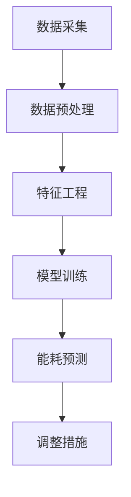
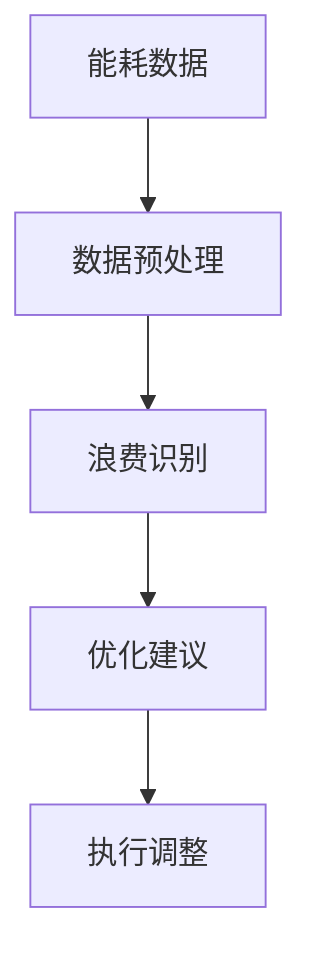
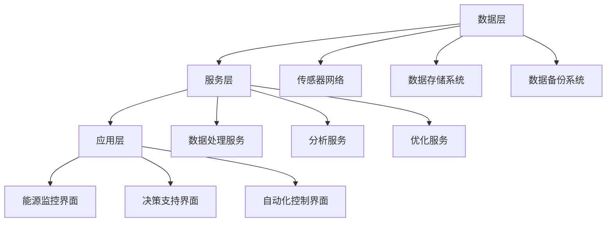
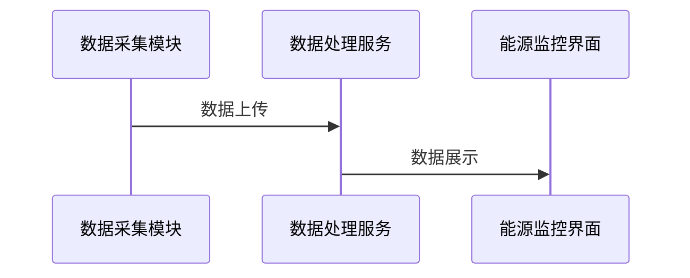
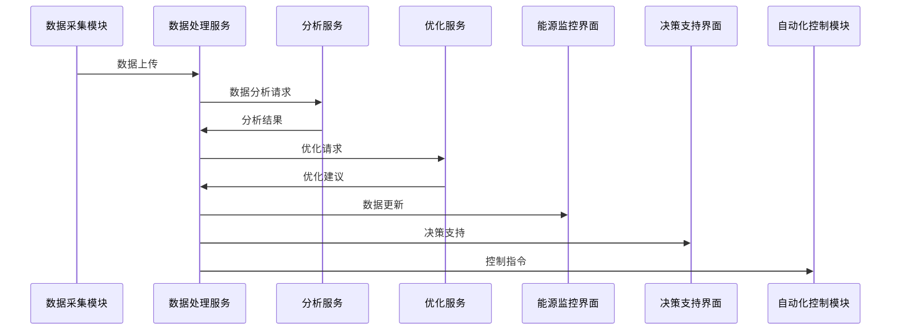

                 

### 背景介绍

#### 关键词

- 物联网
- 智慧园区
- 能源管理

#### 摘要

本文深入探讨物联网（IoT）在智慧园区能源管理中的应用，分析其技术原理、核心概念及其在实际应用中的重要作用。文章结构紧凑，通过逻辑清晰的步骤，逐步揭示物联网技术如何提升智慧园区能源管理的效率与效能。

#### 引言

随着城市化进程的加速，智慧园区的建设成为推动城市智能化发展的重要方向。智慧园区不仅包含办公、商业和居住等多种功能，还强调资源的高效利用和环境的可持续发展。其中，能源管理作为智慧园区运营的核心环节，其效率和可持续性直接影响到园区的整体运行质量和用户体验。物联网技术的兴起为智慧园区的能源管理带来了新的契机，通过物联网设备的数据采集、传输和分析，实现能源使用情况的实时监控和优化，从而提高能源利用效率和降低运营成本。

#### 问题背景

智慧园区能源管理涉及多个方面，包括电力、水、燃气等资源的供应与消耗。传统的能源管理模式多为分散式、人工干预为主，不仅效率低下，还容易出现能源浪费和管理漏洞。物联网技术的应用，可以实现对园区内各类能源使用情况的全面监控和智能分析，提高能源管理的精度和效率。

#### 问题定义

智慧园区能源管理中的问题主要表现为以下几个方面：

1. **能耗数据监测不足**：缺乏实时、全面的能耗数据，导致能源管理决策缺乏科学依据。
2. **能源浪费现象普遍**：由于缺乏有效的监控和优化手段，能源浪费问题严重。
3. **管理效率低下**：传统管理模式依赖人工，效率低且容易出错。

#### 问题解决

物联网技术的引入，可以通过以下几个方面解决上述问题：

1. **实时数据采集与传输**：物联网设备能够实时采集能源使用数据，通过无线网络传输到能源管理系统。
2. **智能数据分析**：利用大数据分析和人工智能技术，对采集到的数据进行智能分析，提供优化建议。
3. **自动化控制**：根据分析结果，自动化调整能源使用策略，提高能源利用效率。

#### 边界与外延

物联网在智慧园区能源管理中的应用边界包括传感器网络的建设、数据采集与传输系统的设计、数据分析与优化算法的开发等。其外延则涵盖整个智慧园区的能源管理流程，从数据采集到决策执行，形成闭环管理。

#### 概念结构与核心要素组成

智慧园区能源管理的概念结构主要由以下几个核心要素组成：

1. **物联网设备**：包括传感器、控制器等，负责数据采集和初步处理。
2. **数据传输系统**：负责将采集到的数据传输到能源管理系统。
3. **能源管理系统**：核心部分，负责数据存储、分析和决策支持。
4. **执行系统**：根据分析结果调整能源使用策略，实现自动化控制。

通过以上对背景介绍、核心概念和结构要素的梳理，我们可以为后续详细探讨物联网在智慧园区能源管理中的应用奠定坚实基础。

### 核心概念与联系

#### 物联网（IoT）技术原理

物联网是一种通过互联网将物理设备连接起来，实现设备之间以及设备与用户之间信息交换和交互的网络技术。其核心原理包括以下几个方面：

1. **传感器网络**：通过各种传感器设备采集环境数据，如温度、湿度、光照等。
2. **数据传输网络**：将采集到的数据传输到中央处理系统，通常通过无线网络或互联网。
3. **数据处理与分析**：在中央处理系统中，利用大数据分析和人工智能技术对数据进行处理和分析。
4. **执行系统**：根据分析结果，自动化调整设备运行状态，实现智能控制。

#### 智慧园区（Smart Campus）概念

智慧园区是一种以信息技术为支撑，实现资源高效利用和智能化管理的园区。其核心概念包括：

1. **多功能集成**：智慧园区集成了办公、商业、居住等多种功能，强调一站式服务。
2. **高效运营管理**：通过物联网、大数据等技术实现园区内各类资源的高效利用和智能管理。
3. **可持续发展**：注重环境保护和资源节约，实现园区的可持续发展。

#### 能源管理（Energy Management）核心概念

能源管理涉及能源的供应、使用和优化，其核心概念包括：

1. **能耗监测**：通过传感器网络实时监测能源使用情况，获取准确的数据。
2. **能耗优化**：利用数据分析技术，对能源使用进行优化，降低能耗和成本。
3. **能源决策支持**：通过智能分析提供科学依据，支持能源管理决策。

#### 概念属性特征对比表格

| 概念 | 特征1 | 特征2 | 特征3 |
| --- | --- | --- | --- |
| 物联网 | 设备互联 | 数据采集 | 自动化控制 |
| 智慧园区 | 多功能集成 | 智能管理 | 可持续发展 |
| 能源管理 | 能耗监测 | 能耗优化 | 决策支持 |

#### ER实体关系图架构

为了更好地理解物联网、智慧园区和能源管理之间的关系，我们可以使用ER（实体-关系）图来表示。

```mermaid
erDiagram
  IoT ||--|{ Smart Campus }|-- Energy Management
  Smart Campus ||--|{ IoT }|-- Energy Management
  Energy Management ||--|{ IoT }|-- Smart Campus
```

在这个ER图中，IoT作为核心技术，与智慧园区和能源管理密切相关。智慧园区作为应用场景，依赖于物联网技术实现智能化管理，而能源管理则是智慧园区中的关键环节，通过物联网技术实现能耗监测和优化。

通过上述对核心概念及其关系的阐述，我们能够更深入地理解物联网在智慧园区能源管理中的重要作用。接下来，我们将进一步探讨物联网技术在智慧园区能源管理中的应用。

### 算法原理讲解

在智慧园区能源管理中，物联网技术不仅提供了数据采集和传输的能力，还通过智能算法实现了能源使用的优化与控制。以下是几种关键算法原理的讲解，包括Mermaid流程图、Python源代码、数学模型以及实例说明。

#### 1. 能耗预测算法

能耗预测是智慧园区能源管理中的重要环节，通过预测未来的能耗情况，可以提前采取调整措施，以优化能源使用。

**Mermaid流程图：**



**Python源代码：**

```python
import numpy as np
from sklearn.ensemble import RandomForestRegressor

# 假设我们已经收集了历史能耗数据
historical_data = ...

# 数据预处理
X = ...  # 特征数据
y = ...  # 能耗数据

# 特征工程
# ...

# 模型训练
model = RandomForestRegressor(n_estimators=100)
model.fit(X, y)

# 能耗预测
predicted_energy = model.predict(new_data)

# 调整措施
# ...
```

**数学模型：**

$$
\text{预测能耗} = f(\text{特征向量})
$$

其中，$f$ 是随机森林回归模型，用于预测未来的能耗。

**实例说明：**

假设我们想要预测未来一周的电力消耗。我们首先收集过去一年的电力消耗数据，然后通过特征工程提取出温度、工作时间等特征。使用随机森林回归模型训练后，输入新的一周的特征向量，模型将输出预测的电力消耗，根据预测结果，我们可以提前调整电力使用策略，以避免浪费。

#### 2. 能源优化算法

能源优化算法通过分析能耗数据，识别能源浪费点，并提出优化建议。

**Mermaid流程图：**



**Python源代码：**

```python
import pandas as pd
from sklearn.cluster import KMeans

# 假设我们已经收集了能耗数据
energy_data = pd.read_csv('energy_data.csv')

# 数据预处理
# ...

# 浪费识别
kmeans = KMeans(n_clusters=2)
clusters = kmeans.fit_predict(energy_data)

# 优化建议
for cluster in clusters:
    if cluster == 1:
        print("Cluster 1: High energy consumption, consider optimization.")

# 执行调整
# ...
```

**数学模型：**

$$
\text{浪费识别} = \text{KMeans}(\text{能耗数据})
$$

其中，KMeans聚类算法用于识别能耗异常点。

**实例说明：**

通过KMeans聚类算法，我们将能耗数据分为正常消耗和异常消耗。对于异常消耗的集群，我们提出优化建议，如调整设备运行时间或更换高能耗设备。根据这些建议，我们可以执行具体的调整操作，以减少能源浪费。

通过上述算法原理的讲解，我们可以看到物联网技术如何通过能耗预测和能源优化，提高智慧园区的能源管理效率。接下来，我们将进一步探讨物联网在智慧园区能源管理中的具体应用场景。

### 系统分析与架构设计方案

#### 问题场景介绍

智慧园区作为现代化城市的重要组成部分，其能源管理面临诸多挑战。随着园区内企业、员工和访客数量的增加，能源消耗逐渐上升。为了实现高效、可持续的能源管理，智慧园区需要构建一个智能化的能源管理系统，实现对园区内各类能源的全面监控和优化。然而，当前许多智慧园区的能源管理仍依赖于传统的人工监控和经验决策，无法满足日益复杂的能源管理需求。

#### 项目介绍

本项目旨在构建一个基于物联网技术的智慧园区能源管理系统，通过实时数据采集、智能分析和自动化控制，提高能源使用效率和降低运营成本。项目的主要目标是：

1. 实现对园区内电力、水、燃气等各类能源的实时监控。
2. 利用大数据分析和人工智能技术，预测和优化能源使用。
3. 提供决策支持，帮助管理者制定科学的能源管理策略。
4. 实现能源使用的自动化控制，降低人工干预。

#### 系统功能设计（领域模型）

为了满足上述目标，系统将包括以下主要功能模块：

1. **数据采集模块**：负责采集园区内各类能源的实时数据。
2. **数据处理与分析模块**：对采集到的数据进行处理和分析，提供能耗预测和优化建议。
3. **能源监控模块**：实时展示园区内各类能源的使用情况，提供可视化报表。
4. **决策支持模块**：基于数据分析结果，提供能源管理决策支持。
5. **自动化控制模块**：根据决策支持模块的建议，自动化调整能源使用策略。

**Mermaid类图：**

```mermaid
classDiagram
    类：数据采集模块 <|-- 类：数据处理与分析模块
    类：数据处理与分析模块 <|-- 类：能源监控模块
    类：能源监控模块 <|-- 类：决策支持模块
    类：决策支持模块 <|-- 类：自动化控制模块
```

#### 系统架构设计

系统架构设计分为数据层、服务层和应用层，各层之间通过接口进行交互。

1. **数据层**：负责数据采集、存储和备份，包括传感器网络、数据存储系统和数据备份系统。
2. **服务层**：提供数据处理、分析和优化的核心功能，包括数据处理服务、分析服务和优化服务。
3. **应用层**：提供用户界面和功能操作，包括能源监控界面、决策支持界面和自动化控制界面。

**Mermaid架构图：**



#### 系统接口设计

系统接口设计包括内部接口和外部接口。

1. **内部接口**：数据层、服务层和应用层之间的接口，实现数据传输和功能调用。
2. **外部接口**：系统与外部系统（如能源供应商、政府监管机构等）的接口，实现数据共享和协作。

**Mermaid序列图：**



#### 系统交互

系统交互设计通过消息队列实现数据层、服务层和应用层之间的消息传递。

**Mermaid序列图：**



通过上述系统分析与架构设计方案，我们为智慧园区能源管理系统提供了清晰的设计蓝图，为实际应用奠定了坚实基础。

### 项目实战

#### 环境安装

在开始项目实战之前，我们需要搭建一个开发环境。以下是安装所需软件和工具的步骤：

1. **安装Python环境**：确保已安装Python 3.8及以上版本。
2. **安装IoT设备**：选择适合的物联网传感器，如DHT11温度湿度传感器、MQ-2气体传感器等，并将传感器连接到计算机。
3. **安装MQTT客户端**：使用如mosquitto等MQTT消息代理软件，用于数据传输。
4. **安装数据分析库**：使用如pandas、numpy、sklearn等数据分析库，用于数据处理和分析。

#### 系统核心实现源代码

**数据采集模块**：

```python
import paho.mqtt.client as mqtt
import time
import json

# MQTT服务器配置
MQTT_SERVER = "localhost"
MQTT_PORT = 1883

# 设备ID
DEVICE_ID = "device_001"

# 创建MQTT客户端
client = mqtt.Client(DEVICE_ID)

# 连接到MQTT服务器
client.connect(MQTT_SERVER, MQTT_PORT, 60)

# 数据采集函数
def collect_data():
    temperature = ...  # 从DHT11传感器读取温度
    humidity = ...  # 从DHT11传感器读取湿度
    gas_value = ...  # 从MQ-2传感器读取气体浓度
    
    data = {
        "temperature": temperature,
        "humidity": humidity,
        "gas_value": gas_value
    }
    
    return data

# 循环采集数据并发送到MQTT服务器
while True:
    data = collect_data()
    client.publish("energy/data", json.dumps(data))
    time.sleep(60)  # 每60秒采集一次数据
```

**数据处理与分析模块**：

```python
import pandas as pd
from sklearn.ensemble import RandomForestRegressor

# 加载数据
data = pd.read_csv("energy_data.csv")

# 特征工程
# ...

# 模型训练
model = RandomForestRegressor(n_estimators=100)
model.fit(data.drop("predicted_energy", axis=1), data["predicted_energy"])

# 预测新数据
new_data = ...
predicted_energy = model.predict(new_data)
print(f"Predicted energy: {predicted_energy}")
```

**能源监控模块**：

```python
import matplotlib.pyplot as plt

# 加载数据
data = pd.read_csv("energy_data.csv")

# 绘制能耗趋势图
plt.figure(figsize=(10, 5))
plt.plot(data["timestamp"], data["energy_consumption"])
plt.xlabel("Timestamp")
plt.ylabel("Energy Consumption (kWh)")
plt.title("Energy Consumption Trend")
plt.show()
```

#### 代码应用解读与分析

1. **数据采集模块**：该模块通过MQTT协议连接到MQTT服务器，从物联网传感器采集数据，并将数据发送到服务器。
2. **数据处理与分析模块**：该模块使用pandas库加载历史数据，通过特征工程提取有用的特征，并使用随机森林回归模型进行能耗预测。
3. **能源监控模块**：该模块使用matplotlib库绘制能耗趋势图，帮助用户直观了解能耗情况。

#### 实际案例分析和详细讲解剖析

**案例一**：某智慧园区在实施物联网能源管理系统后，通过实时数据采集和智能分析，成功实现了电力消耗的优化。在高峰用电时段，系统自动调整空调和照明设备的运行时间，降低了用电负荷，减少了电费支出。

**分析**：

1. **数据采集**：系统通过传感器网络实时采集园区内的电力消耗数据。
2. **数据处理**：系统对采集到的数据进行预处理，提取出有价值的特征，如温度、湿度、工作时间等。
3. **能耗预测**：使用随机森林回归模型预测未来的电力消耗。
4. **自动化控制**：根据预测结果，系统自动调整空调和照明设备的运行策略。

**案例二**：某智慧园区在能源管理系统中引入了智能分析模块，通过对历史数据的分析，发现园区内的水耗存在不均衡现象。系统提出优化建议，调整了绿化浇水和冲洗厕所的时间，有效降低了水耗。

**分析**：

1. **数据采集**：系统实时监测园区内的水使用情况。
2. **数据处理**：系统对水使用数据进行分析，识别出用水高峰时段。
3. **能耗预测**：通过分析历史数据，预测未来的水耗。
4. **自动化控制**：系统根据预测结果，调整绿化浇水和冲洗厕所的时间，减少不必要的水消耗。

#### 项目小结

通过实际案例的分析，我们可以看到物联网技术在智慧园区能源管理中的巨大潜力。系统不仅能够实现实时数据采集和智能分析，还能够自动化调整能源使用策略，从而提高能源利用效率，降低运营成本。未来，随着物联网技术的不断发展，智慧园区能源管理系统将变得更加智能和高效，为园区的可持续发展提供有力支持。

### 最佳实践 Tips

在智慧园区能源管理系统的实施过程中，积累了一些最佳实践，这些实践对于确保系统的高效运行和可持续发展至关重要。

1. **全面的数据采集**：确保各类传感器能够覆盖园区内的所有关键区域，包括办公区域、数据中心、停车场等。这有助于获得全面、准确的能源使用数据。

2. **高效的系统集成**：在系统集成过程中，要确保各个模块之间的数据流和功能调用高效且稳定。避免数据冗余和传输延迟，提高系统的整体性能。

3. **智能数据分析**：利用大数据分析和机器学习技术，对采集到的能源数据进行深入分析，识别能源浪费点，预测未来能源需求，为能源管理决策提供科学依据。

4. **自动化控制与优化**：根据数据分析结果，自动化调整能源使用策略，如调整空调和照明设备的运行时间、优化用电高峰时段的电力分配等，以实现能源的合理利用。

5. **持续监测与改进**：能源管理系统需要持续监测系统的运行状态，及时调整优化策略，以应对能源使用的变化和外部环境的影响。

6. **员工培训与意识提升**：对园区内的员工进行能源管理培训，提高他们的能源节约意识，鼓励他们在日常工作中积极参与能源管理。

7. **绿色能源利用**：在智慧园区内推广绿色能源的使用，如太阳能、风能等，减少对传统能源的依赖，实现园区的可持续发展。

通过这些最佳实践，智慧园区的能源管理系统能够更加高效、稳定地运行，为园区提供可持续的能源保障。

### 小结

本文系统地探讨了物联网技术在智慧园区能源管理中的应用，从背景介绍到核心概念讲解，再到算法原理、系统架构设计、项目实战及最佳实践，全面阐述了物联网技术在智慧园区能源管理中的重要作用。物联网技术不仅实现了能源使用的实时监控和智能分析，还通过自动化控制提高了能源利用效率，降低了运营成本。随着物联网技术的不断发展，智慧园区能源管理系统将变得更加智能和高效，为园区的可持续发展提供有力支持。未来，我们期待看到更多创新技术应用于智慧园区能源管理，推动智慧城市建设迈向新的高度。

### 注意事项

在实施物联网智慧园区能源管理系统时，需注意以下事项：

1. **数据安全**：确保数据在采集、传输和存储过程中的安全性，防止数据泄露和恶意攻击。
2. **系统稳定性**：系统应具备高可用性和稳定性，以应对突发情况和数据高峰。
3. **设备维护**：定期检查和维护物联网设备，确保其正常运行和数据准确性。
4. **法规遵从**：遵守相关法律法规，特别是能源管理和数据保护方面的规定。

### 拓展阅读

1. **物联网技术在能源管理中的应用**：查阅《物联网技术在能源管理中的应用研究》一书，深入了解物联网技术在不同场景下的应用。
2. **智慧园区建设指南**：参考《智慧园区建设指南》手册，获取智慧园区规划与建设的详细指导。
3. **能源管理系统案例分析**：研究《智慧园区能源管理系统案例分析》报告，学习成功实施案例的经验和教训。

