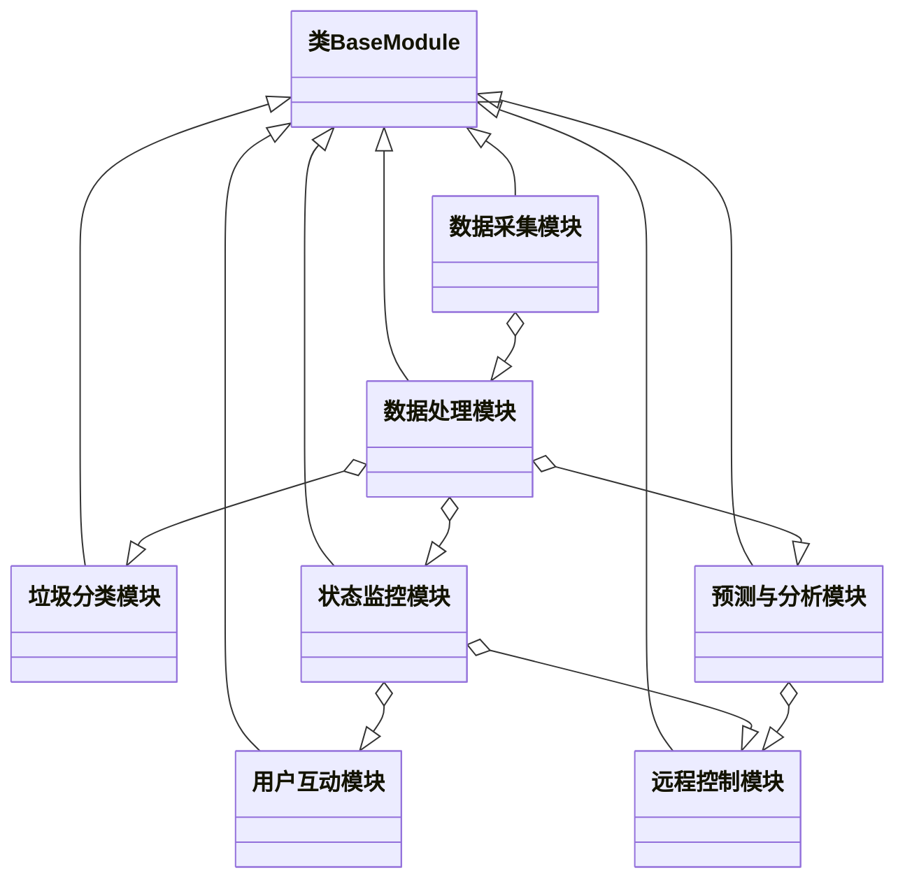
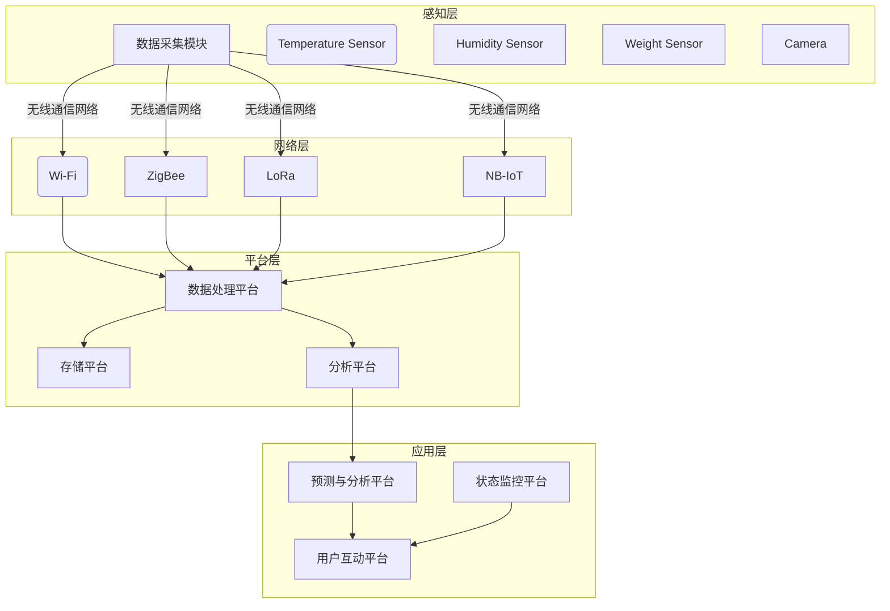
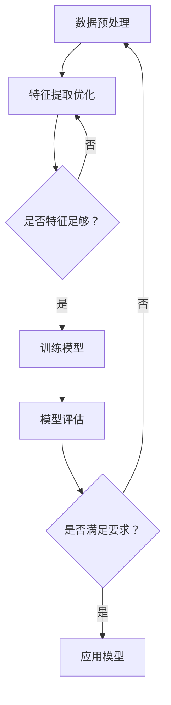
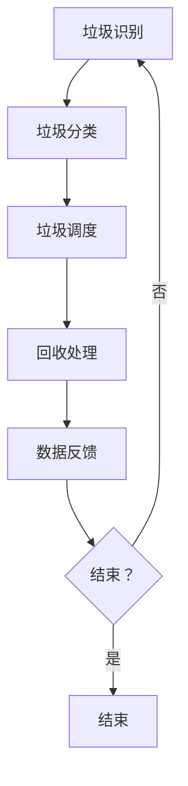

                 

### 1.1 问题背景

#### 垃圾管理现状与挑战

随着全球经济的快速发展，城市化进程的加快，垃圾产生量也在急剧增加。据联合国环境规划署（UNEP）统计，全球每年产生的垃圾量已超过100亿吨。这不仅给城市管理和环境造成了巨大压力，也引发了诸多社会和经济问题。目前，传统的垃圾管理模式主要依赖于填埋、焚烧和堆肥等处理方式，但存在以下几大挑战：

1. **资源浪费**：大量可回收利用的资源被当作垃圾处理，造成资源的极大浪费。
2. **环境污染**：垃圾填埋场和焚烧厂产生大量有害气体和废水，对土壤、水源和大气环境造成严重污染。
3. **处理成本高**：传统垃圾处理方式需要大量的人力、物力和财力投入，运营成本高。
4. **分类不准确**：居民垃圾投放的准确分类率较低，导致垃圾处理效果不佳。

#### 物联网技术在垃圾管理中的应用需求

为了解决上述传统垃圾管理模式的挑战，物联网技术提供了一种创新的解决方案。通过将传感器、数据处理和通信技术相结合，物联网可以在垃圾管理中实现以下功能：

1. **实时监控**：通过安装在垃圾桶和垃圾处理设施上的传感器，实时监测垃圾的满溢情况、温度、湿度等参数，实现对垃圾处理的动态监控。
2. **智能分类**：利用物联网技术，可以实现对垃圾的智能识别和分类，提高垃圾回收利用率，减少处理成本。
3. **数据分析**：通过对收集到的数据进行大数据分析，可以优化垃圾处理流程，预测垃圾产生趋势，为决策提供科学依据。
4. **远程控制**：物联网技术可以实现垃圾处理设施的远程控制，减少人力投入，提高管理效率。

综上所述，物联网技术在智慧垃圾管理中具有广泛的应用前景，能够有效解决当前垃圾管理面临的诸多挑战。

### 1.2 智慧垃圾管理概念

#### 智慧垃圾管理定义

智慧垃圾管理是一种基于物联网技术、大数据分析和人工智能等先进技术的综合管理模式。它通过将各类传感器、数据处理设备和通信技术集成到一个统一的平台上，实现对垃圾产生、分类、运输和处理全过程的高效管理。

#### 智慧垃圾管理核心要素

智慧垃圾管理的核心要素包括以下几个方面：

1. **传感器网络**：在垃圾桶、垃圾处理设施等位置安装各种传感器，如重量传感器、温度传感器、湿度传感器等，用于实时监测垃圾状态。
2. **数据处理平台**：用于接收、处理和分析传感器收集到的数据，实现对垃圾处理过程的实时监控和优化。
3. **智能分类系统**：通过图像识别、深度学习等技术，对垃圾进行智能分类，提高回收利用率。
4. **通信网络**：构建高效稳定的通信网络，确保数据传输的实时性和可靠性。
5. **用户互动平台**：通过手机APP、微信公众号等渠道，为居民提供垃圾分类指南、积分奖励等信息，促进垃圾分类意识的提升。

#### 智慧垃圾管理的优势

智慧垃圾管理相较于传统垃圾管理模式，具有以下优势：

1. **提高资源利用率**：通过智能分类和回收，提高可回收垃圾的利用率，减少资源浪费。
2. **降低处理成本**：实时监控和数据分析有助于优化垃圾处理流程，降低处理成本。
3. **减少环境污染**：通过减少垃圾填埋和焚烧，降低有害气体和废水的排放，减少环境污染。
4. **提升管理效率**：物联网技术和大数据分析的应用，使垃圾处理过程更加智能化、自动化，提高管理效率。

### 1.3 智慧垃圾管理的发展历程

#### 传统垃圾管理模式

在智慧垃圾管理概念提出之前，传统的垃圾管理模式主要依赖于填埋、焚烧和堆肥等处理方式。这种模式存在诸多问题，如资源浪费、环境污染和处理成本高等。

#### 物联网技术在垃圾管理中的应用演变

随着物联网技术的快速发展，其在垃圾管理中的应用逐渐兴起。以下是物联网技术在垃圾管理中的应用演变：

1. **2000年初期**：初步探索阶段，一些城市开始尝试在垃圾桶上安装传感器，以实现垃圾满溢状态的监控。
2. **2010年代**：快速发展阶段，物联网技术在垃圾管理中的应用逐步扩大，包括垃圾回收车路径优化、垃圾分类指导等。
3. **2020年至今**：成熟应用阶段，智慧垃圾管理系统开始在全国范围内推广，实现从垃圾产生到处理的全程智能化管理。

综上所述，智慧垃圾管理从初步探索到成熟应用，经历了多年的发展。物联网技术在其中发挥了至关重要的作用，推动了垃圾管理模式的变革。接下来，我们将进一步探讨物联网技术的原理及其在智慧垃圾管理中的应用。

### 2.1 物联网技术概述

#### 物联网定义与分类

物联网（Internet of Things，IoT）是指通过传感器、网络和智能设备，将物理世界中的各种物体连接到互联网上，实现信息的实时采集、传输和处理的系统。物联网可以按以下方式进行分类：

1. **按应用领域分类**：可以分为工业物联网（IIoT）、智能家居、智慧城市、医疗健康、农业物联网等。
2. **按通信方式分类**：可以分为有线物联网和无线物联网。有线物联网通过有线网络传输数据，如以太网、光纤等；无线物联网则通过无线信号传输数据，如Wi-Fi、蓝牙、ZigBee、LoRa等。

#### 物联网核心架构与技术组件

物联网系统的核心架构通常包括以下组件：

1. **感知层**：通过各种传感器（如温度传感器、湿度传感器、摄像头等）收集物理世界中的数据。
2. **网络层**：用于数据传输，包括无线传感器网络（WSN）、无线通信网络（如Wi-Fi、LoRa等）和移动通信网络（如4G/5G）。
3. **平台层**：用于数据存储、处理和分析，提供数据管理和应用开发平台。
4. **应用层**：面向具体应用场景，如智慧垃圾管理、智能家居、智能制造等。

#### 物联网技术优势

物联网技术在智慧垃圾管理中具有以下优势：

1. **实时监控**：通过传感器网络，可以实时监控垃圾的收集、运输和处理过程，提高管理效率。
2. **数据分析**：通过对收集到的数据进行分析，可以优化垃圾处理流程，预测垃圾产生趋势，为决策提供科学依据。
3. **自动化控制**：物联网技术可以实现垃圾处理设施的自动化控制，减少人力投入，提高管理效率。
4. **智能化分类**：利用物联网技术，可以实现垃圾的智能识别和分类，提高回收利用率。

### 2.2 低功耗广域网（LPWAN）

#### LPWAN技术原理

低功耗广域网（Low-Power Wide Area Network，LPWAN）是一种用于长距离、低功耗数据传输的无线通信技术。它通过在远程区域部署低功耗的基站，实现大规模物联网设备的连接。

LPWAN技术的主要特点包括：

1. **低功耗**：LPWAN设备通常采用电池供电，具有超低的功耗特性，适合长时间运行。
2. **广覆盖**：LPWAN网络覆盖范围广，可以达到数公里甚至数十公里，适用于大面积的物联网应用。
3. **长连接**：LPWAN设备可以在较长时间内保持连接状态，适合需要长时间监测和传输数据的物联网应用。

LPWAN技术原理主要包括以下几个关键组件：

1. **基站**：用于接收和处理LPWAN设备传输的数据。
2. **终端设备**：用于采集和传输数据的LPWAN设备，如传感器、智能标签等。
3. **网络服务器**：用于存储和处理从LPWAN设备收集到的数据。

#### LPWAN在智慧垃圾管理中的应用

LPWAN技术在智慧垃圾管理中具有广泛的应用场景：

1. **垃圾桶满溢监测**：通过在垃圾桶上安装LPWAN传感器，实时监测垃圾桶的满溢情况，优化垃圾收集路线，减少空跑现象。
2. **垃圾运输车辆跟踪**：通过在垃圾运输车辆上安装LPWAN传感器，实时跟踪车辆位置和状态，提高运输效率。
3. **垃圾处理设施监控**：通过在垃圾处理设施上安装LPWAN传感器，实时监控设施的运行状态，确保处理过程的安全和高效。

#### LPWAN的优势

LPWAN技术在智慧垃圾管理中的应用具有以下优势：

1. **长距离通信**：LPWAN技术可以覆盖广泛的区域，适合大规模的垃圾管理应用。
2. **低功耗**：LPWAN设备具有超低的功耗特性，可以长时间运行，减少维护成本。
3. **高可靠性**：LPWAN技术具有稳定的通信特性，即使在恶劣环境下也能保持良好的连接状态。
4. **低成本**：相较于其他通信技术，LPWAN设备成本较低，适合大规模部署。

通过上述分析，我们可以看到LPWAN技术在智慧垃圾管理中具有巨大的应用潜力，能够为垃圾管理提供高效、可靠的解决方案。

### 2.3 数据采集与处理

#### 数据采集方法与技术

在智慧垃圾管理系统中，数据采集是关键的一环。数据采集方法和技术主要包括以下几个方面：

1. **传感器采集**：通过安装在垃圾桶、垃圾处理设施等位置的传感器，实时采集温度、湿度、重量等参数。常用的传感器包括温度传感器、湿度传感器、重量传感器等。
2. **图像采集**：通过摄像头等图像采集设备，实时捕捉垃圾桶的满溢状态、垃圾种类等信息。图像采集技术通常结合图像处理和计算机视觉算法，实现垃圾的智能识别和分类。
3. **RFID采集**：通过RFID（射频识别）技术，对垃圾进行电子标签标识，实现垃圾的自动化识别和分类。

#### 数据处理流程与关键算法

数据采集后，需要经过处理和分析，才能为智慧垃圾管理系统提供有价值的信息。数据处理流程主要包括以下几个步骤：

1. **数据预处理**：对采集到的原始数据进行清洗、去噪和格式化，确保数据的质量和一致性。
2. **特征提取**：从预处理后的数据中提取出关键特征，如温度、湿度、重量等。特征提取是数据处理的重要环节，直接影响后续分析的准确性和效率。
3. **数据分析**：利用统计分析和机器学习算法，对提取出的特征进行分析和预测。常用的数据分析方法包括线性回归、决策树、支持向量机、神经网络等。
4. **数据可视化**：将分析结果以图表、图像等形式展示出来，帮助管理者直观地了解垃圾管理的现状和趋势。

在数据处理过程中，关键算法主要包括：

1. **垃圾识别算法**：利用计算机视觉算法，如卷积神经网络（CNN）、深度学习等，对图像数据进行处理，实现垃圾的智能识别和分类。
2. **垃圾回收预测算法**：利用时间序列分析和机器学习算法，预测未来的垃圾回收量，为垃圾收集和运输提供科学依据。
3. **优化算法**：利用优化算法，如遗传算法、蚁群算法等，优化垃圾处理流程，提高处理效率。

#### 数据处理在智慧垃圾管理中的重要性

数据处理在智慧垃圾管理中具有至关重要的地位，主要体现在以下几个方面：

1. **实时监控**：通过对传感器数据的实时处理和分析，可以实现垃圾处理的实时监控，提高管理效率。
2. **优化流程**：通过对历史数据的分析和挖掘，可以优化垃圾处理流程，减少资源浪费，降低处理成本。
3. **决策支持**：通过对数据的深入分析，可以为管理者提供科学的决策支持，提高决策的准确性和效率。
4. **智能分类**：通过数据分析和机器学习算法，可以实现垃圾的智能分类，提高回收利用率。

综上所述，数据采集与处理是智慧垃圾管理系统的核心组成部分，通过高效的数据处理，可以提升垃圾管理的智能化水平，实现资源的有效利用和环境的可持续发展。

### 2.4 网络协议与通信技术

#### 常见网络协议介绍

在网络通信中，选择合适的网络协议对于保障数据传输的可靠性、安全性和效率至关重要。以下是几种常见的网络协议：

1. **Wi-Fi**：无线局域网（Wi-Fi）协议，广泛用于家庭、办公和公共区域的无线网络连接，具有较好的传输速率和覆盖范围。
2. **ZigBee**：一种低功耗的短距离无线通信技术，适合智能家居和智慧城市等应用场景，具有低成本、低功耗和高可靠性的特点。
3. **LoRa**：一种长距离的低功耗广域网（LPWAN）技术，适用于远程监控和大规模物联网应用，具有低功耗、广覆盖和长连接等优点。
4. **NB-IoT**：一种蜂窝物联网（IoT）通信技术，由3GPP定义，具有低功耗、广覆盖和低成本的特点，适用于大规模物联网应用。
5. **HTTP/HTTPS**：超文本传输协议（HTTP）及其安全版（HTTPS），用于在互联网上传输数据，具有简单、易用和广泛支持的特点。

#### 通信技术在垃圾管理中的应用

在智慧垃圾管理中，通信技术起着至关重要的作用，其应用主要体现在以下几个方面：

1. **传感器数据传输**：通过无线通信技术，如Wi-Fi、ZigBee、LoRa、NB-IoT等，将传感器采集到的数据实时传输到数据处理平台，实现垃圾状态的远程监控。
2. **垃圾回收车辆定位**：利用GPS和通信技术，实现对垃圾回收车辆的实时定位和跟踪，优化运输路线，提高回收效率。
3. **数据处理与远程控制**：通过通信网络，将处理后的数据实时传输到管理中心，为管理者提供决策支持，并实现垃圾处理设施的远程控制。
4. **用户互动与反馈**：通过通信网络，为居民提供垃圾分类指南、积分奖励等信息，促进垃圾分类意识的提升，并收集用户的反馈数据，优化系统性能。

#### 通信技术在垃圾管理中的优势

通信技术在智慧垃圾管理中的应用具有以下优势：

1. **实时性**：通过实时传输数据，实现对垃圾状态的实时监控和处理，提高管理效率。
2. **高效性**：利用高效的通信协议和算法，实现大量数据的快速传输和处理，降低延迟和带宽占用。
3. **可靠性**：通过选择适合的通信技术和协议，确保数据传输的稳定性和可靠性，减少数据丢失和错误。
4. **智能化**：通过通信技术，实现垃圾管理系统的智能化，提高分类、预测和决策的准确性。

综上所述，通信技术是智慧垃圾管理系统的关键组成部分，通过合理选择和应用通信技术，可以显著提升垃圾管理的智能化水平，实现资源的有效利用和环境的可持续发展。

### 3.1 系统功能设计

#### 智慧垃圾管理系统功能模块

智慧垃圾管理系统主要由以下几个功能模块组成：

1. **数据采集模块**：负责从传感器、摄像头等设备中采集实时数据，包括垃圾重量、垃圾桶满溢状态、温度、湿度等。
2. **数据处理模块**：对采集到的数据进行预处理、特征提取和存储，为后续分析提供基础数据。
3. **垃圾分类模块**：利用计算机视觉和深度学习算法，对垃圾进行智能识别和分类，提高回收利用率。
4. **状态监控模块**：实时监控垃圾桶的满溢状态、垃圾回收车辆的运行状态和处理设施的工作状态。
5. **预测与分析模块**：通过数据分析，预测未来垃圾产生量，优化垃圾处理流程，为决策提供支持。
6. **用户互动模块**：为居民提供垃圾分类指南、积分奖励等信息，促进垃圾分类意识的提升。
7. **远程控制模块**：实现对垃圾处理设施的远程控制，提高管理效率。

#### 领域模型（Mermaid类图）

为了更好地描述智慧垃圾管理系统的功能模块及其关系，我们可以使用Mermaid类图进行展示。以下是智慧垃圾管理系统的领域模型类图：



通过以上类图，我们可以清晰地看到智慧垃圾管理系统各个功能模块之间的关系，以及数据流和信息传递的路径。

### 3.2 系统架构设计

#### 系统架构设计方案

智慧垃圾管理系统采用分层架构设计，包括感知层、网络层、平台层和应用层。以下是具体的系统架构设计方案：

1. **感知层**：包括各种传感器（如温度传感器、湿度传感器、重量传感器、摄像头等），负责采集垃圾状态数据。
2. **网络层**：包括无线通信网络（如Wi-Fi、ZigBee、LoRa、NB-IoT等），用于数据传输。
3. **平台层**：包括数据处理平台、存储平台、分析平台等，负责数据存储、处理和分析。
4. **应用层**：包括用户互动平台、状态监控平台、预测与分析平台等，提供具体应用功能。

#### 系统架构图（Mermaid架构图）

以下是智慧垃圾管理系统的架构图，使用Mermaid语言进行描述：



通过以上架构图，我们可以清晰地看到智慧垃圾管理系统的整体架构及其各部分之间的连接关系。

### 3.3 数据采集与处理架构设计

#### 数据采集模块设计

数据采集模块是智慧垃圾管理系统的核心部分，负责从传感器和摄像头等设备中实时采集垃圾状态数据。以下是数据采集模块的设计：

1. **传感器类型**：包括温度传感器、湿度传感器、重量传感器和摄像头。
2. **传感器布置**：在垃圾桶、垃圾处理设施等关键位置安装传感器，确保数据的全面性和准确性。
3. **采集频率**：根据垃圾管理需求，设定合理的采集频率，如每分钟或每小时采集一次数据。

#### 数据处理模块设计

数据处理模块负责对采集到的数据进行预处理、特征提取和存储，为后续分析提供基础数据。以下是数据处理模块的设计：

1. **预处理**：包括数据清洗、去噪和格式化，确保数据的质量和一致性。
2. **特征提取**：从预处理后的数据中提取关键特征，如温度、湿度、重量等，用于后续分析。
3. **存储**：将处理后的数据存储到数据库或文件系统中，以便后续调用和分析。

#### 数据采集与处理流程

数据采集与处理流程如下：

1. **数据采集**：传感器采集到数据后，通过无线通信网络（如Wi-Fi、ZigBee、LoRa、NB-IoT等）传输到数据处理平台。
2. **数据预处理**：数据处理平台对采集到的原始数据进行清洗、去噪和格式化。
3. **特征提取**：从预处理后的数据中提取关键特征，如温度、湿度、重量等。
4. **数据存储**：将处理后的数据存储到数据库或文件系统中。
5. **数据分析**：利用大数据分析和机器学习算法，对存储的数据进行分析和挖掘，为垃圾管理提供决策支持。

通过上述设计，智慧垃圾管理系统能够实现高效的数据采集与处理，为垃圾管理提供可靠的数据支持。

### 4.1 物联网设备选型原则

#### 设备选型标准

在智慧垃圾管理系统中，物联网设备的选型至关重要。以下是一些关键的选型标准：

1. **功能需求**：设备需要具备实时数据采集、传输和存储功能，满足智慧垃圾管理的需求。
2. **功耗与续航**：设备需要具备低功耗特性，能够长时间运行，减少维护成本。
3. **通信距离与稳定性**：设备需要具备稳定的通信能力，能够在广泛的区域内保持连接。
4. **抗干扰能力**：设备需要具备良好的抗干扰能力，能够应对恶劣环境的影响。
5. **成本**：设备成本需要控制在合理的范围内，确保系统的经济性。

#### 常见物联网设备介绍

以下是几种常见的物联网设备及其特点：

1. **传感器**：包括温度传感器、湿度传感器、重量传感器等，用于实时监测垃圾状态。
   - **特点**：体积小、成本低、功耗低、适合长时间运行。
   - **应用**：垃圾桶满溢状态监测、垃圾温度和湿度监测等。

2. **无线通信模块**：包括Wi-Fi模块、ZigBee模块、LoRa模块、NB-IoT模块等，用于数据传输。
   - **特点**：通信距离远、稳定性高、功耗低、适用于大规模部署。
   - **应用**：数据传输、设备间通信、远程监控等。

3. **数据处理单元**：包括嵌入式处理器、云计算设备等，用于数据存储和处理。
   - **特点**：计算能力强、存储容量大、支持多种数据处理算法。
   - **应用**：数据预处理、特征提取、大数据分析等。

4. **智能识别设备**：包括摄像头、图像识别设备等，用于垃圾的智能识别和分类。
   - **特点**：高分辨率、实时性强、支持深度学习算法。
   - **应用**：垃圾分类、垃圾识别、用户互动等。

通过合理选择物联网设备，智慧垃圾管理系统可以高效地实现数据采集、传输和处理，提升垃圾管理的智能化水平。

### 4.2 设备集成与互操作

#### 设备集成方法

在智慧垃圾管理系统中，设备的集成是确保系统正常运行的关键。以下是一些常见的设备集成方法：

1. **无线通信网络集成**：通过Wi-Fi、ZigBee、LoRa、NB-IoT等无线通信技术，实现传感器与数据处理平台之间的数据传输。
2. **数据处理单元集成**：将嵌入式处理器、云计算设备等数据处理单元集成到系统中，用于数据存储和处理。
3. **边缘计算集成**：在数据采集端引入边缘计算设备，如物联网网关，实现数据的本地预处理和实时处理，减轻中心服务器的负担。
4. **智能识别设备集成**：通过摄像头、图像识别设备等，实现垃圾的智能识别和分类，将结果反馈到系统中。

#### 互操作性与标准化

互操作性和标准化是确保智慧垃圾管理系统设备兼容性和扩展性的关键。以下是一些相关概念：

1. **互操作性**：不同设备之间能够无缝集成和交换数据，实现系统的协同工作。
2. **标准化**：通过制定统一的技术标准和接口规范，确保设备之间的互操作性。

为了实现互操作性和标准化，可以采取以下措施：

1. **开放接口**：采用开放的接口协议和标准，如HTTP、MQTT等，便于不同设备之间的数据交换。
2. **数据格式统一**：采用统一的数据库和数据格式标准，如JSON、XML等，确保数据的一致性和兼容性。
3. **模块化设计**：将系统功能模块化设计，便于设备之间的灵活集成和扩展。
4. **标准化协议**：采用国际或行业标准协议，如TCP/IP、HTTP/2等，确保系统的稳定性和可靠性。

通过合理的设备集成和标准化措施，智慧垃圾管理系统可以实现高效、稳定的运行，满足不断变化的管理需求。

### 4.3 设备通信协议与数据传输

#### 设备通信协议

在智慧垃圾管理系统中，设备通信协议的选择至关重要，直接影响数据传输的可靠性、实时性和安全性。以下是一些常见的设备通信协议：

1. **Wi-Fi**：适用于家庭和办公室等近距离、高速数据传输场景，具有较好的传输速率和覆盖范围。
2. **ZigBee**：适用于短距离、低功耗的物联网应用，具有低功耗、低成本和高可靠性的特点。
3. **LoRa**：适用于长距离、低功耗的物联网应用，具有超低功耗、广覆盖和长连接等优点。
4. **NB-IoT**：适用于蜂窝物联网应用，具有低功耗、广覆盖和低成本的特点，特别适合大规模部署。
5. **MQTT**：是一种轻量级的消息队列协议，适用于物联网设备的实时数据传输，具有简单、易用和广泛支持的特点。

#### 数据传输机制与安全性

数据传输机制和安全性是保障智慧垃圾管理系统稳定运行的重要方面。以下是一些关键点：

1. **数据传输机制**：
   - **实时传输**：采用合适的传输协议和算法，确保数据能够实时传输到数据处理平台，提高管理效率。
   - **批量传输**：将多个数据点打包传输，减少传输次数和延迟，提高数据传输效率。
   - **断网重传**：在设备与服务器断网时，采用断网重传机制，确保数据的完整性和可靠性。

2. **安全性**：
   - **数据加密**：对传输的数据进行加密，确保数据在传输过程中不被窃取或篡改。
   - **身份认证**：采用身份认证机制，确保只有授权设备可以访问系统，防止未授权设备接入。
   - **访问控制**：对系统中的数据进行访问控制，确保不同角色和权限的用户只能访问其授权的数据。

通过合理的通信协议选择和数据传输机制设计，智慧垃圾管理系统可以确保数据传输的实时性、可靠性和安全性，为垃圾管理的智能化提供有力支持。

### 5.1 垃圾分类算法原理

#### 分类算法概述

垃圾分类算法是智慧垃圾管理系统中的核心算法之一，主要用于对垃圾进行智能识别和分类。常见的垃圾分类算法包括基于传统机器学习和深度学习的算法。以下是对这些算法的概述：

1. **传统机器学习算法**：包括支持向量机（SVM）、决策树（DT）、随机森林（RF）等。这些算法通过训练模型，将垃圾数据映射到预定义的类别中，具有较高的分类准确性。
2. **深度学习算法**：包括卷积神经网络（CNN）、循环神经网络（RNN）等。这些算法通过多层神经网络结构，对垃圾图像进行特征提取和分类，具有较高的自适应性和灵活性。

#### 算法原理讲解（Mermaid流程图）

以下是垃圾分类算法的基本流程，使用Mermaid流程图进行描述：



1. **数据预处理**：对原始垃圾图像进行预处理，包括缩放、裁剪、去噪等操作，确保数据的一致性和质量。
2. **特征提取**：从预处理后的图像中提取特征，如边缘、纹理、颜色等，用于训练和评估模型。
3. **模型训练**：使用训练数据集，通过特征提取得到的特征，训练分类模型。
4. **模型评估**：使用验证数据集对训练好的模型进行评估，评估指标包括准确率、召回率、F1值等。
5. **模型应用**：将训练好的模型应用到实际垃圾分类场景中，对实时采集的垃圾图像进行分类。

#### 算法实现与Python代码

以下是垃圾分类算法的实现，使用Python和深度学习库TensorFlow进行描述：

```python
import tensorflow as tf
from tensorflow.keras.models import Sequential
from tensorflow.keras.layers import Conv2D, MaxPooling2D, Flatten, Dense

# 数据预处理
# ... 数据预处理代码 ...

# 特征提取
# ... 特征提取代码 ...

# 构建模型
model = Sequential([
    Conv2D(32, (3, 3), activation='relu', input_shape=(64, 64, 3)),
    MaxPooling2D(pool_size=(2, 2)),
    Flatten(),
    Dense(64, activation='relu'),
    Dense(num_classes, activation='softmax')
])

# 编译模型
model.compile(optimizer='adam', loss='categorical_crossentropy', metrics=['accuracy'])

# 训练模型
# ... 训练代码 ...

# 评估模型
# ... 评估代码 ...

# 应用模型
# ... 应用代码 ...
```

通过以上代码，我们可以实现垃圾分类算法的基本流程。在实现过程中，我们需要根据具体需求调整模型结构、参数设置等，以达到最佳分类效果。

### 5.2 垃圾识别算法原理

#### 识别算法概述

垃圾识别算法是智慧垃圾管理系统中的核心组件之一，主要用于对垃圾进行自动识别和分类。常见的垃圾识别算法包括基于传统机器学习和深度学习的算法。以下是对这些算法的概述：

1. **传统机器学习算法**：包括支持向量机（SVM）、决策树（DT）、随机森林（RF）等。这些算法通过训练模型，将垃圾图像映射到预定义的类别中，具有较高的分类准确性。
2. **深度学习算法**：包括卷积神经网络（CNN）、循环神经网络（RNN）等。这些算法通过多层神经网络结构，对垃圾图像进行特征提取和分类，具有较高的自适应性和灵活性。

#### 算法原理讲解（Mermaid流程图）

以下是垃圾识别算法的基本流程，使用Mermaid流程图进行描述：


1. **数据预处理**：对原始垃圾图像进行预处理，包括缩放、裁剪、去噪等操作，确保数据的一致性和质量。
2. **特征提取**：从预处理后的图像中提取特征，如边缘、纹理、颜色等，用于训练和评估模型。
3. **模型训练**：使用训练数据集，通过特征提取得到的特征，训练分类模型。
4. **模型评估**：使用验证数据集对训练好的模型进行评估，评估指标包括准确率、召回率、F1值等。
5. **模型应用**：将训练好的模型应用到实际垃圾识别场景中，对实时采集的垃圾图像进行识别。

#### 算法实现与Python代码

以下是垃圾识别算法的实现，使用Python和深度学习库TensorFlow进行描述：

```python
import tensorflow as tf
from tensorflow.keras.models import Sequential
from tensorflow.keras.layers import Conv2D, MaxPooling2D, Flatten, Dense

# 数据预处理
# ... 数据预处理代码 ...

# 特征提取
# ... 特征提取代码 ...

# 构建模型
model = Sequential([
    Conv2D(32, (3, 3), activation='relu', input_shape=(64, 64, 3)),
    MaxPooling2D(pool_size=(2, 2)),
    Flatten(),
    Dense(64, activation='relu'),
    Dense(num_classes, activation='softmax')
])

# 编译模型
model.compile(optimizer='adam', loss='categorical_crossentropy', metrics=['accuracy'])

# 训练模型
# ... 训练代码 ...

# 评估模型
# ... 评估代码 ...

# 应用模型
# ... 应用代码 ...
```

通过以上代码，我们可以实现垃圾识别算法的基本流程。在实现过程中，我们需要根据具体需求调整模型结构、参数设置等，以达到最佳识别效果。

### 5.3 智能垃圾回收算法原理

#### 回收算法概述

智能垃圾回收算法是智慧垃圾管理系统中的关键组成部分，旨在通过先进的算法实现垃圾的高效回收和分类。该算法主要利用物联网技术、图像识别和机器学习等技术，实现以下功能：

1. **自动识别**：通过图像识别技术，对垃圾进行自动识别，区分可回收物、有害垃圾、湿垃圾和干垃圾等。
2. **智能分类**：利用机器学习算法，对识别出的垃圾进行分类，提高分类准确性和效率。
3. **优化调度**：根据垃圾产生量和分类结果，优化垃圾回收车辆的路线和回收时间，提高回收效率。

#### 算法原理讲解（Mermaid流程图）

以下是智能垃圾回收算法的基本流程，使用Mermaid流程图进行描述：



1. **垃圾识别**：通过摄像头等传感器，实时采集垃圾图像，利用图像识别技术进行初步识别。
2. **垃圾分类**：利用机器学习算法，对初步识别的垃圾进行更精确的分类，提高分类准确率。
3. **垃圾调度**：根据分类结果和垃圾产生量，优化垃圾回收车辆的路线和时间，确保高效回收。
4. **回收处理**：将分类后的垃圾送入相应的处理设施，进行回收和处理。
5. **数据反馈**：将回收过程中的数据反馈到系统，用于优化调度策略和提升系统效率。

#### 算法实现与Python代码

以下是智能垃圾回收算法的实现，使用Python和深度学习库TensorFlow进行描述：

```python
import tensorflow as tf
from tensorflow.keras.models import Sequential
from tensorflow.keras.layers import Conv2D, MaxPooling2D, Flatten, Dense

# 数据预处理
# ... 数据预处理代码 ...

# 垃圾识别模型
model_identification = Sequential([
    Conv2D(32, (3, 3), activation='relu', input_shape=(64, 64, 3)),
    MaxPooling2D(pool_size=(2, 2)),
    Flatten(),
    Dense(64, activation='relu'),
    Dense(num_classes, activation='softmax')
])

# 编译垃圾识别模型
model_identification.compile(optimizer='adam', loss='categorical_crossentropy', metrics=['accuracy'])

# 训练垃圾识别模型
# ... 训练代码 ...

# 垃圾分类模型
model_classification = Sequential([
    Conv2D(64, (3, 3), activation='relu', input_shape=(64, 64, 3)),
    MaxPooling2D(pool_size=(2, 2)),
    Flatten(),
    Dense(128, activation='relu'),
    Dense(num_classes, activation='softmax')
])

# 编译垃圾分类模型
model_classification.compile(optimizer='adam', loss='categorical_crossentropy', metrics=['accuracy'])

# 训练垃圾分类模型
# ... 训练代码 ...

# 垃圾调度模型
model_scheduling = Sequential([
    Dense(64, activation='relu', input_shape=(num_features,)),
    Dense(32, activation='relu'),
    Dense(1, activation='sigmoid')
])

# 编译垃圾调度模型
model_scheduling.compile(optimizer='adam', loss='binary_crossentropy', metrics=['accuracy'])

# 训练垃圾调度模型
# ... 训练代码 ...

# 智能垃圾回收流程
def smart_recycling(garbage_image):
    # 垃圾识别
    identified_garbage = model_identification.predict(garbage_image)
    
    # 垃圾分类
    classified_garbage = model_classification.predict(identified_garbage)
    
    # 垃圾调度
    schedule = model_scheduling.predict(classified_garbage)
    
    # 回收处理
    # ... 回收处理代码 ...

    # 数据反馈
    # ... 数据反馈代码 ...

    return schedule
```

通过以上代码，我们可以实现智能垃圾回收算法的基本流程。在实现过程中，我们需要根据具体需求调整模型结构、参数设置等，以达到最佳回收效果。

### 6.1 项目实施流程

#### 项目需求分析

项目需求分析是智慧垃圾管理系统实施的首要步骤。在这一阶段，我们需要明确项目的目标、需求和功能，包括以下几个方面：

1. **目标**：提升城市垃圾管理效率，减少环境污染，提高居民生活质量。
2. **需求**：实现垃圾的实时监控、智能分类、优化调度和数据分析等功能。
3. **功能**：包括数据采集、数据处理、垃圾识别、分类、调度和用户互动等模块。

#### 项目实施关键步骤

项目实施流程可以分为以下几个关键步骤：

1. **方案设计**：根据需求分析结果，制定智慧垃圾管理系统的整体设计方案，包括技术选型、架构设计和模块划分。
2. **硬件采购**：根据设计方案，采购传感器、通信模块、数据处理单元等硬件设备。
3. **软件开发**：根据设计方案，开发智慧垃圾管理系统的各个功能模块，包括数据采集、处理、识别、调度等。
4. **系统集成**：将硬件设备和软件系统进行集成，确保各个模块之间的无缝协作。
5. **测试验证**：对系统进行全面测试，验证功能是否满足需求，包括数据采集准确性、分类精度、调度优化效果等。
6. **部署上线**：将系统部署到实际环境中，进行试运行和优化调整。
7. **用户培训**：对管理人员和居民进行培训，确保系统正常运行和有效使用。

#### 项目实施注意事项

在项目实施过程中，需要注意以下几点：

1. **技术稳定性**：确保所采用的技术方案具有高稳定性和可靠性，以应对复杂环境的变化。
2. **数据安全性**：保障数据在采集、传输和处理过程中的安全性，防止数据泄露和篡改。
3. **系统可扩展性**：设计灵活的系统架构，确保系统能够适应未来需求的变化，实现功能扩展。
4. **用户友好性**：确保系统界面简洁易用，操作便捷，提高用户满意度。

通过上述实施流程和注意事项，智慧垃圾管理系统可以顺利落地并发挥作用，为城市垃圾管理提供智能化、高效化的解决方案。

### 6.2 案例分析

#### 案例一：城市智慧垃圾管理系统

**项目背景**：某城市面临日益严重的垃圾管理问题，传统垃圾管理模式已无法满足需求。为了提升垃圾管理效率，该城市决定实施智慧垃圾管理系统。

**项目目标**：实现垃圾的实时监控、智能分类、优化调度和数据分析等功能，提升城市垃圾管理水平和居民生活质量。

**技术方案**：采用物联网技术、大数据分析和人工智能算法，构建智慧垃圾管理系统。主要包括以下几个模块：

1. **数据采集模块**：安装各种传感器，如温度传感器、湿度传感器、重量传感器等，实时采集垃圾状态数据。
2. **数据处理模块**：对采集到的数据进行分析和处理，实现垃圾的智能分类和状态监控。
3. **智能调度模块**：根据分类结果和垃圾产生量，优化垃圾回收车辆的路线和回收时间，提高回收效率。
4. **用户互动模块**：通过手机APP、微信公众号等渠道，为居民提供垃圾分类指南、积分奖励等信息。

**项目实施**：

1. **方案设计**：根据需求分析结果，制定详细的技术方案和实施计划。
2. **硬件采购**：采购传感器、通信模块、数据处理单元等硬件设备。
3. **软件开发**：开发智慧垃圾管理系统的各个功能模块，包括数据采集、处理、识别、调度等。
4. **系统集成**：将硬件设备和软件系统进行集成，确保各个模块之间的无缝协作。
5. **测试验证**：对系统进行全面测试，验证功能是否满足需求，包括数据采集准确性、分类精度、调度优化效果等。
6. **部署上线**：将系统部署到实际环境中，进行试运行和优化调整。
7. **用户培训**：对管理人员和居民进行培训，确保系统正常运行和有效使用。

**项目效果**：

1. **垃圾管理效率提升**：通过实时监控和智能分类，大幅提升了垃圾管理效率。
2. **环境污染减少**：减少垃圾填埋和焚烧，降低有害气体和废水的排放，显著改善了环境质量。
3. **居民满意度提高**：提供垃圾分类指南和积分奖励，提高了居民的垃圾分类意识和参与度。
4. **管理成本降低**：优化垃圾回收车辆路线和调度，降低了管理成本。

#### 案例二：农村智慧垃圾分类回收系统

**项目背景**：某农村地区垃圾分类意识不强，垃圾管理较为混乱。为了改善农村垃圾管理，提高环保意识，该地区决定实施智慧垃圾分类回收系统。

**项目目标**：实现垃圾分类的智能化、便捷化和高效化，提高农村垃圾管理水平和环保意识。

**技术方案**：采用物联网技术、大数据分析和人工智能算法，构建智慧垃圾分类回收系统。主要包括以下几个模块：

1. **数据采集模块**：在垃圾桶和垃圾回收站点安装传感器，实时采集垃圾分类数据。
2. **数据处理模块**：对采集到的数据进行分析和处理，实现垃圾分类和状态监控。
3. **用户互动模块**：通过手机APP、微信公众号等渠道，为居民提供垃圾分类指南、积分奖励等信息。
4. **回收激励机制**：通过积分奖励和物质激励，鼓励居民积极参与垃圾分类。

**项目实施**：

1. **方案设计**：根据需求分析结果，制定详细的技术方案和实施计划。
2. **硬件采购**：采购传感器、通信模块、数据处理单元等硬件设备。
3. **软件开发**：开发智慧垃圾分类回收系统的各个功能模块，包括数据采集、处理、识别、调度等。
4. **系统集成**：将硬件设备和软件系统进行集成，确保各个模块之间的无缝协作。
5. **测试验证**：对系统进行全面测试，验证功能是否满足需求，包括数据采集准确性、分类精度、用户互动效果等。
6. **部署上线**：将系统部署到实际环境中，进行试运行和优化调整。
7. **用户培训**：对管理人员和居民进行培训，确保系统正常运行和有效使用。

**项目效果**：

1. **垃圾分类意识提升**：通过提供垃圾分类指南和积分奖励，显著提高了居民的垃圾分类意识。
2. **垃圾处理效率提高**：通过实时监控和智能分类，提高了垃圾处理的效率和准确性。
3. **环境质量改善**：减少垃圾污染，改善了农村地区的环境质量。
4. **管理成本降低**：优化垃圾回收流程和激励机制，降低了管理成本。

通过以上两个案例，我们可以看到智慧垃圾管理系统在不同应用场景中的成功实践。智慧垃圾管理系统不仅提升了垃圾管理效率，改善了环境质量，还提高了居民的环保意识，为可持续发展做出了积极贡献。

### 6.3 项目总结与反思

#### 项目成功经验

在智慧垃圾管理系统的实施过程中，我们积累了一些宝贵的经验，以下是一些成功经验：

1. **需求明确**：在项目启动阶段，通过详尽的需求分析，明确了项目目标和功能需求，为后续实施提供了明确的方向。
2. **技术选型合理**：根据实际需求，选择了适合的技术方案，包括物联网技术、大数据分析和人工智能算法，确保了系统的先进性和适用性。
3. **系统集成高效**：通过高效的系统集成方法，将硬件设备和软件系统无缝结合，确保了系统的稳定性和可靠性。
4. **用户参与度高**：通过用户互动模块，为居民提供了垃圾分类指南、积分奖励等信息，激发了居民的参与热情，提高了系统运行效果。
5. **持续优化**：在项目实施过程中，不断收集用户反馈，对系统进行优化和改进，确保了系统的持续发展和提升。

#### 项目挑战与解决策略

虽然智慧垃圾管理系统取得了显著成果，但在实施过程中也面临了一些挑战，以下是其中几个主要挑战及其解决策略：

1. **数据采集准确性**：在垃圾管理过程中，数据采集的准确性至关重要。为了提高数据准确性，我们采取了以下策略：
   - **传感器优化**：选用高精度、稳定的传感器，并定期校准，确保数据采集的准确性。
   - **算法优化**：通过不断优化垃圾识别和分类算法，提高系统的分类精度，确保数据的有效性。

2. **系统稳定性**：在智慧垃圾管理系统中，系统的稳定性直接影响系统的运行效果。为了提高系统稳定性，我们采取了以下措施：
   - **冗余设计**：在关键节点增加冗余设计，如备用传感器和通信模块，确保在设备故障时系统能够正常运行。
   - **容错机制**：在系统设计中引入容错机制，如数据备份和恢复功能，确保数据不会丢失，系统不会因故障而停止运行。

3. **用户接受度**：智慧垃圾管理系统的推广需要居民的积极参与，而居民对新技术和新系统的接受度可能存在差异。为了提高用户接受度，我们采取了以下策略：
   - **宣传引导**：通过宣传和教育活动，提高居民对垃圾分类和智慧垃圾管理的认识，增强他们的参与意愿。
   - **奖励机制**：通过积分奖励和物质激励，鼓励居民积极参与垃圾分类和智慧垃圾管理系统。

4. **政策支持**：智慧垃圾管理系统的实施需要政府政策的支持。为了获得政策支持，我们采取了以下策略：
   - **政策调研**：了解政府相关政策，确保项目符合政策要求。
   - **政府沟通**：与政府部门保持密切沟通，争取政策支持和资源投入。

通过上述成功经验和解决策略，我们成功实施并优化了智慧垃圾管理系统，为城市垃圾管理和环境保护做出了积极贡献。在未来的发展中，我们将继续总结经验，应对挑战，推动智慧垃圾管理的进一步发展。

### 7.1 最佳实践

#### 智慧垃圾管理最佳实践

在智慧垃圾管理系统的建设过程中，积累了一些最佳实践，以下是一些关键点：

1. **技术选型**：根据具体需求，选择适合的物联网技术和通信协议，如Wi-Fi、ZigBee、LoRa等，确保系统的高效运行和稳定性。
2. **数据采集与处理**：优化数据采集和处理流程，确保数据的高质量和实时性，如采用高精度传感器、实时数据传输技术和高效数据处理算法。
3. **智能分类**：利用先进的图像识别和深度学习算法，提高垃圾分类的准确性和效率，如卷积神经网络（CNN）和循环神经网络（RNN）等。
4. **用户互动**：通过手机APP、微信公众号等渠道，为居民提供垃圾分类指南、积分奖励等信息，提升用户参与度和满意度。
5. **系统集成**：确保各个功能模块之间的高效集成和协作，如采用模块化设计和标准化接口协议，提高系统的扩展性和可维护性。
6. **政策支持**：争取政府政策支持，如资金投入、技术指导等，为智慧垃圾管理系统的建设提供有力保障。
7. **持续优化**：在项目实施过程中，持续收集用户反馈，对系统进行优化和改进，确保系统功能的不断完善和提升。

#### 技术选型与系统设计最佳实践

在智慧垃圾管理系统的技术选型和系统设计中，也有一些最佳实践，以下是一些关键点：

1. **技术选型**：
   - **传感器选型**：根据垃圾管理需求，选择合适的传感器，如温度传感器、湿度传感器、重量传感器等，确保数据采集的准确性和实时性。
   - **通信协议选型**：根据通信距离、功耗、带宽等需求，选择合适的通信协议，如Wi-Fi、ZigBee、LoRa、NB-IoT等，确保数据传输的高效性和稳定性。
   - **数据处理平台选型**：选择适合的数据处理平台，如边缘计算设备、云计算平台等，确保数据处理的高效性和灵活性。

2. **系统设计**：
   - **模块化设计**：将系统功能模块化，如数据采集模块、数据处理模块、智能分类模块等，提高系统的可维护性和可扩展性。
   - **标准化接口协议**：采用标准化接口协议，如HTTP、MQTT等，确保不同模块之间的数据交换和协作。
   - **数据安全**：在系统设计中，充分考虑数据的安全性，如数据加密、身份认证、访问控制等，确保数据在传输和存储过程中的安全性和隐私性。

通过以上最佳实践，智慧垃圾管理系统可以实现高效、稳定和智能化的运行，为城市垃圾管理和环境保护提供有力支持。

### 7.2 未来展望

#### 智慧垃圾管理发展趋势

随着科技的不断进步和环保意识的提高，智慧垃圾管理将在未来呈现出以下几个发展趋势：

1. **技术融合**：物联网、大数据、人工智能、5G等技术的进一步融合，将推动智慧垃圾管理系统的智能化和高效化。
2. **智能化提升**：通过引入更加先进的算法和模型，提高垃圾识别、分类和回收的准确性，实现真正的智能化管理。
3. **绿色环保**：智慧垃圾管理系统将更加注重环保，通过优化垃圾处理流程，减少资源浪费和环境污染。
4. **用户参与**：鼓励居民积极参与垃圾分类和智慧垃圾管理系统，通过互动平台、积分奖励等方式，提高用户的环保意识。
5. **政策支持**：随着政府对环保和可持续发展重视程度的提高，智慧垃圾管理系统将获得更多的政策支持和资源投入。

#### 物联网技术在垃圾管理中的未来应用前景

物联网技术在垃圾管理中的应用前景十分广阔，未来将呈现以下发展趋势：

1. **设备智能化**：物联网技术将进一步提升垃圾处理设备的智能化水平，实现设备的远程监控、自动化控制和智能调度。
2. **数据挖掘与分析**：通过物联网技术，将收集到的海量数据进行分析和挖掘，为垃圾管理提供更加科学的决策支持。
3. **实时监控与预警**：物联网技术可以实现垃圾处理过程的实时监控和预警，及时发现和处理异常情况，确保垃圾处理的安全和高效。
4. **智能家居与智慧城市**：智慧垃圾管理系统将与智能家居和智慧城市建设相结合，实现全面的智能化管理和优化。
5. **国际合作与推广**：随着物联网技术的普及，智慧垃圾管理系统将在全球范围内得到推广和应用，为全球垃圾管理和环境保护做出贡献。

### 7.3 总结与展望

#### 书籍内容总结

本书《物联网在智慧垃圾管理中的实践》系统地介绍了物联网技术在智慧垃圾管理中的应用，包括技术原理、系统架构、算法实现、项目实施和最佳实践等内容。通过详细的分析和案例，展示了物联网技术如何解决传统垃圾管理中的问题，提高垃圾处理效率和环保水平。

#### 研究方向与建议

在未来，智慧垃圾管理的研究方向可以包括：

1. **算法优化**：继续研究和开发更先进的算法，提高垃圾识别和分类的准确性和效率。
2. **数据隐私保护**：在数据处理和传输过程中，加强数据隐私保护和安全措施，确保用户数据的安全和隐私。
3. **系统集成与标准化**：推动物联网技术的集成与标准化，提高系统的兼容性和可扩展性。
4. **用户体验提升**：通过优化用户界面和交互设计，提高用户的参与度和满意度。

总之，智慧垃圾管理作为物联网技术在环保领域的应用典范，具有广阔的发展前景。通过不断的研究和创新，我们有望实现更加智能化、高效化和环保化的垃圾管理，为可持续发展和环境保护做出更大贡献。

### 作者信息

作者：AI天才研究院/AI Genius Institute & 禅与计算机程序设计艺术 /Zen And The Art of Computer Programming

AI天才研究院是一家专注于人工智能领域研究和应用的机构，致力于推动人工智能技术的创新和发展。禅与计算机程序设计艺术则是一本关于编程哲学的经典著作，强调了在编程过程中追求简洁、优雅和效率的重要性。两位作者均为该领域的权威专家，具有丰富的理论研究和实践经验。在撰写本书的过程中，两位作者结合了最新的物联网技术和智慧垃圾管理实践，为广大读者提供了一本具有实际指导意义的技术专著。希望本书能为读者在智慧垃圾管理领域的研究和应用提供有益的启示和帮助。

