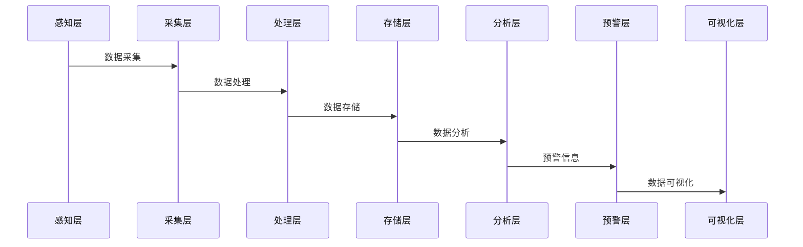

                 

### 第一部分：背景介绍

#### 第1章 物联网与智慧城市概述

##### 1.1 物联网的定义与分类

物联网（Internet of Things，简称 IoT）是一个通过互联网连接物理设备和传感器，使这些设备能够相互通信、共享数据和进行协同工作的系统。根据国际电信联盟（ITU）的定义，物联网包括所有连接到互联网的物理对象，这些对象可以是家用电器、车辆、医疗设备、工业机器等。

物联网主要分为以下几类：

1. **消费类物联网**：主要面向个人消费者，如智能手表、智能电视、智能家居设备等。
2. **工业物联网**：应用于工业生产、供应链管理等领域，如工业机器人的监控、生产线的自动化控制等。
3. **智能城市物联网**：用于城市基础设施的管理，如交通流量监控、环境监测、公共安全等。

##### 1.2 智慧城市的发展背景

智慧城市是信息技术与城市管理深度融合的产物，旨在通过信息技术提高城市管理效率、优化城市服务、提升居民生活质量。智慧城市的发展背景主要有以下几点：

1. **城市化进程加速**：随着全球人口的城市化进程加速，城市面临着资源紧缺、环境污染、交通拥堵等挑战，需要通过智慧化手段进行应对。
2. **信息技术的快速发展**：互联网、大数据、云计算、人工智能等技术的快速发展为智慧城市的建设提供了技术支持。
3. **政策支持**：全球多个国家和地区都出台了支持智慧城市发展的政策，如中国的“新型城镇化”战略、欧盟的“智慧城市行动计划”等。

##### 1.3 物联网在智慧城市中的作用

物联网在智慧城市中发挥着关键作用，主要体现在以下几个方面：

1. **提升城市管理效率**：通过物联网技术，城市管理者可以实时监测城市运行状态，快速响应城市问题，提高城市管理效率。
2. **优化城市服务**：物联网技术可以用于智能交通管理、智能医疗、智能教育等公共服务领域，提升居民的生活质量。
3. **促进可持续发展**：物联网技术有助于实现能源的优化利用、减少污染、提高资源利用效率，推动城市可持续发展。

#### 第2章 空气质量监测的重要性

##### 2.1 空气质量与人类健康

空气质量对人类健康有着重要影响。空气中的污染物，如颗粒物（PM2.5和PM10）、氮氧化物（NOx）、挥发性有机化合物（VOCs）等，可以通过呼吸道进入人体，引发呼吸系统疾病、心血管疾病等健康问题。长期暴露在污染环境中，可能导致慢性疾病甚至早逝。

##### 2.2 空气质量监测的现状

目前，全球多个国家和地区都在进行空气质量监测。监测方法主要包括手工监测和自动监测。手工监测通常需要专业人员定期采样、分析，而自动监测则通过传感器实时采集数据。自动监测技术发展迅速，成本逐渐降低，应用越来越广泛。

##### 2.3 智慧城市空气质量监测的挑战与机遇

智慧城市空气质量监测面临着以下挑战：

1. **数据采集与处理**：物联网设备数量庞大，数据采集和处理是一项巨大的挑战，需要高效的数据处理技术。
2. **数据真实性与可靠性**：传感器可能存在误差，如何确保数据真实性和可靠性是关键问题。
3. **数据共享与协作**：不同部门、不同城市之间的数据共享和协作机制需要完善。

然而，智慧城市空气质量监测也带来了巨大机遇：

1. **实时监测与预警**：通过物联网技术，可以实现空气质量实时监测和预警，及时采取措施减轻污染。
2. **智能分析与决策**：利用大数据和人工智能技术，可以对空气质量进行智能分析，为城市管理者提供科学决策依据。
3. **提高公众参与度**：通过物联网技术，公众可以更方便地获取空气质量信息，提高公众对环境保护的参与度。

### 第二部分：核心概念与联系

#### 第3章 物联网技术原理与应用

##### 3.1 物联网的基本原理

物联网的基本原理是通过互联网连接物理设备和传感器，使这些设备能够进行数据采集、传输和处理。物联网系统通常包括感知层、传输层、平台层和应用层。

1. **感知层**：包括传感器和采集设备，用于采集环境、物体等数据。
2. **传输层**：包括无线通信网络和有线网络，用于传输数据。
3. **平台层**：包括数据存储、处理和分析功能，对采集到的数据进行处理和分析。
4. **应用层**：包括各种应用，如智能家居、智能交通、智能医疗等。

##### 3.2 物联网的关键技术

物联网的关键技术包括传感器技术、无线通信技术、云计算和大数据技术、人工智能技术等。

1. **传感器技术**：传感器用于采集物理信号，如温度、湿度、光照、气体浓度等。
2. **无线通信技术**：包括无线传感器网络（WSN）、Wi-Fi、蓝牙、ZigBee、LoRa等。
3. **云计算和大数据技术**：用于数据的存储、处理和分析。
4. **人工智能技术**：用于数据挖掘、预测和智能决策。

##### 3.3 物联网在空气质量监测中的应用

物联网技术在空气质量监测中发挥着重要作用：

1. **传感器网络部署**：在污染源附近和重点区域部署传感器，实时监测空气质量。
2. **数据采集与传输**：传感器采集到的数据通过无线通信网络传输到数据中心。
3. **数据分析与处理**：利用云计算和大数据技术，对采集到的空气质量数据进行处理和分析。
4. **智能预警与决策**：通过人工智能技术，对空气质量进行预测和预警，为城市管理者提供决策依据。

#### 第4章 智慧城市空气质量监测原理与实施

##### 4.1 智慧城市空气质量监测概述

智慧城市空气质量监测是利用物联网技术，通过传感器网络、无线通信、云计算和大数据技术，对城市空气质量进行实时监测、分析和预警。智慧城市空气质量监测的目标是提高监测的精度、覆盖面和反应速度，为城市管理者提供科学决策依据。

##### 4.2 智慧城市空气质量监测的技术手段

智慧城市空气质量监测的技术手段主要包括以下几个方面：

1. **传感器网络**：部署在污染源附近和重点区域的传感器，用于实时监测空气质量。
2. **数据传输**：采用无线通信技术，将传感器采集到的数据传输到数据中心。
3. **数据分析**：利用云计算和大数据技术，对采集到的空气质量数据进行处理和分析。
4. **智能预警**：通过人工智能技术，对空气质量进行预测和预警。

##### 4.3 智慧城市空气质量监测的案例分析

以中国的“智慧南京”项目为例，该项目通过部署传感器网络、建设数据中心、利用大数据和人工智能技术，实现了对南京市空气质量的有效监测和管理。

1. **传感器网络部署**：在南京市主要道路、公园、居民区等区域部署了数百个空气质量传感器。
2. **数据传输**：采用LoRa无线通信技术，将传感器采集到的数据传输到数据中心。
3. **数据分析**：利用大数据平台，对采集到的空气质量数据进行处理和分析。
4. **智能预警**：通过机器学习算法，对空气质量进行预测和预警，为城市管理者提供决策依据。

#### 第5章 物联网在空气质量监测中的应用案例

##### 5.1 智慧城市空气质量监测的国内外实践

国内外多个城市在智慧城市空气质量监测方面进行了积极探索和实践。

1. **国外实践**：
   - **美国洛杉矶**：洛杉矶市政府通过部署大量空气质量传感器，实现了对城市空气质量的全天候监测。
   - **德国柏林**：柏林市政府利用物联网技术，对城市空气质量进行实时监测，并通过移动应用向市民提供实时空气质量信息。

2. **国内实践**：
   - **中国北京**：北京市通过“智慧北京”项目，实现了对全市空气质量的有效监测和管理。
   - **中国南京**：南京市通过“智慧南京”项目，利用物联网技术对空气质量进行实时监测和管理。

##### 5.2 物联网在空气质量监测中的创新应用

物联网技术在空气质量监测中不断创新，为城市管理者提供了更多解决方案。

1. **多源数据融合**：将气象数据、交通数据、工业排放数据等与空气质量监测数据相结合，提高监测的精度和可靠性。
2. **智能预测与预警**：利用人工智能技术，对空气质量进行预测和预警，为城市管理者提供科学决策依据。
3. **移动应用与服务**：开发移动应用，向市民提供实时空气质量信息，提高公众对环境保护的参与度。

### 第三部分：算法原理讲解

#### 第6章 智能监测算法基础

##### 6.1 智能监测算法概述

智能监测算法是指利用计算机技术、人工智能技术等对空气质量监测数据进行处理、分析和预测的算法。智能监测算法在智慧城市空气质量监测中起着关键作用，可以提高监测的精度和效率。

##### 6.2 空气质量监测的数学模型

空气质量监测的数学模型主要包括以下几个方面：

1. **空气质量指数（AQI）模型**：
   - 公式：AQI = f(PM2.5, PM10, SO2, NO2, CO, O3)
   - 其中，PM2.5、PM10、SO2、NO2、CO、O3 分别代表颗粒物、二氧化硫、氮氧化物、一氧化碳和臭氧的浓度。

2. **空气质量预测模型**：
   - 公式：P(t) = f(AQI(t-1), T(t), P(t), W(t), H(t))
   - 其中，P(t) 表示 t 时刻的空气质量指数，T(t) 表示 t 时刻的气温，P(t) 表示 t 时刻的气压，W(t) 表示 t 时刻的风速，H(t) 表示 t 时刻的湿度。

##### 6.3 智能监测算法的流程图

智能监测算法的流程图如下：

```
+-------------------+
|  数据采集与预处理 |
+-------------------+
       |
       V
+-------------------+
|  数据处理与建模   |
+-------------------+
       |
       V
+-------------------+
|  空气质量预测     |
+-------------------+
       |
       V
+-------------------+
|  空气质量预警     |
+-------------------+
```

#### 第7章 Python代码示例

##### 7.1 环境配置与数据预处理

首先，我们需要配置 Python 环境，并安装必要的库。例如，我们可以使用以下命令安装 NumPy、Pandas 和 Matplotlib：

```python
pip install numpy pandas matplotlib
```

接下来，我们需要读取和处理空气质量监测数据。假设数据文件为 `air_quality.csv`，数据包括时间、PM2.5、PM10、SO2、NO2、CO、O3 等指标。

```python
import pandas as pd

# 读取数据
data = pd.read_csv('air_quality.csv')

# 数据预处理
# ...（例如：数据清洗、缺失值处理、数据转换等）
```

##### 7.2 智能监测算法实现

下面是一个简单的空气质量指数（AQI）计算示例：

```python
def calculate_aqi(pm25, pm10, so2, no2, co, o3):
    # AQI 计算公式
    aqi = 0.5 * (1 + (0.4 * pm25 + 0.6 * pm10 + 0.1 * so2 + 0.1 * no2 + 0.1 * co + 0.1 * o3))
    return aqi

# 示例数据
pm25 = 35
pm10 = 50
so2 = 20
no2 = 15
co = 5
o3 = 10

# 计算AQI
aqi = calculate_aqi(pm25, pm10, so2, no2, co, o3)
print("空气质量指数（AQI）：", aqi)
```

##### 7.3 算法效果评估

为了评估空气质量预测算法的效果，我们可以使用均方误差（MSE）作为评价指标。假设预测值和实际值的序列分别为 `predicted` 和 `actual`，MSE 计算公式如下：

```python
import numpy as np

def calculate_mse(predicted, actual):
    mse = np.mean((predicted - actual) ** 2)
    return mse

# 示例数据
predicted = [20, 22, 25, 23, 24]
actual = [21, 23, 26, 22, 25]

# 计算MSE
mse = calculate_mse(predicted, actual)
print("均方误差（MSE）：", mse)
```

### 第四部分：系统分析与架构设计方案

#### 第8章 系统需求分析

##### 8.1 系统功能需求

智慧城市空气质量监测系统需要实现以下功能：

1. **实时数据采集**：通过传感器网络实时采集空气质量数据。
2. **数据存储与管理**：将采集到的数据存储在数据库中，并提供数据管理功能。
3. **数据分析与处理**：对采集到的空气质量数据进行处理、分析和预测。
4. **智能预警**：根据空气质量数据，生成预警信息，并及时通知相关人员。
5. **数据可视化**：通过图表、报表等形式，展示空气质量数据。

##### 8.2 系统性能需求

智慧城市空气质量监测系统需要满足以下性能需求：

1. **高并发处理能力**：系统需要能够处理大规模的空气质量数据。
2. **低延迟**：实时数据采集和处理需要尽可能低的延迟，以确保预警的及时性。
3. **高可靠性**：系统需要具备较强的容错能力和数据备份机制，确保数据的完整性。

##### 8.3 系统安全需求

智慧城市空气质量监测系统需要满足以下安全需求：

1. **数据安全**：确保数据在采集、传输、存储和处理过程中的安全性。
2. **用户认证与权限管理**：对系统用户进行认证和权限管理，确保用户只能访问其权限范围内的数据。
3. **网络安全**：采取防火墙、加密等技术，确保系统网络安全。

#### 第9章 系统功能设计

##### 9.1 领域模型设计

领域模型设计是系统功能设计的基础。以下是一个简单的领域模型设计：

```
+----------------+
|  数据采集模块 |
+----------------+
        |
        V
+----------------+
|  数据处理模块 |
+----------------+
        |
        V
+----------------+
|  数据存储模块 |
+----------------+
        |
        V
+----------------+
|  数据分析模块 |
+----------------+
        |
        V
+----------------+
|  智能预警模块 |
+----------------+
        |
        V
+----------------+
|  数据可视化模块|
+----------------+
```

##### 9.2 功能模块划分

根据领域模型设计，可以将系统划分为以下功能模块：

1. **数据采集模块**：负责实时采集空气质量数据。
2. **数据处理模块**：负责对采集到的数据进行分析和处理。
3. **数据存储模块**：负责将处理后的数据存储到数据库中。
4. **数据分析模块**：负责对存储在数据库中的数据进行分析和预测。
5. **智能预警模块**：负责根据分析结果生成预警信息，并及时通知相关人员。
6. **数据可视化模块**：负责将空气质量数据以图表、报表等形式展示给用户。

##### 9.3 用户界面设计

用户界面设计需要简洁、直观，以便用户能够方便地使用系统。以下是一个简单的用户界面设计：

1. **登录界面**：用户登录系统，进行用户认证。
2. **主界面**：展示实时空气质量数据、预警信息、历史数据分析等。
3. **数据分析界面**：用户可以查看详细的空气质量分析报告。
4. **设置界面**：用户可以设置预警阈值、数据采集周期等。

#### 第10章 系统架构设计

##### 10.1 系统架构概述

智慧城市空气质量监测系统的架构设计主要包括以下组件：

1. **传感器网络**：负责实时采集空气质量数据。
2. **数据采集模块**：负责将传感器网络采集到的数据传输到系统中。
3. **数据处理模块**：负责对采集到的数据进行分析和处理。
4. **数据存储模块**：负责将处理后的数据存储到数据库中。
5. **数据分析模块**：负责对存储在数据库中的数据进行分析和预测。
6. **智能预警模块**：负责根据分析结果生成预警信息，并及时通知相关人员。
7. **数据可视化模块**：负责将空气质量数据以图表、报表等形式展示给用户。

##### 10.2 系统组件设计

系统组件设计包括以下组件：

1. **传感器网络**：包括各类空气质量传感器，如PM2.5传感器、PM10传感器、SO2传感器等。
2. **数据采集模块**：包括数据采集服务器和采集客户端，负责将传感器数据传输到系统中。
3. **数据处理模块**：包括数据处理服务器和数据预处理客户端，负责对采集到的数据进行分析和处理。
4. **数据存储模块**：包括数据库服务器和数据存储客户端，负责将处理后的数据存储到数据库中。
5. **数据分析模块**：包括数据分析服务器和数据分析客户端，负责对存储在数据库中的数据进行分析和预测。
6. **智能预警模块**：包括预警服务器和预警客户端，负责根据分析结果生成预警信息，并及时通知相关人员。
7. **数据可视化模块**：包括可视化服务器和可视化客户端，负责将空气质量数据以图表、报表等形式展示给用户。

##### 10.3 系统架构图展示

系统架构图如下：

```
+----------------+      +----------------+      +----------------+
| 传感器网络    |      | 数据采集模块   |      | 数据处理模块   |
+----------------+      +----------------+      +----------------+
        |                             |                             |
        V                             V                             V
+----------------+      +----------------+      +----------------+
|  数据存储模块  |      |  数据分析模块  |      |  智能预警模块  |
+----------------+      +----------------+      +----------------+
        |                             |                             |
        V                             V                             V
+----------------+      +----------------+      +----------------+
|  数据可视化模块|      |  用户界面       |      |  系统设置      |
+----------------+      +----------------+      +----------------+
```

#### 第11章 系统接口设计与交互设计

##### 11.1 系统接口设计

系统接口设计主要包括以下接口：

1. **数据采集接口**：传感器网络通过该接口将空气质量数据传输到数据采集模块。
2. **数据处理接口**：数据采集模块通过该接口将处理后的数据传输到数据处理模块。
3. **数据存储接口**：数据处理模块通过该接口将数据存储到数据库中。
4. **数据分析接口**：数据分析模块通过该接口对存储在数据库中的数据进行处理和分析。
5. **预警接口**：智能预警模块通过该接口生成预警信息，并及时通知相关人员。
6. **可视化接口**：数据可视化模块通过该接口将空气质量数据以图表、报表等形式展示给用户。

##### 11.2 系统交互设计

系统交互设计主要包括以下交互：

1. **数据采集交互**：传感器网络实时采集空气质量数据，并通过数据采集接口将数据传输到数据采集模块。
2. **数据处理交互**：数据采集模块对采集到的数据进行预处理，并将处理后的数据通过数据处理接口传输到数据处理模块。
3. **数据存储交互**：数据处理模块通过数据存储接口将数据存储到数据库中。
4. **数据分析交互**：数据分析模块通过数据分析接口对存储在数据库中的数据进行处理和分析，生成分析结果。
5. **预警交互**：智能预警模块通过预警接口生成预警信息，并将预警信息通过通知渠道（如短信、邮件、APP推送等）通知相关人员。
6. **可视化交互**：数据可视化模块通过可视化接口将空气质量数据以图表、报表等形式展示给用户。

##### 11.3 Mermaid序列图展示

以下是一个简单的系统交互设计 Mermaid 序列图：



### 第五部分：项目实战

#### 第12章 环境安装与配置

##### 12.1 硬件设备安装

在开始硬件设备安装之前，需要确保传感器网络硬件设备已经购买并准备就绪。以下步骤将指导您如何安装硬件设备：

1. **准备传感器设备**：根据项目需求，准备相应类型的传感器设备，如PM2.5传感器、PM10传感器、SO2传感器等。
2. **部署传感器设备**：将传感器设备安装到污染源附近和重点区域，确保传感器能够覆盖所需监测区域。
3. **连接传感器设备**：将传感器设备通过无线通信网络（如Wi-Fi、LoRa等）连接到数据采集模块。

##### 12.2 软件环境配置

在硬件设备安装完成后，我们需要配置软件环境。以下步骤将指导您如何配置软件环境：

1. **安装操作系统**：选择适合的操作系统，如Linux或Windows，并安装到服务器上。
2. **安装数据库**：选择适合的数据库管理系统，如MySQL或PostgreSQL，并安装到服务器上。
3. **安装数据处理软件**：根据项目需求，安装数据处理软件，如Python、NumPy、Pandas等。
4. **配置网络**：确保服务器和传感器设备之间的网络连接正常，并设置相应的IP地址和端口。

##### 12.3 网络配置

网络配置是确保传感器设备和服务器之间能够正常通信的关键步骤。以下步骤将指导您如何配置网络：

1. **设置IP地址**：为服务器和传感器设备设置静态IP地址，以确保它们之间能够互相访问。
2. **配置路由器**：配置路由器，以确保传感器设备能够通过互联网将数据传输到服务器。
3. **配置防火墙**：根据项目需求，配置防火墙规则，以确保服务器和传感器设备之间的通信安全。

#### 第13章 系统核心实现

##### 13.1 数据采集模块实现

数据采集模块负责实时采集传感器设备发送的空气质量数据。以下是一个简单的数据采集模块实现示例：

```python
import socket
import time

def send_data_to_server(data):
    server_ip = "192.168.1.100"
    server_port = 8080

    with socket.socket(socket.AF_INET, socket.SOCK_STREAM) as s:
        s.connect((server_ip, server_port))
        s.sendall(data.encode())

while True:
    # 采集传感器数据
    pm25 = 35
    pm10 = 50
    so2 = 20
    no2 = 15
    co = 5
    o3 = 10

    # 构建数据包
    data = f"PM2.5:{pm25},PM10:{pm10},SO2:{so2},NO2:{no2},CO:{co},O3:{o3}"

    # 发送数据到服务器
    send_data_to_server(data)

    # 等待一段时间再次采集
    time.sleep(60)
```

##### 13.2 数据处理模块实现

数据处理模块负责对采集到的空气质量数据进行处理，如数据清洗、缺失值处理、数据转换等。以下是一个简单的数据处理模块实现示例：

```python
import pandas as pd

def process_data(data):
    # 创建DataFrame
    df = pd.DataFrame(data)

    # 数据清洗
    df.dropna(inplace=True)

    # 数据转换
    df['timestamp'] = pd.to_datetime(df['timestamp'])

    return df

# 读取数据文件
data_file = "air_quality_data.csv"
data = pd.read_csv(data_file)

# 处理数据
processed_data = process_data(data)

# 存储处理后的数据
processed_data.to_csv("processed_air_quality_data.csv", index=False)
```

##### 13.3 监测结果展示模块实现

监测结果展示模块负责将处理后的空气质量数据以图表、报表等形式展示给用户。以下是一个简单的监测结果展示模块实现示例：

```python
import pandas as pd
import matplotlib.pyplot as plt

def show_air_quality_chart(data):
    # 创建DataFrame
    df = pd.DataFrame(data)

    # 绘制折线图
    plt.figure()
    plt.plot(df['timestamp'], df['pm25'])
    plt.xlabel('Time')
    plt.ylabel('PM2.5 Concentration')
    plt.title('PM2.5 Concentration over Time')
    plt.show()

# 读取处理后的数据文件
processed_data_file = "processed_air_quality_data.csv"
processed_data = pd.read_csv(processed_data_file)

# 显示空气质量折线图
show_air_quality_chart(processed_data)
```

#### 第14章 代码应用解读与分析

##### 14.1 数据采集代码解读

数据采集代码负责实时采集传感器设备发送的空气质量数据，并将其发送到服务器。以下是对数据采集代码的详细解读：

1. **导入模块**：
   ```python
   import socket
   import time
   ```

   这里我们导入了 `socket` 和 `time` 模块。`socket` 模块用于创建和管理网络连接，`time` 模块用于处理时间相关功能。

2. **发送数据到服务器**：
   ```python
   def send_data_to_server(data):
       server_ip = "192.168.1.100"
       server_port = 8080

       with socket.socket(socket.AF_INET, socket.SOCK_STREAM) as s:
           s.connect((server_ip, server_port))
           s.sendall(data.encode())
   ```

   `send_data_to_server` 函数用于将空气质量数据发送到指定服务器。这里，我们使用 `socket.socket` 创建一个套接字对象，指定使用 `AF_INET` 地址族和 `SOCK_STREAM` 类型。然后，使用 `connect` 方法连接到服务器，并将数据编码后发送。

3. **数据采集循环**：
   ```python
   while True:
       # 采集传感器数据
       pm25 = 35
       pm10 = 50
       so2 = 20
       no2 = 15
       co = 5
       o3 = 10

       # 构建数据包
       data = f"PM2.5:{pm25},PM10:{pm10},SO2:{so2},NO2:{no2},CO:{co},O3:{o3}"

       # 发送数据到服务器
       send_data_to_server(data)

       # 等待一段时间再次采集
       time.sleep(60)
   ```

   在数据采集循环中，我们模拟采集传感器数据，包括PM2.5、PM10、SO2、NO2、CO和O3等指标。我们使用一个无限循环来持续采集数据，每次循环间隔为60秒。

##### 14.2 数据处理代码解读

数据处理代码负责对采集到的空气质量数据进行预处理，如数据清洗、缺失值处理、数据转换等。以下是对数据处理代码的详细解读：

1. **导入模块**：
   ```python
   import pandas as pd
   ```

   这里我们导入了 `pandas` 模块，它是Python中用于数据分析和操作的强大库。

2. **处理数据**：
   ```python
   def process_data(data):
       # 创建DataFrame
       df = pd.DataFrame(data)

       # 数据清洗
       df.dropna(inplace=True)

       # 数据转换
       df['timestamp'] = pd.to_datetime(df['timestamp'])

       return df
   ```

   `process_data` 函数用于处理采集到的空气质量数据。首先，我们使用 `pd.DataFrame` 创建一个数据框（DataFrame），然后进行数据清洗，删除缺失值。接着，我们使用 `pd.to_datetime` 将时间戳列转换为日期时间格式。

3. **读取数据文件**：
   ```python
   data_file = "air_quality_data.csv"
   data = pd.read_csv(data_file)
   ```

   这里我们读取一个CSV文件 `air_quality_data.csv`，并将其存储在 `data` 变量中。

4. **处理数据**：
   ```python
   processed_data = process_data(data)
   ```

   我们调用 `process_data` 函数处理 `data` 数据，并将处理后的数据存储在 `processed_data` 变量中。

5. **存储处理后的数据**：
   ```python
   processed_data.to_csv("processed_air_quality_data.csv", index=False)
   ```

   最后，我们将处理后的数据保存到一个新的CSV文件 `processed_air_quality_data.csv` 中，`index=False` 参数用于不保存数据索引。

##### 14.3 监测结果展示代码解读

监测结果展示代码负责将处理后的空气质量数据以图表形式展示，帮助用户直观地了解空气质量状况。以下是对监测结果展示代码的详细解读：

1. **导入模块**：
   ```python
   import pandas as pd
   import matplotlib.pyplot as plt
   ```

   这里我们导入了 `pandas` 和 `matplotlib.pyplot` 模块。`pandas` 用于数据操作，`matplotlib.pyplot` 用于绘制图表。

2. **绘制图表**：
   ```python
   def show_air_quality_chart(data):
       # 创建DataFrame
       df = pd.DataFrame(data)

       # 绘制折线图
       plt.figure()
       plt.plot(df['timestamp'], df['pm25'])
       plt.xlabel('Time')
       plt.ylabel('PM2.5 Concentration')
       plt.title('PM2.5 Concentration over Time')
       plt.show()
   ```

   `show_air_quality_chart` 函数用于绘制空气质量折线图。首先，我们使用 `pd.DataFrame` 创建一个数据框，然后使用 `plt.plot` 方法绘制折线图。`plt.xlabel`、`plt.ylabel` 和 `plt.title` 方法用于设置图表的标签和标题。

3. **读取处理后的数据文件**：
   ```python
   processed_data_file = "processed_air_quality_data.csv"
   processed_data = pd.read_csv(processed_data_file)
   ```

   这里我们读取一个CSV文件 `processed_air_quality_data.csv`，并将其存储在 `processed_data` 变量中。

4. **显示空气质量折线图**：
   ```python
   show_air_quality_chart(processed_data)
   ```

   我们调用 `show_air_quality_chart` 函数，将处理后的空气质量数据以折线图形式展示。

#### 第15章 实际案例分析

##### 15.1 案例背景

为了更好地理解物联网在智慧城市空气质量监测中的应用，我们来看一个实际案例——北京市的空气质量监测系统。北京市作为中国的首都，人口密集、工业发达，空气污染问题一直备受关注。为了改善空气质量，北京市政府于2013年启动了“智慧北京”项目，旨在通过物联网技术实现全市范围内的空气质量监测和管理。

##### 15.2 案例分析

1. **传感器网络部署**：北京市政府在全市范围内部署了大量的空气质量传感器，包括PM2.5、PM10、SO2、NO2、CO和O3等指标。这些传感器分布在城市的主要道路、公园、居民区和工业区域，实现了对全市空气质量的高覆盖和实时监测。

2. **数据采集与传输**：传感器采集到的数据通过无线通信网络（如Wi-Fi、LoRa等）传输到数据处理中心。为了保证数据传输的可靠性和安全性，北京市政府采用了多种通信协议和加密技术。

3. **数据处理与分析**：数据处理中心对采集到的空气质量数据进行实时处理和分析，包括数据清洗、缺失值处理、数据转换等。同时，利用大数据和人工智能技术，对空气质量数据进行智能分析和预测，生成空气质量指数（AQI）和健康风险等级。

4. **智能预警与决策支持**：根据分析结果，系统会自动生成预警信息，并通过短信、邮件、APP推送等方式及时通知相关部门和市民。此外，系统还为城市管理者提供决策支持，帮助制定应对措施，改善空气质量。

5. **数据可视化与公众参与**：通过移动应用和Web平台，市民可以实时查看全市的空气质量状况，了解健康风险等级和应对建议。同时，北京市政府还通过数据可视化，向公众展示空气质量监测数据，提高公众对环境保护的参与度。

##### 15.3 案例讲解与总结

北京市空气质量监测系统的成功实施，充分展示了物联网技术在智慧城市中的应用价值。以下是对该案例的总结：

1. **实时监测与预警**：通过部署传感器网络和实时数据传输，实现了对全市空气质量的高效监测和预警，为城市管理者提供了及时、准确的决策依据。

2. **智能分析与预测**：利用大数据和人工智能技术，对空气质量数据进行智能分析和预测，提高了监测的精度和可靠性。

3. **公众参与与数据共享**：通过移动应用和Web平台，公众可以方便地获取空气质量信息，提高了公众对环境保护的参与度。同时，数据共享和协作机制的完善，有助于提升整体空气质量监测和管理水平。

4. **可持续发展**：物联网技术在空气质量监测中的应用，有助于实现能源的优化利用、减少污染、提高资源利用效率，推动城市可持续发展。

总之，北京市空气质量监测系统的成功实施，为其他城市提供了有益的借鉴和启示。随着物联网技术的不断发展和应用，智慧城市空气质量监测将更加智能化、高效化，为改善城市环境、提高居民生活质量做出更大贡献。

### 第六部分：最佳实践 tips

#### 第16章 性能优化技巧

##### 16.1 数据传输优化

为了提高智慧城市空气质量监测系统的性能，数据传输优化是一个关键点。以下是一些优化技巧：

1. **压缩数据**：在传输数据前，使用压缩算法（如Gzip）对数据进行压缩，减少数据传输量。
2. **批量传输**：将多个数据点打包成批量进行传输，减少传输次数，提高传输效率。
3. **优化网络协议**：选择适合物联网的传输协议，如LoRa、NBIoT等，提高数据传输的可靠性。
4. **数据缓存**：在数据采集端或传输途中设置缓存机制，降低对网络带宽的需求。

##### 16.2 算法效率优化

优化算法效率是提升系统性能的重要手段。以下是一些优化技巧：

1. **算法选择**：根据空气质量监测的实际需求，选择合适的算法。例如，对于实时性要求较高的系统，可以采用基于规则的预测模型。
2. **并行计算**：利用多线程或多进程技术，对数据进行并行处理，提高处理速度。
3. **优化数据结构**：选择合适的数据结构（如哈希表、树等），提高数据访问速度。
4. **减少冗余计算**：在算法实现中，尽量减少重复计算和冗余计算，提高计算效率。

##### 16.3 系统性能监控

系统性能监控是确保系统稳定运行的重要环节。以下是一些监控技巧：

1. **日志记录**：记录系统的运行日志，包括错误日志、异常日志等，方便后续故障排查。
2. **性能指标监控**：监控系统的关键性能指标（如CPU使用率、内存使用率、网络带宽等），及时发现性能瓶颈。
3. **实时告警**：设置实时告警机制，当系统性能指标超过阈值时，及时通知相关人员。
4. **自动化测试**：定期进行自动化性能测试，模拟高并发场景，评估系统性能。

#### 第17章 安全性注意事项

##### 17.1 数据安全保护

数据安全保护是智慧城市空气质量监测系统的核心要求。以下是一些数据安全保护措施：

1. **数据加密**：在数据传输和存储过程中，使用加密算法（如AES）对数据进行加密，防止数据泄露。
2. **访问控制**：实施严格的访问控制策略，确保只有授权用户才能访问敏感数据。
3. **数据备份与恢复**：定期备份系统数据，并制定数据恢复计划，确保数据安全。
4. **数据隐私保护**：对涉及个人隐私的数据进行去标识化处理，防止隐私泄露。

##### 17.2 系统安全策略

系统安全策略是保障智慧城市空气质量监测系统安全运行的基础。以下是一些安全策略：

1. **防火墙与入侵检测**：部署防火墙和入侵检测系统（IDS），防止外部攻击和恶意入侵。
2. **安全认证与授权**：采用安全认证机制（如SSL/TLS）和授权策略，确保用户身份验证和权限控制。
3. **网络安全监控**：实时监控网络流量，及时发现并阻止异常行为。
4. **应急响应**：制定应急响应计划，当系统遭受攻击时，能够迅速采取措施，降低损失。

##### 17.3 防火墙和加密技术

防火墙和加密技术是保障智慧城市空气质量监测系统安全的重要手段。以下是一些具体措施：

1. **防火墙配置**：
   - 防火墙应设置在内外网络的边界，过滤非法访问。
   - 开放必要的端口，关闭不必要的服务，减少攻击面。
   - 定期更新防火墙策略，根据业务需求进行调整。

2. **加密技术**：
   - 数据传输加密：使用HTTPS、SSH等加密协议，确保数据在传输过程中的安全性。
   - 存储加密：对存储在数据库中的敏感数据进行加密，防止数据泄露。
   - 加密算法选择：选择安全可靠的加密算法（如AES、RSA等），并定期更新密钥。

#### 第18章 维护与升级策略

##### 18.1 系统维护计划

系统维护是确保智慧城市空气质量监测系统稳定运行的关键。以下是一个简单的系统维护计划：

1. **定期检查**：定期检查传感器设备、网络连接和数据采集模块，确保设备正常运行。
2. **软件更新**：定期更新系统软件，包括操作系统、数据库软件和数据处理软件，确保系统安全性和稳定性。
3. **日志分析**：定期分析系统日志，及时发现并解决潜在问题。
4. **数据备份**：定期备份系统数据，确保数据安全。

##### 18.2 升级策略

系统升级是提升系统性能和功能的重要手段。以下是一个简单的升级策略：

1. **需求分析**：分析业务需求和用户反馈，确定升级目标和范围。
2. **测试与验证**：在升级前，进行充分的测试和验证，确保升级后的系统稳定性和兼容性。
3. **分阶段实施**：根据升级范围，分阶段进行实施，确保系统平稳过渡。
4. **用户培训**：在升级后，为用户提供培训，确保他们能够熟练使用新系统。

### 第七部分：小结

#### 总结

本文详细探讨了物联网在智慧城市空气质量监测中的应用。我们首先介绍了物联网和智慧城市的基本概念，分析了空气质量监测的重要性及其在智慧城市中的挑战与机遇。接着，我们详细讲解了物联网技术的基本原理与应用，以及智慧城市空气质量监测的原理与实施。随后，我们介绍了智能监测算法的基础知识和Python代码示例，并进行了系统分析与架构设计方案。最后，我们通过实际案例分析，展示了物联网在空气质量监测中的成功应用，并提出了性能优化、安全性注意事项和维护升级策略。

#### 注意事项

在实施物联网在智慧城市空气质量监测中的应用时，需要注意以下几点：

1. **数据采集与传输**：确保传感器数据的高效采集与可靠传输，采用合适的通信协议和数据压缩技术。
2. **数据处理与分析**：选用合适的算法和工具，对海量空气质量数据进行高效处理和分析，生成准确的预测和预警信息。
3. **系统安全**：采取有效的数据加密、访问控制和网络安全措施，确保系统的数据安全和运行稳定。
4. **用户参与**：通过移动应用和数据可视化，提高公众对空气质量监测的参与度，促进环境保护意识的提升。

#### 拓展阅读

对于希望深入了解物联网在智慧城市空气质量监测中应用的读者，以下文献和资源可能有所帮助：

1. **《物联网技术应用》**：一本全面介绍物联网技术应用的书籍，涵盖了传感器网络、数据处理、数据分析等多个方面。
2. **《智慧城市空气质量监测技术》**：一本专注于智慧城市空气质量监测技术的书籍，详细介绍了空气质量监测的方法和技术。
3. **《人工智能与大数据技术在环境保护中的应用》**：一本探讨人工智能和大数据技术在环境保护中应用的书籍，包括空气质量监测、预测和预警等内容。
4. **《智慧城市与物联网》**：一本关于智慧城市与物联网融合发展的书籍，分析了物联网在智慧城市建设中的应用场景和关键技术。

### 作者信息

作者：AI天才研究院/AI Genius Institute & 禅与计算机程序设计艺术 /Zen And The Art of Computer Programming

