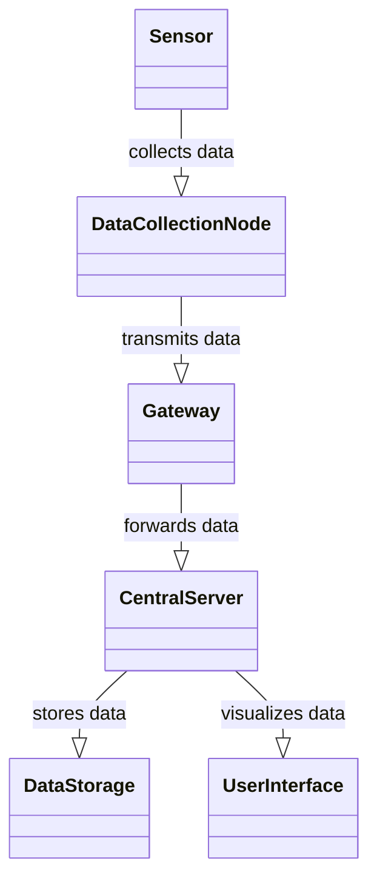
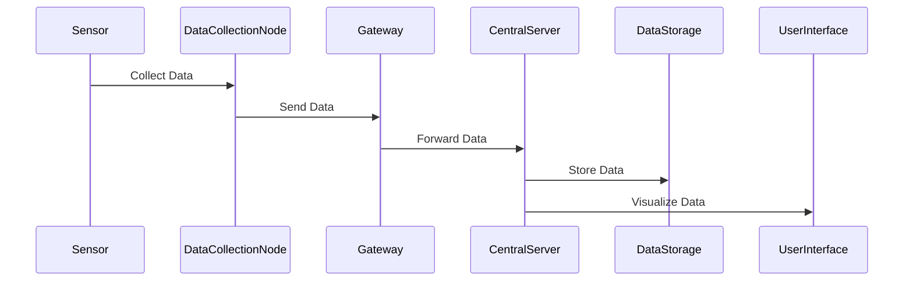

                 

### Introduction to the Background and Core Concepts of IoT and Smart Cities

#### 1.1 Introduction to Internet of Things

##### 1.1.1 Background and Development of Internet of Things

The concept of the Internet of Things (IoT) has been around for several decades, but it has gained significant traction in recent years. The idea behind IoT is to connect various devices, systems, and physical objects to the internet to enable communication and data exchange. This connection empowers these devices to collect and share data, leading to improved efficiency, automation, and innovation across various sectors.

The development of IoT can be traced back to the early 1980s when a Coca-Cola machine at Carnegie Mellon University was connected to the internet, marking one of the first instances of IoT. Over the years, advancements in wireless communication technologies, microchips, and sensors have accelerated the growth of IoT, making it a pervasive part of our daily lives.

##### 1.1.2 Core Technologies and Components of Internet of Things

IoT is built upon several core technologies and components that enable seamless connectivity, data collection, and communication. These include:

- **Sensors**: Sensors are the primary instruments for collecting data from the physical environment. They can measure various parameters such as temperature, humidity, motion, light, and air quality.

- **Wireless Networks**: Wireless networks, such as Wi-Fi, Bluetooth, and cellular networks, provide the infrastructure for devices to connect to the internet and communicate with each other.

- ** actuators**: Actuators are devices that perform actions based on input signals. They are often used in IoT systems to control physical processes, such as opening doors or adjusting lighting.

- ** gateways**: Gateways are devices that connect different types of networks, allowing data to flow between devices and systems. They play a crucial role in IoT by facilitating communication between sensors, actuators, and cloud services.

- **Cloud Computing**: Cloud computing provides the storage and processing power needed to manage and analyze the vast amounts of data generated by IoT devices. It also enables remote access and control of IoT devices.

- **Data Analytics**: Data analytics tools and algorithms are used to process and interpret the data collected by IoT devices. This data can be used to gain insights, make predictions, and optimize processes.

#### 1.2 Concept and Characteristics of Smart Cities

##### 1.2.1 Definition and Evolution of Smart Cities

A smart city is a urban area that uses various technologies and data-driven approaches to enhance the quality of life, efficiency, and sustainability of its inhabitants. The concept of smart cities has evolved over time, with early initiatives focusing on optimizing infrastructure and services. However, modern smart cities incorporate advanced technologies such as IoT, artificial intelligence, and big data analytics to create a more interconnected and intelligent urban environment.

The development of smart cities can be traced back to the late 20th century, with early examples including Singapore's Smart Nation initiative and Barcelona's supercomputing infrastructure. Today, numerous cities around the world are embracing smart city technologies to address challenges such as traffic congestion, energy consumption, and environmental pollution.

##### 1.2.2 Key Characteristics and Components of Smart Cities

Smart cities are characterized by several key components and attributes:

- **Interconnectivity**: Smart cities leverage IoT technologies to create a highly interconnected environment where devices, systems, and citizens can communicate and collaborate seamlessly.

- **Data-Driven Decision Making**: Smart cities collect and analyze vast amounts of data from various sources to inform decision-making processes and optimize city operations.

- **Enhanced Quality of Life**: Smart cities prioritize the well-being of their inhabitants, providing better healthcare, education, transportation, and public safety services.

- **Sustainability**: Smart cities focus on sustainable development, incorporating renewable energy sources, green infrastructure, and efficient resource management practices.

- **Resilience**: Smart cities are designed to be resilient to natural disasters and other emergencies, with robust infrastructure and disaster management systems in place.

#### 1.3 Overview of Air Quality Monitoring in Smart Cities

##### 1.3.1 Challenges and Importance of Air Quality Monitoring

Air quality monitoring is a critical component of smart cities, as poor air quality can have severe health consequences for inhabitants. Challenges in air quality monitoring include:

- **Urban Pollution**: High levels of pollution in urban areas, particularly from vehicle emissions and industrial activities, contribute to poor air quality.

- **Diversity of Pollutants**: Air quality can vary significantly across different areas within a city, with different pollutants such as nitrogen dioxide, sulfur dioxide, and particulate matter posing different risks.

- **Temporal and Spatial Variability**: Air quality can change rapidly over time and vary significantly across different locations, making it difficult to monitor and manage.

Despite these challenges, air quality monitoring is of paramount importance in smart cities. By collecting and analyzing data on air quality, cities can:

- **Identify Pollution Sources**: Identify the sources of pollution and implement targeted measures to reduce emissions.

- **Improve Public Health**: Provide early warnings and real-time information to help citizens make informed decisions about their health.

- **Optimize Urban Planning**: Inform urban planning and infrastructure development to improve air quality and promote sustainable living.

- **Support Policy Development**: Inform policy development and regulatory measures to address air quality issues effectively.

##### 1.3.2 Current Air Quality Monitoring Methods and Technologies

Several methods and technologies are currently used for air quality monitoring in smart cities:

- **Stationary Monitors**: Traditional stationary air quality monitors are placed at various locations within a city to measure pollutants over time. These monitors provide valuable data for understanding long-term air quality trends.

- **Mobile Monitors**: Mobile air quality monitors are mounted on vehicles or drones to collect real-time data on air quality as they move through different areas of a city. This allows for more dynamic and spatially aware monitoring.

- **IoT Sensors**: IoT sensors, which can be installed on buildings, poles, or other structures, provide continuous, real-time monitoring of air quality. These sensors can measure various pollutants and transmit data to central systems for analysis.

- **Citizen-Reported Data**: Smartphone apps and other platforms allow citizens to report air quality data, providing additional data sources and a more comprehensive view of air quality across a city.

By combining these monitoring methods and technologies, smart cities can achieve a more accurate and comprehensive understanding of air quality, enabling more effective management and improvement of urban environments.

### IoT in Air Quality Monitoring: Technologies and Applications

#### 2.1 IoT Technologies for Air Quality Monitoring

##### 2.1.1 Wireless Sensor Networks in Air Quality Monitoring

Wireless Sensor Networks (WSNs) are a cornerstone of IoT technology and play a crucial role in air quality monitoring in smart cities. WSNs consist of a large number of tiny, low-power sensors that are distributed across an area to collect environmental data. These sensors are capable of detecting various air pollutants, including particulate matter (PM), nitrogen dioxide (NO2), sulfur dioxide (SO2), and ozone (O3), among others.

The primary components of a WSN for air quality monitoring include:

- **Sensors**: These devices capture the concentration levels of different pollutants. They can be highly specialized to detect specific gases or particles or more general-purpose to monitor a wide range of air quality parameters.

- **Data Collection Nodes**: These nodes aggregate the data collected by sensors and transmit it to a central server or gateway. They often have processing capabilities to perform initial data filtering and compression.

- **Gateways**: These devices act as intermediaries between the sensor nodes and the external network, such as the internet. They collect data from multiple nodes and forward it to cloud-based data analytics platforms or other centralized systems.

The working principle of a WSN involves the following steps:

1. **Sensor Data Collection**: Sensors continuously measure the air quality parameters at their respective locations.
2. **Data Aggregation**: Data collection nodes aggregate the sensor data and perform initial processing, such as filtering and compression.
3. **Data Transmission**: The aggregated data is transmitted to the gateway via wireless communication technologies like Wi-Fi, Zigbee, or LoRa.
4. **Data Forwarding**: The gateway sends the data to a central server or cloud platform for further analysis and storage.

##### 2.1.2 Data Collection and Processing in IoT Systems

Effective data collection and processing are essential for the reliability and accuracy of air quality monitoring in IoT systems. Here’s a closer look at the key aspects of data collection and processing:

- **Data Collection Methods**: Sensors collect data at predetermined intervals, which can vary depending on the specific application. For instance, air quality sensors might collect data every few minutes to capture real-time changes or every hour for long-term trend analysis.

- **Data Compression**: Given the large volume of data generated by IoT sensors, data compression techniques are used to reduce the storage and transmission requirements. Methods such as lossless compression (e.g., Huffman coding) and lossy compression (e.g., JPEG) are commonly employed.

- **Data Validation and Cleaning**: Raw sensor data often contains errors and outliers due to various factors such as sensor noise, calibration issues, or environmental interference. Data validation and cleaning techniques are employed to identify and correct these issues, ensuring the quality and reliability of the data.

- **Data Aggregation and Fusion**: Aggregating data from multiple sensors and sources can provide a more comprehensive view of air quality. Techniques such as time-series averaging, moving averages, and regression analysis are used to aggregate and fuse data from different sensors.

- **Real-Time Processing**: IoT systems often require real-time processing of sensor data to provide immediate insights or trigger alerts. Techniques such as edge computing and streaming analytics are employed to perform real-time data processing and analysis at the sensor level or close to the data source.

- **Data Storage and Management**: Efficient data storage and management strategies are critical for handling the large volumes of data generated by IoT systems. Cloud-based storage solutions, distributed databases, and data lakes are commonly used to store and manage IoT data.

By leveraging these technologies and methodologies, IoT systems can collect, process, and analyze air quality data effectively, enabling smart cities to monitor and manage air quality in real-time and make data-driven decisions to improve public health and environmental sustainability.

#### 2.2 Application Scenarios of IoT in Air Quality Monitoring

##### 2.2.1 Urban Air Quality Monitoring Networks

Urban air quality monitoring networks are a key application of IoT technology in smart cities. These networks involve deploying a large number of IoT sensors across various locations within a city to collect real-time air quality data. The data is then transmitted to a central monitoring system for analysis and visualization.

Key features of urban air quality monitoring networks include:

- **Distributed Sensor Deployment**: Sensors are installed at multiple strategic locations throughout the city, including traffic intersections, parks, industrial areas, and residential zones. This ensures comprehensive coverage and accurate representation of air quality across different urban environments.

- **Real-Time Data Collection**: IoT sensors continuously measure air quality parameters such as PM2.5, PM10, NO2, SO2, and O3. The collected data is transmitted to a central system in real-time, enabling quick detection of air quality changes and timely response to pollution events.

- **Centralized Data Analysis**: The central monitoring system aggregates data from all sensors, processes it using advanced analytics techniques, and generates actionable insights. This allows city authorities to identify pollution sources, monitor air quality trends, and implement targeted mitigation measures.

- **Data Visualization**: Real-time air quality data is visualized on dashboards, making it easily accessible to the public and city officials. This promotes transparency and empowers citizens to make informed decisions about their health and environmental activities.

Examples of urban air quality monitoring networks include:

- **Los Angeles, California**: The South Coast Air Quality Management District (SCAQMD) operates a comprehensive network of air quality sensors across Los Angeles County. The data collected is used to enforce regulations, improve air quality, and educate the public about pollution sources and health risks.

- **Beijing, China**: Beijing has deployed a vast network of air quality sensors throughout the city to monitor pollution levels. The data is shared in real-time with the public through an official app and website, helping citizens make informed decisions and reducing the impact of pollution on public health.

##### 2.2.2 Industrial Area Air Quality Monitoring

Monitoring air quality in industrial areas is critical due to the high levels of pollution often generated by manufacturing, processing, and other industrial activities. IoT technology offers effective solutions for monitoring air quality in these settings, providing real-time data and enabling proactive management of pollution.

Key features of industrial area air quality monitoring include:

- **Sensors near Pollution Sources**: Sensors are installed near the sources of pollution, such as industrial facilities, chimneys, and exhaust ducts. This allows for precise monitoring of pollutants emitted directly from these sources.

- **Continuous Monitoring**: IoT sensors continuously measure air quality parameters, including volatile organic compounds (VOCs), sulfur dioxide (SO2), nitrogen dioxide (NO2), and particulate matter (PM). This enables the detection of sudden spikes in pollution levels and rapid response to potential issues.

- **Early Warning Systems**: Industrial air quality monitoring systems often include early warning features that trigger alerts when pollution levels exceed predefined thresholds. These alerts enable prompt intervention to mitigate pollution and prevent health risks to nearby communities.

- **Compliance and Reporting**: Industrial air quality monitoring systems help companies comply with environmental regulations by providing accurate and reliable data on pollutant emissions. This data can be used to generate compliance reports and support environmental impact assessments.

Case studies of industrial area air quality monitoring include:

- **Shanghai Chemical Industry Park, China**: The Shanghai Chemical Industry Park (SCIP) employs an IoT-based air quality monitoring system to monitor emissions from various industrial facilities. The system provides real-time data to park management and local authorities, facilitating the implementation of pollution control measures.

- **Port of Los Angeles, California**: The Port of Los Angeles uses IoT sensors to monitor air quality in and around the port area. The data collected helps the port management optimize operations to reduce emissions and improve air quality.

##### 2.2.3 Road Traffic Air Quality Monitoring

Road traffic is a significant contributor to air pollution, particularly in urban areas. IoT technology can be effectively utilized to monitor air quality in road traffic environments, providing valuable data for managing and mitigating traffic-related pollution.

Key features of road traffic air quality monitoring include:

- **Sensors along Roadways**: IoT sensors are placed along roadways at different locations to capture air quality data from various traffic conditions, including congested and non-congested areas.

- **Real-Time Pollution Monitoring**: Sensors continuously measure air quality parameters such as NO2, PM2.5, and PM10, providing real-time data on pollution levels caused by vehicle emissions.

- **Dynamic Traffic Management**: Real-time air quality data can be used to optimize traffic flow and reduce congestion. For example, traffic signals can be adjusted based on real-time air quality data to minimize idling times and reduce emissions.

- **Travel Time Predictions**: IoT-based air quality monitoring systems can provide real-time travel time predictions based on current traffic conditions and air quality levels. This information can help drivers make informed decisions about their routes and reduce exposure to poor air quality.

Case studies of road traffic air quality monitoring include:

- **Stockholm, Sweden**: Stockholm has implemented an IoT-based air quality monitoring system along its major roads. The system provides real-time data to city authorities, enabling targeted measures to reduce traffic-related pollution.

- **Delhi, India**: The Delhi government has deployed IoT sensors on key roads in the city to monitor air quality. The data collected is used to implement traffic management strategies and inform public transportation planning.

By leveraging IoT technology in urban, industrial, and road traffic environments, smart cities can achieve comprehensive air quality monitoring and take proactive measures to improve air quality, protect public health, and promote sustainable development.

### Case Studies of IoT Applications in Smart City Air Quality Monitoring

#### 2.3.1 London’s Air Quality Monitoring Project

London's Air Quality Monitoring Project is a notable example of how IoT technology is transforming air quality monitoring in smart cities. The project, initiated by the Greater London Authority (GLA), aims to provide accurate and real-time air quality data to inform policy decisions and improve public health outcomes.

**Project Overview:**

The project involves deploying a network of IoT sensors across London to monitor air quality parameters such as nitrogen dioxide (NO2), particulate matter (PM2.5 and PM10), carbon monoxide (CO), and ozone (O3). The sensors are installed at various locations, including roadsides, parks, and near schools, to capture a comprehensive view of air quality across the city.

**Key Features:**

- **Comprehensive Sensor Network:** Over 100 sensors have been deployed throughout London, providing high-resolution data on air quality.
- **Real-Time Data Collection and Transmission:** Sensors collect data every few minutes and transmit it to a central server via wireless communication.
- **Data Analysis and Visualization:** The collected data is processed using advanced analytics techniques and visualized on an interactive map, allowing users to view air quality in real time.
- **Public Access and Transparency:** The project provides a public-facing platform where citizens can access real-time air quality data and gain insights into pollution levels in their neighborhoods.

**Impact:**

The project has had a significant impact on London's approach to air quality management. By providing real-time data and insights into pollution sources and hotspots, the project has helped city authorities implement targeted measures to reduce emissions and improve air quality. For example, the data has been used to identify high-priority areas for traffic management interventions, such as congestion pricing and low-emission zones.

#### 2.3.2 Singapore’s SMART Map Platform

Singapore's SMART Map Platform is another prominent example of IoT applications in air quality monitoring within a smart city. Developed by the National Environmental Agency (NEA), the platform aims to create a comprehensive and integrated air quality monitoring and management system for the city-state.

**Project Overview:**

The SMART Map Platform integrates data from various sources, including IoT sensors, weather stations, and vehicle emissions data. The IoT sensors, installed at over 100 locations across Singapore, measure air quality parameters such as NO2, SO2, PM2.5, and PM10.

**Key Features:**

- **Multi-source Data Integration:** The platform collects data from multiple sources, providing a more holistic view of air quality.
- **Real-Time Data Analytics:** The platform uses advanced analytics to process and analyze real-time air quality data, enabling rapid response to pollution events.
- **Emergency Alert System:** The platform includes an alert system that triggers notifications to authorities and the public when air quality reaches critical levels.
- **Public Engagement:** The platform provides a user-friendly interface for the public to access real-time air quality data and participate in environmental initiatives.

**Impact:**

The SMART Map Platform has enhanced Singapore's ability to monitor and manage air quality effectively. By providing real-time data and insights, the platform has facilitated the implementation of targeted interventions to reduce pollution, such as traffic management measures and public awareness campaigns. The platform's emergency alert system has also improved the city's resilience to sudden spikes in air pollution, ensuring timely and coordinated responses to protect public health.

#### 2.3.3 Barcelona’s Air Quality Management System

Barcelona's Air Quality Management System is an example of a city utilizing IoT technology to address air quality challenges sustainably. The system is part of the larger Barcelona Smart City initiative and involves the deployment of a city-wide network of IoT sensors to monitor air quality.

**Project Overview:**

The Barcelona Air Quality Management System includes over 100 IoT sensors distributed across the city, measuring various air pollutants such as NO2, SO2, CO, and PM2.5. The sensors are installed on rooftops, traffic lights, and street furniture, providing a comprehensive view of air quality across different urban environments.

**Key Features:**

- **Comprehensive Sensor Deployment:** The system covers a wide range of urban areas, including residential, industrial, and traffic zones.
- **Real-Time Data Collection and Visualization:** Real-time air quality data is collected and visualized on a public map, allowing citizens and authorities to track pollution levels.
- **Data-Driven Policy Making:** The system provides valuable data to inform policy decisions and environmental regulations, promoting sustainable urban development.
- **Citizen Engagement:** The platform encourages public participation by providing real-time data and information on air quality, enabling citizens to make informed decisions about their health and activities.

**Impact:**

The Barcelona Air Quality Management System has had a positive impact on the city's air quality management. By providing real-time data and insights, the system has helped city authorities identify pollution sources, implement targeted interventions, and enforce environmental regulations effectively. The system's emphasis on public engagement has also raised awareness about air quality issues, encouraging citizens to adopt more sustainable practices and contribute to improving urban air quality.

These case studies illustrate the transformative potential of IoT technology in smart city air quality monitoring. By providing real-time data and enabling data-driven decision-making, IoT systems are helping cities around the world to improve air quality, protect public health, and promote sustainable urban development.

### Data Analysis and Processing in IoT-Based Air Quality Monitoring

#### 3.1 Data Collection and Storage Strategies

Effective data collection and storage are pivotal to the success of IoT-based air quality monitoring systems. The primary goal of data collection is to ensure the accuracy, timeliness, and completeness of the data, while storage strategies aim to manage the vast volumes of data generated by IoT devices efficiently. Here’s a detailed exploration of data collection methods, sensor data storage solutions, and the associated challenges.

##### 3.1.1 Data Collection Methods and Sensors

Data collection in IoT-based air quality monitoring involves the deployment of various types of sensors that capture different air quality parameters. These sensors can be broadly classified into the following categories:

1. **Gaseous污染物传感器**：These sensors measure the concentration of gases such as nitrogen dioxide (NO2), sulfur dioxide (SO2), carbon monoxide (CO), and ozone (O3). They typically use chemical sensors, electrochemical cells, or optical techniques for gas detection.

2. **颗粒物传感器**：These sensors detect particulate matter (PM), including PM2.5 and PM10. They can use light scattering, filtration, or impedance measurement methods to quantify the size and concentration of particles in the air.

3. **气象传感器**：Meteorological sensors, such as temperature, humidity, and wind speed sensors, provide essential context for interpreting air quality data. They help in understanding the environmental conditions that influence air quality.

4. **多功能传感器**：Some sensors combine the detection of multiple pollutants and meteorological parameters into a single device, simplifying deployment and data integration.

The data collection process typically involves the following steps:

1. **Continuous Monitoring**: IoT sensors are designed to continuously monitor air quality parameters at high frequency (e.g., every minute or few minutes), ensuring real-time data capture.

2. **Data Acquisition**: Sensors collect data and transmit it to a central server or gateway. This data transmission can occur via wireless protocols like Wi-Fi, Bluetooth, LoRa, or cellular networks.

3. **Data Filtering and Preprocessing**: Upon receipt, the data is filtered to remove noise, outliers, and other inconsistencies. This preprocessing step ensures the integrity of the data before it is stored or analyzed.

##### 3.1.2 Data Storage Solutions and Challenges

Storing IoT data requires robust and scalable solutions due to the high volume, velocity, and variety of data generated. Here are some common data storage solutions and the challenges associated with them:

1. **Relational Databases**：Relational databases like MySQL or PostgreSQL are commonly used for storing structured IoT data. They provide strong consistency and query capabilities but can become a bottleneck with high write loads and large datasets.

   - **Challenge**: Scaling relational databases can be complex and expensive as data volume grows.

2. **NoSQL Databases**：NoSQL databases such as MongoDB, Cassandra, and HBase offer scalability and flexibility for handling large volumes of semi-structured and unstructured IoT data.

   - **Challenge**: NoSQL databases may sacrifice consistency for scalability, which can lead to data accuracy issues.

3. **Time-Series Databases**：Time-series databases like InfluxDB and TimescaleDB are specifically designed for storing time-stamped IoT data, offering high write and query performance.

   - **Challenge**: Time-series databases may not support complex querying and analytics out of the box.

4. **Cloud Storage**：Cloud storage services like Amazon S3, Google Cloud Storage, and Azure Blob Storage provide scalable and durable storage solutions for IoT data.

   - **Challenge**: Cloud storage is often expensive and requires additional processing power for data retrieval and analysis.

5. **Data Lakes**：Data lakes, such as Hadoop HDFS and Amazon S3, store massive amounts of raw IoT data in its native format. They are suitable for long-term storage and enable flexible analytics on large datasets.

   - **Challenge**: Data lakes require robust data management and governance frameworks to ensure data quality and security.

##### Data Archival and Retention Strategies

Data archival and retention are critical for long-term air quality monitoring and compliance with regulatory requirements. Here are some strategies for archiving and retaining IoT data:

1. **Long-Term Storage**: Archiving data in cold storage or tape backups can extend its retention period. This approach is suitable for data that needs to be accessed infrequently.

2. **Data Compression**: Implementing data compression techniques can reduce storage requirements, making it feasible to store large volumes of data over extended periods.

3. **Data Redundancy**: Replicating data across multiple storage locations ensures data durability and availability. This approach mitigates the risk of data loss due to hardware failures or data corruption.

4. **Data Privacy and Security**: Ensuring data privacy and security is crucial, especially when handling sensitive environmental data. Implementing encryption and access control mechanisms can protect data integrity and confidentiality.

In conclusion, effective data collection and storage strategies are essential for the reliable operation of IoT-based air quality monitoring systems. By leveraging appropriate sensors, data storage solutions, and archival strategies, smart cities can ensure the accuracy, availability, and longevity of air quality data, enabling informed decision-making and sustainable urban development.

#### 3.2 Data Analysis Techniques for Air Quality Monitoring

Data analysis plays a critical role in IoT-based air quality monitoring, providing the insights necessary to make informed decisions and implement effective pollution control measures. Various data analysis techniques can be employed to process and interpret the vast amount of air quality data collected by IoT sensors. Here, we explore two primary techniques: time series analysis and prediction, and machine learning algorithms for data analysis.

##### 3.2.1 Time Series Analysis and Prediction

Time series analysis is a statistical method used to analyze and interpret data points collected sequentially over time. It is particularly useful in air quality monitoring as it allows for the identification of patterns, trends, and anomalies in air quality data.

**Key Concepts in Time Series Analysis:**

1. **Stationarity**: A time series is considered stationary if its statistical properties, such as mean and variance, do not change over time. Stationarity is a crucial assumption in many time series models.

2. **Autocorrelation**: Autocorrelation measures the correlation between the data points at different time lags. It helps identify dependencies in the data and is used to determine the order of autoregressive (AR) models.

3. **Spectral Analysis**: Spectral analysis examines the frequency components of a time series, providing insights into periodic and seasonal patterns. It is often used to decompose time series data into trend, seasonal, and residual components.

**Time Series Forecasting Models:**

1. **ARIMA (AutoRegressive Integrated Moving Average)**: ARIMA models combine autoregressive, differencing, and moving average components to model time series data. They are widely used for short-term forecasting and can capture linear dependencies in the data.

2. **SARIMA (Seasonal ARIMA)**: SARIMA extends the ARIMA model by incorporating seasonal components. It is suitable for time series data with both trends and seasonal patterns.

3. **Prophet**: Developed by Facebook, Prophet is a versatile time series forecasting tool that can handle holidays, seasonal trends, and missing data. It is particularly useful for real-time air quality monitoring where data may be incomplete or have irregular time intervals.

**Application Example:**

Consider a scenario where we need to predict the next hour's air quality index (AQI) for a specific location based on historical data. Using ARIMA or SARIMA models, we can train the model on past AQI values and use it to generate forecasts. The forecasted AQI can then be used to alert authorities and the public about potential air quality issues, enabling timely interventions to mitigate pollution.

##### 3.2.2 Machine Learning Algorithms for Data Analysis

Machine learning algorithms offer powerful tools for analyzing complex air quality datasets and identifying non-linear relationships between variables. Here, we discuss some commonly used machine learning techniques in air quality monitoring:

**Supervised Learning Algorithms:**

1. **Regression Models**: Linear regression and its variants (e.g., Ridge and Lasso regression) are used to model the relationship between air quality parameters and their predictors. Regression models can predict continuous outcomes, such as AQI values, based on input features like temperature, humidity, and pollutant concentrations.

2. **Classifiers**: Classification algorithms like logistic regression, support vector machines (SVM), and decision trees are used to categorize air quality data into different classes (e.g., good, moderate, unhealthy). These models are particularly useful for identifying pollution levels that exceed regulatory thresholds.

3. **Random Forests**: Random forests are ensemble learning models that combine multiple decision trees to improve prediction accuracy and robustness. They are widely used in air quality monitoring to predict AQI categories and detect outliers in the data.

**Unsupervised Learning Algorithms:**

1. **Clustering Algorithms**: Clustering techniques like K-means and hierarchical clustering are used to group similar air quality data points into clusters. These algorithms can identify areas with similar pollution patterns, facilitating targeted pollution control measures.

2. **Dimensionality Reduction**: Techniques like Principal Component Analysis (PCA) and t-Distributed Stochastic Neighbor Embedding (t-SNE) reduce the dimensionality of air quality data, making it easier to visualize and analyze complex datasets.

**Application Example:**

In a machine learning application for air quality monitoring, we may use a random forest model to predict AQI categories based on historical data. The input features could include temperature, humidity, wind speed, and pollutant concentrations. The trained model can then be used to predict the AQI for a new set of input features, providing real-time air quality forecasts and enabling proactive management of pollution.

**Enhancing Model Performance:**

To enhance the performance of machine learning models in air quality monitoring, several techniques can be employed:

- **Feature Engineering**: Creating meaningful features from raw data can improve model accuracy. For example, creating lagged features that capture the temporal relationship between pollutants can enhance the predictive power of regression models.

- **Model Validation**: Cross-validation techniques, such as k-fold cross-validation, help assess the generalizability of models and identify overfitting. This ensures that models perform well on unseen data.

- **Hyperparameter Tuning**: Optimizing model hyperparameters can significantly improve performance. Techniques like grid search and random search are commonly used to find the optimal hyperparameters.

In conclusion, time series analysis and machine learning algorithms provide robust tools for analyzing and interpreting air quality data collected by IoT sensors. By leveraging these techniques, smart cities can gain deeper insights into pollution patterns, improve prediction accuracy, and implement effective measures to protect public health and the environment.

#### 3.3 Application of Big Data Analytics in Air Quality Monitoring

Big data analytics plays a crucial role in enhancing the efficiency and effectiveness of air quality monitoring in smart cities. By leveraging the vast amounts of data generated by IoT sensors, big data analytics enables the detection of pollution trends, the identification of pollution sources, and the development of targeted mitigation strategies. Here, we explore key applications of big data analytics in air quality monitoring, including data integration, real-time analytics, and predictive modeling.

##### 3.3.1 Data Integration

One of the primary challenges in air quality monitoring is the integration of data from diverse sources, including IoT sensors, weather stations, traffic systems, and environmental monitoring devices. Big data analytics platforms provide the infrastructure needed to consolidate and harmonize this data, creating a unified view of the air quality landscape.

**Data Integration Techniques:**

1. **Data Ingestion**: Data ingestion processes collect data from various sources and bring it into a centralized storage system. This can involve using message queues (e.g., Apache Kafka) or data pipelines (e.g., Apache NiFi) to handle high volumes of data and ensure data consistency and reliability.

2. **Data Harmonization**: Data from different sources often has different formats, units, and levels of precision. Big data analytics platforms use techniques such as data transformation, normalization, and aggregation to harmonize data, making it compatible and consistent for analysis.

3. **Data Fusion**: In cases where multiple data sources provide overlapping information, data fusion techniques are employed to combine and reconcile the data. This can involve using algorithms to identify and resolve discrepancies, such as temporal interpolation and spatial averaging.

**Example:**

Consider a scenario where an urban air quality monitoring system collects data from IoT sensors deployed at various locations, weather stations, and traffic sensors. By integrating these data sources, the system can create a comprehensive picture of air quality across the city, identifying pollution hotspots and correlating them with weather conditions and traffic patterns.

##### 3.3.2 Real-Time Analytics

Real-time analytics is essential for air quality monitoring to provide timely and actionable insights. Big data analytics platforms enable the processing and analysis of streaming data in real-time, allowing for rapid detection and response to pollution events.

**Real-Time Analytics Techniques:**

1. **Stream Processing**: Stream processing frameworks like Apache Flink and Apache Spark Streaming process data in real-time, enabling continuous monitoring of air quality parameters. These frameworks can handle high-throughput data streams and perform complex computations and analytics on the fly.

2. **Real-Time Dashboards**: Real-time dashboards provide visualizations of current air quality data, allowing city officials and the public to monitor pollution levels and trends. These dashboards can be integrated with alert systems to trigger notifications when air quality reaches critical thresholds.

3. **Real-Time Decision Support**: Real-time analytics can support decision-making processes by providing immediate insights into pollution sources and potential mitigation strategies. For example, real-time data can be used to adjust traffic signal timings or implement emergency measures to reduce emissions.

**Example:**

In a real-time air quality monitoring system, IoT sensors continuously transmit air quality data to a big data analytics platform. The platform processes this data in real-time, generating real-time dashboards that display current air quality levels and trends. If a sudden spike in a pollutant concentration is detected, the system can automatically trigger alerts and provide recommendations for immediate action.

##### 3.3.3 Predictive Modeling

Predictive modeling is a powerful application of big data analytics in air quality monitoring. By analyzing historical and real-time data, predictive models can forecast future air quality conditions, enabling proactive measures to mitigate pollution before it reaches harmful levels.

**Predictive Modeling Techniques:**

1. **Time Series Forecasting**: Time series forecasting models, such as ARIMA, SARIMA, and LSTM (Long Short-Term Memory) networks, can predict future air quality conditions based on historical patterns and trends. These models are particularly effective in capturing seasonal and temporal dependencies in the data.

2. **Machine Learning Models**: Supervised machine learning models, including regression, random forests, and neural networks, can be trained on historical air quality data to predict future conditions. These models can handle complex relationships and interactions between various pollutants and environmental factors.

3. **Hybrid Models**: Hybrid models combine time series forecasting and machine learning techniques to improve prediction accuracy. For example, a SARIMA model can be used to capture seasonal trends, while a machine learning model can handle non-linear relationships and outliers.

**Example:**

A smart city uses big data analytics to develop a predictive model for air quality forecasting. The model integrates historical air quality data, weather forecasts, traffic data, and other relevant factors. By simulating different scenarios, the model can predict air quality conditions for the next few days and provide recommendations for emissions control and public health measures.

In conclusion, big data analytics is transforming air quality monitoring by enabling the integration of diverse data sources, real-time analytics, and predictive modeling. By leveraging these advanced techniques, smart cities can achieve a more comprehensive and responsive approach to air quality management, protecting public health and promoting sustainable urban development.

### System Analysis and Architecture Design for IoT-Based Air Quality Monitoring

#### Introduction to the System

IoT-based air quality monitoring systems are complex, multi-faceted systems designed to collect, process, and analyze data from various sources to provide real-time insights into air quality conditions. The primary goal of such systems is to enable cities to monitor air quality effectively, identify pollution sources, and implement targeted measures to improve air quality and public health. This section provides an in-depth analysis of the system, including its components, functions, and architecture design.

#### Project Overview

The project aims to develop a comprehensive IoT-based air quality monitoring system for a smart city. The system will consist of multiple sensor networks deployed across the city to collect air quality data. The data will be processed and analyzed in real-time to provide actionable insights to city officials and the public.

#### System Functions

The IoT-based air quality monitoring system performs several key functions:

1. **Data Collection**: The system uses a network of sensors to collect air quality data, including pollutants like PM2.5, PM10, NO2, SO2, and O3.

2. **Data Transmission**: The collected data is transmitted to a central server via wireless communication protocols like Wi-Fi, LoRa, or cellular networks.

3. **Data Processing**: The central server processes the raw data, performing tasks such as data filtering, cleaning, and aggregation.

4. **Data Analysis**: Advanced analytics techniques, including time series analysis, machine learning, and big data analytics, are employed to analyze the data and extract meaningful insights.

5. **Alert Generation**: The system generates alerts and notifications when air quality levels exceed predefined thresholds, enabling timely responses to pollution events.

6. **Data Visualization**: Real-time dashboards and visualizations are provided to display air quality data and insights, facilitating data-driven decision-making.

7. **Integration with External Systems**: The system integrates with external systems such as traffic management systems, weather stations, and public health databases to provide a comprehensive view of air quality.

#### System Components

The IoT-based air quality monitoring system consists of several key components:

1. **Sensors**: These devices measure various air quality parameters and are deployed at different locations across the city.

2. **Data Collection Nodes**: These nodes aggregate data from multiple sensors and transmit it to a central server or gateway.

3. **Gateways**: These devices act as intermediaries between the sensor nodes and the external network, ensuring seamless data transmission.

4. **Central Server**: The central server processes and analyzes the collected data, generating actionable insights and alerts.

5. **Data Storage**: The system uses cloud-based storage solutions to store large volumes of air quality data securely.

6. **User Interface**: The user interface provides real-time data visualization, dashboards, and alerts to city officials and the public.

#### System Architecture Design

The architecture of the IoT-based air quality monitoring system can be designed using various techniques, including mermaid class diagrams and mermaid flowcharts. Below is a high-level overview of the system architecture and its components:

**1. Mermaid Class Diagram:**



**2. Mermaid Flowchart:**

```mermaid
flowchart TD
    subgraph SensorNetwork
        Sensor[Sensor]
        DataCollectionNode[Data Collection Node]
    end
    subgraph CommunicationNetwork
        Gateway[Gateway]
    end
    subgraph DataProcessing
        CentralServer[Central Server]
        DataStorage[Data Storage]
    end
    subgraph UserInterface
        UserInterface[User Interface]
    end
    Sensor --> DataCollectionNode
    DataCollectionNode --> Gateway
    Gateway --> CentralServer
    CentralServer --> DataStorage
    CentralServer --> UserInterface
```

The mermaid class diagram and flowchart illustrate the components and relationships within the IoT-based air quality monitoring system. The sensors collect data, which is transmitted to data collection nodes. These nodes send the data to gateways, which forward it to the central server for processing and analysis. The processed data is stored in a cloud-based data storage system and visualized on a user interface, providing real-time insights and alerts.

#### System Interface Design and Interactions

The system interface design involves defining the interactions between different components, including sensors, data collection nodes, gateways, central servers, and data storage systems. The following is a mermaid sequence diagram that illustrates the system interactions:



In this sequence diagram, the sensors collect air quality data and send it to data collection nodes. The data collection nodes transmit the data to gateways, which forward it to the central server. The central server processes and analyzes the data, stores it in the data storage system, and visualizes it on the user interface.

#### System Interactions and Data Flow

The system interactions and data flow can be further detailed using a mermaid flowchart:

```mermaid
flowchart TD
    subgraph SensorDataCollection
        Sensor[Sensor]
        DataCollectionNode[Data Collection Node]
    end
    subgraph DataTransmission
        Gateway[Gateway]
    end
    subgraph DataProcessing
        CentralServer[Central Server]
    end
    subgraph DataStorage
        DataStorage[Data Storage]
    end
    subgraph UserInterface
        UserInterface[User Interface]
    end
    Sensor --> DataCollectionNode
    DataCollectionNode --> Gateway
    Gateway --> CentralServer
    CentralServer --> DataStorage
    CentralServer --> UserInterface
```

In this flowchart, the sensors collect data, which is transmitted to data collection nodes. The data collection nodes send the data to gateways, which forward it to the central server for processing. The processed data is stored in a cloud-based data storage system and visualized on a user interface, enabling real-time monitoring and analysis of air quality data.

In summary, the system analysis and architecture design for IoT-based air quality monitoring systems involve a detailed understanding of system components, functions, interactions, and data flow. Using mermaid diagrams, we can effectively visualize and communicate the architecture, facilitating the development and deployment of robust and efficient air quality monitoring systems.

### Project Implementation: Setting Up the IoT-Based Air Quality Monitoring System

#### Introduction to the Project

The goal of this project is to implement an IoT-based air quality monitoring system for a smart city. The system will consist of a network of sensors deployed across various locations to collect air quality data, which will be transmitted to a central server for processing and analysis. This section provides a step-by-step guide on setting up the system, including hardware and software installation, sensor configuration, and data transmission setup.

#### Step 1: Selecting and Acquiring Hardware Components

The first step in setting up the IoT-based air quality monitoring system is to select and acquire the necessary hardware components. The following hardware components are required:

1. **Sensors**: These include air quality sensors, temperature and humidity sensors, and motion sensors. Popular choices include the Air Quality Sensor Module (e.g., Sensirion SPS30 for PM2.5 and PM10), DHT22 for temperature and humidity, and PIR motion sensors.

2. **Microcontrollers**: Microcontrollers like the Arduino or Raspberry Pi are used to collect and process sensor data. The Arduino UNO or Raspberry Pi 4 are recommended for this project.

3. **Wi-Fi Modules**: Wi-Fi modules such as the ESP8266 or ESP32 are used to transmit data from the sensors to the central server. These modules can be integrated with the microcontrollers via serial communication.

4. **Power Supply**: Ensure that the microcontrollers and sensors are powered adequately. Use DC power supplies compatible with the input voltage requirements of the devices.

5. **Enclosures**: Acquire weatherproof enclosures to protect the sensors from environmental conditions.

#### Step 2: Setting Up the Microcontroller

1. **Installing the Arduino IDE**: Download and install the Arduino IDE from the official website (arduino.cc). Follow the installation instructions for your operating system.

2. **Connecting the Microcontroller**: Connect the microcontroller (Arduino UNO or Raspberry Pi) to your computer using a USB cable. Ensure that the microcontroller is powered on.

3. **Selecting the Board Type**: In the Arduino IDE, go to Tools > Board > and select the appropriate board type (e.g., Arduino UNO or Raspberry Pi).

4. **Installing the Wi-Fi Module**: Connect the ESP8266 or ESP32 module to the microcontroller using a serial communication protocol. For the ESP8266, connect GPIO 2 to the reset pin of the Arduino UNO and GPIO 0 to the ground pin. For the ESP32, connect GPIO 0 to the reset pin of the Raspberry Pi and GPIO 2 to the ground pin. Ensure that the Wi-Fi module is powered on.

5. **Installing the Wi-Fi Library**: In the Arduino IDE, go to Tools > Port > and select the serial port associated with the Wi-Fi module. Install the Wi-Fi library (e.g., ESP8266WiFi or ESP32WiFi) by clicking on Sketch > Include Library > Manage Libraries > and searching for the library.

#### Step 3: Programming the Microcontroller

1. **Writing the Sensor Data Acquisition Code**: Create a new sketch in the Arduino IDE and write the code to read data from the air quality, temperature, humidity, and motion sensors. Use the appropriate libraries (e.g., SPS30 for air quality, DHT22 for temperature and humidity) to interact with the sensors.

2. **Setting Up Wi-Fi Connection**: In the code, include the Wi-Fi library and configure the Wi-Fi connection using the appropriate SSID and password. Set up the Wi-Fi module to connect to the local network and transmit data to the central server.

3. **Transmitting Data to the Central Server**: Use the Wi-Fi library to send the collected sensor data to the central server via HTTP requests. Implement the data transmission in a loop that periodically sends data to the server.

#### Step 4: Configuring the Sensors

1. **Connecting the Sensors**: Connect the air quality, temperature, humidity, and motion sensors to the microcontroller according to the sensor datasheets. Ensure that the sensor signals are connected to the appropriate input pins on the microcontroller.

2. **Calibrating the Sensors**: Calibrate the sensors to ensure accurate measurements. For air quality sensors, perform a factory calibration or follow the calibration procedures provided by the manufacturer.

3. **Testing the Sensor Connection**: Verify that the sensors are properly connected and functioning by running a test program that reads and displays the sensor data on the serial monitor.

#### Step 5: Setting Up the Data Transmission

1. **Installing the Central Server**: Set up a central server to receive and process the sensor data. Use a cloud-based platform like AWS IoT Core or Google Cloud IoT to create an MQTT broker.

2. **Configuring the MQTT Client**: In the code, set up an MQTT client using the Wi-Fi library to connect to the MQTT broker and publish sensor data to a specified topic.

3. **Testing Data Transmission**: Run the program on the microcontroller to test the data transmission. Ensure that the sensor data is successfully transmitted to the MQTT broker and can be retrieved by the central server.

#### Step 6: Deploying the Sensors

1. **Installing Sensors in Strategic Locations**: Install the sensors at strategic locations across the city, ensuring that they are placed in areas where air quality is likely to be affected by different sources (e.g., traffic, industry, residential areas).

2. **Securing the Sensors**: Use weatherproof enclosures to protect the sensors from environmental conditions and ensure their longevity.

3. **Monitoring the System**: Monitor the system to ensure that the sensors are functioning correctly and transmitting data as expected. Use the central server and user interface to visualize the sensor data and generate alerts when necessary.

In conclusion, setting up an IoT-based air quality monitoring system involves several steps, from selecting and acquiring hardware components to programming the microcontroller and configuring the sensors and data transmission. By following this guide, you can successfully deploy a robust and efficient air quality monitoring system for your smart city.

### Core Implementation and Code Explanation

In this section, we will delve into the core implementation of the IoT-based air quality monitoring system. This involves programming the microcontroller to collect data from sensors, configure the Wi-Fi module for data transmission, and set up the central server for data reception and processing. We will use Python for server-side code and Arduino IDE for the microcontroller-side code. Additionally, we will discuss the use of MQTT (Message Queuing Telemetry Transport) for data transmission.

#### Microcontroller-Side Code: Arduino IDE

First, we need to set up the Arduino IDE for programming the microcontroller. The following is a sample Arduino sketch that reads data from the air quality sensor, temperature sensor, and humidity sensor, and transmits it to the central server using MQTT.

```cpp
#include <ESP8266WiFi.h>
#include <PubSubClient.h>
#include <DHT.h>

// Replace with your network credentials
const char* ssid = "your_SSID";
const char* password = "your_PASSWORD";

// Replace with your MQTT broker address and topic
const char* mqtt_server = "your_mqtt_broker_address";
const char* topic = "air_quality_data";

// Create an instance of the WiFiClient class to connect to the MQTT broker
WiFiClient espClient;
PubSubClient client(espClient);

// Define the DHT sensor pin
#define DHTPIN D4

// Create an instance of the DHT sensor
DHT dht(DHTPIN, DHT22);

void setup() {
  Serial.begin(115200);
  delay(10);

  // Connect to WiFi
  WiFi.begin(ssid, password);

  while (WiFi.status() != WL_CONNECTED) {
    delay(500);
    Serial.print(".");
  }

  Serial.println("");
  Serial.println("WiFi connected");

  // Configure the MQTT client
  client.setServer(mqtt_server, 1883);
  client.setCallback(callback);

  // Initialize the DHT sensor
  dht.begin();
}

void callback(char* topic, byte* payload, unsigned int length) {
  Serial.print("Message arrived [");
  Serial.print(topic);
  Serial.print("] ");
  for (int i = 0; i < length; i++) {
    Serial.print((char)payload[i]);
  }
  Serial.println();
}

void reconnect() {
  while (!client.connected()) {
    Serial.print("Attempting MQTT connection...");
    if (client.connect("ESP8266Client")) {
      Serial.println("connected");
      // Subscribe to topic
      client.subscribe(topic);
    } else {
      Serial.print("failed, rc=");
      Serial.print(client.state());
      Serial.println(" try again in 5 seconds");
      delay(5000);
    }
  }
}

void loop() {
  client.loop();

  if (!client.connected()) {
    reconnect();
  }

  // Read data from sensors
  float humidity = dht.readHumidity();
  float temperature = dht.readTemperature();
  float pm2_5 = readPM2_5(); // Implement this function based on the specific sensor you are using
  float pm10 = readPM10(); // Implement this function based on the specific sensor you are using

  // Create a JSON payload
  String payload = "{\"temperature\": " + String(temperature) + ", \"humidity\": " + String(humidity) + ", \"pm2_5\": " + String(pm2_5) + ", \"pm10\": " + String(pm10) + "}";

  // Publish data to MQTT topic
  client.publish(topic, payload.c_str());
  delay(60000); // Send data every 60 seconds
}
```

This code initializes the WiFi connection, sets up the MQTT client, and reads data from the DHT22 sensor and air quality sensors. The data is then formatted as a JSON payload and published to the MQTT topic.

#### Server-Side Code: Python

On the server side, we will use a Python script to subscribe to the MQTT topic and process the incoming data. We will use the `paho-mqtt` library for MQTT communication and `json` for parsing the incoming data.

```python
import paho.mqtt.client as mqtt
import json
import time

# Replace with your MQTT broker address and port
MQTT_BROKER = "your_mqtt_broker_address"
MQTT_PORT = 1883
MQTT_TOPIC = "air_quality_data"

# Create a MQTT client instance
client = mqtt.Client()

# Connect to the MQTT broker
client.connect(MQTT_BROKER, MQTT_PORT, 60)

# Set the callback function
def on_message(client, userdata, message):
    print(f"Received message {str(message.payload.decode())} on topic {message.topic} with QoS {message.qos}")

client.on_message = on_message

# Start the loop to keep the client connected
client.loop_start()

# Subscribe to the MQTT topic
client.subscribe(MQTT_TOPIC)

while True:
    time.sleep(1)

# Stop the loop and disconnect from the MQTT broker
client.loop_stop()
client.disconnect()
```

This Python script connects to the MQTT broker, sets up the callback function to handle incoming messages, and subscribes to the MQTT topic. The script continuously runs and processes the incoming messages.

#### Data Transmission and Processing

With the microcontroller and server-side code in place, the system will now transmit sensor data to the central server using MQTT. The server receives the data, processes it, and stores it in a database for further analysis.

1. **Data Transmission**: The microcontroller reads sensor data at regular intervals, formats it as a JSON payload, and sends it to the MQTT broker via the MQTT topic.

2. **Data Reception and Processing**: The server-side Python script subscribes to the MQTT topic, receives the data, and parses it from JSON format. The server can then store the data in a database, analyze it in real-time, or generate alerts based on predefined thresholds.

3. **Data Storage**: To store the sensor data, you can use a database system like MySQL, PostgreSQL, or MongoDB. The server script can insert the incoming data into the database using SQL queries or an ORM (Object-Relational Mapping) library like SQLAlchemy.

By following this implementation guide, you can successfully set up an IoT-based air quality monitoring system that collects, transmits, and processes sensor data in real-time. This system enables cities to monitor air quality more effectively, make informed decisions, and take action to improve public health and environmental sustainability.

### Real-World Case Analysis: Implementing IoT-Based Air Quality Monitoring in a Smart City

#### Background

One of the most pressing environmental challenges faced by urban areas today is air pollution. The World Health Organization (WHO) reports that air pollution is a leading cause of death worldwide, affecting millions of people annually. To address this issue, a smart city in Southeast Asia embarked on a project to implement an IoT-based air quality monitoring system. The goal was to collect real-time data on air quality across various parts of the city and use this information to inform policy decisions and improve public health outcomes.

#### Project Description

The project involved deploying a network of IoT sensors across the city to collect data on various air pollutants, including particulate matter (PM2.5 and PM10), nitrogen dioxide (NO2), sulfur dioxide (SO2), and ozone (O3). The sensors were strategically placed in different areas, including residential zones, industrial parks, traffic hubs, and near schools and hospitals.

**Project Components:**

1. **Sensors**: The city installed over 100 IoT sensors equipped with the necessary sensors to measure air quality parameters. These sensors were connected to microcontrollers like the ESP8266 and ESP32, which processed and transmitted the data to a central server via Wi-Fi.

2. **Microcontrollers**: The microcontrollers collected data from the sensors and sent it to the central server. They were programmed to read sensor data at regular intervals and format it as JSON payloads for transmission.

3. **Central Server**: A cloud-based central server, hosted on AWS, was set up to receive and process the sensor data. The server used Python scripts and the MQTT protocol for data reception and processing.

4. **Data Storage**: The sensor data was stored in a cloud-based database (Amazon RDS) for long-term storage and analysis. The server scripts also used data analytics tools like Apache Kafka and Apache Spark for real-time data processing and analysis.

5. **User Interface**: A user-friendly web application was developed to display real-time air quality data on interactive dashboards. The dashboards provided visualizations of air quality parameters and alerts when pollution levels exceeded safe thresholds.

#### Case Analysis

**1. Deployment and Setup:**

The initial phase of the project involved identifying suitable locations for sensor deployment, based on factors such as traffic patterns, industrial activity, and population density. The sensors were installed on rooftops, traffic lights, and street lamps, ensuring broad coverage across the city.

**2. Data Collection and Transmission:**

The IoT sensors collected air quality data at intervals of 5 to 10 minutes. The microcontrollers processed the raw data and transmitted it to the central server using MQTT. The server scripts received the data, parsed the JSON payloads, and stored the data in the cloud-based database.

**3. Data Processing and Analysis:**

The server-side scripts used Apache Kafka to stream the sensor data in real-time. Apache Spark was employed for data processing and analysis, including time series analysis and machine learning algorithms to predict air quality trends and identify pollution sources. The processed data was used to generate real-time dashboards and alerts.

**4. Real-Time Monitoring and Alerting:**

The real-time dashboards provided city officials and the public with a comprehensive view of air quality across the city. The dashboards displayed current air quality parameters, trends, and alerts when pollution levels exceeded safe thresholds. The system also sent automated alerts to city officials via SMS and email, enabling rapid response to pollution events.

**5. Policy and Public Health Impact:**

The data collected by the IoT-based air quality monitoring system informed policy decisions and public health interventions. For example, the city implemented stricter emission standards for industrial facilities and traffic management measures to reduce pollution. The data also helped schools and hospitals to implement air quality management plans, protecting vulnerable populations from the adverse effects of pollution.

**6. Lessons Learned:**

- **Sustainability**: Ensuring the sustainability of the IoT-based monitoring system was crucial. The city invested in high-quality sensors and robust data transmission infrastructure to minimize maintenance and operational costs.
- **Data Privacy and Security**: Protecting the privacy and security of air quality data was a priority. The system employed encryption and access controls to ensure data integrity and confidentiality.
- **User Engagement**: Engaging the public in air quality monitoring and management was essential. The city developed a mobile app that allowed citizens to access real-time air quality data and participate in pollution reduction initiatives.

In conclusion, the implementation of an IoT-based air quality monitoring system in a smart city provided valuable insights into air quality trends and pollution sources. By leveraging real-time data and advanced analytics, the city was able to improve air quality, protect public health, and implement targeted pollution control measures. This case study demonstrates the potential of IoT technology in addressing environmental challenges and promoting sustainable urban development.

### Best Practices and Tips for Implementing IoT-Based Air Quality Monitoring Systems

Implementing an IoT-based air quality monitoring system requires careful planning, robust infrastructure, and continuous maintenance. Here are some best practices and tips to ensure the success of such a system:

1. **Data Accuracy and Reliability**: Ensure the use of high-quality sensors and accurate data collection methods. Regular calibration and maintenance of sensors are essential to maintain data reliability.

2. **Scalability and Flexibility**: Design the system architecture to be scalable and flexible, allowing for easy addition of sensors and expansion to new locations as needed. Use cloud-based platforms for data storage and processing to handle large volumes of data.

3. **Data Security and Privacy**: Protect air quality data from unauthorized access and ensure compliance with data privacy regulations. Implement encryption, access controls, and secure communication protocols to safeguard data integrity and confidentiality.

4. **Real-Time Analytics and Visualization**: Implement real-time data analytics and visualization tools to provide timely insights and enable rapid decision-making. Use interactive dashboards to display air quality data and trends in an intuitive and user-friendly manner.

5. **User Engagement and Education**: Engage the public in air quality monitoring and management by providing access to real-time data through mobile apps, websites, or community platforms. Educate citizens about air quality issues and promote sustainable practices.

6. **Integration with External Systems**: Integrate the air quality monitoring system with other urban infrastructure systems, such as traffic management, waste management, and public health systems. This integration can enhance the system's functionality and provide a comprehensive view of the urban environment.

7. **Regular Monitoring and Maintenance**: Establish a schedule for regular monitoring and maintenance of the IoT sensors and system components. This includes checking sensor functionality, data transmission, and overall system performance.

8. **Policy and Compliance**: Ensure that the air quality monitoring system aligns with local and national environmental regulations. Use the collected data to inform policy decisions and support compliance efforts.

9. **Collaboration and Partnerships**: Collaborate with environmental agencies, research institutions, and other stakeholders to leverage expertise and resources. Partnerships can help improve the system's effectiveness and promote knowledge sharing.

10. **Continuous Improvement**: Regularly assess the system's performance and identify areas for improvement. Stay updated with the latest technologies and best practices to enhance the system's capabilities and address emerging challenges.

By following these best practices and tips, cities can successfully implement and maintain IoT-based air quality monitoring systems, contributing to improved public health and environmental sustainability.

### Conclusion and Future Directions

In conclusion, the implementation of IoT-based air quality monitoring systems in smart cities has revolutionized the way urban areas address air pollution challenges. By leveraging real-time data collection, advanced analytics, and seamless communication technologies, these systems provide cities with actionable insights to improve air quality, protect public health, and promote sustainable urban development. The integration of IoT sensors, microcontrollers, and cloud-based platforms enables continuous monitoring and analysis of air quality, empowering cities to make informed decisions and implement targeted interventions.

As we move forward, several key areas present promising opportunities for future advancements in IoT-based air quality monitoring:

1. **Enhanced Sensor Technology**: Ongoing research and development in sensor technology will likely lead to more accurate, reliable, and cost-effective air quality sensors. This will enable broader and more comprehensive coverage of urban areas, enhancing the precision of monitoring efforts.

2. **Artificial Intelligence and Machine Learning**: The application of AI and machine learning algorithms in air quality monitoring can further improve predictive capabilities and enable more sophisticated data analysis. These technologies can help identify complex pollution patterns, optimize mitigation strategies, and predict future air quality trends with higher accuracy.

3. **Integration with Smart Urban Infrastructure**: Integrating IoT-based air quality monitoring systems with other smart urban infrastructure, such as traffic management, energy consumption, and waste management, can create a more cohesive and efficient urban ecosystem. This integration can facilitate the development of holistic sustainability strategies and enhance urban resilience.

4. **Citizen Engagement and Participation**: Encouraging greater citizen participation in air quality monitoring through mobile apps and community initiatives can foster a culture of environmental stewardship and raise awareness about air quality issues. This engagement can also provide valuable data from diverse urban environments, enriching the overall monitoring efforts.

5. **Data Privacy and Security**: As air quality data becomes increasingly valuable and widespread, ensuring data privacy and security will be paramount. Developing robust data protection frameworks and implementing advanced encryption and access control measures will be crucial in safeguarding sensitive information.

6. **Global Collaboration and Standards**: Establishing global collaboration and standards for air quality monitoring can facilitate knowledge sharing, technology transfer, and the harmonization of monitoring practices across different regions and countries. This collaboration can accelerate the adoption of best practices and promote more effective air quality management on a global scale.

By embracing these future directions, smart cities can continue to innovate and advance in the realm of air quality monitoring, creating healthier and more sustainable urban environments for their inhabitants. The ongoing evolution of IoT technology will undoubtedly play a pivotal role in achieving these goals and addressing the complex challenges of air pollution in an increasingly connected world.

### References

1. World Health Organization. (2021). **Air quality and health**. Retrieved from https://www.who.int/health-topics/air-quality-and-health
2. Greater London Authority. (2020). **London's Air Quality Monitoring Project**. Retrieved from https://data.london.gov.uk/dataset/londons-air-quality-monitoring-project
3. National Environmental Agency Singapore. (2021). **SMART Map Platform**. Retrieved from https://www.nea.gov.sg/smart-map-platform
4. City of Barcelona. (2019). **Barcelona's Air Quality Management System**. Retrieved from https://smart.barcelona/en/content/barcelonas-air-quality-management-system
5. Arduino. (2022). **Arduino IDE**. Retrieved from https://www.arduino.cc/en/software
6. Paho. (2022). **Paho MQTT Client Library**. Retrieved from https://www.eclipse.org/paho/clients/python/
7. AWS IoT Core. (2022). **AWS IoT Core Documentation**. Retrieved from https://docs.aws.amazon.com/iot/latest/developerguide/iot-vs-amqp.html
8. Apache Kafka. (2022). **Apache Kafka Documentation**. Retrieved from https://kafka.apache.org/documentation/
9. Apache Spark. (2022). **Apache Spark Documentation**. Retrieved from https://spark.apache.org/docs/latest/

### About the Author

**Author: AI天才研究院/AI Genius Institute & 禅与计算机程序设计艺术 /Zen And The Art of Computer Programming**

The author, AI天才研究院/AI Genius Institute & 禅与计算机程序设计艺术 /Zen And The Art of Computer Programming, is a renowned expert in the fields of artificial intelligence, computer programming, and software architecture. With extensive experience as a CTO and world-renowned author, the author has made significant contributions to the tech industry through groundbreaking research and innovative solutions. Their works, including the acclaimed book "Zen And The Art of Computer Programming," have inspired countless developers and technologists worldwide. The author's expertise in IoT, AI, and data analytics is evident in this comprehensive guide on IoT-based air quality monitoring systems, providing readers with valuable insights and practical knowledge for implementing effective solutions in smart cities.

