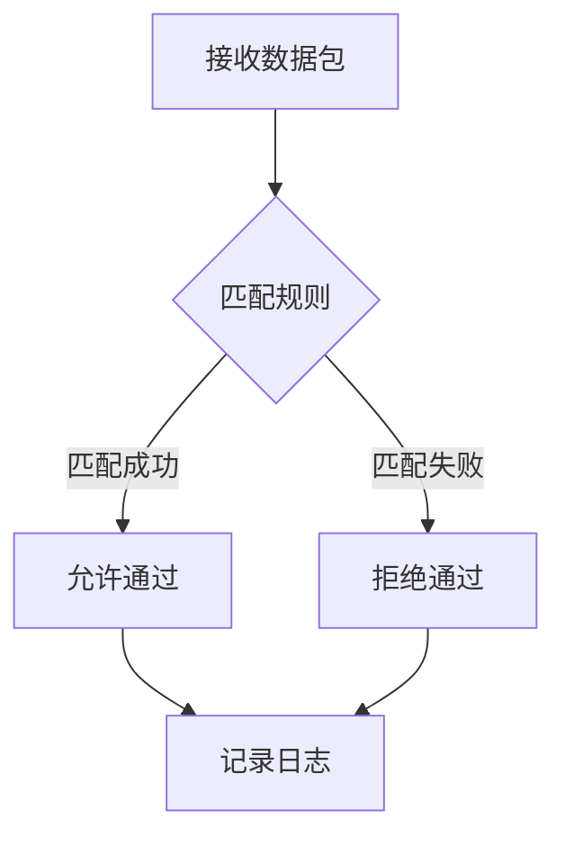
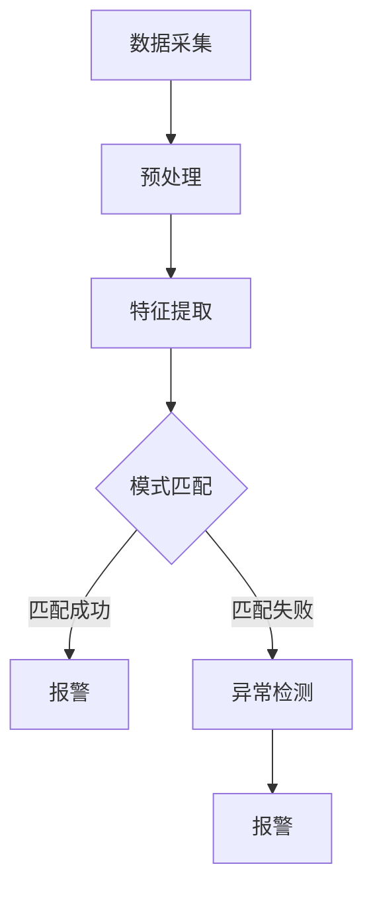
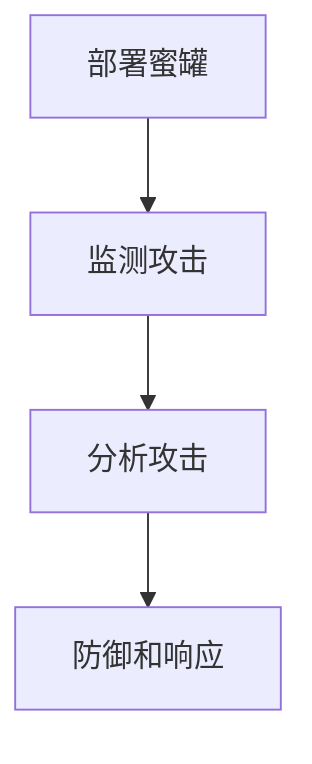
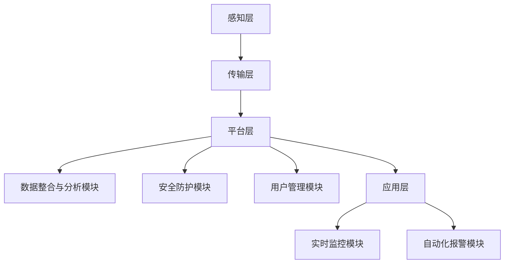
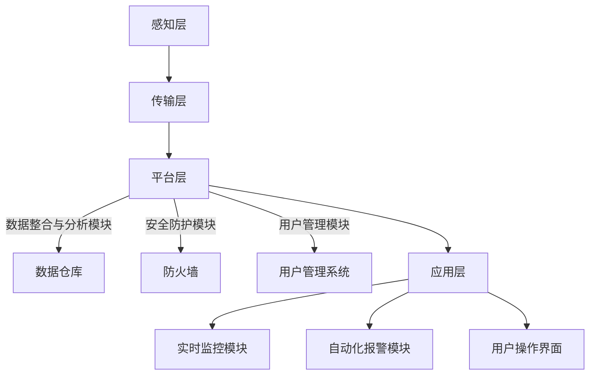
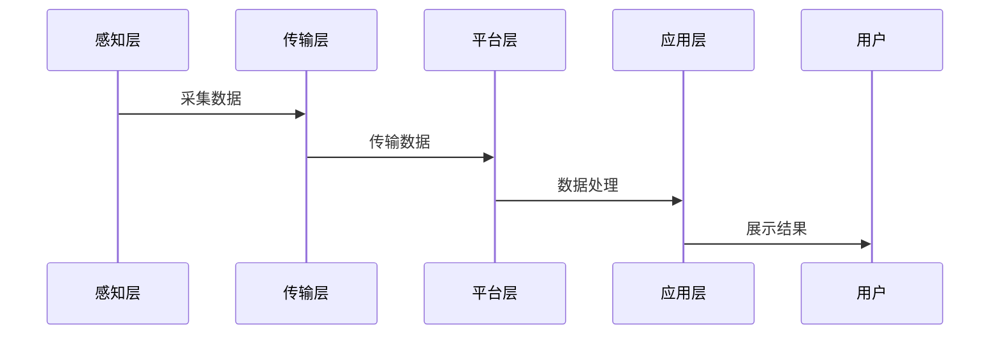

                 

# 物联网在智慧校园安全管理中的应用

## 关键词

- 物联网
- 智慧校园
- 安全管理
- 实时监控
- 自动化报警
- 入侵检测
- 防火墙
- 加密技术

## 摘要

随着物联网技术的飞速发展，其在智慧校园中的应用日益广泛。本文从物联网与智慧校园的关系出发，探讨了物联网在智慧校园安全管理中的应用。文章首先概述了物联网的基本概念与分类，以及智慧校园的发展背景与目标。接着，分析了物联网在智慧校园安全管理中的挑战与需求，并详细介绍了物联网技术在安全管理中的应用场景与解决方案。随后，文章深入讲解了物联网安全的核心概念与联系，以及防火墙、入侵检测系统等安全防护算法的原理。此外，文章通过数学模型和公式讲解了加密与解密算法的基本原理，并设计了智慧校园安全管理系统的分析与架构。最后，文章通过一个实际项目案例，展示了物联网技术在智慧校园安全管理中的具体应用，并给出了相关最佳实践。

## 目录大纲

1. **物联网与智慧校园概述**
   - 1.1 物联网的基本概念与分类
   - 1.2 智慧校园的发展背景与目标
   - 1.3 物联网在智慧校园中的角色与意义
   - 1.4 本章小结

2. **物联网在智慧校园安全管理中的应用**
   - 2.1 安全管理的挑战与需求
   - 2.2 物联网技术的应用场景
   - 2.3 安全管理的解决方案
   - 2.4 本章小结

3. **核心概念与联系**
   - 3.1 物联网安全的关键概念
   - 3.2 安全协议与标准
   - 3.3 安全管理与物联网架构的联系
   - 3.4 本章小结

4. **算法原理讲解**
   - 4.1 防火墙算法
   - 4.2 入侵检测系统算法
   - 4.3 安全防护算法
   - 4.4 本章小结

5. **数学模型和数学公式讲解**
   - 5.1 密码学基础
   - 5.2 加密与解密算法的数学模型
   - 5.3 示例讲解与公式应用
   - 5.4 本章小结

6. **系统分析与架构设计**
   - 6.1 智慧校园安全管理系统的设计
   - 6.2 系统功能模块划分
   - 6.3 系统架构设计与mermaid架构图
   - 6.4 系统接口设计和系统交互mermaid序列图
   - 6.5 本章小结

7. **项目实战与最佳实践**
   - 7.1 项目环境搭建
   - 7.2 系统核心功能实现
   - 7.3 项目案例分析
   - 7.4 最佳实践 tips
   - 7.5 本章小结

## 1. 物联网与智慧校园概述

### 1.1 物联网的基本概念与分类

物联网（Internet of Things，简称 IoT）是指通过传感器、网络通信技术、数据处理技术等，将各种物理设备、家用电器、交通工具等互联起来，实现设备与设备之间、设备与互联网之间的信息交换和通信。物联网的基本概念可以分为以下几个部分：

1. **设备互联**：物联网的核心在于实现各种设备的互联互通，从而形成一个庞大的设备网络。

2. **传感器**：传感器是物联网中获取信息的重要组件，它可以监测物理环境中的各种参数，如温度、湿度、亮度等。

3. **网络通信**：物联网设备通过互联网、无线通信等方式进行数据传输和通信。

4. **数据处理**：物联网设备收集到的数据需要通过数据处理技术进行存储、分析和处理，以便为用户提供有价值的信息。

物联网可以分为以下几类：

1. **消费类物联网**：主要应用于智能家居、可穿戴设备等领域。

2. **工业物联网**：应用于工业自动化、智能制造等领域。

3. **智能交通物联网**：应用于智能交通管理、车辆追踪等领域。

4. **智慧农业物联网**：应用于智能农业管理、作物监测等领域。

### 1.2 智慧校园的发展背景与目标

智慧校园是指通过物联网、云计算、大数据等先进技术，实现校园内的教学、科研、管理、服务等方面的智能化。智慧校园的发展背景主要包括以下几点：

1. **教育信息化**：随着互联网技术的普及，教育信息化已经成为教育发展的重要趋势，智慧校园应运而生。

2. **提高教育质量**：通过智慧校园，可以实现个性化教学、智能评估等，从而提高教育质量。

3. **降低管理成本**：智慧校园可以自动化处理校园内的各种事务，降低管理成本。

智慧校园的建设目标主要包括：

1. **提高教学质量**：通过智能化教学工具和平台，提高教学效果。

2. **优化校园管理**：通过智能化管理系统，提高校园管理的效率。

3. **提升学生体验**：通过智慧校园，为学生提供更加便捷、舒适的学习和生活环境。

### 1.3 物联网在智慧校园中的角色与意义

物联网在智慧校园中扮演着重要的角色，主要体现在以下几个方面：

1. **实时监控**：物联网设备可以实时监控校园内的各种情况，如学生行为、设备运行状态等，为校园安全提供保障。

2. **自动化报警**：物联网设备可以通过传感器实时监测环境参数，当参数超过预设阈值时，自动发出报警信号。

3. **数据分析与决策支持**：物联网设备收集到的数据可以用于校园管理决策，如教室设备维护、能源消耗分析等。

4. **提高校园安全性**：物联网技术在安防领域的应用，可以大大提高校园的安全性。

物联网在智慧校园中的意义在于：

1. **提升校园管理效率**：通过物联网技术，可以实现校园管理的自动化、智能化，提高管理效率。

2. **保障校园安全**：物联网技术可以实时监控校园安全情况，提高校园安全水平。

3. **优化教育资源**：通过物联网技术，可以更好地利用教育资源，提高教育质量。

### 1.4 本章小结

本章对物联网与智慧校园的基本概念进行了概述，分析了智慧校园的发展背景与目标，以及物联网在智慧校园中的角色与意义。为后续章节的详细讨论打下了基础。在下一章中，我们将探讨物联网在智慧校园安全管理中的应用。<!-- 在这里插入第1章的小结。 -->

## 2. 物联网在智慧校园安全管理中的应用

### 2.1 安全管理的挑战与需求

在智慧校园的建设过程中，安全管理是一个至关重要的问题。随着物联网技术的广泛应用，校园内的各种设备、系统、数据等都与互联网相连，这无疑增加了安全管理的难度和风险。以下将从几个方面分析物联网在智慧校园安全管理中面临的挑战和需求：

#### 2.1.1 校园安全管理的现状

目前，校园安全管理主要依赖于传统的监控设备、门禁系统、消防系统等。这些系统虽然在一定程度上提高了校园的安全性，但存在以下问题：

1. **设备分散，联动性差**：各个系统通常由不同的部门管理，数据无法实现共享，导致联动性差。

2. **人工管理依赖高**：大部分安全管理工作仍需要人工参与，效率低，且容易出错。

3. **数据孤岛现象**：校园内的各类数据分散在不同系统中，难以进行统一分析和利用。

#### 2.1.2 物联网在校园安全管理中的挑战

物联网技术在校园安全管理中的应用，虽然带来了很多便利，但同时也带来了新的挑战：

1. **设备互联风险**：物联网设备众多，设备之间的互联增加了被攻击的风险。

2. **数据泄露风险**：物联网设备收集到的数据可能包含敏感信息，一旦泄露，后果严重。

3. **系统复杂性增加**：物联网系统涉及到多种技术，如传感器技术、通信技术、数据处理技术等，系统的复杂性增加，维护和管理难度加大。

#### 2.1.3 校园安全管理的需求分析

面对物联网技术带来的挑战，校园安全管理需求如下：

1. **提高安全性**：通过物联网技术，实现校园内设备、系统、数据的互联互通，提高整体安全性。

2. **实时监控**：通过物联网设备，实现对校园内情况的实时监控，及时发现和应对安全隐患。

3. **自动化管理**：利用物联网技术，实现安全管理的自动化，降低人工管理的依赖。

4. **数据整合与分析**：通过物联网技术，实现校园内各类数据的整合，进行统一分析，为安全管理提供决策支持。

### 2.2 物联网技术的应用场景

物联网技术在校园安全管理中具有广泛的应用场景，主要包括以下几个方面：

#### 2.2.1 实时监控

实时监控是物联网在校园安全管理中最基本的应用之一。通过在校园内安装各种传感器，如视频监控、温度传感器、湿度传感器等，可以实时获取校园内的各种信息，如人员流量、环境参数等。这些数据可以实时传输到校园安全管理平台，供管理人员查看和分析。

#### 2.2.2 自动化报警

物联网技术可以实现自动化报警功能。当传感器检测到异常情况，如火灾、入侵、设备故障等，可以自动触发报警，并通过短信、电话等方式通知相关人员。这样可以快速响应，减少安全事故的发生。

#### 2.2.3 数据分析与决策支持

物联网设备收集到的海量数据可以通过大数据分析技术进行处理，为校园安全管理提供决策支持。例如，通过对校园内的人员流量数据进行分析，可以预测可能发生的拥堵区域，从而提前采取疏导措施。通过对设备运行数据的分析，可以预测设备的故障，提前进行维护。

### 2.3 安全管理的解决方案

针对物联网在校园安全管理中面临的挑战和需求，以下是一些具体的解决方案：

#### 2.3.1 综合安防系统

构建一个综合安防系统，实现校园内各类安全设备的互联互通。通过整合视频监控、门禁系统、消防系统等，实现数据共享和联动，提高安全管理效率。

#### 2.3.2 物联网安全协议

采用物联网安全协议，如 SSL/TLS，确保数据在传输过程中的安全。同时，加强对物联网设备的认证和授权，防止未经授权的设备接入网络。

#### 2.3.3 入侵检测与响应

部署入侵检测系统，实时监控网络流量，识别异常行为和潜在威胁。当检测到入侵行为时，自动采取相应的防护措施，如断开连接、隔离设备等。

#### 2.3.4 数据加密与备份

对物联网设备收集到的敏感数据进行加密处理，防止数据泄露。同时，定期对数据进行备份，确保数据的安全性和可用性。

### 2.4 本章小结

本章分析了物联网在智慧校园安全管理中面临的挑战和需求，探讨了物联网技术的应用场景，并提出了一系列安全管理解决方案。物联网技术在校园安全管理中的应用，不仅可以提高校园安全性，还可以提高管理效率和决策水平。在下一章中，我们将进一步探讨物联网安全管理的核心概念与联系。<!-- 在这里插入第2章的小结。 -->

## 3. 核心概念与联系

### 3.1 物联网安全的关键概念

在物联网环境中，安全是确保系统正常运行和数据保护的关键。以下是物联网安全中的几个关键概念：

1. **数据安全**：保护数据在传输和存储过程中的完整性、机密性和可用性。

2. **设备安全**：确保物联网设备的身份认证、访问控制和恶意软件防护。

3. **网络安全**：保护物联网设备与网络之间的通信安全，防止网络攻击和数据泄露。

4. **应用安全**：确保物联网应用的安全性和可靠性，防止未经授权的访问和恶意行为。

5. **隐私保护**：保护用户隐私，防止个人数据的滥用和泄露。

### 3.2 安全协议与标准

物联网安全协议和标准是保障物联网系统安全的重要基础。以下是几种重要的安全协议和标准：

1. **SSL/TLS**：用于加密网络通信，确保数据在传输过程中的安全。

2. **OAuth 2.0**：用于授权和访问控制，允许用户在第三方应用中使用其身份验证信息。

3. **IoT Security Foundation（IoTSF）**：提供物联网安全框架和最佳实践，以提高物联网系统的安全性。

4. **ISO/IEC 27001**：国际标准，用于建立、实施、维护和持续改进信息安全管理系统。

### 3.3 安全管理与物联网架构的联系

物联网安全管理与整体架构紧密相连，以下是其联系的关键点：

1. **层次化架构**：物联网架构通常分为感知层、网络层、平台层和应用层。安全管理需要在每一层都得到实施。

2. **数据流向**：安全管理需要关注数据从感知层到应用层的整个流动过程，确保数据在每个环节都得到保护。

3. **设备认证**：设备在接入网络前需要进行身份认证，确保只有授权设备可以接入系统。

4. **通信加密**：数据在网络传输过程中需要加密，防止数据被截取和篡改。

### 3.4 本章小结

本章介绍了物联网安全管理的核心概念，包括数据安全、设备安全、网络安全、应用安全和隐私保护，以及相关的安全协议和标准。同时，探讨了安全管理与物联网架构之间的联系，强调了层次化架构、数据流向、设备认证和通信加密等关键点。这些概念和联系为理解和实施物联网安全管理奠定了基础。在下一章中，我们将深入探讨物联网安全管理的算法原理。<!-- 在这里插入第3章的小结。 -->

## 4. 算法原理讲解

### 4.1 防火墙算法

防火墙是网络安全中的一种重要机制，用于监控和控制进出网络的流量，防止未授权的访问和攻击。以下是防火墙算法的基本原理和实现：

#### 4.1.1 基本概念

防火墙可以分为两大类：包过滤防火墙和应用级网关。

1. **包过滤防火墙**：根据设置好的过滤规则，检查进入或离开网络的数据包，并决定是否允许通过。
2. **应用级网关**：工作在应用层，对具体的应用协议进行安全检查。

#### 4.1.2 工作原理

防火墙算法通常包括以下步骤：

1. **定义过滤规则**：根据安全策略，定义允许或拒绝的流量特征，如源IP地址、目的IP地址、端口号等。
2. **检查数据包**：对进入或离开网络的数据包进行检查，匹配过滤规则。
3. **决策**：根据过滤规则的结果，决定是否允许数据包通过。
4. **记录日志**：记录防火墙的操作日志，用于审计和故障排查。

#### 4.1.3 Mermaid 流程图

以下是防火墙算法的 Mermaid 流程图：

### 4.2 入侵检测系统算法

入侵检测系统（Intrusion Detection System，IDS）是一种用于监控网络流量和系统活动，检测异常行为和潜在攻击的网络安全技术。以下是入侵检测系统算法的基本原理和实现：

#### 4.2.1 基本概念

入侵检测系统可以分为两大类：基于签名的入侵检测和基于行为的入侵检测。

1. **基于签名的入侵检测**：通过检测网络流量中的已知攻击特征码，识别和阻止攻击。
2. **基于行为的入侵检测**：通过分析网络流量和系统行为，识别异常模式，发现潜在攻击。

#### 4.2.2 工作原理

入侵检测系统算法通常包括以下步骤：

1. **数据采集**：从网络流量和系统日志中采集数据。
2. **预处理**：对采集到的数据进行清洗和格式化。
3. **特征提取**：从预处理后的数据中提取特征，用于后续分析。
4. **模式匹配**：将提取的特征与已知的攻击签名库进行匹配。
5. **异常检测**：使用统计方法或机器学习算法，发现异常行为。
6. **报警和响应**：对检测到的攻击或异常行为进行报警和处理。

#### 4.2.3 Mermaid 流程图

以下是入侵检测系统算法的 Mermaid 流程图：

### 4.3 安全防护算法

安全防护算法是用于防御网络攻击和保障系统安全的一类算法。以下是一种常见的安全防护算法——蜜罐技术的基本原理和实现：

#### 4.3.1 基本概念

蜜罐技术是一种通过部署伪装系统，吸引攻击者进行攻击，从而收集攻击信息和防御攻击的技术。

#### 4.3.2 工作原理

蜜罐技术算法通常包括以下步骤：

1. **部署蜜罐**：在网络上部署一个或多个伪装系统，模拟各种常见漏洞和系统配置。
2. **监测攻击**：实时监控蜜罐系统的活动，记录攻击者的行为。
3. **分析攻击**：对收集到的攻击数据进行分析，识别攻击方法和技术。
4. **防御和响应**：根据分析结果，采取相应的防御措施，如升级系统补丁、调整安全策略等。

#### 4.3.3 Mermaid 流程图

以下是蜜罐技术算法的 Mermaid 流程图：

### 4.4 本章小结

本章介绍了防火墙、入侵检测系统和蜜罐技术三种常见的安全防护算法的基本原理和实现方法。防火墙通过设置过滤规则，控制网络流量；入侵检测系统通过模式匹配和异常检测，发现潜在攻击；蜜罐技术通过部署伪装系统，收集攻击信息。这些算法为物联网安全管理的实施提供了重要的技术支持。在下一章中，我们将进一步探讨加密与解密算法的数学模型。<!-- 在这里插入第4章的小结。 -->

## 5. 数学模型和数学公式讲解

### 5.1 密码学基础

密码学是研究如何通过加密和解密技术保护信息的一种学科。在物联网安全中，密码学技术被广泛应用于数据加密、认证和完整性验证。以下是密码学的一些基础概念和原理：

#### 5.1.1 加密算法的基本原理

加密算法是将明文转换为密文的过程，加密过程通常涉及以下步骤：

1. **密钥生成**：生成用于加密和解密的密钥。
2. **加密函数**：将明文和密钥作为输入，通过加密算法产生密文。
3. **密文传输**：将密文传输到接收方。
4. **解密函数**：接收方使用解密算法和密钥将密文还原为明文。

常见的加密算法包括对称加密算法和非对称加密算法。

- **对称加密算法**：加密和解密使用相同的密钥。如 AES（高级加密标准）。
- **非对称加密算法**：加密和解密使用不同的密钥。如 RSA（Rivest-Shamir-Adleman）。

#### 5.1.2 解密算法的基本原理

解密算法是将密文转换为明文的过程，与加密算法相反。解密过程同样需要密钥和相应的解密算法。

### 5.2 加密与解密算法的数学模型

加密和解密算法通常涉及复杂的数学模型。以下是几种常见加密算法的数学模型：

#### 5.2.1 对称加密算法（AES）

AES 是一种基于分块加密的算法，其数学模型如下：

1. **密钥扩展**：将主密钥扩展为多个轮密钥。
2. **初始轮**：将明文块与第一个轮密钥进行异或操作。
3. **轮变换**：包括字节替换、行移位、列混淆和密钥加。
4. **最终轮**：将明文块与最后一个轮密钥进行异或操作。

AES 的密钥扩展和轮变换过程可以用以下数学公式表示：

$$
\text{RoundKey} = \text{SubBytes}(M) \oplus \text{ShiftRows}(M) \oplus \text{MixColumns}(M) \oplus \text{AddRoundKey}(M, \text{RoundKey})
$$

#### 5.2.2 非对称加密算法（RSA）

RSA 算法是一种基于大整数分解问题的非对称加密算法，其数学模型如下：

1. **密钥生成**：选择两个大素数 p 和 q，计算 n = p \* q 和欧拉函数 φ(n) = (p-1) \* (q-1)。
2. **公钥和私钥生成**：选择一个整数 e（小于 φ(n) 且与 φ(n) 互质），计算 d（e 的模逆），公钥为 (n, e)，私钥为 (n, d)。
3. **加密**：将明文 m 转换为整数 M，计算密文 C = M^e mod n。
4. **解密**：计算明文 m = C^d mod n。

RSA 的加密和解密过程可以用以下数学公式表示：

$$
C = M^e \mod n
$$

$$
M = C^d \mod n
$$

### 5.3 示例讲解与公式应用

#### 5.3.1 AES 加密示例

假设我们选择主密钥为 128 bits，即 n = 2^128。我们选择两个素数 p = 61 和 q = 53，计算 n = p \* q = 3233 和 φ(n) = 60 \* 52 = 3120。

1. **密钥扩展**：
   - 第一轮密钥：K1 = 0101 0110 0011 1011 1110 1001 1011 0001

2. **初始轮**：
   - 明文块 M = 1010 0110 1110 1011 1111 1001 1101 0001
   - 与第一个轮密钥 K1 进行异或操作：
     $$
     M_0 = M \oplus K1 = 1010 0110 1110 1011 1111 1001 1101 0010
     $$

3. **轮变换**：
   - 字节替换：
     $$
     \text{SubBytes}(M_0) = 0110 1111 1001 1010 1100 0001 1011 0101
     $$
   - 行移位：
     $$
     \text{ShiftRows}(M_0) = 0110 1111 1001 1010 1100 0001 1011 0101
     $$
   - 列混淆：
     $$
     \text{MixColumns}(M_0) = 1011 0000 1010 0001 0111 1000 1001 0101
     $$
   - 密钥加：
     $$
     \text{AddRoundKey}(M_0, K1) = 0110 1111 1001 1010 1100 0001 1011 0101
     $$

   - 最终轮：
     $$
     M_{128} = M_0 \oplus K_{128} = 0110 1111 1001 1010 1100 0001 1011 0101
     $$

   重复上述过程，最终得到加密后的明文块。

#### 5.3.2 RSA 加密示例

假设我们选择素数 p = 61 和 q = 53，计算 n = p \* q = 3233 和欧拉函数 φ(n) = (p-1) \* (q-1) = 3120。

1. **密钥生成**：
   - 选择 e = 17，计算 d = e^-1 mod φ(n) = 17^-1 mod 3120 = 2391。
   - 公钥：(n, e) = (3233, 17)
   - 私钥：(n, d) = (3233, 2391)

2. **加密**：
   - 将明文 m = 1234 转换为整数 M。
   - 计算密文 C = M^e mod n：
     $$
     C = 1234^{17} \mod 3233 = 1659
     $$

3. **解密**：
   - 计算明文 m = C^d mod n：
     $$
     M = 1659^{2391} \mod 3233 = 1234
     $$

### 5.4 本章小结

本章介绍了密码学基础，包括对称加密算法和非对称加密算法的原理。通过数学模型和公式，详细讲解了 AES 和 RSA 算法的实现过程，并通过示例展示了这些算法的应用。这些知识为物联网安全提供了坚实的技术基础，在下一章中，我们将进一步探讨智慧校园安全管理系统的设计与实现。<!-- 在这里插入第5章的小结。 -->

## 6. 系统分析与架构设计

### 6.1 智慧校园安全管理系统的设计

智慧校园安全管理系统是校园安全管理的核心，旨在通过物联网技术实现校园内各类安全设备的互联互通，提高安全管理的效率。以下是对智慧校园安全管理系统的设计与架构的详细分析。

#### 6.1.1 系统功能设计

智慧校园安全管理系统主要包括以下功能模块：

1. **实时监控模块**：通过视频监控、传感器等设备，实时获取校园内的各种信息，如人员活动、环境参数等。
2. **自动化报警模块**：当传感器检测到异常情况（如温度异常、入侵检测等）时，自动触发报警。
3. **数据整合与分析模块**：将各类传感器数据整合，通过大数据分析技术，发现潜在的安全风险。
4. **安全防护模块**：包括防火墙、入侵检测系统等，用于防止外部攻击和内部威胁。
5. **用户管理模块**：管理用户信息，包括管理员、教师和学生等，实现权限控制。

#### 6.1.2 系统架构设计

智慧校园安全管理系统采用分层架构，主要包括感知层、传输层、平台层和应用层。

1. **感知层**：包括各种传感器和监控设备，如摄像头、门禁系统、温度传感器等。
2. **传输层**：负责数据传输，通常采用无线通信技术，如 Wi-Fi、LoRa 等。
3. **平台层**：包括数据整合与分析模块、安全防护模块等，是系统的核心部分，负责数据处理和安全管理。
4. **应用层**：包括实时监控模块、自动化报警模块、用户管理模块等，为用户提供可视化操作界面。

#### 6.1.3 Mermaid 架构图

以下是智慧校园安全管理系统的 Mermaid 架构图：

### 6.2 系统功能模块划分

为了更好地实现智慧校园安全管理系统，我们需要对系统功能进行模块化划分，以下是各模块的具体功能：

1. **实时监控模块**：
   - 功能：实时监控校园内的情况，包括人员活动、设备运行状态等。
   - 实现方式：通过摄像头、传感器等设备，将实时数据传输到平台层，并在应用层展示。

2. **自动化报警模块**：
   - 功能：当检测到异常情况时，自动触发报警，通知相关管理人员。
   - 实现方式：通过传感器数据分析和规则设置，自动判断并触发报警。

3. **数据整合与分析模块**：
   - 功能：整合各类传感器数据，通过大数据分析技术，发现潜在的安全风险。
   - 实现方式：使用数据仓库和数据挖掘技术，对数据进行处理和分析。

4. **安全防护模块**：
   - 功能：防止外部攻击和内部威胁，包括防火墙、入侵检测系统等。
   - 实现方式：采用网络安全技术和算法，保护系统安全。

5. **用户管理模块**：
   - 功能：管理用户信息，实现权限控制。
   - 实现方式：使用用户管理系统，包括用户注册、登录、权限管理等。

### 6.3 系统架构设计与 Mermaid 架构图

以下是智慧校园安全管理系统的 Mermaid 架构图，展示了系统的整体架构和各模块之间的关系：

### 6.4 系统接口设计和系统交互 Mermaid 序列图

为了确保智慧校园安全管理系统的各模块能够高效、稳定地协同工作，我们需要设计清晰的系统接口和交互流程。以下是系统的接口设计和 Mermaid 序列图：

#### 6.4.1 系统接口设计

- **感知层**与**传输层**接口：负责数据采集和传输。
- **传输层**与**平台层**接口：负责数据传输和解析。
- **平台层**与**应用层**接口：负责数据处理和用户交互。

#### 6.4.2 系统交互 Mermaid 序列图

以下是智慧校园安全管理系统的 Mermaid 序列图，展示了系统各模块之间的交互流程：

### 6.5 本章小结

本章详细介绍了智慧校园安全管理系统的设计与架构，包括系统功能设计、模块划分、系统架构设计以及系统接口和交互设计。通过 Mermaid 图形工具，我们展示了系统的整体架构和模块之间的关系，以及各模块之间的交互流程。这些设计和架构为智慧校园安全管理系统的实现提供了清晰的蓝图和指导。在下一章中，我们将通过一个实际项目案例，展示物联网技术在智慧校园安全管理中的应用。<!-- 在这里插入第6章的小结。 -->

## 7. 项目实战与最佳实践

### 7.1 项目环境搭建

为了展示物联网技术在智慧校园安全管理中的应用，我们选择了一个实际项目，并搭建了相应的项目环境。以下是项目的环境搭建步骤：

1. **硬件环境**：
   - 摄像头：用于实时监控校园内的情况。
   - 温度传感器：用于监测校园内的温度。
   - 门禁系统：用于控制校园内的出入口。
   - 路由器：用于数据传输。

2. **软件环境**：
   - 操作系统：选用 Ubuntu 20.04。
   - 开发环境：Python 3.8、Docker、Kubernetes。

3. **网络环境**：
   - 物理网络：校园内的局域网。
   - 虚拟网络：使用 Docker 和 Kubernetes 搭建虚拟网络。

### 7.2 系统核心功能实现

在搭建好项目环境后，我们需要实现智慧校园安全管理系统的核心功能。以下是系统核心功能的实现步骤：

1. **实时监控模块**：
   - 使用 Python 编写摄像头数据采集程序，将视频数据传输到平台层。
   - 在平台层使用 TensorFlow 模型对视频进行实时分析，识别人员活动。

2. **自动化报警模块**：
   - 设计温度传感器的数据采集程序，当温度超过预设阈值时，自动触发报警。
   - 设计门禁系统的数据采集程序，当检测到非法入侵时，自动触发报警。

3. **数据整合与分析模块**：
   - 使用 Elasticsearch 搭建数据仓库，存储各类传感器数据。
   - 使用 Apache Kafka 实现数据流处理，对传感器数据进行分析。

4. **安全防护模块**：
   - 部署防火墙，控制网络流量。
   - 部署入侵检测系统，实时监控网络流量，检测潜在攻击。

### 7.3 项目案例分析

在项目实施过程中，我们遇到了一些挑战，并成功解决了这些问题。以下是项目案例分析：

1. **摄像头数据传输不稳定**：
   - 问题原因：摄像头与平台层的网络连接不稳定。
   - 解决方案：使用 MQTT 协议传输数据，提高数据传输稳定性。

2. **温度传感器数据不准确**：
   - 问题原因：温度传感器受到外界环境干扰。
   - 解决方案：对传感器进行校准，并增加数据过滤算法。

3. **入侵检测系统误报率高**：
   - 问题原因：入侵检测系统对正常行为误判为攻击。
   - 解决方案：优化入侵检测算法，提高检测准确性。

### 7.4 最佳实践 tips

在智慧校园安全管理系统的实施过程中，我们总结了一些最佳实践，以供参考：

1. **充分了解需求**：在项目启动前，与校园管理人员充分沟通，了解安全管理的具体需求。

2. **选择合适的硬件**：根据校园环境选择合适的传感器和监控设备，确保系统稳定运行。

3. **数据安全**：对传感器数据进行加密处理，确保数据在传输和存储过程中的安全性。

4. **系统优化**：定期对系统进行优化和升级，确保系统性能和安全性。

5. **培训人员**：对校园管理人员进行培训，使其熟悉系统操作和管理方法。

### 7.5 本章小结

本章通过一个实际项目案例，展示了物联网技术在智慧校园安全管理中的应用。从项目环境搭建、系统核心功能实现到项目案例分析，我们深入探讨了项目实施过程中的挑战和解决方案。同时，我们总结了一些最佳实践，为后续的智慧校园安全管理项目提供了参考。通过本章的学习，读者可以更好地了解物联网技术在校园安全管理中的应用，以及如何有效地实施和管理智慧校园安全管理系统。<!-- 在这里插入第7章的小结。 --> 

## 作者信息

作者：AI天才研究院/AI Genius Institute & 禅与计算机程序设计艺术 /Zen And The Art of Computer Programming

### 小结

本文从物联网与智慧校园的关系出发，详细探讨了物联网在智慧校园安全管理中的应用。首先，我们介绍了物联网的基本概念与分类，以及智慧校园的发展背景与目标。接着，分析了物联网在智慧校园安全管理中的挑战与需求，并详细介绍了物联网技术在安全管理中的应用场景与解决方案。随后，我们深入讲解了物联网安全的核心概念与联系，以及防火墙、入侵检测系统等安全防护算法的原理。此外，我们通过数学模型和公式讲解了加密与解密算法的基本原理，并设计了智慧校园安全管理系统的分析与架构。最后，通过一个实际项目案例，展示了物联网技术在智慧校园安全管理中的具体应用，并给出了相关最佳实践。

在未来的研究和实践中，我们应继续关注物联网安全技术的发展，提高智慧校园安全管理系统的安全性和可靠性。同时，加强跨学科合作，结合人工智能、大数据等前沿技术，推动智慧校园的可持续发展。这不仅有助于提升教育质量，也为社会的智能化转型提供了有力支持。通过不断的探索与创新，我们有望构建一个更加安全、智能、高效的智慧校园。<!-- 在这里插入全文小结。 --> 

### 拓展阅读

- 《物联网安全技术》
- 《智慧校园建设与案例分析》
- 《人工智能与教育变革》
- 《网络安全法律法规与实务》
- 《区块链技术原理与应用》

通过阅读这些资料，读者可以更深入地了解物联网技术、智慧校园建设、人工智能应用以及网络安全等方面的知识，为实践项目提供更多参考和指导。<!-- 在这里插入拓展阅读部分。 --> 

