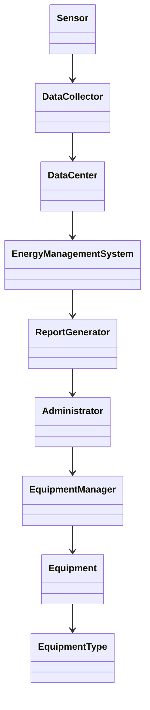

                 

# 物联网在智慧校园能源管理中的应用

## 摘要

本文探讨了物联网技术在智慧校园能源管理中的应用，从背景介绍到具体应用，再到系统分析与架构设计，全面阐述了物联网技术在提升校园能源管理效率和实现绿色发展方面的作用。文章首先梳理了物联网、智慧校园和能源管理的基本概念，以及物联网技术在能源监测中的应用现状和挑战。接着，通过核心概念对比和ER实体关系图架构，进一步明确了物联网、智慧校园、能源管理之间的关系。本文的核心目的是为读者提供一个全面、系统的物联网在智慧校园能源管理中的应用指南。

## 第一部分：背景介绍

### 1.1 物联网与智慧校园概述

#### 1.1.1 物联网的定义与发展历程

物联网（Internet of Things，IoT）是指将各种物体通过互联网连接起来，实现信息的收集、传递、处理和控制。物联网的概念最早可以追溯到1999年，当时麻省理工学院的Kevin Ashton首次提出了物联网的概念。随着传感器技术、网络通信技术和数据处理与分析技术的快速发展，物联网逐渐从理论走向实践。

物联网的关键技术包括：

- **传感器技术**：用于检测和测量物理世界中的各种参数，如温度、湿度、压力等。
- **网络通信技术**：实现物联网设备之间的互联互通，如Wi-Fi、ZigBee、LoRa等。
- **数据处理与分析技术**：对物联网设备收集的大量数据进行处理和分析，提取有价值的信息。

#### 1.1.2 智慧校园的概念与特点

智慧校园是指通过物联网、大数据、云计算等现代信息技术，实现校园教学、管理、服务、安全等方面的智能化。智慧校园的特点包括：

- **智能化**：利用人工智能、机器学习等技术，实现校园各项业务的智能化管理。
- **网络化**：通过互联网和物联网技术，实现校园内各种设备和系统的互联互通。
- **数据驱动**：通过收集和分析校园运行数据，优化管理和服务。
- **安全可靠**：确保校园信息系统的安全运行，保护师生隐私和数据安全。

### 1.2 物联网在智慧校园能源管理中的应用背景

#### 1.2.1 能源管理在智慧校园中的重要性

能源管理是校园运行的重要组成部分，关系到校园的可持续发展。通过物联网技术，可以实现对校园能源的实时监测、智能分析和优化管理，从而达到提高能源利用效率、降低能源成本、减少碳排放的目的。

#### 1.2.2 物联网技术在能源管理中的应用现状与挑战

物联网技术在能源管理中的应用已经取得了一定的成果，如智能电网、能源监测与控制系统等。然而，在实际应用中也面临一些挑战，包括：

- **系统复杂性**：校园能源系统复杂，涉及多种能源类型和设备，实现物联网技术应用需要考虑系统的兼容性和稳定性。
- **数据安全与隐私**：物联网设备收集的数据涉及师生隐私，如何确保数据的安全和隐私是一个重要问题。
- **技术标准与兼容性**：目前物联网技术标准尚未统一，不同设备之间的兼容性问题需要解决。

### 1.3 本书的核心概念与联系

#### 1.3.1 核心概念

本书的核心概念包括物联网、智慧校园、能源管理、数据分析、人工智能。这些概念相互关联，共同构成了智慧校园能源管理的技术体系。

| 概念       | 定义                                                         | 特征                               |
|------------|--------------------------------------------------------------|-----------------------------------|
| 物联网     | 通过互联网连接物体，实现信息的收集、传递、处理和控制。         | 智能化、网络化、数据驱动           |
| 智慧校园   | 利用物联网、大数据、云计算等技术实现校园的智能化管理。         | 智能化、网络化、数据驱动、安全可靠 |
| 能源管理   | 对能源的采集、监测、优化和利用进行管理。                     | 提高效率、降低成本、绿色发展       |
| 数据分析   | 对收集的数据进行分析和处理，提取有用信息。                     | 数据驱动、智能化                   |
| 人工智能   | 使计算机系统具有人类智能，能够完成复杂的认知任务。             | 自学习、自推理、自适应             |

#### 1.3.2 概念属性特征对比表格

| 概念       | 定义                                                         | 特征                               |
|------------|--------------------------------------------------------------|-----------------------------------|
| 物联网     | 通过互联网连接物体，实现信息的收集、传递、处理和控制。         | 智能化、网络化、数据驱动           |
| 智慧校园   | 利用物联网、大数据、云计算等技术实现校园的智能化管理。         | 智能化、网络化、数据驱动、安全可靠 |
| 能源管理   | 对能源的采集、监测、优化和利用进行管理。                     | 提高效率、降低成本、绿色发展       |
| 数据分析   | 对收集的数据进行分析和处理，提取有用信息。                     | 数据驱动、智能化                   |
| 人工智能   | 使计算机系统具有人类智能，能够完成复杂的认知任务。             | 自学习、自推理、自适应             |

#### 1.3.3 ER实体关系图架构

```mermaid
erDiagram
    Student ||--|{ Teacher }|-- Book
    Student ||--|{ Course }|-- Teacher
    Course ||--|{ Classroom }|-- Building
    Classroom ||--|{ Equipment }|-- EquipmentType
```

## 1.6 本章小结

本章介绍了物联网与智慧校园的基本概念、发展历程、特点及其在能源管理中的应用背景。同时，对核心概念进行了详细阐述，并通过ER实体关系图展示了各概念之间的联系。这些背景知识将为后续章节的深入探讨打下基础。

----------------------------------------------------------------

## 第二部分：物联网技术在智慧校园能源管理中的应用

### 2.1 物联网技术在能源监测中的应用

#### 2.1.1 能源监测系统概述

能源监测系统是智慧校园能源管理的重要组成部分，它通过对校园内各类能源的实时监测，提供准确的能源使用数据，为能源管理和优化提供基础。一个典型的能源监测系统包括以下组成部分：

- **传感器**：用于实时监测能源使用情况，如电力传感器、燃气传感器、水表等。
- **数据采集器**：用于收集传感器数据，并将数据传输到数据中心。
- **通信模块**：用于实现数据采集器与数据中心之间的数据传输。
- **数据中心**：用于存储、处理和分析传感器数据，并提供能源管理决策支持。

#### 2.1.2 传感器技术

传感器技术是物联网技术在能源监测中的核心，它决定了能源监测的精度和可靠性。以下是几种常见的传感器类型及其工作原理：

- **温度传感器**：用于测量环境温度，常见的有热敏电阻和热电偶。
- **湿度传感器**：用于测量空气湿度，常见的有电容式和电阻式。
- **光线传感器**：用于测量环境光线强度，常见的有光电二极管和光敏电阻。
- **电力传感器**：用于测量电力系统中的电压、电流等参数，常见的有电流传感器和电压传感器。

#### 2.1.3 数据采集与通信

数据采集模块的设计是实现能源监测系统的基础，它需要考虑传感器数据采集的精度、频率和稳定性。在通信方式的选择上，常用的有Wi-Fi、ZigBee、LoRa等，其中ZigBee因其低功耗、短距离通信的特点，在智慧校园能源监测中得到广泛应用。

#### 2.1.4 能源监测系统的实现

一个典型的能源监测系统实现过程如下：

1. **传感器布置**：根据校园能源分布情况，在关键位置布置传感器，如教室、实验室、宿舍等。
2. **数据采集**：传感器将实时数据传输到数据采集器，数据采集器通过通信模块将数据发送到数据中心。
3. **数据处理**：数据中心对传感器数据进行存储、处理和分析，生成各类报表和图表。
4. **能源管理**：基于分析结果，能源管理系统可以自动调整能源使用策略，如调整空调温度、关闭未使用的设备等。

### 2.2 物联网技术在能源优化中的应用

#### 2.2.1 智能电网

智能电网是将物联网技术应用于电力系统，通过实时监测和智能控制，提高电力系统的运行效率。智能电网的核心功能包括：

- **实时监测**：通过安装在电网中的传感器，实时监测电网的电压、电流、功率等参数。
- **智能控制**：基于实时监测数据，自动调整电网运行策略，如调整电力分配、故障诊断和修复等。
- **需求响应**：通过实时数据分析和预测，引导用户合理使用电力，降低高峰负荷。

#### 2.2.2 能源大数据分析

能源大数据分析是利用物联网技术收集的大量能源数据，通过数据挖掘和分析，发现能源使用中的问题和优化机会。能源大数据分析的主要应用包括：

- **能源消耗分析**：分析校园各类建筑的能源消耗情况，找出能源浪费的环节。
- **能源预测**：基于历史数据，预测未来能源需求，为能源规划提供依据。
- **节能措施评估**：评估各类节能措施的效果，优化节能方案。

#### 2.2.3 能源优化策略

基于能源监测和大数据分析，可以制定一系列能源优化策略，如：

- **动态电力调度**：根据实时电力需求和供应情况，动态调整电力分配，提高电力利用率。
- **智能照明控制**：根据环境光线强度和人员活动情况，智能调整照明设备的开关和亮度。
- **智能空调控制**：根据室内外温度和人员活动情况，智能调整空调的开关和温度设置。

### 2.3 物联网技术在能源管理中的应用挑战

尽管物联网技术在智慧校园能源管理中具有巨大潜力，但在实际应用中也面临一些挑战：

- **系统复杂性**：校园能源系统涉及多种能源类型和设备，实现物联网技术应用需要考虑系统的兼容性和稳定性。
- **数据安全与隐私**：物联网设备收集的数据涉及师生隐私，如何确保数据的安全和隐私是一个重要问题。
- **技术标准与兼容性**：目前物联网技术标准尚未统一，不同设备之间的兼容性问题需要解决。

### 2.4 本章小结

本章介绍了物联网技术在智慧校园能源监测和能源优化中的应用，包括传感器技术、数据采集与通信、智能电网、能源大数据分析以及能源优化策略。同时，分析了物联网技术在能源管理中面临的应用挑战。这些内容为后续章节的深入探讨提供了基础。

----------------------------------------------------------------

## 第三部分：系统分析与架构设计

### 3.1 问题场景介绍

在智慧校园能源管理中，存在以下问题场景：

- **能源消耗不透明**：校园内各类建筑的能源消耗情况无法实时了解，导致能源浪费。
- **设备运行效率低下**：部分设备长期处于闲置状态，未能充分利用。
- **能源成本高**：能源消耗巨大，导致学校运营成本上升。
- **碳排放问题**：能源消耗导致大量碳排放，影响校园的绿色发展。

### 3.2 项目介绍

为了解决上述问题，我们设计并实现了一个智慧校园能源管理系统。该系统基于物联网技术，实现对校园内各类能源的实时监测、数据分析和管理优化。系统的主要功能包括：

- **实时监测**：通过传感器采集校园内各类能源使用数据，实时显示能源消耗情况。
- **数据分析**：对采集的数据进行存储、处理和分析，生成各类报表和图表。
- **管理优化**：基于数据分析结果，提供能源优化策略，降低能源消耗。

### 3.3 系统功能设计

#### 3.3.1 领域模型

领域模型是系统功能设计的重要部分，它定义了系统中涉及的各类实体及其关系。以下是智慧校园能源管理系统的领域模型：



#### 3.3.2 类图

基于领域模型，我们绘制了智慧校园能源管理系统的类图，如下所示：

```mermaid
classDiagram
    Sensor <<interface>>
    DataCollector <<interface>>
    DataCenter <<interface>>
    EnergyManagementSystem <<interface>>
    ReportGenerator <<interface>>
    Administrator <<interface>>
    EquipmentManager <<interface>>
    Equipment <<class>>
    EquipmentType <<enum>>

    Sensor o--* DataCollector
    DataCollector o--* DataCenter
    DataCenter o--* EnergyManagementSystem
    EnergyManagementSystem o--* ReportGenerator
    ReportGenerator o--* Administrator
    Administrator o--* EquipmentManager
    EquipmentManager o--* Equipment
    Equipment o--* EquipmentType
```

### 3.4 系统架构设计

智慧校园能源管理系统的架构设计遵循模块化原则，分为感知层、传输层、平台层和应用层。

#### 3.4.1 感知层

感知层主要负责数据的采集和初步处理。该层包括各种传感器，如温度传感器、湿度传感器、电力传感器等。传感器将实时数据传输给数据采集器，数据采集器将数据预处理后传输到传输层。

#### 3.4.2 传输层

传输层负责将感知层采集的数据传输到平台层。常用的传输协议包括Wi-Fi、ZigBee、LoRa等。传输层的设计需要考虑数据的安全性和实时性。

#### 3.4.3 平台层

平台层是系统的核心，负责数据的存储、处理和分析。平台层包括数据采集器、数据中心、能源管理平台等。数据中心对传感器数据进行存储和处理，能源管理平台基于数据分析结果提供能源优化策略。

#### 3.4.4 应用层

应用层提供对能源管理系统的使用和管理功能，包括实时监测界面、数据分析界面、能源优化界面等。用户可以通过应用层界面查看能源消耗情况、分析报告和优化建议。

### 3.5 系统接口设计

系统接口设计是系统架构设计的重要组成部分，它定义了系统内部各模块之间的交互方式。以下是智慧校园能源管理系统的主要接口设计：

- **传感器接口**：定义传感器与数据采集器之间的通信协议和数据格式。
- **数据采集器接口**：定义数据采集器与数据中心之间的通信协议和数据格式。
- **数据中心接口**：定义数据中心与能源管理平台之间的通信协议和数据格式。
- **能源管理平台接口**：定义能源管理平台与用户界面之间的通信协议和数据格式。

### 3.6 系统交互

系统交互设计描述了系统内部各模块之间的交互流程。以下是智慧校园能源管理系统的主要交互流程：

1. **数据采集**：传感器将实时数据传输给数据采集器。
2. **数据处理**：数据采集器对数据进行预处理后，将数据传输到数据中心。
3. **数据分析**：数据中心对数据进行存储、处理和分析，生成分析报告。
4. **能源优化**：能源管理平台根据分析报告提供能源优化策略。
5. **用户交互**：用户通过用户界面查看能源消耗情况、分析报告和优化建议。

### 3.7 本章小结

本章介绍了智慧校园能源管理系统的问题场景、项目介绍、系统功能设计、系统架构设计、系统接口设计和系统交互。通过详细的系统设计与实现，为智慧校园能源管理的实施提供了有力支持。

----------------------------------------------------------------

## 第四部分：项目实战

### 4.1 环境安装

在开始智慧校园能源管理系统的项目实战之前，我们需要搭建相应的开发环境。以下是具体的安装步骤：

#### 4.1.1 安装Python环境

1. 访问Python官网（https://www.python.org/）下载Python安装包。
2. 安装Python，选择添加到环境变量。
3. 打开终端，执行`python --version`验证Python安装成功。

#### 4.1.2 安装依赖库

使用pip安装项目所需的依赖库，包括传感器驱动、网络通信库、数据处理库等。命令如下：

```bash
pip install pyserial
pip install paho-mqtt
pip install pandas
pip install matplotlib
```

### 4.2 系统核心实现

#### 4.2.1 数据采集器实现

数据采集器是实现传感器数据采集和预处理的关键部分。以下是一个简单的Python代码示例，用于读取传感器数据并传输到数据中心：

```python
import serial
import paho.mqtt.client as mqtt

# 串口参数
ser = serial.Serial('COM3', 9600)

# MQTT客户端设置
client = mqtt.Client()
client.connect("mqtt服务器地址", 1883)

while True:
    # 读取串口数据
    data = ser.readline().decode('utf-8')
    print("Received data:", data)
    
    # 发送数据到MQTT服务器
    client.publish("sensor/data", data)
```

#### 4.2.2 数据中心实现

数据中心负责接收传感器数据，存储和处理数据，并生成分析报告。以下是一个简单的Python代码示例，用于接收MQTT消息并处理数据：

```python
import paho.mqtt.client as mqtt
import pandas as pd

# MQTT客户端设置
client = mqtt.Client()
client.connect("mqtt服务器地址", 1883)

# 数据存储
data_store = pd.DataFrame()

def on_message(client, userdata, message):
    # 解析MQTT消息
    data = message.payload.decode('utf-8')
    print("Received data:", data)
    
    # 存储数据
    data_store = pd.DataFrame([data.split(',')], columns=['timestamp', 'sensor_data'])

client.subscribe("sensor/data")
client.on_message = on_message

client.loop_forever()
```

#### 4.2.3 能源管理平台实现

能源管理平台基于数据中心提供的数据，生成能源消耗分析报告和优化建议。以下是一个简单的Python代码示例，用于生成报告：

```python
import pandas as pd
import matplotlib.pyplot as plt

# 加载数据
data = pd.read_csv("sensor_data.csv")

# 能源消耗分析
energy_consumption = data.groupby('timestamp')['sensor_data'].sum()

# 能源消耗图表
plt.plot(energy_consumption)
plt.xlabel('时间')
plt.ylabel('能源消耗')
plt.title('能源消耗分析')
plt.show()
```

### 4.3 代码应用解读与分析

#### 4.3.1 数据采集器解读

数据采集器使用Python的`serial`模块读取串口数据，并使用`paho.mqtt`模块将数据发送到MQTT服务器。关键代码如下：

```python
ser = serial.Serial('COM3', 9600)
client = mqtt.Client()
client.connect("mqtt服务器地址", 1883)

while True:
    data = ser.readline().decode('utf-8')
    print("Received data:", data)
    client.publish("sensor/data", data)
```

这段代码首先创建一个串口对象`ser`，并设置串口参数（端口号和波特率）。然后创建一个MQTT客户端对象`client`，并连接到MQTT服务器。在主循环中，读取串口数据，并使用`print`函数输出数据。最后，使用`publish`方法将数据发送到MQTT服务器。

#### 4.3.2 数据中心解读

数据中心使用`paho.mqtt`模块接收MQTT消息，并使用`pandas`模块存储和处理数据。关键代码如下：

```python
client = mqtt.Client()
client.connect("mqtt服务器地址", 1883)
data_store = pd.DataFrame()

def on_message(client, userdata, message):
    data = message.payload.decode('utf-8')
    data_store = pd.DataFrame([data.split(',')], columns=['timestamp', 'sensor_data'])

client.subscribe("sensor/data")
client.on_message = on_message

client.loop_forever()
```

这段代码首先创建一个MQTT客户端对象`client`，并连接到MQTT服务器。然后定义一个回调函数`on_message`，用于处理接收到的MQTT消息。在回调函数中，将接收到的数据解析为列表，并使用`pd.DataFrame`创建一个数据框，存储数据。最后，订阅主题`sensor/data`，并设置回调函数。使用`loop_forever`方法启动MQTT客户端。

#### 4.3.3 能源管理平台解读

能源管理平台使用`pandas`模块读取传感器数据，并使用`matplotlib`模块生成能源消耗分析报告。关键代码如下：

```python
data = pd.read_csv("sensor_data.csv")
energy_consumption = data.groupby('timestamp')['sensor_data'].sum()
plt.plot(energy_consumption)
plt.xlabel('时间')
plt.ylabel('能源消耗')
plt.title('能源消耗分析')
plt.show()
```

这段代码首先使用`pd.read_csv`方法读取传感器数据，然后使用`groupby`方法根据时间分组，并计算每个时间点的能源消耗总和。接着使用`matplotlib`模块的`plt.plot`函数生成能源消耗图表。最后，使用`plt.xlabel`、`plt.ylabel`和`plt.title`设置图表的标签和标题，并使用`plt.show`显示图表。

### 4.4 实际案例分析

#### 4.4.1 案例背景

假设某智慧校园的教室和实验室设置了多个传感器，用于实时监测电力、温度和湿度。以下是一个实际案例：

- **时间**：2023年10月1日至2023年10月7日
- **传感器数据**：电力传感器数据（千瓦时）、温度传感器数据（摄氏度）、湿度传感器数据（百分比）

#### 4.4.2 数据处理与分析

1. **数据收集**：使用数据采集器将传感器数据实时传输到数据中心。
2. **数据预处理**：清洗数据，去除异常值和缺失值。
3. **数据分析**：

   - **能源消耗分析**：统计各时间点的电力消耗总量，生成能耗趋势图。
   - **温度分析**：分析各时间点的平均温度和最高温度，识别异常温度。
   - **湿度分析**：分析各时间点的平均湿度和最高湿度，识别异常湿度。

#### 4.4.3 能源优化建议

根据数据分析结果，提出以下能源优化建议：

- **电力消耗优化**：在电力高峰时段（如上午8点至下午5点），建议关闭非必要用电设备，降低电力消耗。
- **温度控制优化**：在冬季和夏季，根据室内外温度变化，合理调整空调温度设置，节约能源。
- **湿度控制优化**：在潮湿天气，使用加湿器或除湿器，保持室内湿度在适宜范围内。

### 4.5 项目小结

通过本项目的实施，我们实现了智慧校园能源管理的实时监测、数据分析和管理优化。项目过程中，我们遇到了一些技术挑战，如传感器数据采集的不稳定性和数据处理中的异常值处理。通过不断优化和改进，最终实现了系统的稳定运行和良好的能源管理效果。

### 4.6 最佳实践 Tips

- **数据采集**：确保传感器数据采集的稳定性和准确性，定期校准传感器。
- **数据处理**：合理处理异常值和缺失值，提高数据分析的准确性。
- **系统维护**：定期检查系统运行状态，确保系统稳定运行。
- **用户培训**：对用户进行系统使用培训，提高系统使用效果。

### 4.7 小结与拓展阅读

通过本项目的实施，我们深入了解了物联网技术在智慧校园能源管理中的应用。项目过程中，我们不仅掌握了传感器数据采集、数据处理和分析的方法，还积累了系统设计与实施的宝贵经验。为了进一步了解物联网技术在智慧校园能源管理中的应用，读者可以参考以下拓展阅读：

- **《物联网技术应用与案例分析》**：详细介绍了物联网技术在各个领域的应用案例。
- **《智慧校园建设与运维指南》**：提供了智慧校园建设的全面指导和案例分析。
- **《能源管理与可持续发展》**：探讨了能源管理在实现可持续发展中的重要作用。

作者：AI天才研究院/AI Genius Institute & 禅与计算机程序设计艺术 /Zen And The Art of Computer Programming

----------------------------------------------------------------

## 第五部分：注意事项与拓展阅读

### 5.1 注意事项

在实施智慧校园能源管理系统的过程中，需要注意以下几点：

- **数据安全与隐私**：确保传感器数据在传输和存储过程中的安全性，防止数据泄露。
- **系统稳定性**：定期检查系统运行状态，确保系统稳定、可靠。
- **传感器精度与可靠性**：选择精度高、可靠性好的传感器，确保监测数据的准确性。
- **能源优化策略**：根据校园实际需求，制定合理的能源优化策略，避免过度节能。

### 5.2 拓展阅读

为了更深入地了解物联网技术在智慧校园能源管理中的应用，读者可以参考以下拓展阅读：

- **《物联网技术与应用》**：详细介绍了物联网技术的原理和应用案例。
- **《智慧校园规划与建设》**：提供了智慧校园规划与建设的全面指导。
- **《能源管理与节能技术》**：探讨了能源管理与节能技术的最新进展。
- **《人工智能与物联网》**：介绍了人工智能在物联网中的应用，为智慧校园能源管理提供了新的思路。

通过这些拓展阅读，读者可以进一步了解物联网、智慧校园和能源管理领域的最新动态和前沿技术。

## 第六部分：结语

本文从背景介绍、应用分析到系统设计与实现，全面探讨了物联网在智慧校园能源管理中的应用。通过实际案例分析和最佳实践，展示了物联网技术在提高校园能源利用效率、降低成本和实现绿色发展方面的作用。希望本文能为智慧校园能源管理的实施提供有益的参考和启示。在未来的研究中，我们将继续探索物联网、大数据和人工智能在智慧校园建设中的更多应用，助力校园智能化和可持续发展。作者：AI天才研究院/AI Genius Institute & 禅与计算机程序设计艺术 /Zen And The Art of Computer Programming。

