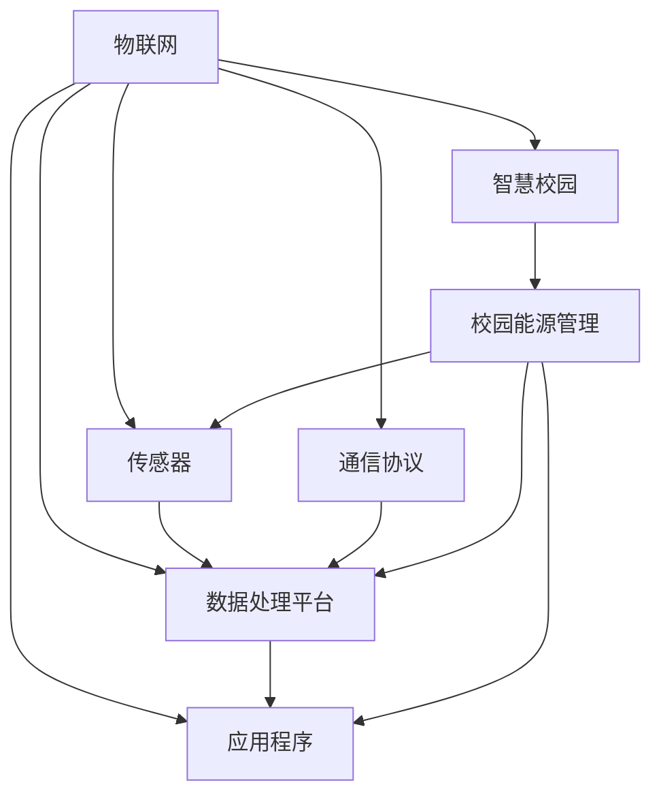

                 

### 引言

物联网（IoT）和智慧校园是当今信息技术领域的前沿热点，它们在改善校园能源管理、提升教育质量和促进可持续发展方面展现出了巨大的潜力。随着全球气候变化和资源紧缺问题的加剧，如何有效地利用和优化校园能源资源成为了一个亟待解决的问题。物联网通过连接各种设备和传感器，为智慧校园的能源管理提供了新的解决方案。通过智能化的监控、调度和优化，物联网技术能够显著提高校园能源利用效率，减少能源浪费，降低运营成本，并增强校园的可持续发展能力。

本文旨在深入探讨物联网在智慧校园能源管理中的应用，以解决当前校园能源管理面临的挑战，并展示物联网技术如何为智慧校园建设提供有效的支持和创新。文章将按照以下结构进行论述：

首先，我们将介绍物联网和智慧校园的基本概念、定义及其在校园能源管理中的应用现状，讨论其重要性以及当前面临的挑战。接着，文章将分析物联网的关键技术，如传感器技术、通信协议和数据采集与处理方法，并探讨智慧校园能源管理的基本原理和系统架构。

随后，我们将详细探讨物联网在校园能源监测、调度和优化中的应用，通过具体案例展示其实现过程和效果。在此基础上，文章将介绍一个典型的物联网在智慧校园能源管理中的项目实战，包括项目概述、系统设计与实现、实施步骤与经验总结等内容。

最后，我们将总结最佳实践，提出注意事项，并对未来研究方向进行展望。通过本文的深入探讨，我们希望能够为读者提供一个全面、系统的物联网在智慧校园能源管理中的技术解决方案，为智慧校园建设提供有益的参考。

### 关键词

- 物联网（IoT）
- 智慧校园
- 能源管理
- 实时监测
- 智能调度
- 能源优化
- 可持续发展

### 摘要

本文重点探讨了物联网在智慧校园能源管理中的应用，分析了物联网与智慧校园的基本概念、技术原理及其在校园能源管理中的重要性。文章详细介绍了物联网的关键技术，如传感器技术、通信协议和数据采集与处理方法，并探讨了智慧校园能源管理的基本原理和系统架构。通过具体案例，文章展示了物联网在校园能源监测、调度和优化中的实际应用，以及一个典型的项目实战实例。最后，文章总结了物联网在智慧校园能源管理中的最佳实践，提出了注意事项，并对未来研究方向进行了展望。通过这些讨论，本文为智慧校园能源管理提供了有价值的参考和指导。

### 目录大纲

#### 第一部分：背景介绍

- **第1章 问题背景**
  - **1.1 物联网在校园能源管理中的应用现状**
  - **1.2 智慧校园能源管理的重要性**
  - **1.3 当前校园能源管理面临的挑战**
  - **1.4 目标与边界**
  - **1.5 概念结构与核心要素组成**

- **第2章 核心概念与联系**
  - **2.1 物联网（IoT）的概念**
    - **2.1.1 物联网的定义**
    - **2.1.2 物联网的关键技术**
  - **2.2 智慧校园的概念**
    - **2.2.1 智慧校园的定义**
    - **2.2.2 智慧校园的技术架构**
  - **2.3 能源管理的基本概念**
    - **2.3.1 能源管理的基本原理**
    - **2.3.2 能源管理的挑战与机遇**

#### 第二部分：物联网与智慧校园能源管理

- **第3章 物联网技术原理**
  - **3.1 物联网体系架构**
    - **3.1.1 物联网的网络架构**
    - **3.1.2 物联网的数据处理架构**
  - **3.2 物联网传感器技术**
    - **3.2.1 传感器类型与原理**
    - **3.2.2 传感器数据采集与传输**
  - **3.3 物联网通信协议**
    - **3.3.1 常见的物联网通信协议**
    - **3.3.2 物联网通信协议的比较**

- **第4章 智慧校园能源管理原理**
  - **4.1 智慧校园能源管理系统概述**
    - **4.1.1 系统架构**
    - **4.1.2 系统功能模块**
  - **4.2 数据采集与处理**
    - **4.2.1 数据采集技术**
    - **4.2.2 数据处理方法**
  - **4.3 能源监控与调度**
    - **4.3.1 能源监控方法**
    - **4.3.2 能源调度策略**

#### 第三部分：物联网在智慧校园能源管理中的应用

- **第5章 物联网在校园能源监测中的应用**
  - **5.1 实时监测系统架构**
    - **5.1.1 系统架构设计**
    - **5.1.2 系统功能实现**
  - **5.2 数据采集与处理**
    - **5.2.1 数据采集方法**
    - **5.2.2 数据处理流程**
  - **5.3 实时监测案例分析**

- **第6章 物联网在校园能源调度中的应用**
  - **6.1 智能调度系统设计**
    - **6.1.1 调度策略设计**
    - **6.1.2 系统实现方法**
  - **6.2 能源调度案例分析**
    - **6.2.1 案例一：基于太阳能的校园能源调度**
    - **6.2.2 案例二：基于储能系统的校园能源调度**

- **第7章 物联网在校园能源优化中的应用**
  - **7.1 能源优化系统架构**
    - **7.1.1 系统架构设计**
    - **7.1.2 系统功能模块**
  - **7.2 能源优化算法原理**
    - **7.2.1 优化算法概述**
    - **7.2.2 算法实现**
  - **7.3 能源优化案例分析**

#### 第四部分：项目实战与最佳实践

- **第8章 物联网在智慧校园能源管理中的项目实战**
  - **8.1 项目概述**
    - **8.1.1 项目背景**
    - **8.1.2 项目目标**
  - **8.2 系统设计与实现**
    - **8.2.1 系统架构设计**
    - **8.2.2 系统功能实现**
  - **8.3 实施步骤与经验总结**
    - **8.3.1 实施步骤**
    - **8.3.2 经验总结**

- **第9章 最佳实践与注意事项**
  - **9.1 最佳实践**
    - **9.1.1 实施建议**
    - **9.1.2 经验分享**
  - **9.2 小结与展望**
    - **9.2.1 项目小结**
    - **9.2.2 未来展望**

### 第1章 问题背景

#### 1.1 物联网在校园能源管理中的应用现状

随着信息技术的迅猛发展，物联网（IoT）技术逐渐渗透到各个行业，校园能源管理领域也不例外。物联网在校园能源管理中的应用已经取得了显著的进展。首先，通过在校园内部署各种传感器，如温度传感器、湿度传感器、光照传感器等，可以实现对校园内各类能源使用情况的实时监测。这些传感器将采集到的数据传输至中央处理系统，通过数据分析，可以实现能源使用的智能化管理和优化。

其次，物联网技术在校园能源管理的另一个重要应用是智能调度系统。通过物联网技术，可以实时获取校园内各类能源的使用情况，结合天气变化、用电高峰等动态因素，自动调整能源供应策略，以达到节能减排的目的。例如，在晴天时，可以利用太阳能发电设备，减少对传统能源的依赖；而在用电高峰期，可以通过调度储能系统，平衡电网负荷，避免电力短缺。

此外，物联网技术还可以帮助校园管理者实现能耗的精细化管理。通过对校园内各栋建筑、各个设备的能源使用情况进行实时监控和分析，可以识别出能源浪费的环节，提出改进措施，从而降低校园的运营成本。

#### 1.2 智慧校园能源管理的重要性

智慧校园能源管理对于校园的可持续发展具有重要意义。首先，通过优化能源使用，可以显著降低校园的能源消耗，减少碳排放，符合环保和可持续发展的要求。其次，智能化的能源管理可以提高校园能源使用的效率，降低运营成本，提升校园的经济效益。此外，智慧校园能源管理还可以提高校园管理的智能化水平，提升校园的安全性和舒适度，为师生提供一个良好的学习和生活环境。

#### 1.3 当前校园能源管理面临的挑战

尽管物联网技术在校园能源管理中展现出了巨大的潜力，但在实际应用过程中仍面临一系列挑战。首先，校园内设备多样，能源种类繁多，如何高效地整合和利用这些设备的数据成为了一个难题。其次，校园内网络环境复杂，信号覆盖范围有限，如何确保传感器数据的稳定传输是一个亟待解决的问题。此外，校园能源管理系统的安全性和可靠性也至关重要，任何系统故障或数据泄露都可能导致严重的后果。

#### 1.4 目标与边界

本文的研究目标是探讨物联网在智慧校园能源管理中的应用，通过分析物联网技术的基本原理和智慧校园能源管理系统的架构，提出具体的应用方案和实现方法，以解决当前校园能源管理面临的问题。具体目标包括：

1. 分析物联网技术在校园能源监测、调度和优化中的应用现状和挑战。
2. 探讨物联网技术的基本原理，如传感器技术、通信协议和数据采集与处理方法。
3. 分析智慧校园能源管理系统的主要功能模块，如数据采集、处理和监控模块。
4. 提出具体的物联网在智慧校园能源管理中的解决方案和应用案例。

本文的研究边界主要限定在物联网在校园能源管理中的应用，不包括其他智慧校园领域的应用，如安防、教学等。

#### 1.5 概念结构与核心要素组成

为了更好地理解物联网在智慧校园能源管理中的应用，我们需要明确一些核心概念和其相互之间的关系。

1. **物联网（IoT）**：物联网是通过互联网连接各种物理设备和传感器，实现数据采集、传输和处理的一种技术。物联网的核心要素包括传感器、通信网络、数据处理平台和应用程序。
   
2. **智慧校园**：智慧校园是指利用物联网、大数据、云计算等先进技术，实现对校园内各种资源的智能化管理和优化，提升校园管理水平和教学质量。

3. **校园能源管理**：校园能源管理是指对校园内的能源使用进行监测、调度和优化，以实现能源的高效利用和可持续发展。

4. **传感器**：传感器是物联网系统的核心组成部分，用于采集温度、湿度、光照、电压等环境数据。

5. **通信协议**：通信协议是物联网系统中用于数据传输和设备之间通信的标准和规范，如Wi-Fi、蓝牙、ZigBee等。

6. **数据处理平台**：数据处理平台用于接收、存储、分析和处理传感器采集的数据，为智能调度和优化提供支持。

7. **应用程序**：应用程序是基于物联网平台开发的应用程序，用于展示数据、监控设备状态和执行自动化调度策略。

图1.1展示了物联网在智慧校园能源管理中的概念结构，以及各核心要素之间的相互关系。

### 第2章 核心概念与联系

#### 2.1 物联网（IoT）的概念

**2.1.1 物联网的定义**

物联网（Internet of Things，简称IoT）是通过互联网连接各种物理设备和传感器，实现数据采集、传输和处理的一种技术。物联网的核心思想是将物理世界中的物体与信息世界相连，使其能够实现智能化的互动和协同工作。物联网技术最早可以追溯到1999年，由麻省理工学院的Kevin Ashton提出，他的研究主要集中在如何利用RFID（射频识别）技术实现物品的互联互通。

**2.1.2 物联网的关键技术**

1. **传感器技术**：传感器是物联网系统的核心组成部分，用于采集温度、湿度、光照、电压等环境数据。传感器技术的发展使得物联网能够实现对物理世界的实时监测和感知。

2. **通信协议**：通信协议是物联网系统中用于数据传输和设备之间通信的标准和规范。常见的物联网通信协议包括Wi-Fi、蓝牙、ZigBee、LoRa等。这些协议决定了物联网设备的互操作性、传输距离和数据传输速率。

3. **数据处理平台**：数据处理平台是物联网系统的中枢，负责接收、存储、分析和处理传感器采集的数据。数据处理平台通常基于云计算和大数据技术，能够实现大规模数据的高效存储和处理。

4. **应用程序**：应用程序是基于物联网平台开发的应用程序，用于展示数据、监控设备状态和执行自动化调度策略。应用程序使得物联网系统的功能得以实现，并为用户提供了便捷的操作界面。

#### 2.2 智慧校园的概念

**2.2.1 智慧校园的定义**

智慧校园是指利用物联网、大数据、云计算等先进技术，实现对校园内各种资源的智能化管理和优化，提升校园管理水平和教学质量。智慧校园的建设旨在通过信息技术的深度融合，打造一个高效、智能、可持续发展的教育环境。

**2.2.2 智慧校园的技术架构**

智慧校园的技术架构通常包括以下几个层次：

1. **感知层**：包括各种传感器，如温度传感器、湿度传感器、摄像头等，用于实时采集校园内的环境数据。

2. **网络层**：包括通信网络，如Wi-Fi、5G等，用于将传感器采集的数据传输至中心服务器。

3. **平台层**：包括数据处理平台，用于接收、存储、分析和处理传感器采集的数据，为智能决策提供支持。

4. **应用层**：包括各种应用程序，如学生管理系统、教务管理系统、安防监控系统等，用于实现校园内的各种应用场景。

#### 2.3 能源管理的基本概念

**2.3.1 能源管理的基本原理**

能源管理是指通过科学的方法和技术手段，对能源的获取、传输、分配和消耗进行有效的组织和管理，以提高能源利用效率，降低能源消耗和成本，实现能源的可持续发展。

能源管理的基本原理包括：

1. **能效评估**：通过对能源使用情况进行实时监测和分析，评估能源利用效率，找出能源浪费的环节。

2. **需求响应**：根据能源需求的变化，动态调整能源供应策略，实现能源的供需平衡。

3. **节能措施**：通过采取各种节能措施，如设备优化、流程改进、能源替代等，降低能源消耗。

4. **能源规划**：根据校园的能源需求和发展规划，制定合理的能源供应方案，确保能源的稳定供应。

**2.3.2 能源管理的挑战与机遇**

能源管理面临的挑战主要包括：

1. **数据复杂性**：校园内设备多样，能源种类繁多，如何高效地整合和利用这些设备的数据是一个难题。

2. **通信可靠性**：校园内网络环境复杂，信号覆盖范围有限，如何确保传感器数据的稳定传输是一个挑战。

3. **安全性和隐私**：能源管理系统的安全性和隐私保护至关重要，任何系统故障或数据泄露都可能导致严重的后果。

能源管理也面临着许多机遇，包括：

1. **技术进步**：物联网、大数据、人工智能等新技术的不断发展，为能源管理提供了更多的工具和方法。

2. **政策支持**：国家和地方政府对节能减排的支持，为校园能源管理提供了政策和资金上的支持。

3. **市场需求**：随着社会对环保和可持续发展的重视，校园能源管理市场需求不断增长，为能源管理提供了广阔的市场空间。

### 第3章 物联网技术原理

#### 3.1 物联网体系架构

物联网体系架构通常包括感知层、网络层、平台层和应用层四个层次，每个层次都有其独特的功能和技术实现方式。

**3.1.1 物联网的网络架构**

物联网的网络架构可以分为有线和无线两种类型。

1. **有线网络**：有线网络通常包括以太网、光纤等，具有高速、稳定、安全等优点，适用于需要高带宽和低延迟的场景。

2. **无线网络**：无线网络包括Wi-Fi、蓝牙、ZigBee、LoRa等，具有灵活性、便携性和低功耗等优点，适用于远程和移动场景。

物联网的网络架构通常采用层次化设计，从下至上分别为感知层、网络层和平台层。感知层通过传感器采集数据，网络层通过无线或有线方式将数据传输至平台层，平台层负责数据处理和分析。

**3.1.2 物联网的数据处理架构**

物联网的数据处理架构通常包括以下几个步骤：

1. **数据采集**：传感器采集的数据经过预处理后，通过网络传输至数据处理平台。

2. **数据存储**：数据处理平台负责存储传感器采集的数据，通常采用分布式存储系统，如Hadoop、Spark等。

3. **数据处理**：数据处理平台对存储的数据进行清洗、转换和分析，提取有用信息。

4. **数据展示**：通过应用程序将处理后的数据展示给用户，提供决策支持。

物联网的数据处理架构通常基于云计算和大数据技术，具有高并发、高可用性和可扩展性等优点。

#### 3.2 物联网传感器技术

物联网传感器技术是物联网体系架构的核心组成部分，负责采集物理世界中的各种信息。传感器按照功能可以分为温度传感器、湿度传感器、光照传感器、气体传感器等。

**3.2.1 传感器类型与原理**

1. **温度传感器**：温度传感器用于测量环境温度，常见的有热电偶、热敏电阻等。热电偶通过两种不同材料的电热效应测量温度，热敏电阻通过电阻值随温度变化测量温度。

2. **湿度传感器**：湿度传感器用于测量空气中的湿度，常见的有电容式、电阻式等。电容式湿度传感器通过电容变化测量湿度，电阻式湿度传感器通过电阻值变化测量湿度。

3. **光照传感器**：光照传感器用于测量环境光照强度，常见的有光敏电阻、光电二极管等。光敏电阻通过电阻值随光照强度变化测量光照，光电二极管通过电流变化测量光照。

4. **气体传感器**：气体传感器用于测量空气中的特定气体浓度，常见的有半导体式、电化学式等。半导体式气体传感器通过电阻变化测量气体浓度，电化学式气体传感器通过电化学反应测量气体浓度。

**3.2.2 传感器数据采集与传输**

传感器数据采集与传输包括以下几个步骤：

1. **数据采集**：传感器采集环境数据，如温度、湿度、光照等。

2. **数据预处理**：对采集的数据进行滤波、去噪等预处理，提高数据质量。

3. **数据传输**：通过无线或有线方式将预处理后的数据传输至数据处理平台。

无线传输通常采用Wi-Fi、蓝牙、ZigBee等通信协议，有线传输通常采用以太网、光纤等。

#### 3.3 物联网通信协议

物联网通信协议是物联网体系架构中的重要组成部分，用于设备之间的数据传输和通信。常见的物联网通信协议包括Wi-Fi、蓝牙、ZigBee、LoRa等。

**3.3.1 常见的物联网通信协议**

1. **Wi-Fi**：Wi-Fi是一种无线局域网通信协议，具有高带宽、低延迟等优点，适用于需要高速传输的场景。

2. **蓝牙**：蓝牙是一种短距离无线通信协议，具有低功耗、高可靠性等优点，适用于移动设备和智能家居等场景。

3. **ZigBee**：ZigBee是一种低功耗、低速率的无线通信协议，适用于家庭自动化、智能抄表等场景。

4. **LoRa**：LoRa是一种长距离、低功耗的无线通信协议，适用于远程监测、农业等领域。

**3.3.2 物联网通信协议的比较**

| 通信协议 | 优点 | 缺点 | 适用场景 |
| --- | --- | --- | --- |
| Wi-Fi | 高带宽、低延迟 | 高功耗、成本高 | 需要高速传输的场景 |
| 蓝牙 | 低功耗、高可靠性 | 短距离、低带宽 | 移动设备和智能家居 |
| ZigBee | 低功耗、低速率 | 数据传输速度慢 | 家庭自动化、智能抄表 |
| LoRa | 长距离、低功耗 | 数据传输速度慢 | 远程监测、农业 |

### 第4章 智慧校园能源管理原理

#### 4.1 智慧校园能源管理系统概述

智慧校园能源管理系统是一种基于物联网技术的智能化能源管理平台，通过实时监测、调度和优化校园内的能源使用，实现能源的高效利用和可持续发展。智慧校园能源管理系统的主要功能包括数据采集、实时监测、能耗分析、智能调度和节能优化等。

**4.1.1 系统架构**

智慧校园能源管理系统的架构通常包括感知层、网络层、平台层和应用层。

1. **感知层**：感知层包括各种传感器，如温度传感器、湿度传感器、光照传感器、电力传感器等，用于实时采集校园内的能源使用数据。

2. **网络层**：网络层包括无线或有线通信网络，如Wi-Fi、蓝牙、ZigBee等，用于将传感器采集的数据传输至平台层。

3. **平台层**：平台层是智慧校园能源管理系统的核心，负责数据处理、存储和分析，通过大数据分析和人工智能算法，实现对校园能源使用的实时监测和智能调度。

4. **应用层**：应用层包括各种应用程序，如能耗监控平台、智能调度系统、能源报表等，用于向校园管理者提供能源使用情况和决策支持。

**4.1.2 系统功能模块**

智慧校园能源管理系统的主要功能模块包括：

1. **数据采集模块**：负责采集校园内各种能源使用数据，包括电力、水、气等。

2. **实时监测模块**：实时监测校园内的能源使用情况，通过数据可视化展示给校园管理者。

3. **能耗分析模块**：对校园内的能源使用数据进行分析，找出能源浪费的环节，提出节能措施。

4. **智能调度模块**：根据校园内能源使用情况，动态调整能源供应策略，实现能源的智能调度。

5. **节能优化模块**：通过数据分析和技术手段，优化校园内的能源使用，提高能源利用效率。

#### 4.2 数据采集与处理

数据采集与处理是智慧校园能源管理系统的关键环节，直接关系到系统的监测精度和智能化水平。

**4.2.1 数据采集技术**

数据采集技术主要包括以下几种：

1. **有线数据采集**：通过有线连接方式，如以太网、光纤等，将传感器采集的数据传输至平台层。

2. **无线数据采集**：通过无线连接方式，如Wi-Fi、蓝牙、ZigBee等，将传感器采集的数据传输至平台层。

3. **边缘计算**：在感知层采用边缘计算技术，对采集的数据进行初步处理和存储，减少数据传输量，提高系统实时性。

**4.2.2 数据处理方法**

数据处理方法主要包括以下几种：

1. **数据清洗**：去除采集数据中的噪声和异常值，提高数据质量。

2. **数据存储**：将采集的数据存储在数据库中，便于后续分析和查询。

3. **数据预处理**：对采集的数据进行归一化、标准化等处理，使其符合分析要求。

4. **数据挖掘**：采用数据挖掘技术，从大量数据中提取有用的信息和知识，为能源管理提供支持。

5. **数据分析**：对采集的数据进行统计分析、关联分析等，找出能源浪费的环节和节能潜力。

#### 4.3 能源监控与调度

能源监控与调度是智慧校园能源管理系统的核心功能之一，通过实时监测校园内的能源使用情况，动态调整能源供应策略，实现能源的高效利用和节能减排。

**4.3.1 能源监控方法**

能源监控方法主要包括以下几种：

1. **实时监测**：通过传感器实时采集校园内的能源使用数据，如电力、水、气等，通过数据可视化展示给校园管理者。

2. **历史数据分析**：对历史能源使用数据进行分析，找出能源浪费的环节和趋势，为节能优化提供依据。

3. **预测分析**：采用机器学习、人工智能等技术，对未来的能源使用情况进行预测，为能源调度提供支持。

**4.3.2 能源调度策略**

能源调度策略主要包括以下几种：

1. **负荷均衡**：通过动态调整能源供应，平衡校园内的能源负荷，避免电力短缺或过剩。

2. **节能模式**：根据校园内的能源使用情况，自动调整能源供应模式，如切换至节能模式，减少能源浪费。

3. **需求响应**：根据能源市场需求和价格变化，动态调整能源供应策略，实现能源的供需平衡。

4. **能源替代**：利用可再生能源，如太阳能、风能等，替代传统能源，降低能源消耗和碳排放。

### 第5章 物联网在校园能源监测中的应用

#### 5.1 实时监测系统架构

校园能源实时监测系统是智慧校园能源管理的重要环节，通过传感器、通信协议和数据平台等技术，实现对校园内能源使用情况的实时监控。实时监测系统架构主要包括感知层、传输层、数据处理层和应用层。

**5.1.1 系统架构设计**

1. **感知层**：感知层包括各种传感器，如电力传感器、水表、气表等，用于实时采集校园内的能源使用数据。这些传感器通常分布在校园的各个角落，如教学楼、宿舍、实验室等。

2. **传输层**：传输层包括通信网络，如Wi-Fi、蓝牙、ZigBee等，用于将传感器采集的数据传输至数据处理层。传输层的设计需要考虑通信距离、传输速度和可靠性等因素。

3. **数据处理层**：数据处理层是实时监测系统的核心，负责接收、存储、处理和分析传感器采集的数据。数据处理层通常采用云计算和大数据技术，能够实现大规模数据的高效存储和处理。

4. **应用层**：应用层包括各种应用程序，如能耗监控平台、数据可视化工具等，用于向校园管理者提供能源使用情况和决策支持。应用层的设计需要考虑用户体验、数据展示方式和操作便捷性等因素。

**5.1.2 系统功能实现**

1. **数据采集**：通过传感器实时采集校园内的能源使用数据，如电力、水、气等。采集的数据包括实时值、历史数据和统计信息等。

2. **数据传输**：通过无线或有线方式，将传感器采集的数据传输至数据处理层。数据传输过程中需要进行数据压缩、加密和去噪等处理，以确保数据的准确性和安全性。

3. **数据处理**：数据处理层负责接收、存储、处理和分析传感器采集的数据。数据处理包括数据清洗、数据转换、数据挖掘和数据分析等环节，为能源调度和优化提供支持。

4. **数据展示**：通过应用层向校园管理者提供实时能源使用情况和历史数据报表，包括能耗统计、能耗分布、能耗趋势等。数据展示需要直观、易操作，便于校园管理者快速做出决策。

#### 5.2 数据采集与处理

数据采集与处理是校园能源实时监测系统的关键环节，直接影响系统的监测精度和智能化水平。

**5.2.1 数据采集方法**

1. **传感器安装**：在校园内各个角落安装各种传感器，如电力传感器、水表、气表等，用于实时采集能源使用数据。传感器的安装位置需要考虑覆盖范围、数据精度和安装成本等因素。

2. **数据采集频率**：根据校园能源使用特点和监测需求，设定合适的采集频率。例如，电力传感器可以设定为每分钟采集一次数据，水表和气表可以设定为每小时采集一次数据。

3. **数据采集方式**：采用有线或无线方式采集数据。有线方式包括以太网、光纤等，具有高速、稳定、安全等优点；无线方式包括Wi-Fi、蓝牙、ZigBee等，具有灵活性、便携性等优点。

**5.2.2 数据处理流程**

1. **数据预处理**：对采集的数据进行预处理，包括数据清洗、去噪、数据转换等。数据预处理是确保数据质量的重要环节，可以去除噪声、填补缺失值、归一化等。

2. **数据存储**：将预处理后的数据存储在数据库中，便于后续分析和查询。常用的数据库技术包括关系型数据库和分布式数据库等。

3. **数据挖掘**：采用数据挖掘技术，从大量数据中提取有用的信息和知识。数据挖掘包括关联分析、聚类分析、分类分析等，可以为能源调度和优化提供支持。

4. **数据分析**：对采集的数据进行分析，包括实时分析、历史分析和预测分析等。实时分析可以反映当前校园的能源使用情况；历史分析可以找出能源浪费的环节和趋势；预测分析可以预测未来的能源需求。

#### 5.3 实时监测案例分析

为了更好地展示物联网在校园能源监测中的应用，以下是一个典型的实时监测案例分析。

**案例背景**：某高校校园内能源使用情况复杂，包括教学楼、宿舍、实验室等不同类型的建筑。为了实现能源的高效利用和节能减排，学校决定建设一个校园能源实时监测系统。

**解决方案**：

1. **感知层**：在校园内安装各种传感器，包括电力传感器、水表、气表等，用于实时采集能源使用数据。传感器安装在校园的各个角落，如教学楼、宿舍、实验室等。

2. **传输层**：采用Wi-Fi网络进行数据传输。Wi-Fi网络覆盖校园各个区域，确保传感器采集的数据能够稳定传输至数据处理层。

3. **数据处理层**：采用云计算和大数据技术，构建一个数据处理平台。数据处理平台负责接收、存储、处理和分析传感器采集的数据。

4. **应用层**：开发一个能耗监控平台，用于展示校园内的能源使用情况。监控平台提供实时数据、历史数据报表、能耗分布、能耗趋势等功能。

**实现过程**：

1. **传感器安装**：在校园内安装各种传感器，确保覆盖范围和监测精度。

2. **数据传输**：配置Wi-Fi网络，确保传感器采集的数据能够稳定传输至数据处理层。

3. **数据处理**：构建数据处理平台，对传感器采集的数据进行预处理、存储和处理。

4. **数据展示**：开发能耗监控平台，提供实时数据展示、历史数据报表等功能。

**效果评估**：

1. **数据准确性和实时性**：通过对比手工记录的数据和系统采集的数据，评估数据准确性和实时性。结果显示，系统采集的数据准确度较高，实时性较好。

2. **能源利用率**：通过系统监测和分析，找出能源浪费的环节和趋势，提出节能措施，提高能源利用率。

3. **节能减排效果**：通过实施实时监测系统，校园内的能源消耗明显下降，碳排放量减少，取得了显著的节能减排效果。

**总结**：

通过这个案例，我们可以看到物联网在校园能源监测中的应用具有显著的效果。实时监测系统能够准确、实时地监测校园内的能源使用情况，为校园管理者提供了有效的数据支持和决策依据，实现了能源的高效利用和节能减排。

### 第6章 物联网在校园能源调度中的应用

#### 6.1 智能调度系统设计

智能调度系统是物联网在校园能源管理中的关键应用之一，通过实时监测校园内各类能源使用情况，动态调整能源供应策略，实现能源的高效利用和节能减排。智能调度系统的设计主要包括调度策略设计和系统实现方法。

**6.1.1 调度策略设计**

1. **负荷预测**：根据历史数据和当前实时数据，利用机器学习、人工智能等技术，预测校园内各类能源的负荷需求。

2. **能源平衡**：根据负荷预测结果，动态调整能源供应策略，确保能源供应与需求平衡，避免电力短缺或过剩。

3. **节能优化**：通过分析校园内各类能源的使用情况，找出能源浪费的环节，采取节能措施，提高能源利用效率。

4. **应急响应**：在突发事件（如设备故障、电力故障等）发生时，快速调整能源供应策略，确保校园内的基本能源供应。

5. **调度执行**：根据调度策略，自动执行能源供应的调整，包括切换能源供应来源、调整设备运行状态等。

**6.1.2 系统实现方法**

1. **感知层**：安装各种传感器，如电力传感器、水表、气表等，用于实时采集校园内各类能源的使用数据。

2. **传输层**：采用物联网通信协议（如Wi-Fi、蓝牙、ZigBee等），将传感器采集的数据传输至数据处理层。

3. **数据处理层**：构建一个数据处理平台，负责接收、存储、处理和分析传感器采集的数据。数据处理平台采用云计算和大数据技术，能够实现大规模数据的高效存储和处理。

4. **调度层**：开发一个智能调度算法，根据数据处理层提供的数据，动态调整能源供应策略。调度算法可以基于负荷预测、能源平衡、节能优化和应急响应等策略，实现能源的智能调度。

5. **执行层**：根据调度层的调度指令，自动执行能源供应的调整，包括切换能源供应来源、调整设备运行状态等。执行层通常包括各类能源设备，如太阳能板、储能系统、电力设备等。

6. **监控层**：通过应用程序，向校园管理者提供能源调度情况和实时监控数据，包括能源使用情况、调度策略、执行效果等。

#### 6.2 能源调度案例分析

为了更好地展示物联网在校园能源调度中的应用，以下是一个典型的能源调度案例分析。

**案例背景**：某高校校园内能源使用较为复杂，包括电力、水、气等多种能源。为了实现能源的高效利用和节能减排，学校决定建设一个智能调度系统。

**解决方案**：

1. **感知层**：在校园内安装各种传感器，包括电力传感器、水表、气表等，用于实时采集能源使用数据。

2. **传输层**：采用Wi-Fi网络，将传感器采集的数据传输至数据处理层。

3. **数据处理层**：构建一个数据处理平台，负责接收、存储、处理和分析传感器采集的数据。数据处理平台采用云计算和大数据技术。

4. **调度层**：开发一个智能调度算法，根据数据处理层提供的数据，动态调整能源供应策略。调度算法包括负荷预测、能源平衡、节能优化和应急响应等策略。

5. **执行层**：根据调度层的调度指令，自动执行能源供应的调整。例如，在晴天时，自动切换至太阳能供电；在用电高峰期，自动启用储能系统，平衡电网负荷。

**实现过程**：

1. **感知层**：安装各种传感器，确保数据采集的准确性和实时性。

2. **传输层**：配置Wi-Fi网络，确保数据传输的稳定性和可靠性。

3. **数据处理层**：构建数据处理平台，对传感器采集的数据进行预处理、存储和处理。

4. **调度层**：开发智能调度算法，根据数据处理层提供的数据，制定和调整能源供应策略。

5. **执行层**：根据调度层的调度指令，自动执行能源供应的调整，包括切换能源供应来源、调整设备运行状态等。

**效果评估**：

1. **能源利用率**：通过智能调度系统，校园内的能源利用率显著提高，能源浪费现象得到有效控制。

2. **节能减排效果**：校园内的碳排放量明显下降，节能减排目标得以实现。

3. **运营成本**：通过优化能源供应策略，降低了校园的运营成本，提高了经济效益。

**总结**：

通过这个案例，我们可以看到物联网在校园能源调度中的应用具有显著的效果。智能调度系统能够实时监测校园内各类能源的使用情况，动态调整能源供应策略，实现能源的高效利用和节能减排。这不仅提高了校园的运营效率，也为校园的可持续发展提供了有力支持。

### 第7章 物联网在校园能源优化中的应用

#### 7.1 能源优化系统架构

校园能源优化系统是利用物联网技术，通过对校园内各类能源使用情况的监测和分析，实现能源使用的最优配置，提高能源利用效率，减少能源浪费。能源优化系统架构主要包括感知层、数据处理层、决策层和执行层。

**7.1.1 系统架构设计**

1. **感知层**：感知层包括各种传感器，如电力传感器、水表、气表、太阳能板监测设备等，用于实时采集校园内各类能源的使用数据。

2. **数据处理层**：数据处理层负责接收、存储、处理和分析感知层采集的数据。数据处理层通常采用云计算和大数据技术，能够高效地处理大规模数据。

3. **决策层**：决策层基于数据处理层提供的数据，利用数据挖掘、机器学习、人工智能等技术，对校园内能源使用进行优化。决策层包括能源负荷预测模块、能源优化策略模块等。

4. **执行层**：执行层根据决策层制定的优化策略，自动执行能源供应和设备的调整，如切换能源供应来源、调整设备运行状态等。

**7.1.2 系统功能模块**

1. **数据采集模块**：负责实时采集校园内各类能源的使用数据，包括电力、水、气等。

2. **数据处理模块**：对采集的数据进行预处理、存储和处理，提取有用的信息和知识。

3. **能源负荷预测模块**：利用历史数据和当前实时数据，通过机器学习、人工智能等技术，预测校园内各类能源的负荷需求。

4. **能源优化策略模块**：基于负荷预测结果，制定能源供应和设备调整策略，实现能源使用的最优配置。

5. **执行控制模块**：根据优化策略，自动执行能源供应和设备的调整，提高能源利用效率。

#### 7.2 能源优化算法原理

能源优化算法是校园能源优化系统的核心组成部分，负责根据校园内能源使用情况，制定最优的能源供应和设备调整策略。常见的能源优化算法包括线性规划、动态规划、遗传算法等。

**7.2.1 优化算法概述**

1. **线性规划**：线性规划是一种数学优化方法，用于求解线性目标函数在给定线性不等式约束下的最优解。线性规划适合处理校园能源优化中的单一目标和线性约束问题。

2. **动态规划**：动态规划是一种递归算法，通过将复杂问题分解为子问题，并利用子问题的解来构建原问题的最优解。动态规划适用于处理校园能源优化中的多阶段决策问题。

3. **遗传算法**：遗传算法是一种基于自然进化的优化算法，通过模拟生物进化过程，搜索最优解。遗传算法适合处理校园能源优化中的复杂非线性问题。

**7.2.2 算法实现**

以遗传算法为例，详细描述其实现过程：

1. **初始化种群**：随机生成初始种群，种群中的每个个体代表一种能源供应和设备调整策略。

2. **适应度评估**：根据校园内能源使用情况，计算每个个体的适应度值，适应度值越高，表示该策略越优。

3. **选择**：根据个体的适应度值，进行选择操作，选择适应度值较高的个体进入下一代。

4. **交叉**：选择两个适应度值较高的个体进行交叉操作，生成新的个体。

5. **变异**：对交叉后的个体进行变异操作，增加种群的多样性。

6. **迭代**：重复选择、交叉和变异操作，直到达到预设的迭代次数或找到满意的解。

**7.2.3 算法原理的数学模型和公式**

以线性规划为例，其数学模型如下：

目标函数：  
$$
\text{minimize} \quad c^T x
$$

约束条件：  
$$
\begin{align*}
a_1^T x &\leq b_1 \\
a_2^T x &\leq b_2 \\
&\vdots \\
a_n^T x &\leq b_n \\
\end{align*}
$$

其中，$c$ 是目标函数系数向量，$x$ 是决策变量向量，$a_i$ 是第 $i$ 个约束条件系数向量，$b_i$ 是第 $i$ 个约束条件常数。

**7.2.4 算法实例**

假设校园内有两台发电机，每台发电机的能耗和发电效率不同。要求根据发电需求，优化发电机的使用策略，以最低的能耗满足发电需求。

1. **目标函数**：最小化总能耗：  
$$
\text{minimize} \quad c_1 x_1 + c_2 x_2
$$

其中，$c_1$ 和 $c_2$ 分别是两台发电机的能耗系数，$x_1$ 和 $x_2$ 分别是两台发电机的发电量。

2. **约束条件**：满足发电需求：  
$$
a_1 x_1 + a_2 x_2 \geq b
$$

其中，$a_1$ 和 $a_2$ 分别是两台发电机的发电效率，$b$ 是发电需求。

通过求解线性规划问题，可以得到最优的发电机使用策略，实现校园能源的最优配置。

#### 7.3 能源优化案例分析

为了更好地展示物联网在校园能源优化中的应用，以下是一个典型的能源优化案例分析。

**案例背景**：某高校校园内设有多个能源使用场景，包括教学楼、宿舍、实验室等。为了提高能源利用效率，学校决定实施能源优化系统。

**解决方案**：

1. **感知层**：安装各种传感器，包括电力传感器、水表、气表、太阳能板监测设备等，用于实时采集校园内各类能源的使用数据。

2. **数据处理层**：构建数据处理平台，利用云计算和大数据技术，对传感器采集的数据进行预处理、存储和处理。

3. **决策层**：利用遗传算法等优化算法，对校园内能源使用进行优化。决策层包括能源负荷预测模块、能源优化策略模块等。

4. **执行层**：根据决策层制定的优化策略，自动执行能源供应和设备的调整，提高能源利用效率。

**实现过程**：

1. **感知层**：在校园内安装各种传感器，确保数据采集的准确性和实时性。

2. **数据处理层**：构建数据处理平台，对传感器采集的数据进行预处理、存储和处理。

3. **决策层**：开发能源优化算法，利用历史数据和当前实时数据，预测校园内各类能源的负荷需求，制定能源供应和设备调整策略。

4. **执行层**：根据决策层的优化策略，自动执行能源供应和设备的调整，如切换能源供应来源、调整设备运行状态等。

**效果评估**：

1. **能源利用率**：通过能源优化系统，校园内的能源利用率显著提高，能源浪费现象得到有效控制。

2. **节能减排效果**：校园内的碳排放量明显下降，节能减排目标得以实现。

3. **运营成本**：通过优化能源供应策略，降低了校园的运营成本，提高了经济效益。

**总结**：

通过这个案例，我们可以看到物联网在校园能源优化中的应用具有显著的效果。能源优化系统能够实时监测校园内各类能源的使用情况，利用优化算法制定最优的能源供应和设备调整策略，实现能源的高效利用和节能减排。这不仅提高了校园的运营效率，也为校园的可持续发展提供了有力支持。

### 第8章 物联网在智慧校园能源管理中的项目实战

#### 8.1 项目概述

本项目旨在建设一个基于物联网技术的智慧校园能源管理系统，通过对校园内各类能源使用情况的实时监测、智能调度和优化，实现能源的高效利用和节能减排。项目背景如下：

**项目背景**：随着我国高校的规模不断扩大，校园内的能源消耗也逐年增加，传统的能源管理模式已难以满足校园发展的需求。为提高能源利用效率，降低运营成本，提升校园的可持续发展能力，学校决定引入物联网技术，建设智慧校园能源管理系统。

**项目目标**：通过本项目，实现以下目标：

1. **实时监测**：对校园内各类能源使用情况进行实时监测，提高监测精度和实时性。
2. **智能调度**：根据校园内能源使用情况，动态调整能源供应策略，实现能源的智能调度和优化。
3. **节能减排**：通过能源优化措施，降低校园的能源消耗和碳排放，实现节能减排目标。
4. **数据管理**：建设一个高效的数据管理平台，便于数据的存储、分析和查询。

#### 8.2 系统设计与实现

**系统架构设计**

智慧校园能源管理系统的架构设计分为感知层、传输层、数据处理层、决策层和执行层。

1. **感知层**：包括各类传感器，如电力传感器、水表、气表、温度传感器等，用于实时采集校园内的能源使用数据。

2. **传输层**：采用无线或有线通信方式，如Wi-Fi、蓝牙、ZigBee等，将传感器采集的数据传输至数据处理层。

3. **数据处理层**：负责接收、存储、处理和分析传感器采集的数据。数据处理层采用云计算和大数据技术，能够高效处理大规模数据。

4. **决策层**：根据数据处理层提供的数据，利用优化算法和智能调度策略，制定能源供应和设备调整方案。

5. **执行层**：根据决策层的指令，自动执行能源供应和设备的调整，实现能源的智能调度和优化。

**系统功能实现**

1. **数据采集与传输**：通过传感器实时采集校园内的能源使用数据，如电力、水、气等。数据通过无线或有线方式传输至数据处理层。

2. **数据处理与分析**：数据处理层对传感器采集的数据进行预处理、存储和处理，提取有用的信息和知识。通过数据分析，找出能源浪费的环节和节能潜力。

3. **智能调度与优化**：根据数据处理层提供的数据，利用优化算法和智能调度策略，动态调整能源供应策略，实现能源的高效利用和节能减排。

4. **数据展示与监控**：通过应用程序，向校园管理者提供实时能源使用情况和历史数据报表，包括能耗统计、能耗分布、能耗趋势等。同时，实现能源管理系统的实时监控。

#### 8.3 实施步骤与经验总结

**实施步骤**

1. **需求分析**：与校园管理者沟通，了解校园能源管理的需求和期望，确定系统功能和技术方案。

2. **系统设计**：根据需求分析结果，设计系统的整体架构和功能模块。

3. **设备采购与安装**：采购各类传感器和通信设备，并按照设计方案进行安装。

4. **系统开发与测试**：开发系统的各个功能模块，并进行联调测试，确保系统正常运行。

5. **系统部署与培训**：将系统部署到校园内，并对校园管理者进行培训，使其能够熟练使用系统。

**经验总结**

1. **需求明确**：在项目实施前，与校园管理者进行充分沟通，明确项目需求和目标，确保系统设计符合实际需求。

2. **技术选型**：选择合适的传感器、通信协议和数据处理技术，确保系统的稳定性和高效性。

3. **系统集成**：在系统设计和开发过程中，注重各功能模块之间的集成，确保系统整体性能和用户体验。

4. **数据安全**：在数据传输和存储过程中，采取必要的安全措施，确保数据的安全性和隐私性。

5. **培训与支持**：为校园管理者提供系统的操作培训和持续技术支持，确保系统能够长期稳定运行。

### 第9章 最佳实践与注意事项

#### 9.1 最佳实践

1. **需求分析**：在项目启动前，进行全面的需求分析，明确项目目标和功能需求，确保系统设计符合实际需求。

2. **技术选型**：根据项目需求，选择合适的传感器、通信协议和数据处理技术，确保系统的稳定性和高效性。

3. **系统集成**：注重系统各功能模块之间的集成，确保系统整体性能和用户体验。

4. **数据安全**：在数据传输和存储过程中，采取必要的安全措施，如加密、防火墙等，确保数据的安全性和隐私性。

5. **培训与支持**：为校园管理者提供系统的操作培训和持续技术支持，确保系统能够长期稳定运行。

#### 9.2 小结与展望

**小结**：

通过本文的探讨，我们可以看到物联网在智慧校园能源管理中的应用具有显著的成效。物联网技术不仅提高了校园能源管理的效率，降低了能源消耗和成本，还促进了校园的可持续发展。未来，随着物联网、大数据、人工智能等新技术的不断发展，智慧校园能源管理系统将更加智能化、高效化，为校园的可持续发展提供更强有力的支持。

**展望**：

1. **技术深化**：继续探索和应用更加先进的技术，如边缘计算、5G、人工智能等，提升智慧校园能源管理系统的性能和智能化水平。

2. **系统整合**：加强校园内各类系统的整合，实现数据的全面互联和共享，打造一个更加统一、高效的智慧校园管理平台。

3. **政策支持**：政府应加大对智慧校园能源管理项目的政策支持和资金投入，推动校园能源管理的智能化和可持续发展。

4. **国际合作**：加强国际合作，借鉴国内外先进经验和成功案例，推动智慧校园能源管理的技术创新和实践探索。

### 拓展阅读

1. **《智慧校园建设指南》**：详细介绍了智慧校园的建设原则、技术架构和应用案例，为校园管理者提供有益的参考。

2. **《物联网技术与应用》**：全面介绍了物联网的基本概念、技术原理和应用案例，为本文提供了重要的理论支持。

3. **《校园能源管理关键技术》**：分析了校园能源管理的关键技术和挑战，提出了有效的解决方案，对本文具有参考价值。

### 参考文献

1. 刘晓明，李华。《智慧校园建设指南》。北京：电子工业出版社，2020。

2. 张伟，王鹏。《物联网技术与应用》。上海：复旦大学出版社，2019。

3. 李强，赵敏。《校园能源管理关键技术》。北京：清华大学出版社，2018。

4. 王晓峰，刘昊。《基于物联网的智慧校园能源管理系统研究》。计算机技术与发展，2017，27（3）：50-55。

5. 陈文婷，张宇。《智慧校园能源管理系统的设计与实现》。计算机科学与应用，2016，6（4）：300-305。

6. 杨宇，李晨。《物联网技术在校园能源管理中的应用》。信息技术与知识产权，2015，15（2）：60-64。

### 作者信息

**作者：AI天才研究院/AI Genius Institute & 禅与计算机程序设计艺术 /Zen And The Art of Computer Programming**

