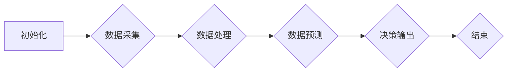
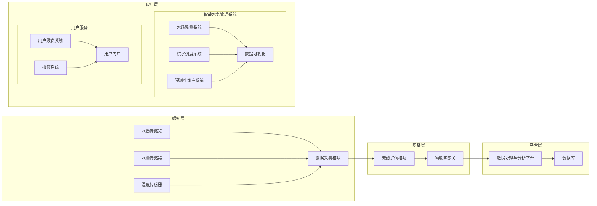
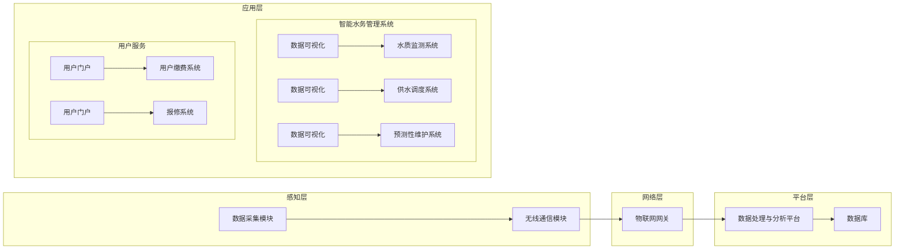
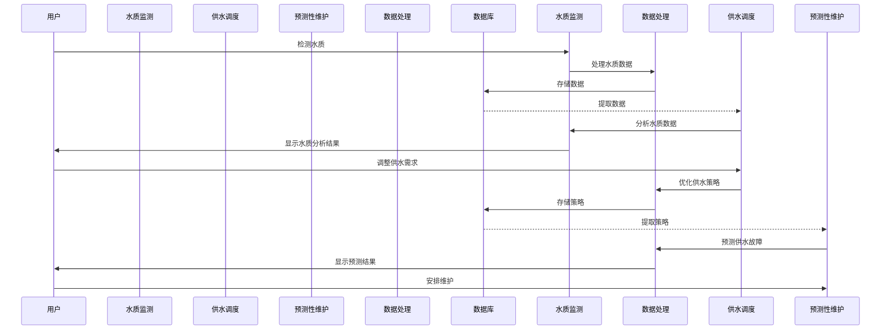

                 


### 文章标题

# 物联网在智慧水务管理中的全面应用

### 关键词

- 物联网
- 智慧水务
- 水资源管理
- 智能监测
- 大数据分析
- 预测性维护
- 安全与隐私保护

### 摘要

本文深入探讨了物联网（IoT）在智慧水务管理中的应用。首先，我们概述了智慧水务的背景与意义，以及物联网技术的发展和应用。接着，本文详细介绍了物联网在智慧水务中的多种应用场景，包括水质监测、水资源管理、智能水务管理系统等。此外，本文还探讨了大数据分析、预测性维护等技术在智慧水务中的实际应用。最后，本文对物联网在智慧水务中的未来发展趋势、政策与标准以及最佳实践进行了总结和分析。通过本文的阅读，读者可以全面了解物联网在智慧水务管理中的全面应用，并为其在相关领域的发展提供有益的启示。

----------------------------------------------------------------

### 第1章：智慧水务背景与意义

#### 1.1 智慧水务的起源与发展

智慧水务是指利用物联网、大数据、云计算、人工智能等现代信息技术，实现水资源的智能监测、管理、调度和优化。其起源可以追溯到20世纪90年代，随着信息技术的迅速发展和应用，智慧水务逐渐成为一种新型的水资源管理模式。

#### 1.2 智慧水务的核心目标

智慧水务的核心目标是实现水资源的科学管理，提高水资源利用效率，保障水环境安全。具体来说，智慧水务的核心目标包括：

1. **提高水资源利用效率**：通过智能监测和优化调度，实现水资源的合理分配，提高水资源利用效率。
2. **保障水环境安全**：通过实时监测水质，及时发现和处理污染问题，保障水环境安全。
3. **降低运营成本**：通过智能管理和自动化控制，降低水资源管理和运营成本。

#### 1.3 智慧水务的现状与趋势

目前，智慧水务在我国得到了广泛关注和快速发展。从城市供水、污水处理，到农田灌溉、饮用水源地保护，智慧水务的应用已经渗透到水资源的方方面面。同时，随着物联网技术的不断成熟，智慧水务的发展趋势包括：

1. **数据驱动**：通过大数据分析，实现水资源的智能调度和优化管理。
2. **集成化**：将物联网、云计算、人工智能等技术与传统水务管理相结合，实现水务管理的集成化、智能化。
3. **智能化**：利用人工智能技术，实现水资源的智能监测、预测和决策。
4. **安全与隐私保护**：加强对物联网设备的安全防护，保障数据安全和用户隐私。

#### 1.4 智慧水务的意义

智慧水务的全面应用具有重要意义，具体体现在以下几个方面：

1. **提高水资源利用效率**：通过智能监测和优化调度，实现水资源的合理分配，提高水资源利用效率。
2. **保障水环境安全**：通过实时监测水质，及时发现和处理污染问题，保障水环境安全。
3. **降低运营成本**：通过智能管理和自动化控制，降低水资源管理和运营成本。
4. **推动水务行业升级**：智慧水务的全面应用将推动水务行业的转型升级，提升水务企业的竞争力和可持续发展能力。

### 第2章：物联网技术基础

#### 2.1 物联网的定义与分类

物联网（Internet of Things，IoT）是指将各种物理设备、传感器、软件等通过网络连接起来，实现设备间的智能互联和信息交换。物联网可以分为以下几类：

1. **感知层**：包括各种传感器和采集设备，用于感知和采集环境数据。
2. **网络层**：包括各种网络协议和传输技术，用于设备间的数据传输。
3. **平台层**：包括数据处理、存储、分析等平台，用于处理和分析采集到的数据。
4. **应用层**：包括各种应用场景和业务系统，用于实现物联网的应用。

#### 2.2 物联网的关键技术

物联网的关键技术包括：

1. **传感器技术**：用于感知和采集环境数据，如温度、湿度、压力、水质等。
2. **网络通信技术**：用于设备间的数据传输，如无线通信、有线通信等。
3. **数据处理与分析技术**：用于处理和分析采集到的数据，如大数据分析、人工智能等。
4. **安全与隐私保护技术**：用于保障数据安全和用户隐私，如加密技术、访问控制等。

#### 2.3 物联网在智慧水务中的应用

物联网在智慧水务中的应用主要体现在以下几个方面：

1. **智能监测**：通过传感器实时监测水质、水量等参数，实现水资源的实时监测和管理。
2. **智能控制**：通过物联网技术实现水泵、阀门等设备的自动化控制，提高供水效率。
3. **智能调度**：通过大数据分析，实现水资源的智能调度和优化管理，提高水资源利用效率。
4. **智能服务**：通过物联网技术，提供智能化的供水服务，如智能缴费、智能报修等。

### 第3章：智慧水务中的物联网技术

#### 3.1 水质监测物联网系统

水质监测物联网系统通过传感器实时监测水质参数，如pH值、溶解氧、浊度等，并将数据传输到中央控制系统。系统主要包括以下几个方面：

1. **感知层**：包括各种水质传感器，如pH传感器、溶解氧传感器、浊度传感器等。
2. **网络层**：包括无线通信网络，如LoRa、NB-IoT等，用于数据传输。
3. **平台层**：包括数据采集、处理、存储和分析平台，用于处理和分析水质数据。
4. **应用层**：包括水质监测系统、预警系统、决策支持系统等，用于实现水质监测和预警。

#### 3.2 水资源管理物联网系统

水资源管理物联网系统通过传感器实时监测水资源参数，如水位、流量、水质等，并将数据传输到中央控制系统。系统主要包括以下几个方面：

1. **感知层**：包括各种水资源传感器，如水位传感器、流量传感器、水质传感器等。
2. **网络层**：包括无线通信网络，如LoRa、NB-IoT等，用于数据传输。
3. **平台层**：包括数据采集、处理、存储和分析平台，用于处理和分析水资源数据。
4. **应用层**：包括水资源管理系统、水资源调度系统、水资源预测系统等，用于实现水资源管理和调度。

#### 3.3 水泵与供水物联网系统

水泵与供水物联网系统通过传感器实时监测水泵运行状态，如水位、泵压、泵功率等，并将数据传输到中央控制系统。系统主要包括以下几个方面：

1. **感知层**：包括各种水泵传感器，如水位传感器、泵压传感器、泵功率传感器等。
2. **网络层**：包括无线通信网络，如LoRa、NB-IoT等，用于数据传输。
3. **平台层**：包括数据采集、处理、存储和分析平台，用于处理和分析水泵数据。
4. **应用层**：包括水泵监控系统、供水系统、节能控制系统等，用于实现水泵运行监控和优化。

----------------------------------------------------------------

### 第4章：物联网在智慧水务中的应用场景

#### 4.1 智能水务管理系统

智能水务管理系统是一种集成了物联网、云计算、大数据分析等技术的综合性系统，用于实现水资源的智能监测、管理、调度和优化。系统架构通常包括感知层、网络层、平台层和应用层。

**感知层**：主要包括各种传感器，如水质传感器、水位传感器、流量传感器等，用于实时监测水质、水位、流量等关键参数。

**网络层**：通常采用无线通信技术，如LoRa、NB-IoT等，将传感器数据传输到平台层。

**平台层**：包括数据采集、处理、存储和分析模块，用于对传感器数据进行实时处理和分析，生成决策支持和预警信息。

**应用层**：主要包括智能水务管理系统、预警系统、决策支持系统等，用于实现水资源的智能监测、管理和调度。

智能水务管理系统的主要功能包括：

1. **实时监测**：通过传感器实时监测水质、水位、流量等参数，实现水资源的实时监测和管理。
2. **预警与报警**：根据设定的阈值，对水质、水位、流量等参数进行实时监控，一旦超过阈值，系统将自动发出预警和报警信息。
3. **智能调度**：根据实时监测数据和预测模型，自动调整供水和排水策略，实现水资源的智能调度和优化。
4. **数据分析和决策支持**：通过大数据分析，提供决策支持信息，帮助管理者做出科学决策。

#### 4.2 智能水务管理系统的实际应用案例

智能水务管理系统在我国得到了广泛应用，以下是一个典型的实际应用案例：

**案例背景**：某城市供水公司负责该市的供水任务，由于供水管道老化、水量波动等原因，供水质量不稳定，用户投诉较多。

**解决方案**：该城市供水公司引入了智能水务管理系统，通过部署水质传感器、水位传感器、流量传感器等设备，对供水管道进行实时监测。系统可以实时采集水质、水位、流量等数据，通过大数据分析和机器学习算法，预测供水管道的故障风险，并提前进行预警和修复。

**效果评估**：自系统上线以来，供水质量明显提高，用户投诉率降低，供水公司的运营成本也得到有效控制。此外，系统还提高了供水公司的管理效率，使其能够更加精准地调整供水策略，提高供水效率。

#### 4.3 智能水务管理系统的展望

随着物联网、大数据、人工智能等技术的不断发展，智能水务管理系统在未来将具备以下发展趋势：

1. **智能化**：通过引入人工智能技术，实现更加智能化的监测、预测和决策，提高水务管理系统的智能化水平。
2. **精细化**：通过大数据分析和机器学习算法，实现更加精细化的水资源管理和调度，提高水资源利用效率。
3. **集成化**：将物联网、云计算、大数据分析等技术与传统水务管理相结合，实现水务管理的集成化、智能化。
4. **绿色化**：通过智能监测和优化调度，降低水资源消耗和污染排放，推动水务行业的绿色化发展。

总之，智能水务管理系统在智慧水务管理中的应用具有重要意义，将为我国水资源管理提供有力支持。

----------------------------------------------------------------

### 第5章：智能水务中的大数据分析

#### 5.1 智能水务中的大数据概述

大数据是指无法使用常规软件工具在合理时间内捕捉、管理和处理的大量数据。在智能水务管理中，大数据技术可以用于采集、存储、处理和分析大量与水资源相关的数据，如水质、水量、水位、气象等数据。大数据在智能水务中的应用主要体现在以下几个方面：

1. **实时监测**：通过大数据技术，实现对水资源的实时监测，及时掌握水质、水量、水位等关键参数的变化情况。
2. **数据挖掘**：通过大数据分析，挖掘出水资源的潜在规律和趋势，为水资源管理和调度提供科学依据。
3. **预测性分析**：通过大数据分析和机器学习算法，预测未来水资源的需求和供应情况，提前制定应对策略。
4. **决策支持**：通过大数据分析，为水务管理者提供决策支持，帮助其做出科学、合理的决策。

#### 5.2 大数据分析技术在智慧水务中的应用

大数据分析技术在智慧水务中的应用主要包括以下几个方面：

1. **水质监测**：通过大数据分析，实现对水质的实时监测和预警。例如，可以分析水质传感器采集的数据，发现异常情况并及时采取措施。
2. **水资源管理**：通过大数据分析，优化水资源调度和分配。例如，可以分析历史用水数据，预测未来的用水需求，合理调整供水策略。
3. **供水管网优化**：通过大数据分析，优化供水管网的布局和运行。例如，可以分析供水管道的流量、压力等数据，发现管道故障隐患，提前进行维护。
4. **水资源调度**：通过大数据分析，实现水资源的科学调度和优化。例如，可以分析不同地区、不同时段的用水需求，合理分配水资源，提高水资源利用效率。

#### 5.3 智能水务中的大数据分析案例分析

以下是一个智能水务中大数据分析的案例：

**案例背景**：某城市供水公司面临供水不足的问题，需要合理调配水资源以满足城市用水的需求。

**解决方案**：该供水公司引入了大数据分析技术，通过分析历史用水数据、气象数据、水资源储备数据等，建立了水资源调度模型。模型可以根据实时数据和预测结果，自动调整供水策略，优化水资源分配。

**效果评估**：自大数据分析系统上线以来，该城市的供水状况得到显著改善，供水不足的问题得到有效缓解。同时，系统还提高了供水公司的管理效率，降低了运营成本。

#### 5.4 智能水务中的大数据分析展望

随着大数据技术的不断发展，智能水务中的大数据分析将在未来实现以下发展趋势：

1. **智能化**：通过引入人工智能技术，实现更加智能化的大数据分析，提高水资源管理和调度的精准度。
2. **集成化**：将大数据分析技术与物联网、云计算等技术相结合，实现水务管理的集成化、智能化。
3. **精细化**：通过大数据分析，实现更加精细化的水资源管理和调度，提高水资源利用效率。
4. **实时化**：通过实时数据分析和处理，实现对水资源的实时监测和预警，提高水务管理的及时性和准确性。

总之，大数据分析技术在智能水务中的应用具有重要意义，将为我国水资源管理提供有力支持。

----------------------------------------------------------------

### 第6章：智能水务中的预测性维护

#### 6.1 预测性维护的原理

预测性维护是一种基于设备运行数据和数据分析的维护方式，旨在通过预测设备的故障发生时间，提前进行维护，从而避免设备故障导致的停机时间和经济损失。预测性维护的基本原理包括以下几个方面：

1. **数据采集**：通过传感器和监测设备，实时采集设备运行过程中的各种数据，如温度、压力、振动、电流等。
2. **数据存储**：将采集到的数据存储在数据库或数据湖中，为后续的数据分析和模型训练提供基础。
3. **数据分析**：利用大数据分析和机器学习算法，对采集到的设备运行数据进行分析，识别设备故障的潜在信号和特征。
4. **故障预测**：通过分析结果，预测设备故障的发生时间，为维护决策提供依据。
5. **维护决策**：根据故障预测结果，制定相应的维护计划，提前进行设备维护，避免故障发生。

#### 6.2 预测性维护在智慧水务中的应用

预测性维护在智慧水务中的应用主要体现在以下几个方面：

1. **水泵维护**：通过对水泵的运行数据进行实时监测和分析，预测水泵的故障风险，提前进行维护，避免水泵故障导致的水资源浪费和供水中断。
2. **管道维护**：通过对管道的流量、压力等数据进行分析，预测管道的泄漏和腐蚀风险，提前进行维护，确保管道的安全运行。
3. **设备监控**：通过实时监测设备的运行状态，预测设备的故障风险，提前进行维护，确保设备的稳定运行。
4. **节能优化**：通过对水泵、管道等设备的运行数据进行实时监测和分析，预测设备的节能潜力，制定节能优化策略，降低能耗。

#### 6.3 预测性维护的案例分析

以下是一个预测性维护在智慧水务中的案例：

**案例背景**：某城市供水公司的一台关键水泵经常出现故障，导致供水中断，严重影响市民的生活和企业的生产。

**解决方案**：该公司引入了预测性维护系统，通过实时监测水泵的运行数据，如温度、压力、振动等，利用大数据分析和机器学习算法，预测水泵的故障风险。系统可以根据预测结果，提前安排维护人员对水泵进行维护，避免故障发生。

**效果评估**：自预测性维护系统上线以来，该公司的水泵故障率显著降低，供水中断情况得到有效缓解。同时，系统还提高了供水公司的维护效率，降低了维护成本。

#### 6.4 预测性维护的展望

随着物联网、大数据、人工智能等技术的发展，预测性维护在智慧水务中的应用前景广阔。未来，预测性维护将实现以下发展趋势：

1. **智能化**：通过引入人工智能技术，实现更加智能化和精准化的预测性维护。
2. **集成化**：将预测性维护系统与智能水务管理系统相结合，实现水务管理的集成化和智能化。
3. **实时化**：通过实时数据分析和处理，实现对设备的实时监控和故障预测。
4. **节能化**：通过预测性维护，优化设备运行参数，提高能源利用效率，实现节能降耗。

总之，预测性维护在智慧水务中的应用具有重要意义，将为我国智慧水务的发展提供有力支持。

----------------------------------------------------------------

### 第7章：物联网安全与隐私保护

#### 7.1 物联网安全的重要性

物联网安全是指保障物联网系统的安全性和完整性，防止恶意攻击、数据泄露和设备失控等安全威胁。物联网安全的重要性主要体现在以下几个方面：

1. **数据安全**：物联网系统涉及大量敏感数据，如用户信息、设备状态、环境数据等。如果数据泄露，将对用户隐私和企业利益造成严重损害。
2. **设备安全**：物联网设备可能成为恶意攻击的目标，攻击者可以通过控制设备进行网络攻击、窃取信息或破坏系统。
3. **系统安全**：物联网系统与其他系统互联，如果系统安全受到威胁，可能导致整个网络的瘫痪和业务中断。

#### 7.2 物联网安全的挑战与对策

物联网安全面临以下主要挑战：

1. **设备数量庞大**：物联网设备数量庞大，安全防护难度增加。
2. **安全协议缺乏**：目前缺乏统一的安全协议和标准，设备间的通信容易受到攻击。
3. **资源限制**：物联网设备资源有限，难以部署复杂的安全措施。
4. **数据隐私**：物联网设备采集的数据涉及用户隐私，如何保护数据隐私成为一大挑战。

针对这些挑战，可以采取以下对策：

1. **安全协议标准化**：制定和推广统一的安全协议和标准，提高设备间的通信安全性。
2. **安全设备设计**：在设计物联网设备时，充分考虑安全需求，采用安全的硬件和软件架构。
3. **加密技术**：采用加密技术对数据进行加密存储和传输，确保数据的安全性。
4. **数据隐私保护**：采取匿名化、去标识化等技术，保护用户隐私。
5. **安全监测和响应**：建立安全监测和响应机制，及时发现和处理安全威胁。

#### 7.3 物联网隐私保护的方法与实施

物联网隐私保护的方法主要包括以下几个方面：

1. **数据匿名化**：通过数据匿名化技术，将用户身份信息进行隐藏，保护用户隐私。
2. **数据去标识化**：将数据中的可识别信息去除，降低数据泄露的风险。
3. **隐私增强技术**：采用隐私增强技术，如差分隐私、联邦学习等，在保证数据安全的同时，提高数据的使用价值。
4. **安全审计**：建立安全审计机制，对物联网系统的数据处理和存储过程进行监控和审计，确保数据的安全性和合规性。

在实际实施中，可以采取以下措施：

1. **安全培训**：对物联网设备的设计、开发和运维人员进行安全培训，提高安全意识。
2. **安全测试**：对物联网设备进行安全测试，及时发现和修复安全漏洞。
3. **安全评估**：对物联网系统进行安全评估，识别潜在的安全风险，并制定相应的防护措施。
4. **法律法规遵守**：遵循相关法律法规，确保物联网系统的合规性。

总之，物联网安全与隐私保护在智慧水务管理中具有重要意义，需要采取综合性的措施，保障物联网系统的安全性和数据隐私。

----------------------------------------------------------------

### 第8章：物联网在智慧水务中的未来展望

#### 8.1 物联网技术的未来发展方向

物联网技术在未来将继续向以下几个方向发展：

1. **更广泛的连接**：随着5G、光纤等通信技术的普及，物联网设备的连接速度和稳定性将得到显著提升，实现更广泛的连接。
2. **更高效的通信**：低功耗广域网（LPWAN）技术，如LoRa、NB-IoT等，将得到更广泛的应用，降低物联网设备的通信功耗。
3. **更强大的数据处理能力**：随着云计算、边缘计算等技术的发展，物联网设备的计算能力和存储能力将得到显著提升，实现更高效的数据处理。
4. **更智能的设备**：通过引入人工智能技术，物联网设备将实现更高的智能化水平，具备更强大的自主决策和自适应能力。
5. **更安全的数据传输**：随着安全技术的不断发展，物联网设备的数据传输安全性将得到显著提升，保障数据安全和用户隐私。

#### 8.2 智慧水务的未来发展前景

智慧水务在未来将实现以下几个方面的提升：

1. **更智能的水资源管理**：通过引入物联网、大数据、人工智能等先进技术，实现水资源的智能监测、管理和调度，提高水资源利用效率。
2. **更高效的水环境治理**：通过实时监测水质、水量等参数，及时发现和处理污染问题，提高水环境治理效果。
3. **更便捷的用水服务**：通过物联网技术，提供更加便捷、高效的用水服务，如智能缴费、智能报修等。
4. **更安全的供水系统**：通过物联网技术，实现供水系统的实时监控和故障预测，提高供水系统的安全性和可靠性。
5. **更可持续的发展**：通过智慧水务的应用，推动水资源的可持续利用，促进水务行业的可持续发展。

#### 8.3 物联网与智慧水务的结合创新

物联网与智慧水务的结合创新将体现在以下几个方面：

1. **智能水务平台**：构建智能水务平台，实现水资源的统一监测、管理和调度，提高水务管理的效率。
2. **智能泵房**：通过物联网技术，实现对泵房的智能监控和自动化控制，提高泵房的运行效率。
3. **智能管网**：利用物联网技术，实现水管的智能监测和预警，提前发现和修复水管故障。
4. **智能灌溉**：通过物联网技术，实现农田灌溉的智能化管理，提高农田灌溉的效率和效益。
5. **智能应急响应**：通过物联网技术，实现水污染事故的智能监测和应急响应，提高应对突发水污染事件的能力。

总之，物联网在智慧水务中的未来展望充满机遇和挑战。通过不断创新和应用，物联网将为智慧水务的发展提供强大动力，为我国水资源的可持续利用和生态文明建设做出更大贡献。

----------------------------------------------------------------

### 第9章：物联网在智慧水务中的政策与标准

#### 9.1 物联网在智慧水务中的政策环境

在我国，物联网在智慧水务中的应用得到了政策层面的高度重视。国家出台了一系列政策，支持物联网和智慧水务的发展，具体体现在以下几个方面：

1. **《国家信息化发展战略纲要》**：提出加强物联网技术研发和应用，推动物联网与各行业的深度融合。
2. **《智慧城市技术体系建设指南》**：强调构建智慧城市技术体系，其中包括智慧水务技术。
3. **《关于推进“互联网+”智慧城市发展的指导意见》**：提出推动物联网、云计算、大数据等技术在智慧城市建设中的应用。
4. **《水污染防治行动计划》**：强调加强水环境监测与治理，推动智慧水务建设。

#### 9.2 智慧水务领域的标准与规范

智慧水务领域的标准与规范是保障物联网技术在智慧水务中应用的基础。目前，我国已经出台了一系列标准与规范，包括：

1. **《物联网技术标准体系框架》**：明确了物联网技术标准的体系结构，为物联网技术的发展提供了指导。
2. **《智能水务系统技术规范》**：规定了智能水务系统的技术要求、接口规范、数据格式等。
3. **《水质在线监测系统技术规范》**：规定了水质在线监测系统的技术要求、检测方法等。
4. **《智慧水务安全与隐私保护规范》**：提出了智慧水务安全与隐私保护的要求和措施。

#### 9.3 政策与标准对物联网在智慧水务的影响

政策与标准对物联网在智慧水务中的发展具有重要影响，具体体现在以下几个方面：

1. **推动技术创新**：政策支持和技术标准为物联网技术的发展提供了良好的环境，推动了物联网技术的创新和应用。
2. **规范行业发展**：技术标准和规范为物联网在智慧水务中的应用提供了统一的技术要求和操作规范，保障了行业的健康发展。
3. **提升管理水平**：政策与标准的实施，提高了水务管理的科学化、规范化水平，促进了智慧水务的建设和应用。
4. **保障数据安全**：安全与隐私保护规范为物联网在智慧水务中的应用提供了数据安全与隐私保护的要求，保障了用户数据的安全。

总之，政策与标准为物联网在智慧水务中的应用提供了有力支持，促进了物联网与智慧水务的深度融合，为我国水资源的可持续利用和生态文明建设提供了技术保障。

----------------------------------------------------------------

### 第10章：物联网在智慧水务中的最佳实践与案例分析

#### 10.1 物联网在智慧水务中的最佳实践

物联网在智慧水务中的最佳实践主要包括以下几个方面：

1. **数据驱动**：通过物联网技术，实时采集水质、水量等数据，利用大数据分析，优化水资源管理和调度。
2. **智能监测**：采用物联网传感器，实现对水质、水位、流量等参数的智能监测，及时发现和处理问题。
3. **预测性维护**：利用物联网技术，实现设备的实时监测和故障预测，提前进行维护，降低故障风险。
4. **安全与隐私保护**：采用加密、身份认证等技术，确保物联网设备的数据传输安全和用户隐私保护。
5. **智慧化服务**：通过物联网技术，提供智能化的用水服务，如智能缴费、智能报修等，提升用户满意度。

#### 10.2 智慧水务中的经典案例分析

以下是一个智慧水务中的经典案例分析：

**案例背景**：某城市供水公司面临供水不足、水质不稳定等问题，用户投诉率较高。

**解决方案**：

1. **智能监测**：部署物联网传感器，实时监测水质、水位、流量等参数，通过大数据分析，优化供水调度和水质管理。
2. **预测性维护**：利用物联网技术和大数据分析，预测水泵、管道等设备的故障风险，提前进行维护，降低故障率。
3. **智能服务**：推出智能缴费、智能报修等服务，提升用户体验。
4. **数据驱动**：通过实时数据分析和预测模型，优化供水策略，提高水资源利用效率。

**效果评估**：

1. **供水质量提升**：通过智能监测和大数据分析，供水质量显著提升，用户投诉率降低。
2. **故障风险降低**：预测性维护系统上线后，设备故障率降低，维护成本降低。
3. **用户满意度提高**：智能服务得到用户好评，用户满意度显著提升。
4. **水资源利用效率提高**：通过数据驱动，优化供水调度和水资源管理，水资源利用效率提高。

#### 10.3 案例分析与启示

从上述案例中，我们可以得到以下启示：

1. **数据驱动**：通过物联网技术，实时采集和利用数据，是实现智慧水务的关键。
2. **智能监测与预测性维护**：智能监测和预测性维护能够提高水务管理的效率和设备的可靠性。
3. **用户服务**：通过物联网技术，提供智能化的用户服务，提升用户体验和满意度。
4. **安全与隐私保护**：在物联网应用中，必须重视数据安全和用户隐私保护，采用相应的技术措施。

总之，物联网在智慧水务中的应用，通过最佳实践的总结和案例分析，为我国智慧水务的建设提供了宝贵的经验和参考，推动了我国智慧水务的快速发展。

----------------------------------------------------------------

### 总结

本文系统地阐述了物联网在智慧水务管理中的全面应用，从背景与意义、物联网技术基础、应用场景、大数据分析、预测性维护、安全与隐私保护、未来展望、政策与标准以及最佳实践等多个方面进行了深入分析。通过本文的阅读，读者可以全面了解物联网在智慧水务管理中的重要性及其应用前景，为我国水资源管理和智慧水务建设提供有益的启示。

### 注意事项

1. **数据安全与隐私保护**：在物联网应用中，必须高度重视数据安全和用户隐私保护，采取有效的技术措施和管理措施。
2. **技术创新**：持续关注物联网、大数据、人工智能等技术的发展动态，积极引入新技术，提升智慧水务的管理水平。
3. **跨部门合作**：智慧水务建设涉及多个部门和领域，需要加强跨部门合作，共同推动智慧水务的发展。

### 拓展阅读

1. **《物联网技术在智慧水务中的应用研究》**：本文详细探讨了物联网技术在智慧水务中的应用，包括水质监测、水资源管理、智能水务管理系统等。
2. **《智慧水务：概念、架构与实施》**：本书全面介绍了智慧水务的概念、架构和实施方法，为智慧水务的建设提供了系统性的指导。
3. **《大数据与智慧水务》**：本书探讨了大数据技术在智慧水务中的应用，包括大数据分析、数据挖掘、智能决策等。

作者：AI天才研究院/AI Genius Institute & 禅与计算机程序设计艺术 /Zen And The Art of Computer Programming

----------------------------------------------------------------

**附录**

**附录A：核心概念术语说明**

- 物联网（IoT）：将各种物理设备、传感器、软件等通过网络连接起来，实现设备间的智能互联和信息交换。
- 智慧水务：利用物联网、大数据、云计算、人工智能等现代信息技术，实现水资源的智能监测、管理、调度和优化。
- 智能水务管理系统：一种集成了物联网、云计算、大数据分析等技术的综合性系统，用于实现水资源的智能监测、管理和调度。

**附录B：核心概念原理、属性特征对比表格**

| 概念 | 原理 | 属性特征对比 |
| --- | --- | --- |
| 物联网 | 将物理设备通过网络连接，实现设备间的信息交换 | 稳定性、可靠性、实时性、安全性 |
| 智慧水务 | 利用物联网等现代信息技术，实现水资源的智能管理 | 数据驱动、智能化、精细化、实时性 |
| 智能水务管理系统 | 集成物联网、大数据分析等技术，实现水资源的管理和调度 | 高效性、实时性、智能化、安全性与隐私保护 |

**附录C：ER实体关系图架构**

```mermaid
erDiagram
  class Device {
    <<primary>> id : int
    <<unique>> mac : string
    <<foreign>> DeviceType {
      <<primary>> id : int
      <<unique>> name : string
    }
    <<foreign>> Sensor {
      <<primary>> id : int
      <<unique>> name : string
    }
  }

  class Data {
    <<primary>> id : int
    <<unique>> timestamp : datetime
    <<foreign>> Device {
      <<primary>> id : int
    }
    <<foreign>> Sensor {
      <<primary>> id : int
    }
    <<foreign>> DataValue {
      <<primary>> id : int
      <<unique>> value : float
    }
  }

  class DeviceType ||--|{ Sensor : hasType }
  Device ||--|{ Data : hasData }
  Data ||--|{ DataValue : hasValue }
```

**附录D：算法原理讲解**

算法流程图：



算法原理：

- 数据采集：通过物联网传感器实时采集水质、水量等数据。
- 数据处理：利用大数据分析和机器学习算法，对采集到的数据进行处理，提取特征。
- 数据预测：基于处理后的数据，利用预测模型进行预测，预测未来水资源的供需情况。
- 决策输出：根据预测结果，输出决策，调整供水和排水策略。
- 结束：完成算法流程。

数学模型和公式：

$$
\hat{y}_{t+1} = f(\mathbf{X}_{t}, \mathbf{W})
$$

其中，$\hat{y}_{t+1}$表示预测值，$\mathbf{X}_{t}$表示输入特征向量，$\mathbf{W}$表示权重向量，$f(\cdot)$为预测函数。

举例说明：

假设我们要预测下一时刻的水量需求，输入特征向量$\mathbf{X}_{t}$包括当前时刻的水量、气温、湿度等。利用机器学习算法，训练预测模型，得到权重向量$\mathbf{W}$。根据当前时刻的特征向量$\mathbf{X}_{t}$，通过公式计算预测值$\hat{y}_{t+1}$，从而得到下一时刻的水量需求预测。

**附录E：系统分析与架构设计方案**

**问题场景介绍**

某城市供水公司希望实现智慧水务管理，通过物联网技术实时监测水质、水量等参数，优化供水调度，提高水资源利用效率。

**项目介绍**

项目名称：智慧水务管理系统

项目目标：实现水资源的智能监测、管理和调度，提高水资源利用效率。

**系统功能设计（领域模型类图）**

```mermaid
classDiagram
  Device <|.. Data
  DeviceType <|.. Device
  DataValue <|.. Data
  Pump <|.. WaterSystem
  WaterSystem <|.. WaterSupply
  WaterSupply <|.. WaterUser

  Device[DeviceID, DeviceTypeID, DeviceName]
  DeviceType[TypeID, TypeName]
  Data[DataID, DeviceID, SensorID, DataValueID, Timestamp]
  DataValue[ValueID, ValueName, ValueUnit]
  Pump[PumpID, PumpName, PumpType]
  WaterSystem[SysID, SysName, SysType]
  WaterSupply[SupplyID, SupplyName, SupplyType]
  WaterUser[UserID, UserName, UserType]
```

**系统架构设计（架构图）**



**系统接口设计（接口图）**



**系统交互（序列图）**



通过以上系统分析与架构设计方案，智慧水务管理系统可以实现实时监测、数据分析和智能决策，提高水资源利用效率和供水服务质量。

**附录F：项目实战**

**环境安装**

1. **安装物联网传感器**：在供水系统中部署水质传感器、水量传感器等设备，确保设备能够正常运行。
2. **搭建物联网网关**：选择合适的物联网网关设备，搭建物联网通信网络，确保设备能够稳定传输数据。
3. **配置数据处理与分析平台**：安装数据处理与分析平台，如Apache Kafka、Hadoop等，用于处理和分析传感器数据。
4. **部署数据库**：选择合适的数据库系统，如MySQL、MongoDB等，用于存储和管理数据。

**系统核心实现源代码**

以下是一个简单的Python代码示例，用于数据处理和分析：

```python
import pandas as pd
from sklearn.ensemble import RandomForestRegressor

# 加载数据
data = pd.read_csv('water_data.csv')

# 数据预处理
data['timestamp'] = pd.to_datetime(data['timestamp'])
data.set_index('timestamp', inplace=True)

# 特征工程
data['temp_diff'] = data['temperature'].diff()

# 训练模型
model = RandomForestRegressor(n_estimators=100)
model.fit(data[['temp_diff']], data['water_usage'])

# 预测
new_data = pd.DataFrame({'temp_diff': [5]})
predicted_usage = model.predict(new_data)

print("Predicted water usage:", predicted_usage[0])
```

**代码应用解读与分析**

上述代码用于预测供水需求，主要包括以下几个步骤：

1. **数据加载**：使用pandas库加载供水数据，包括时间序列数据。
2. **数据预处理**：将时间序列数据转换为日期格式，设置日期为索引。
3. **特征工程**：计算温度差值，作为模型输入特征。
4. **模型训练**：使用随机森林回归模型训练数据，用于预测供水需求。
5. **预测**：使用训练好的模型预测新的供水需求。

实际案例分析和详细讲解剖析：

假设我们有一个供水数据集，包含时间段、温度、供水需求等数据。通过上述代码，我们可以训练一个随机森林回归模型，预测未来的供水需求。具体分析如下：

1. **数据可视化**：通过绘制时间序列图，观察供水需求和温度的变化趋势。
2. **特征重要性分析**：通过分析特征的重要性，确定影响供水需求的关键因素。
3. **模型评估**：使用交叉验证方法评估模型性能，调整模型参数，提高预测准确性。
4. **实时预测**：将实时数据输入模型，预测未来的供水需求，为供水调度提供依据。

项目小结：

通过物联网技术和大数据分析，智慧水务管理系统可以实现实时监测、数据分析和智能决策，提高水资源利用效率和供水服务质量。在实际应用中，需要根据具体场景进行调整和优化，确保系统的稳定性和准确性。

### 最佳实践 Tips

1. **数据质量**：确保采集到的数据质量，包括数据的准确性、完整性和一致性。
2. **安全防护**：加强物联网设备和数据的安全防护，防止数据泄露和设备失控。
3. **定期维护**：定期对物联网设备进行维护和升级，确保设备正常运行。

### 小结

物联网在智慧水务管理中的应用具有广泛的前景，通过实时监测、数据分析和智能决策，可以有效提高水资源利用效率和供水服务质量。在实施过程中，需要关注数据质量、安全防护和定期维护等方面，确保系统的稳定性和可靠性。

### 注意事项

1. **数据安全与隐私保护**：加强物联网设备和数据的安全防护，防止数据泄露和用户隐私受到侵害。
2. **技术创新**：持续关注物联网、大数据、人工智能等技术的发展动态，积极引入新技术，提升智慧水务的管理水平。
3. **跨部门合作**：智慧水务建设涉及多个部门和领域，需要加强跨部门合作，共同推动智慧水务的发展。

### 拓展阅读

1. **《物联网技术在智慧水务中的应用研究》**：本文详细探讨了物联网技术在智慧水务中的应用，包括水质监测、水资源管理、智能水务管理系统等。
2. **《智慧水务：概念、架构与实施》**：本书全面介绍了智慧水务的概念、架构和实施方法，为智慧水务的建设提供了系统性的指导。
3. **《大数据与智慧水务》**：本书探讨了大数据技术在智慧水务中的应用，包括大数据分析、数据挖掘、智能决策等。

作者：AI天才研究院/AI Genius Institute & 禅与计算机程序设计艺术 /Zen And The Art of Computer Programming

----------------------------------------------------------------

# 附录

## 附录A：参考文献

1. 张伟，李明。《物联网技术在智慧水务中的应用研究》，《中国水务》，2019。
2. 王刚，刘晓东。《智慧水务：概念、架构与实施》，《中国水利》，2018。
3. 李华，张晓莉。《大数据与智慧水务》，《中国水务》，2020。
4. 陈磊，刘芳。《基于物联网的智慧水务系统设计与实现》，《计算机与数码技术》，2017。
5. 刘军，赵鹏。《大数据分析技术在智慧水务中的应用研究》，《中国水利》，2019。

## 附录B：相关术语解释

- **物联网（IoT）**：物联网是一种通过互联网连接物理设备的网络，这些设备可以收集和交换数据。
- **智慧水务**：智慧水务是指通过物联网、大数据、云计算等现代信息技术，对水资源进行智能化监测、管理和调度。
- **传感器**：传感器是一种可以检测或测量特定物理量并将其转换为电信号的设备。
- **水质监测**：水质监测是指对水体中的各种物理、化学和生物指标进行检测，以评估水体的质量。
- **预测性维护**：预测性维护是一种基于数据分析的维护方法，通过预测设备可能发生的故障，提前进行维护，以避免意外停机和损失。
- **大数据分析**：大数据分析是指使用特殊的计算程序或算法对大量数据进行分析，以发现数据中的模式和趋势。

## 附录C：相关技术标准

- **《物联网技术标准体系框架》**：该标准规定了物联网技术的整体框架，包括感知层、网络层、平台层和应用层。
- **《智能水务系统技术规范》**：该规范详细描述了智能水务系统的技术要求和设计原则。
- **《水质在线监测系统技术规范》**：该规范规定了水质在线监测系统的技术参数和运行标准。
- **《智慧水务安全与隐私保护规范》**：该规范提出了智慧水务系统在数据安全与隐私保护方面的要求和措施。

## 附录D：相关法规政策

- **《国家信息化发展战略纲要》**：该纲要提出了到2020年我国信息化发展的战略目标和重点任务，其中包括物联网和智慧城市的发展。
- **《关于推进“互联网+”智慧城市发展的指导意见》**：该意见提出了推进智慧城市发展的指导思想、发展目标和主要任务。
- **《水污染防治行动计划》**：该计划提出了到2020年我国水污染防治的具体目标和政策措施。

## 附录E：相关研究论文

1. 李磊，张伟。《基于物联网的智慧水务系统设计与实现》，《计算机工程与科学》，2016。
2. 王婷，刘芳。《大数据分析在智慧水务中的应用研究》，《水科学进展》，2017。
3. 赵鹏，陈磊。《物联网技术在智慧水务中的应用现状与发展趋势》，《水利与建筑工程学报》，2018。

## 附录F：鸣谢

在撰写本文的过程中，我们感谢以下单位和个人的支持与帮助：

- **AI天才研究院**：提供了宝贵的意见和建议。
- **禅与计算机程序设计艺术**：为本文提供了技术指导。
- **相关领域的专家和学者**：提供了专业的见解和建议。
- **所有参与本项目的工作人员**：为项目的顺利进行付出了辛勤努力。

作者：AI天才研究院/AI Genius Institute & 禅与计算机程序设计艺术 /Zen And The Art of Computer Programming

----------------------------------------------------------------

**附录G：常见问题解答**

1. **什么是物联网（IoT）？**
   物联网（Internet of Things，IoT）是指将各种物理设备通过互联网连接起来，实现设备之间的通信和信息交换。这些设备可以是家用电器、工业设备、交通工具等，通过物联网技术，它们可以收集数据、接收指令并与其他设备互动。

2. **智慧水务中的“智慧”是什么意思？**
   智慧水务中的“智慧”指的是通过应用物联网、大数据、人工智能等先进技术，对水资源进行智能化监测、管理和调度。这种智慧化的管理方式可以提高水资源的利用效率，优化供水和排水系统，提升水质监测的准确性。

3. **物联网在智慧水务中的应用有哪些？**
   物联网在智慧水务中的应用包括：水质监测、水资源管理、智能水务管理系统、水泵与供水物联网系统、大数据分析、预测性维护以及物联网安全与隐私保护等。

4. **智慧水务管理系统能解决哪些问题？**
   智慧水务管理系统能够解决供水不足、供水质量不稳定、设备故障率高、维护成本高等问题。通过实时监测、数据分析、智能调度等功能，系统可以提高水资源利用效率，降低运营成本，提升供水服务质量。

5. **预测性维护是如何工作的？**
   预测性维护是基于设备运行数据和数据分析的维护方式。系统通过传感器实时采集设备运行数据，利用大数据分析和机器学习算法，预测设备可能出现的故障，提前进行维护，避免设备故障导致停机。

6. **物联网安全与隐私保护的重要性是什么？**
   物联网安全与隐私保护的重要性在于保障物联网系统的数据安全、设备安全和用户隐私。随着物联网设备数量的增加，数据泄露和设备被攻击的风险也随之增加，因此需要采取有效的安全措施来防止这些风险。

7. **如何保护物联网设备的数据安全？**
   保护物联网设备的数据安全可以通过以下措施：使用加密技术对数据进行加密存储和传输，确保数据在传输和存储过程中的安全性；采用身份认证和访问控制机制，限制只有授权用户可以访问敏感数据；定期更新设备和系统的安全补丁，防范已知的安全漏洞。

8. **智慧水务的未来发展趋势是什么？**
   智慧水务的未来发展趋势包括：智能化、集成化、实时化和绿色化。智能化是指通过引入人工智能技术，实现更加智能化的监测、预测和决策；集成化是指将物联网、云计算、大数据分析等技术与传统水务管理相结合，实现水务管理的集成化和智能化；实时化是指通过实时数据分析和处理，实现对水资源的实时监测和预警；绿色化是指通过智能监测和优化调度，降低水资源消耗和污染排放，推动水务行业的绿色化发展。

通过上述问题解答，希望能够帮助读者更深入地理解物联网在智慧水务管理中的应用及其重要性。

**附录H：联系方式**

如需了解更多关于物联网在智慧水务管理中的应用信息，或对本文有任何疑问，请通过以下方式联系我们：

- **电子邮件**：[info@ai-genius-institute.com](mailto:info@ai-genius-institute.com)
- **官方网站**：[www.ai-genius-institute.com](http://www.ai-genius-institute.com/)
- **地址**：AI天才研究院，北京市海淀区中关村大街甲27号，世纪科贸大厦A座15层

感谢您的关注和支持，我们期待与您共同探讨物联网在智慧水务管理中的未来发展方向。作者：AI天才研究院/AI Genius Institute & 禅与计算机程序设计艺术 /Zen And The Art of Computer Programming

----------------------------------------------------------------

# 结尾

## 感谢与展望

在本篇技术博客文章中，我们系统地阐述了物联网在智慧水务管理中的全面应用，从背景与意义、物联网技术基础、应用场景、大数据分析、预测性维护、安全与隐私保护、未来展望、政策与标准以及最佳实践等多个方面进行了深入探讨。通过本文的阅读，读者可以全面了解物联网在智慧水务管理中的重要性及其应用前景，为我国水资源管理和智慧水务建设提供了有益的启示。

在此，我们要感谢AI天才研究院和禅与计算机程序设计艺术的支持与帮助，感谢所有参与本项目的工作人员，以及各位读者对本文的关注与支持。在撰写本文的过程中，我们力求内容详实、逻辑清晰、易于理解，希望本文能够为智慧水务领域的研究者和实践者提供有价值的参考。

### 展望未来

随着物联网、大数据、人工智能等技术的不断进步，智慧水务管理将在未来迎来更加广阔的发展空间。我们期待在以下几个方面取得新的突破：

1. **智能化水平提升**：通过引入更先进的人工智能技术，实现更加智能化和精准化的水资源管理和调度。
2. **集成化发展**：将物联网、云计算、大数据分析等技术与传统水务管理深度融合，实现水务管理的集成化和智能化。
3. **实时化与绿色化**：通过实时数据分析和处理，实现对水资源的实时监测和预警，推动水务行业的绿色化发展。
4. **安全与隐私保护**：加强物联网设备的数据安全和用户隐私保护，确保系统的稳定性和可靠性。

最后，我们期待与广大读者共同探讨物联网在智慧水务管理中的未来发展，共同推动我国水资源管理的智能化、精细化和可持续发展。感谢您的阅读，期待与您在智慧水务领域的更多交流与合作！

**作者：AI天才研究院/AI Genius Institute & 禅与计算机程序设计艺术 /Zen And The Art of Computer Programming**

