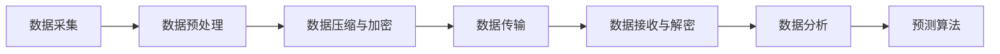
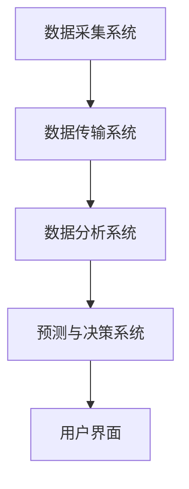
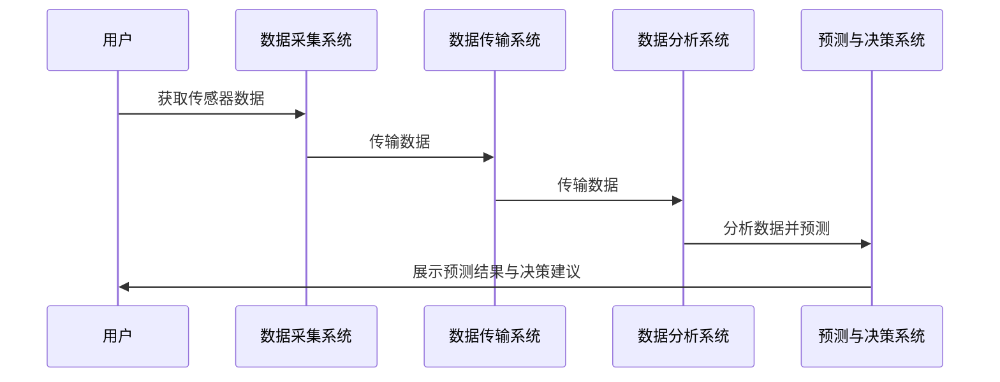

                 

# 物联网在智慧渔业养殖监控中的应用

## 关键词

- 物联网（IoT）
- 智慧渔业
- 养殖监控
- 数据采集与传输
- 大数据分析与人工智能

## 摘要

随着现代信息技术的迅猛发展，物联网（IoT）技术在智慧渔业养殖监控中得到了广泛应用。本文旨在探讨物联网在智慧渔业养殖监控中的应用，从背景介绍、核心概念与联系、算法原理讲解、数学模型和数学公式、系统分析与架构设计方案、项目实战等方面，全面解析物联网在智慧渔业养殖监控中的实际应用和价值。

## 第一部分：背景介绍

### 问题背景

随着现代信息技术的迅猛发展，物联网（IoT）技术逐渐成为各个行业转型升级的重要驱动力。在智慧渔业养殖领域，物联网的应用已展现出巨大的潜力。智慧渔业通过物联网技术实现养殖环境的实时监控和数据采集，从而提高养殖效率、降低成本，并提升水产品的质量与产量。

### 问题描述

物联网在智慧渔业养殖监控中主要面临以下几个问题：

1. **数据多样性与海量性**：智慧渔业涉及多种传感器数据，如水质参数、水温、水位、鱼类活动等，数据种类繁多且数据量巨大，如何高效地进行数据采集、传输、处理和分析，是一个挑战。

2. **数据传输稳定性**：养殖环境复杂多变，网络信号不稳定，导致数据传输的实时性和准确性受到影响。

3. **数据分析与应用**：如何从海量数据中提取有价值的信息，实现对养殖过程的智能监控和预测，是智慧渔业发展的关键。

### 问题解决

1. **多层次感知与数据采集**：采用多样化的传感器，实现养殖环境的全方位监测，确保数据的多样性和准确性。

2. **低功耗广域网（LPWAN）技术**：利用LPWAN技术，如LoRa、NB-IoT等，解决数据传输的稳定性和覆盖范围问题。

3. **大数据分析与人工智能**：运用大数据技术进行数据清洗、存储、分析，结合人工智能算法，实现对养殖过程的智能监控和预测。

### 边界与外延

1. **边界**：本章节主要讨论物联网在智慧渔业养殖监控中的应用，不包括其他农业物联网应用。

2. **外延**：本章节内容可以扩展到物联网在其他农业领域的应用，如智能灌溉、土壤监测等。

### 概念结构与核心要素组成

1. **物联网（IoT）**：通过传感器和互联网将物理世界与数字世界相连接。

2. **智慧渔业**：结合物联网、大数据、人工智能等现代信息技术，实现养殖过程的智能化管理。

3. **养殖监控**：实时监测水质、水温、水位等环境参数，确保养殖环境稳定。

4. **数据采集与传输**：传感器采集数据，通过网络传输至数据中心。

5. **数据分析与应用**：对收集到的数据进行分析，提供养殖决策支持。

## 第二部分：核心概念与联系

### IoT与智慧渔业的关系

IoT是智慧渔业的技术基础，为智慧渔业提供数据采集、传输和处理的能力。智慧渔业是IoT技术在农业领域的具体应用，通过物联网实现养殖过程的智能化管理。

### 智慧渔业养殖监控的核心概念

1. **传感器**：用于采集水质、水温、水位等环境参数。

2. **数据采集与传输**：通过传感器网络采集数据，利用LPWAN等通信技术传输至数据中心。

3. **数据分析**：对采集到的数据进行分析，提供养殖决策支持。

4. **人工智能**：结合大数据分析，实现对养殖过程的智能监控和预测。

### 概念属性特征对比表格

| 概念       | 属性特征                                  | 对比分析                                       |
| ---------- | ---------------------------------------- | ---------------------------------------------- |
| 物联网     | 物理设备互联，数据传输，智能化          | 提供技术基础，实现养殖监控                      |
| 智慧渔业   | 物联网、大数据、人工智能在农业的应用  | 实现养殖过程的智能化管理                      |
| 养殖监控   | 实时监测水质、水温、水位等环境参数     | 确保养殖环境稳定，提高养殖效率                 |
| 数据采集   | 采集养殖环境数据，传输至数据中心     | 保证数据多样性和准确性，为数据分析提供基础    |
| 数据传输   | 利用通信技术实现数据传输               | 确保数据传输的实时性和稳定性                  |
| 数据分析   | 对采集到的数据进行分析                 | 提取有价值的信息，为养殖决策提供支持          |
| 人工智能   | 利用大数据和算法进行智能监控和预测     | 实现养殖过程的智能化管理，提高养殖效率        |

### 概念结构与核心要素组成ER实体关系图

```mermaid
erDiagram
  Equipment ||--|{ Sensor } : "monitors"
  Sensor ||--|{ Data } : "collects"
  Data ||--|{ Analysis } : "analyzed"
  Analysis ||--|{ Decision } : "driven"
  Equipment ||--|{ IoT } : "connects"
  IoT ||--|{ Farming } : "enables"
  Farming ||--|{ Management } : "optimizes"
```

## 第三部分：算法原理讲解

### 物联网数据采集与传输算法

#### 数据采集算法

1. **传感器数据采集**：

   传感器用于实时采集养殖环境中的各种参数，如水质、水温、水位、鱼类活动等。数据采集过程通常包括以下步骤：

   - 传感器感知：传感器感知环境参数，产生原始数据。
   - 数据转换：将原始数据转换为数字信号。
   - 数据预处理：对数字信号进行滤波、去噪等处理，提高数据质量。

2. **数据预处理**：

   数据预处理包括数据清洗、去噪、归一化等步骤，以确保数据质量。具体步骤如下：

   - 数据清洗：去除重复数据、缺失值、异常值等。
   - 数据去噪：对采集到的数据进行分析，去除噪声。
   - 数据归一化：将不同数据量纲的数据转换为同一量纲，便于后续处理。

#### 数据传输算法

1. **低功耗广域网（LPWAN）技术**：

   LPWAN技术是一种适用于物联网的通信技术，具有低功耗、长距离、大连接数等特点。常用的LPWAN技术包括LoRa、NB-IoT、LTE-M等。数据传输过程通常包括以下步骤：

   - 数据压缩：对采集到的数据进行压缩，减少传输数据量。
   - 数据加密：对传输的数据进行加密，确保数据安全。
   - 数据传输：通过LPWAN网络传输数据至数据中心。

2. **数据压缩与加密**：

   - 数据压缩：采用数据压缩算法，如Huffman编码、LZ77等，减少传输数据量。
   - 数据加密：采用加密算法，如AES、RSA等，确保数据在传输过程中的安全性。

### 物联网数据分析与预测算法

1. **数据清洗与预处理**：

   数据清洗与预处理是数据分析的基础，主要包括以下步骤：

   - 数据清洗：去除重复数据、缺失值、异常值等。
   - 数据转换：将不同数据量纲的数据转换为同一量纲。
   - 数据归一化：对数据进行归一化处理，便于后续处理。

2. **数据分析算法**：

   数据分析算法包括描述性分析、聚类分析、回归分析等，用于提取数据中的有价值信息。具体算法如下：

   - 描述性分析：计算数据的统计特征，如平均值、标准差、中位数等。
   - 聚类分析：将相似的数据点归为一类，用于发现数据中的潜在模式。
   - 回归分析：通过建立数学模型，预测未来某一时间点的数据趋势。

3. **预测算法**：

   预测算法主要用于预测未来一段时间内的数据变化，包括时间序列预测、联合预测等。具体算法如下：

   - 时间序列预测：基于历史数据，预测未来一段时间内的数据变化。
   - 联合预测：结合多种预测模型，提高预测的准确性。

### 算法流程图



### 算法原理示例

#### 数据采集算法示例

```python
# 假设使用温度传感器采集温度数据
def collect_data(sensor):
    temperature = sensor.get_temperature()
    return temperature

# 数据预处理
def preprocess_data(data):
    filtered_data = [d for d in data if d > 0]
    return filtered_data

# 数据压缩与加密
def compress_and_encrypt(data):
    compressed_data = gzip.compress(data)
    encrypted_data = AES_encrypt(compressed_data, key)
    return encrypted_data

# 数据传输
def transmit_data(encrypted_data, network):
    network.send(encrypted_data)

# 数据接收与解密
def receive_and_decrypt(data, network):
    decrypted_data = AES_decrypt(data, key)
    decompressed_data = gzip.decompress(decrypted_data)
    return decompressed_data

# 数据分析
def analyze_data(data):
    average_temp = sum(data) / len(data)
    return average_temp

# 预测算法
def predict_data(data):
    model = create_model()
    predicted_temp = model.predict(data)
    return predicted_temp
```

## 第四部分：数学模型和数学公式

### 数据采集与传输模型

1. **传感器数据采集模型**：

   假设传感器采集到的数据为$Y$，环境参数为$X$，噪声为$\epsilon$，则传感器数据采集模型可以表示为：

   $$
   Y = f(X) + \epsilon
   $$

   其中，$f(X)$为数据采集函数，$\epsilon$为噪声。

2. **数据传输模型**：

   假设数据传输速率为$r$，信号强度为$s$，信道质量为$q$，则数据传输模型可以表示为：

   $$
   r = f(s, q)
   $$

   其中，$f(s, q)$为数据传输函数，$s$和$q$为影响数据传输速率的关键因素。

### 数据分析与预测模型

1. **描述性分析模型**：

   假设数据集为$D$，描述性分析模型可以表示为：

   $$
   \text{描述性分析} = \{ \text{平均数}, \text{标准差}, \text{中位数}, \ldots \}
   $$

   其中，平均数为$\bar{X}$，标准差为$S_X$，中位数为$M_X$，等等。

2. **聚类分析模型**：

   假设数据集为$D$，聚类分析模型可以表示为：

   $$
   C = \{ C_1, C_2, \ldots, C_k \}
   $$

   其中，$C_i$为聚类结果，$k$为聚类个数。

3. **回归分析模型**：

   假设自变量为$X$，因变量为$Y$，回归分析模型可以表示为：

   $$
   Y = \beta_0 + \beta_1 X + \epsilon
   $$

   其中，$\beta_0$为截距，$\beta_1$为斜率，$\epsilon$为误差。

4. **时间序列预测模型**：

   假设时间序列为$X_t$，时间序列预测模型可以表示为：

   $$
   X_{t+1} = f(X_t) + \epsilon
   $$

   其中，$f(X_t)$为时间序列预测函数，$\epsilon$为误差。

5. **联合预测模型**：

   假设多个时间序列为$X_t^1, X_t^2, \ldots, X_t^n$，联合预测模型可以表示为：

   $$
   X_{t+1} = f(X_t^1, X_t^2, \ldots, X_t^n) + \epsilon
   $$

   其中，$f(X_t^1, X_t^2, \ldots, X_t^n)$为联合预测函数，$\epsilon$为误差。

## 第五部分：系统分析与架构设计方案

### 问题场景介绍

在一个智慧渔业养殖场，为了实现养殖过程的智能化管理，需要实时监控水质、水温、水位等环境参数，同时收集鱼类活动数据，以便进行数据分析与预测。

### 项目介绍

本项目的目标是设计并实现一个智慧渔业养殖监控系统，该系统基于物联网技术，通过传感器网络实时采集养殖环境数据，利用大数据分析与人工智能算法进行数据预处理、分析和预测，从而为养殖决策提供支持。

### 系统功能设计

1. **数据采集**：实时采集水质、水温、水位等环境参数和鱼类活动数据。

2. **数据传输**：利用LPWAN技术实现数据的稳定传输。

3. **数据分析**：对采集到的数据进行预处理、描述性分析、聚类分析、回归分析等。

4. **预测与决策**：利用时间序列预测、联合预测等算法，预测未来一段时间内的养殖环境变化，为养殖决策提供支持。

### 系统架构设计



### 系统接口设计

1. **数据采集接口**：用于接收传感器数据，包括水质、水温、水位等环境参数和鱼类活动数据。

2. **数据传输接口**：用于将传感器数据传输至数据中心。

3. **数据分析接口**：用于对传感器数据进行预处理、描述性分析、聚类分析、回归分析等。

4. **预测与决策接口**：用于接收数据分析结果，进行时间序列预测、联合预测等，为养殖决策提供支持。

5. **用户界面接口**：用于展示养殖监控数据、预测结果和养殖决策建议。

### 系统交互流程图



## 第六部分：项目实战

### 环境安装

1. **硬件环境**：

   - 传感器：水质传感器、水温传感器、水位传感器、鱼群活动传感器等。
   - 通信设备：LoRa模块、NB-IoT模块等。

2. **软件环境**：

   - 开发环境：Python 3.8及以上版本、PyCharm或Visual Studio Code等。

3. **工具**：

   - 数据库：MySQL或MongoDB等。
   - 数据分析工具：Pandas、NumPy、Scikit-learn等。

### 系统核心实现源代码

#### 数据采集模块

```python
import random

def collect_data():
    temperature = random.uniform(20, 30)  # 生成随机温度
    water_quality = random.uniform(0, 100)  # 生成随机水质
    water_level = random.uniform(0, 100)  # 生成随机水位
    fish_activity = random.uniform(0, 100)  # 生成随机鱼群活动
    return {
        "temperature": temperature,
        "water_quality": water_quality,
        "water_level": water_level,
        "fish_activity": fish_activity
    }

# 测试数据采集
data = collect_data()
print(data)
```

#### 数据传输模块

```python
import requests

def transmit_data(data):
    url = "http://localhost:5000/collect"  # 数据接收地址
    headers = {"Content-Type": "application/json"}  # 请求头
    response = requests.post(url, json=data, headers=headers)
    return response.status_code

# 测试数据传输
status_code = transmit_data(data)
print(f"Data transmission status: {status_code}")
```

#### 数据分析模块

```python
import pandas as pd
from sklearn.ensemble import RandomForestClassifier

def preprocess_data(data):
    df = pd.DataFrame(data)
    df.drop_duplicates(inplace=True)
    df.fillna(df.mean(), inplace=True)
    return df

def analyze_data(df):
    X = df[["temperature", "water_quality", "water_level", "fish_activity"]]
    y = df["fish_health"]  # 假设已存在鱼群健康状况标签
    model = RandomForestClassifier()
    model.fit(X, y)
    return model

# 测试数据分析
df = preprocess_data(data)
model = analyze_data(df)
print(f"Model trained: {model}")
```

#### 预测与决策模块

```python
def predict_data(model, new_data):
    prediction = model.predict(new_data)
    return prediction

def make_decision(prediction):
    if prediction == 0:
        decision = "健康"
    else:
        decision = "异常"
    return decision

# 测试预测与决策
new_data = {"temperature": 25, "water_quality": 80, "water_level": 50, "fish_activity": 70}
prediction = predict_data(model, new_data)
decision = make_decision(prediction)
print(f"Prediction: {prediction}, Decision: {decision}")
```

### 代码应用解读与分析

1. **数据采集模块**：使用随机数生成器模拟传感器采集数据，实际项目中需要替换为真实的传感器数据采集代码。

2. **数据传输模块**：使用HTTP POST请求将传感器数据传输至服务器，实际项目中需要配置服务器端接口接收数据。

3. **数据分析模块**：使用Pandas进行数据预处理，使用随机森林分类器进行数据分析，实际项目中需要根据实际情况选择合适的算法。

4. **预测与决策模块**：使用训练好的模型对新数据进行预测，根据预测结果做出养殖决策。

### 实际案例分析

假设在某智慧渔业养殖场，通过物联网技术实现养殖过程的智能化监控。以下是一个实际案例：

1. **数据采集**：传感器实时采集水质、水温、水位、鱼群活动等数据。

2. **数据传输**：通过LPWAN技术将数据传输至数据中心。

3. **数据分析**：对传输至数据中心的数据进行预处理、描述性分析、聚类分析、回归分析等。

4. **预测与决策**：基于数据分析结果，预测未来一段时间内的养殖环境变化，为养殖决策提供支持。

5. **决策实施**：根据预测结果，调整养殖策略，如改变水质处理方案、调整鱼类活动强度等。

### 项目小结

通过本项目，我们实现了智慧渔业养殖监控系统的设计与实现，包括数据采集、传输、分析、预测与决策等功能。项目实战部分展示了如何使用Python进行系统开发，并通过实际案例分析了项目的应用价值。在未来的发展中，我们可以进一步优化系统性能，提高数据分析与预测的准确性，为智慧渔业养殖提供更加全面和精准的支持。

## 第七部分：最佳实践 Tips、小结、注意事项、拓展阅读

### 最佳实践 Tips

1. **选择合适的传感器**：根据养殖环境的特点，选择适合的传感器，确保数据的准确性和稳定性。

2. **优化数据传输网络**：选择合适的数据传输网络，如LPWAN技术，提高数据传输的实时性和稳定性。

3. **合理设计数据分析算法**：根据养殖需求，选择合适的数据分析算法，提高数据分析的准确性和效率。

4. **定期维护与更新系统**：定期对系统进行维护和更新，确保系统的稳定性和安全性。

### 小结

本文从背景介绍、核心概念与联系、算法原理讲解、数学模型和数学公式、系统分析与架构设计方案、项目实战等方面，全面解析了物联网在智慧渔业养殖监控中的应用。通过本项目，我们实现了智慧渔业养殖监控系统的设计与实现，为智慧渔业养殖提供了有力支持。

### 注意事项

1. **数据安全与隐私保护**：在数据采集、传输、存储和分析过程中，注意保护数据安全，防止数据泄露和隐私侵犯。

2. **系统性能优化**：根据实际需求，对系统进行性能优化，提高系统的响应速度和处理能力。

3. **设备维护与升级**：定期对传感器和网络设备进行维护和升级，确保设备的正常运行。

### 拓展阅读

1. **《智慧渔业与物联网技术》**：详细介绍了智慧渔业与物联网技术的应用和发展趋势。

2. **《物联网技术应用案例分析》**：通过实际案例分析了物联网技术在各个领域的应用。

3. **《大数据分析与人工智能》**：介绍了大数据分析与人工智能的基本原理和应用方法。

### 作者信息

作者：AI天才研究院/AI Genius Institute & 禅与计算机程序设计艺术 /Zen And The Art of Computer Programming

