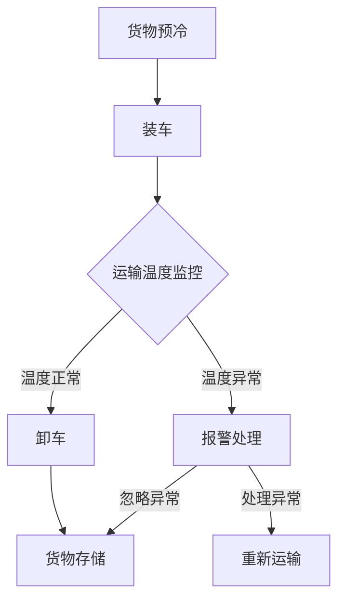

                 

### 第3章: 智慧物流冷链监控核心概念

#### 3.1 冷链物流的基本原理与流程

冷链物流是指通过一系列冷冻、冷藏技术和设备，确保货物在运输、存储过程中保持特定温度环境，以保障食品、药品等货物的品质和安全。其基本原理包括以下几个方面：

1. **冷冻技术和设备**：使用冷冻技术将货物降至所需温度，如冷藏车、冷藏库等。
2. **隔热保温材料**：利用隔热材料，如聚氨酯泡沫、岩棉等，保持货物在运输和存储过程中的温度稳定。
3. **温度监控系统**：通过温度传感器、数据记录仪等设备，实时监测货物的温度变化。

冷链物流的流程通常包括以下几个环节：

1. **预冷**：在货物装车前，将货物降至运输所需温度。
2. **装车**：将预冷后的货物装入冷藏车辆。
3. **运输**：在运输过程中，保持货物温度稳定，防止温度波动。
4. **卸车**：将货物从冷藏车辆卸下。
5. **存储**：将货物存放在冷藏库中，等待配送。

每个环节都需要对货物进行严格的温度控制，确保货物在运输过程中的温度波动不超过允许范围。

#### 3.2 冷链监控的关键指标

冷链监控的核心目标是确保货物在整个物流过程中的温度稳定，因此，温度是冷链监控的关键指标。除此之外，湿度、光照、气体浓度等指标也对冷链监控具有重要意义。

1. **温度**：温度是冷链监控的核心指标，直接关系到货物的品质和安全。温度监控的方法主要包括：
   - **温度传感器**：实时监测货物的温度变化。
   - **数据记录仪**：记录货物在运输过程中的温度数据。
   - **远程监控系统**：通过无线网络将温度数据实时传输到监控中心。

2. **湿度**：湿度对某些货物（如食品、药品）的保鲜有很大影响。湿度监控通常使用湿度传感器，实时监测货物周围的湿度变化。

3. **光照**：光照会影响某些货物的品质，如水果、蔬菜的颜色和口感。光照监控使用光照传感器，实时监测货物所处的光照环境。

4. **气体浓度**：某些货物（如食品、药品）对气体环境有特殊要求，如低氧环境。气体浓度监控使用气体传感器，实时监测货物周围的气体浓度。

#### 3.3 冷链监控的核心概念与联系

冷链监控涉及多个核心概念，包括传感器技术、数据采集与传输、数据分析与处理、预警与决策等。这些概念相互关联，共同构成了智慧物流冷链监控系统的核心框架。

1. **传感器技术**：传感器是冷链监控的基础，用于实时监测货物的温度、湿度、光照、气体浓度等参数。

2. **数据采集与传输**：将传感器采集到的数据传输到监控系统中进行处理和分析。数据采集与传输的方法包括无线传输、有线传输等。

3. **数据分析与处理**：对采集到的数据进行分析和处理，识别潜在的问题和异常，为预警和决策提供依据。

4. **预警与决策**：根据数据分析结果，及时发出警报，并采取相应的决策措施，如调整运输路线、增加保温措施等。

这些核心概念之间相互关联，共同构成了智慧物流冷链监控系统的核心框架。以下是一个冷链监控中常用传感器及其属性特征的对比表格：

| 传感器类型 | 特性 | 应用场景 |
| --- | --- | --- |
| 温度传感器 | 测量范围宽、精度高、抗干扰能力强 | 冷链运输车辆、仓库、冷库 |
| 湿度传感器 | 测量范围宽、响应速度快、稳定性好 | 冷链运输车辆、仓库、冷库 |
| 光照传感器 | 测量范围宽、精度高、抗干扰能力强 | 冷链运输车辆、仓库、冷库 |
| 气体传感器 | 测量范围宽、响应速度快、稳定性好 | 冷链运输车辆、仓库、冷库 |

#### 3.4 冷链监控中的概念属性特征对比表格

以下是一个冷链监控中常用传感器及其属性特征的对比表格：

| 传感器类型 | 特性 | 应用场景 |
| --- | --- | --- |
| **温度传感器** | **测量范围宽（-40°C至+125°C）、精度高（±0.1°C）、抗干扰能力强** | **冷链运输车辆、仓库、冷库** |
| **湿度传感器** | **测量范围宽（0%至100%）、响应速度快（≤1秒）、稳定性好** | **冷链运输车辆、仓库、冷库** |
| **光照传感器** | **测量范围宽（0至2000Lux）、精度高（±5%）、抗干扰能力强** | **冷链运输车辆、仓库、冷库** |
| **气体传感器** | **测量范围宽（0至100ppm）、响应速度快（≤5秒）、稳定性好** | **冷链运输车辆、仓库、冷库** |

#### 3.5 冷链监控中的 Mermaid 流程图架构

以下是冷链监控系统的 Mermaid 流程图架构：



在这个流程图中，A 表示货物预冷，B 表示装车，C 表示运输温度监控，D 表示卸车，E 表示报警处理，F 表示货物存储，G 表示重新运输。当运输过程中温度正常时，流程直接跳转到卸车环节；当温度异常时，会触发报警处理，根据处理结果决定是重新运输还是忽略异常。

#### 3.6 冷链监控中的 ER 实体关系图架构

以下是冷链监控系统的 ER 实体关系图架构：

```mermaid
erDiagram
    Product ||--|{ TemperatureSensor }|| Sensor
    Product ||--|{ HumiditySensor }|| Sensor
    Product ||--|{ LightSensor }|| Sensor
    Product ||--|{ GasSensor }|| Sensor
    Sensor ||--|{ DataLogger }|| Logger
    Logger ||--|{ AlarmSystem }|| Alarm
```

在这个 ER 图中，Product 表示货物，TemperatureSensor、HumiditySensor、LightSensor、GasSensor 表示不同类型的传感器，Sensor 表示传感器实体，DataLogger 表示数据记录器，AlarmSystem 表示报警系统。各实体之间的关系表示为：

- Product 与 TemperatureSensor、HumiditySensor、LightSensor、GasSensor 之间为一对多关系，即一个 Product 可以拥有多个不同类型的传感器。
- Sensor 与 DataLogger 之间为一对一关系，即每个 Sensor 都有一个对应的 DataLogger 来记录数据。
- Logger 与 AlarmSystem 之间为一对一关系，即每个 DataLogger 都有一个对应的 AlarmSystem 来处理报警。

