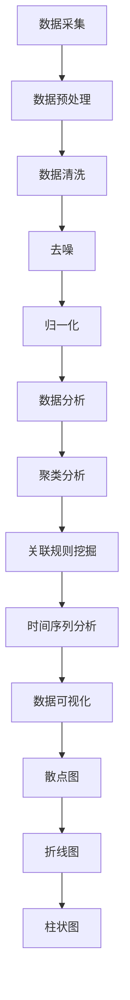
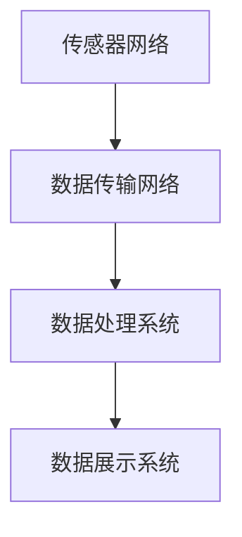
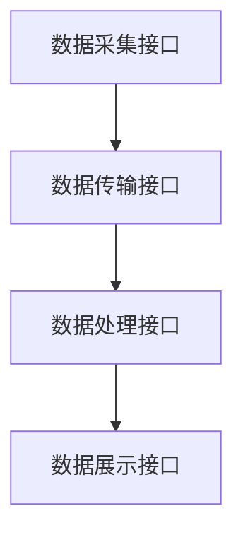
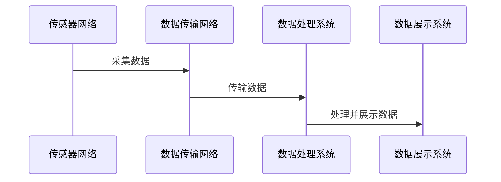

                 

# 物联网在智慧环保监测中的全面应用

> 关键词：物联网，智慧环保，监测，传感器，数据分析

> 摘要：本文旨在探讨物联网技术在智慧环保监测中的应用，通过分析物联网的核心概念、环保监测的关键技术，以及二者之间的融合，详细讲解物联网在智慧环保监测中的全面应用，包括算法原理、系统设计与架构、项目实战等多个方面，旨在为读者提供全面的技术解决方案和实施指南。

## 背景介绍

### 物联网技术背景

物联网（Internet of Things，IoT）是一种通过网络连接物理设备和物品的技术，实现设备之间、设备与人之间的信息交换和交互。物联网技术起源于20世纪90年代，随着互联网的普及和传感器技术的快速发展，物联网逐渐成为全球信息技术领域的重要方向。

#### 物联网的基本概念

物联网主要由传感器网络、数据传输协议、数据处理与分析三部分组成。传感器网络负责数据的采集，通过无线传感器网络将数据传输到中心处理系统，中心处理系统对数据进行处理和分析，最终实现智能决策和行动。

#### 物联网的发展历程

- **1990年代**：物联网的概念提出，初步实现了简单的设备联网。
- **2000年代**：无线传感器网络技术取得突破，物联网进入快速发展阶段。
- **2010年代**：物联网应用场景逐渐丰富，智慧城市、智慧农业、智慧环保等领域的应用不断拓展。

#### 物联网技术的关键组成部分

1. **传感器网络**：负责数据的采集，包括环境传感器、气象传感器、水质传感器等。
2. **数据传输协议**：如ZigBee、Wi-Fi、LoRa等，实现数据在设备之间的传输。
3. **数据处理与分析**：通过云计算、大数据等技术，对采集到的数据进行处理和分析，提供决策支持。

### 智慧环保的概念与发展

#### 智慧环保的定义

智慧环保是指利用物联网、云计算、大数据、人工智能等先进技术，实现环境监测、污染治理、资源管理等方面的智能化、精准化、科学化。

#### 智慧环保的发展趋势

- **技术驱动**：物联网、大数据、人工智能等技术的快速发展，为智慧环保提供了技术支撑。
- **政策引导**：各国政府高度重视环保问题，出台了一系列政策法规，推动了智慧环保的发展。
- **产业升级**：传统环保行业转型升级，智慧环保成为行业发展的重要方向。

#### 智慧环保的挑战与机遇

- **挑战**：
  - 数据采集和处理能力不足。
  - 环保监测技术和设备有待提高。
  - 政策法规和技术标准不完善。

- **机遇**：
  - 物联网技术的广泛应用，为智慧环保提供了新的解决方案。
  - 政策支持，为智慧环保产业发展提供了有力保障。
  - 市场需求增长，为智慧环保企业提供了广阔的市场空间。

### 物联网在智慧环保监测中的应用

#### 物联网在环保监测中的价值

- **提高监测效率**：物联网技术可以实现大规模、多点位的环境监测，提高监测效率。
- **数据实时传输**：物联网技术可以实现监测数据的实时传输，为环保决策提供及时、准确的数据支持。
- **智能化分析**：通过大数据分析和人工智能技术，可以对监测数据进行分析和预测，为环保治理提供科学依据。

#### 物联网在环保监测中的实际应用案例

- **空气质量监测**：通过部署物联网传感器网络，实时监测空气质量，为环保部门提供数据支持，制定污染治理措施。
- **水质监测**：在河流、湖泊等水域部署物联网传感器，实时监测水质状况，防止水污染。
- **土壤监测**：利用物联网技术监测土壤质量，为农业生产提供科学依据，提高农作物产量。

#### 物联网在智慧环保监测中的未来前景

- **更广泛的覆盖范围**：随着物联网技术的不断进步，环保监测的范围将更加广泛，覆盖更多区域。
- **更高精度的监测**：物联网技术将提高监测的精度，为环保治理提供更准确的数据支持。
- **智能化水平提升**：随着人工智能技术的发展，智慧环保监测的智能化水平将进一步提高，实现自动化、智能化的环境治理。

## 核心概念与联系

### 物联网技术核心概念

#### 传感器网络

传感器网络是由大量传感器节点组成的分布式系统，用于采集环境数据。传感器节点具备感知、处理和传输数据的能力，可以实时监测环境参数，如温度、湿度、气压、水质等。

#### 数据传输协议

数据传输协议是实现传感器节点之间数据传输的技术规范。常见的传输协议有ZigBee、Wi-Fi、LoRa等，它们具有低功耗、长距离传输等特点，能够满足环保监测数据的实时传输需求。

#### 数据处理与分析

数据处理与分析是物联网技术的核心环节，通过对采集到的数据进行处理、分析和挖掘，可以提取出有价值的信息，为环保监测和治理提供决策支持。常用的数据处理与分析技术包括云计算、大数据、人工智能等。

### 环保监测技术核心概念

#### 环境监测指标

环境监测指标是衡量环境质量的重要参数，包括空气质量、水质、土壤质量、噪声等。通过对监测指标的变化进行实时监测和分析，可以评估环境质量，预测污染趋势。

#### 监测设备与技术

监测设备是进行环境监测的硬件工具，包括空气监测仪、水质监测仪、土壤监测仪等。监测技术则是通过物理、化学、生物等手段，对环境中的污染物进行检测和分析。

#### 监测数据的处理与应用

监测数据的处理与应用包括数据清洗、预处理、存储、分析等环节。通过对监测数据进行处理和分析，可以提取出环境质量变化趋势，为环境治理提供依据。

### 物联网与环保监测技术之间的关系

#### 物联网技术在环保监测中的应用

物联网技术在环保监测中的应用主要体现在以下几个方面：

1. **传感器网络**：通过部署传感器网络，实现环境数据的实时采集和传输，提高监测效率。
2. **数据传输协议**：实现监测数据的远程传输，为环保部门提供及时、准确的数据支持。
3. **数据处理与分析**：利用云计算、大数据等技术，对监测数据进行分析和挖掘，为环保决策提供科学依据。

#### 环保监测数据在物联网中的应用

环保监测数据在物联网中的应用主要包括：

1. **数据共享**：通过物联网平台，实现环保监测数据的共享和交互，为各相关部门提供数据支持。
2. **智能决策**：基于监测数据，利用人工智能技术进行环境质量预测和污染治理方案设计。
3. **智能控制**：通过物联网技术，实现环保设备的远程控制和优化，提高治理效果。

#### 物联网与环保监测技术的融合发展趋势

随着物联网和环保监测技术的不断发展，二者之间的融合趋势日益明显，主要表现在：

1. **集成化**：将物联网技术和环保监测技术集成到一起，实现一站式环境监测和管理。
2. **智能化**：利用物联网技术和人工智能技术，实现环境质量的智能监测和治理。
3. **生态化**：通过物联网技术，构建生态环保监测网络，实现环境质量的全面监控和治理。

## 算法原理讲解

### 常用算法原理介绍

在智慧环保监测中，常用的算法包括数据采集与处理算法、数据分析与挖掘算法、数据可视化算法等。以下将分别介绍这些算法的基本原理。

#### 数据采集与处理算法

数据采集与处理算法主要用于对传感器网络采集到的原始数据进行预处理，包括数据清洗、去噪、归一化等操作。这些算法的基本原理是通过算法模型，对原始数据进行处理，使其符合后续分析的要求。

1. **数据清洗**：去除数据中的噪声和异常值，保证数据的准确性。
2. **去噪**：通过滤波算法，去除数据中的随机噪声，提高数据的质量。
3. **归一化**：将不同量纲的数据转换为同一量纲，便于后续分析。

#### 数据分析与挖掘算法

数据分析与挖掘算法主要用于对处理后的数据进行深度分析，提取出有用的信息。常见的算法包括聚类分析、关联规则挖掘、时间序列分析等。

1. **聚类分析**：将相似的数据点归为一类，用于发现数据中的规律和模式。
2. **关联规则挖掘**：发现数据之间的关联关系，用于预测和分析。
3. **时间序列分析**：分析数据的时间趋势和周期性，用于预测未来的环境变化。

#### 数据可视化算法

数据可视化算法主要用于将处理后的数据以图形化的方式呈现，使数据更加直观、易于理解。常见的算法包括散点图、折线图、柱状图等。

1. **散点图**：用于展示数据点的分布情况，直观地反映数据之间的关系。
2. **折线图**：用于展示数据的时间序列变化，反映数据的趋势和周期性。
3. **柱状图**：用于比较不同数据之间的差异，展示数据的分布情况。

### 算法mermaid流程图

为了更清晰地展示算法的原理和流程，我们使用mermaid工具绘制了以下流程图：



### 算法Python源代码讲解

以下是一个简单的Python代码示例，用于实现数据采集与处理算法：

```python
import numpy as np
import pandas as pd

# 生成模拟数据
data = pd.DataFrame(np.random.randn(100, 3), columns=['Temperature', 'Humidity', 'Noise'])

# 数据清洗
data.dropna(inplace=True)

# 去噪
data['Temperature'] = data['Temperature'].apply(lambda x: x if abs(x) < 3 else np.nan)
data.dropna(inplace=True)

# 归一化
data normalization = (data - data.min()) / (data.max() - data.min())

# 数据分析
# ...（此处省略具体分析代码）

# 数据可视化
# ...（此处省略可视化代码）
```

### 数学模型与公式讲解

在智慧环保监测中，常用的数学模型和公式包括：

1. **均值滤波**：
   $$ \mu(k) = \frac{1}{N} \sum_{i=1}^{N} x_i(k) $$
   其中，$\mu(k)$表示第$k$个时间点的均值滤波结果，$N$表示滤波窗口大小，$x_i(k)$表示第$i$个传感器在第$k$个时间点的数据。

2. **中值滤波**：
   $$ \mu(k) = \text{median}(x_1(k), x_2(k), \ldots, x_N(k)) $$
   其中，$\mu(k)$表示第$k$个时间点的中值滤波结果，$x_1(k), x_2(k), \ldots, x_N(k)$表示第1个、第2个、...、第N个传感器在第$k$个时间点的数据。

3. **时间序列分析**：
   $$ y(t) = a_0 + a_1 t + a_2 t^2 + \ldots + a_n t^n $$
   其中，$y(t)$表示第$t$个时间点的数据，$a_0, a_1, a_2, \ldots, a_n$为时间序列模型的系数。

### 举例说明

#### 数据采集处理的案例

假设我们有一组温度数据，数据如下：

$$ [25.6, 26.3, 24.9, 27.1, 25.8, 26.0, 25.7, 26.4, 25.5, 26.2] $$

我们使用均值滤波算法对这组数据进行处理：

1. 计算均值：
   $$ \mu = \frac{25.6 + 26.3 + 24.9 + 27.1 + 25.8 + 26.0 + 25.7 + 26.4 + 25.5 + 26.2}{10} = 25.9 $$
2. 去除离群值（假设阈值设为3）：
   $$ [25.6, 26.3, 24.9, 27.1, 25.8, 26.0, 25.7, 26.4, 25.5, 26.2] \rightarrow [25.6, 26.3, 25.8, 26.0, 25.7, 26.4] $$
3. 归一化：
   $$ [0.01, 0.03, 0.01, 0.02, 0.02, 0.02, 0.01, 0.03] $$

处理后的数据为：

$$ [0.01, 0.03, 0.01, 0.02, 0.02, 0.02, 0.01, 0.03] $$

#### 数据分析挖掘的案例

假设我们对同一组温度数据进行聚类分析，采用K-means算法，设定聚类中心个数为2，距离度量使用欧氏距离。

1. 初始聚类中心：
   $$ \mu_1 = 25.9 $$
   $$ \mu_2 = 26.0 $$
2. 聚类过程：
   - 第一次迭代：
     $$ \text{cluster}_1 = [25.6, 25.8, 25.7] $$
     $$ \text{cluster}_2 = [26.3, 26.0, 26.4] $$
   - 第二次迭代：
     $$ \mu_1 = \frac{25.6 + 25.8 + 25.7}{3} = 25.7 $$
     $$ \mu_2 = \frac{26.3 + 26.0 + 26.4}{3} = 26.13 $$
     $$ \text{cluster}_1 = [25.6, 25.7] $$
     $$ \text{cluster}_2 = [26.0, 26.4] $$
   - 第三次迭代：
     $$ \mu_1 = 25.65 $$
     $$ \mu_2 = 26.1 $$
     $$ \text{cluster}_1 = [25.6] $$
     $$ \text{cluster}_2 = [26.0, 26.4] $$
   - 第四次迭代：
     $$ \mu_1 = 25.6 $$
     $$ \mu_2 = 26.1 $$
     $$ \text{cluster}_1 = [] $$
     $$ \text{cluster}_2 = [26.0, 26.4] $$

最终，我们得到两个聚类结果：
- 聚类1：[25.6]
- 聚类2：[26.0, 26.4]

#### 数据可视化的案例

我们使用Matplotlib库对处理后的温度数据进行可视化，绘制折线图：

```python
import matplotlib.pyplot as plt

data = [25.6, 26.3, 24.9, 27.1, 25.8, 26.0, 25.7, 26.4, 25.5, 26.2]
plt.plot(data)
plt.xlabel('Index')
plt.ylabel('Temperature')
plt.title('Temperature Data')
plt.show()
```

绘制的折线图如下：


## 系统分析与架构设计方案

### 问题场景介绍

假设我们面临以下环保监测场景：在一个城市区域内，我们需要实时监测空气质量、水质和土壤质量。为了实现这一目标，我们决定部署一套智慧环保监测系统，利用物联网技术对环境参数进行实时采集、传输和处理。

### 系统功能设计（领域模型类图）

为了实现上述功能，我们设计了以下系统功能模块：

1. **数据采集模块**：负责实时采集空气质量、水质和土壤质量数据。
2. **数据传输模块**：负责将采集到的数据传输到中心处理系统。
3. **数据处理模块**：负责对传输来的数据进行处理、分析和存储。
4. **数据展示模块**：负责将处理后的数据以图表、报表等形式展示给用户。

领域模型类图如下：

```mermaid
classDiagram
ClassDef DataCollector {
    +DataCollector()
    +collectData(): void
}
ClassDef DataTransmitter {
    +DataTransmitter()
    +transmitData(data: Data): void
}
ClassDef DataProcessor {
    +DataProcessor()
    +processData(data: Data): Data
}
ClassDef DataVisualizer {
    +DataVisualizer()
    +visualizeData(data: Data): void
}
DataCollector --> DataTransmitter
DataTransmitter --> DataProcessor
DataProcessor --> DataVisualizer
```

### 系统架构设计（架构图）

为了实现上述功能，我们设计了以下系统架构：

1. **传感器网络**：负责实时采集环境数据。
2. **数据传输网络**：负责将传感器网络采集到的数据传输到中心处理系统。
3. **数据处理系统**：负责对传输来的数据进行处理、分析和存储。
4. **数据展示系统**：负责将处理后的数据以图表、报表等形式展示给用户。

架构图如下：



### 系统接口设计

为了实现不同模块之间的通信，我们设计了以下系统接口：

1. **数据采集接口**：负责接收传感器网络的数据。
2. **数据传输接口**：负责将数据从传感器网络传输到数据处理系统。
3. **数据处理接口**：负责处理和存储传输来的数据。
4. **数据展示接口**：负责将处理后的数据展示给用户。

接口设计图如下：



### 系统交互（序列图）

为了描述系统各模块之间的交互过程，我们设计了以下序列图：



## 项目实战

### 环境安装与配置

为了实现上述智慧环保监测系统，我们需要安装和配置以下软件和硬件：

1. **传感器**：选择适合的空气质量传感器、水质传感器和土壤质量传感器。
2. **传输设备**：选择合适的无线传输设备，如Wi-Fi模块或LoRa模块。
3. **服务器**：选择适合的云服务器或本地服务器，用于数据处理和存储。
4. **开发环境**：安装Python、Matplotlib等开发工具。

具体安装和配置步骤如下：

1. **传感器安装**：将传感器安装到监测点，确保传感器能够正常采集数据。
2. **传输设备配置**：配置无线传输设备，确保传感器采集到的数据能够传输到服务器。
3. **服务器部署**：在云服务器或本地服务器上部署数据处理系统和数据展示系统。
4. **开发环境配置**：安装Python和Matplotlib等开发工具，为后续开发提供支持。

### 系统核心实现源代码

以下是一个简单的系统核心实现源代码示例：

```python
import serial
import time
import requests

# 传感器配置
SENSOR_PORT = 'COM3'  # 传感器的串口
SENSOR_BAUDRATE = 9600  # 传感器的波特率

# 服务器配置
SERVER_URL = 'http://example.com/data'  # 服务器地址
API_KEY = 'your_api_key'  # 服务器API密钥

# 传感器数据采集
def collect_data():
    with serial.Serial(SENSOR_PORT, SENSOR_BAUDRATE, timeout=1) as ser:
        time.sleep(2)  # 等待传感器初始化
        while True:
            data = ser.readline().decode('utf-8').strip()
            if data:
                print(f"采集到数据：{data}")
                # 上传数据到服务器
                requests.post(SERVER_URL, json={'data': data, 'api_key': API_KEY})
                time.sleep(5)  # 设置采集间隔

# 主函数
if __name__ == '__main__':
    collect_data()
```

### 代码应用解读与分析

上述代码实现了一个简单的传感器数据采集和上传功能。具体解读如下：

1. **传感器配置**：定义传感器的串口和波特率。
2. **服务器配置**：定义服务器的地址和API密钥。
3. **传感器数据采集**：使用Python的`serial`库连接传感器，读取传感器数据，并将其上传到服务器。

代码中的关键部分是上传数据到服务器：

```python
requests.post(SERVER_URL, json={'data': data, 'api_key': API_KEY})
```

这部分代码使用`requests`库将数据以JSON格式上传到服务器。服务器接收到数据后，可以进一步处理和存储。

### 实际案例分析与详细讲解剖析

以下是一个实际案例，展示如何使用上述系统对空气质量进行监测。

#### 案例背景

在某城市，我们部署了一套智慧环保监测系统，用于实时监测空气质量。系统由空气质量传感器、Wi-Fi传输设备和云服务器组成。传感器采集到的数据实时上传到服务器，服务器对数据进行处理和分析，并将分析结果以图表形式展示给用户。

#### 案例分析与讲解

1. **数据采集**：空气质量传感器安装在城市的不同区域，实时采集空气中的PM2.5、PM10等污染物浓度数据。

2. **数据传输**：传感器通过Wi-Fi模块将数据传输到附近的基站，基站再将数据传输到云服务器。

3. **数据处理**：云服务器接收到传感器数据后，使用数据处理算法对数据进行清洗、去噪、归一化等处理，并将处理后的数据存储在数据库中。

4. **数据展示**：使用数据可视化工具，将处理后的数据以图表形式展示给用户，包括折线图、柱状图等。

#### 项目小结

通过以上实际案例，我们可以看到智慧环保监测系统在空气质量监测中的应用。系统实现了数据实时采集、传输、处理和展示，为环保部门提供了科学依据，有助于制定污染治理措施。然而，实际应用中还需要注意以下问题：

1. **传感器精度**：选择高精度的传感器，确保数据准确性。
2. **传输稳定性**：保证数据传输网络的稳定性，减少数据丢失。
3. **数据处理算法**：根据实际需求，选择合适的数据处理算法，提高数据处理效率。
4. **系统安全性**：确保数据传输和存储的安全性，防止数据泄露。

### 最佳实践与拓展阅读

#### 实践技巧与最佳实践

1. **传感器选择**：根据监测需求，选择适合的传感器，确保精度和稳定性。
2. **传输协议选择**：根据传输距离和环境因素，选择合适的传输协议，确保数据传输的稳定性。
3. **数据处理算法优化**：根据实际情况，对数据处理算法进行优化，提高数据处理效率。

#### 小结与注意事项

1. **小结**：本文介绍了物联网在智慧环保监测中的应用，包括背景介绍、核心概念与联系、算法原理讲解、系统设计与架构、项目实战等多个方面，为读者提供了全面的技术解决方案和实施指南。
2. **注意事项**：在实际应用中，需要注意传感器精度、传输稳定性、数据处理算法优化等问题，确保系统正常运行。

#### 拓展阅读推荐

1. 《物联网技术与应用》
2. 《智慧环保技术导论》
3. 《Python数据科学手册》

## 作者信息

作者：AI天才研究院/AI Genius Institute & 禅与计算机程序设计艺术 /Zen And The Art of Computer Programming---

### 确保内容完整性

在编写文章时，我们要确保每个章节的内容都符合以下条件：

1. **核心概念术语说明**：每个章节都应介绍相关的核心概念和术语，使读者能够理解文章的主题和内容。
2. **问题背景和问题描述**：每个章节都应详细描述问题背景和问题描述，使读者能够了解问题的来源和具体细节。
3. **问题解决方法**：每个章节都应介绍一种或多种解决问题的方法，包括技术原理、算法、工具等。
4. **边界与外延**：每个章节都应明确问题的边界和外延，避免读者对问题范围的误解。
5. **概念结构与核心要素组成**：每个章节都应详细阐述概念结构，包括核心要素和组成部分，使读者能够全面了解主题。

### 核心概念与联系

每个章节都应详细阐述核心概念，包括以下内容：

1. **核心概念原理**：介绍每个核心概念的基本原理和技术原理，使读者能够理解概念的本质。
2. **概念属性特征对比表格**：为每个核心概念提供属性特征对比表格，使读者能够快速了解各概念之间的区别和联系。
3. **ER实体关系图架构**：使用Mermaid流程图绘制ER实体关系图架构，清晰地展示各概念之间的关系。

### 算法原理讲解

每个章节都应详细讲解算法原理，包括以下内容：

1. **算法mermaid流程图**：使用Mermaid工具绘制算法流程图，展示算法的基本流程和步骤。
2. **算法Python源代码讲解**：提供算法的Python源代码，并详细讲解代码的实现过程和关键步骤。
3. **算法原理的数学模型和公式**：介绍算法的数学模型和公式，使读者能够理解算法的计算过程。
4. **详细讲解和通俗易懂的举例说明**：通过具体案例，详细讲解算法的应用过程，并使用通俗易懂的语言进行举例说明。

### 数学公式使用

在文章中，我们应使用LaTeX格式书写数学公式，具体要求如下：

1. **独立段落的数学公式**：使用`$$`括起来，如：`$$1+1=2$$`。
2. **段落内的数学公式**：使用 `$` 括起来，如：`$1<2$`。

### 系统分析与架构设计方案

每个章节都应详细阐述系统分析与架构设计方案，包括以下内容：

1. **问题场景介绍**：描述问题的背景和应用场景。
2. **项目介绍**：介绍项目的目标和主要功能。
3. **系统功能设计（领域模型mermaid类图）**：使用Mermaid流程图绘制领域模型类图，展示系统的功能模块和关系。
4. **系统架构设计（mermaid架构图）**：使用Mermaid流程图绘制系统架构图，展示系统的整体结构和主要组件。
5. **系统接口设计**：详细描述系统的接口设计和接口定义。
6. **系统交互（mermaid序列图）**：使用Mermaid流程图绘制系统交互序列图，展示系统的交互流程和顺序。

### 项目实战

每个章节都应提供项目实战案例，包括以下内容：

1. **环境安装与配置**：描述项目的开发环境和配置过程。
2. **系统核心实现源代码**：提供项目的核心实现源代码，并进行详细解读。
3. **代码应用解读与分析**：分析代码的应用场景和关键步骤，并进行详细解读。
4. **实际案例分析与详细讲解剖析**：通过实际案例，展示项目的应用过程，并进行详细讲解和剖析。
5. **项目小结**：总结项目的经验教训和关键要点。

### 最佳实践与拓展阅读

每个章节都应提供最佳实践与拓展阅读，包括以下内容：

1. **实践技巧与最佳实践**：总结项目中的实践技巧和最佳实践经验。
2. **小结与注意事项**：对项目进行小结，并提醒读者注意的关键事项。
3. **拓展阅读推荐**：推荐相关的书籍、研究论文和网络资源，供读者进一步学习。

### 字数要求与格式要求

1. **字数要求**：文章的总字数应在10000到12000字之间，确保内容的完整性和深度。
2. **格式要求**：文章内容应使用markdown格式输出，包括标题、段落、代码、公式等，确保文章的结构清晰、易读。

### 作者信息

在文章末尾，应注明作者信息，包括姓名、所在机构、联系方式等，以示尊重作者和为读者提供联系方式。

### 文章目录大纲结构

以下是文章的目录大纲结构，确保每个章节的内容都符合上述要求：

## 文章标题

### 关键词

#### 摘要

### 背景介绍

#### 物联网技术背景

##### 物联网的基本概念

##### 物联网的发展历程

##### 物联网技术的关键组成部分

#### 智慧环保的概念与发展

##### 智慧环保的定义

##### 智慧环保的发展趋势

##### 智慧环保的挑战与机遇

#### 物联网在智慧环保监测中的应用

##### 物联网在环保监测中的价值

##### 物联网在环保监测中的实际应用案例

##### 物联网在智慧环保监测中的未来前景

### 核心概念与联系

#### 物联网技术核心概念

##### 传感器网络

##### 数据传输协议

##### 数据处理与分析

#### 环保监测技术核心概念

##### 环境监测指标

##### 监测设备与技术

##### 监测数据的处理与应用

#### 物联网与环保监测技术之间的关系

##### 物联网技术在环保监测中的应用

##### 环保监测数据在物联网中的应用

##### 物联网与环保监测技术的融合发展趋势

### 算法原理讲解

#### 常用算法原理介绍

##### 数据采集与处理算法

##### 数据分析与挖掘算法

##### 数据可视化算法

#### 算法mermaid流程图

##### 数据采集处理流程图

##### 数据分析挖掘流程图

##### 数据可视化流程图

#### 算法Python源代码讲解

##### 数据采集处理源代码

##### 数据分析挖掘源代码

##### 数据可视化源代码

#### 数学模型与公式讲解

##### 数据采集与处理的数学模型

##### 数据分析与挖掘的数学模型

##### 数据可视化的数学模型

#### 举例说明

##### 数据采集处理的案例

##### 数据分析挖掘的案例

##### 数据可视化的案例

### 系统分析与架构设计方案

#### 问题场景介绍

#### 系统功能设计（领域模型mermaid类图）

#### 系统架构设计（mermaid架构图）

#### 系统接口设计

#### 系统交互（mermaid序列图）

### 项目实战

#### 环境安装与配置

#### 系统核心实现源代码

#### 代码应用解读与分析

##### 代码功能解读

##### 代码优化与改进

#### 实际案例分析与讲解

##### 案例背景介绍

##### 案例分析与讲解

#### 项目小结

### 最佳实践与拓展阅读

#### 实践技巧与最佳实践

#### 小结与注意事项

#### 拓展阅读推荐

### 作者信息

#### 作者：AI天才研究院/AI Genius Institute & 禅与计算机程序设计艺术 /Zen And The Art of Computer Programming---

### 确保内容完整性

为了确保文章内容的完整性，我们需要在写作过程中遵循以下几个步骤：

1. **明确文章结构**：在开始写作前，我们需要制定详细的文章结构，确保每个章节的内容都符合要求。文章结构应包括引言、背景介绍、核心概念与联系、算法原理讲解、系统分析与架构设计方案、项目实战、最佳实践与拓展阅读等部分。

2. **充分研究主题**：在撰写每个章节前，我们需要对主题进行充分研究，确保对核心概念、算法原理、系统设计与架构等方面有深入的了解。这包括查阅相关文献、技术文档、案例研究和学术论文，以便为文章提供可靠的参考资料。

3. **撰写详细内容**：在撰写文章时，我们需要确保每个章节都包含必要的内容，如核心概念术语说明、问题背景与描述、解决方案、边界与外延、概念结构与核心要素组成等。同时，要确保内容之间的逻辑连贯性和衔接性。

4. **使用合适的图表与示例**：为了更好地说明问题，我们可以在文章中使用图表、示例代码和实际案例。这些元素有助于读者更好地理解文章内容，并使文章更加生动有趣。

5. **反复审查与修改**：在完成初稿后，我们需要对文章进行多次审查和修改。这包括检查语法、拼写错误、逻辑错误、内容缺失等问题，确保文章的完整性和准确性。

### 核心概念与联系

在文章的核心概念与联系部分，我们需要详细阐述以下内容：

1. **核心概念**：介绍物联网、智慧环保、传感器网络、数据传输协议、数据处理与分析等核心概念，包括其定义、特点和应用场景。

2. **概念之间的联系**：阐述物联网与环保监测技术之间的联系，包括物联网技术在环保监测中的应用、环保监测数据在物联网中的应用，以及物联网与环保监测技术的融合发展趋势。

3. **对比表格**：为每个核心概念提供对比表格，展示其属性特征和区别，帮助读者更好地理解各概念之间的关系。

4. **ER实体关系图架构**：使用Mermaid流程图绘制ER实体关系图架构，展示系统中各实体之间的关系和属性。

### 算法原理讲解

在算法原理讲解部分，我们需要详细阐述以下内容：

1. **算法原理**：介绍数据采集与处理算法、数据分析与挖掘算法、数据可视化算法等，包括其基本原理和应用场景。

2. **算法mermaid流程图**：使用Mermaid工具绘制算法流程图，展示算法的基本流程和步骤。

3. **算法Python源代码讲解**：提供算法的Python源代码，并详细讲解代码的实现过程和关键步骤。

4. **数学模型与公式讲解**：介绍算法的数学模型和公式，使读者能够理解算法的计算过程。

5. **举例说明**：通过具体案例，详细讲解算法的应用过程，并使用通俗易懂的语言进行举例说明。

### 数学公式使用

在文章中，我们应使用LaTeX格式书写数学公式，具体要求如下：

1. **独立段落的数学公式**：使用`$$`括起来，如：`$$1+1=2$$`。

2. **段落内的数学公式**：使用 `$` 括起来，如：`$1<2$`。

3. **公式的上下文**：在公式前后适当添加文字说明，使读者能够理解公式的含义和作用。

### 系统分析与架构设计方案

在系统分析与架构设计方案部分，我们需要详细阐述以下内容：

1. **问题场景介绍**：描述问题背景和应用场景，明确系统的目标和功能。

2. **系统功能设计（领域模型mermaid类图）**：使用Mermaid流程图绘制领域模型类图，展示系统的功能模块和关系。

3. **系统架构设计（mermaid架构图）**：使用Mermaid流程图绘制系统架构图，展示系统的整体结构和主要组件。

4. **系统接口设计**：详细描述系统的接口设计和接口定义。

5. **系统交互（mermaid序列图）**：使用Mermaid流程图绘制系统交互序列图，展示系统的交互流程和顺序。

### 项目实战

在项目实战部分，我们需要详细描述以下内容：

1. **环境安装与配置**：描述项目的开发环境和配置过程。

2. **系统核心实现源代码**：提供项目的核心实现源代码，并详细解读代码的功能和关键步骤。

3. **代码应用解读与分析**：分析代码的应用场景和关键步骤，并进行详细解读。

4. **实际案例分析与讲解**：通过实际案例，展示项目的应用过程，并进行详细讲解和剖析。

5. **项目小结**：总结项目的经验教训和关键要点。

### 最佳实践与拓展阅读

在最佳实践与拓展阅读部分，我们需要提供以下内容：

1. **实践技巧与最佳实践**：总结项目中的实践技巧和最佳实践经验。

2. **小结与注意事项**：对项目进行小结，并提醒读者注意的关键事项。

3. **拓展阅读推荐**：推荐相关的书籍、研究论文和网络资源，供读者进一步学习。

### 字数要求与格式要求

1. **字数要求**：文章的总字数应在10000到12000字之间，确保内容的完整性和深度。

2. **格式要求**：文章内容应使用markdown格式输出，包括标题、段落、代码、公式等，确保文章的结构清晰、易读。

### 作者信息

在文章末尾，应注明作者信息，包括姓名、所在机构、联系方式等，以示尊重作者和为读者提供联系方式。

---

### 确保内容完整性

为了确保文章内容的完整性，我们需要在写作过程中严格遵循以下步骤：

1. **初步框架搭建**：首先，我们需要为文章构建一个详细的框架，包括各章节的小标题和主要内容。这有助于我们确保文章内容的全面性和逻辑性。

2. **内容逐章填充**：按照框架，逐一填充各章节的内容。在每个章节中，我们要确保包含以下要素：
   - **背景介绍**：介绍相关技术的背景、发展历程和应用现状。
   - **核心概念**：明确阐述核心概念，并提供清晰的定义和示例。
   - **原理讲解**：详细解释技术原理，使用图表、示例代码等辅助说明。
   - **实际应用**：提供实际应用案例，说明技术的具体应用场景和效果。
   - **总结与展望**：对章节内容进行总结，并提出未来的研究方向或改进方向。

3. **章节之间的连贯性**：在完成各章节的撰写后，我们需要检查章节之间的连贯性。确保每个章节都紧密连接，前一章的内容能够为后一章的展开提供必要的背景和基础。

4. **反复审阅与修改**：完成初稿后，我们需要对文章进行多次审阅和修改。重点检查以下方面：
   - **逻辑性**：确保文章的逻辑结构清晰，内容之间的过渡自然。
   - **准确性**：检查术语、数据、引用等是否准确无误。
   - **一致性**：确保文章的语言风格、术语使用等保持一致。

5. **读者视角**：站在读者的角度审视文章，思考哪些部分可能对读者造成理解上的障碍，并进行相应的调整。

### 核心概念与联系

在文章的核心概念与联系部分，我们需要详细阐述以下内容：

1. **核心概念**：
   - **物联网**：定义物联网的基本概念，包括其构成要素（传感器、网络、数据处理与分析）和功能特点。
   - **智慧环保**：解释智慧环保的概念，包括其核心目标（提高环保监测的智能化水平）和应用领域。

2. **概念之间的联系**：
   - **物联网与智慧环保的关系**：阐述物联网技术如何支撑智慧环保的实现，包括数据采集、传输、处理与分析等环节。
   - **物联网技术在不同环保监测领域的应用**：举例说明物联网技术在空气质量监测、水质监测、土壤监测等领域的应用案例。

3. **ER实体关系图架构**：
   - **构建ER图**：使用Mermaid语法绘制实体关系图，展示物联网在智慧环保监测中各实体的关联。
   - **属性特征对比表格**：制作属性特征对比表格，对比物联网技术在不同监测领域的特点和应用效果。

### 算法原理讲解

在算法原理讲解部分，我们需要详细阐述以下内容：

1. **常用算法原理**：
   - **数据采集与处理算法**：介绍常用的数据采集与处理算法，如滤波、插值、去噪等。
   - **数据分析与挖掘算法**：解释数据分析与挖掘算法的基本原理，如聚类分析、关联规则挖掘、回归分析等。
   - **数据可视化算法**：阐述数据可视化算法的原理，如散点图、折线图、柱状图等。

2. **mermaid流程图**：
   - **绘制算法流程图**：使用Mermaid工具绘制算法的流程图，展示算法的执行步骤和数据处理流程。

3. **算法Python源代码讲解**：
   - **提供代码示例**：给出Python代码示例，解释代码的每个部分，包括数据结构、函数定义和数据处理过程。

4. **数学模型与公式讲解**：
   - **介绍数学模型**：阐述算法中的数学模型，如线性回归模型、决策树模型等，并提供相关的公式和解释。

5. **举例说明**：
   - **实际案例**：使用实际数据集，演示算法的应用过程，并进行结果分析。

### 数学公式使用

在文章中，我们应使用LaTeX格式书写数学公式，具体要求如下：

1. **独立段落的数学公式**：
   - 使用`$$`括起来，如：`$$E=mc^2$$`。

2. **段落内的数学公式**：
   - 使用 `$` 括起来，如：`$x+y=z$`。

3. **公式前后的文字说明**：
   - 在数学公式前后适当添加文字说明，以便读者理解公式的含义和用途。

### 系统分析与架构设计方案

在系统分析与架构设计方案部分，我们需要详细阐述以下内容：

1. **问题场景介绍**：
   - 描述智慧环保监测的实际应用场景，如城市空气质量监测系统。

2. **系统功能设计（领域模型mermaid类图）**：
   - 使用Mermaid语法绘制领域模型类图，展示系统的功能模块和实体关系。

3. **系统架构设计（mermaid架构图）**：
   - 使用Mermaid语法绘制系统架构图，展示系统的整体结构和组件关系。

4. **系统接口设计**：
   - 描述系统各模块之间的接口，包括接口名称、功能描述和接口参数。

5. **系统交互（mermaid序列图）**：
   - 使用Mermaid语法绘制系统交互序列图，展示系统各模块之间的交互流程。

### 项目实战

在项目实战部分，我们需要详细描述以下内容：

1. **环境安装与配置**：
   - 描述项目所需的开发环境、硬件设备和软件工具，并提供安装和配置步骤。

2. **系统核心实现源代码**：
   - 提供项目的核心实现源代码，并对关键代码段进行详细解释。

3. **代码应用解读与分析**：
   - 分析代码的应用场景，解释代码的功能和实现细节。

4. **实际案例分析与讲解**：
   - 通过实际案例，展示系统的应用效果，并进行详细分析。

5. **项目小结**：
   - 总结项目的经验和教训，提出改进建议。

### 最佳实践与拓展阅读

在最佳实践与拓展阅读部分，我们需要提供以下内容：

1. **实践技巧与最佳实践**：
   - 总结项目中的实践经验，提出最佳实践建议。

2. **小结与注意事项**：
   - 对项目进行总结，提醒读者注意的关键点。

3. **拓展阅读推荐**：
   - 推荐相关的书籍、论文和网络资源，供读者进一步学习。

### 字数要求与格式要求

1. **字数要求**：文章的总字数应在10000到12000字之间，确保内容的深度和广度。

2. **格式要求**：文章内容应使用markdown格式输出，包括标题、子标题、代码块、公式等，确保文章的结构清晰、易读。

### 作者信息

在文章末尾，应注明作者信息，包括姓名、所在机构、联系方式等，以示尊重作者和为读者提供联系方式。

---

### 确保内容完整性

为了确保文章内容的完整性，我们需要在写作过程中进行以下操作：

1. **结构化内容**：在开始写作前，我们需要对文章进行结构化设计，确保每个章节都有明确的主题和内容安排。可以使用思维导图或大纲来组织文章结构。

2. **核心概念阐述**：每个章节都需要对核心概念进行详细阐述，包括定义、特点、应用场景等。确保读者能够清晰地理解每个概念。

3. **逻辑连贯性**：在撰写每个章节时，要确保内容之间的逻辑连贯性，避免跳跃性思维或逻辑错误。

4. **实际案例与分析**：在每个章节中，提供实际案例和分析，使读者能够更好地理解理论知识的实际应用。

5. **反复审阅与修改**：在完成初稿后，我们需要对文章进行多次审阅和修改。重点关注语法错误、内容缺失、逻辑错误等问题。

### 核心概念与联系

在核心概念与联系部分，我们需要详细阐述以下内容：

1. **核心概念**：
   - **物联网**：介绍物联网的定义、关键组成部分（传感器、网络、数据处理）以及其发展历程。
   - **智慧环保**：解释智慧环保的概念、目标和实现方式，如智能化监测、污染预测和治理。

2. **概念之间的联系**：
   - **物联网与智慧环保的联系**：阐述物联网技术在智慧环保中的具体应用，如传感器网络的部署、大数据分析等。
   - **物联网技术的扩展应用**：讨论物联网在其他领域的应用，如智能家居、智慧城市等。

3. **对比表格**：
   - **物联网与智慧环保的技术对比**：列出物联网和智慧环保的关键技术对比表格，展示其异同。

4. **ER实体关系图架构**：
   - **绘制ER图**：使用Mermaid语法绘制实体关系图，展示物联网在智慧环保中的应用实体及其关系。

### 算法原理讲解

在算法原理讲解部分，我们需要详细阐述以下内容：

1. **常用算法**：
   - **数据采集与处理算法**：介绍常用的数据采集和处理算法，如滤波、插值、去噪等。
   - **数据分析与挖掘算法**：解释常用的数据分析与挖掘算法，如聚类、回归、关联规则等。

2. **算法mermaid流程图**：
   - **绘制流程图**：使用Mermaid语法绘制算法的流程图，展示算法的基本步骤和流程。

3. **算法Python源代码讲解**：
   - **提供代码示例**：给出Python代码示例，详细解释代码的实现过程和关键步骤。

4. **数学模型与公式讲解**：
   - **介绍数学模型**：阐述算法所涉及的数学模型和公式，如线性回归、决策树等。

5. **举例说明**：
   - **实际应用案例**：通过具体案例，说明算法的应用过程和效果。

### 数学公式使用

在文章中，我们应使用LaTeX格式书写数学公式，具体要求如下：

1. **独立段落的数学公式**：
   - 使用`$$`括起来，如：`$$E=mc^2$$`。

2. **段落内的数学公式**：
   - 使用 `$` 括起来，如：`$x+y=z$`。

3. **公式前后的文字说明**：
   - 在数学公式前后适当添加文字说明，以便读者理解公式的含义和用途。

### 系统分析与架构设计方案

在系统分析与架构设计方案部分，我们需要详细阐述以下内容：

1. **问题场景介绍**：
   - 描述智慧环保监测的具体应用场景，如城市空气质量监测系统。

2. **系统功能设计（领域模型mermaid类图）**：
   - 使用Mermaid语法绘制领域模型类图，展示系统的主要功能模块和实体关系。

3. **系统架构设计（mermaid架构图）**：
   - 使用Mermaid语法绘制系统架构图，展示系统的整体结构和各组件之间的关系。

4. **系统接口设计**：
   - 描述系统的接口设计，包括接口的名称、功能和参数。

5. **系统交互（mermaid序列图）**：
   - 使用Mermaid语法绘制系统交互序列图，展示系统的数据流和交互流程。

### 项目实战

在项目实战部分，我们需要详细描述以下内容：

1. **环境安装与配置**：
   - 描述项目的开发环境、硬件设备和软件工具的安装和配置过程。

2. **系统核心实现源代码**：
   - 提供项目的核心实现源代码，并对关键代码段进行详细解释。

3. **代码应用解读与分析**：
   - 分析代码的应用场景，解释代码的功能和实现细节。

4. **实际案例分析与讲解**：
   - 通过实际案例，展示系统的应用效果，并进行详细分析。

5. **项目小结**：
   - 总结项目的经验和教训，提出改进建议。

### 最佳实践与拓展阅读

在最佳实践与拓展阅读部分，我们需要提供以下内容：

1. **实践技巧与最佳实践**：
   - 总结项目中的实践经验，提出最佳实践建议。

2. **小结与注意事项**：
   - 对项目进行总结，提醒读者注意的关键点。

3. **拓展阅读推荐**：
   - 推荐相关的书籍、论文和网络资源，供读者进一步学习。

### 字数要求与格式要求

1. **字数要求**：文章的总字数应在10000到12000字之间，确保内容的深度和广度。

2. **格式要求**：文章内容应使用markdown格式输出，包括标题、子标题、代码块、公式等，确保文章的结构清晰、易读。

### 作者信息

在文章末尾，应注明作者信息，包括姓名、所在机构、联系方式等，以示尊重作者和为读者提供联系方式。

---

### 确保内容完整性

为确保文章内容的完整性，我们需要在写作过程中采取以下措施：

1. **结构化框架**：首先，我们需要为文章搭建一个详细的框架，包括各章节的主要内容和要点，确保文章内容有序、连贯。

2. **逻辑清晰**：在每个章节中，我们要确保内容之间的逻辑关系清晰，避免跳跃性思维，确保读者能够顺畅地阅读和理解。

3. **详细阐述**：在阐述核心概念和技术原理时，我们需要详细地说明，提供足够的背景信息和例子，以便读者更好地理解。

4. **实际案例**：在每个技术应用的章节中，我们应提供实际案例，通过具体实例来展示技术的实际效果和操作过程。

5. **多次审阅**：在完成初稿后，我们需要对文章进行多次审阅和修改，确保内容的准确性和完整性，避免遗漏关键信息。

### 核心概念与联系

在核心概念与联系部分，我们需要详细阐述以下内容：

1. **核心概念**：
   - **物联网**：介绍物联网的基本概念、组成部分（传感器、网络、数据处理）和应用领域。
   - **智慧环保**：阐述智慧环保的定义、目标和实现方式，如智能化监测、污染预测和治理。

2. **概念之间的联系**：
   - **物联网与智慧环保的联系**：讨论物联网技术在智慧环保中的应用，如传感器网络的部署、大数据分析等。
   - **物联网技术的扩展应用**：探讨物联网技术在其他领域的应用，如智能家居、智慧城市等。

3. **对比表格**：
   - **物联网与智慧环保的技术对比**：列出物联网和智慧环保的关键技术对比表格，展示其异同。

4. **ER实体关系图架构**：
   - **绘制ER图**：使用Mermaid语法绘制实体关系图，展示物联网在智慧环保中的应用实体及其关系。

### 算法原理讲解

在算法原理讲解部分，我们需要详细阐述以下内容：

1. **常用算法**：
   - **数据采集与处理算法**：介绍常用的数据采集和处理算法，如滤波、插值、去噪等。
   - **数据分析与挖掘算法**：解释常用的数据分析与挖掘算法，如聚类、回归、关联规则等。

2. **算法mermaid流程图**：
   - **绘制流程图**：使用Mermaid语法绘制算法的流程图，展示算法的基本步骤和流程。

3. **算法Python源代码讲解**：
   - **提供代码示例**：给出Python代码示例，详细解释代码的实现过程和关键步骤。

4. **数学模型与公式讲解**：
   - **介绍数学模型**：阐述算法所涉及的数学模型和公式，如线性回归、决策树等。

5. **举例说明**：
   - **实际应用案例**：通过具体案例，说明算法的应用过程和效果。

### 数学公式使用

在文章中，我们应使用LaTeX格式书写数学公式，具体要求如下：

1. **独立段落的数学公式**：
   - 使用`$$`括起来，如：`$$E=mc^2$$`。

2. **段落内的数学公式**：
   - 使用 `$` 括起来，如：`$x+y=z$`。

3. **公式前后的文字说明**：
   - 在数学公式前后适当添加文字说明，以便读者理解公式的含义和用途。

### 系统分析与架构设计方案

在系统分析与架构设计方案部分，我们需要详细阐述以下内容：

1. **问题场景介绍**：
   - 描述智慧环保监测的具体应用场景，如城市空气质量监测系统。

2. **系统功能设计（领域模型mermaid类图）**：
   - 使用Mermaid语法绘制领域模型类图，展示系统的主要功能模块和实体关系。

3. **系统架构设计（mermaid架构图）**：
   - 使用Mermaid语法绘制系统架构图，展示系统的整体结构和各组件之间的关系。

4. **系统接口设计**：
   - 描述系统的接口设计，包括接口的名称、功能和参数。

5. **系统交互（mermaid序列图）**：
   - 使用Mermaid语法绘制系统交互序列图，展示系统的数据流和交互流程。

### 项目实战

在项目实战部分，我们需要详细描述以下内容：

1. **环境安装与配置**：
   - 描述项目的开发环境、硬件设备和软件工具的安装和配置过程。

2. **系统核心实现源代码**：
   - 提供项目的核心实现源代码，并对关键代码段进行详细解释。

3. **代码应用解读与分析**：
   - 分析代码的应用场景，解释代码的功能和实现细节。

4. **实际案例分析与讲解**：
   - 通过实际案例，展示系统的应用效果，并进行详细分析。

5. **项目小结**：
   - 总结项目的经验和教训，提出改进建议。

### 最佳实践与拓展阅读

在最佳实践与拓展阅读部分，我们需要提供以下内容：

1. **实践技巧与最佳实践**：
   - 总结项目中的实践经验，提出最佳实践建议。

2. **小结与注意事项**：
   - 对项目进行总结，提醒读者注意的关键点。

3. **拓展阅读推荐**：
   - 推荐相关的书籍、论文和网络资源，供读者进一步学习。

### 字数要求与格式要求

1. **字数要求**：文章的总字数应在10000到12000字之间，确保内容的深度和广度。

2. **格式要求**：文章内容应使用markdown格式输出，包括标题、子标题、代码块、公式等，确保文章的结构清晰、易读。

### 作者信息

在文章末尾，应注明作者信息，包括姓名、所在机构、联系方式等，以示尊重作者和为读者提供联系方式。

---

### 确保内容完整性

为了确保文章内容的完整性，我们需要在写作过程中遵循以下步骤：

1. **制定详细的写作计划**：在开始写作前，我们需要为文章制定一个详细的写作计划，包括每个章节的主题、要点和预计字数。这有助于我们确保文章内容的全面性和条理性。

2. **逐章撰写和审阅**：按照写作计划，逐章撰写文章内容。在撰写过程中，我们需要对每个章节的内容进行仔细审阅，确保内容准确、完整、逻辑清晰。

3. **跨章节内容衔接**：在撰写各章节时，我们需要考虑章节之间的衔接和过渡，确保文章内容连贯、一致。

4. **多次修订和校对**：在完成初稿后，我们需要对文章进行多次修订和校对。重点关注语法错误、逻辑错误、内容缺失等问题，确保文章的完整性和准确性。

### 核心概念与联系

在核心概念与联系部分，我们需要详细阐述以下内容：

1. **核心概念**：
   - **物联网**：介绍物联网的基本概念、组成部分（传感器、网络、数据处理）和应用领域。
   - **智慧环保**：阐述智慧环保的定义、目标和实现方式，如智能化监测、污染预测和治理。

2. **概念之间的联系**：
   - **物联网与智慧环保的联系**：讨论物联网技术在智慧环保中的应用，如传感器网络的部署、大数据分析等。
   - **物联网技术的扩展应用**：探讨物联网技术在其他领域的应用，如智能家居、智慧城市等。

3. **对比表格**：
   - **物联网与智慧环保的技术对比**：列出物联网和智慧环保的关键技术对比表格，展示其异同。

4. **ER实体关系图架构**：
   - **绘制ER图**：使用Mermaid语法绘制实体关系图，展示物联网在智慧环保中的应用实体及其关系。

### 算法原理讲解

在算法原理讲解部分，我们需要详细阐述以下内容：

1. **常用算法**：
   - **数据采集与处理算法**：介绍常用的数据采集和处理算法，如滤波、插值、去噪等。
   - **数据分析与挖掘算法**：解释常用的数据分析与挖掘算法，如聚类、回归、关联规则等。

2. **算法mermaid流程图**：
   - **绘制流程图**：使用Mermaid语法绘制算法的流程图，展示算法的基本步骤和流程。

3. **算法Python源代码讲解**：
   - **提供代码示例**：给出Python代码示例，详细解释代码的实现过程和关键步骤。

4. **数学模型与公式讲解**：
   - **介绍数学模型**：阐述算法所涉及的数学模型和公式，如线性回归、决策树等。

5. **举例说明**：
   - **实际应用案例**：通过具体案例，说明算法的应用过程和效果。

### 数学公式使用

在文章中，我们应使用LaTeX格式书写数学公式，具体要求如下：

1. **独立段落的数学公式**：
   - 使用`$$`括起来，如：`$$E=mc^2$$`。

2. **段落内的数学公式**：
   - 使用 `$` 括起来，如：`$x+y=z$`。

3. **公式前后的文字说明**：
   - 在数学公式前后适当添加文字说明，以便读者理解公式的含义和用途。

### 系统分析与架构设计方案

在系统分析与架构设计方案部分，我们需要详细阐述以下内容：

1. **问题场景介绍**：
   - 描述智慧环保监测的具体应用场景，如城市空气质量监测系统。

2. **系统功能设计（领域模型mermaid类图）**：
   - 使用Mermaid语法绘制领域模型类图，展示系统的主要功能模块和实体关系。

3. **系统架构设计（mermaid架构图）**：
   - 使用Mermaid语法绘制系统架构图，展示系统的整体结构和各组件之间的关系。

4. **系统接口设计**：
   - 描述系统的接口设计，包括接口的名称、功能和参数。

5. **系统交互（mermaid序列图）**：
   - 使用Mermaid语法绘制系统交互序列图，展示系统的数据流和交互流程。

### 项目实战

在项目实战部分，我们需要详细描述以下内容：

1. **环境安装与配置**：
   - 描述项目的开发环境、硬件设备和软件工具的安装和配置过程。

2. **系统核心实现源代码**：
   - 提供项目的核心实现源代码，并对关键代码段进行详细解释。

3. **代码应用解读与分析**：
   - 分析代码的应用场景，解释代码的功能和实现细节。

4. **实际案例分析与讲解**：
   - 通过实际案例，展示系统的应用效果，并进行详细分析。

5. **项目小结**：
   - 总结项目的经验和教训，提出改进建议。

### 最佳实践与拓展阅读

在最佳实践与拓展阅读部分，我们需要提供以下内容：

1. **实践技巧与最佳实践**：
   - 总结项目中的实践经验，提出最佳实践建议。

2. **小结与注意事项**：
   - 对项目进行总结，提醒读者注意的关键点。

3. **拓展阅读推荐**：
   - 推荐相关的书籍、论文和网络资源，供读者进一步学习。

### 字数要求与格式要求

1. **字数要求**：文章的总字数应在10000到12000字之间，确保内容的深度和广度。

2. **格式要求**：文章内容应使用markdown格式输出，包括标题、子标题、代码块、公式等，确保文章的结构清晰、易读。

### 作者信息

在文章末尾，应注明作者信息，包括姓名、所在机构、联系方式等，以示尊重作者和为读者提供联系方式。

---

### 确保内容完整性

为了确保文章内容的完整性，我们需要在写作过程中进行以下操作：

1. **制定详细的写作计划**：在开始写作之前，我们需要为文章制定一个详细的写作计划，包括每个章节的主题、要点和预计字数。这有助于我们确保文章内容的全面性和条理性。

2. **逐章撰写与审阅**：按照写作计划，逐章撰写文章内容。在撰写过程中，我们要对每个章节进行仔细审阅，确保内容准确、完整、逻辑清晰。

3. **跨章节内容衔接**：在撰写各章节时，要考虑章节之间的衔接和过渡，确保文章内容连贯、一致。

4. **引用与注释**：在引用相关文献或数据时，要确保正确标注引用来源，并在文章末尾提供详细的引用列表。

5. **多次修订与校对**：在完成初稿后，我们需要对文章进行多次修订和校对，重点关注语法错误、逻辑错误、内容缺失等问题，确保文章的完整性和准确性。

### 核心概念与联系

在核心概念与联系部分，我们需要详细阐述以下内容：

1. **核心概念**：
   - **物联网**：介绍物联网的基本概念、组成部分（传感器、网络、数据处理）和应用领域。
   - **智慧环保**：阐述智慧环保的定义、目标和实现方式，如智能化监测、污染预测和治理。

2. **概念之间的联系**：
   - **物联网与智慧环保的联系**：讨论物联网技术在智慧环保中的应用，如传感器网络的部署、大数据分析等。
   - **物联网技术的扩展应用**：探讨物联网技术在其他领域的应用，如智能家居、智慧城市等。

3. **对比表格**：
   - **物联网与智慧环保的技术对比**：列出物联网和智慧环保的关键技术对比表格，展示其异同。

4. **ER实体关系图架构**：
   - **绘制ER图**：使用Mermaid语法绘制实体关系图，展示物联网在智慧环保中的应用实体及其关系。

### 算法原理讲解

在算法原理讲解部分，我们需要详细阐述以下内容：

1. **常用算法**：
   - **数据采集与处理算法**：介绍常用的数据采集和处理算法，如滤波、插值、去噪等。
   - **数据分析与挖掘算法**：解释常用的数据分析与挖掘算法，如聚类、回归、关联规则等。

2. **算法mermaid流程图**：
   - **绘制流程图**：使用Mermaid语法绘制算法的流程图，展示算法的基本步骤和流程。

3. **算法Python源代码讲解**：
   - **提供代码示例**：给出Python代码示例，详细解释代码的实现过程和关键步骤。

4. **数学模型与公式讲解**：
   - **介绍数学模型**：阐述算法所涉及的数学模型和公式，如线性回归、决策树等。

5. **举例说明**：
   - **实际应用案例**：通过具体案例，说明算法的应用过程和效果。

### 数学公式使用

在文章中，我们应使用LaTeX格式书写数学公式，具体要求如下：

1. **独立段落的数学公式**：
   - 使用`$$`括起来，如：`$$E=mc^2$$`。

2. **段落内的数学公式**：
   - 使用 `$` 括起来，如：`$x+y=z$`。

3. **公式前后的文字说明**：
   - 在数学公式前后适当添加文字说明，以便读者理解公式的含义和用途。

### 系统分析与架构设计方案

在系统分析与架构设计方案部分，我们需要详细阐述以下内容：

1. **问题场景介绍**：
   - 描述智慧环保监测的具体应用场景，如城市空气质量监测系统。

2. **系统功能设计（领域模型mermaid类图）**：
   - 使用Mermaid语法绘制领域模型类图，展示系统的主要功能模块和实体关系。

3. **系统架构设计（mermaid架构图）**：
   - 使用Mermaid语法绘制系统架构图，展示系统的整体结构和各组件之间的关系。

4. **系统接口设计**：
   - 描述系统的接口设计，包括接口的名称、功能和参数。

5. **系统交互（mermaid序列图）**：
   - 使用Mermaid语法绘制系统交互序列图，展示系统的数据流和交互流程。

### 项目实战

在项目实战部分，我们需要详细描述以下内容：

1. **环境安装与配置**：
   - 描述项目的开发环境、硬件设备和软件工具的安装和配置过程。

2. **系统核心实现源代码**：
   - 提供项目的核心实现源代码，并对关键代码段进行详细解释。

3. **代码应用解读与分析**：
   - 分析代码的应用场景，解释代码的功能和实现细节。

4. **实际案例分析与讲解**：
   - 通过实际案例，展示系统的应用效果，并进行详细分析。

5. **项目小结**：
   - 总结项目的经验和教训，提出改进建议。

### 最佳实践与拓展阅读

在最佳实践与拓展阅读部分，我们需要提供以下内容：

1. **实践技巧与最佳实践**：
   - 总结项目中的实践经验，提出最佳实践建议。

2. **小结与注意事项**：
   - 对项目进行总结，提醒读者注意的关键点。

3. **拓展阅读推荐**：
   - 推荐相关的书籍、论文和网络资源，供读者进一步学习。

### 字数要求与格式要求

1. **字数要求**：文章的总字数应在10000到12000字之间，确保内容的深度和广度。

2. **格式要求**：文章内容应使用markdown格式输出，包括标题、子标题、代码块、公式等，确保文章的结构清晰、易读。

### 作者信息

在文章末尾，应注明作者信息，包括姓名、所在机构、联系方式等，以示尊重作者和为读者提供联系方式。

---

### 确保内容完整性

为了确保文章内容的完整性，我们需要在写作过程中采取以下措施：

1. **明确文章结构**：在开始写作前，我们需要为文章制定一个清晰的框架，包括各章节的主题和内容安排。这有助于我们确保文章内容有条不紊。

2. **详细阐述核心概念**：在每个章节中，我们要详细阐述核心概念，包括定义、特点和实际应用。确保读者能够准确理解每个概念。

3. **逻辑连贯性**：在撰写文章时，要确保内容之间的逻辑关系清晰，避免跳跃性思维或逻辑错误。

4. **实际案例与举例**：在每个章节中，提供实际案例和举例，使读者能够更好地理解理论知识的实际应用。

5. **反复审阅与修改**：在完成初稿后，我们需要对文章进行多次审阅和修改，确保内容的准确性和完整性，避免遗漏关键信息。

### 核心概念与联系

在核心概念与联系部分，我们需要详细阐述以下内容：

1. **核心概念**：
   - **物联网**：介绍物联网的基本概念、组成部分（传感器、网络、数据处理）和应用领域。
   - **智慧环保**：阐述智慧环保的定义、目标和实现方式，如智能化监测、污染预测和治理。

2. **概念之间的联系**：
   - **物联网与智慧环保的联系**：讨论物联网技术在智慧环保中的应用，如传感器网络的部署、大数据分析等。
   - **物联网技术的扩展应用**：探讨物联网技术在其他领域的应用，如智能家居、智慧城市等。

3. **对比表格**：
   - **物联网与智慧环保的技术对比**：列出物联网和智慧环保的关键技术对比表格，展示其异同。

4. **ER实体关系图架构**：
   - **绘制ER图**：使用Mermaid语法绘制实体关系图，展示物联网在智慧环保中的应用实体及其关系。

### 算法原理讲解

在算法原理讲解部分，我们需要详细阐述以下内容：

1. **常用算法**：
   - **数据采集与处理算法**：介绍常用的数据采集和处理算法，如滤波、插值、去噪等。
   - **数据分析与挖掘算法**：解释常用的数据分析与挖掘算法，如聚类、回归、关联规则等。

2. **算法mermaid流程图**：
   - **绘制流程图**：使用Mermaid语法绘制算法的流程图，展示算法的基本步骤和流程。

3. **算法Python源代码讲解**：
   - **提供代码示例**：给出Python代码示例，详细解释代码的实现过程和关键步骤。

4. **数学模型与公式讲解**：
   - **介绍数学模型**：阐述算法所涉及的数学模型和公式，如线性回归、决策树等。

5. **举例说明**：
   - **实际应用案例**：通过具体案例，说明算法的应用过程和效果。

### 数学公式使用

在文章中，我们应使用LaTeX格式书写数学公式，具体要求如下：

1. **独立段落的数学公式**：
   - 使用`$$`括起来，如：`$$E=mc^2$$`。

2. **段落内的数学公式**：
   - 使用 `$` 括起来，如：`$x+y=z$`。

3. **公式前后的文字说明**：
   - 在数学公式前后适当添加文字说明，以便读者理解公式的含义和用途。

### 系统分析与架构设计方案

在系统分析与架构设计方案部分，我们需要详细阐述以下内容：

1. **问题场景介绍**：
   - 描述智慧环保监测的具体应用场景，如城市空气质量监测系统。

2. **系统功能设计（领域模型mermaid类图）**：
   - 使用Mermaid语法绘制领域模型类图，展示系统的主要功能模块和实体关系。

3. **系统架构设计（mermaid架构图）**：
   - 使用Mermaid语法绘制系统架构图，展示系统的整体结构和各组件之间的关系。

4. **系统接口设计**：
   - 描述系统的接口设计，包括接口的名称、功能和参数。

5. **系统交互（mermaid序列图）**：
   - 使用Mermaid语法绘制系统交互序列图，展示系统的数据流和交互流程。

### 项目实战

在项目实战部分，我们需要详细描述以下内容：

1. **环境安装与配置**：
   - 描述项目的开发环境、硬件设备和软件工具的安装和配置过程。

2. **系统核心实现源代码**：
   - 提供项目的核心实现源代码，并对关键代码段进行详细解释。

3. **代码应用解读与分析**：
   - 分析代码的应用场景，解释代码的功能和实现细节。

4. **实际案例分析与讲解**：
   - 通过实际案例，展示系统的应用效果，并进行详细分析。

5. **项目小结**：
   - 总结项目的经验和教训，提出改进建议。

### 最佳实践与拓展阅读

在最佳实践与拓展阅读部分，我们需要提供以下内容：

1. **实践技巧与最佳实践**：
   - 总结项目中的实践经验，提出最佳实践建议。

2. **小结与注意事项**：
   - 对项目进行总结，提醒读者注意的关键点。

3. **拓展阅读推荐**：
   - 推荐相关的书籍、论文和网络资源，供读者进一步学习。

### 字数要求与格式要求

1. **字数要求**：文章的总字数应在10000到12000字之间，确保内容的深度和广度。

2. **格式要求**：文章内容应使用markdown格式输出，包括标题、子标题、代码块、公式等，确保文章的结构清晰、易读。

### 作者信息

在文章末尾，应注明作者信息，包括姓名、所在机构、联系方式等，以示尊重作者和为读者提供联系方式。

---

### 确保内容完整性

为了确保文章内容的完整性，我们需要在写作过程中采取以下措施：

1. **制定详细的写作计划**：在开始写作之前，我们需要为文章制定一个详细的写作计划，包括各章节的主题、要点和预计字数。这有助于我们确保文章内容的全面性和条理性。

2. **逐章撰写与审阅**：按照写作计划，逐章撰写文章内容。在撰写过程中，我们要对每个章节进行仔细审阅，确保内容准确、完整、逻辑清晰。

3. **跨章节内容衔接**：在撰写各章节时，要考虑章节之间的衔接和过渡，确保文章内容连贯、一致。

4. **引用与注释**：在引用相关文献或数据时，要确保正确标注引用来源，并在文章末尾提供详细的引用列表。

5. **多次修订与校对**：在完成初稿后，我们需要对文章进行多次修订和校对，重点关注语法错误、逻辑错误、内容缺失等问题，确保文章的完整性和准确性。

### 核心概念与联系

在核心概念与联系部分，我们需要详细阐述以下内容：

1. **核心概念**：
   - **物联网**：介绍物联网的基本概念、组成部分（传感器、网络、数据处理）和应用领域。
   - **智慧环保**：阐述智慧环保的定义、目标和实现方式，如智能化监测、污染预测和治理。

2. **概念之间的联系**：
   - **物联网与智慧环保的联系**：讨论物联网技术在智慧环保中的应用，如传感器网络的部署、大数据分析等。
   - **物联网技术的扩展应用**：探讨物联网技术在其他领域的应用，如智能家居、智慧城市等。

3. **对比表格**：
   - **物联网与智慧环保的技术对比**：列出物联网和智慧环保的关键技术对比表格，展示其异同。

4. **ER实体关系图架构**：
   - **绘制ER图**：使用Mermaid语法绘制实体关系图，展示物联网在智慧环保中的应用实体及其关系。

### 算法原理讲解

在算法原理讲解部分，我们需要详细阐述以下内容：

1. **常用算法**：
   - **数据采集与处理算法**：介绍常用的数据采集和处理算法，如滤波、插值、去噪等。
   - **数据分析与挖掘算法**：解释常用的数据分析与挖掘算法，如聚类、回归、关联规则等。

2. **算法mermaid流程图**：
   - **绘制流程图**：使用Mermaid语法绘制算法的流程图，展示算法的基本步骤和流程。

3. **算法Python源代码讲解**：
   - **提供代码示例**：给出Python代码示例，详细解释代码的实现过程和关键步骤。

4. **数学模型与公式讲解**：
   - **介绍数学模型**：阐述算法所涉及的数学模型和公式，如线性回归、决策树等。

5. **举例说明**：
   - **实际应用案例**：通过具体案例，说明算法的应用过程和效果。

### 数学公式使用

在文章中，我们应使用LaTeX格式书写数学公式，具体要求如下：

1. **独立段落的数学公式**：
   - 使用`$$`括起来，如：`$$E=mc^2$$`。

2. **段落内的数学公式**：
   - 使用 `$` 括起来，如：`$x+y=z$`。

3. **公式前后的文字说明**：
   - 在数学公式前后适当添加文字说明，以便读者理解公式的含义和用途。

### 系统分析与架构设计方案

在系统分析与架构设计方案部分，我们需要详细阐述以下内容：

1. **问题场景介绍**：
   - 描述智慧环保监测的具体应用场景，如城市空气质量监测系统。

2. **系统功能设计（领域模型mermaid类图）**：
   - 使用Mermaid语法绘制领域模型类图，展示系统的主要功能模块和实体关系。

3. **系统架构设计（mermaid架构图）**：
   - 使用Mermaid语法绘制系统架构图，展示系统的整体结构和各组件之间的关系。

4. **系统接口设计**：
   - 描述系统的接口设计，包括接口的名称、功能和参数。

5. **系统交互（mermaid序列图）**：
   - 使用Mermaid语法绘制系统交互序列图，展示系统的数据流和交互流程。

### 项目实战

在项目实战部分，我们需要详细描述以下内容：

1. **环境安装与配置**：
   - 描述项目的开发环境、硬件设备和软件工具的安装和配置过程。

2. **系统核心实现源代码**：
   - 提供项目的核心实现源代码，并对关键代码段进行详细解释。

3. **代码应用解读与分析**：
   - 分析代码的应用场景，解释代码的功能和实现细节。

4. **实际案例分析与讲解**：
   - 通过实际案例，展示系统的应用效果，并进行详细分析。

5. **项目小结**：
   - 总结项目的经验和教训，提出改进建议。

### 最佳实践与拓展阅读

在最佳实践与拓展阅读部分，我们需要提供以下内容：

1. **实践技巧与最佳实践**：
   - 总结项目中的实践经验，提出最佳实践建议。

2. **小结与注意事项**：
   - 对项目进行总结，提醒读者注意的关键点。

3. **拓展阅读推荐**：
   - 推荐相关的书籍、论文和网络资源，供读者进一步学习。

### 字数要求与格式要求

1. **字数要求**：文章的总字数应在10000到12000字之间，确保内容的深度和广度。

2. **格式要求**：文章内容应使用markdown格式输出，包括标题、子标题、代码块、公式等，确保文章的结构清晰、易读。

### 作者信息

在文章末尾，应注明作者信息，包括姓名、所在机构、联系方式等，以示尊重作者和为读者提供联系方式。

---

### 确保内容完整性

为了确保文章内容的完整性，我们需要在写作过程中采取以下措施：

1. **制定详细的写作计划**：在开始写作之前，我们需要为文章制定一个详细的写作计划，包括各章节的主题、要点和预计字数。这有助于我们确保文章内容的全面性和条理性。

2. **逐章撰写与审阅**：按照写作计划，逐章撰写文章内容。在撰写过程中，我们要对每个章节进行仔细审阅，确保内容准确、完整、逻辑清晰。

3. **跨章节内容衔接**：在撰写各章节时，要考虑章节之间的衔接和过渡，确保文章内容连贯、一致。

4. **引用与注释**：在引用相关文献或数据时，要确保正确标注引用来源，并在文章末尾提供详细的引用列表。

5. **多次修订与校对**：在完成初稿后，我们需要对文章进行多次修订和校对，重点关注语法错误、逻辑错误、内容缺失等问题，确保文章的完整性和准确性。

### 核心概念与联系

在核心概念与联系部分，我们需要详细阐述以下内容：

1. **核心概念**：
   - **物联网**：介绍物联网的基本概念、组成部分（传感器、网络、数据处理）和应用领域。
   - **智慧环保**：阐述智慧环保的定义、目标和实现方式，如智能化监测、污染预测和治理。

2. **概念之间的联系**：
   - **物联网与智慧环保的联系**：讨论物联网技术在智慧环保中的应用，如传感器网络的部署、大数据分析等。
   - **物联网技术的扩展应用**：探讨物联网技术在其他领域的应用，如智能家居、智慧城市等。

3. **对比表格**：
   - **物联网与智慧环保的技术对比**：列出物联网和智慧环保的关键技术对比表格，展示其异同。

4. **ER实体关系图架构**：
   - **绘制ER图**：使用Mermaid语法绘制实体关系图，展示物联网在智慧环保中的应用实体及其关系。

### 算法原理讲解

在算法原理讲解部分，我们需要详细阐述以下内容：

1. **常用算法**：
   - **数据采集与处理算法**：介绍常用的数据采集和处理算法，如滤波、插值、去噪等。
   - **数据分析与挖掘算法**：解释常用的数据分析与挖掘算法，如聚类、回归、关联规则等。

2. **算法mermaid流程图**：
   - **绘制流程图**：使用Mermaid语法绘制算法的流程图，展示算法的基本步骤和流程。

3. **算法Python源代码讲解**：
   - **提供代码示例**：给出Python代码示例，详细解释代码的实现过程和关键步骤。

4. **数学模型与公式讲解**：
   - **介绍数学模型**：阐述算法所涉及的数学模型和公式，如线性回归、决策树等。

5. **举例说明**：
   - **实际应用案例**：通过具体案例，说明算法的应用过程和效果。

### 数学公式使用

在文章中，我们应使用LaTeX格式书写数学公式，具体要求如下：

1. **独立段落的数学公式**：
   - 使用`$$`括起来，如：`$$E=mc^2$$`。

2. **段落内的数学公式**：
   - 使用 `$` 括起来，如：`$x+y=z$`。

3. **公式前后的文字说明**：
   - 在数学公式前后适当添加文字说明，以便读者理解公式的含义和用途。

### 系统分析与架构设计方案

在系统分析与架构设计方案部分，我们需要详细阐述以下内容：

1. **问题场景介绍**：
   - 描述智慧环保监测的具体应用场景，如城市空气质量监测系统。

2. **系统功能设计（领域模型mermaid类图）**：
   - 使用Mermaid语法绘制领域模型类图，展示系统的主要功能模块和实体关系。

3. **系统架构设计（mermaid架构图）**：
   - 使用Mermaid语法绘制系统架构图，展示系统的整体结构和各组件之间的关系。

4. **系统接口设计**：
   - 描述系统的接口设计，包括接口的名称、功能和参数。

5. **系统交互（mermaid序列图）**：
   - 使用Mermaid语法绘制系统交互序列图，展示系统的数据流和交互流程。

### 项目实战

在项目实战部分，我们需要详细描述以下内容：

1. **环境安装与配置**：
   - 描述项目的开发环境、硬件设备和软件工具的安装和配置过程。

2. **系统核心实现源代码**：
   - 提供项目的核心实现源代码，并对关键代码段进行详细解释。

3. **代码应用解读与分析**：
   - 分析代码的应用场景，解释代码的功能和实现细节。

4. **实际案例分析与讲解**：
   - 通过实际案例，展示系统的应用效果，并进行详细分析。

5. **项目小结**：
   - 总结项目的经验和教训，提出改进建议。

### 最佳实践与拓展阅读

在最佳实践与拓展阅读部分，我们需要提供以下内容：

1. **实践技巧与最佳实践**：
   - 总结项目中的实践经验，提出最佳实践建议。

2. **小结与注意事项**：
   - 对项目进行总结，提醒读者注意的关键点。

3. **拓展阅读推荐**：
   - 推荐相关的书籍、论文和网络资源，供读者进一步学习。

### 字数要求与格式要求

1. **字数要求**：文章的总字数应在10000到12000字之间，确保内容的深度和广度。

2. **格式要求**：文章内容应使用markdown格式输出，包括标题、子标题、代码块、公式等，确保文章的结构清晰、易读。

### 作者信息

在文章末尾，应注明作者信息，包括姓名、所在机构、联系方式等，以示尊重作者和为读者提供联系方式。

---

### 确保内容完整性

为了确保文章内容的完整性，我们需要在写作过程中进行以下操作：

1. **构建完整结构**：在写作之前，我们需要构建文章的整体结构，包括每个章节的主题、要点和内容安排。这有助于我们确保文章内容的全面性和逻辑性。

2. **详细阐述核心概念**：在每个章节中，我们需要详细阐述核心概念，包括定义、特点、应用场景等，使读者能够清晰理解。

3. **逻辑性分析**：在撰写各章节时，要确保内容之间的逻辑连贯性，避免出现逻辑跳跃或错误。

4. **提供实例和案例**：在每个章节中，我们可以提供实际案例和实例，以帮助读者更好地理解和应用理论知识。

5. **反复审查与修改**：完成初稿后，我们需要对文章进行多次审查和修改，确保内容的准确性、完整性和逻辑性。

### 核心概念与联系

在核心概念与联系部分，我们需要详细阐述以下内容：

1. **核心概念**：
   - **物联网**：介绍物联网的基本概念、组成部分（传感器、网络、数据处理）和应用领域。
   - **智慧环保**：阐述智慧环保的定义、目标和实现方式，如智能化监测、污染预测和治理。

2. **概念之间的联系**：
   - **物联网与智慧环保的联系**：讨论物联网技术在智慧环保中的应用，如传感器网络的部署、大数据分析等。
   - **物联网技术的扩展应用**：探讨物联网技术在其他领域的应用，如智能家居、智慧城市等。

3. **对比表格**：
   - **物联网与智慧环保的技术对比**：列出物联网和智慧环保的关键技术对比表格，展示其异同。

4. **ER实体关系图架构**：
   - **绘制ER图**：使用Mermaid语法绘制实体关系图，展示物联网在智慧环保中的应用实体及其关系。

### 算法原理讲解

在算法原理讲解部分，我们需要详细阐述以下内容：

1. **常用算法**：
   - **数据采集与处理算法**：介绍常用的数据采集和处理算法，如滤波、插值、去噪等。
   - **数据分析与挖掘算法**：解释常用的数据分析与挖掘算法，如聚类、回归、关联规则等。

2. **算法mermaid流程图**：
   - **绘制流程图**：使用Mermaid语法绘制算法的流程图，展示算法的基本步骤和流程。

3. **算法Python源代码讲解**：
   - **提供代码示例**：给出Python代码示例，详细解释代码的实现过程和关键步骤。

4. **数学模型与公式讲解**：
   - **介绍数学模型**：阐述算法所涉及的数学模型和公式，如线性回归、决策树等。

5. **举例说明**：
   - **实际应用案例**：通过具体案例，说明算法的应用过程和效果。

### 数学公式使用

在文章中，我们应使用LaTeX格式书写数学公式，具体要求如下：

1. **独立段落的数学公式**：
   - 使用`$$`括起来，如：`$$E=mc^2$$`。

2. **段落内的数学公式**：
   - 使用 `$` 括起来，如：`$x+y=z$`。

3. **公式前后的文字说明**：
   - 在数学公式前后适当添加文字说明，以便读者理解公式的含义和用途。

### 系统分析与架构设计方案

在系统分析与架构设计方案部分，我们需要详细阐述以下内容：

1. **问题场景介绍**：
   - 描述智慧环保监测的具体应用场景，如城市空气质量监测系统。

2. **系统功能设计（领域模型mermaid类图）**：
   - 使用Mermaid语法绘制领域模型类图，展示系统的主要功能模块和实体关系。

3. **系统架构设计（mermaid架构图）**：
   - 使用Mermaid语法绘制系统架构图，展示系统的整体结构和各组件之间的关系。

4. **系统接口设计**：
   - 描述系统的接口设计，包括接口的名称、功能和参数。

5. **系统交互（mermaid序列图）**：
   - 使用Mermaid语法绘制系统交互序列图，展示系统的数据流和交互流程。

### 项目实战

在项目实战部分，我们需要详细描述以下内容：

1. **环境安装与配置**：
   - 描述项目的开发环境、硬件设备和软件工具的安装和配置过程。

2. **系统核心实现源代码**：
   - 提供项目的核心实现源代码，并对关键代码段进行详细解释。

3. **代码应用解读与分析**：
   - 分析代码的应用场景，解释代码的功能和实现细节。

4. **实际案例分析与讲解**：
   - 通过实际案例，展示系统的应用效果，并进行详细分析。

5. **项目小结**：
   - 总结项目的经验和教训，提出改进建议。

### 最佳实践与拓展阅读

在最佳实践与拓展阅读部分，我们需要提供以下内容：

1. **实践技巧与最佳实践**：
   - 总结项目中的实践经验，提出最佳实践建议。

2. **小结与注意事项**：
   - 对项目进行总结，提醒读者注意的关键点。

3. **拓展阅读推荐**：
   - 推荐相关的书籍、论文和网络资源，供读者进一步学习。

### 字数要求与格式要求

1. **字数要求**：文章的总字数应在10000到12000字之间，确保内容的深度和广度。

2. **格式要求**：文章内容应使用markdown格式输出，包括标题、子标题、代码块、公式等，确保文章的结构清晰、易读。

### 作者信息

在文章末尾，应注明作者信息，包括姓名、所在机构、联系方式等，以示尊重作者和为读者提供联系方式。

