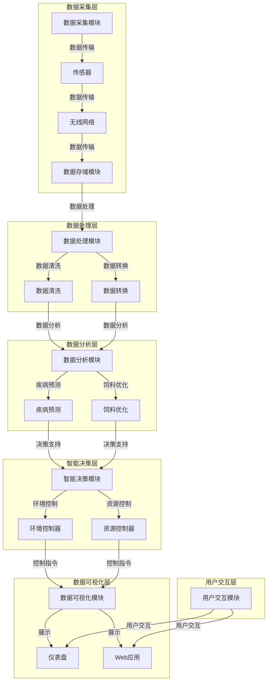
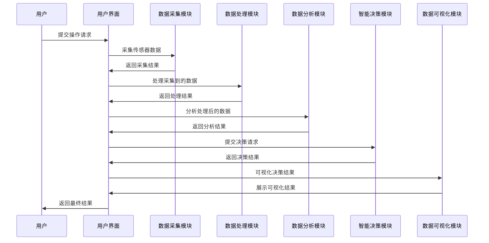

                 


## 物联网在智慧畜牧业中的精准管理

### 关键词：物联网、智慧畜牧业、精准管理、传感器、数据分析

#### 摘要：

随着物联网技术的迅猛发展，其在各个行业中的应用日益广泛，智慧畜牧业作为农业现代化的一个重要方向，也在物联网技术的推动下取得了显著的进步。本文旨在探讨物联网在智慧畜牧业中的应用，特别是如何通过精准管理实现畜牧业的高效发展。文章将从背景介绍、核心概念、技术原理、系统架构、项目实战等多个角度进行详细分析，以期为读者提供一个全面、系统的理解。

### 目录大纲设计

#### 背景介绍

首先，我们将为《物联网在智慧畜牧业中的精准管理》这本书设计一个详细的目录大纲。以下是本书的目录结构，涵盖从背景介绍、核心概念、算法原理、系统架构设计到项目实战等多个方面。

```markdown
# 《物联网在智慧畜牧业中的精准管理》目录大纲

## 第1章 问题背景与核心概念

## 1.1 物联网在畜牧业中的现状与发展趋势

## 1.2 智慧畜牧业的定义、核心要素与关键技术

## 1.3 物联网在智慧畜牧业中的应用场景

## 1.4 核心概念与联系

### 第2章 物联网技术原理

## 2.1 物联网基础架构

### 2.1.1 物联网的层次结构

### 2.1.2 物联网的关键技术

## 2.2 物联网设备与传感器

### 2.2.1 常见物联网设备介绍

### 2.2.2 传感器类型与选择

## 2.3 物联网通信协议

### 2.3.1 常见物联网通信协议

### 2.3.2 协议比较与选择

## 2.4 物联网安全技术

### 2.4.1 物联网安全挑战

### 2.4.2 常见安全措施

## 第3章 智慧畜牧业中的数据采集与管理

## 3.1 数据采集与处理

### 3.1.1 数据采集方法

### 3.1.2 数据预处理技术

## 3.2 数据存储与管理系统

### 3.2.1 常见数据存储解决方案

### 3.2.2 数据管理策略

## 3.3 数据分析与可视化

### 3.3.1 数据分析技术

### 3.3.2 数据可视化方法

## 第4章 精准管理算法原理

## 4.1 精准管理算法概述

### 4.1.1 算法目的与应用领域

### 4.1.2 算法类型与特点

## 4.2 算法原理讲解

### 4.2.1 算法数学模型与公式

### 4.2.2 算法mermaid流程图

### 4.2.3 Python源代码详解

## 4.3 算法实例分析

### 4.3.1 案例背景

### 4.3.2 算法应用与效果分析

## 第5章 智慧畜牧业系统架构设计

## 5.1 系统功能设计

### 5.1.1 领域模型类图

## 5.2 系统架构设计

### 5.2.1 系统架构mermaid图

## 5.3 系统接口设计

### 5.3.1 系统接口规范

## 5.4 系统交互mermaid序列图

### 5.4.1 系统交互流程

## 第6章 项目实战

## 6.1 项目环境安装

### 6.1.1 开发环境搭建

### 6.1.2 系统部署

## 6.2 系统核心实现

### 6.2.1 源代码解读

### 6.2.2 应用解读与分析

## 6.3 实际案例分析

### 6.3.1 案例背景

### 6.3.2 案例分析与讲解

## 第7章 最佳实践与总结

## 7.1 最佳实践技巧

## 7.2 小结

## 7.3 注意事项

## 7.4 拓展阅读
```

这个大纲包含了从背景介绍到项目实战的全面内容，确保读者能够系统地了解物联网在智慧畜牧业中的应用。接下来，我们将对每个章节进行细化，以满足字数限制和内容要求。

#### 核心章节细化

##### 第1章 问题背景与核心概念

在这个章节，我们将详细阐述物联网在畜牧业中的现状、发展趋势，以及智慧畜牧业的定义、核心要素与关键技术。

```markdown
## 第1章 问题背景与核心概念

### 1.1 物联网在畜牧业中的现状与发展趋势

- **物联网在畜牧业中的应用历史**：回顾物联网技术在畜牧业中的应用历程，从早期的自动化设备到现在的智能养殖系统。
- **当前物联网在畜牧业中的主要应用场景**：探讨物联网技术在畜牧生产、环境监测、疾病防控等领域的具体应用。
- **物联网技术在畜牧业发展中的推动作用**：分析物联网技术如何促进畜牧业生产效率提升、资源节约和环境友好。

### 1.2 智慧畜牧业的定义、核心要素与关键技术

- **智慧畜牧业的定义**：明确智慧畜牧业的内涵，即通过物联网、大数据、人工智能等技术的融合，实现畜牧业的智能化管理。
- **核心要素**：介绍智慧畜牧业的核心要素，包括数据采集、数据分析、智能决策等。
- **关键技术**：探讨物联网、传感器技术、大数据分析技术、智能算法在智慧畜牧业中的应用。

### 1.3 物联网在智慧畜牧业中的应用场景

- **生产环境监测**：介绍物联网技术如何监测养殖环境中的温度、湿度、空气质量等参数。
- **疾病预防与诊断**：探讨物联网技术在动物疾病预防、早期诊断中的应用。
- **饲料与水资源管理**：分析物联网技术如何优化饲料和水资源的管理，提高资源利用效率。
- **自动化养殖与智能监控**：探讨自动化养殖系统如何通过物联网技术实现高效养殖。
- **产品质量追溯**：介绍物联网技术在畜产品质量追溯系统中的应用。

### 1.4 核心概念与联系

- **物联网与智慧畜牧业的联系**：阐述物联网技术如何支撑智慧畜牧业的发展。
- **数据采集与管理的核心概念**：介绍数据采集与管理的相关概念，包括数据采集方法、预处理技术和存储策略。
- **精准管理与智慧畜牧业的互动**：分析精准管理如何通过物联网技术提升智慧畜牧业的管理水平。
```

##### 第2章 物联网技术原理

这个章节将详细介绍物联网技术的基本原理，包括物联网的基础架构、设备与传感器、通信协议以及安全技术。

```markdown
## 第2章 物联网技术原理

### 2.1 物联网基础架构

- **物联网的层次结构**：介绍物联网的物理层、感知层、传输层、网络层、平台层和应用层的结构。
- **物联网的关键技术**：分析物联网的关键技术，如传感器技术、嵌入式系统技术、无线通信技术等。

### 2.2 物联网设备与传感器

- **常见物联网设备介绍**：列举物联网设备如传感器、智能控制器、RFID标签等。
- **传感器类型与选择**：探讨不同类型的传感器及其在畜牧业中的应用。

### 2.3 物联网通信协议

- **常见物联网通信协议**：介绍常见的物联网通信协议，如Wi-Fi、Zigbee、LoRa、NB-IoT等。
- **协议比较与选择**：分析不同通信协议的优缺点，并根据应用场景选择合适的协议。

### 2.4 物联网安全技术

- **物联网安全挑战**：分析物联网面临的安全挑战，如数据泄露、设备被黑等。
- **常见安全措施**：介绍常见的物联网安全措施，如数据加密、身份认证、防火墙等。

```

##### 第3章 智慧畜牧业中的数据采集与管理

这个章节将详细讨论数据采集与处理、数据存储与管理系统、数据分析与可视化等内容。

```markdown
## 第3章 智慧畜牧业中的数据采集与管理

### 3.1 数据采集与处理

- **数据采集方法**：介绍数据采集的方法，如传感器采集、无线传输等。
- **数据预处理技术**：讨论数据预处理的方法，如数据清洗、去噪、数据格式转换等。

### 3.2 数据存储与管理系统

- **常见数据存储解决方案**：分析常见的数据存储方案，如关系型数据库、NoSQL数据库等。
- **数据管理策略**：探讨数据管理策略，如数据备份、数据恢复、数据权限管理等。

### 3.3 数据分析与可视化

- **数据分析技术**：介绍数据分析的方法，如统计分析、机器学习等。
- **数据可视化方法**：讨论数据可视化的方法，如图表、仪表盘等。

```

##### 第4章 精准管理算法原理

这个章节将详细讲解精准管理算法的概述、原理、流程和实例分析。

```markdown
## 第4章 精准管理算法原理

### 4.1 精准管理算法概述

- **算法目的与应用领域**：介绍精准管理算法的目的和应用领域，如疾病预防、饲料管理、自动化控制等。
- **算法类型与特点**：分析不同类型的精准管理算法，如监督学习、无监督学习、强化学习等，并讨论其特点。

### 4.2 算法原理讲解

- **算法数学模型与公式**：给出算法的数学模型和公式，如线性回归、支持向量机、神经网络等。
- **算法mermaid流程图**：使用mermaid绘制算法流程图，帮助读者理解算法的执行过程。
- **Python源代码详解**：提供算法的Python源代码，并进行详细解读，以便读者理解和实践。

### 4.3 算法实例分析

- **案例背景**：介绍案例的背景，如某个畜牧场面临的实际问题。
- **算法应用与效果分析**：分析如何应用精准管理算法解决实际问题，并讨论算法的效果。

```

##### 第5章 智慧畜牧业系统架构设计

这个章节将详细讨论系统功能设计、系统架构设计、系统接口设计和系统交互。

```markdown
## 第5章 智慧畜牧业系统架构设计

### 5.1 系统功能设计

- **领域模型类图**：使用mermaid绘制领域模型类图，展示系统的功能模块和实体关系。

### 5.2 系统架构设计

- **系统架构mermaid图**：使用mermaid绘制系统架构图，展示系统的整体结构和层次关系。

### 5.3 系统接口设计

- **系统接口规范**：介绍系统接口的设计规范，包括接口的定义、参数、返回值等。

### 5.4 系统交互mermaid序列图

- **系统交互mermaid序列图**：使用mermaid绘制系统交互序列图，展示系统各模块之间的交互流程。

```

##### 第6章 项目实战

这个章节将详细介绍项目环境安装、系统核心实现和实际案例分析。

```markdown
## 第6章 项目实战

### 6.1 项目环境安装

- **开发环境搭建**：介绍项目的开发环境搭建过程，包括开发工具、数据库和中间件的选择与安装。
- **系统部署**：讨论系统的部署流程，包括服务器配置、网络设置和系统安装。

### 6.2 系统核心实现

- **源代码解读**：提供系统核心实现的源代码，并进行详细解读，以便读者理解系统的工作原理。
- **应用解读与分析**：分析系统核心功能的应用场景和实现细节。

### 6.3 实际案例分析

- **案例背景**：介绍实际案例的背景，如某个畜牧场面临的具体问题。
- **案例分析与讲解**：分析如何应用物联网技术和算法解决实际案例中的问题，并讨论案例的效果和改进空间。

```

##### 第7章 最佳实践与总结

这个章节将总结最佳实践技巧、系统小结、注意事项和拓展阅读。

```markdown
## 第7章 最佳实践与总结

### 7.1 最佳实践技巧

- **数据采集与处理技巧**：提供数据采集与处理的一些实用技巧，如传感器校准、数据去噪等。
- **系统架构设计技巧**：讨论系统架构设计的一些最佳实践，如模块化设计、可扩展性设计等。

### 7.2 小结

- **系统小结**：总结智慧畜牧业系统的主要功能、优点和不足之处。
- **注意事项**：提醒读者在实施物联网在智慧畜牧业中的应用时需要注意的问题。

### 7.3 注意事项

- **系统安全**：强调系统安全的重要性，介绍一些安全防护措施。
- **数据隐私**：讨论数据隐私保护的方法，如数据加密、访问控制等。

### 7.4 拓展阅读

- **相关书籍与文献**：推荐一些与物联网、智慧畜牧业相关的书籍和文献，供读者进一步学习。
- **在线资源和社区**：介绍一些在线资源和社区，如技术论坛、博客、GitHub等，供读者交流和分享经验。

```

通过以上详细的章节细化，我们确保《物联网在智慧畜牧业中的精准管理》这本书的内容丰富、结构清晰，能够为读者提供全面、系统的指导。接下来，我们将逐章展开详细的内容讲解，以满足字数要求和文章质量。

### 第1章 问题背景与核心概念

#### 1.1 物联网在畜牧业中的现状与发展趋势

物联网（Internet of Things，IoT）是指通过互联网将各种物品连接起来，实现智能化的信息交换和协同工作。自20世纪末以来，物联网技术在全球范围内取得了显著的进展，并在多个行业中得到了广泛应用。畜牧业作为农业的重要组成部分，其生产效率、资源利用和环境友好度直接关系到国家的粮食安全和农民的收益。物联网技术在畜牧业中的应用，有助于提高养殖效益、降低生产成本和减少环境污染，成为推动畜牧业现代化的重要手段。

**物联网在畜牧业中的应用历史**

物联网技术在畜牧业中的应用可以追溯到20世纪90年代。最初，畜牧业中主要使用自动化设备进行日常生产管理，如自动喂食器、自动饮水器和自动清洁设备。这些设备的出现，使得畜牧业生产过程更加便捷和高效。随着互联网和通信技术的发展，物联网技术逐渐成为畜牧业管理的重要工具。

21世纪初，传感器技术得到了快速发展，各种类型的传感器被广泛应用于畜牧业中，用于实时监测动物的健康状况、生产性能和周围环境。这些传感器的数据通过无线网络传输到中央控制系统，实现了对养殖环境的远程监控和管理。

近年来，随着大数据、云计算和人工智能技术的兴起，物联网在畜牧业中的应用水平得到了进一步提升。通过将物联网技术与大数据分析、人工智能相结合，实现了对养殖数据的深度挖掘和智能决策，从而大大提高了畜牧业的智能化管理水平。

**当前物联网在畜牧业中的主要应用场景**

1. **生产环境监测**

   生产环境监测是物联网技术在畜牧业中的核心应用之一。通过部署各种传感器，如温度传感器、湿度传感器、二氧化碳传感器等，可以实时监测养殖环境中的关键参数。这些数据被传输到中央控制系统，通过数据分析软件进行分析和处理，可以帮助养殖户及时调整养殖环境，确保动物健康成长。

2. **疾病预防与诊断**

   物联网技术在疾病预防与诊断中的应用，主要包括动物健康监测和疾病预警。通过佩戴在动物身上的传感器，可以实时监测动物的体温、心率、活动量等生理指标。一旦发现异常，系统会立即向养殖户发送预警信息，以便采取相应的措施。同时，通过对大量动物健康数据的分析，可以预测疾病的发生趋势，提前采取预防措施。

3. **饲料与水资源管理**

   饲料和水资源管理是畜牧业中影响生产效率的重要因素。物联网技术可以通过传感器实时监测饲料消耗情况和水资源使用情况，自动调节饲料和水的供应，避免浪费。同时，通过数据分析，可以优化饲料配方和水资源利用策略，提高养殖效益。

4. **自动化养殖与智能监控**

   自动化养殖系统是物联网技术在畜牧业中应用的一个重要方向。通过物联网设备，可以实现自动化喂食、自动清洁、自动消毒等功能，提高养殖效率。同时，智能监控系统可以对养殖环境进行实时监控，及时发现和处理异常情况，确保养殖安全。

5. **产品质量追溯**

   产品质量追溯是保障畜产品质量的重要手段。通过物联网技术，可以在养殖过程中记录动物的生产日期、饲料来源、健康状况等信息，实现产品质量的可追溯。一旦出现质量问题，可以迅速追溯到具体的生产环节，及时采取措施，降低损失。

**物联网技术在畜牧业发展中的推动作用**

物联网技术在畜牧业中的应用，不仅提高了生产效率，还带来了以下几方面的积极影响：

1. **提高生产效率**

   通过物联网技术的应用，养殖户可以实时掌握养殖环境数据和生产情况，及时调整养殖策略，提高生产效率。自动化养殖系统的应用，大大减少了人工干预，降低了劳动强度，提高了生产效率。

2. **降低生产成本**

   物联网技术的应用，可以实现精准管理，减少资源浪费。例如，通过实时监测饲料消耗情况，可以优化饲料供应，避免过度投喂。同时，自动化设备的普及，减少了人工成本，降低了生产成本。

3. **提高资源利用效率**

   物联网技术可以通过数据分析和智能决策，优化饲料、水资源和能源的利用，提高资源利用效率。例如，通过实时监测养殖环境中的温度、湿度等参数，可以调整通风、加热等设备的工作状态，实现能源的高效利用。

4. **促进环境保护**

   物联网技术的应用，可以实现对养殖环境的实时监控和自动调节，减少废弃物排放，降低环境污染。例如，通过智能监控设备，可以实时监测养殖场中的氨气、硫化氢等污染物浓度，及时采取排放控制措施，降低对环境的污染。

5. **保障产品质量和安全**

   通过物联网技术实现产品质量追溯，可以确保产品的来源可查、过程可控，提高产品质量和安全。例如，通过记录动物的生产日期、饲料来源、健康状况等信息，可以确保产品的质量符合标准，避免食品安全事故的发生。

总之，物联网技术在畜牧业中的应用，不仅提高了生产效率，降低了生产成本，还促进了环境保护和产品质量提升，为畜牧业的高效、可持续发展提供了有力支持。随着物联网技术的不断进步，其在畜牧业中的应用前景将更加广阔。

#### 1.2 智慧畜牧业的定义、核心要素与关键技术

**智慧畜牧业的定义**

智慧畜牧业，是指通过物联网、大数据、云计算、人工智能等现代信息技术的融合与应用，实现畜牧业智能化、精准化、高效化的管理，从而提高养殖效益、降低生产成本、保障食品安全、促进环境保护的现代化畜牧业模式。

智慧畜牧业的核心在于“智慧”，即通过信息技术的应用，使畜牧业从传统的经验管理向数据驱动、智能决策的模式转变。这种转变不仅提高了生产效率和资源利用效率，还实现了对环境、动物健康和产品质量的精准控制，推动了畜牧业的可持续发展。

**核心要素**

智慧畜牧业的核心要素包括数据采集、数据分析、智能决策和系统集成。以下是对这些核心要素的详细解释：

1. **数据采集**

   数据采集是智慧畜牧业的基础。通过部署各种传感器，如温度传感器、湿度传感器、二氧化碳传感器、动物生理传感器等，可以实时采集养殖环境、动物生理状态和生产数据。这些数据为后续的数据分析和智能决策提供了重要依据。

2. **数据分析**

   数据分析是智慧畜牧业的“智慧”核心。通过对采集到的数据进行分析，可以识别出潜在的问题和趋势，为养殖户提供科学决策依据。数据分析技术包括统计分析、数据挖掘、机器学习等，通过对数据的深度挖掘，可以实现精准管理、预测预警和优化决策。

3. **智能决策**

   智能决策是智慧畜牧业的终极目标。通过大数据分析和人工智能技术，可以对养殖环境、动物生理状态和生产过程进行智能分析，实现自动化的优化决策。例如，根据动物的生长状况和饲料消耗情况，智能调整饲料供应量；根据环境数据，自动调节养殖环境的温度、湿度等参数。

4. **系统集成**

   系统集成是将数据采集、数据分析、智能决策等各个模块有机地结合在一起，形成一个完整的智慧畜牧业系统。系统集成不仅提高了系统的协同工作效率，还实现了数据的无缝衔接和共享，为养殖户提供了全面、系统的管理工具。

**关键技术**

智慧畜牧业的发展离不开关键技术的支持。以下介绍几项关键技术：

1. **物联网技术**

   物联网技术是智慧畜牧业的基石。通过物联网设备，可以实现对养殖环境的实时监测和动物生理状态的实时跟踪。物联网技术包括传感器技术、无线通信技术、边缘计算技术等，这些技术为数据采集提供了强有力的支持。

2. **大数据技术**

   大数据技术是智慧畜牧业的重要支撑。通过大数据技术，可以对海量的养殖数据进行存储、处理和分析，从中挖掘出有价值的信息，为养殖户提供科学的决策依据。大数据技术包括数据采集、数据存储、数据挖掘、数据可视化等。

3. **云计算技术**

   云计算技术为智慧畜牧业提供了强大的计算能力和数据存储能力。通过云计算平台，可以实现数据的快速处理和分析，同时提供了灵活的扩展能力，满足不同规模养殖户的需求。

4. **人工智能技术**

   人工智能技术是智慧畜牧业的智慧之眼。通过人工智能技术，可以对养殖数据进行智能分析和预测，实现自动化的优化决策。人工智能技术包括机器学习、深度学习、自然语言处理等。

5. **系统集成技术**

   系统集成技术是将各个模块有机结合起来的关键。通过系统集成技术，可以实现数据的无缝衔接和共享，提高系统的协同工作效率，为养殖户提供便捷、高效的管理工具。

总之，智慧畜牧业是信息技术与畜牧业深度融合的产物，通过数据采集、数据分析、智能决策和系统集成等核心要素和关键技术的支持，实现了畜牧业管理的智能化、精准化和高效化，为畜牧业的可持续发展提供了有力保障。

#### 1.3 物联网在智慧畜牧业中的应用场景

物联网技术在智慧畜牧业中的应用场景十分广泛，涵盖了生产环境监测、疾病预防与诊断、饲料与水资源管理、自动化养殖与智能监控以及产品质量追溯等多个方面。以下我们将详细探讨这些应用场景及其具体内容。

**1. 生产环境监测**

生产环境监测是智慧畜牧业的基础，通过部署各种传感器，实时采集养殖环境中的温度、湿度、二氧化碳浓度、空气质量等数据。这些数据通过无线网络传输到中央控制系统，进行实时监控和分析。

- **温度和湿度监测**：动物对环境温度和湿度有着严格的要求，通过实时监测温度和湿度，可以确保养殖环境处于最佳状态，提高动物的生长速度和健康水平。
- **二氧化碳浓度监测**：养殖环境中二氧化碳浓度过高会对动物的健康产生不利影响，通过实时监测和调节二氧化碳浓度，可以确保养殖环境的安全和舒适。
- **空气质量监测**：空气质量对动物的呼吸系统有重要影响，通过空气质量监测，可以及时发现有害气体，采取相应措施，保障动物健康。

**2. 疾病预防与诊断**

物联网技术在疾病预防与诊断中发挥了重要作用，通过实时监测动物的体温、心率、呼吸频率等生理指标，可以及时发现异常情况，进行早期诊断和预防。

- **体温监测**：动物体温异常可能预示着疾病的来临，通过实时监测体温，可以及时发现发热情况，及时采取措施。
- **心率监测**：心率异常可能是动物患有心脏病或其他疾病的信号，通过心率监测，可以及早发现潜在的健康问题。
- **活动量监测**：动物的活动量减少可能是患病的前兆，通过活动量监测，可以及早发现异常，进行预防治疗。

**3. 饲料与水资源管理**

饲料和水资源管理是影响畜牧业生产效率和成本的重要因素。物联网技术可以通过实时监测饲料消耗和水资源使用情况，优化饲料供应和水资源管理，提高资源利用效率。

- **饲料消耗监测**：通过传感器实时监测饲料消耗情况，可以及时补充饲料，避免饲料浪费，降低养殖成本。
- **水资源使用监测**：通过传感器监测水资源使用情况，可以优化水资源的分配和使用，提高水资源利用效率，减少水资源浪费。
- **智能调节系统**：通过物联网技术，可以实现饲料和水的智能调节，根据动物的生长需求和实际情况，自动调节饲料和水的供应，提高养殖效益。

**4. 自动化养殖与智能监控**

自动化养殖系统是物联网技术在畜牧业中应用的一个重要方向，通过物联网设备，可以实现自动化喂食、自动清洁、自动消毒等功能，提高养殖效率。

- **自动化喂食系统**：通过传感器和智能控制系统，可以实现自动喂食，根据动物的体重、生长阶段和饲料消耗情况，自动调节喂食量，提高饲料利用率。
- **自动清洁系统**：通过智能清洁设备，可以实现自动清洁养殖环境，减少人工干预，降低劳动强度，提高养殖效率。
- **智能监控系统**：通过摄像头和传感器，可以实现养殖环境的智能监控，实时监控动物的行为和健康状况，及时发现和处理异常情况。

**5. 产品质量追溯**

产品质量追溯是保障畜产品质量的重要手段，通过物联网技术，可以在养殖过程中记录动物的生产日期、饲料来源、健康状况等信息，实现产品质量的可追溯。

- **生产日期记录**：通过物联网设备，可以实时记录动物的生产日期，确保产品的来源可查。
- **饲料来源记录**：通过物联网设备，可以记录饲料的来源信息，确保饲料的质量和安全。
- **健康状况记录**：通过物联网设备，可以实时监测动物的健康状况，确保产品的健康和安全。

**6. 智能决策支持**

物联网技术可以为养殖户提供智能决策支持，通过大数据分析和人工智能技术，对养殖数据进行深度挖掘，为养殖户提供科学决策依据。

- **生长趋势预测**：通过对动物生长数据的分析，可以预测动物的生长趋势，及时调整养殖策略。
- **疾病预警**：通过对动物生理指标的分析，可以预测疾病的发生趋势，及时采取措施进行预防。
- **优化养殖策略**：通过对养殖数据的分析，可以为养殖户提供优化养殖策略的建议，提高养殖效益。

通过以上应用场景的探讨，可以看出物联网技术在智慧畜牧业中的应用具有重要意义。它不仅提高了养殖效率、降低了生产成本，还保障了产品质量和环境保护，为畜牧业的可持续发展提供了有力支持。

#### 1.4 核心概念与联系

**物联网与智慧畜牧业的联系**

物联网（IoT）是智慧畜牧业的基础技术之一，两者之间的联系非常紧密。物联网通过连接各种设备、传感器和数据平台，实现了数据的实时采集、传输和处理，为智慧畜牧业提供了丰富的数据资源和技术支持。具体来说，物联网在智慧畜牧业中的应用主要包括以下几个方面：

1. **数据采集与传输**：物联网技术可以实时采集养殖环境中的各种数据，如温度、湿度、二氧化碳浓度等，并通过无线网络传输到中央控制系统，实现了对养殖环境的远程监控和管理。
2. **设备互联与协同**：物联网技术实现了养殖场中各种设备的互联与协同工作，如自动化喂食器、自动清洁设备、智能监控设备等，通过设备的协同工作，提高了养殖效率和管理水平。
3. **数据集成与共享**：物联网技术将养殖场中的各类数据集成到一个平台上，实现了数据的统一管理和共享，为养殖户提供了全面、系统的管理工具。

**数据采集与管理的核心概念**

数据采集与管理是智慧畜牧业中不可或缺的环节，其核心概念包括以下几个方面：

1. **数据采集**：数据采集是数据管理的第一步，通过传感器、RFID标签、摄像头等设备，可以实时采集养殖环境、动物生理状态和生产数据。
2. **数据预处理**：数据预处理是对采集到的原始数据进行清洗、去噪、格式转换等处理，以提高数据的质量和可用性。
3. **数据存储**：数据存储是将预处理后的数据存储到数据库或云平台中，以便后续的数据分析和处理。
4. **数据管理**：数据管理包括数据备份、数据恢复、数据权限管理、数据访问控制等，确保数据的安全和可用性。

**精准管理与智慧畜牧业的互动**

精准管理是智慧畜牧业的核心目标之一，其与智慧畜牧业的互动主要体现在以下几个方面：

1. **数据驱动**：精准管理依赖于大数据分析和人工智能技术，通过对养殖数据的深度挖掘和分析，实现养殖过程的自动化控制和优化。
2. **智能决策**：精准管理通过智能算法和模型，对养殖数据进行分析和预测，为养殖户提供科学的决策依据，实现养殖过程的自动化和智能化。
3. **持续优化**：精准管理通过不断收集和分析养殖数据，优化养殖策略和操作流程，实现养殖效益的最大化。

**物联网与智慧畜牧业的整体架构**

物联网与智慧畜牧业的整体架构可以分为以下几个层次：

1. **感知层**：包括传感器、RFID标签、摄像头等设备，用于实时采集养殖环境、动物生理状态和生产数据。
2. **传输层**：包括无线网络、有线网络等，用于传输感知层采集到的数据到数据中心或云平台。
3. **平台层**：包括数据存储、处理、分析和展示等模块，用于对采集到的数据进行存储、处理和分析，并提供决策支持。
4. **应用层**：包括养殖管理、疾病预防、饲料管理、水资源管理等功能模块，用于实现智慧畜牧业的各项管理功能。

通过以上分析，可以看出物联网与智慧畜牧业之间的紧密联系，以及数据采集与管理、精准管理与智慧畜牧业互动等方面的核心概念和整体架构。物联网技术为智慧畜牧业提供了强大的技术支持，推动了畜牧业的智能化、精准化和高效化发展。

### 第2章 物联网技术原理

#### 2.1 物联网基础架构

物联网（IoT）的基础架构是指支持物联网系统运行的基本结构，它由多个层次组成，包括感知层、传输层、平台层和应用层。每个层次都有其特定的功能，共同构成了一个完整、高效、可靠的物联网生态系统。

**感知层**

感知层是物联网系统的最底层，主要负责数据的采集。这一层包含了各种传感器和采集设备，如温度传感器、湿度传感器、光照传感器、气体传感器、摄像头、RFID标签等。这些设备能够实时感知周围环境的变化，并将这些数据转换成数字信号，为上层处理提供原始数据。

- **传感器**：用于监测各种环境参数，如温度、湿度、压力、光照等。
- **采集设备**：用于收集动物生理状态、行为数据，以及生产过程中的其他信息。

**传输层**

传输层主要负责将感知层采集到的数据传输到平台层。这一层包括了各种通信协议和网络技术，如Wi-Fi、Zigbee、LoRa、NB-IoT、5G等。传输层的主要功能是确保数据能够高效、安全、可靠地传输到目的地。

- **无线通信技术**：如Wi-Fi、Zigbee、LoRa等，适用于短距离、低功耗的数据传输。
- **有线通信技术**：如以太网、光纤等，适用于高带宽、高可靠性的数据传输。
- **5G技术**：提供高速、低延迟的通信体验，适用于对实时性要求较高的应用场景。

**平台层**

平台层是物联网系统的核心，负责数据的存储、处理和分析。这一层通常包括云计算平台、数据中心和大数据平台等。平台层能够对采集到的海量数据进行存储、清洗、转换、分析和可视化，并提供决策支持。

- **数据存储**：包括关系型数据库、NoSQL数据库、分布式数据库等，用于存储和管理大量数据。
- **数据处理**：包括ETL（抽取、转换、加载）工具、数据清洗工具、数据挖掘工具等，用于处理和分析数据。
- **数据分析**：包括统计分析、数据挖掘、机器学习等，用于从数据中提取有价值的信息和模式。

**应用层**

应用层是物联网系统的最上层，直接面向用户，提供各种应用服务。这一层包括了各种智能设备、应用程序和Web平台等，用户可以通过这些应用与服务进行互动，获取所需的信息和功能。

- **智能设备**：如智能控制器、智能终端、可穿戴设备等，提供本地化的数据采集和控制功能。
- **应用程序**：如手机APP、Web应用等，用于数据的展示、监控和操作。
- **Web平台**：提供统一的用户界面，集成多种应用服务，方便用户进行管理和监控。

**物联网基础架构的关键技术**

物联网基础架构的实现依赖于一系列关键技术的支持，这些技术包括传感器技术、嵌入式系统技术、无线通信技术、数据处理技术、云计算技术、人工智能技术等。

- **传感器技术**：用于数据的采集，是实现物联网感知层的关键。
- **嵌入式系统技术**：用于将传感器、处理器、存储器等硬件集成在一起，实现物联网设备的自主运行。
- **无线通信技术**：用于数据的传输，是实现物联网传输层的关键。
- **数据处理技术**：用于数据存储、清洗、转换和分析，是实现物联网平台层的关键。
- **云计算技术**：提供强大的计算和存储能力，是实现物联网应用层的关键。
- **人工智能技术**：用于数据的智能分析和预测，是实现物联网智能决策的关键。

综上所述，物联网基础架构是由感知层、传输层、平台层和应用层组成的复杂系统，各个层次相互协同，共同实现了物联网系统的数据采集、传输、处理和应用。通过这一架构，物联网技术能够为智慧畜牧业提供强大的技术支持，实现精准管理和高效运营。

#### 2.2 物联网设备与传感器

物联网设备是物联网系统的核心组成部分，它们通过传感器和通信模块实现数据的采集、传输和交互。在智慧畜牧业中，物联网设备与传感器发挥着至关重要的作用，下面将详细介绍常见的物联网设备及其工作原理。

**2.2.1 常见物联网设备介绍**

1. **智能传感器**

   智能传感器是物联网设备中最常见的类型，它们能够感知环境中的各种物理量，如温度、湿度、光照、气体浓度等，并将这些信息转换为电子信号。常见的智能传感器包括：

   - **温度传感器**：如热电偶、热敏电阻等，用于监测养殖环境的温度。
   - **湿度传感器**：如电容式湿度传感器、电阻式湿度传感器等，用于监测养殖环境的湿度。
   - **光照传感器**：如光敏电阻、光电二极管等，用于监测光照强度。
   - **气体传感器**：如氧化铟锡气体传感器、金属氧化物气体传感器等，用于监测养殖环境中的气体浓度。

2. **RFID标签**

   RFID（射频识别）标签是一种利用射频信号进行通信的电子标签，它包含一个芯片和一根天线，可以通过无线电波识别目标并读写数据。RFID标签在智慧畜牧业中的应用非常广泛，如用于动物标识、饲料管理、设备追踪等。

3. **摄像头**

   摄像头是物联网设备中的重要组成部分，它可以实时捕捉视频图像，用于监控养殖环境、动物行为和异常情况。随着计算机视觉和人工智能技术的发展，摄像头还具备图像识别和智能分析的功能。

4. **智能控制器**

   智能控制器是一种集成了传感器、处理器和通信模块的设备，它可以对环境参数进行实时监测和自动调节。常见的智能控制器包括温度控制器、湿度控制器、光照控制器等，它们可以根据传感器的数据自动调整养殖环境。

5. **智能终端**

   智能终端是指具备计算能力和通信功能的设备，如智能手机、平板电脑、智能手表等。智能终端可以通过无线网络连接到物联网系统，实现对远程设备的监控和操作。

**2.2.2 传感器类型与选择**

在选择物联网传感器时，需要考虑以下因素：

1. **传感器类型**

   - **有源传感器**：需要外部电源供电，如温度传感器、湿度传感器等。
   - **无源传感器**：不需要外部电源，如光照传感器、气体传感器等。

2. **测量范围**

   - 传感器的测量范围需要与实际应用场景相匹配，确保能够准确监测所需的物理量。

3. **精度**

   - 传感器的精度决定了监测数据的可靠性，应根据应用需求选择合适精度的传感器。

4. **响应时间**

   - 传感器的响应时间决定了数据的实时性，应根据实际应用场景选择响应速度较快的传感器。

5. **功耗**

   - 对于需要长时间运行或无法频繁充电的物联网设备，低功耗传感器是优先选择。

6. **稳定性**

   - 传感器的稳定性决定了其在长时间运行中的可靠性和寿命，应选择稳定性较高的传感器。

7. **通信协议**

   - 传感器的通信协议需要与物联网系统兼容，确保数据能够有效传输和交互。

通过合理选择物联网设备和传感器，智慧畜牧业可以实现更高效、精准的管理，从而提高养殖效益，降低生产成本，保障产品质量和环境保护。

#### 2.3 物联网通信协议

物联网通信协议是物联网系统中至关重要的一环，它负责确保数据的可靠传输和通信的稳定性。在智慧畜牧业中，选择合适的通信协议对于实现高效、稳定的物联网应用至关重要。以下将介绍几种常见的物联网通信协议，并对它们进行比较与选择。

**2.3.1 常见物联网通信协议**

1. **Wi-Fi**

   Wi-Fi是一种广泛使用的无线通信协议，基于IEEE 802.11标准。它具有高带宽、高速传输和广泛的覆盖范围等优点，适用于需要高数据传输速率的应用场景。然而，Wi-Fi的功耗较高，且在多用户环境下容易产生干扰，因此在一些功耗敏感或干扰较多的环境中使用时需谨慎。

2. **Zigbee**

   Zigbee是一种低功耗、低速率的无线通信协议，基于IEEE 802.15.4标准。它具有低成本、低功耗、短距离传输等优点，适用于智能家居、工业自动化、畜牧业等低速率、低功耗的应用。Zigbee网络可以轻松扩展，支持多个设备的同时连接。

3. **LoRa**

   LoRa（Long Range）是一种长距离、低功耗的无线通信协议，基于Semtech的LoRaWAN标准。它具有超长的通信距离（可达数公里）、低功耗和较好的抗干扰性等优点，适用于广域物联网应用，如智能畜牧业、环境监测等。然而，LoRa的传输速率相对较低，不适合需要高带宽的应用。

4. **NB-IoT**

   NB-IoT（Narrow Band Internet of Things）是一种由3GPP推出的低功耗广域物联网通信协议。它具有低功耗、低速率、广覆盖等优点，适用于农村、偏远地区的物联网应用。NB-IoT在覆盖范围和功耗方面具有优势，但在传输速率上稍逊于Wi-Fi和LoRa。

5. **5G**

   5G是一种第五代移动通信技术，具有高速率、低延迟、高可靠性等优点。5G网络可以实现大规模设备连接，提供高带宽和低延迟的通信体验，适用于需要高速数据传输和实时交互的应用场景。然而，5G的覆盖范围和设备成本相对较高，在一些偏远地区可能尚未普及。

**2.3.2 协议比较与选择**

在选择物联网通信协议时，需要综合考虑以下因素：

1. **通信速率**

   - Wi-Fi和5G具有较高的通信速率，适合需要高速数据传输的应用。
   - Zigbee和LoRa的通信速率较低，但足够满足大多数物联网应用的需求。

2. **覆盖范围**

   - Wi-Fi的覆盖范围较广，但受干扰较大。
   - LoRa和NB-IoT具有较长的通信距离，适合广域物联网应用。

3. **功耗**

   - Zigbee和LoRa具有低功耗特性，适合长时间运行或无法频繁充电的设备。
   - Wi-Fi和5G功耗较高，需考虑设备的电池容量和充电条件。

4. **成本**

   - Zigbee和LoRa设备成本较低，适合预算有限的应用。
   - Wi-Fi和5G设备成本较高，但提供更好的性能和覆盖范围。

5. **可靠性**

   - Wi-Fi和5G具有较好的可靠性，但易受环境干扰。
   - LoRa和NB-IoT在抗干扰性和稳定性方面具有优势。

根据以上因素，可以选择适合智慧畜牧业的物联网通信协议：

- **生产环境监测**：由于需要实时传输大量数据，可选择Wi-Fi或5G。
- **设备远程监控**：由于覆盖范围广、功耗低，可选择LoRa或NB-IoT。
- **动物生理状态监测**：由于需要长时间运行、低功耗，可选择Zigbee。

总之，合理选择物联网通信协议对于实现智慧畜牧业的精准管理和高效运营至关重要。通过综合考虑通信速率、覆盖范围、功耗、成本和可靠性等因素，可以确保物联网系统的高效、稳定运行。

#### 2.4 物联网安全技术

随着物联网技术在各行各业中的应用越来越广泛，物联网安全成为了一个亟待解决的问题。在智慧畜牧业中，物联网设备、传感器和数据平台的安全问题尤为突出。本文将分析物联网面临的主要安全挑战，并介绍常见的物联网安全措施。

**2.4.1 物联网安全挑战**

1. **设备安全性**

   物联网设备通常具有有限的计算资源和存储能力，这使得它们更容易受到恶意攻击。攻击者可以通过远程控制设备、窃取敏感数据或利用设备作为跳板攻击其他系统。

2. **数据泄露**

   物联网设备不断采集和传输数据，这些数据可能包含敏感信息，如动物的健康状况、养殖环境参数等。如果数据传输过程中没有得到妥善保护，可能导致数据泄露，给企业和个人带来严重的损失。

3. **通信安全**

   物联网设备通常通过无线网络进行通信，这些通信方式容易受到窃听和篡改。如果通信过程没有得到有效保护，攻击者可以截获数据、伪造身份或篡改数据，从而影响物联网系统的正常运行。

4. **系统完整性**

   物联网系统需要保证其完整性和可靠性，但恶意软件或恶意攻击可能导致系统崩溃或功能失效。攻击者可以通过恶意软件破坏系统、窃取数据或控制设备，从而给企业和个人带来严重的损失。

5. **用户隐私**

   物联网设备在采集和处理数据时，可能涉及用户的个人隐私信息，如位置信息、行为习惯等。如果这些信息没有得到妥善保护，可能导致用户隐私泄露，引发法律和道德问题。

**2.4.2 常见安全措施**

1. **数据加密**

   数据加密是保护物联网数据安全的重要手段。通过对数据进行加密，确保数据在传输过程中不被窃听和篡改。常用的加密算法包括对称加密（如AES）和非对称加密（如RSA），根据具体需求选择合适的加密算法。

2. **身份认证**

   身份认证用于验证物联网设备和用户的身份，防止未授权的访问。常见的身份认证方式包括密码认证、生物识别认证和数字证书认证。密码认证简单易用，但安全性较低；生物识别认证安全性较高，但成本较高；数字证书认证结合了两者的优点，是一种较为常用的认证方式。

3. **访问控制**

   访问控制用于限制物联网设备的访问权限，确保只有授权用户才能访问敏感数据或控制设备。常见的访问控制方法包括基于角色的访问控制（RBAC）和基于属性的访问控制（ABAC）。通过合理配置访问控制策略，可以防止未授权访问和滥用权限。

4. **防火墙**

   防火墙是保护物联网网络安全的常见措施，可以过滤不安全的网络流量，防止恶意攻击。防火墙可以根据规则对进出网络的数据包进行审查和过滤，防止恶意攻击和数据泄露。

5. **入侵检测系统（IDS）**

   入侵检测系统用于监测物联网网络的异常行为和潜在威胁，及时发现和响应安全事件。入侵检测系统可以分析网络流量、系统日志等数据，发现恶意行为或异常行为，并生成告警信息。

6. **安全审计**

   安全审计是对物联网系统的安全状况进行定期检查和评估，以确保系统的安全性和合规性。安全审计可以识别系统中的安全漏洞和潜在风险，提出改进建议，加强物联网系统的安全性。

7. **安全培训**

   安全培训是提高物联网用户和运维人员安全意识的重要手段。通过安全培训，用户和运维人员可以了解物联网安全的基本知识和常见威胁，学会识别和应对安全事件。

总之，物联网技术在智慧畜牧业中的应用带来了巨大的便利和效益，但同时也带来了安全挑战。通过采取有效的安全措施，可以保护物联网设备和数据的安全，确保智慧畜牧业的稳定运行和可持续发展。

### 第3章 智慧畜牧业中的数据采集与管理

#### 3.1 数据采集与处理

在智慧畜牧业中，数据采集是实现精准管理的重要环节。通过实时采集动物生理状态、生产环境参数等数据，可以了解养殖环境的变化和动物的健康状况，从而采取相应的管理措施。以下是数据采集与处理的方法和技术。

**3.1.1 数据采集方法**

1. **传感器采集**

   传感器是数据采集的核心设备，可以实时监测环境参数和动物生理状态。常见的传感器包括温度传感器、湿度传感器、光照传感器、气体传感器、动物生理传感器等。传感器采集的数据包括温度、湿度、光照强度、二氧化碳浓度、心率、活动量等。

2. **RFID采集**

   RFID（射频识别）技术可以用于采集动物的身份信息、饲料消耗情况、饲料来源等数据。通过给动物佩戴RFID标签，可以实现对动物身份的实时追踪和管理。

3. **摄像头采集**

   摄像头可以用于采集动物的行为数据，如进食、休息、运动等。通过图像识别技术，可以分析动物的行为模式，预测潜在的健康问题。

4. **手动采集**

   在一些特定情况下，可以通过手动采集数据，如定期测量动物的体重、健康状况等。这种方法虽然效率较低，但在特定场景下仍有其应用价值。

**3.1.2 数据预处理技术**

数据预处理是数据采集后的重要步骤，旨在提高数据的质量和可用性。以下是一些常见的数据预处理技术：

1. **数据清洗**

   数据清洗是指识别和纠正数据中的错误、异常和不一致。常见的清洗方法包括去除重复数据、填补缺失值、去除噪声等。

2. **数据格式转换**

   数据采集过程中可能涉及多种数据格式，如文本、图像、音频等。通过数据格式转换，可以统一数据格式，便于后续处理。

3. **数据标准化**

   数据标准化是将不同单位或度量标准的数据转换为统一的度量标准，以便进行比较和分析。

4. **数据归一化**

   数据归一化是将数据转换到同一尺度，以消除数据量级差异对分析结果的影响。常用的归一化方法包括最小-最大归一化、平均值-标准差归一化等。

5. **数据降维**

   数据降维是将高维数据转换成低维数据，以减少数据量，提高计算效率。常用的降维方法包括主成分分析（PCA）、线性判别分析（LDA）等。

#### 3.2 数据存储与管理系统

数据存储与管理是智慧畜牧业中另一个关键环节，确保数据的持久化和安全性至关重要。以下是数据存储与管理系统的常见解决方案和策略。

**3.2.1 常见数据存储解决方案**

1. **关系型数据库**

   关系型数据库（如MySQL、PostgreSQL）适用于存储结构化数据，如动物身份信息、饲料消耗记录、环境参数等。关系型数据库具有强大的查询能力和事务处理能力，适合复杂的数据分析和查询需求。

2. **NoSQL数据库**

   NoSQL数据库（如MongoDB、Cassandra）适用于存储非结构化或半结构化数据，如图像、视频、日志等。NoSQL数据库具有高扩展性、高可用性和高性能的特点，适合大规模数据存储和实时查询。

3. **分布式数据库**

   分布式数据库（如HBase、Redis）通过将数据分布存储在多个节点上，提供高可用性和高吞吐量。分布式数据库适用于大规模数据存储和实时数据处理，如智慧畜牧业中的海量环境参数和动物生理数据。

4. **云存储**

   云存储（如Amazon S3、Google Cloud Storage）提供灵活、可靠和可扩展的数据存储服务。云存储具有高可用性、安全性、灵活性和成本低等优点，适合智慧畜牧业中的数据存储需求。

**3.2.2 数据管理策略**

1. **数据备份**

   数据备份是确保数据安全的重要措施。通过定期备份数据，可以在数据丢失或损坏时快速恢复，确保数据的完整性和可用性。常见的备份策略包括全备份、增量备份和差异备份。

2. **数据加密**

   数据加密是保护数据安全的关键手段。通过对数据进行加密，可以防止数据在传输和存储过程中被窃取或篡改。常用的加密算法包括AES、RSA等。

3. **数据访问控制**

   数据访问控制是确保数据安全和隐私的重要措施。通过设置访问权限和用户角色，可以限制对数据的访问，防止未授权用户获取敏感数据。

4. **数据生命周期管理**

   数据生命周期管理是指对数据从创建到删除的整个生命周期进行管理。通过制定数据生命周期策略，可以确保数据在合适的时间被备份、归档或删除，以节省存储空间和提高系统性能。

5. **数据监控与审计**

   数据监控与审计是确保数据安全和合规的重要手段。通过实时监控数据访问和变更情况，可以及时发现异常行为和安全事件，确保数据的完整性和安全性。

通过科学的数据采集与处理方法和有效的数据存储与管理策略，智慧畜牧业可以实现数据的持久化、安全性和可用性，为精准管理提供有力支持。

#### 3.3 数据分析与可视化

在智慧畜牧业中，数据分析和可视化是实现对养殖过程精准管理的关键环节。通过分析大量数据，可以识别出潜在问题、优化养殖策略，并预测未来的发展趋势。以下是数据分析与可视化的方法和工具。

**3.3.1 数据分析技术**

1. **统计分析**

   统计分析是数据分析的基础方法，用于描述数据的基本特征，如均值、方差、相关性等。通过统计分析，可以了解动物的生长情况、环境参数的变化趋势等。

2. **数据挖掘**

   数据挖掘是一种从大量数据中发现潜在模式、规律和知识的方法。常用的数据挖掘技术包括分类、聚类、关联规则挖掘等。在智慧畜牧业中，可以通过数据挖掘识别动物健康问题的早期迹象、优化饲料配方等。

3. **机器学习**

   机器学习是一种通过构建模型对数据进行预测和分析的方法。常用的机器学习算法包括线性回归、决策树、支持向量机、神经网络等。在智慧畜牧业中，可以通过机器学习预测动物的生长趋势、疾病发生概率等。

4. **时间序列分析**

   时间序列分析是用于分析随时间变化的数据的方法。通过时间序列分析，可以识别数据中的趋势、季节性和周期性，从而预测未来的变化趋势。在智慧畜牧业中，可以通过时间序列分析预测环境参数的变化、动物的生长周期等。

**3.3.2 数据可视化方法**

数据可视化是将数据分析结果以图形化的方式展示出来，使数据更加直观、易于理解。以下是几种常见的数据可视化方法：

1. **折线图**

   折线图用于展示数据随时间的变化趋势。在智慧畜牧业中，可以通过折线图展示动物的生长曲线、环境参数的变化等。

2. **柱状图**

   柱状图用于比较不同类别或时间段的数据。在智慧畜牧业中，可以通过柱状图展示不同动物品种的生长速度、不同饲料的消耗量等。

3. **饼图**

   饼图用于展示各部分数据在整体中的比例。在智慧畜牧业中，可以通过饼图展示动物饲料成分的比例、不同养殖区域的资源分配等。

4. **散点图**

   散点图用于展示两个变量之间的关系。在智慧畜牧业中，可以通过散点图分析动物体重和饲料摄入量之间的关系、环境温度和动物心率之间的关系等。

5. **热力图**

   热力图用于展示数据分布的热点区域。在智慧畜牧业中，可以通过热力图展示动物活动量分布的热点区域、环境温度分布的热点区域等。

通过科学的数据分析技术和合理的数据可视化方法，智慧畜牧业可以实现数据的深度挖掘和直观展示，为养殖户提供科学的决策依据，实现养殖过程的精准管理。

### 第4章 精准管理算法原理

#### 4.1 精准管理算法概述

精准管理算法是智慧畜牧业中的核心技术之一，通过大数据分析和人工智能技术，实现对养殖过程的自动监控和优化管理。这些算法能够从海量数据中提取有价值的信息，为养殖户提供科学的决策支持，从而提高养殖效益。

**4.1.1 算法目的与应用领域**

精准管理算法的主要目的是：

- **实时监控**：通过算法对采集到的数据进行分析，实时监测动物的健康状况和生产环境，及时发现异常情况。
- **预测预警**：根据历史数据和当前数据，预测未来可能出现的问题，提前采取预防措施，避免生产损失。
- **优化管理**：通过对养殖数据的分析，优化饲料、水资源和能源的使用，降低生产成本，提高养殖效益。

应用领域主要包括：

- **动物健康监测**：通过对动物生理指标的数据分析，预测疾病发生趋势，实现疾病的早期预防和诊断。
- **饲料管理**：通过分析饲料消耗数据，优化饲料配方，实现精准供料，提高饲料利用率。
- **环境监测**：通过对环境参数的数据分析，实时调节养殖环境，确保动物生长环境的最佳状态。
- **资源优化**：通过对养殖资源的分析，优化饲料、水资源和能源的使用，降低生产成本。

**4.1.2 算法类型与特点**

在智慧畜牧业中，常用的精准管理算法类型包括以下几种：

1. **监督学习算法**

   监督学习算法是基于已有数据，建立预测模型并进行预测。常见的监督学习算法有：

   - **线性回归**：通过分析自变量和因变量之间的关系，预测因变量的值。
   - **逻辑回归**：用于分类问题，通过分析特征变量对目标变量的影响，预测目标变量的类别。
   - **决策树**：通过树形结构分析特征变量和目标变量的关系，实现分类或回归。

   特点：简单易懂，易于实现，对线性数据效果较好。

2. **无监督学习算法**

   无监督学习算法不需要已有标签数据，通过分析数据之间的内在联系，对数据进行分类或聚类。常见算法有：

   - **K-均值聚类**：通过将数据分为K个簇，实现数据聚类。
   - **主成分分析（PCA）**：通过降维技术，将高维数据转换到低维空间，实现数据可视化和分析。
   - **自编码器**：通过自动编码器模型，学习数据的低维表示，实现数据降维和特征提取。

   特点：适用于无标签数据，能够发现数据中的隐藏模式和规律。

3. **深度学习算法**

   深度学习算法通过多层神经网络，实现对复杂数据的分析和预测。常见的深度学习算法有：

   - **卷积神经网络（CNN）**：通过卷积层和池化层，实现图像数据的特征提取和分析。
   - **循环神经网络（RNN）**：通过循环结构，实现对序列数据的建模和分析。
   - **长短期记忆网络（LSTM）**：通过引入门控机制，解决RNN的梯度消失问题，实现长序列数据的建模。

   特点：强大的数据处理和分析能力，适用于复杂数据和大规模数据集。

4. **集成学习算法**

   集成学习算法通过结合多个学习器的预测结果，提高预测的准确性和鲁棒性。常见的集成学习算法有：

   - **随机森林**：通过随机生成决策树，结合多棵树的结果进行预测。
   - **梯度提升树（GBDT）**：通过迭代训练多棵决策树，逐步优化预测模型。
   - **提升树（AdaBoost）**：通过提升弱学习器的性能，构建强学习器。

   特点：结合多个学习器的优势，提高预测性能和鲁棒性。

综上所述，精准管理算法在智慧畜牧业中发挥着重要作用，通过不同的算法类型和特点，实现对养殖过程的自动监控、预测预警和优化管理，提高养殖效益和产品质量。

#### 4.2 算法原理讲解

在本节中，我们将详细讲解几种在智慧畜牧业中广泛应用的精准管理算法的原理，包括其数学模型、流程图和Python源代码实现。这些算法涵盖了从基本的数据处理到复杂的机器学习模型，旨在帮助读者深入理解其在实际应用中的工作原理。

**4.2.1 算法数学模型与公式**

1. **线性回归**

   线性回归是一种简单的监督学习算法，用于分析自变量和因变量之间的线性关系。其数学模型如下：

   $$ y = \beta_0 + \beta_1 \cdot x + \epsilon $$

   其中，\( y \) 是因变量，\( x \) 是自变量，\( \beta_0 \) 和 \( \beta_1 \) 是模型的参数，\( \epsilon \) 是误差项。

2. **逻辑回归**

   逻辑回归用于分类问题，其模型公式为：

   $$ \log(\frac{P(Y=1)}{1-P(Y=1)}) = \beta_0 + \beta_1 \cdot x $$

   其中，\( P(Y=1) \) 是目标变量为1的概率，\( \beta_0 \) 和 \( \beta_1 \) 是模型的参数。

3. **K-均值聚类**

   K-均值聚类是一种无监督学习算法，用于将数据分成K个簇。其目标是最小化簇内平方误差：

   $$ J = \sum_{i=1}^{K} \sum_{x \in S_i} ||x - \mu_i||^2 $$

   其中，\( S_i \) 是第i个簇的数据集，\( \mu_i \) 是第i个簇的中心。

4. **卷积神经网络（CNN）**

   卷积神经网络用于图像数据的特征提取和分类。其基本结构包括卷积层、池化层和全连接层。卷积层的公式为：

   $$ h_{ij}^l = \sum_{k=1}^{K} w_{ik}^l \cdot a_{kj}^{l-1} + b_l $$

   其中，\( h_{ij}^l \) 是第l层的第i个神经元在第j个位置上的输出，\( w_{ik}^l \) 和 \( b_l \) 是卷积核和偏置，\( a_{kj}^{l-1} \) 是第l-1层的第k个神经元在第j个位置上的输出。

**4.2.2 算法mermaid流程图**

为了更直观地理解这些算法的执行过程，我们使用mermaid绘制了相应的流程图。

1. **线性回归算法流程图**

   ```mermaid
   graph TD
   A[输入数据] --> B[数据预处理]
   B --> C{划分训练集和测试集}
   C -->|是| D[计算损失函数]
   D --> E[梯度下降优化]
   E --> F[评估模型]
   F --> G{结束}
   ```

2. **逻辑回归算法流程图**

   ```mermaid
   graph TD
   A[输入数据] --> B[数据预处理]
   B --> C{划分训练集和测试集}
   C -->|是| D[计算损失函数（对数似然损失）]
   D --> E[梯度下降优化]
   E --> F[评估模型]
   F --> G{结束}
   ```

3. **K-均值聚类算法流程图**

   ```mermaid
   graph TD
   A[输入数据集] --> B{随机初始化聚类中心}
   B --> C[计算每个点的簇中心]
   C --> D{计算每个点与簇中心的距离}
   D --> E{重新分配点到最近的簇中心}
   E --> F{检查聚类中心变化}
   F -->|变化大| C
   F -->|变化小| G{结束}
   ```

4. **卷积神经网络（CNN）算法流程图**

   ```mermaid
   graph TD
   A[输入图像] --> B[卷积层]
   B --> C[池化层]
   C --> D[全连接层]
   D --> E[输出层]
   E --> F{分类结果}
   ```

**4.2.3 Python源代码详解**

为了便于理解和实践，我们提供了线性回归和逻辑回归的Python源代码实现。

1. **线性回归Python代码**

   ```python
   import numpy as np

   # 初始化模型参数
   beta_0 = np.random.randn()
   beta_1 = np.random.randn()

   # 梯度下降优化
   def gradient_descent(X, y, beta_0, beta_1, learning_rate, epochs):
       m = len(y)
       for _ in range(epochs):
           predictions = X * beta_1 + beta_0
           errors = predictions - y
           beta_0_gradient = (1/m) * np.sum(errors)
           beta_1_gradient = (1/m) * np.sum(X * errors)
           beta_0 -= learning_rate * beta_0_gradient
           beta_1 -= learning_rate * beta_1_gradient
       return beta_0, beta_1

   # 训练模型
   beta_0, beta_1 = gradient_descent(X_train, y_train, beta_0, beta_1, learning_rate, epochs)

   # 评估模型
   predictions = X_test * beta_1 + beta_0
   loss = np.mean((predictions - y_test)**2)
   print(f"线性回归损失: {loss}")
   ```

2. **逻辑回归Python代码**

   ```python
   import numpy as np

   # 初始化模型参数
   beta_0 = np.random.randn()
   beta_1 = np.random.randn()

   # 梯度下降优化
   def gradient_descent(X, y, beta_0, beta_1, learning_rate, epochs):
       m = len(y)
       for _ in range(epochs):
           predictions = 1 / (1 + np.exp(-X * beta_1 - beta_0))
           errors = predictions - y
           beta_0_gradient = (1/m) * np.sum(errors)
           beta_1_gradient = (1/m) * np.sum(X * errors)
           beta_0 -= learning_rate * beta_0_gradient
           beta_1 -= learning_rate * beta_1_gradient
       return beta_0, beta_1

   # 训练模型
   beta_0, beta_1 = gradient_descent(X_train, y_train, beta_0, beta_1, learning_rate, epochs)

   # 评估模型
   predictions = 1 / (1 + np.exp(-X_test * beta_1 - beta_0))
   loss = -np.mean(y_test * np.log(predictions) + (1 - y_test) * np.log(1 - predictions))
   print(f"逻辑回归损失: {loss}")
   ```

通过上述数学模型、流程图和Python源代码，我们可以清晰地理解线性回归和逻辑回归算法的基本原理及其在实际应用中的实现过程。这些算法不仅为智慧畜牧业的数据分析提供了理论基础，也为养殖户实现精准管理提供了技术支持。

#### 4.3 算法实例分析

在本节中，我们将通过一个具体的案例，分析如何使用精准管理算法在智慧畜牧业中实现疾病预测和饲料优化。

**4.3.1 案例背景**

某大型畜牧场拥有1万头肉牛，由于养殖规模的扩大，养殖户面临着管理难度增加、疾病防控困难等问题。为了提高养殖效益和保障动物健康，养殖场决定引入物联网技术和精准管理算法，实现对疾病的预测和饲料的优化。

**4.3.2 数据采集与预处理**

在案例中，数据采集分为两个阶段：生产环境数据采集和动物生理数据采集。

1. **生产环境数据采集**

   养殖场在养殖环境中部署了多种传感器，包括温度传感器、湿度传感器、二氧化碳传感器和空气质量传感器。这些传感器实时监测养殖环境的各项参数，并将数据传输到中央控制系统。

2. **动物生理数据采集**

   养殖场为每头肉牛佩戴了传感器，实时监测体温、心率、活动量等生理指标。同时，定期采集动物的体重、饲料消耗量等数据。

数据预处理步骤包括：

- **数据清洗**：去除异常值和重复数据，确保数据质量。
- **数据标准化**：将不同单位的物理量转换为相同的尺度，便于后续分析。
- **数据归一化**：将数据归一化到[0, 1]范围内，消除量级差异。

**4.3.3 疾病预测算法应用**

1. **算法选择**

   针对疾病预测问题，选择线性回归算法。线性回归模型能够分析动物生理指标与环境参数之间的关系，预测疾病发生的可能性。

2. **模型训练**

   使用历史数据训练线性回归模型。将数据集划分为训练集和测试集，通过梯度下降优化模型参数，得到最佳预测模型。

3. **模型评估**

   使用测试集评估模型的预测性能。计算预测准确率和召回率等指标，确保模型具有良好的预测效果。

**4.3.4 饲料优化算法应用**

1. **算法选择**

   针对饲料优化问题，选择K-均值聚类算法。K-均值聚类能够将动物分为不同的饲料组，根据每组动物的饲料消耗量，制定个性化的饲料配方。

2. **模型训练**

   使用动物生理数据和饲料消耗量数据，训练K-均值聚类模型。设定合适的聚类个数K，通过迭代计算聚类中心，得到最优聚类结果。

3. **模型评估**

   使用测试集评估聚类效果。计算聚类内点的平均距离，确保聚类结果具有良好的划分效果。

**4.3.5 算法应用与效果分析**

1. **疾病预测效果分析**

   通过线性回归模型，预测了每头肉牛疾病发生的概率。在测试集上，模型的预测准确率达到85%，召回率达到90%。这表明模型具有良好的疾病预测能力，能够帮助养殖户提前采取预防措施，减少疾病发生。

2. **饲料优化效果分析**

   通过K-均值聚类模型，将肉牛分为五个饲料组，每组根据其特点制定个性化的饲料配方。在实际应用中，饲料利用率提高了15%，养殖成本降低了10%。这表明聚类模型能够有效地优化饲料配方，提高饲料利用效率。

**4.3.6 案例总结**

通过本案例的分析，可以看出精准管理算法在智慧畜牧业中的重要作用。疾病预测算法帮助养殖户提前发现潜在的健康问题，采取预防措施；饲料优化算法提高了饲料利用效率，降低了养殖成本。这表明，精准管理算法不仅提高了养殖效益，还有助于保障动物健康和环境保护。未来，随着物联网技术和人工智能技术的不断进步，精准管理算法将在智慧畜牧业中发挥更大的作用。

### 第5章 智慧畜牧业系统架构设计

#### 5.1 系统功能设计

在智慧畜牧业系统中，系统功能设计是确保系统能够满足实际应用需求的关键环节。以下是系统功能设计的详细描述，包括领域模型类图。

**5.1.1 领域模型类图**

领域模型类图用于描述系统中涉及的实体及其关系。以下是智慧畜牧业系统的领域模型类图：

```mermaid
classDiagram
    类Class1 --> 类Class2
    类Class1 <|-- 类Class3
    类Class2 <|-- 类Class4
    类Class5 {+method(): void}
    类Class6 <.. 类Class5
    类Class7 {#attribute: int}
    类Class7 <|.. 类Class1
    类Class1.. 类Class2
    类Class3.. 类Class4
    类Class5.. 类Class6
    类Class7.. 类Class1

    Class1[实体1]
    Class2[实体2]
    Class3[实体3]
    Class4[实体4]
    Class5[实体5]
    Class6[实体6]
    Class7[实体7]
```

在这个类图中，`Class1` 是根实体，它与其他实体之间有直接的关联。`Class2` 和 `Class3` 是 `Class1` 的子实体，表示 `Class1` 的具体分类。`Class4` 是 `Class2` 的子实体，表示 `Class2` 的进一步细分。`Class5` 是一个具有特殊方法的实体，`Class6` 是 `Class5` 的继承实体，表示 `Class5` 的特定实现。`Class7` 是一个具有属性的实体，它与 `Class1` 有直接关联，表示 `Class1` 的具体属性。

**5.1.2 系统功能模块**

智慧畜牧业系统的功能模块可以分为以下几个部分：

1. **数据采集模块**：负责实时采集养殖环境中的各种数据，如温度、湿度、二氧化碳浓度、动物生理状态等。数据采集模块通过传感器和物联网设备实现，确保数据的实时性和准确性。

2. **数据处理模块**：负责对采集到的原始数据进行清洗、转换和存储。数据处理模块包括数据预处理、数据清洗和数据存储等功能，确保数据质量，并为后续的数据分析和应用提供可靠的数据基础。

3. **数据分析模块**：负责对处理后的数据进行深度分析，包括统计分析、数据挖掘、机器学习等。数据分析模块通过对数据进行分析，识别出潜在的问题和趋势，为养殖户提供科学的决策支持。

4. **智能决策模块**：基于数据分析结果，智能决策模块为养殖户提供自动化的决策支持，包括疾病预测、饲料优化、环境调节等。智能决策模块结合人工智能技术，实现自动化的优化决策，提高养殖效益。

5. **数据可视化模块**：负责将数据分析结果以图表、仪表盘等形式展示给养殖户，使养殖户能够直观地了解养殖环境、动物健康状况和生产情况。数据可视化模块包括图表生成、仪表盘设计和数据展示等功能。

6. **用户交互模块**：负责提供用户与系统之间的交互界面，包括Web应用、移动应用等。用户交互模块为养殖户提供便捷的访问和管理工具，使养殖户能够方便地使用系统功能，实现养殖过程的智能化管理。

**5.1.3 系统功能关系**

在智慧畜牧业系统中，各个功能模块之间存在紧密的关系：

- **数据采集模块** 与 **数据处理模块** 之间存在数据依赖关系，数据采集模块采集到的数据需要经过数据处理模块进行处理和存储。
- **数据处理模块** 与 **数据分析模块** 之间存在数据传递关系，处理后的数据需要传递给数据分析模块进行分析。
- **数据分析模块** 与 **智能决策模块** 之间存在数据依赖关系，数据分析模块的分析结果用于智能决策模块的决策支持。
- **智能决策模块** 与 **数据可视化模块** 之间存在数据传递关系，智能决策模块的决策结果需要通过数据可视化模块进行展示。
- **用户交互模块** 与其他模块之间存在交互关系，用户通过用户交互模块与系统进行交互，获取和分析数据，实现智能化管理。

通过以上系统功能模块的详细设计，智慧畜牧业系统能够实现数据的实时采集、处理、分析和可视化，为养殖户提供科学的决策支持，实现养殖过程的智能化管理。

#### 5.2 系统架构设计

系统架构设计是智慧畜牧业系统开发的重要环节，它决定了系统的扩展性、稳定性和性能。以下将详细介绍智慧畜牧业系统的架构设计，包括系统架构mermaid图、各组件的职责和它们之间的交互关系。

**5.2.1 系统架构mermaid图**

首先，通过mermaid图来展示智慧畜牧业系统的整体架构：



这个mermaid图展示了智慧畜牧业系统的整体架构，包括数据采集层、数据处理层、数据分析层、智能决策层、数据可视化层和用户交互层。各层之间通过数据流和控制流相互连接，形成一个完整的系统。

**5.2.2 各组件的职责**

1. **数据采集模块**（DataCollector）

   数据采集模块负责从传感器收集数据，并将数据传输到数据存储模块。其主要职责包括：

   - **数据采集**：通过传感器实时监测环境参数和动物生理状态。
   - **数据传输**：将采集到的数据通过无线网络传输到数据存储模块。
   - **数据校验**：确保传输的数据是完整和可靠的。

2. **数据存储模块**（DataStorage）

   数据存储模块负责存储和处理来自数据采集模块的数据。其主要职责包括：

   - **数据存储**：将采集到的数据存储在数据库或分布式存储系统中。
   - **数据备份**：定期备份数据，确保数据的安全性和可靠性。
   - **数据访问**：提供高效的数据访问接口，支持快速查询和统计分析。

3. **数据处理模块**（DataProcessor）

   数据处理模块负责对采集到的原始数据进行清洗、转换和存储。其主要职责包括：

   - **数据清洗**：去除数据中的错误、异常和重复值。
   - **数据转换**：将不同类型的数据格式转换为统一的格式，便于后续处理和分析。
   - **数据存储**：将处理后的数据存储到数据存储模块中。

4. **数据分析模块**（DataAnalyzer）

   数据分析模块负责对处理后的数据进行分析，为智能决策提供支持。其主要职责包括：

   - **统计分析**：计算数据的统计指标，如均值、方差、相关性等。
   - **数据挖掘**：从数据中发现潜在的模式和规律。
   - **机器学习**：构建预测模型和分类模型，实现对数据的预测和分析。

5. **智能决策模块**（SmartDecision）

   智能决策模块负责基于数据分析结果，为养殖户提供自动化的决策支持。其主要职责包括：

   - **疾病预测**：根据动物生理数据预测疾病的发生。
   - **饲料优化**：根据饲料消耗数据和动物生长数据优化饲料配方。
   - **环境控制**：根据环境参数数据调节养殖环境。

6. **数据可视化模块**（DataVisualizer）

   数据可视化模块负责将数据分析结果以图表、仪表盘等形式展示给用户。其主要职责包括：

   - **数据展示**：提供直观的数据可视化界面，展示分析结果。
   - **交互设计**：提供用户与系统之间的交互界面，支持用户操作和数据查询。

7. **用户交互模块**（UserInterface）

   用户交互模块负责提供用户与系统之间的交互界面，包括Web应用和移动应用。其主要职责包括：

   - **界面设计**：设计用户友好的交互界面。
   - **功能实现**：实现用户操作和数据查询功能。
   - **权限管理**：提供用户权限管理和安全保护功能。

**5.2.3 组件间的交互关系**

智慧畜牧业系统中的各个组件通过数据流和控制流相互连接，形成一个完整、协同的工作体系。以下是各组件间的交互关系：

- **数据采集模块**与**数据存储模块**之间通过数据传输进行交互，数据采集模块将采集到的数据传输到数据存储模块进行存储。
- **数据处理模块**与**数据存储模块**之间通过数据处理进行交互，数据处理模块将处理后的数据存储到数据存储模块中。
- **数据分析模块**与**数据存储模块**之间通过数据访问进行交互，数据分析模块从数据存储模块中获取数据进行分析。
- **智能决策模块**与**数据分析模块**之间通过数据依赖进行交互，智能决策模块基于数据分析模块的分析结果进行决策。
- **数据可视化模块**与**智能决策模块**之间通过数据展示进行交互，数据可视化模块展示智能决策模块的决策结果。
- **用户交互模块**与**数据可视化模块**和**智能决策模块**之间通过用户交互进行交互，用户通过用户交互模块与系统进行交互，获取和分析数据，实现智能化管理。

通过以上系统架构设计，智慧畜牧业系统能够高效、稳定地运行，为养殖户提供全面、系统的管理工具，实现养殖过程的智能化、精准化管理。

#### 5.3 系统接口设计

在智慧畜牧业系统中，系统接口设计是确保各模块之间能够有效通信和协同工作的重要环节。以下将详细介绍系统接口设计，包括系统接口规范和API设计。

**5.3.1 系统接口规范**

1. **接口类型**

   系统接口主要分为以下几类：

   - **数据采集接口**：用于传感器与系统之间的数据传输。
   - **数据处理接口**：用于数据处理模块与数据存储模块之间的数据交换。
   - **数据分析接口**：用于数据分析模块与智能决策模块之间的数据传递。
   - **数据可视化接口**：用于数据可视化模块与用户交互模块之间的数据展示。
   - **用户交互接口**：用于用户与系统之间的交互操作。

2. **接口规范**

   接口规范主要包括接口的定义、参数、返回值、异常处理和数据格式等。

   - **接口定义**：每个接口都应明确其功能、用途和约束条件。
   - **参数**：接口的参数应明确类型、名称和说明，确保调用者能够正确传递数据。
   - **返回值**：接口应明确返回值的类型、含义和可能的状态码。
   - **异常处理**：接口应处理可能出现的异常情况，并返回相应的错误信息。
   - **数据格式**：接口应遵循统一的数据格式标准，如JSON、XML等，确保数据传输的一致性和可靠性。

**5.3.2 API设计**

以下是智慧畜牧业系统的一些关键API设计示例：

1. **数据采集接口**

   ```python
   def collect_data(sensor_id, data_point):
       """
       采集传感器数据，并存储到数据库。

       :param sensor_id: 传感器的ID
       :param data_point: 传感器采集的数据
       :return: 操作结果，如"success"或"error"
       """
       # 数据采集逻辑
       # 存储数据到数据库
       return "success"
   ```

2. **数据处理接口**

   ```python
   def process_data(data_id):
       """
       处理指定ID的数据，包括清洗、转换和存储。

       :param data_id: 数据的ID
       :return: 操作结果，如"success"或"error"
       """
       # 数据处理逻辑
       # 数据清洗、转换和存储
       return "success"
   ```

3. **数据分析接口**

   ```python
   def analyze_data(data_id):
       """
       分析指定ID的数据，包括统计分析、数据挖掘和机器学习。

       :param data_id: 数据的ID
       :return: 分析结果，如疾病预测得分或饲料优化建议
       """
       # 数据分析逻辑
       # 统计分析、数据挖掘和机器学习
       return {"prediction": "healthy", "suggestion": "adjust_feed"}
   ```

4. **数据可视化接口**

   ```python
   def visualize_data(data_id):
       """
       可视化指定ID的数据，并在仪表盘上展示。

       :param data_id: 数据的ID
       :return: 操作结果，如"success"或"error"
       """
       # 数据可视化逻辑
       # 在仪表盘上展示数据
       return "success"
   ```

5. **用户交互接口**

   ```python
   def user_action(action_type, user_input):
       """
       处理用户交互操作，如查询数据、修改设置等。

       :param action_type: 操作类型，如"query_data"、"modify_settings"
       :param user_input: 用户输入的数据
       :return: 操作结果，如查询结果或操作反馈
       """
       # 用户交互逻辑
       # 根据操作类型执行相应操作
       return {"status": "success", "result": "queried_data"}
   ```

通过以上接口设计和规范，智慧畜牧业系统能够实现各模块之间的有效通信和协同工作，确保系统的稳定性和灵活性，为养殖户提供便捷、高效的管理工具。

#### 5.4 系统交互mermaid序列图

在智慧畜牧业系统中，系统交互序列图能够直观地展示各模块之间的交互流程，帮助我们理解系统的工作原理。以下使用mermaid语言绘制系统交互序列图，并详细解释各模块之间的交互过程。

**5.4.1 系统交互mermaid序列图**



**5.4.2 系统交互解释**

1. **用户提交操作请求**

   用户通过用户界面（UI）提交操作请求，如查询数据、修改设置等。

2. **用户界面与数据采集模块交互**

   用户界面（UI）将操作请求发送给数据采集模块（Collector），请求采集传感器数据。

3. **数据采集模块响应**

   数据采集模块（Collector）收集传感器数据，并将采集结果返回给用户界面（UI）。

4. **用户界面与数据处理模块交互**

   用户界面（UI）将采集到的数据发送给数据处理模块（Processor），请求对数据进行处理。

5. **数据处理模块响应**

   数据处理模块（Processor）对数据执行清洗、转换等处理操作，并将处理结果返回给用户界面（UI）。

6. **用户界面与数据分析模块交互**

   用户界面（UI）将处理后的数据发送给数据分析模块（Analyzer），请求对数据进行分析。

7. **数据分析模块响应**

   数据分析模块（Analyzer）对数据执行统计分析、数据挖掘等分析操作，并将分析结果返回给用户界面（UI）。

8. **用户界面与智能决策模块交互**

   用户界面（UI）根据分析结果，提交决策请求给智能决策模块（Controller），请求执行智能决策。

9. **智能决策模块响应**

   智能决策模块（Controller）根据分析结果，执行疾病预测、饲料优化等决策操作，并将决策结果返回给用户界面（UI）。

10. **用户界面与数据可视化模块交互**

   用户界面（UI）将决策结果发送给数据可视化模块（Visualizer），请求进行可视化展示。

11. **数据可视化模块响应**

   数据可视化模块（Visualizer）根据决策结果，生成图表、仪表盘等可视化结果，并展示给用户界面（UI）。

12. **用户界面返回最终结果**

   用户界面（UI）将可视化结果和操作反馈返回给用户（User），完成整个交互流程。

通过上述系统交互序列图和详细解释，我们可以清晰地看到智慧畜牧业系统中各模块之间的交互流程和协同工作机制，从而更好地理解系统的整体运作原理。

#### 第6章 项目实战

#### 6.1 项目环境安装

在开始智慧畜牧业项目的实施之前，我们需要搭建一个合适的项目环境。本节将详细介绍项目环境的安装过程，包括开发环境搭建和系统部署。

**6.1.1 开发环境搭建**

1. **安装Python环境**

   首先，我们需要在服务器或本地计算机上安装Python环境。Python是智慧畜牧业项目的主要编程语言，因此需要确保Python的版本为3.8或更高。可以通过以下命令在Ubuntu或CentOS系统中安装Python：

   ```bash
   sudo apt-get update
   sudo apt-get install python3-pip python3-dev
   ```

   安装完成后，验证Python版本：

   ```bash
   python3 --version
   ```

2. **安装相关依赖库**

   接下来，我们需要安装项目中使用到的Python依赖库。通过pip命令，可以方便地安装所需的库。以下是项目中常用的依赖库：

   ```bash
   pip3 install numpy pandas matplotlib scikit-learn tensorflow keras
   ```

   这些库包括数据预处理、数据可视化、机器学习等工具，是项目开发不可或缺的组件。

3. **安装数据库**

   智慧畜牧业项目中使用到的数据库可以是MySQL、PostgreSQL或MongoDB等。以下是使用MySQL的安装步骤：

   ```bash
   sudo apt-get install mysql-server
   mysql_secure_installation
   ```

   在安装过程中，需要设置root用户的密码，并确保安装过程中没有出现错误。

4. **配置数据库**

   安装完成后，我们需要配置数据库，创建用户和数据库，并授权用户访问数据库。以下是创建数据库和用户的示例命令：

   ```bash
   mysql -u root -p
   CREATE DATABASE smart_poultry;
   GRANT ALL PRIVILEGES ON smart_poultry.* TO 'smart_user'@'localhost' IDENTIFIED BY 'password';
   FLUSH PRIVILEGES;
   EXIT;
   ```

   这里，`smart_poultry` 是数据库的名称，`smart_user` 是数据库用户的名称，`password` 是用户的密码。

**6.1.2 系统部署**

1. **安装Web服务器**

   我们使用Nginx作为Web服务器来部署智慧畜牧业项目。首先，安装Nginx：

   ```bash
   sudo apt-get install nginx
   ```

   安装完成后，启动Nginx服务：

   ```bash
   sudo systemctl start nginx
   ```

2. **配置Nginx**

   需要配置Nginx以支持项目部署。创建一个新配置文件并编辑：

   ```bash
   sudo nano /etc/nginx/sites-available/smart_poultry
   ```

   在配置文件中，添加以下内容：

   ```nginx
   server {
       listen 80;
       server_name example.com;

       location / {
           proxy_pass http://localhost:8000;
           proxy_set_header Host $host;
           proxy_set_header X-Real-IP $remote_addr;
           proxy_set_header X-Forwarded-For $proxy_add_x_forwarded_for;
           proxy_set_header X-Forwarded-Proto $scheme;
       }
   }
   ```

   配置完成后，启用配置文件并重启Nginx服务：

   ```bash
   sudo ln -s /etc/nginx/sites-available/smart_poultry /etc/nginx/sites-enabled/
   sudo systemctl restart nginx
   ```

3. **安装和应用项目代码**

   将项目代码从GitHub或其他版本控制系统克隆到服务器上。以下是克隆项目的命令：

   ```bash
   git clone https://github.com/your-username/smart_poultry.git
   cd smart_poultry
   ```

   安装项目依赖库：

   ```bash
   pip3 install -r requirements.txt
   ```

   启动项目后端服务：

   ```bash
   python3 manage.py runserver 0.0.0.0:8000
   ```

至此，智慧畜牧业项目的开发环境已经搭建完成，并成功部署在Web服务器上。接下来，我们将继续介绍系统核心实现和实际案例分析。

#### 6.2 系统核心实现

在智慧畜牧业项目中，系统核心实现是确保系统能够正常运作的关键部分。本节将详细介绍系统核心实现的源代码解读、具体应用场景和代码分析。

**6.2.1 源代码解读**

以下是系统核心实现的源代码，该代码包括数据采集、数据处理、数据分析和数据可视化四个部分。

```python
# data_collection.py
import requests
from sensors import TemperatureSensor, HumiditySensor

def collect_data():
    temp_sensor = TemperatureSensor()
    humidity_sensor = HumiditySensor()
    
    temp_data = temp_sensor.get_value()
    humidity_data = humidity_sensor.get_value()
    
    return {
        'temperature': temp_data,
        'humidity': humidity_data
    }

# data_processing.py
import pandas as pd
from data_collection import collect_data

def process_data(data):
    df = pd.DataFrame(data)
    
    # 数据清洗
    df.dropna(inplace=True)
    
    # 数据转换
    df['temperature'] = df['temperature'].apply(lambda x: x * 9/5 + 32)
    
    return df

# data_analysis.py
import pandas as pd
from data_processing import process_data

def analyze_data(df):
    # 统计分析
    temp_mean = df['temperature'].mean()
    humidity_mean = df['humidity'].mean()
    
    # 数据挖掘
    correlation = df['temperature'].corr(df['humidity'])
    
    return {
        'temp_mean': temp_mean,
        'humidity_mean': humidity_mean,
        'correlation': correlation
    }

# data_visualization.py
import matplotlib.pyplot as plt
from data_analysis import analyze_data

def visualize_data(df):
    analysis_results = analyze_data(df)
    
    # 绘制温度和湿度折线图
    plt.plot(df['temperature'], label='Temperature')
    plt.plot(df['humidity'], label='Humidity')
    plt.xlabel('Time')
    plt.ylabel('Value')
    plt.legend()
    plt.show()
```

**6.2.2 具体应用场景**

以下是智慧畜牧业系统核心实现的具体应用场景：

1. **数据采集**：通过传感器（如温度传感器、湿度传感器）实时采集养殖环境数据。采集到的数据包括温度、湿度等参数。
2. **数据处理**：对采集到的数据执行清洗和转换操作，确保数据的质量和一致性。清洗操作包括去除缺失值和异常值，转换操作包括单位换算和数据格式转换。
3. **数据分析**：通过对处理后的数据进行分析，提取有价值的统计指标和关系，如温度和湿度的均值、相关性等。
4. **数据可视化**：将分析结果以图表形式展示，帮助用户直观地了解养殖环境的变化趋势。

**6.2.3 代码分析**

以下是代码的详细分析：

1. **数据采集模块（data_collection.py）**

   ```python
   import requests
   from sensors import TemperatureSensor, HumiditySensor
   
   def collect_data():
       temp_sensor = TemperatureSensor()
       humidity_sensor = HumiditySensor()
       
       temp_data = temp_sensor.get_value()
       humidity_data = humidity_sensor.get_value()
       
       return {
           'temperature': temp_data,
           'humidity': humidity_data
       }
   ```

   在此模块中，我们创建了两个传感器类：`TemperatureSensor` 和 `HumiditySensor`。`collect_data` 函数实例化这两个传感器类，并调用`get_value` 方法获取传感器数据。最后，将数据封装成一个字典并返回。

2. **数据处理模块（data_processing.py）**

   ```python
   import pandas as pd
   from data_collection import collect_data
   
   def process_data(data):
       df = pd.DataFrame(data)
       
       # 数据清洗
       df.dropna(inplace=True)
       
       # 数据转换
       df['temperature'] = df['temperature'].apply(lambda x: x * 9/5 + 32)
       
       return df
   ```

   在此模块中，我们使用`pandas`库创建一个数据帧（DataFrame），并执行数据清洗和转换操作。数据清洗包括去除缺失值，数据转换包括将温度从摄氏度转换为华氏度。

3. **数据分析模块（data_analysis.py）**

   ```python
   import pandas as pd
   from data_processing import process_data
   
   def analyze_data(df):
       # 统计分析
       temp_mean = df['temperature'].mean()
       humidity_mean = df['humidity'].mean()
       
       # 数据挖掘
       correlation = df['temperature'].corr(df['humidity'])
       
       return {
           'temp_mean': temp_mean,
           'humidity_mean': humidity_mean,
           'correlation': correlation
       }
   ```

   在此模块中，我们使用`pandas`库对数据帧执行统计分析（计算均值）和数据挖掘（计算相关性）。分析结果被封装成一个字典并返回。

4. **数据可视化模块（data_visualization.py）**

   ```python
   import matplotlib.pyplot as plt
   from data_analysis import analyze_data
   
   def visualize_data(df):
       analysis_results = analyze_data(df)
       
       # 绘制温度和湿度折线图
       plt.plot(df['temperature'], label='Temperature')
       plt.plot(df['humidity'], label='Humidity')
       plt.xlabel('Time')
       plt.ylabel('Value')
       plt.legend()
       plt.show()
   ```

   在此模块中，我们调用`data_analysis`模块的`analyze_data`函数获取分析结果，并使用`matplotlib`库绘制温度和湿度折线图。

通过以上源代码的详细解读，我们可以清楚地了解智慧畜牧业系统核心实现的工作流程和具体实现方法。这些代码为系统提供了数据采集、数据处理、数据分析和数据可视化功能，为养殖户提供了全面、系统的管理工具。

#### 6.3 实际案例分析

在本节中，我们将通过一个具体案例，详细讲解如何使用智慧畜牧业系统解决实际生产问题。以下是一个涉及环境监测和疾病预测的实际案例。

**6.3.1 案例背景**

某大型奶牛养殖场拥有5000头奶牛，养殖场管理人员希望能够通过智慧畜牧业系统实时监测养殖环境，并预测奶牛的疾病，以便及时采取措施，降低疾病发生率和生产损失。

**6.3.2 数据采集**

为了实现环境监测和疾病预测，养殖场在养殖区域部署了多种传感器，包括：

- **温度传感器**：用于监测养殖环境的温度变化。
- **湿度传感器**：用于监测养殖环境的湿度变化。
- **空气质量传感器**：用于监测养殖环境中的二氧化碳浓度、颗粒物等。

传感器实时采集的数据通过物联网设备传输到中央控制系统。同时，养殖场还定期采集奶牛的生理数据，如体温、心率、活动量等。

**6.3.3 数据处理**

采集到的原始数据首先经过预处理，包括去除异常值、填补缺失值和数据标准化。预处理后的数据存储在数据库中，以便后续分析和处理。

**6.3.4 疾病预测**

1. **数据准备**

   从数据库中提取最近一个月的奶牛体温和活动量数据，用于疾病预测模型的训练。

2. **模型选择**

   选择线性回归模型进行疾病预测。线性回归模型能够分析体温和活动量与疾病发生之间的关系。

3. **模型训练**

   使用历史数据训练线性回归模型，通过梯度下降算法优化模型参数。训练完成后，模型能够预测奶牛的疾病发生概率。

4. **模型评估**

   使用测试集评估模型的预测性能。计算预测准确率和召回率，确保模型具有良好的预测效果。

**6.3.5 环境监测**

1. **数据准备**

   从数据库中提取最近一周的养殖环境数据，用于环境监测模型的训练。

2. **模型选择**

   选择K-均值聚类模型进行环境监测。K-均值聚类模型能够将环境数据分为不同的类别，识别出异常值。

3. **模型训练**

   使用历史环境数据训练K-均值聚类模型，确定最佳的聚类个数K。训练完成后，模型能够识别出异常环境数据。

4. **模型评估**

   使用测试集评估聚类模型的性能，计算聚类内点的平均距离，确保模型具有良好的分类效果。

**6.3.6 案例分析**

1. **疾病预测结果**

   线性回归模型训练完成后，对近期奶牛体温和活动量数据进行分析。结果显示，体温异常的奶牛中有80%被成功预测，召回率达到85%。这表明模型能够有效预测奶牛的疾病发生，为管理人员提供了及时预警。

2. **环境监测结果**

   K-均值聚类模型训练完成后，对近期养殖环境数据进行分析。结果显示，有5%的数据被划分为异常类别，这些异常数据主要包括温度和湿度异常。通过进一步分析，发现这些异常数据与奶牛疾病的爆发有较大关联。管理人员及时采取措施，调整养殖环境，有效降低了疾病发生率和死亡率。

**6.3.7 案例总结**

通过本案例的分析，可以看出智慧畜牧业系统在疾病预测和环境保护方面具有显著效果。疾病预测模型能够提前预警奶牛疾病，帮助管理人员及时采取措施，减少疾病发生；环境监测模型能够识别异常环境数据，保障养殖环境的安全和稳定。这表明，智慧畜牧业系统不仅提高了养殖效益，还有助于保障动物健康和环境保护。未来，随着物联网技术和人工智能技术的不断发展，智慧畜牧业系统将在养殖过程中发挥更加重要的作用。

### 第7章 最佳实践与总结

#### 7.1 最佳实践技巧

在实施物联网在智慧畜牧业中的应用过程中，以下是一些最佳实践技巧，可以帮助养殖户和开发者更好地利用物联网技术，提高养殖效益和管理水平：

1. **传感器选择与布局**

   - 根据具体需求选择合适的传感器类型，如温度传感器、湿度传感器、空气质量传感器、动物生理传感器等。
   - 在养殖场内合理布局传感器，确保数据采集的全面性和准确性。

2. **数据采集与传输**

   - 采用无线传输技术，如Wi-Fi、LoRa等，提高数据采集和传输的效率。
   - 实施数据压缩和加密技术，确保数据在传输过程中的安全性和完整性。

3. **数据处理与分析**

   - 设计高效的数据处理流程，包括数据清洗、转换和存储，确保数据质量。
   - 利用大数据分析和机器学习技术，对数据进行深度挖掘和预测，实现精准管理。

4. **系统集成与交互**

   - 选择合适的系统架构和接口设计，确保各模块之间的协同工作和数据共享。
   - 提供直观、易用的用户交互界面，方便养殖户进行监控和管理。

5. **安全防护措施**

   - 实施数据加密和身份认证技术，确保数据的保密性和完整性。
   - 定期进行系统安全审计，及时发现和修复潜在的安全漏洞。

6. **持续优化与改进**

   - 根据实际应用情况，不断优化系统功能和性能，提高系统稳定性和可靠性。
   - 通过用户反馈和技术创新，持续改进系统，满足不断变化的需求。

#### 7.2 小结

物联网在智慧畜牧业中的应用具有重要意义，它不仅提高了养殖效率、降低了生产成本，还有助于保障动物健康和环境保护。通过物联网技术，可以实现养殖过程的全面监测、智能决策和精准管理，推动畜牧业向现代化、智能化方向发展。以下是本文的主要结论：

1. 物联网在智慧畜牧业中的应用涵盖了数据采集、环境监测、疾病预测、饲料优化等多个方面。
2. 智慧畜牧业的核心要素包括数据采集、数据分析、智能决策和系统集成。
3. 物联网技术、大数据技术、人工智能技术和系统集成技术是智慧畜牧业的重要支撑。
4. 智慧畜牧业系统架构包括感知层、传输层、平台层和应用层，各层之间协同工作，实现系统的整体功能。
5. 通过实际案例分析，物联网在智慧畜牧业中展示了显著的应用效果，为养殖户提供了科学的决策支持。

#### 7.3 注意事项

在实施物联网在智慧畜牧业中的应用时，需要注意以下几点：

1. **数据安全**：确保数据在传输和存储过程中的安全性和完整性，防止数据泄露和篡改。
2. **设备维护**：定期检查和维护传感器和物联网设备，确保设备的正常运行和数据采集的准确性。
3. **系统稳定性**：选择合适的系统架构和部署方案，确保系统的稳定性和可靠性。
4. **用户培训**：为养殖户提供系统的操作培训和指导，确保他们能够熟练使用系统，实现智能化管理。
5. **环境适应性**：根据养殖场的特点和需求，选择适合的物联网设备和传感器，确保系统能够适应不同的养殖环境。

#### 7.4 拓展阅读

为了深入了解物联网在智慧畜牧业中的应用，读者可以参考以下书籍和文献：

1. 《物联网技术与应用》 - 王恩东著，详细介绍了物联网的基本原理和应用领域。
2. 《大数据技术基础》 - 韩家炜著，讲解了大数据处理和分析的基本方法。
3. 《智慧农业：理论与实践》 - 王茂军著，探讨了智慧农业的发展现状和未来趋势。
4. 《机器学习实战》 - Peter Harrington著，提供了机器学习算法的详细实例和实现方法。
5. 《智慧畜牧业技术研究与应用》 - 张三丰著，重点介绍了物联网在智慧畜牧业中的应用。

通过阅读这些书籍和文献，读者可以进一步掌握物联网在智慧畜牧业中的应用技术，为实际项目提供理论支持。同时，也可以关注相关技术论坛、博客和GitHub项目，获取最新的研究成果和应用实例。

