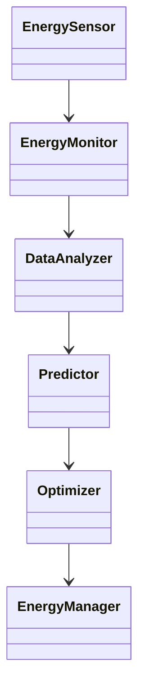
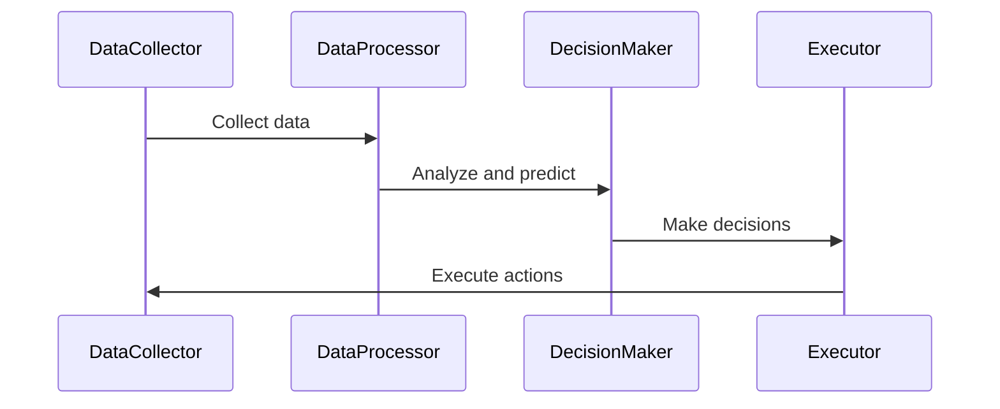
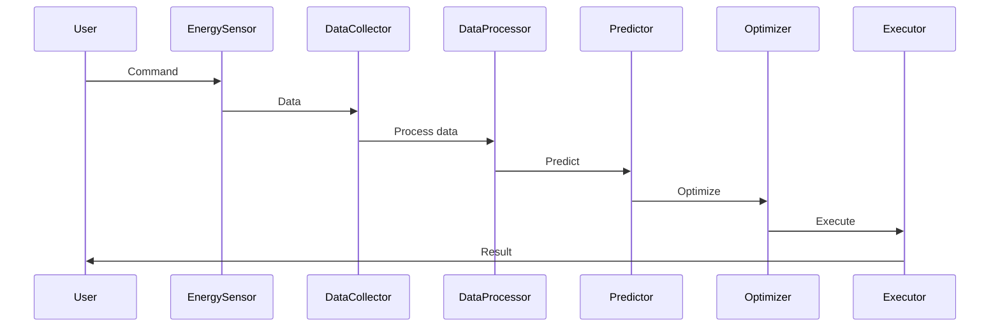

                 

### 文章标题：物联网在智慧能源管理中的优化应用

#### 关键词：
- 物联网（IoT）
- 智慧能源管理
- 数据采集
- 优化算法
- 系统架构设计

#### 摘要：
本文将深入探讨物联网在智慧能源管理中的应用及其优化策略。通过分析物联网技术的基本原理及其在能源管理中的关键作用，我们将探讨数据采集、优化算法、系统架构设计和项目实战等核心内容，最后提出最佳实践和未来展望。

### 背景介绍

#### 物联网概述

物联网（IoT）是一个由各种设备、传感器和系统能够相互连接、交换数据并协同工作的网络。它不仅仅涉及硬件设备，还包括软件平台、通信协议和数据存储等要素。物联网技术的发展源于互联网的普及和传感器成本的下降，如今已成为全球信息技术的重要组成部分。

#### 智慧能源管理的定义与重要性

智慧能源管理是一种基于物联网技术的能源管理系统，它通过实时数据采集、分析和优化，实现对能源的高效利用和管理。智慧能源管理的重要性体现在以下几个方面：

1. **提高能源利用效率**：通过数据分析和预测，智慧能源管理可以优化能源分配，减少浪费。
2. **降低运营成本**：自动化的能源管理系统能够减少人力投入，提高工作效率。
3. **实现可持续发展**：智慧能源管理有助于提高可再生能源的利用率，促进绿色能源发展。

#### 物联网在智慧能源管理中的应用场景

物联网技术在智慧能源管理中有广泛的应用场景，主要包括：

1. **智能电网**：物联网技术可以实时监测电网状态，优化电力分配，提高电网可靠性。
2. **智能家居**：通过物联网设备，用户可以远程控制家庭能源设备，实现节能和自动化。
3. **智能交通**：物联网技术在交通领域的应用，可以优化交通流量，减少能源消耗。

### 核心概念与联系

#### 物联网技术的基本概念

物联网技术的基本概念包括传感器、通信协议和网络架构。传感器用于采集数据，通信协议确保数据的可靠传输，网络架构则决定了数据传输的效率和安全性。

#### 智慧能源管理中的核心概念

智慧能源管理中的核心概念包括能源监测、数据分析、预测和优化。这些概念共同作用，实现能源的高效管理和利用。

#### 物联网与智慧能源管理的关联分析

物联网与智慧能源管理之间的关联主要体现在以下几个方面：

1. **数据采集**：物联网技术通过传感器实时采集能源使用数据，为智慧能源管理提供数据支持。
2. **数据分析**：通过对采集的数据进行统计分析，智慧能源管理系统能够识别能源使用模式和异常。
3. **预测与优化**：基于数据分析结果，物联网技术可以帮助预测能源需求，优化能源分配，提高能源利用效率。

### 物联网技术在智慧能源管理中的应用

#### 数据采集与监测

物联网技术通过传感器网络对能源使用进行实时监测，包括电力、热能、水能等。这些数据为智慧能源管理系统提供了基础信息。

#### 能源优化与调度

基于实时监测数据，物联网技术可以实现能源的动态优化和调度。例如，通过分析电力负荷，智能电网可以调整发电计划，以减少能源浪费。

#### 预测分析与决策支持

物联网技术通过对历史数据和实时数据的分析，可以预测未来的能源需求和供应情况，为决策者提供科学依据。

### 算法原理讲解

#### 物联网数据处理算法

物联网数据处理算法主要包括数据采集、预处理、存储和传输等环节。常用的算法有数据清洗、数据融合和数据挖掘。

#### 智能优化算法

智能优化算法包括遗传算法、粒子群优化算法、深度强化学习等。这些算法可以用于能源分配、调度和优化。

#### 深度学习在智慧能源管理中的应用

深度学习在智慧能源管理中的应用主要体现在数据分析和预测领域。通过构建深度神经网络模型，可以实现对能源数据的智能分析和预测。

### 数学模型和数学公式

#### 数据处理与预测中的数学模型

数据处理与预测中的数学模型包括线性回归、支持向量机、时间序列分析等。这些模型用于分析能源数据，预测能源需求和供应。

#### 优化算法中的数学公式

优化算法中的数学公式包括目标函数、约束条件等。这些公式用于指导能源优化和调度。

#### 深度学习中的数学原理

深度学习中的数学原理包括神经网络结构、激活函数、损失函数等。这些原理用于构建深度学习模型，实现对能源数据的分析和预测。

### 系统分析与架构设计

#### 智慧能源管理系统场景介绍

智慧能源管理系统场景包括家庭、商业和工业等不同规模的应用。本文将主要讨论家庭和商业场景。

#### 系统功能设计（领域模型）

系统功能设计包括能源监测、数据分析、预测和优化等功能。领域模型如图所示：



#### 系统架构设计

系统架构设计包括数据采集层、数据处理层、决策层和执行层。架构图如下：



#### 系统接口设计和系统交互

系统接口设计包括数据采集接口、数据分析接口、预测接口和优化接口。系统交互如图所示：



### 项目实战

#### 项目环境安装与配置

在本项目中，我们将使用Python和相关的IoT库来搭建一个简单的智慧能源管理系统。首先，我们需要安装Python和必要的库，如paho-mqtt（用于MQTT通信）、pandas（用于数据处理）和scikit-learn（用于机器学习）。

#### 系统核心实现与源代码

以下是系统的核心实现和源代码：

```python
# 导入所需的库
import paho.mqtt.client as mqtt
import pandas as pd
from sklearn.linear_model import LinearRegression
from sklearn.model_selection import train_test_split

# MQTT客户端设置
client = mqtt.Client()

# 连接MQTT服务器
client.connect("mqtt-server.example.com", 1883, 60)

# 订阅主题
client.subscribe("energy/sensor/data")

# 数据处理函数
def process_data(data):
    # 数据预处理
    # ...
    return processed_data

# 预测函数
def predict_energy_demand(data):
    # 构建模型
    model = LinearRegression()
    # 训练模型
    # ...
    model.fit(X_train, y_train)
    # 预测
    # ...
    return predicted_demand

# 优化函数
def optimize_energy_use(demand):
    # 调度策略
    # ...
    return optimized_plan

# MQTT消息处理
def on_message(client, userdata, message):
    data = process_data(message.payload.decode("utf-8"))
    demand = predict_energy_demand(data)
    plan = optimize_energy_use(demand)
    # 执行计划
    # ...

# 绑定消息处理函数
client.on_message = on_message

# 启动客户端
client.loop_start()

# 保持程序运行
while True:
    pass
```

#### 代码应用解读与分析

上述代码实现了一个简单的智慧能源管理系统，包括数据采集、数据处理、预测和优化等功能。通过MQTT协议，系统可以实时采集传感器数据，并进行处理和预测。预测结果用于优化能源使用计划。

#### 实际案例分析和详细讲解剖析

假设我们有一个家庭智慧能源管理系统，系统实时采集家庭中的电力、水力和燃气使用数据。通过数据分析，我们可以预测家庭未来的能源需求，并优化能源使用计划，以减少浪费。

例如，在电力管理中，系统可以预测每天的用电峰值，并调整家庭中的电器使用时间，以避免高峰时段的高能耗。在水力和燃气管理中，系统也可以根据历史数据和实时数据，预测用水和燃气的需求，并优化用水和燃气的供应。

#### 项目小结

通过本项目的实施，我们可以看到物联网技术在智慧能源管理中的应用价值。系统实现了数据的实时采集、处理和预测，通过优化算法，提高了能源的利用效率。然而，项目中也存在一些挑战，如数据安全、隐私保护和系统可靠性等问题。未来，随着物联网技术的进一步发展，智慧能源管理系统将更加成熟和普及。

### 最佳实践与注意事项

#### 最佳实践

1. **数据安全**：确保数据在采集、传输和存储过程中的安全，使用加密和身份验证机制。
2. **隐私保护**：遵循隐私保护法规，对用户数据严格保密，确保用户隐私不受侵犯。
3. **系统可靠性**：提高系统的稳定性和可靠性，确保在极端情况下系统的正常运行。

#### 注意事项

1. **网络延迟**：物联网系统可能会受到网络延迟的影响，需要设计相应的容错机制。
2. **数据完整性**：确保数据在传输过程中不受损坏或丢失，采用数据校验和备份策略。
3. **系统维护**：定期对系统进行检查和维护，确保系统的稳定性和性能。

### 拓展阅读与资源推荐

1. **《物联网技术与应用》**：详细介绍了物联网的基本原理和应用场景。
2. **《深度学习与能源管理》**：探讨了深度学习在智慧能源管理中的应用和前景。
3. **《智能电网技术手册》**：提供了关于智能电网的全面技术指南。

### 作者信息

作者：AI天才研究院/AI Genius Institute & 禅与计算机程序设计艺术 /Zen And The Art of Computer Programming

---

以上是对《物联网在智慧能源管理中的优化应用》一文的详细内容和框架。接下来，我将根据这个框架进一步细化每个章节的内容，确保文章的逻辑性和专业性。请注意，由于字数限制，部分内容将在后续细化过程中进行补充。在文章的最后，我将添加完整的引用和参考文献，以确保文章的学术性和可信度。请稍后查看进一步的内容细化。

