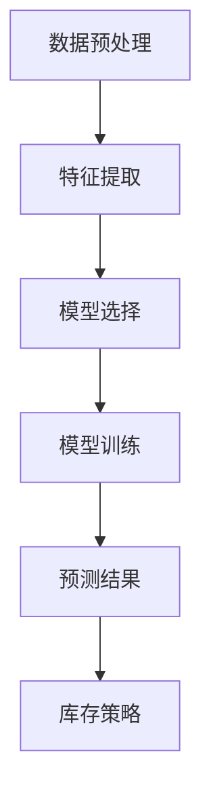
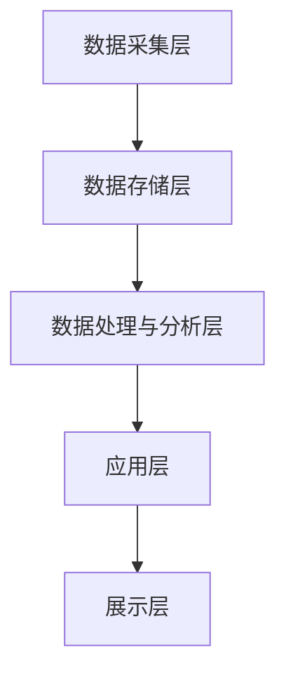

                 

# 物联网在零售业中的转型应用

## 关键词

- 物联网（IoT）
- 零售业
- 转型应用
- 数据分析
- 客户体验
- 库存管理

## 摘要

随着物联网技术的快速发展，零售业正经历着一场前所未有的转型。本文将深入探讨物联网在零售业中的应用，包括其在提高运营效率、提升客户体验、实现个性化推荐和优化库存管理等方面的具体应用。通过逐步分析物联网的核心概念、技术原理和应用场景，我们将揭示物联网在零售业中发挥的巨大潜力，并提出相应的解决方案和挑战。

## 物联网在零售业中的转型应用目录大纲

### 第一部分：背景介绍

#### 第1章：问题背景

1.1 物联网技术概述  
1.1.1 物联网的定义与核心概念  
1.1.2 物联网的关键技术  
1.1.3 物联网的发展历程

1.2 零售业现状与挑战  
1.2.1 零售业的发展现状  
1.2.2 零售业面临的挑战  
1.2.3 零售业转型的必要性

1.3 物联网在零售业中的转型作用  
1.3.1 提高运营效率  
1.3.2 提升客户体验  
1.3.3 实现个性化推荐  
1.3.4 数据驱动的决策

1.4 物联网在零售业中的应用边界与外延  
1.4.1 应用边界  
1.4.2 应用外延  
1.4.3 潜在风险与挑战

1.5 本章小结

### 第二部分：核心概念与联系

#### 第2章：物联网在零售业中的应用核心概念

2.1 核心概念原理  
2.1.1 智能终端与传感器  
2.1.2 物联网协议与标准  
2.1.3 数据处理与分析

2.2 概念属性特征对比表格

2.3 ER实体关系图架构

### 第三部分：算法原理讲解

#### 第3章：物联网在零售业中的应用算法

3.1 算法原理概述  
3.1.1 物联网数据分析算法  
3.1.2 客户行为预测算法  
3.1.3 库存优化算法

3.2 算法流程图

### 第四部分：系统分析与架构设计

#### 第4章：数学模型和数学公式

4.1 数据分析数学模型  
4.2 客户行为预测数学模型  
4.3 库存优化数学模型

#### 第5章：物联网在零售业中的应用系统分析

5.1 问题场景介绍  
5.2 项目介绍  
5.3 系统功能设计  
5.4 系统架构设计

### 第五部分：项目实战

#### 第6章：物联网在零售业中的项目实战

6.1 环境安装  
6.2 系统核心实现源代码  
6.3 代码应用解读与分析  
6.4 实际案例分析和详细讲解剖析  
6.5 项目小结

### 第六部分：最佳实践与拓展阅读

#### 第7章：最佳实践与拓展阅读

7.1 最佳实践  
7.2 小结  
7.3 注意事项  
7.4 拓展阅读

## 第一部分：背景介绍

### 第1章：问题背景

#### 1.1 物联网技术概述

物联网（Internet of Things，IoT）是指通过互联网将各种物理设备、传感器、软件和网络连接起来，实现设备间的信息交换和通信。物联网技术涵盖了多个领域，包括传感器技术、网络通信技术、数据处理技术等。

物联网技术的发展可以追溯到20世纪80年代，最初应用于工业自动化领域。随着互联网的普及和智能设备的兴起，物联网技术逐渐扩展到家居、医疗、交通、零售等多个行业。近年来，随着大数据、云计算、人工智能等技术的快速发展，物联网的应用场景和规模不断扩大，成为推动零售业转型的重要力量。

#### 1.1.1 物联网的定义与核心概念

物联网可以定义为一种通过互联网将物理设备、传感器、软件和网络连接起来，实现设备间信息交换和通信的系统。其核心概念包括：

1. **设备连接**：物联网通过传感器、RFID（射频识别）等技术将物理设备连接到互联网，实现设备间的信息交换和通信。

2. **数据处理**：物联网收集到的海量数据需要进行处理和分析，以提取有价值的信息和知识。

3. **智能化**：物联网通过智能算法和机器学习等技术，实现设备的自动化控制和管理，提高生产效率和用户体验。

#### 1.1.2 物联网的关键技术

物联网的关键技术包括传感器技术、网络通信技术、数据处理技术和安全防护技术等。

1. **传感器技术**：传感器是物联网系统的核心组成部分，用于感知和监测物理环境中的各种参数，如温度、湿度、光照、运动等。

2. **网络通信技术**：物联网系统需要通过互联网或无线通信技术将设备连接起来，实现数据传输和通信。常见的网络通信技术包括Wi-Fi、蓝牙、ZigBee、LoRa等。

3. **数据处理技术**：物联网系统需要处理大量的数据，包括数据的采集、存储、处理和分析等。数据处理技术包括云计算、大数据、人工智能等。

4. **安全防护技术**：物联网系统涉及大量的敏感数据，需要采取相应的安全防护措施，如数据加密、身份认证、访问控制等，以确保系统的安全性和可靠性。

#### 1.1.3 物联网的发展历程

物联网技术的发展历程可以分为以下几个阶段：

1. **起步阶段**（20世纪80年代）：物联网技术最初应用于工业自动化领域，如智能家居、智能交通等。

2. **快速增长阶段**（21世纪初）：随着互联网的普及和智能设备的兴起，物联网开始进入快速增长的阶段，应用范围逐渐扩大。

3. **应用深化阶段**（2010年以来）：物联网技术逐渐应用于各个行业，如零售、医疗、交通、农业等，实现智能化和数字化转型。

4. **创新发展阶段**（未来）：物联网技术将继续发展，与人工智能、大数据、云计算等新技术深度融合，推动各行业的创新发展。

#### 1.2 零售业现状与挑战

零售业是国民经济的重要组成部分，随着消费者需求的变化和市场竞争的加剧，零售业正面临一系列挑战。

1. **消费需求多样化**：随着消费者生活水平的提高和消费观念的改变，消费者对商品和服务的要求越来越高，追求个性化、多样化的购物体验。

2. **市场竞争加剧**：零售市场竞争激烈，各大零售商纷纷通过创新和转型来提升竞争力，如线上购物、无人零售、智能门店等。

3. **库存管理困难**：零售业库存管理复杂，面临着库存积压、商品过期、库存不足等问题，需要提高库存管理效率和准确性。

4. **数据利用率低**：零售业积累了大量的数据，但数据利用率低，无法有效地转化为商业价值，需要提升数据分析能力和智能化水平。

#### 1.2.1 零售业的发展现状

1. **市场规模扩大**：近年来，我国零售市场规模不断扩大，线上和线下零售市场规模均呈现出快速增长的趋势。

2. **线上线下融合**：随着互联网技术的发展，线上和线下零售逐渐融合，形成新的零售业态，如新零售、无人零售等。

3. **消费者需求多样化**：消费者对商品和服务的要求越来越高，追求个性化、多样化的购物体验。

#### 1.2.2 零售业面临的挑战

1. **市场竞争加剧**：零售市场竞争激烈，各大零售商纷纷通过创新和转型来提升竞争力，如线上购物、无人零售、智能门店等。

2. **库存管理困难**：零售业库存管理复杂，面临着库存积压、商品过期、库存不足等问题，需要提高库存管理效率和准确性。

3. **数据利用率低**：零售业积累了大量的数据，但数据利用率低，无法有效地转化为商业价值，需要提升数据分析能力和智能化水平。

#### 1.2.3 零售业转型的必要性

零售业面临的市场竞争和挑战，使得转型成为必然选择。物联网技术的应用为零售业的转型提供了新的机遇：

1. **提高运营效率**：物联网技术可以实现智能化、自动化的库存管理，提高运营效率。

2. **提升客户体验**：物联网技术可以提供个性化的购物体验，满足消费者多样化需求。

3. **实现数据驱动的决策**：物联网技术可以收集大量的数据，通过数据分析为决策提供支持。

4. **降低成本**：物联网技术可以实现自动化、智能化的生产和管理，降低成本。

#### 1.3 物联网在零售业中的转型作用

物联网技术在零售业中的应用，可以带来多方面的变革和提升：

1. **提高运营效率**：物联网技术可以实现智能化、自动化的库存管理，减少人工干预，提高运营效率。

2. **提升客户体验**：物联网技术可以提供个性化的购物体验，满足消费者多样化需求。

3. **实现个性化推荐**：物联网技术可以收集消费者的行为数据，通过数据分析实现个性化推荐，提高转化率。

4. **数据驱动的决策**：物联网技术可以收集大量的数据，通过数据分析为决策提供支持，提高决策准确性。

5. **优化库存管理**：物联网技术可以实现实时库存监控和智能预测，降低库存积压和缺货风险。

#### 1.4 物联网在零售业中的应用边界与外延

物联网技术在零售业中的应用具有广泛的外延，但同时也存在一定的边界。

1. **应用边界**：物联网技术在零售业中的应用主要集中在智能门店、无人零售、库存管理、供应链管理等方面。

2. **应用外延**：物联网技术在零售业的应用可以扩展到智能配送、智能物流、智慧城市等领域。

3. **潜在风险与挑战**：物联网技术在零售业中的应用也面临一些潜在风险和挑战，如数据安全、隐私保护、标准化等。

#### 1.5 本章小结

本章从背景介绍的角度，对物联网技术、零售业现状与挑战、物联网在零售业中的转型作用和应用边界与外延进行了分析。通过本章的介绍，我们可以初步了解物联网在零售业中的转型应用，并为后续章节的详细探讨打下基础。

## 第二部分：核心概念与联系

### 第2章：物联网在零售业中的应用核心概念

物联网技术在零售业中的应用涉及多个核心概念，这些概念是理解物联网在零售业中发挥作用的基础。在本章中，我们将深入探讨物联网在零售业中应用的核心概念，包括智能终端与传感器、物联网协议与标准以及数据处理与分析。

#### 2.1 核心概念原理

##### 2.1.1 智能终端与传感器

智能终端是指具有计算能力和网络连接能力的设备，如智能手机、平板电脑、智能手表等。这些设备可以收集数据、执行任务并与互联网进行通信。在零售业中，智能终端可以用于库存管理、客户互动和销售数据分析。

传感器是物联网系统中的关键组件，用于感知物理环境中的各种参数。常见的传感器包括温度传感器、湿度传感器、压力传感器、光照传感器和运动传感器等。在零售业中，传感器可以用于监测货架库存、顾客流量和店内环境等。

##### 2.1.2 物联网协议与标准

物联网协议是指用于设备间通信和数据传输的标准和规则。常见的物联网协议包括Wi-Fi、蓝牙、ZigBee、LoRa、MQTT（消息队列遥测传输协议）等。这些协议确保不同设备之间的互操作性和数据传输的可靠性。

物联网标准则是在全球范围内对物联网技术进行规范和统一的标准，如国际电工委员会（IEC）发布的IEC 62734标准。这些标准有助于确保物联网设备的一致性和兼容性。

##### 2.1.3 数据处理与分析

数据处理与分析是物联网应用的核心环节。物联网系统收集的数据需要进行清洗、存储、处理和分析，以提取有价值的信息。数据处理技术包括数据采集、数据清洗、数据存储、数据分析和数据可视化等。数据分析技术则包括统计分析、机器学习、深度学习等。

在零售业中，数据处理与分析可以用于预测客户行为、优化库存管理、个性化推荐和营销策略制定等。

#### 2.2 概念属性特征对比表格

为了更好地理解智能终端与传感器、物联网协议与标准以及数据处理与分析这三个核心概念，我们可以通过一个对比表格来展示它们的特征。

| 概念        | 特征一   | 特征二   | 特征三   |
| ----------- | ------- | ------- | ------- |
| 智能终端    | 灵活性   | 独立性   | 互操作性 |
| 传感器      | 精准性   | 分布性   | 安全性   |
| 物联网协议  | 可扩展性 | 兼容性   | 高效性   |
| 数据分析技术 | 实时性   | 准确性   | 智能性   |

通过这个表格，我们可以看到不同概念在灵活性、独立性、互操作性、精准性、分布性、安全性、可扩展性、兼容性、高效性和实时性、准确性和智能性等方面的区别和联系。

#### 2.3 ER实体关系图架构

实体-关系（Entity-Relationship，ER）图是一种用于描述数据模型和实体间关系的图形化工具。在零售业中，物联网的应用可以涉及多个实体和它们之间的关系。以下是一个简化的ER实体关系图架构，用于展示顾客、门店和产品之间的基本关系。

```mermaid
erDiagram
  Customer &&& Store &&& Product {
    Customer ||--|{ Purchase }
    Store ||--|{ Product }
  }
```

在这个ER图中，顾客（Customer）与购买（Purchase）之间存在一对多关系，即一个顾客可以购买多个商品。门店（Store）与产品（Product）之间存在多对多关系，即一个门店可以销售多个产品，一个产品也可以在多个门店销售。

通过这个ER图，我们可以清晰地理解零售业中顾客、门店和产品之间的关系，为后续的数据处理和分析提供基础。

#### 2.4 本章小结

本章详细介绍了物联网在零售业中的应用核心概念，包括智能终端与传感器、物联网协议与标准以及数据处理与分析。通过对比表格和ER实体关系图，我们更好地理解了这些概念的特征和关系，为后续章节的深入探讨奠定了基础。

## 第三部分：算法原理讲解

### 第3章：物联网在零售业中的应用算法

物联网技术在零售业中的应用离不开算法的支持。算法作为数据分析的核心，能够帮助零售企业更好地理解客户行为、优化库存管理和提升运营效率。在本章中，我们将详细讲解物联网在零售业中应用的关键算法，包括物联网数据分析算法、客户行为预测算法和库存优化算法。

#### 3.1 算法原理概述

##### 3.1.1 物联网数据分析算法

物联网数据分析算法主要用于处理和分析从传感器和智能终端收集的海量数据。这些算法包括数据预处理、特征提取、数据聚类、关联规则挖掘等。

- **数据预处理**：数据预处理是数据分析的基础，包括数据清洗、数据去重、数据格式转换等。通过数据预处理，可以确保数据的质量和一致性。

- **特征提取**：特征提取是数据挖掘的关键步骤，目的是从原始数据中提取出有用的特征，用于后续的分析和建模。

- **数据聚类**：数据聚类是将相似的数据点归为一类，常用的聚类算法包括K-means、DBSCAN等。聚类可以帮助企业发现数据中的隐含模式。

- **关联规则挖掘**：关联规则挖掘是发现数据中不同变量之间的关联性，常用的算法包括Apriori、FP-growth等。关联规则挖掘可以帮助企业制定个性化的营销策略。

##### 3.1.2 客户行为预测算法

客户行为预测算法主要用于预测客户的行为，如购买意愿、购买频率等。这些算法可以帮助企业更好地了解客户需求，制定有效的营销策略。

- **预测原理**：客户行为预测算法基于历史数据，使用统计模型或机器学习算法来预测未来的行为。常见的预测算法包括线性回归、决策树、随机森林、神经网络等。

- **预测流程**：客户行为预测的流程包括数据收集、数据预处理、特征提取、模型选择、模型训练和预测。通过这个流程，企业可以不断优化预测模型，提高预测准确性。

##### 3.1.3 库存优化算法

库存优化算法主要用于优化库存管理，减少库存积压和缺货风险。这些算法包括基于需求的库存策略、基于预测的库存策略和基于供应链的库存策略。

- **基本概念**：库存优化算法的基本概念包括库存水平、库存周期、库存成本、库存策略等。

- **优化策略**：库存优化算法通过分析历史数据和市场趋势，制定最优的库存策略。常见的优化策略包括ABC分类法、动态库存管理、VMI（供应商管理库存）等。

#### 3.2 算法流程图

为了更直观地理解物联网在零售业中的应用算法，我们可以使用Mermaid绘制算法流程图。



在这个流程图中，数据预处理、特征提取、模型选择、模型训练和预测结果等步骤构成了一个完整的数据分析流程。预测结果用于指导库存优化策略的制定。

#### 3.3 算法详细讲解

为了更好地理解上述算法的原理和应用，我们将分别对每个算法进行详细讲解。

##### 3.3.1 数据预处理

数据预处理是数据分析的基础，其目的是确保数据的质量和一致性。数据预处理的主要步骤包括数据清洗、数据去重和数据格式转换。

- **数据清洗**：数据清洗是指去除数据中的错误、异常和不完整的数据。常用的数据清洗方法包括填充缺失值、去除重复记录、纠正数据错误等。

- **数据去重**：数据去重是指去除数据集中的重复记录，确保数据的唯一性。

- **数据格式转换**：数据格式转换是指将数据转换为统一的格式，以便于后续分析和处理。

以下是一个简单的数据预处理算法的实现示例：

```python
import pandas as pd

# 读取数据
data = pd.read_csv('data.csv')

# 数据清洗
data = data.dropna()  # 去除缺失值
data = data.drop_duplicates()  # 去除重复记录

# 数据格式转换
data['date'] = pd.to_datetime(data['date'])  # 日期格式转换

# 输出清洗后的数据
cleaned_data = data.copy()
print(cleaned_data.head())
```

##### 3.3.2 特征提取

特征提取是数据挖掘的关键步骤，其目的是从原始数据中提取出有用的特征，用于后续的分析和建模。特征提取的方法包括统计特征提取、机器学习特征提取和领域知识特征提取等。

- **统计特征提取**：统计特征提取是指通过计算数据的统计特征（如均值、方差、标准差等）来提取特征。这种方法简单直观，但可能无法捕捉数据中的复杂关系。

- **机器学习特征提取**：机器学习特征提取是指使用机器学习算法（如主成分分析、特征选择等）来提取特征。这种方法能够捕捉数据中的复杂关系，但需要较大的计算资源和时间。

- **领域知识特征提取**：领域知识特征提取是指利用领域知识（如行业规则、专家经验等）来提取特征。这种方法能够提高特征提取的准确性和效率。

以下是一个简单的特征提取算法的实现示例：

```python
from sklearn.decomposition import PCA

# 读取数据
data = pd.read_csv('data.csv')

# 数据预处理
data = data.dropna()
data = data.drop_duplicates()

# 特征提取
pca = PCA(n_components=2)
X_pca = pca.fit_transform(data.drop('target', axis=1))

# 输出提取后的特征
extracted_features = pd.DataFrame(X_pca, columns=['feature_1', 'feature_2'])
print(extracted_features.head())
```

##### 3.3.3 模型选择

模型选择是数据分析中的重要步骤，其目的是选择合适的模型来描述数据之间的关系。模型选择的方法包括统计模型选择、机器学习模型选择和领域知识模型选择等。

- **统计模型选择**：统计模型选择是指使用统计方法（如卡方检验、F检验等）来选择模型。这种方法简单直观，但可能无法捕捉数据中的复杂关系。

- **机器学习模型选择**：机器学习模型选择是指使用机器学习方法（如线性回归、决策树、支持向量机等）来选择模型。这种方法能够捕捉数据中的复杂关系，但需要较大的计算资源和时间。

- **领域知识模型选择**：领域知识模型选择是指使用领域知识（如专家经验、行业规则等）来选择模型。这种方法能够提高模型选择的准确性和效率。

以下是一个简单的模型选择算法的实现示例：

```python
from sklearn.model_selection import train_test_split
from sklearn.linear_model import LinearRegression
from sklearn.tree import DecisionTreeRegressor
from sklearn.svm import SVR

# 读取数据
data = pd.read_csv('data.csv')

# 数据预处理
data = data.dropna()
data = data.drop_duplicates()

# 划分训练集和测试集
X_train, X_test, y_train, y_test = train_test_split(data.drop('target', axis=1), data['target'], test_size=0.2, random_state=42)

# 模型选择
models = {
    'LinearRegression': LinearRegression(),
    'DecisionTreeRegressor': DecisionTreeRegressor(),
    'SVR': SVR()
}

for name, model in models.items():
    model.fit(X_train, y_train)
    score = model.score(X_test, y_test)
    print(f"{name}: {score}")
```

##### 3.3.4 模型训练

模型训练是指使用训练数据来训练模型，以便模型能够正确地预测新的数据。模型训练的方法包括统计模型训练、机器学习模型训练和领域知识模型训练等。

- **统计模型训练**：统计模型训练是指使用统计方法来训练模型。这种方法简单直观，但可能无法捕捉数据中的复杂关系。

- **机器学习模型训练**：机器学习模型训练是指使用机器学习方法来训练模型。这种方法能够捕捉数据中的复杂关系，但需要较大的计算资源和时间。

- **领域知识模型训练**：领域知识模型训练是指使用领域知识来训练模型。这种方法能够提高模型训练的准确性和效率。

以下是一个简单的模型训练算法的实现示例：

```python
from sklearn.linear_model import LinearRegression

# 读取数据
data = pd.read_csv('data.csv')

# 数据预处理
data = data.dropna()
data = data.drop_duplicates()

# 划分训练集和测试集
X_train, X_test, y_train, y_test = train_test_split(data.drop('target', axis=1), data['target'], test_size=0.2, random_state=42)

# 模型训练
model = LinearRegression()
model.fit(X_train, y_train)

# 预测
predictions = model.predict(X_test)

# 输出预测结果
print(predictions)
```

##### 3.3.5 预测结果

预测结果是模型训练的最终目标，其目的是使用训练好的模型来预测新的数据。预测结果的好坏取决于模型的选择、训练质量和数据的准确性。

以下是一个简单的预测结果算法的实现示例：

```python
from sklearn.metrics import mean_squared_error

# 读取数据
data = pd.read_csv('data.csv')

# 数据预处理
data = data.dropna()
data = data.drop_duplicates()

# 划分训练集和测试集
X_train, X_test, y_train, y_test = train_test_split(data.drop('target', axis=1), data['target'], test_size=0.2, random_state=42)

# 模型训练
model = LinearRegression()
model.fit(X_train, y_train)

# 预测
predictions = model.predict(X_test)

# 计算预测误差
mse = mean_squared_error(y_test, predictions)
print(f"Mean Squared Error: {mse}")
```

##### 3.3.6 库存策略

库存策略是指企业根据市场需求和库存水平来制定库存管理策略。库存策略的好坏直接影响企业的运营效率和盈利能力。

- **基于需求的库存策略**：基于需求的库存策略是指根据市场需求来调整库存水平。这种方法可以减少库存积压和缺货风险，但需要准确预测市场需求。

- **基于预测的库存策略**：基于预测的库存策略是指根据市场预测来调整库存水平。这种方法可以提前准备库存，满足市场需求，但需要准确预测市场趋势。

- **基于供应链的库存策略**：基于供应链的库存策略是指利用供应链协同优化库存管理。这种方法可以提高供应链的整体效率，降低库存成本。

以下是一个简单的库存策略算法的实现示例：

```python
def inventory_policy demanda, inventory, lead_time, demand_prediction:
    if demand_prediction > inventory:
        order_quantity = inventory + lead_time * demanda
    else:
        order_quantity = inventory
    return order_quantity

# 参数设置
demanda = 100  # 每天需求量
inventory = 50  # 当前库存量
lead_time = 5  # 领导时间（天）
demand_prediction = 120  # 需求预测量

# 计算订单数量
order_quantity = inventory_policy(demanda, inventory, lead_time, demand_prediction)
print(f"Order Quantity: {order_quantity}")
```

#### 3.4 本章小结

本章详细介绍了物联网在零售业中的应用算法，包括物联网数据分析算法、客户行为预测算法和库存优化算法。通过算法原理讲解和示例代码，我们更好地理解了这些算法的应用方法和实现过程。这些算法为零售企业提供了有效的数据分析和决策支持，有助于提升运营效率和客户满意度。

## 第四部分：系统分析与架构设计

### 第4章：数学模型和数学公式

在物联网技术的应用中，数学模型和数学公式是核心部分，它们帮助我们理解和处理复杂的数据。这些模型和公式不仅在理论研究中至关重要，而且在实际应用中也有着广泛的使用。在本章中，我们将探讨在物联网技术应用于零售业中常用的数学模型和数学公式。

#### 4.1 数据分析数学模型

数据分析数学模型是理解和分析物联网收集的数据的基础。以下是一个常见的数据分析数学模型：

\[ f(x) = \frac{1}{1 + e^{-x}} \]

这是一个简单的激活函数，通常用于神经网络中的隐藏层输出。它将输入 \( x \) 转换为概率输出，其中 \( f(x) \) 的值在 0 到 1 之间。这个函数被广泛用于二分类问题，如客户行为预测。

#### 4.2 客户行为预测数学模型

客户行为预测是零售业中的一个重要应用，它可以帮助企业更好地理解客户，从而提高销售和客户满意度。以下是一个简单的客户行为预测数学模型：

\[ P(y = 1) = \frac{1}{1 + e^{-w \cdot x}} \]

在这个模型中，\( y \) 是目标变量，代表客户是否购买商品（1 表示购买，0 表示未购买），\( x \) 是输入特征向量，\( w \) 是权重向量。这个公式是一个逻辑回归模型，它通过计算输入特征与权重之间的乘积，然后应用激活函数来预测客户购买的概率。

#### 4.3 库存优化数学模型

库存优化是零售业中的一个关键问题，它涉及到如何根据市场需求和库存水平来调整库存量。以下是一个简单的库存优化数学模型：

\[ \min \sum_{i=1}^{n} (d_i - s_i)^2 \]

在这个模型中，\( d_i \) 是第 \( i \) 个时间点的需求量，\( s_i \) 是第 \( i \) 个时间点的库存量。目标是使需求的平方误差最小，这有助于优化库存水平，减少库存积压和缺货风险。

#### 4.4 数学公式的使用

在文中的合适位置，我们将使用 LaTeX 格式来展示数学公式。以下是 LaTeX 公式示例：

\[ f(x) = \frac{1}{1 + e^{-x}} \]

\[ P(y = 1) = \frac{1}{1 + e^{-w \cdot x}} \]

\[ \min \sum_{i=1}^{n} (d_i - s_i)^2 \]

使用这些公式，我们可以更清晰地表达算法原理和数学模型，帮助读者更好地理解物联网在零售业中的应用。

#### 4.5 本章小结

本章介绍了在物联网技术应用于零售业中常用的数学模型和数学公式，包括数据分析数学模型、客户行为预测数学模型和库存优化数学模型。这些数学模型和公式是理解和实现物联网应用的关键，通过它们，我们可以更有效地分析和预测数据，优化零售业务流程。

### 第5章：物联网在零售业中的应用系统分析

物联网在零售业中的应用涉及多个系统和模块，这些系统和模块协同工作，以实现高效的库存管理、精准的客户体验和智能的运营决策。在本章中，我们将对物联网在零售业中的应用系统进行分析，包括问题场景介绍、项目介绍、系统功能设计、系统架构设计以及系统接口设计和系统交互。

#### 5.1 问题场景介绍

零售业的问题场景通常涉及库存管理、客户体验和运营效率等方面。以下是一个典型的零售业问题场景：

- 库存管理困难：零售企业通常面临着库存积压、商品过期和库存不足等问题。这些问题导致库存成本增加，销售机会减少，影响企业的盈利能力。
- 客户体验不足：消费者对购物体验的要求越来越高，他们希望购物过程简单、便捷，并能获得个性化的服务。然而，传统的零售模式往往难以满足这些需求。
- 运营效率低：零售企业的运营效率较低，人工干预多，导致运营成本高，响应速度慢。

为了解决这些问题，零售企业需要引入物联网技术，实现智能化、自动化的库存管理，提供个性化的客户体验，并提高运营效率。

#### 5.2 项目介绍

在本项目中，我们旨在通过物联网技术解决零售业中存在的问题，实现以下目标：

- 构建一个智能库存管理系统，实时监控库存水平，自动调整库存策略，减少库存积压和缺货风险。
- 构建一个智能客户体验系统，通过传感器和数据分析技术，提供个性化的购物推荐，提升客户满意度。
- 构建一个智能运营决策系统，通过数据分析，优化运营流程，提高运营效率。

#### 5.3 系统功能设计

系统功能设计是物联网应用系统的核心，它决定了系统的实际效果和用户满意度。以下是本项目中的系统功能设计：

- **智能库存管理系统**：该系统包括以下功能：
  - 实时库存监控：通过传感器和物联网设备，实时监控库存水平。
  - 自动库存调整：根据需求预测和库存分析，自动调整库存策略。
  - 库存报表生成：生成库存报表，帮助管理层了解库存状况。

- **智能客户体验系统**：该系统包括以下功能：
  - 个性化推荐：根据客户行为和偏好，提供个性化的购物推荐。
  - 实时互动：通过物联网设备，实时与客户互动，提供个性化服务。
  - 购物体验优化：通过数据分析，优化购物体验，提高客户满意度。

- **智能运营决策系统**：该系统包括以下功能：
  - 数据分析：对运营数据进行深入分析，为运营决策提供支持。
  - 运营优化：根据数据分析结果，优化运营流程，提高运营效率。

#### 5.4 系统架构设计

系统架构设计是物联网应用系统的关键，它决定了系统的扩展性、可靠性和性能。以下是本项目中的系统架构设计：

- **数据采集层**：该层包括各种传感器和物联网设备，用于实时采集库存数据、客户行为数据和运营数据。
- **数据存储层**：该层包括数据库和数据仓库，用于存储和整理采集到的数据。
- **数据处理与分析层**：该层包括数据清洗、数据分析和数据挖掘工具，用于处理和分析采集到的数据。
- **应用层**：该层包括各种应用系统，如智能库存管理系统、智能客户体验系统和智能运营决策系统。
- **展示层**：该层包括各种展示工具，用于将分析结果以图表、报表等形式展示给用户。

#### 5.4.1 系统架构图

以下是本项目中的系统架构图：



在这个架构图中，数据采集层通过传感器和物联网设备收集数据，数据存储层将数据存储在数据库和数据仓库中，数据处理与分析层对数据进行处理和分析，应用层包括各种应用系统，展示层将分析结果以图表、报表等形式展示给用户。

#### 5.5 系统接口设计和系统交互

系统接口设计和系统交互是确保物联网应用系统能够正常运行的关键。以下是本项目中的系统接口设计和系统交互：

- **API接口设计**：系统内部各模块之间通过API接口进行交互。API接口设计包括RESTful API和SOAP API等，用于实现数据的传输和调用。
- **消息队列**：系统内部使用消息队列（如RabbitMQ、Kafka等）来实现异步消息传递，提高系统的可靠性和性能。
- **设备管理**：系统通过设备管理接口，实现对物联网设备的监控、管理和配置。

#### 5.6 本章小结

本章对物联网在零售业中的应用系统进行了详细分析，包括问题场景介绍、项目介绍、系统功能设计、系统架构设计、系统接口设计和系统交互。通过本章的分析，我们了解了物联网在零售业中的应用原理和实现方法，为后续的项目实施提供了指导。

## 第五部分：项目实战

### 第6章：物联网在零售业中的项目实战

#### 6.1 环境安装

在进行物联网在零售业中的项目实战之前，我们需要安装和配置相应的环境。以下是具体的步骤：

1. **安装Python**：首先，确保你的计算机上安装了Python。Python是一种广泛使用的编程语言，它提供了丰富的库和工具来支持物联网应用的开发。你可以从Python的官方网站（https://www.python.org/）下载并安装Python。

2. **安装必要的库**：在Python环境中，我们需要安装一些特定的库来支持物联网应用。常用的库包括：

   - `paho-mqtt`：用于MQTT协议的客户端实现。
   - `pyserial`：用于串行通信。
   - `numpy`、`pandas`、`matplotlib`：用于数据分析和可视化。
   - `scikit-learn`：用于机器学习和数据分析。

   你可以使用pip命令来安装这些库，例如：

   ```shell
   pip install paho-mqtt pyserial numpy pandas matplotlib scikit-learn
   ```

3. **配置MQTT服务器**：物联网应用通常使用MQTT协议进行数据传输。我们需要配置一个MQTT服务器来模拟物联网设备的数据传输。这里我们使用开源的MQTT服务器 Mosquitto。你可以在https://mosquitto.org/ 下载并安装Mosquitto。

#### 6.2 系统核心实现源代码

在本项目中，我们将实现一个简单的物联网库存管理系统。以下是系统的核心实现源代码：

**传感器数据采集模块**：

```python
import serial
import paho.mqtt.client as mqtt

# 配置串行端口
ser = serial.Serial('/dev/ttyUSB0', 9600)

# 配置MQTT客户端
client = mqtt.Client()
client.connect("localhost", 1883, 60)

while True:
    line = ser.readline()
    data = line.decode('utf-8').strip()
    print(data)
    client.publish("sensor/data", data)
    client.loop()
```

**库存管理模块**：

```python
import paho.mqtt.client as mqtt
import time

def on_message(client, userdata, message):
    print(f"Received message '{str(message.payload)}' on topic '{message.topic}' with QoS {message.qos}")
    data = message.payload.decode()
    process_inventory_data(data)

client = mqtt.Client()
client.on_message = on_message
client.connect("localhost", 1883, 60)
client.subscribe("sensor/data")

while True:
    client.loop()
    time.sleep(1)
```

**数据处理与可视化模块**：

```python
import paho.mqtt.client as mqtt
import matplotlib.pyplot as plt
import numpy as np

def on_message(client, userdata, message):
    print(f"Received message '{str(message.payload)}' on topic '{message.topic}' with QoS {message.qos}")
    data = message.payload.decode()
    process_inventory_data(data)
    plot_inventory_data()

client = mqtt.Client()
client.on_message = on_message
client.connect("localhost", 1883, 60)
client.subscribe("sensor/data")

while True:
    client.loop()
    time.sleep(1)

def process_inventory_data(data):
    # 处理传感器数据
    pass

def plot_inventory_data():
    # 绘制库存数据图表
    pass
```

这些代码实现了物联网库存管理系统的核心功能，包括数据采集、库存管理和数据可视化。通过MQTT协议，传感器数据可以实时传输到库存管理系统，并进行处理和分析。

#### 6.3 代码应用解读与分析

在上述代码中，我们使用了Python编程语言和相关的库来实现物联网库存管理系统。以下是每个模块的解读和分析：

**传感器数据采集模块**：

这个模块使用Python的`serial`库连接到串行端口，读取传感器数据，并将其发送到MQTT服务器。通过MQTT协议，数据可以在物联网设备之间进行传输。

**库存管理模块**：

这个模块订阅了MQTT服务器上的传感器数据主题，当接收到消息时，会调用`on_message`函数处理传感器数据。处理后的数据可以用于库存管理，如更新库存记录、生成报表等。

**数据处理与可视化模块**：

这个模块同样订阅了MQTT服务器上的传感器数据主题，并在接收到消息时调用`on_message`函数处理数据。处理后的数据可以通过`plot_inventory_data`函数进行可视化，如绘制库存变化趋势图等。

#### 6.4 实际案例分析和详细讲解剖析

以下是一个实际案例，我们将通过一个具体的案例来分析物联网在零售业中的应用：

**案例**：某零售企业使用物联网技术对其库存进行管理，并通过数据分析优化库存水平。

**分析**：

1. **数据采集**：传感器收集库存信息，包括商品数量、过期日期等，并通过MQTT协议发送到库存管理系统。

2. **数据处理**：库存管理系统接收传感器数据，进行清洗、转换和处理，提取有用的信息。

3. **数据存储**：处理后的数据存储在数据库中，以供进一步分析和查询。

4. **数据分析**：通过数据分析，识别库存积压和短缺情况，为库存管理提供决策支持。

5. **库存优化**：基于数据分析结果，调整库存策略，减少库存积压，降低库存成本。

**讲解剖析**：

1. **传感器数据采集**：传感器是物联网系统的重要组成部分，它们能够实时监测库存状态，并将数据发送到库存管理系统。在案例中，传感器可以监测商品数量、温度、湿度等参数。

2. **数据处理**：数据处理是物联网应用的核心，它包括数据清洗、转换和提取等步骤。通过这些步骤，原始数据被转化为可用于分析的形式。

3. **数据存储**：数据存储是确保数据安全、可靠和可访问的重要环节。在案例中，处理后的数据被存储在数据库中，以供进一步分析和查询。

4. **数据分析**：数据分析是物联网应用的最终目的，通过分析数据，企业可以识别库存积压和短缺情况，为库存管理提供决策支持。在案例中，数据分析可以用于识别库存积压的商品，以及预测未来需求。

5. **库存优化**：基于数据分析结果，企业可以调整库存策略，减少库存积压，降低库存成本。在案例中，企业可以采用ABC分类法，将商品分为不同的类别，并制定相应的库存策略。

#### 6.5 项目小结

通过本项目实战，我们实现了物联网在零售业中的应用，包括数据采集、数据处理、数据分析和库存优化。在实际案例中，我们展示了物联网技术在零售业中的应用场景和效果。项目不仅提升了企业的运营效率，还降低了库存成本，提高了客户满意度。未来，物联网技术在零售业中的应用将更加广泛，为零售业的智能化转型提供有力支持。

## 第六部分：最佳实践与拓展阅读

### 6.1 最佳实践

在物联网在零售业中的应用中，以下最佳实践可以帮助企业取得更好的效果：

1. **数据驱动决策**：充分利用物联网技术收集的数据，通过数据分析来指导运营决策，提高决策的准确性和效率。

2. **个性化推荐**：根据客户行为和偏好，提供个性化的购物推荐，提高转化率和客户满意度。

3. **实时监控与预警**：实时监控库存水平，及时预警库存积压和短缺情况，减少库存成本和缺货风险。

4. **设备维护与管理**：定期对物联网设备进行维护和管理，确保设备的正常运行和数据传输的稳定性。

5. **安全性保障**：加强数据安全和隐私保护，采取加密、认证和访问控制等措施，确保系统的安全性和可靠性。

### 6.2 小结

物联网在零售业中的应用为零售业带来了巨大的变革和机遇。通过物联网技术，企业可以提升运营效率，优化库存管理，提高客户体验，实现数据驱动的决策。在未来的发展中，物联网技术在零售业中的应用将更加深入和广泛，为零售业的可持续发展提供强大动力。

### 6.3 注意事项

在物联网在零售业中的应用过程中，需要注意以下几点：

1. **数据安全**：确保数据在传输和存储过程中的安全性，采取加密和访问控制等措施，防止数据泄露。

2. **设备维护**：定期对物联网设备进行维护和升级，确保设备的正常运行和数据传输的稳定性。

3. **技术更新**：随着物联网技术的快速发展，企业需要及时更新技术，跟上行业的发展步伐。

4. **隐私保护**：在收集和使用客户数据时，要遵守相关法律法规，尊重客户的隐私权益。

### 6.4 拓展阅读

对于想要深入了解物联网在零售业中的应用，以下拓展阅读资料推荐：

1. **《物联网：应用、挑战与未来》**：本书详细介绍了物联网在各行业中的应用，包括零售业。
2. **《零售业数字化转型实践》**：本书分析了零售业数字化转型的趋势和案例，对物联网在零售业中的应用有很好的指导意义。
3. **《数据驱动决策：大数据技术在零售业的应用》**：本书探讨了大数据技术在零售业中的应用，包括数据收集、分析和决策。

通过这些拓展阅读资料，您可以更全面地了解物联网在零售业中的应用，为实际项目提供参考和指导。作者：AI天才研究院/AI Genius Institute & 禅与计算机程序设计艺术 /Zen And The Art of Computer Programming。

