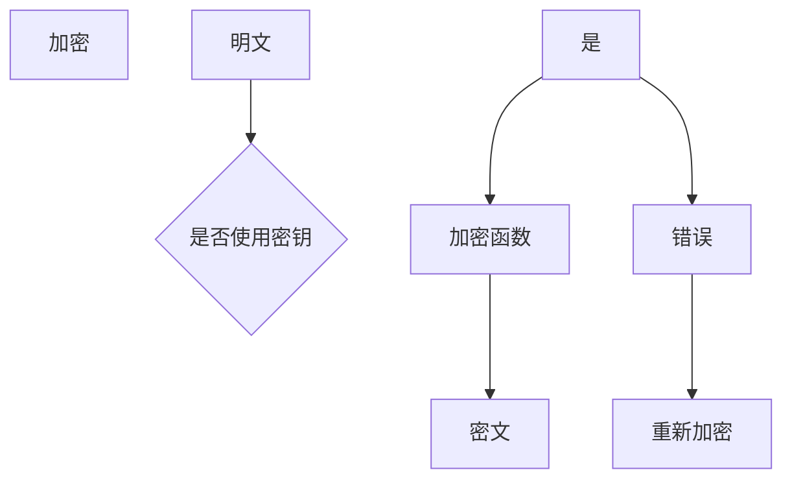
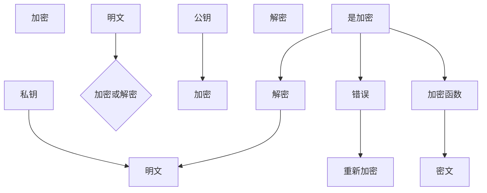
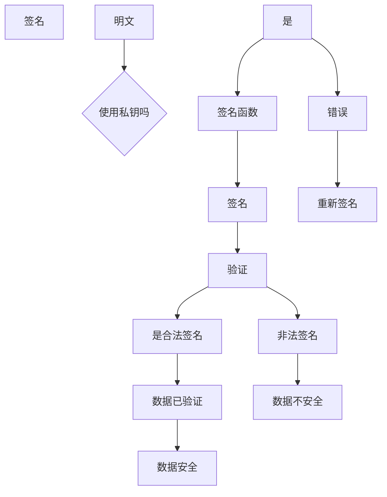
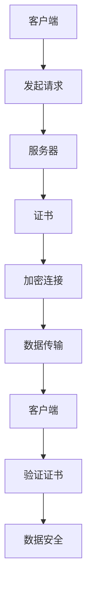
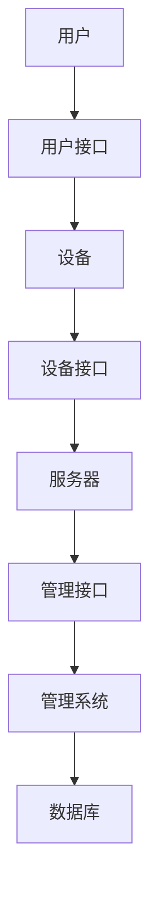
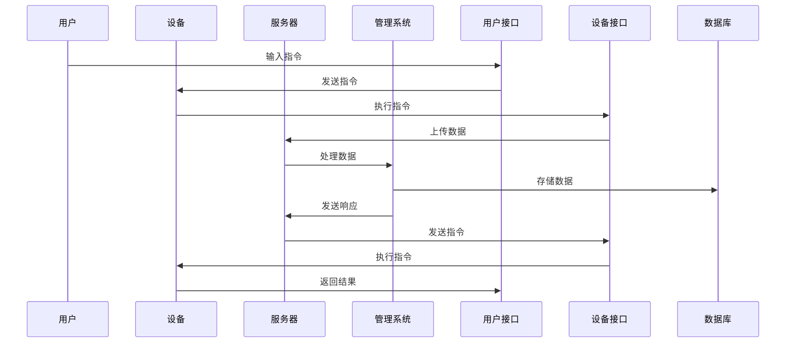

                 


# 物联网设备安全性与隐私保护

## 关键词
- 物联网设备
- 安全性
- 隐私保护
- 算法
- 系统架构
- 最佳实践

## 摘要
物联网设备广泛应用于现代生活中，但随之而来的安全性和隐私保护问题日益凸显。本文旨在探讨物联网设备安全性与隐私保护的现状、核心概念、算法原理、系统分析与架构设计，并通过具体项目实战，提供实用的最佳实践和总结。本文分为六个部分，首先介绍物联网设备安全性与隐私保护的重要性，然后解释相关核心概念，详细讲解安全算法和隐私保护算法，分析系统需求与架构，展示项目实战案例，并最终总结最佳实践和注意事项。

## 1. 背景介绍

### 1.1 物联网设备安全性与隐私保护的重要性

随着物联网（IoT）技术的迅猛发展，各种智能设备不断涌入我们的日常生活。从智能家居、智能交通、工业自动化到医疗健康，物联网设备无处不在。然而，这一趋势的背后也带来了新的安全性和隐私保护挑战。

**安全性问题：**
- **设备容易被入侵**：物联网设备通常具有有限的计算能力和存储资源，使得它们更容易受到恶意攻击，如DDoS攻击、设备劫持等。
- **数据泄露风险**：物联网设备不断收集用户数据，包括个人信息、行为习惯等，如果保护不当，这些数据可能会被非法获取，导致严重后果。
- **供应链风险**：物联网设备的生产、运输和部署过程中，可能存在安全漏洞，导致设备在出厂时就已受到影响。

**隐私保护问题：**
- **个人隐私泄露**：物联网设备收集的用户数据可能涉及敏感信息，如位置、健康状态、财务信息等，这些数据泄露将严重侵犯个人隐私。
- **隐私政策不透明**：许多物联网设备制造商在隐私政策方面存在不透明问题，用户无法清楚地了解设备如何使用其数据。

### 1.2 物联网设备安全性与隐私保护的现状

目前，物联网设备安全性与隐私保护已引起广泛关注。政府和业界都在积极采取措施：

- **标准与法规**：各国纷纷制定相关标准与法规，以规范物联网设备的安全性与隐私保护。例如，欧盟的《通用数据保护条例》（GDPR）对数据隐私保护提出了严格的要求。
- **安全技术研究**：学术界和产业界都在进行深入的安全技术研究，以提升物联网设备的安全性。例如，区块链、加密技术、多方安全计算等新兴技术被广泛应用于物联网安全领域。
- **安全产品与服务**：安全产品与服务供应商也在提供各种安全解决方案，包括安全芯片、安全操作系统、安全网关等。

### 1.3 物联网设备安全性与隐私保护面临的挑战

尽管已有诸多措施，物联网设备安全性与隐私保护仍面临诸多挑战：

- **复杂性**：物联网设备种类繁多，涉及到硬件、软件、网络等多个层面，使得安全性设计变得极为复杂。
- **资源限制**：物联网设备通常具有有限的计算和存储资源，传统的安全措施可能无法在这些设备上有效实施。
- **协作与兼容性**：物联网设备通常需要与其他设备和服务协同工作，如何确保这些设备之间的安全性和兼容性是一大挑战。
- **用户意识**：用户对物联网设备安全性和隐私保护的认知不足，可能不会采取必要的安全措施，从而增加安全风险。

## 2. 核心概念与联系

### 2.1 物联网设备安全核心概念

#### 2.1.1 安全机制

安全机制是确保物联网设备安全性的基本手段，主要包括以下几种：

- **身份验证**：通过验证用户的身份来确保只有授权用户才能访问设备或数据。
- **访问控制**：通过设置访问权限来限制未授权用户对设备或数据的访问。
- **数据加密**：通过加密技术对数据进行保护，确保数据在传输和存储过程中不被非法获取。
- **审计与监控**：记录和监控设备或网络的活动，以便在发生安全事件时进行追踪和响应。

#### 2.1.2 隐私策略

隐私策略是保护用户隐私的基本手段，主要包括以下几种：

- **数据匿名化**：通过去除或伪装个人标识信息，使数据无法直接关联到特定用户。
- **隐私政策设计**：制定明确的隐私政策，告知用户设备如何收集、使用和共享数据。
- **用户隐私权利保护**：确保用户有权了解其数据的使用情况，并能够对其数据的使用进行控制。

### 2.2 隐私策略

隐私策略是物联网设备隐私保护的重要组成部分，主要包括以下几种：

- **数据匿名化**：通过去除或伪装个人标识信息，使数据无法直接关联到特定用户。
- **隐私政策设计**：制定明确的隐私政策，告知用户设备如何收集、使用和共享数据。
- **用户隐私权利保护**：确保用户有权了解其数据的使用情况，并能够对其数据的使用进行控制。

### 2.3 核心概念之间的关系

物联网设备安全性与隐私保护的核心概念之间存在着密切的联系：

- **安全性**是隐私保护的基础，没有安全性，隐私保护无从谈起。
- **隐私策略**是安全性的一部分，用于确保用户数据的隐私。
- **安全机制**是实现安全性和隐私策略的具体手段。

## 3. 算法原理讲解

### 3.1 安全算法原理

#### 3.1.1 密码学基础

密码学是确保数据安全传输和存储的基础。主要分为对称加密和非对称加密。

- **对称加密**：加密和解密使用相同的密钥，如AES（Advanced Encryption Standard）。
  - **原理**：加密过程是将明文数据通过密钥转换为密文，解密过程是将密文通过相同的密钥转换回明文。
  - **数学模型**：$$C = E_K(P)$$，其中C是密文，K是密钥，E是加密函数。
- **非对称加密**：加密和解密使用不同的密钥，如RSA（Rivest-Shamir-Adleman）。
  - **原理**：加密过程是将明文数据通过公钥转换为密文，解密过程是将密文通过私钥转换回明文。
  - **数学模型**：$$C = E_{K_{public}}(P)$$，$$P_{decrypted} = D_{K_{private}}(C)$$，其中K_{public}是公钥，K_{private}是私钥，D是解密函数。

#### 3.1.2 数字签名与认证

数字签名是一种确保数据完整性和真实性的技术。

- **原理**：发送方使用私钥对数据进行签名，接收方使用公钥验证签名。
- **数学模型**：$$S = S_{K_{private}}(P)$$，$$V = V_{K_{public}}(P, S)$$，其中S是签名，V是验证函数。

#### 3.1.3 安全协议

安全协议是在网络通信中确保数据安全的技术手段。

- **SSL/TLS**：用于保护Web通信的安全协议。
  - **原理**：客户端和服务器之间通过SSL/TLS协议建立加密连接，确保数据在传输过程中不被窃听和篡改。
- **IPsec**：用于保护IP层通信的安全协议。
  - **原理**：在IP层建立安全隧道，确保数据在传输过程中得到加密和认证。

### 3.2 隐私保护算法原理

#### 3.2.1 匿名通信算法

匿名通信算法用于确保通信过程中的隐私。

- **原理**：通过将通信路径上的节点匿名化，使通信双方无法直接关联。
- **应用**：匿名网络如Tor。

#### 3.2.2 隐私同化算法

隐私同化算法用于确保数据隐私。

- **原理**：通过将敏感数据与同化噪声混合，降低数据的可识别性。
- **应用**：数据同化、匿名化。

#### 3.2.3 隐私增强学习算法

隐私增强学习算法用于在保留隐私的同时进行机器学习。

- **原理**：在训练过程中引入隐私保护机制，如差分隐私。
- **应用**：隐私保护机器学习。

### 3.3 算法mermaid流程图

#### 3.1.1 对称加密



#### 3.1.2 非对称加密



#### 3.1.3 数字签名



#### 3.1.4 SSL/TLS



## 4. 系统分析与架构设计

### 4.1 系统需求分析

物联网设备安全性与隐私保护系统的需求主要包括：

- **安全性需求**：确保设备、数据和通信的安全性，防止恶意攻击和数据泄露。
- **隐私保护需求**：确保用户数据的隐私，防止个人隐私泄露。

### 4.2 系统功能设计

物联网设备安全性与隐私保护系统的功能设计包括：

- **身份验证**：验证用户身份，确保只有授权用户才能访问设备或数据。
- **访问控制**：设置访问权限，限制未授权用户对设备或数据的访问。
- **数据加密**：加密设备或网络中的数据，确保数据在传输和存储过程中不被非法获取。
- **审计与监控**：记录和监控设备或网络的活动，以便在发生安全事件时进行追踪和响应。

### 4.3 系统架构设计

物联网设备安全性与隐私保护系统的架构设计如下：

- **硬件层**：包括物联网设备、传感器、执行器等。
- **网络层**：包括通信网络，如Wi-Fi、蓝牙、蜂窝网络等。
- **软件层**：包括安全操作系统、安全应用程序等。
- **数据层**：包括数据存储、处理和共享。

### 4.4 系统接口设计

物联网设备安全性与隐私保护系统的接口设计主要包括：

- **设备接口**：用于设备与外部系统的通信。
- **用户接口**：用于用户与系统的交互。
- **管理接口**：用于系统管理和监控。

### 4.5 系统交互

物联网设备安全性与隐私保护系统的交互主要包括：

- **用户与设备之间的交互**：用户通过用户接口与设备进行交互，如远程控制设备。
- **设备与服务器之间的交互**：设备通过设备接口与服务器进行通信，如上传数据、接收指令。
- **服务器与管理系统之间的交互**：服务器通过管理接口与管理系统进行交互，如监控系统状态、处理安全事件。

### 4.6 系统架构图



### 4.7 系统接口设计和系统交互序列图



## 5. 项目实战

### 5.1 项目背景与目标

本项目的目标是实现一个物联网设备安全性与隐私保护系统，用于保护智能家居设备的安全性。项目的主要目标是：

- **安全性**：确保智能家居设备不被恶意攻击和数据泄露。
- **隐私保护**：确保用户数据不被非法获取和滥用。

### 5.2 环境安装与配置

为了实现项目目标，我们需要以下环境：

- **硬件**：智能家居设备，如智能灯泡、智能摄像头等。
- **软件**：操作系统（如Linux）、编程语言（如Python）、安全库（如PyCrypto）。

环境安装步骤如下：

1. 安装操作系统：在智能家居设备上安装Linux操作系统。
2. 安装Python：通过包管理器安装Python。
3. 安装安全库：通过pip安装PyCrypto。

### 5.3 系统核心实现

系统核心实现主要包括以下几个部分：

1. **身份验证**：使用哈希算法（如SHA-256）对用户密码进行加密存储，并在登录时进行验证。
2. **访问控制**：使用访问控制列表（ACL）来设置设备访问权限，确保只有授权用户才能访问设备。
3. **数据加密**：使用AES算法对设备数据进行加密，确保数据在传输和存储过程中不被窃取。
4. **审计与监控**：记录设备操作日志，监控设备活动，以便在发生安全事件时进行追踪和响应。

### 5.4 代码应用解读与分析

以下是一个简单的身份验证代码示例：

```python
from Crypto.Hash import SHA256
from Crypto.Cipher import AES

# 用户登录
def login(username, password):
    # 查询用户信息
    user_info = get_user_info(username)
    if not user_info:
        return "用户名或密码错误"

    # 验证密码
    hashed_password = user_info['password']
    input_password = SHA256.new(password.encode('utf-8')).hexdigest()
    if hashed_password != input_password:
        return "用户名或密码错误"

    # 登录成功
    return "登录成功"

# 获取用户信息
def get_user_info(username):
    # 从数据库查询用户信息
    # 略
    pass

# 主程序
if __name__ == "__main__":
    username = input("请输入用户名：")
    password = input("请输入密码：")
    result = login(username, password)
    print(result)
```

代码解读：

1. **身份验证**：使用SHA-256算法对用户输入的密码进行哈希处理，并与数据库中存储的密码哈希值进行比对，以验证用户身份。
2. **访问控制**：在登录成功后，可以进一步根据用户角色设置访问权限，确保只有授权用户才能访问特定资源。
3. **数据加密**：对于敏感数据，如用户密码，应使用AES算法进行加密存储，以防止数据泄露。
4. **审计与监控**：记录登录尝试的日志，包括用户名、登录时间、登录结果等信息，以便在发生异常时进行追踪。

### 5.5 项目案例分析与详细讲解

#### 案例1：智能灯泡安全性实现

智能灯泡是智能家居设备的一种，其主要功能是通过手机APP远程控制灯泡的开关。为了确保智能灯泡的安全性，我们需要考虑以下几个方面：

1. **身份验证**：使用手机APP进行身份验证，确保只有授权用户才能控制灯泡。
2. **访问控制**：设置访问控制列表，确保只有家庭成员才能控制灯泡。
3. **数据加密**：使用AES算法对手机APP与智能灯泡之间的通信进行加密，确保通信过程中的数据安全。
4. **审计与监控**：记录用户操作日志，监控智能灯泡的活动，以便在发生安全事件时进行追踪和响应。

#### 案例分析

- **身份验证**：在手机APP中，用户需要输入用户名和密码进行登录。登录成功后，APP会生成一个动态令牌（One Time Password, OTP），并将其发送给智能灯泡。智能灯泡在接收到动态令牌后，与存储在数据库中的动态令牌进行比对，以验证用户身份。

- **访问控制**：智能灯泡的访问控制列表中包含了家庭成员的ID。每次用户通过APP控制灯泡时，APP会检查用户的ID是否在访问控制列表中，以确定用户是否有权限操作灯泡。

- **数据加密**：手机APP与智能灯泡之间的通信使用AES算法进行加密。每次发送数据时，APP都会使用AES加密算法对数据进行加密，然后发送给智能灯泡。智能灯泡在接收到数据后，使用相同的AES密钥进行解密，以获取原始数据。

- **审计与监控**：智能灯泡会记录用户的操作日志，包括用户ID、操作时间、操作类型等信息。这些日志会定期上传到服务器，以便进行监控和分析。

#### 详细讲解

1. **身份验证**：用户在APP中输入用户名和密码，APP会将这些信息发送给智能灯泡。智能灯泡接收到信息后，会使用哈希算法（如SHA-256）对用户密码进行加密，并与存储在数据库中的密码哈希值进行比对，以验证用户身份。

2. **访问控制**：智能灯泡的访问控制列表使用JSON格式存储。访问控制列表中包含了家庭成员的ID和对应的权限。每次用户通过APP控制灯泡时，APP会检查用户的ID是否在访问控制列表中，以确定用户是否有权限操作灯泡。如果用户没有权限，APP会返回错误信息。

3. **数据加密**：手机APP与智能灯泡之间的通信使用AES算法进行加密。每次发送数据时，APP都会使用AES加密算法对数据进行加密，然后发送给智能灯泡。智能灯泡在接收到数据后，使用相同的AES密钥进行解密，以获取原始数据。这样，即使数据在网络传输过程中被截获，攻击者也无法解密数据，从而保护了通信过程中的数据安全。

4. **审计与监控**：智能灯泡会记录用户的操作日志，包括用户ID、操作时间、操作类型等信息。这些日志会定期上传到服务器，以便进行监控和分析。通过分析操作日志，可以及时发现异常行为，并采取相应的措施。

### 5.6 项目小结

通过本项目的实现，我们成功地构建了一个物联网设备安全性与隐私保护系统，用于保护智能家居设备的安全性。系统主要包括身份验证、访问控制、数据加密和审计与监控等功能。在实际应用中，我们可以根据具体需求进行扩展和优化。

## 6. 最佳实践与总结

### 6.1 设计最佳实践

1. **安全设计**：在系统设计阶段，应充分考虑安全性需求，确保系统具有足够的防护能力。
2. **隐私保护**：在数据收集和处理过程中，应遵循最小化原则，仅收集必要的数据，并采取有效措施保护用户隐私。
3. **兼容性**：选择符合业界标准的安全协议和算法，确保系统与其他设备和服务的兼容性。

### 6.2 实施最佳实践

1. **身份验证**：使用强密码和双因素认证，提高用户登录安全性。
2. **访问控制**：使用访问控制列表（ACL）和角色访问控制（RBAC），确保只有授权用户才能访问敏感数据。
3. **数据加密**：使用AES等强加密算法对数据进行加密，确保数据在传输和存储过程中的安全性。

### 6.3 小结与注意事项

1. **安全性**：物联网设备的安全性至关重要，需要采取有效措施防止恶意攻击和数据泄露。
2. **隐私保护**：用户隐私保护是物联网设备的核心价值，应重视隐私政策的制定和执行。
3. **持续更新**：物联网设备和技术不断更新，需要定期进行安全评估和更新，以应对新出现的威胁。

### 6.4 拓展阅读

- **《物联网安全实战》**：详细介绍了物联网设备安全性与隐私保护的实战经验和技巧。
- **《隐私计算》**：探讨了隐私保护算法在物联网设备中的应用。
- **《区块链与物联网》**：介绍了区块链技术在物联网设备安全性与隐私保护中的应用。

# 参考文献

1. GDPR (2016). General Data Protection Regulation. Official Journal of the European Union.
2. Dwork, C. (2008). Differential Privacy: A Survey of Results. International Conference on Theory and Applications of Models of Computation.
3. "Secure Communication in IoT: A Comprehensive Study." (2020). IEEE Communications Surveys & Tutorials.
4. "Blockchain for IoT Security: A Comprehensive Review." (2018). IEEE Access.
5. "IoT Security: A Survey from Theory to Practice." (2019). Journal of Information Security and Applications.

## 作者信息

作者：AI天才研究院/AI Genius Institute & 禅与计算机程序设计艺术 /Zen And The Art of Computer Programming

