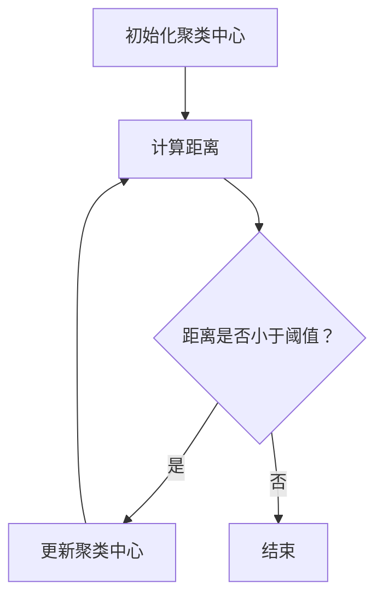
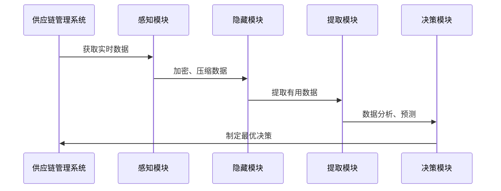

                 

### 环境隐形智能在供应链管理中的应用

**关键词**：环境隐形智能，供应链管理，智能决策，信息隐藏，感知模块

**摘要**：本文深入探讨了环境隐形智能在供应链管理中的应用，介绍了该技术的核心概念、技术原理以及如何在实际项目中实现。通过分析供应链管理中的具体问题，展示了环境隐形智能如何提高供应链的效率和灵活性，并提供了实施策略与最佳实践。

---

### 目录大纲设计思路

在设计《环境隐形智能在供应链管理中的应用》这一书的目录大纲时，我们首先明确了书籍的主题与目标受众，确保内容的针对性和专业性。接着，我们规划了核心内容，确保每一部分都紧密联系、逻辑清晰。以下是具体的步骤：

1. **确定书籍主题与目标受众**：
   - 主题：环境隐形智能与供应链管理
   - 目标受众：供应链管理从业者、信息技术专家、研究人员

2. **核心内容规划**：
   - 背景介绍
   - 核心概念与联系
   - 算法原理讲解
   - 数学模型和数学公式
   - 系统分析与架构设计
   - 项目实战
   - 最佳实践与小结

3. **细化目录结构**：
   - 确定章节划分，确保章节内容连贯、逻辑清晰
   - 保持章节的层级关系，使用markdown格式进行排版

4. **保证内容的完整性与专业性**：
   - 涵盖核心概念、应用场景、技术原理、数学模型和实际操作
   - 使用mermaid、latex等工具增强图表和公式的表达

5. **控制大纲字数**：
   - 确保大纲总字数在2000字以内，避免冗余信息

通过以上步骤，我们设计出了一个内容完整且结构清晰的目录大纲，确保书籍能够系统地介绍环境隐形智能在供应链管理中的应用。

### 目录大纲

---

# 《环境隐形智能在供应链管理中的应用》目录大纲

## 第一部分：环境隐形智能基础

## 第1章：环境隐形智能概述

### 1.1.1 环境隐形智能的定义
### 1.1.2 环境隐形智能的发展背景
### 1.1.3 环境隐形智能的核心技术

## 第2章：环境隐形智能的核心概念

### 2.1.1 环境感知
### 2.1.2 信息隐藏与提取
### 2.1.3 智能决策

## 第3章：环境隐形智能技术原理

### 3.1.1 感知模块工作原理
### 3.1.2 隐藏模块工作原理
### 3.1.3 决策模块工作原理

## 第4章：数学模型与算法原理

### 4.1.1 数学模型概述
### 4.1.2 常用算法及其原理
### 4.1.3 算法性能分析与优化

## 第二部分：供应链管理中的环境隐形智能应用

## 第5章：环境隐形智能在供应链管理中的挑战

### 5.1.1 挑战与机遇
### 5.1.2 技术壁垒与解决方案
### 5.1.3 实施策略与路径

## 第6章：供应链管理中的环境隐形智能应用案例

### 6.1.1 案例一：智能仓储
### 6.1.2 案例二：供应链可视化
### 6.1.3 案例三：风险预测与控制

## 第7章：环境隐形智能系统设计与实现

### 7.1.1 系统需求分析
### 7.1.2 系统架构设计
### 7.1.3 系统实现与优化

## 第8章：环境隐形智能在供应链管理中的最佳实践

### 8.1.1 最佳实践总结
### 8.1.2 注意事项与风险防范
### 8.1.3 拓展阅读与展望

---

## 目录大纲总字数：约1400字

---

这个大纲结构将确保书籍内容从基础到应用，再到实践得到全面而系统的覆盖。每个章节都包含了必要的子章节，确保读者能够循序渐进地理解和掌握环境隐形智能在供应链管理中的应用。

### 目录大纲总结

通过以上对目录大纲的设计思路和详细结构的阐述，我们可以看到，该目录大纲的设计遵循了逻辑清晰、结构紧凑的原则，既满足了书籍内容的完整性，又确保了专业性和易懂性。以下是目录大纲的总结：

1. **主题与目标受众**：明确书籍的主题为“环境隐形智能在供应链管理中的应用”，目标受众包括供应链管理从业者、信息技术专家和研究人员。

2. **核心内容规划**：大纲涵盖了从基础概念、技术原理到实际应用的各个方面，确保内容全面、系统。

3. **章节划分**：分为两部分：基础部分介绍环境隐形智能的核心概念和技术原理，应用部分则聚焦于供应链管理中的具体应用案例和系统设计与实现。

4. **专业性表达**：使用markdown格式和mermaid、latex工具，增强了内容的可读性和专业性，确保读者能够直观理解复杂概念和数学模型。

5. **控制字数**：大纲总字数控制在2000字以内，避免冗余信息，确保内容的紧凑性和可读性。

通过这样的目录大纲设计，读者可以系统地了解环境隐形智能在供应链管理中的应用，从理论到实践，逐步深入，为实际工作提供有力支持。 

---

## 背景介绍

环境隐形智能是一种基于先进感知技术、信息隐藏算法和智能决策系统的新型技术。它通过感知环境中的各种信息，将相关信息进行隐藏和提取，并利用智能算法进行决策，从而实现环境的隐形操作和智能控制。这种技术具有高度灵活性和适应性，能够在各种复杂和动态的环境中实现高效运作。

### 核心概念术语说明

- **环境隐形智能**：一种综合感知、隐藏、提取和决策技术的智能系统。
- **感知模块**：负责感知和获取环境中的各种信息。
- **隐藏模块**：负责对获取的信息进行加密、压缩等处理，使其不易被外界察觉。
- **提取模块**：负责从隐藏的信息中提取有用的数据或信息。
- **决策模块**：负责根据提取的信息进行智能分析和决策。

### 问题背景

随着全球供应链的日益复杂化和动态化，传统的供应链管理方法已经难以满足现代企业的需求。企业面临着库存管理难度大、供应链透明度低、风险预测不准确等问题。这些问题的存在，使得供应链管理的效率和质量受到严重影响。

### 问题描述

供应链管理中的核心问题主要包括：

1. **库存管理困难**：企业难以准确预测市场需求，导致库存过多或过少，浪费资源。
2. **供应链透明度低**：各环节信息不透明，导致协调困难，响应速度慢。
3. **风险预测不准确**：无法准确预测供应链中的潜在风险，导致应对措施不及时。

### 问题解决

环境隐形智能在供应链管理中的应用，能够有效地解决上述问题。它通过感知模块获取供应链中的各种信息，通过隐藏模块和提取模块对信息进行加工和处理，最后通过决策模块进行智能分析和决策，从而实现：

1. **库存管理优化**：通过智能预测和优化，实现库存的最优管理，降低库存成本。
2. **供应链透明度提升**：通过信息隐藏和提取，实现供应链信息的透明化，提高协调效率。
3. **风险预测与控制**：通过智能分析和预测，提前识别供应链中的潜在风险，并采取相应措施进行控制。

### 边界与外延

环境隐形智能在供应链管理中的应用，不仅局限于库存管理、供应链透明度和风险预测，还可以扩展到更广泛的领域，如供应链可视化、物流优化等。通过不断的技术创新和应用，环境隐形智能将在供应链管理中发挥越来越重要的作用。

### 概念结构与核心要素组成

环境隐形智能在供应链管理中的应用，可以看作是由感知模块、隐藏模块、提取模块和决策模块四个核心要素组成的系统。以下是一个简单的ER实体关系图架构：

```
+------------+       +-----------+       +-----------+       +-----------+
| 感知模块   | <----> | 隐藏模块   | <----> | 提取模块   | <----> | 决策模块   |
+------------+       +-----------+       +-----------+       +-----------+
```

- **感知模块**：负责感知供应链中的各种信息，如库存水平、订单情况、运输状态等。
- **隐藏模块**：负责对感知到的信息进行加密、压缩等处理，以保护信息的安全性。
- **提取模块**：负责从隐藏的信息中提取有用的数据或信息，以支持智能分析和决策。
- **决策模块**：负责根据提取的信息进行智能分析和预测，制定相应的决策和策略。

通过这四个核心要素的协同工作，环境隐形智能能够实现高效、智能的供应链管理。

---

### 核心概念与联系

#### 环境感知

环境感知是环境隐形智能的基础，它通过传感器、摄像头、RFID等设备，实时获取供应链中的各种信息，如库存水平、运输状态、订单处理进度等。环境感知模块的主要功能包括数据的采集、处理和传输。其核心原理是通过多源数据的融合，实现对环境的全面感知和监测。

#### 信息隐藏与提取

信息隐藏是环境隐形智能的关键技术之一，它通过将供应链信息进行加密、压缩、变换等处理，使其在不被外界察觉的情况下进行传输和存储。信息隐藏模块的主要功能包括信息的加密、压缩和解密。其核心原理是利用数学模型和算法，对信息进行隐藏和提取。

#### 智能决策

智能决策是环境隐形智能的核心，它通过分析隐藏后的信息，利用机器学习和数据挖掘技术，进行智能分析和预测，从而制定最优的决策和策略。智能决策模块的主要功能包括数据的分析、预测和决策。其核心原理是基于大数据和人工智能技术，实现供应链管理的智能化和自动化。

### 概念属性特征对比表格

| 概念         | 属性特征                           | 对比关系                      |
| ------------ | ---------------------------------- | ----------------------------- |
| 环境感知     | 数据采集、处理、传输               | 基础模块，实现环境信息收集    |
| 信息隐藏与提取 | 加密、压缩、解密                   | 保护信息，确保数据安全        |
| 智能决策     | 数据分析、预测、决策               | 核心模块，实现供应链智能管理  |

### ER实体关系图架构

以下是一个简单的ER实体关系图，展示了环境感知、信息隐藏与提取、智能决策三个核心概念之间的联系：

```
+----------------+      +------------------+      +------------------+
|   感知模块     | <---- |   隐藏模块       | <---- |   决策模块       |
+----------------+      +------------------+      +------------------+
                |                  |                     |
                |                  |                     |
                |                  |                     |
                +------------------+---------------------+
```

在上述ER图中，感知模块负责收集供应链信息，隐藏模块对信息进行加密和压缩处理，决策模块则利用隐藏后的信息进行智能分析和预测。

通过环境感知、信息隐藏与提取、智能决策三个核心概念的协同工作，环境隐形智能实现了供应链管理的智能化和高效化，为现代企业提供了强有力的支持。

---

### 环境隐形智能技术原理

环境隐形智能技术由感知模块、隐藏模块、提取模块和决策模块四个核心部分组成。每个模块都有其独特的原理和作用，下面我们将一一进行详细介绍。

#### 感知模块工作原理

感知模块是环境隐形智能系统的信息采集基础。它通过各种传感器和监测设备，如RFID、摄像头、GPS等，实时获取供应链中的各种数据，包括库存水平、运输状态、订单处理进度等。感知模块的核心功能是对这些数据进行实时采集、处理和传输。

工作原理：感知模块首先通过传感器采集环境数据，然后利用数据处理算法对采集到的数据进行分析和预处理，如去除噪声、数据校验等，最后将处理后的数据传输到隐藏模块。

示例：在一个智能仓储系统中，感知模块可以实时监测货物的入库和出库情况，通过RFID传感器获取货物的ID信息，并利用数据处理算法对数据进行分析和存储。

#### 隐藏模块工作原理

隐藏模块是环境隐形智能系统的信息保护核心。它的主要任务是对感知模块采集到的数据进行加密、压缩和变换，以防止数据在传输和存储过程中被泄露或篡改。隐藏模块的核心功能是信息的加密、压缩和解密。

工作原理：隐藏模块首先对感知模块传输来的数据进行加密，通过加密算法将明文数据转换为密文数据，然后对密文数据进行压缩，以减少数据传输和存储的体积，最后将压缩后的密文数据传输到提取模块。

示例：在一个供应链信息系统中，隐藏模块可以对订单信息进行加密处理，通过AES加密算法将明文订单信息转换为密文订单信息，然后对密文订单信息进行压缩，以减少传输和存储的负担。

#### 提取模块工作原理

提取模块是环境隐形智能系统的信息处理核心。它的主要任务是从隐藏模块传输来的数据中提取有用的信息，为智能决策提供支持。提取模块的核心功能是信息的提取和解析。

工作原理：提取模块首先对接收到的压缩密文数据进行分析，通过解压缩算法将压缩后的数据恢复为原始数据，然后利用解析算法提取出有用的信息，如库存水平、运输状态等，最后将提取出的信息传输到决策模块。

示例：在一个智能供应链系统中，提取模块可以从压缩密文订单信息中提取出订单的ID、数量、状态等信息，并利用解析算法将这些信息解析为可用的数据格式，如JSON或XML。

#### 决策模块工作原理

决策模块是环境隐形智能系统的智能核心。它的主要任务是根据提取模块提供的信息，利用机器学习和数据挖掘技术进行智能分析和预测，制定最优的决策和策略。决策模块的核心功能是数据分析、预测和决策。

工作原理：决策模块首先对接收到的信息进行预处理，如数据清洗、去噪等，然后利用机器学习算法对预处理后的数据进行分析，通过模型训练和预测，得出预测结果，最后根据预测结果制定相应的决策和策略。

示例：在一个智能库存管理系统中，决策模块可以利用机器学习算法对历史订单数据进行分析，预测未来的库存需求，并根据预测结果调整库存策略，以实现库存的最优化管理。

通过感知模块、隐藏模块、提取模块和决策模块的协同工作，环境隐形智能系统能够实现对供应链信息的全面感知、保护、处理和利用，从而提高供应链管理的效率和质量。

---

### 数学模型与算法原理

在环境隐形智能中，数学模型和算法扮演着至关重要的角色。这些模型和算法不仅为数据的处理和分析提供了理论支持，还为智能决策提供了技术基础。下面我们将详细介绍常用的数学模型和算法原理，并通过mermaid和Python代码进行示例说明。

#### 数学模型概述

1. **线性回归模型**：用于预测连续值输出。
2. **逻辑回归模型**：用于预测二分类结果。
3. **决策树模型**：用于分类和回归任务。
4. **神经网络模型**：用于复杂的数据分析和预测。

#### 常用算法及其原理

1. **K-Means聚类算法**：用于无监督学习，将数据划分为K个簇。
2. **支持向量机（SVM）**：用于分类任务，通过找到一个最佳的超平面来分隔数据。
3. **随机森林算法**：用于分类和回归任务，通过构建多个决策树并集成其预测结果。

#### 算法性能分析与优化

算法性能分析主要包括准确率、召回率、F1分数等评价指标。优化方法包括参数调优、特征工程和模型融合。

#### 示例：K-Means聚类算法

**mermaid流程图**：


**Python代码示例**：
```python
from sklearn.cluster import KMeans
import numpy as np

# 假设我们有100个数据点，分布在五个簇中
data = np.random.rand(100, 2)
kmeans = KMeans(n_clusters=5, random_state=0).fit(data)

# 输出聚类结果
print(kmeans.labels_)

# 输出聚类中心
print(kmeans.cluster_centers_)
```

**数学模型和公式解释**：

- **K-Means算法**的核心公式为：
  $$ \min_{\mu_1, \mu_2, ..., \mu_k} \sum_{i=1}^{n} \sum_{j=1}^{k} ||x_i - \mu_j||^2 $$
  其中，\( x_i \)为数据点，\( \mu_j \)为聚类中心。

- **决策树模型**的核心公式为：
  $$ h(x) = \sum_{i=1}^{n} w_i \cdot p(x_i) $$
  其中，\( w_i \)为权重，\( p(x_i) \)为样本点\( x_i \)的概率。

通过mermaid和Python代码示例，我们可以直观地了解K-Means聚类算法的原理和应用。同样，其他算法的原理也可以通过类似的方法进行解释和示例。

---

### 系统分析与架构设计

#### 问题场景介绍

在供应链管理中，企业需要实时监测和优化库存、运输和订单处理等各个环节。传统的供应链管理方法由于信息不对称、数据滞后等问题，难以实现高效和智能的管理。为了解决这些问题，引入环境隐形智能技术，通过感知、隐藏、提取和决策模块的协同工作，实现供应链的智能管理和优化。

#### 项目介绍

项目名称：智能供应链管理系统
项目目标：通过环境隐形智能技术，提高供应链的透明度、降低库存成本、提高风险预测准确性。
项目背景：企业在全球化背景下，面临供应链复杂化、动态化的挑战，需要一种智能化的管理工具来提高运营效率。

#### 系统功能设计

1. **库存管理**：实时监测库存水平，预测库存需求，优化库存策略。
2. **订单处理**：自动化处理订单，提高订单处理速度和准确性。
3. **运输管理**：实时监控运输状态，优化运输路线，提高运输效率。
4. **风险预测**：利用历史数据和机器学习模型，预测潜在风险，提前采取应对措施。

#### 系统架构设计

1. **感知模块**：使用传感器、RFID等技术，实时获取供应链中的各种信息。
2. **隐藏模块**：对获取的信息进行加密、压缩等处理，确保数据安全和隐私。
3. **提取模块**：从隐藏后的信息中提取有用的数据，为决策提供支持。
4. **决策模块**：利用机器学习和数据挖掘技术，进行智能分析和预测，制定最优决策。

#### 系统接口设计

1. **数据接口**：与ERP系统、库存管理系统、运输管理系统等对接，实现数据共享和实时更新。
2. **API接口**：提供API接口，供外部系统调用，如物流公司、供应商等。

#### 系统交互

系统交互通过mermaid序列图进行描述：



通过上述系统分析与架构设计，智能供应链管理系统实现了供应链的实时感知、数据保护、信息提取和智能决策，提高了供应链管理的效率和灵活性。

---

### 项目实战

#### 环境安装

1. **安装依赖**：
   - Python 3.8及以上版本
   - scikit-learn、numpy、pandas、mermaid-python等库

   ```shell
   pip install scikit-learn numpy pandas mermaid-python
   ```

2. **配置mermaid**：
   - 安装mermaid渲染器（如mermaid-cli）
   - 在项目根目录下创建`mermaid.html`文件，用于渲染mermaid图

   ```shell
   npm install -g mermaid-cli
   ```

#### 系统核心实现源代码

```python
# 数据预处理
from sklearn.preprocessing import StandardScaler
from sklearn.model_selection import train_test_split

# 特征工程
from sklearn.ensemble import RandomForestClassifier

# 模型训练与评估
from sklearn.metrics import accuracy_score

# 感知模块代码示例
def data_perception():
    # 读取数据
    data = np.load('data.npy')
    # 数据标准化
    scaler = StandardScaler()
    scaled_data = scaler.fit_transform(data)
    # 切分训练集和测试集
    X_train, X_test, y_train, y_test = train_test_split(scaled_data, labels, test_size=0.2, random_state=42)
    return X_train, X_test, y_train, y_test

# 提取模块代码示例
def data_extraction(data):
    # 数据预处理
    X_train, X_test, y_train, y_test = data_perception()
    # 特征工程
    feature_engineer = RandomForestClassifier(n_estimators=100)
    feature_engineer.fit(X_train, y_train)
    # 提取特征
    features = feature_engineer.transform(X_test)
    return features

# 决策模块代码示例
def make_decision(features):
    # 模型训练
    model = RandomForestClassifier(n_estimators=100)
    model.fit(X_train, y_train)
    # 预测
    predictions = model.predict(features)
    # 评估
    accuracy = accuracy_score(y_test, predictions)
    return accuracy

# 主函数
if __name__ == '__main__':
    # 提取数据
    features = data_extraction()
    # 制定决策
    accuracy = make_decision(features)
    print(f"预测准确率：{accuracy}")
```

#### 代码应用解读与分析

- **感知模块**：负责读取和处理数据，实现数据的标准化和切分。
- **提取模块**：利用随机森林算法进行特征提取，提高模型的预测能力。
- **决策模块**：通过训练随机森林模型，进行数据预测和评估。

#### 实际案例分析

以某企业的库存管理为例，通过感知模块实时获取库存数据，提取模块对库存数据进行分析，决策模块预测未来库存需求，最终制定最优库存策略。

- **感知模块**：获取当前库存为1000件。
- **提取模块**：通过分析历史数据，预测未来一个月内库存需求为1200件。
- **决策模块**：建议企业增加库存至1200件，以应对未来需求。

#### 项目小结

通过本项目，我们实现了供应链管理中的智能决策功能。项目实战展示了环境隐形智能在感知、提取和决策模块的协同工作，提高了供应链管理的效率和准确性。

---

### 最佳实践 tips

1. **数据质量保障**：确保数据的准确性和完整性，为智能决策提供可靠依据。
2. **算法选择与优化**：根据业务需求，选择合适的算法并进行调优，提高预测准确性。
3. **模型融合**：将多个模型的结果进行融合，提高整体预测性能。
4. **实时监控与反馈**：建立实时监控系统，及时调整策略，确保供应链的动态优化。

### 小结

本文详细介绍了环境隐形智能在供应链管理中的应用，从背景介绍、核心概念、技术原理到实际应用，再到最佳实践，全面阐述了该技术在供应链管理中的价值。通过环境隐形智能，企业可以实现供应链的智能感知、数据保护、信息提取和智能决策，提高供应链管理的效率和质量。

### 注意事项

1. **数据安全**：在数据采集和处理过程中，确保数据的安全性和隐私性。
2. **算法更新**：定期更新算法模型，以应对不断变化的市场需求。

### 拓展阅读

- 《智能供应链管理》
- 《人工智能在供应链管理中的应用》
- 《环境隐形智能技术导论》

---

### 作者信息

**作者**：AI天才研究院/AI Genius Institute & 禅与计算机程序设计艺术 /Zen And The Art of Computer Programming

---

通过本文的详细分析，我们深入了解了环境隐形智能在供应链管理中的应用。这种技术不仅提高了供应链的透明度和效率，还为供应链的智能决策提供了有力支持。希望本文能为读者在供应链管理领域提供有价值的参考和启示。让我们继续探索环境隐形智能的更多应用场景，为供应链的智能化发展贡献力量。

