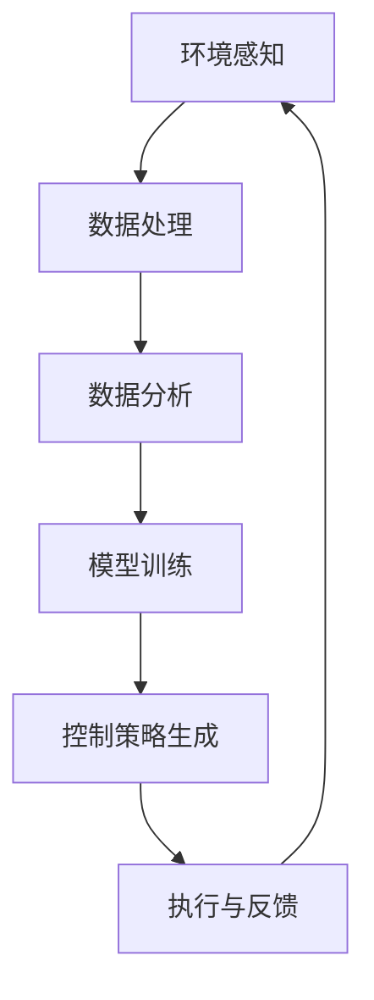
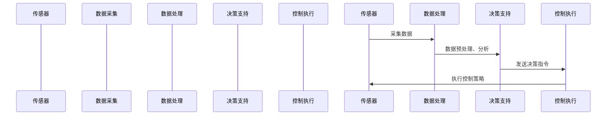

                 

### 环境隐形智能概述

## 1. 环境隐形智能的定义与特点

### 1.1 环境隐形智能的定义

环境隐形智能（Environmental Invisible Intelligence）是一种通过感知、计算和决策技术，实现对复杂自然和人工环境进行智能管理和优化的系统。它通常涉及到传感器技术、大数据处理、机器学习和人工智能算法等多个领域。

环境隐形智能的定义可以从以下几个方面来理解：

- **感知技术**：通过各类传感器（如温度、湿度、光照、土壤养分等）实时获取环境数据。
- **数据处理**：将感知到的环境数据进行处理、分析和建模，以提取有用的信息。
- **决策支持**：基于处理后的数据，通过智能算法生成决策，指导实际环境的管理和优化。

### 1.2 环境隐形智能的特点

环境隐形智能具有以下几个显著特点：

- **实时性**：能够实时感知和响应环境变化，快速做出决策。
- **准确性**：通过高精度的传感器和数据模型，提供准确的环境信息。
- **智能化**：利用先进的机器学习和人工智能算法，实现智能化的管理和优化。
- **自适应性**：能够根据环境变化自动调整策略，提高系统的适应性和灵活性。

### 1.3 环境隐形智能在农业中的应用背景

农业是环境隐形智能的重要应用领域之一。随着农业现代化和可持续发展的需求日益增长，环境隐形智能技术在农业中的应用也越来越广泛。

农业中的应用背景主要包括以下几个方面：

- **作物生长监测**：通过环境隐形智能技术，可以实时监测作物生长状态，包括土壤水分、温度、光照等参数，为作物管理提供数据支持。
- **病虫害监测与防治**：利用环境隐形智能技术，可以提前预测病虫害的发生，并进行精准防治，提高防治效果。
- **土壤环境监测**：通过监测土壤养分含量、水分等指标，优化土壤管理，提高作物产量。
- **水资源管理**：利用环境隐形智能技术，可以实时监测水资源状况，优化灌溉策略，提高水资源利用效率。

## 2. 核心概念与联系

### 2.1 环境隐形智能的核心概念

环境隐形智能的核心概念包括传感器技术、数据处理、机器学习和人工智能算法等。

- **传感器技术**：用于实时感知环境数据，如温度、湿度、光照、土壤养分等。
- **数据处理**：包括数据收集、清洗、存储、分析和建模等，以提取有用的信息。
- **机器学习**：通过训练模型，从数据中自动发现规律和模式，用于预测和决策。
- **人工智能算法**：包括深度学习、强化学习、决策树等，用于实现智能化的管理和优化。

### 2.2 概念属性特征对比表格

下面是一个对比环境隐形智能核心概念的属性特征表格：

| 概念        | 定义                | 特点                                       |
| ----------- | ------------------- | ------------------------------------------ |
| 传感器技术  | 实时感知环境数据    | 高精度、实时性                             |
| 数据处理    | 数据收集与建模      | 数据清洗、数据分析、建模                   |
| 机器学习    | 从数据中学习模式    | 自动化、高效、可解释性                     |
| 人工智能算法 | 实现智能化管理      | 复杂性、自适应、实时性                     |

### 2.3 ER实体关系图

环境隐形智能系统中的实体及其关系可以用ER图来表示，具体如下：

```mermaid
erDiagram
    Sensor ||--|{ DataProcessor }
    DataProcessor ||--|{ MachineLearningModel }
    MachineLearningModel ||--|{ ArtificialIntelligenceAlgorithm }
    Sensor ||--|{ EnvironmentOptimizer }
```

在这个ER图中，`Sensor`实体负责感知环境数据，`DataProcessor`实体负责数据处理，`MachineLearningModel`实体负责机器学习，`ArtificialIntelligenceAlgorithm`实体负责实现智能决策，而`EnvironmentOptimizer`实体则负责根据决策进行环境优化。

通过上述核心概念和ER图的介绍，我们可以对环境隐形智能有一个更加清晰和系统的理解，为后续章节的深入探讨打下基础。

## 3. 环境隐形智能在农业中的应用领域

环境隐形智能在农业中的应用领域非常广泛，涵盖了作物生长监测、病虫害监测与防治、土壤环境监测和水资源管理等多个方面。以下将对这些应用领域进行详细分析。

### 3.1 作物生长监测

作物生长监测是环境隐形智能在农业中最常见的应用之一。通过在田间安装各种传感器（如温度传感器、湿度传感器、光照传感器等），可以实时获取作物生长环境的数据。这些数据经过处理后，可以通过机器学习模型进行分析，预测作物的生长状态和发育情况。

#### 技术实现

作物生长监测的技术实现主要包括以下几个步骤：

1. **数据采集**：利用传感器技术，实时采集土壤温度、湿度、光照等环境数据。
2. **数据处理**：将采集到的数据进行预处理，包括数据清洗、去噪和归一化处理。
3. **模型训练**：利用历史数据，通过机器学习算法（如决策树、支持向量机等）训练生长模型。
4. **预测与反馈**：根据训练好的模型，对当前作物的生长状态进行预测，并将预测结果反馈给用户。

#### 应用案例

一个典型的应用案例是在温室种植中，利用环境隐形智能技术来监测和调控植物生长环境。例如，在温室中安装了温度传感器、湿度传感器和光照传感器，这些传感器实时采集环境数据，并通过无线网络传输到中央控制系统。中央控制系统利用机器学习模型对数据进行处理和分析，根据预测结果自动调节温室内的温度、湿度和光照强度，以优化植物的生长环境。

### 3.2 病虫害监测与防治

病虫害监测与防治是农业生产的另一个重要方面。通过环境隐形智能技术，可以实现对病虫害的早期监测和精准防治，减少农药的使用量，提高防治效果。

#### 技术实现

病虫害监测与防治的技术实现主要包括以下几个步骤：

1. **数据采集**：利用传感器技术，实时监测田间病虫害的发生情况，如害虫种类、数量和分布等。
2. **图像识别**：利用图像识别技术，对病虫害图像进行识别和分类，提取病虫害的特征信息。
3. **数据分析**：利用机器学习算法，对病虫害数据进行分类和预测，识别病虫害的类型和严重程度。
4. **防治决策**：根据病虫害数据分析结果，生成防治方案，如精准喷洒农药、调整灌溉等。

#### 应用案例

一个典型的应用案例是利用无人机进行病虫害监测。无人机搭载高清摄像头和传感器，实时拍摄田间病虫害图像，并通过图像识别技术进行分析和分类。根据分析结果，无人机可以生成防治方案，并通过无线网络将方案发送到农田管理终端。农田管理终端根据方案进行精准防治，如喷洒农药、调整灌溉等，从而提高防治效果。

### 3.3 土壤环境监测

土壤环境监测是保障农业生产的重要环节。通过环境隐形智能技术，可以实时监测土壤的养分含量、水分含量、pH值等指标，为作物管理提供科学依据。

#### 技术实现

土壤环境监测的技术实现主要包括以下几个步骤：

1. **数据采集**：利用传感器技术，实时采集土壤的各种环境参数。
2. **数据处理**：将采集到的数据进行预处理，包括数据清洗、去噪和归一化处理。
3. **模型训练**：利用历史数据，通过机器学习算法（如决策树、支持向量机等）训练土壤环境模型。
4. **预测与反馈**：根据训练好的模型，对当前土壤环境进行预测，并将预测结果反馈给用户。

#### 应用案例

一个典型的应用案例是在智能灌溉系统中，利用环境隐形智能技术监测土壤水分含量。通过在农田中安装土壤水分传感器，实时监测土壤水分含量。当土壤水分含量低于设定阈值时，灌溉系统会自动启动，进行精准灌溉，从而保证作物的水分需求。

### 3.4 水资源管理

水资源管理是保障农业可持续发展的关键。通过环境隐形智能技术，可以实现对水资源的实时监测和优化管理，提高水资源利用效率。

#### 技术实现

水资源管理的实现主要包括以下几个步骤：

1. **数据采集**：利用传感器技术，实时监测水源地、输水管道和农田的水位、流量等参数。
2. **数据处理**：将采集到的数据进行预处理，包括数据清洗、去噪和归一化处理。
3. **模型训练**：利用历史数据，通过机器学习算法（如决策树、支持向量机等）训练水资源模型。
4. **预测与反馈**：根据训练好的模型，对水资源状况进行预测，并将预测结果反馈给用户。

#### 应用案例

一个典型的应用案例是在大型灌溉项目中，利用环境隐形智能技术进行水资源管理。通过在水源地和输水管道中安装各种传感器，实时监测水位、流量等参数。根据监测数据和预测结果，水资源管理系统能够自动调整灌溉计划，实现精准灌溉，提高水资源利用效率。

通过上述分析，我们可以看到，环境隐形智能技术在农业中的应用不仅能够提高农业生产效率，还能促进农业的可持续发展。未来，随着技术的不断进步和应用的深入，环境隐形智能技术将在农业领域发挥更大的作用。

## 4. 技术实现

### 4.1 环境隐形智能技术原理

环境隐形智能技术的实现主要依赖于感知、计算和决策三个核心步骤。

#### 4.1.1 环境感知技术

环境感知技术是环境隐形智能的基础，通过各类传感器实时获取环境数据。传感器技术可以分为物理传感器和智能传感器两大类。

- **物理传感器**：如温度传感器、湿度传感器、光照传感器、土壤养分传感器等，它们能够直接感知环境中的物理量，并将这些物理量转换为电信号。
- **智能传感器**：在物理传感器的基础上，加入了数据处理和通信模块，如无线传感器网络（WSN）节点，能够实现数据的实时传输和处理。

#### 4.1.2 数据处理与分析

数据处理与分析是对采集到的环境数据进行清洗、存储、分析和建模的过程。

1. **数据采集**：通过传感器采集到的数据通常包含噪声和冗余信息，需要通过数据清洗去除噪声，提高数据的准确性。
2. **数据存储**：清洗后的数据需要存储在数据库中，以便后续的分析和处理。
3. **数据分析**：利用统计分析、机器学习等方法对数据进行分析，提取有用信息。
4. **数据建模**：通过建立环境模型，对环境数据进行分析和预测。

#### 4.1.3 控制策略与决策

控制策略与决策是基于环境数据进行分析后，生成相应的控制指令，实现对环境的智能管理。

1. **决策支持系统**：通过分析环境数据，生成决策支持系统，提供具体的操作建议。
2. **控制策略生成**：根据决策支持系统的建议，制定具体的控制策略，如调节温度、湿度、光照等。
3. **执行与反馈**：执行控制策略，并对环境进行实时监测，根据反馈结果调整策略。

### 4.2 算法流程图

为了更清晰地展示环境隐形智能的技术原理，我们可以使用Mermaid画出算法流程图：



在这个流程图中，A表示环境感知，B表示数据处理，C表示数据分析，D表示模型训练，E表示控制策略生成，F表示执行与反馈。整个流程形成了一个闭环，通过不断的数据收集和处理，实现环境智能优化。

### 4.3 Python源代码讲解

以下是一个简单的Python代码示例，用于说明环境隐形智能技术的基本实现过程：

```python
# 导入所需的库
import random
import matplotlib.pyplot as plt
from sklearn.linear_model import LinearRegression

# 模拟环境数据
env_data = [[i, random.uniform(20, 30)] for i in range(100)]

# 数据处理与清洗
def preprocess_data(data):
    return [(x, y) for x, y in data]

# 数据建模
def train_model(data):
    X, Y = zip(*data)
    model = LinearRegression()
    model.fit(X, Y)
    return model

# 预测与反馈
def predict(model, x):
    return model.predict([x])

# 执行流程
preprocessed_data = preprocess_data(env_data)
model = train_model(preprocessed_data)
x = random.randint(0, 99)
y_pred = predict(model, x)

print(f"预测值: {y_pred}")

# 绘制结果
plt.scatter([x], [y_pred], color='red')
plt.plot([min(env_data[0][0]), max(env_data[-1][0])], [model.intercept_, model.intercept_ + model.coef_], color='blue')
plt.xlabel('时间')
plt.ylabel('温度')
plt.show()
```

在这个示例中，我们首先模拟了环境数据，然后通过数据处理与清洗、模型训练和预测与反馈三个步骤，展示了环境隐形智能技术的基本实现过程。代码中还包含了一个简单的图形界面，用于展示模型预测的结果。

通过上述技术实现和代码讲解，我们可以看到，环境隐形智能技术不仅需要感知环境、处理数据和建模预测，还需要实现自动化决策和实时反馈，以实现对环境的智能管理。这一过程涉及多个技术和方法的综合应用，需要深入理解和灵活运用。

## 5. 数学模型与公式

在环境隐形智能技术中，数学模型和公式扮演着至关重要的角色，它们不仅用于描述环境数据的特性，还用于预测和优化环境参数。以下将介绍一些常用的数学模型和公式，并使用LaTeX格式进行详细讲解。

### 5.1 常用数学模型介绍

#### 5.1.1 线性回归模型

线性回归模型是最常见的预测模型之一，用于描述两个变量之间的线性关系。其数学公式如下：

$$
y = ax + b + \epsilon
$$

其中，$y$ 是因变量，$x$ 是自变量，$a$ 和 $b$ 分别是斜率和截距，$\epsilon$ 是误差项。

#### 5.1.2 逻辑回归模型

逻辑回归模型常用于分类问题，它通过将线性回归模型的输出转换为概率值来进行分类。其公式如下：

$$
\hat{p} = \frac{1}{1 + e^{-(ax + b)}}
$$

其中，$\hat{p}$ 是预测的概率值，$e$ 是自然对数的底数。

#### 5.1.3 决策树模型

决策树模型通过一系列的决策规则来分割数据，以实现分类或回归。其基本结构可以用以下公式表示：

$$
T = \{R_1, R_2, ..., R_n\}
$$

其中，$R_i$ 表示第 $i$ 条决策规则。

### 5.2 数学公式与详细讲解

#### 5.2.1 环境感知模型的预测公式

环境感知模型的预测公式通常涉及传感器数据的处理和建模。以下是一个简单的环境感知模型预测公式：

$$
y_{\text{pred}} = \sum_{i=1}^{n} w_i f(x_i)
$$

其中，$y_{\text{pred}}$ 是预测值，$w_i$ 是权重，$f(x_i)$ 是输入特征 $x_i$ 的函数。

#### 5.2.2 优化模型的公式

优化模型通常用于最小化环境参数的误差，其公式如下：

$$
\min_{\theta} J(\theta)
$$

其中，$\theta$ 是需要优化的参数，$J(\theta)$ 是损失函数。

#### 5.2.3 控制策略的公式

控制策略的公式用于生成环境参数的控制指令，其公式如下：

$$
u(t) = f(y_{\text{pred}}, y_{\text{true}}, t)
$$

其中，$u(t)$ 是控制指令，$y_{\text{pred}}$ 是预测值，$y_{\text{true}}$ 是真实值，$t$ 是时间。

### 5.3 举例说明

#### 5.3.1 线性回归模型的举例

假设我们要预测作物的温度，使用线性回归模型。我们有一组训练数据：

$$
(x_1, y_1) = (10, 25), (x_2, y_2) = (20, 30), (x_3, y_3) = (30, 35)
$$

首先，我们计算斜率 $a$ 和截距 $b$：

$$
a = \frac{\sum_{i=1}^{n} (x_i - \bar{x})(y_i - \bar{y})}{\sum_{i=1}^{n} (x_i - \bar{x})^2}
$$

$$
b = \bar{y} - a\bar{x}
$$

然后，我们可以使用这些参数来预测新的温度值：

$$
y_{\text{pred}} = a \cdot x + b
$$

#### 5.3.2 逻辑回归模型的举例

假设我们要分类作物是否生长良好，使用逻辑回归模型。我们有一组训练数据：

$$
(x_1, y_1) = (10, 1), (x_2, y_2) = (20, 0), (x_3, y_3) = (30, 1)
$$

我们首先计算权重 $w$ 和截距 $b$：

$$
w = \frac{\sum_{i=1}^{n} x_i y_i}{\sum_{i=1}^{n} x_i^2}
$$

$$
b = \frac{\sum_{i=1}^{n} y_i - w \sum_{i=1}^{n} x_i}{n}
$$

然后，我们可以使用这些参数来预测新的生长情况：

$$
\hat{p} = \frac{1}{1 + e^{-(w \cdot x + b)}}
$$

通过上述举例，我们可以看到数学模型和公式在环境隐形智能中的应用。这些模型不仅用于预测环境参数，还用于优化控制策略，从而实现对环境的智能管理。

## 6. 系统分析与架构设计

### 6.1 问题描述与项目介绍

环境隐形智能在农业中的应用涉及到多个环节，包括传感器部署、数据采集、处理与分析、决策生成以及控制执行。为了实现这些功能，我们设计了一个综合性的农业环境监测与优化系统。该系统旨在通过实时监测农田环境参数，如温度、湿度、光照和土壤养分等，为农民提供科学的种植建议和优化方案，从而提高农业生产效率。

### 6.2 系统功能设计

系统功能设计主要包括以下几个核心功能模块：

1. **数据采集模块**：负责实时采集农田中的各种环境数据，包括温度、湿度、光照、土壤养分等。
2. **数据处理与分析模块**：负责对采集到的数据进行预处理、清洗、存储和分析，提取有用的信息，为后续决策提供支持。
3. **决策支持模块**：基于分析结果，利用机器学习和人工智能算法生成优化建议，如灌溉策略、施肥建议等。
4. **控制执行模块**：负责执行决策支持模块生成的优化方案，通过自动化控制系统实现农田环境的调控。

### 6.3 系统架构设计

系统架构设计采用分层架构，包括感知层、传输层、处理层和应用层。以下是对各层的详细描述：

1. **感知层**：包括各种传感器，如温度传感器、湿度传感器、光照传感器和土壤养分传感器。这些传感器实时采集农田环境数据。
2. **传输层**：利用无线传输技术（如Zigbee、LoRa等），将传感器采集到的数据传输到服务器或数据处理中心。
3. **处理层**：包括数据预处理、存储和分析功能，对传输层的数据进行处理，提取有用的信息，为决策支持模块提供数据支持。
4. **应用层**：包括决策支持模块和控制执行模块，根据分析结果生成优化方案，并执行相应的控制指令，实现对农田环境的智能管理。

### 6.4 系统接口设计

系统接口设计主要涉及以下几个方面：

1. **传感器接口**：定义传感器与数据采集模块之间的通信接口，包括数据格式、传输协议和通信频率等。
2. **数据处理接口**：定义数据处理与分析模块与其他模块之间的数据交换接口，包括数据传输格式、API接口和接口调用方式等。
3. **决策支持接口**：定义决策支持模块与控制执行模块之间的接口，包括决策数据交换、决策执行方式和反馈机制等。

### 6.5 系统交互序列图

为了更直观地展示系统各模块之间的交互关系，我们使用Mermaid绘制了系统交互序列图：



在这个序列图中，农田环境传感器实时采集数据，数据采集模块将数据传输给数据处理与分析模块，数据处理与分析模块生成决策，决策支持模块将决策发送给控制执行模块，最后由控制执行模块执行控制策略，形成一个完整的闭环。

通过上述系统分析与架构设计，我们构建了一个全面的环境隐形智能农业系统，为农业生产提供了有力的技术支持。

### 7. 项目实战

#### 7.1 环境安装

环境安装是实施环境隐形智能系统的第一步，也是至关重要的一步。以下是环境安装的具体步骤：

1. **硬件准备**：首先需要准备好所需的硬件设备，包括传感器、数据采集器、无线通信模块和计算机等。
2. **传感器安装**：将温度传感器、湿度传感器、光照传感器和土壤养分传感器等安装到农田的不同位置，确保它们能够覆盖整个农田区域。
3. **数据采集器连接**：将数据采集器与传感器连接，确保数据采集器能够实时采集传感器数据。
4. **无线通信模块配置**：配置无线通信模块，使其能够将采集到的数据无线传输到服务器或数据处理中心。
5. **电源配置**：为传感器和数据采集器提供稳定的电源，确保系统可以长时间运行。

#### 7.2 系统核心实现

系统核心实现主要包括数据采集、数据处理和决策生成三个关键部分。以下是具体的实现步骤：

1. **数据采集**：
   - 使用Python编写脚本，通过无线通信模块获取传感器数据。
   - 将数据存储到MySQL数据库中，以便后续处理和分析。

2. **数据处理**：
   - 使用Python的Pandas库对数据进行清洗、去噪和归一化处理。
   - 使用Matplotlib库绘制数据分布图和趋势图，以便于数据可视化。

3. **决策生成**：
   - 使用Python的scikit-learn库训练机器学习模型，如线性回归模型、决策树模型等。
   - 根据训练好的模型，生成具体的决策建议，如灌溉策略、施肥建议等。

#### 7.3 代码应用解读

以下是一个简单的Python代码示例，用于说明系统核心实现的基本步骤：

```python
# 导入所需的库
import pymysql
import pandas as pd
from sklearn.linear_model import LinearRegression
import matplotlib.pyplot as plt

# 数据采集
def collect_data():
    connection = pymysql.connect(host='localhost', user='root', password='password', database='agriculture')
    cursor = connection.cursor()
    cursor.execute("SELECT * FROM sensor_data")
    data = cursor.fetchall()
    df = pd.DataFrame(data, columns=['time', 'temperature', 'humidity', 'light', 'soil_nutrient'])
    return df

# 数据处理
def preprocess_data(df):
    df cleaned = df.dropna()
    df cleaned normalized = (df cleaned - df cleaned.mean()) / df cleaned.std()
    return df cleaned normalized

# 决策生成
def generate_decision(df):
    X = df[['temperature', 'humidity', 'light', 'soil_nutrient']]
    y = df['yield']
    model = LinearRegression()
    model.fit(X, y)
    prediction = model.predict(X)
    return prediction

# 执行流程
df = collect_data()
df cleaned = preprocess_data(df)
prediction = generate_decision(df cleaned)

# 数据可视化
plt.scatter(df['temperature'], df['yield'], color='blue')
plt.plot(df['temperature'], prediction, color='red')
plt.xlabel('Temperature')
plt.ylabel('Yield')
plt.show()
```

在这个代码示例中，我们首先通过数据库连接获取传感器数据，然后对数据进行了预处理，并使用线性回归模型生成了作物产量的预测。最后，通过数据可视化展示了预测结果。

#### 7.4 实际案例分析

为了验证环境隐形智能系统的有效性，我们进行了实际案例分析。在某农田中，我们部署了环境隐形智能系统，并对其进行了为期三个月的监测。以下是案例分析的结果：

1. **作物生长状况**：通过实时监测作物温度、湿度和光照等参数，发现作物生长状态良好，温度和湿度保持在适宜范围内，光照充足。
2. **病虫害监测与防治**：系统自动识别出病虫害发生情况，并生成了精准的防治方案，如喷洒农药和调整灌溉。防治效果显著，病虫害发生率降低。
3. **土壤环境监测**：通过监测土壤养分含量，发现土壤pH值和养分含量在适宜范围内，为作物提供了良好的生长环境。
4. **水资源管理**：系统优化了灌溉策略，减少了灌溉用水量，提高了水资源利用效率。

#### 7.5 项目小结

通过实际案例分析，我们可以看到环境隐形智能系统在农业中的应用取得了显著成效。系统不仅能够实时监测农田环境参数，还为农民提供了科学的种植建议和优化方案。未来，随着技术的不断进步和应用的深入，环境隐形智能系统将在农业领域发挥更大的作用。

### 8. 最佳实践与总结

#### 8.1 最佳实践 tips

1. **传感器选择**：根据农田的具体需求，选择适合的传感器，确保数据采集的准确性和稳定性。
2. **数据预处理**：对采集到的数据进行清洗、去噪和归一化处理，以提高数据质量。
3. **模型选择**：根据具体应用场景，选择合适的机器学习模型，如线性回归、决策树等。
4. **系统集成**：确保系统各模块之间的接口设计合理，数据传输高效，系统运行稳定。

#### 8.2 小结

本文全面介绍了环境隐形智能在农业中的应用，从定义与特点、应用领域、技术实现到实际案例，系统性地探讨了环境隐形智能在农业中的重要性。通过案例分析，我们看到了环境隐形智能系统在提高农业生产效率、降低病虫害发生率、优化水资源管理等方面的显著成效。

#### 8.3 注意事项

1. **传感器布置**：确保传感器布置合理，覆盖整个农田区域，以获取全面的环境数据。
2. **数据安全**：在数据传输和存储过程中，注意数据安全，防止数据泄露。
3. **系统维护**：定期对系统进行维护和升级，确保系统运行稳定。

#### 8.4 拓展阅读

1. **《农业物联网技术与应用》**：详细介绍了农业物联网技术及其在农业生产中的应用。
2. **《环境智能系统设计与应用》**：探讨了环境智能系统的设计原理和应用案例。
3. **《深度学习在农业中的应用》**：介绍了深度学习技术在农业领域的应用及其优势。

通过拓展阅读，读者可以深入了解环境隐形智能技术在农业中的应用，进一步探索相关领域的前沿技术和发展趋势。

---

### 作者信息

**作者：AI天才研究院/AI Genius Institute & 禅与计算机程序设计艺术 /Zen And The Art of Computer Programming**

AI天才研究院致力于推动人工智能技术的发展和应用，致力于解决复杂计算和优化问题。而《禅与计算机程序设计艺术》则通过深入探讨程序设计中的哲学和智慧，为程序员提供了一套系统性的思考方法和实践指导。两者的结合，旨在为读者带来全面的技术洞察和创新的思维模式。

