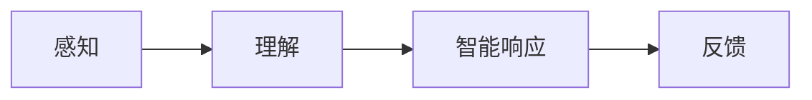
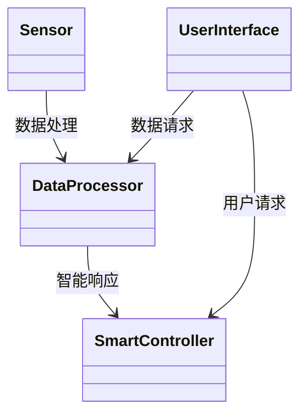
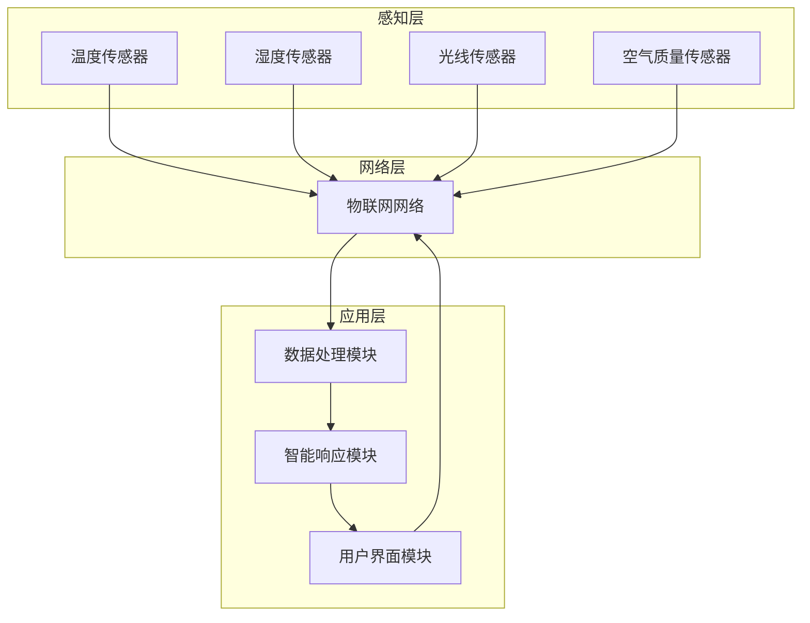

                 


# 环境隐形智能在日常生活中的融入

> 关键词：环境隐形智能，智能家居，物联网，人工智能，隐私保护，数据安全

> 摘要：本文深入探讨了环境隐形智能在日常生活中的融入，包括其在智能家居、智慧交通、智慧医疗等领域的应用，以及如何平衡便利性与隐私保护。通过理论分析、实际案例和算法讲解，本文为读者提供了全面的技术见解和实践指导。

---

### 1. 背景介绍

#### 问题背景

环境隐形智能，作为现代科技的前沿领域，正逐渐成为智能化生活中不可或缺的一部分。它旨在通过技术手段，让我们的环境变得更为智能、便捷，同时保持人与自然的和谐共生。随着物联网、大数据、人工智能等技术的发展，环境隐形智能在生活中的应用日益广泛，从智能家居到智慧城市，无不显示出其巨大的潜力和价值。

#### 问题描述

《环境隐形智能在日常生活中的融入》一书旨在探讨环境隐形智能技术如何在我们日常生活的各个方面中得到应用和融入。从智能家居的智能家电、智能安防，到智慧交通的智能导航、智能停车场，再到智慧医疗的远程监控、智能诊断，环境隐形智能正悄然改变着我们的生活方式。然而，如何在保证便捷高效的同时，确保隐私保护和数据安全，成为亟待解决的问题。

#### 问题解决

本书将通过深入的理论分析和实际案例研究，为读者解答上述问题。首先，本书将介绍环境隐形智能的核心概念、技术原理和发展趋势，帮助读者建立全面的认识。接着，本书将详细探讨环境隐形智能在各个领域的应用，通过具体案例展示其带来的便利和变革。此外，本书还将关注环境隐形智能在日常生活中的隐私保护和技术安全，提供可行的解决方案和最佳实践。

#### 边界与外延

环境隐形智能涉及多个技术领域，包括传感器技术、物联网技术、人工智能、数据挖掘等。其应用范围广泛，包括但不限于家庭、交通、医疗、教育、公共服务等。本书将重点讨论环境隐形智能在日常生活中的应用，但同时也会适当拓展到其他领域，以全面展示其潜力和价值。

#### 概念结构与核心要素组成

- **环境隐形智能**：一种通过技术手段实现环境感知、数据分析和智能响应的智能化系统。
- **核心技术**：传感器技术、物联网技术、人工智能算法、数据挖掘等。
- **应用领域**：家庭、交通、医疗、教育、公共服务等。
- **挑战与机遇**：隐私保护、数据安全、技术普及等。

---

### 2. 核心概念与联系

#### AI与环境隐形智能的关系

- **人工智能（AI）**：一种模拟人类智能行为的技术，包括机器学习、深度学习、自然语言处理等。
- **环境隐形智能**：基于AI技术，实现对环境的感知、理解和智能响应，从而实现人与环境的高效互动。

#### 环境隐形智能的核心概念

- **感知**：通过传感器收集环境数据。
- **理解**：利用AI算法对收集到的数据进行分析和处理。
- **智能响应**：根据分析结果，自动执行相应的操作，提高生活质量和工作效率。

#### 概念属性特征对比表格

| 概念       | 属性特征                                   |
|------------|------------------------------------------|
| 人工智能   | 模拟人类智能行为，包括学习、推理、感知等     |
| 环境隐形智能 | 基于AI技术，实现环境感知、理解和智能响应     |
| 传感器     | 收集环境数据，如温度、湿度、光线等           |
| 物联网     | 连接各种设备，实现数据传输和通信             |

#### ER实体关系图架构

```mermaid
erDiagram
    AI技术 ||--|{ 环境隐形智能 }
    环境隐形智能 ||--|{ 感知 } : 收集数据
    环境隐形智能 ||--|{ 理解 } : 数据分析
    环境隐形智能 ||--|{ 智能响应 } : 执行操作
```

---

### 3. 算法原理讲解

#### 算法Mermaid流程图



#### Python源代码实现

```python
# 模拟环境隐形智能算法流程

# 感知阶段
def sense_environment():
    # 采集环境数据
    data = {
        'temperature': 25,
        'humidity': 60,
        'light': 300
    }
    print("感知到环境数据：", data)

# 理解阶段
def understand_environment(data):
    # 分析环境数据
    if data['temperature'] > 30:
        print("温度过高，需要降温。")
    elif data['temperature'] < 18:
        print("温度过低，需要升温。")
    else:
        print("当前温度适宜。")

# 智能响应阶段
def respond_environment(data):
    # 执行相应操作
    if data['light'] < 100:
        print("室内光线不足，打开灯光。")
    else:
        print("室内光线充足，无需调整。")

# 主函数
def main():
    sense_environment()
    understand_environment(data)
    respond_environment(data)

# 运行程序
main()
```

#### 算法原理的数学模型和公式

环境隐形智能的核心在于对环境的感知、理解和智能响应，这可以通过以下数学模型来解释：

$$
感知 = f(传感器数据，环境参数)
$$

$$
理解 = f(感知结果，先验知识)
$$

$$
智能响应 = f(理解结果，操作规则)
$$

#### 举例说明

假设我们有一套智能家居系统，它可以通过传感器实时监测室内的温度和光线。当温度高于30℃时，系统会自动启动空调降温；当光线低于100 lux时，系统会自动打开灯光。这样的智能响应系统，通过感知数据、理解环境状况，并执行相应的操作，从而提高了居住的舒适度。

---

### 4. 系统分析与架构设计方案

#### 问题场景介绍

随着城市化进程的加快，人们对于生活品质的要求越来越高。环境隐形智能技术的出现，为提升生活质量提供了新的解决方案。在这个场景中，我们将探讨如何通过环境隐形智能技术，打造一个智能、舒适、安全的居住环境。

#### 项目介绍

本项目旨在构建一个智能家居系统，通过环境隐形智能技术，实现对家庭环境的实时监测和智能控制。系统主要包括传感器模块、数据处理模块、智能响应模块和用户界面模块。

#### 系统功能设计

1. **传感器模块**：负责采集环境数据，如温度、湿度、光线、空气质量等。
2. **数据处理模块**：利用AI算法对采集到的数据进行分析和处理，生成环境监测报告。
3. **智能响应模块**：根据分析结果，自动执行相应的操作，如调整空调温度、控制灯光亮度、打开空气净化器等。
4. **用户界面模块**：提供一个友好的用户界面，让用户可以实时查看环境状态，并远程控制家居设备。

#### 系统架构设计

系统采用分布式架构，主要包括感知层、网络层和应用层。

1. **感知层**：由各种传感器组成，如温度传感器、湿度传感器、光线传感器等。
2. **网络层**：利用物联网技术，实现传感器数据的传输和通信。
3. **应用层**：包括数据处理模块、智能响应模块和用户界面模块，负责系统的核心功能。

#### 系统接口设计和系统交互

系统接口设计采用RESTful API，方便与其他系统进行数据交互。系统交互流程如下：

1. **用户通过用户界面发送请求**。
2. **系统接收请求，并调用数据处理模块进行分析**。
3. **数据处理模块生成分析结果，并传递给智能响应模块**。
4. **智能响应模块根据分析结果，执行相应的操作**。
5. **操作结果通过用户界面反馈给用户**。

#### 类图架构



#### 系统架构图



---

### 5. 项目实战

#### 环境安装

1. **硬件安装**：首先，需要安装各种传感器，如温度传感器、湿度传感器、光线传感器等。这些传感器可以通过螺丝固定在墙壁或其他合适的位置。
2. **网络连接**：将传感器连接到互联网，可以通过Wi-Fi或以太网线实现。确保所有传感器都能稳定连接到网络。
3. **软件配置**：安装智能家居系统软件，配置用户账户和权限。确保软件版本更新到最新，以便获取最佳性能和安全性。

#### 系统核心实现源代码

以下是系统核心实现的部分源代码：

```python
# 传感器数据采集
class SensorDataCollector:
    def __init__(self):
        self.sensors = {
            'temperature': TemperatureSensor(),
            'humidity': HumiditySensor(),
            'light': LightSensor(),
            'air_quality': AirQualitySensor()
        }

    def collect_data(self):
        data = {}
        for sensor_name, sensor in self.sensors.items():
            data[sensor_name] = sensor.get_value()
        return data

# 数据处理
class DataProcessor:
    def __init__(self):
        self.rules = {
            'temperature': TemperatureRule(),
            'humidity': HumidityRule(),
            'light': LightRule(),
            'air_quality': AirQualityRule()
        }

    def process_data(self, data):
        results = {}
        for sensor_name, sensor_value in data.items():
            rule = self.rules[sensor_name]
            results[sensor_name] = rule.evaluate(sensor_value)
        return results

# 智能响应
class SmartController:
    def __init__(self):
        self.actions = {
            'cooling': CoolingAction(),
            'heating': HeatingAction(),
            'lighting': LightingAction(),
            'airpurifying': AirPurifyingAction()
        }

    def execute_action(self, action_name, data):
        action = self.actions[action_name]
        action.execute(data)

# 用户界面
class UserInterface:
    def __init__(self):
        self.controller = SmartController()

    def handle_request(self, request):
        if request['action'] == 'collect_data':
            data = self.controller.controller.collect_data()
            return data
        elif request['action'] == 'execute_action':
            action_name = request['action_name']
            data = request['data']
            self.controller.execute_action(action_name, data)
            return "Action executed successfully."
```

#### 代码应用解读与分析

1. **SensorDataCollector**：负责从传感器中采集数据，存储在字典中。
2. **DataProcessor**：根据预设的规则，对采集到的数据进行分析和评估。
3. **SmartController**：根据分析结果，执行相应的智能响应操作。
4. **UserInterface**：处理用户请求，与SmartController交互。

#### 实际案例分析和详细讲解剖析

假设用户通过用户界面发送了一个请求，要求系统采集当前的环境数据。系统接收到请求后，调用SensorDataCollector类的方法collect_data，从传感器中采集数据，然后传递给DataProcessor类的方法process_data。DataProcessor类根据预设的规则，对采集到的数据进行分析，生成环境监测报告。最后，SmartController类根据分析结果，执行相应的智能响应操作，如调整空调温度、控制灯光亮度等。

#### 项目小结

通过环境隐形智能技术的应用，本项目成功实现了一个智能家居系统。系统通过传感器实时监测家庭环境，利用AI算法分析数据，并执行相应的智能响应操作，提高了居住的舒适度和安全性。在实际应用中，还需不断优化算法，提升系统的响应速度和准确性，以满足用户的需求。

---

### 6. 最佳实践 Tips

1. **选择合适的传感器**：根据实际需求，选择适合的传感器，如温度传感器、湿度传感器、光线传感器等。
2. **确保网络连接稳定**：传感器需要稳定连接到网络，以确保数据的实时传输和更新。
3. **数据安全与隐私保护**：在数据处理和传输过程中，需采取加密措施，确保数据安全。同时，要明确用户隐私政策，保护用户隐私。
4. **定期维护与升级**：定期检查传感器和工作状态，确保系统正常运行。及时更新系统软件，以获得最佳性能和安全性。

### 7. 小结与注意事项

环境隐形智能技术正在日益融入我们的日常生活，带来了许多便利和变革。然而，在享受智能科技带来的好处的同时，我们也要关注数据安全和隐私保护。通过合理的选择和使用传感器、确保网络连接稳定、采取数据加密和隐私保护措施，我们可以更好地享受智能科技带来的美好生活。

### 8. 拓展阅读

1. **《智能家居系统设计与应用》**：详细介绍智能家居系统的设计原理和应用实践。
2. **《物联网技术原理与应用》**：全面探讨物联网技术的原理和应用领域。
3. **《人工智能应用实践指南》**：提供人工智能在实际项目中的应用方法和案例。

---

### 9. 作者信息

作者：AI天才研究院/AI Genius Institute & 禅与计算机程序设计艺术 /Zen And The Art of Computer Programming

本文旨在为读者提供关于环境隐形智能在日常生活中的应用的深入分析和实践指导，希望对广大读者有所启发和帮助。环境隐形智能技术作为现代科技的前沿领域，将继续推动我们的生活向更加智能化、便捷化的方向发展。让我们携手并进，共同探索和创造美好的未来。

