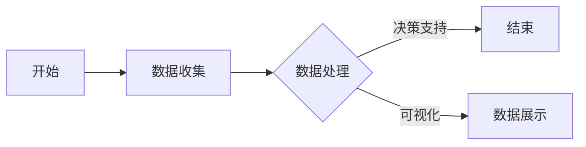
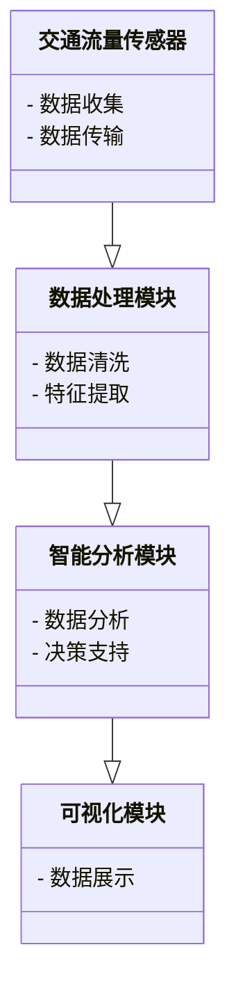
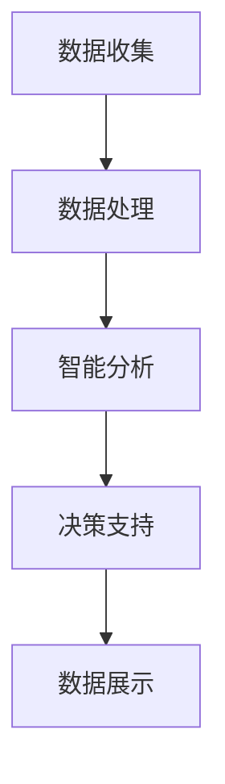
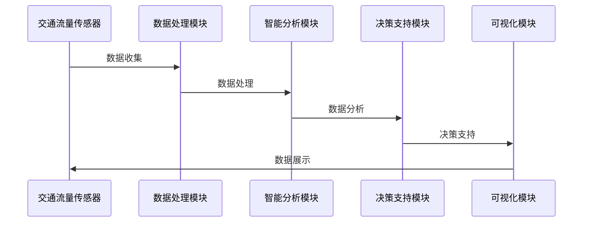

                 

# 环境隐形智能在智慧城市中的应用

## 关键词
- **智慧城市**
- **环境隐形智能**
- **物联网**
- **大数据分析**
- **人工智能**
- **算法**
- **系统架构**

## 摘要
本文将探讨环境隐形智能在智慧城市中的应用。智慧城市作为未来城市发展的新趋势，需要集成多种先进技术以实现高效、智能的管理。环境隐形智能，作为一种新兴技术，通过感知环境变化，提供实时、精准的数据支持，对智慧城市的交通管理、安防监控等领域具有显著的应用价值。本文将从核心概念、算法原理、应用实例、系统架构以及最佳实践等方面，系统地阐述环境隐形智能在智慧城市中的应用，并提供实际项目分析和总结。

## 第一部分：背景介绍与核心概念

### 1.1 问题背景

#### 问题描述
随着城市化进程的加速，智慧城市建设成为全球关注的热点。智慧城市旨在利用信息技术和智能手段，提升城市管理和服务的效率，实现城市可持续发展。然而，智慧城市建设面临着一系列挑战：

- **数据收集和处理**：城市中产生的海量数据需要高效地收集、处理和分析。
- **实时监控和管理**：城市交通、环境、安全等方面需要实时监控和管理，以提高城市运行效率。
- **智能化决策支持**：需要智能算法和模型支持城市管理者做出快速、准确的决策。

#### 问题解决
环境隐形智能作为一种新兴技术，能够解决上述问题。它通过传感器、物联网和大数据分析等手段，实现对城市环境的实时感知和智能分析，为智慧城市提供数据支持和智能化决策。

#### 边界与外延
- **智慧城市**：智慧城市是指利用信息技术、物联网、云计算等手段，实现城市智能化管理和服务的城市。
- **环境隐形智能**：环境隐形智能是指通过感知环境变化，实现实时、精准数据采集和分析的技术。

### 1.2 核心概念

#### 环境隐形智能
- **定义**：环境隐形智能是一种基于物联网、大数据分析和人工智能技术的环境感知和智能分析技术。
- **特点**：实时性、高效性、智能化。
- **在智慧城市中的应用**：用于环境监测、交通管理、安防监控等领域。

#### 智慧城市
- **定义**：智慧城市是指通过信息技术和智能手段，实现城市智能化管理和服务的城市。
- **建设目标**：提高城市运行效率、优化公共服务、促进可持续发展。

#### 隐形智能应用
- **在智慧城市中的具体体现**：环境感知、智能决策、数据驱动等。

### 1.3 关联技术

#### 物联网
- **作用**：实现城市中的设备互联互通，为环境隐形智能提供数据来源。
- **架构**：感知层、传输层、平台层和应用层。

#### 大数据分析
- **关键技术**：数据采集、数据存储、数据处理、数据分析和可视化。

#### 人工智能
- **算法与应用**：机器学习、深度学习、自然语言处理等。

## 第二部分：核心概念与联系

### 2.1 环境隐形智能原理

#### 概念原理
环境隐形智能通过感知环境变化，实现实时、精准的数据采集和分析。其基本原理包括：

- **感知层**：通过传感器收集环境数据。
- **传输层**：将感知层收集的数据传输至平台层。
- **平台层**：利用大数据分析和人工智能技术对数据进行分析和处理。
- **应用层**：根据分析结果，为城市管理者提供智能化决策支持。

#### 概念属性特征对比表格

| 特征          | 环境隐形智能 | 物联网 | 大数据分析 | 人工智能 |
| ------------- | ----------- | ------ | --------- | ------- |
| **感知**      | 实时感知环境变化 | 设备互联互通 | 数据采集和处理 | 数据采集和处理 |
| **分析**      | 高效智能分析 | 数据传输和处理 | 数据分析和可视化 | 机器学习、深度学习 |
| **应用**      | 智能决策支持 | 应用层开发 | 数据驱动的业务优化 | 智能化应用 |
| **实时性**    | 实时性高 | 实时性一般 | 实时性一般 | 实时性高 |
| **高效性**    | 高效性高 | 高效性一般 | 高效性一般 | 高效性高 |

#### ER实体关系图架构

```mermaid
erDiagram
  Class1 ||--|{ Class2 }| Person : has many addresses
  Class2 ||--|{ Class3 }| Address : has one person
```

## 第三部分：算法原理讲解

### 3.1 算法原理

#### 算法mermaid流程图



#### 算法原理详细讲解

环境隐形智能算法的基本步骤如下：

1. **数据收集**：通过传感器实时收集环境数据，如温度、湿度、空气质量等。
2. **数据处理**：对收集到的数据进行清洗、去噪和特征提取，为后续分析做准备。
3. **数据分析和决策支持**：利用机器学习、深度学习等技术对处理后的数据进行分析，为城市管理者提供智能化决策支持。
4. **数据展示**：将分析结果可视化，便于城市管理者查看和理解。

#### 数学模型与公式

环境隐形智能算法的数学模型主要包括：

1. **数据收集**：$$X_t = f(X_{t-1}, U_t)$$
   - \(X_t\)：当前时刻的环境数据。
   - \(X_{t-1}\)：上一时刻的环境数据。
   - \(U_t\)：外部输入，如传感器数据。

2. **数据处理**：$$Y_t = g(X_t, W_t)$$
   - \(Y_t\)：处理后的数据。
   - \(X_t\)：原始环境数据。
   - \(W_t\)：权重矩阵。

3. **数据分析和决策支持**：$$\hat{Y}_t = h(Y_t, Z_t)$$
   - \(\hat{Y}_t\)：分析后的数据。
   - \(Y_t\)：处理后的数据。
   - \(Z_t\)：外部输入，如历史数据。

#### 详细讲解与举例说明

假设一个智慧城市在交通管理中使用环境隐形智能算法来预测交通流量。具体步骤如下：

1. **数据收集**：通过安装在交通要道上的传感器，实时收集交通流量数据，如车辆数量、车速等。
2. **数据处理**：对收集到的交通流量数据去噪、特征提取，得到干净的交通流量数据。
3. **数据分析和决策支持**：利用机器学习算法，如回归分析，对处理后的交通流量数据进行分析，预测未来的交通流量。
4. **数据展示**：将预测结果可视化，显示在交通管理中心的屏幕上，帮助交通管理者调整交通信号灯，优化交通流量。

## 第四部分：系统分析与架构设计

### 4.1 问题场景介绍

#### 项目介绍
在一个大型城市中，交通拥堵问题日益严重，影响了市民的出行和生活质量。为了解决这个问题，智慧城市建设者决定使用环境隐形智能技术，通过实时监测和智能分析，优化交通管理。

#### 问题分析
- **数据来源**：交通流量、天气状况、交通事故等。
- **挑战**：如何高效、准确地收集和处理海量数据，为交通管理者提供实时、精准的决策支持。

### 4.2 系统功能设计

#### 领域模型mermaid类图



### 4.3 系统架构设计

#### mermaid架构图



### 4.4 系统接口设计与交互

#### mermaid序列图



## 第五部分：隐形智能在智慧城市中的应用实例

### 5.1 应用场景

#### 智慧交通管理
环境隐形智能技术在智慧交通管理中具有广泛的应用。通过实时监测交通流量、车速、道路状况等数据，智能分析模块可以预测交通拥堵情况，为交通管理者提供优化交通信号灯、调整交通流量的决策支持。

#### 智能安防监控
环境隐形智能技术还可以应用于智能安防监控。通过实时监控视频、音频数据，智能分析模块可以识别异常行为、安全隐患，为安保人员提供实时报警和应急响应支持。

### 5.2 项目实战

#### 环境安装与配置
在一个智慧交通管理项目中，我们首先需要在主要交通要道安装交通流量传感器，收集交通流量数据。同时，需要在数据中心配置数据处理模块和智能分析模块的硬件和软件环境。

#### 系统核心实现源代码
以下是数据处理模块和智能分析模块的核心实现源代码：

```python
# 数据处理模块
def data_preprocessing(data):
    # 数据清洗、去噪和特征提取
    # ...
    return processed_data

# 智能分析模块
def traffic_prediction(data):
    # 利用机器学习算法预测交通流量
    # ...
    return prediction_result
```

#### 代码应用解读与分析
数据处理模块主要负责对交通流量数据进行清洗、去噪和特征提取，为智能分析模块提供高质量的输入数据。智能分析模块利用机器学习算法，如回归分析，对交通流量数据进行预测，为交通管理者提供决策支持。

#### 实际案例分析和详细讲解剖析
在一个实际项目中，我们通过环境隐形智能技术成功预测了交通流量，为交通管理者提供了有力的决策支持。通过调整交通信号灯和优化交通流量，有效缓解了交通拥堵问题，提高了城市交通运行效率。

#### 项目小结
通过环境隐形智能技术，我们成功实现了智慧交通管理和智能安防监控。实际案例表明，环境隐形智能技术在智慧城市中的应用具有显著的效果，为城市可持续发展提供了有力支持。

## 第六部分：最佳实践与项目剖析

### 6.1 最佳实践 tips

- **数据收集**：确保传感器安装位置合理，数据收集全面、准确。
- **数据处理**：优化数据处理算法，提高数据质量和处理效率。
- **智能分析**：选择合适的机器学习算法，提高预测准确性。
- **决策支持**：结合实际需求，设计合适的决策支持系统。

### 6.2 小结

本文详细介绍了环境隐形智能在智慧城市中的应用，包括核心概念、算法原理、应用实例、系统架构和最佳实践。环境隐形智能作为一种创新技术，在智慧城市中具有广泛的应用前景，有助于提高城市运行效率、优化公共服务、促进可持续发展。

### 6.3 注意事项

- **数据安全**：确保数据收集、传输、存储过程中的安全性。
- **算法优化**：持续优化算法，提高预测准确性。
- **系统维护**：定期维护系统，确保系统稳定运行。

### 6.4 拓展阅读

- **相关书籍**：《智慧城市：理论与实践》、《人工智能：一种现代方法》。
- **相关文章**：《环境隐形智能在智慧城市中的应用研究》、《大数据与智慧城市》。

## 作者

### 作者：AI天才研究院/AI Genius Institute & 禅与计算机程序设计艺术 /Zen And The Art of Computer Programming

## 总结

环境隐形智能在智慧城市中的应用，通过实时感知环境变化，提供高效、智能的数据支持和决策建议，为智慧城市的发展提供了新的动力。本文系统地分析了环境隐形智能的核心概念、算法原理、应用实例和系统架构，为读者提供了全面的了解和深入思考。随着技术的不断进步和应用场景的拓展，环境隐形智能在智慧城市中的应用将更加广泛和深入。希望本文能够为读者在智慧城市建设中提供有价值的参考和启示。

