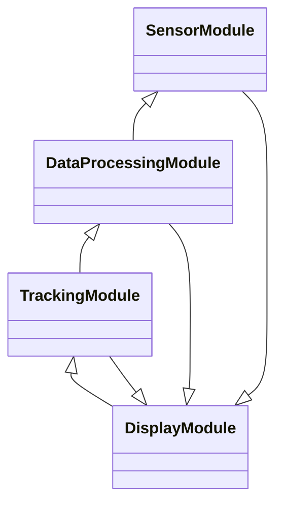
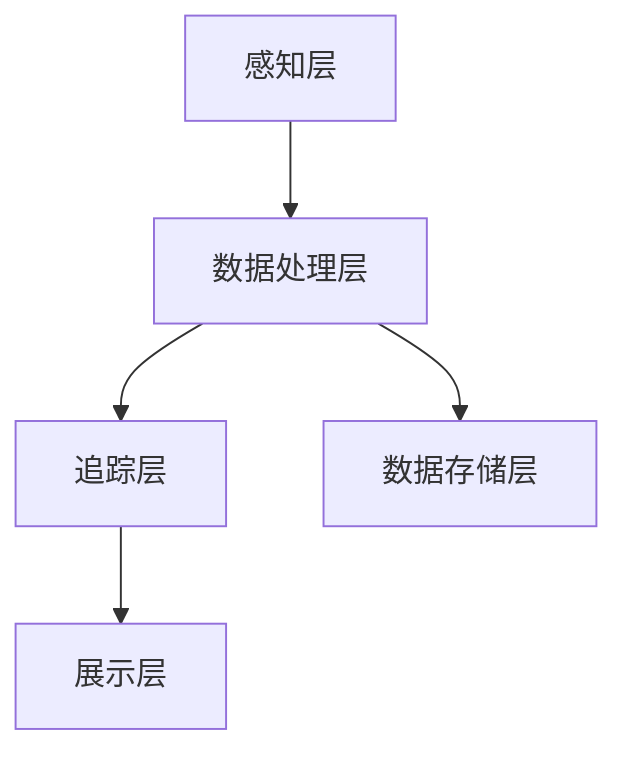
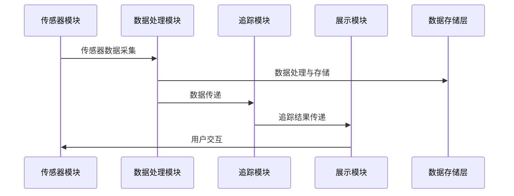
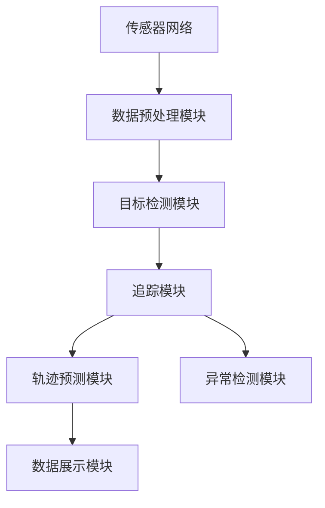

                 

### # 环境隐形智能：小型传感器实现大规模追踪

关键词：环境隐形智能、小型传感器、大规模追踪、传感器网络、数据处理

摘要：随着物联网技术的迅速发展，环境隐形智能作为一种新兴的追踪技术，正逐渐成为学术界和工业界的研究热点。本文旨在探讨如何利用小型传感器实现大规模追踪，分析其技术原理、优化策略及系统架构设计。文章首先介绍了环境隐形智能的基本概念和背景，然后详细阐述了小型传感器的技术原理及其优化策略，接着探讨了追踪算法的基本原理和实现策略，并分析了大规模追踪系统的设计和实现。最后，文章通过实际项目案例展示了系统的安装与配置、核心实现源代码及代码应用解读。通过本文的详细分析，我们期望能够为相关领域的科研人员和开发者提供有价值的参考和指导。

### 第一部分：引言与背景

#### 第1章：环境隐形智能概述

##### 1.1.1 环境隐形智能的定义

环境隐形智能是指通过部署在环境中的小型传感器，实现对目标物体或现象的实时感知、追踪和分析，从而实现对环境的智能感知和响应。这一技术利用传感器网络的分布式特性，通过数据采集、传输和处理，实现对大量目标的高效追踪和管理。环境隐形智能的核心在于其感知能力，通过传感器网络的广泛覆盖和高效的数据处理，实现对复杂环境中的目标进行精准的追踪和分析。

##### 1.1.2 环境隐形智能的产生背景

环境隐形智能的产生背景可以追溯到物联网和传感器技术的快速发展。随着传感器技术的进步，传感器的尺寸、功耗和成本逐渐降低，使得大规模部署传感器网络成为可能。同时，物联网技术的发展为传感器网络提供了数据传输和处理的平台，使得传感器网络的数据采集、传输和处理变得更加高效和便捷。这些技术进步为环境隐形智能的实现提供了坚实的基础。

##### 1.1.3 环境隐形智能的发展现状

目前，环境隐形智能已经在多个领域得到了广泛应用，包括智慧城市、智能交通、智能物流和智能家居等。在智慧城市中，环境隐形智能技术可以用于实时监控城市的交通流量、空气质量、水质监测等；在智能交通中，可以用于车辆追踪、交通流量分析等；在智能物流中，可以用于货物追踪、物流路径优化等；在智能家居中，可以用于家居设备的智能控制、家庭安全监控等。这些应用场景充分展示了环境隐形智能技术的巨大潜力。

##### 1.1.4 小型传感器的作用与挑战

小型传感器是环境隐形智能的核心组成部分，其作用主要体现在以下几个方面：

1. **感知与采集**：小型传感器能够实时感知环境中的各种物理量，如温度、湿度、光照、气体浓度等，并将这些数据采集到传感器网络中。
2. **数据传输**：通过无线通信技术，小型传感器能够将采集到的数据传输到中心处理系统，实现远程监控和管理。
3. **数据处理**：传感器网络中的数据处理模块对传输的数据进行清洗、分析和处理，提取有用的信息，为环境隐形智能提供决策支持。

然而，小型传感器在应用中也面临着一些挑战：

1. **功耗与寿命**：由于小型传感器通常需要长时间工作，因此其功耗和寿命成为关键问题。优化传感器的功耗设计、选择合适的电池和能量收集技术是解决这一挑战的关键。
2. **数据传输可靠性**：在传感器网络中，数据传输的可靠性和稳定性是确保系统正常运行的基础。需要采用有效的数据传输协议和纠错机制来提高数据传输的可靠性。
3. **数据处理能力**：随着传感器网络规模的扩大，数据处理系统的计算能力和存储能力面临巨大挑战。需要设计高效的数据处理算法和分布式计算架构来应对这一挑战。

##### 1.1.5 大规模追踪的需求与应用场景

随着社会的不断发展和智能化需求的提高，大规模追踪技术变得越来越重要。大规模追踪的需求主要来自于以下几个方面：

1. **智慧城市**：智慧城市需要实时监控和管理大量的城市基础设施，如交通流量、空气质量、水资源等。大规模追踪技术可以帮助城市管理者快速响应突发事件，提高城市管理的效率和效果。
2. **智能交通**：智能交通系统需要实时追踪和监控大量的车辆和交通流量，以便实现交通流量优化、路径规划等功能。大规模追踪技术可以提供准确和实时的交通数据，为交通管理者提供科学决策依据。
3. **智能物流**：智能物流系统需要对运输过程中的货物进行实时追踪和管理，以确保货物的安全和及时交付。大规模追踪技术可以提供准确的物流数据，优化物流路径和资源分配。
4. **公共安全**：在公共安全领域，大规模追踪技术可以用于监控和追踪犯罪分子、逃犯等，提高公共安全水平。

在实际应用场景中，大规模追踪技术可以应用于以下领域：

1. **智能安防**：通过部署传感器网络，实现对公共场所的实时监控和追踪，提高公共安全水平。
2. **环境监测**：通过部署传感器网络，实现对环境污染源的追踪和监控，提高环境保护效果。
3. **智能交通**：通过部署传感器网络，实现对交通流量、车辆位置和事故现场的追踪，优化交通管理和调度。
4. **智能家居**：通过部署传感器网络，实现对家居设备和环境的实时监测和追踪，提供更智能化的家居体验。

#### 1.1节：核心概念与联系

##### 1.1.1 小型传感器原理

小型传感器的原理基于物理、化学和生物学的原理，通过检测环境中的物理量或化学变化，将其转化为电信号，然后通过信号处理电路将电信号转换为数字信号，以便于传输和处理。以下是小型传感器的工作原理、主要类型、挑战与展望：

**1.1.1.1 工作原理**

小型传感器的工作原理通常包括以下几个步骤：

1. **感知与检测**：传感器通过其敏感元件检测环境中的物理量或化学变化，如温度、湿度、光照、气体浓度等。
2. **信号转换**：敏感元件检测到的物理量或化学变化通过信号转换电路转化为电信号。
3. **信号处理**：电信号经过放大、滤波等处理后，转换为数字信号，以便于传输和处理。

**1.1.1.2 主要类型**

小型传感器根据其检测的物理量或化学变化的不同，可以分为多种类型，包括但不限于以下几种：

1. **温度传感器**：通过检测温度变化，将温度转化为电信号。
2. **湿度传感器**：通过检测空气中的湿度变化，将湿度转化为电信号。
3. **光照传感器**：通过检测光照强度变化，将光照转化为电信号。
4. **气体传感器**：通过检测特定气体浓度的变化，将气体浓度转化为电信号。

**1.1.1.3 挑战与展望**

小型传感器在应用中面临以下挑战：

1. **功耗与寿命**：小型传感器通常需要长时间工作，因此功耗和寿命是关键问题。需要设计低功耗的传感器和选择合适的电池技术来延长传感器的工作寿命。
2. **数据传输可靠性**：在传感器网络中，数据传输的可靠性和稳定性是确保系统正常运行的基础。需要采用有效的数据传输协议和纠错机制来提高数据传输的可靠性。
3. **数据处理能力**：随着传感器网络规模的扩大，数据处理系统的计算能力和存储能力面临巨大挑战。需要设计高效的数据处理算法和分布式计算架构来应对这一挑战。

展望未来，小型传感器将在以下几个方面得到进一步发展：

1. **智能化**：通过引入人工智能技术，提高传感器的智能感知和数据处理能力。
2. **多功能化**：开发多功能传感器，实现对多种物理量或化学变化的检测。
3. **微型化**：通过材料科学和微电子技术的进步，实现传感器的微型化和集成化。

##### 1.1.2 追踪算法原理

追踪算法是环境隐形智能的核心组成部分，用于实现对目标物体或现象的实时追踪和分析。以下是追踪算法的概述、特点、分类及其发展历程：

**1.1.2.1 算法概述**

追踪算法的基本原理是通过对传感器网络中采集到的数据进行处理，提取目标物体的特征信息，并根据这些特征信息进行目标追踪。追踪算法通常包括以下几个步骤：

1. **数据采集**：从传感器网络中采集目标物体的数据，包括位置、速度、方向等。
2. **特征提取**：对采集到的数据进行处理，提取目标物体的特征信息。
3. **目标匹配**：将特征信息与已有的目标数据库进行匹配，确定目标物体的位置和状态。
4. **轨迹预测**：根据目标物体的历史轨迹和当前状态，预测目标物体的未来位置和状态。

**1.1.2.2 算法特点**

追踪算法具有以下特点：

1. **实时性**：追踪算法需要实时处理传感器网络中采集到的数据，确保目标追踪的实时性。
2. **准确性**：追踪算法需要准确提取目标物体的特征信息，确保目标追踪的准确性。
3. **高效性**：追踪算法需要高效处理大量的传感器数据，确保目标追踪的高效性。
4. **鲁棒性**：追踪算法需要能够在复杂环境中稳定运行，对环境变化和传感器噪声具有较强的鲁棒性。

**1.1.2.3 算法分类**

根据追踪算法的工作原理和目标特征提取方式的不同，可以将追踪算法分为以下几类：

1. **基于特征的追踪算法**：这类算法通过提取目标物体的特征信息进行追踪，包括颜色、形状、纹理等特征。常见的算法有 Kalman 滤波、粒子滤波、Mean Shift 追踪等。
2. **基于模型的追踪算法**：这类算法通过建立目标物体的模型，根据模型参数进行追踪。常见的算法有运动模型追踪、模板匹配追踪等。
3. **基于数据关联的追踪算法**：这类算法通过分析传感器网络中多个传感器之间的数据关联性，进行目标追踪。常见的算法有基于贝叶斯网络的数据关联算法、基于粒子滤波的数据关联算法等。

**1.1.2.4 追踪算法的发展历程**

追踪算法的发展历程可以分为以下几个阶段：

1. **早期算法**：以 Kalman 滤波和 Mean Shift 追踪为代表的早期算法，主要基于数学模型和几何特征进行目标追踪。
2. **多模态追踪算法**：随着传感器技术的发展，多模态追踪算法逐渐出现，如基于视觉、红外、雷达等多源传感器数据融合的追踪算法。
3. **基于深度学习的追踪算法**：近年来，深度学习技术的发展为追踪算法带来了新的突破，如基于卷积神经网络（CNN）的视觉追踪算法、基于循环神经网络（RNN）的运动预测算法等。

##### 1.1.3 大规模追踪技术

大规模追踪技术是指用于实现对大量目标物体或现象的实时追踪和分析的技术。以下是大规模追踪技术的概述、挑战、发展趋势：

**1.1.3.1 技术概述**

大规模追踪技术主要涉及以下几个方面：

1. **数据采集**：通过部署传感器网络，实现对大量目标物体的实时数据采集。
2. **数据处理**：对采集到的海量数据进行高效的处理和分析，提取目标物体的特征信息。
3. **目标追踪**：根据目标特征信息，实现对大量目标的实时追踪。
4. **数据可视化**：将处理和分析结果通过可视化技术进行展示，为决策提供支持。

**1.1.3.2 技术挑战**

大规模追踪技术面临以下挑战：

1. **数据量巨大**：大规模追踪涉及的海量数据给数据处理和分析带来了巨大挑战，需要设计高效的数据处理算法和分布式计算架构。
2. **实时性要求**：大规模追踪需要对大量目标进行实时追踪，要求算法具有实时性，能够快速处理和分析数据。
3. **准确性要求**：大规模追踪需要准确提取目标物体的特征信息，确保追踪结果的准确性。
4. **可靠性要求**：大规模追踪需要在复杂环境中稳定运行，对环境变化和传感器噪声具有较强的鲁棒性。

**1.1.3.3 技术发展趋势**

随着技术的不断进步，大规模追踪技术将在以下几个方面得到进一步发展：

1. **多源数据融合**：通过融合多种传感器数据，提高追踪的准确性和实时性。
2. **人工智能技术**：引入人工智能技术，提高追踪算法的智能性和自主性。
3. **分布式计算**：采用分布式计算架构，提高数据处理和分析的效率。
4. **边缘计算**：将计算和存储能力下沉到边缘设备，降低数据传输延迟，提高系统响应速度。

#### 1.2节：数学模型和数学公式

##### 1.2.1 追踪算法数学模型

追踪算法的数学模型是描述目标运动状态和特征信息的关键工具。以下是追踪算法的数学模型、公式表达和模型参数分析：

**1.2.1.1 公式表达**

追踪算法的数学模型通常包括以下几个公式：

1. **目标位置更新公式**：

$$
x_t = x_{t-1} + v_t \Delta t
$$

其中，$x_t$ 表示目标在时间 $t$ 的位置，$x_{t-1}$ 表示目标在时间 $t-1$ 的位置，$v_t$ 表示目标在时间 $t$ 的速度，$\Delta t$ 表示时间间隔。

2. **目标速度更新公式**：

$$
v_t = v_{t-1} + a_t \Delta t
$$

其中，$v_t$ 表示目标在时间 $t$ 的速度，$v_{t-1}$ 表示目标在时间 $t-1$ 的速度，$a_t$ 表示目标在时间 $t$ 的加速度，$\Delta t$ 表示时间间隔。

3. **目标特征提取公式**：

$$
f_t = f(x_t, v_t)
$$

其中，$f_t$ 表示目标在时间 $t$ 的特征，$x_t$ 表示目标在时间 $t$ 的位置，$v_t$ 表示目标在时间 $t$ 的速度。

**1.2.1.2 模型参数分析**

追踪算法的模型参数主要包括位置、速度、加速度和特征参数。以下是对这些参数的分析：

1. **位置参数**：位置参数描述了目标在空间中的位置，通常用坐标表示。位置参数的变化反映了目标的移动情况。
2. **速度参数**：速度参数描述了目标的移动速度，通常用速度矢量表示。速度参数的变化反映了目标的加速度情况。
3. **加速度参数**：加速度参数描述了目标的加速度，通常用加速度矢量表示。加速度参数的变化反映了目标速度的变化情况。
4. **特征参数**：特征参数描述了目标的特征信息，如颜色、形状、纹理等。特征参数的变化反映了目标的外观变化。

##### 1.2.2 大规模追踪数学模型

大规模追踪的数学模型是描述大量目标物体或现象的追踪过程和特征信息的关键工具。以下是大规模追踪的数学模型、公式表达和模型应用：

**1.2.2.1 公式表达**

大规模追踪的数学模型通常包括以下几个公式：

1. **目标位置更新公式**：

$$
x_{ij,t} = x_{ij,t-1} + v_{ij,t} \Delta t
$$

其中，$x_{ij,t}$ 表示目标 $i$ 在时间 $t$ 的位置，$x_{ij,t-1}$ 表示目标 $i$ 在时间 $t-1$ 的位置，$v_{ij,t}$ 表示目标 $i$ 在时间 $t$ 的速度，$\Delta t$ 表示时间间隔。

2. **目标速度更新公式**：

$$
v_{ij,t} = v_{ij,t-1} + a_{ij,t} \Delta t
$$

其中，$v_{ij,t}$ 表示目标 $i$ 在时间 $t$ 的速度，$v_{ij,t-1}$ 表示目标 $i$ 在时间 $t-1$ 的速度，$a_{ij,t}$ 表示目标 $i$ 在时间 $t$ 的加速度，$\Delta t$ 表示时间间隔。

3. **目标特征提取公式**：

$$
f_{ij,t} = f(x_{ij,t}, v_{ij,t})
$$

其中，$f_{ij,t}$ 表示目标 $i$ 在时间 $t$ 的特征，$x_{ij,t}$ 表示目标 $i$ 在时间 $t$ 的位置，$v_{ij,t}$ 表示目标 $i$ 在时间 $t$ 的速度。

**1.2.2.2 模型应用**

大规模追踪数学模型可以应用于以下几个方面：

1. **目标轨迹预测**：通过目标位置和速度的更新公式，可以预测目标在未来的位置和状态。
2. **目标分类**：通过目标特征提取公式，可以提取目标的外观特征，用于目标分类和识别。
3. **目标行为分析**：通过分析目标的位置、速度和特征变化，可以了解目标的行为特征和运动模式。

#### 1.3节：系统架构设计

##### 1.3.1 系统功能设计

系统功能设计是系统架构设计的基础，它定义了系统的功能模块及其相互作用。以下是系统功能设计的内容、领域模型类图及其说明：

**1.3.1.1 系统功能设计**

系统功能设计主要包括以下几个模块：

1. **传感器模块**：负责采集环境中的物理量数据，如温度、湿度、光照等。
2. **数据处理模块**：负责对传感器采集的数据进行清洗、预处理和分析。
3. **追踪模块**：负责对处理后的数据进行分析，提取目标特征，进行目标追踪。
4. **展示模块**：负责将追踪结果以图形或表格的形式展示给用户。

**1.3.1.2 领域模型类图**

领域模型类图是系统功能设计的图形表示，它描述了系统的功能模块及其关系。以下是系统功能设计的领域模型类图：



**1.3.1.3 类图说明**

1. **SensorModule**：传感器模块，负责采集环境数据，包括温度、湿度、光照等。
2. **DataProcessingModule**：数据处理模块，负责对采集到的数据进行分析和预处理，提取有用的信息。
3. **TrackingModule**：追踪模块，负责对处理后的数据进行分析，提取目标特征，进行目标追踪。
4. **DisplayModule**：展示模块，负责将追踪结果以图形或表格的形式展示给用户。

##### 1.3.2 系统架构设计

系统架构设计是系统功能设计的高级抽象，它描述了系统的整体结构和组件之间的相互作用。以下是系统架构设计的内容、系统架构图及其说明：

**1.3.2.1 系统架构概述**

系统架构设计主要包括以下几个层次：

1. **感知层**：包括传感器模块，负责采集环境数据。
2. **数据处理层**：包括数据处理模块，负责对采集到的数据进行分析和预处理。
3. **追踪层**：包括追踪模块，负责对处理后的数据进行分析，提取目标特征，进行目标追踪。
4. **展示层**：包括展示模块，负责将追踪结果以图形或表格的形式展示给用户。

**1.3.2.2 系统架构图**

以下是系统架构图：



**1.3.2.3 架构说明**

1. **感知层**：传感器模块采集环境数据，包括温度、湿度、光照等，这些数据通过无线通信传输到数据处理层。
2. **数据处理层**：数据处理模块对采集到的数据进行分析和预处理，提取有用的信息，并将其存储在数据存储层。
3. **追踪层**：追踪模块根据数据存储层中的数据，提取目标特征，进行目标追踪，并将追踪结果传递给展示层。
4. **展示层**：展示模块将追踪结果以图形或表格的形式展示给用户，以便用户进行数据分析和决策。

##### 1.3.3 系统接口设计

系统接口设计是系统架构设计的重要组成部分，它定义了系统各模块之间的交互接口。以下是系统接口设计的内容、接口定义及其调用流程：

**1.3.3.1 接口定义**

系统接口设计主要包括以下几个接口：

1. **传感器数据采集接口**：定义了传感器模块与数据处理层之间的数据传输接口，包括数据格式、传输速率和传输协议等。
2. **数据处理接口**：定义了数据处理模块与追踪层之间的数据传输接口，包括数据处理算法、数据格式和传输协议等。
3. **追踪结果接口**：定义了追踪模块与展示层之间的数据传输接口，包括追踪结果格式、传输速率和传输协议等。

**1.3.3.2 接口调用流程**

以下是系统接口调用流程：

1. **传感器数据采集**：传感器模块采集环境数据，通过传感器数据采集接口将数据传输到数据处理层。
2. **数据处理**：数据处理模块接收到传感器数据后，对其进行处理，提取有用的信息，并通过数据处理接口将处理结果存储在数据存储层。
3. **追踪分析**：追踪模块根据数据存储层中的数据，进行目标追踪，并通过追踪结果接口将追踪结果传递给展示层。
4. **结果展示**：展示模块接收到追踪结果后，将其以图形或表格的形式展示给用户。

##### 1.3.4 系统交互设计

系统交互设计是系统架构设计的一部分，它描述了系统组件之间的交互过程。以下是系统交互设计的内容、系统交互序列图及其说明：

**1.3.4.1 系统交互序列图**

以下是系统交互序列图：



**1.3.4.2 交互流程分析**

以下是系统交互流程分析：

1. **传感器数据采集**：传感器模块采集环境数据，并将其传输到数据处理模块。
2. **数据处理**：数据处理模块对采集到的数据进行分析和预处理，提取有用的信息，并将其存储在数据存储层。
3. **追踪分析**：追踪模块根据数据存储层中的数据，提取目标特征，进行目标追踪，并将追踪结果传递给展示模块。
4. **结果展示**：展示模块将追踪结果以图形或表格的形式展示给用户，用户可以与系统进行交互，反馈操作需求。

### 第一部分：引言与背景

#### 第1章：环境隐形智能概述

##### 1.1.1 环境隐形智能的定义

环境隐形智能是指利用传感器网络实现环境中的目标物体或现象的实时感知、追踪和分析。它通过部署在环境中的小型传感器，采集目标物体的位置、速度、方向等特征信息，并通过数据传输和处理，实现对目标的高效追踪和管理。环境隐形智能的核心在于其感知能力，通过传感器网络的分布式特性，实现对复杂环境中的目标进行精准的追踪和分析。

##### 1.1.2 环境隐形智能的产生背景

环境隐形智能的产生背景可以追溯到物联网和传感器技术的快速发展。随着物联网技术的普及，传感器网络的应用场景越来越广泛，从工业自动化、智能家居到智能交通、智慧城市等领域。传感器技术的进步使得传感器的尺寸、功耗和成本逐渐降低，使得大规模部署传感器网络成为可能。此外，人工智能技术的发展为环境隐形智能提供了强大的数据处理和分析能力，使得环境隐形智能从理论研究走向实际应用。

##### 1.1.3 环境隐形智能的发展现状

目前，环境隐形智能已经在多个领域得到了广泛应用，如智慧城市、智能交通、智能物流和智能家居等。在智慧城市中，环境隐形智能技术可以用于实时监控城市的交通流量、空气质量、水资源等；在智能交通中，可以用于车辆追踪、交通流量分析等；在智能物流中，可以用于货物追踪、物流路径优化等；在智能家居中，可以用于家居设备的智能控制、家庭安全监控等。这些应用场景充分展示了环境隐形智能技术的巨大潜力。

同时，环境隐形智能技术也在不断发展，不断有新的研究成果和技术应用涌现。例如，基于深度学习的目标追踪算法、多传感器数据融合技术、边缘计算技术等，都在提高环境隐形智能系统的性能和可靠性方面发挥了重要作用。

##### 1.1.4 小型传感器的作用与挑战

小型传感器是环境隐形智能的核心组成部分，其作用主要体现在以下几个方面：

1. **感知与采集**：小型传感器能够实时感知环境中的物理量，如温度、湿度、光照、气体浓度等，并将这些数据采集到传感器网络中。
2. **数据传输**：通过无线通信技术，小型传感器能够将采集到的数据传输到中心处理系统，实现远程监控和管理。
3. **数据处理**：传感器网络中的数据处理模块对传输的数据进行清洗、分析和处理，提取有用的信息，为环境隐形智能提供决策支持。

然而，小型传感器在应用中也面临着一些挑战：

1. **功耗与寿命**：由于小型传感器通常需要长时间工作，因此功耗和寿命是关键问题。需要设计低功耗的传感器和选择合适的电池技术来延长传感器的工作寿命。
2. **数据传输可靠性**：在传感器网络中，数据传输的可靠性和稳定性是确保系统正常运行的基础。需要采用有效的数据传输协议和纠错机制来提高数据传输的可靠性。
3. **数据处理能力**：随着传感器网络规模的扩大，数据处理系统的计算能力和存储能力面临巨大挑战。需要设计高效的数据处理算法和分布式计算架构来应对这一挑战。

##### 1.1.5 大规模追踪的需求与应用场景

随着社会的不断发展和智能化需求的提高，大规模追踪技术变得越来越重要。大规模追踪的需求主要来自于以下几个方面：

1. **智慧城市**：智慧城市需要实时监控和管理大量的城市基础设施，如交通流量、空气质量、水资源等。大规模追踪技术可以帮助城市管理者快速响应突发事件，提高城市管理的效率和效果。
2. **智能交通**：智能交通系统需要实时追踪和监控大量的车辆和交通流量，以便实现交通流量优化、路径规划等功能。大规模追踪技术可以提供准确和实时的交通数据，为交通管理者提供科学决策依据。
3. **智能物流**：智能物流系统需要对运输过程中的货物进行实时追踪和管理，以确保货物的安全和及时交付。大规模追踪技术可以提供准确的物流数据，优化物流路径和资源分配。
4. **公共安全**：在公共安全领域，大规模追踪技术可以用于监控和追踪犯罪分子、逃犯等，提高公共安全水平。

在实际应用场景中，大规模追踪技术可以应用于以下领域：

1. **智能安防**：通过部署传感器网络，实现对公共场所的实时监控和追踪，提高公共安全水平。
2. **环境监测**：通过部署传感器网络，实现对环境污染源的追踪和监控，提高环境保护效果。
3. **智能交通**：通过部署传感器网络，实现对交通流量、车辆位置和事故现场的追踪，优化交通管理和调度。
4. **智能家居**：通过部署传感器网络，实现对家居设备和环境的实时监测和追踪，提供更智能化的家居体验。

#### 1.1节：核心概念与联系

##### 1.1.1 小型传感器原理

小型传感器是环境隐形智能的重要组成部分，其原理基于物理、化学和生物学的原理，通过检测环境中的物理量或化学变化，将其转化为电信号，然后通过信号处理电路将电信号转换为数字信号，以便于传输和处理。以下是小型传感器的工作原理、主要类型、挑战与展望：

**1.1.1.1 工作原理**

小型传感器的工作原理通常包括以下几个步骤：

1. **感知与检测**：传感器通过其敏感元件检测环境中的物理量或化学变化，如温度、湿度、光照、气体浓度等。
2. **信号转换**：敏感元件检测到的物理量或化学变化通过信号转换电路转化为电信号。
3. **信号处理**：电信号经过放大、滤波等处理后，转换为数字信号，以便于传输和处理。

**1.1.1.2 主要类型**

小型传感器根据其检测的物理量或化学变化的不同，可以分为多种类型，包括但不限于以下几种：

1. **温度传感器**：通过检测温度变化，将温度转化为电信号。
2. **湿度传感器**：通过检测空气中的湿度变化，将湿度转化为电信号。
3. **光照传感器**：通过检测光照强度变化，将光照转化为电信号。
4. **气体传感器**：通过检测特定气体浓度的变化，将气体浓度转化为电信号。

**1.1.1.3 挑战与展望**

小型传感器在应用中面临以下挑战：

1. **功耗与寿命**：由于小型传感器通常需要长时间工作，因此功耗和寿命是关键问题。需要设计低功耗的传感器和选择合适的电池技术来延长传感器的工作寿命。
2. **数据传输可靠性**：在传感器网络中，数据传输的可靠性和稳定性是确保系统正常运行的基础。需要采用有效的数据传输协议和纠错机制来提高数据传输的可靠性。
3. **数据处理能力**：随着传感器网络规模的扩大，数据处理系统的计算能力和存储能力面临巨大挑战。需要设计高效的数据处理算法和分布式计算架构来应对这一挑战。

展望未来，小型传感器将在以下几个方面得到进一步发展：

1. **智能化**：通过引入人工智能技术，提高传感器的智能感知和数据处理能力。
2. **多功能化**：开发多功能传感器，实现对多种物理量或化学变化的检测。
3. **微型化**：通过材料科学和微电子技术的进步，实现传感器的微型化和集成化。

##### 1.1.2 追踪算法原理

追踪算法是环境隐形智能的核心组成部分，用于实现对目标物体或现象的实时追踪和分析。以下是追踪算法的概述、特点、分类及其发展历程：

**1.1.2.1 算法概述**

追踪算法的基本原理是通过对传感器网络中采集到的数据进行处理，提取目标物体的特征信息，并根据这些特征信息进行目标追踪。追踪算法通常包括以下几个步骤：

1. **数据采集**：从传感器网络中采集目标物体的数据，包括位置、速度、方向等。
2. **特征提取**：对采集到的数据进行处理，提取目标物体的特征信息。
3. **目标匹配**：将特征信息与已有的目标数据库进行匹配，确定目标物体的位置和状态。
4. **轨迹预测**：根据目标物体的历史轨迹和当前状态，预测目标物体的未来位置和状态。

**1.1.2.2 算法特点**

追踪算法具有以下特点：

1. **实时性**：追踪算法需要实时处理传感器网络中采集到的数据，确保目标追踪的实时性。
2. **准确性**：追踪算法需要准确提取目标物体的特征信息，确保目标追踪的准确性。
3. **高效性**：追踪算法需要高效处理大量的传感器数据，确保目标追踪的高效性。
4. **鲁棒性**：追踪算法需要能够在复杂环境中稳定运行，对环境变化和传感器噪声具有较强的鲁棒性。

**1.1.2.3 算法分类**

根据追踪算法的工作原理和目标特征提取方式的不同，可以将追踪算法分为以下几类：

1. **基于特征的追踪算法**：这类算法通过提取目标物体的特征信息进行追踪，包括颜色、形状、纹理等特征。常见的算法有 Kalman 滤波、粒子滤波、Mean Shift 追踪等。
2. **基于模型的追踪算法**：这类算法通过建立目标物体的模型，根据模型参数进行追踪。常见的算法有运动模型追踪、模板匹配追踪等。
3. **基于数据关联的追踪算法**：这类算法通过分析传感器网络中多个传感器之间的数据关联性，进行目标追踪。常见的算法有基于贝叶斯网络的数据关联算法、基于粒子滤波的数据关联算法等。

**1.1.2.4 追踪算法的发展历程**

追踪算法的发展历程可以分为以下几个阶段：

1. **早期算法**：以 Kalman 滤波和 Mean Shift 追踪为代表的早期算法，主要基于数学模型和几何特征进行目标追踪。
2. **多模态追踪算法**：随着传感器技术的发展，多模态追踪算法逐渐出现，如基于视觉、红外、雷达等多源传感器数据融合的追踪算法。
3. **基于深度学习的追踪算法**：近年来，深度学习技术的发展为追踪算法带来了新的突破，如基于卷积神经网络（CNN）的视觉追踪算法、基于循环神经网络（RNN）的运动预测算法等。

##### 1.1.3 大规模追踪技术

大规模追踪技术是指用于实现对大量目标物体或现象的实时追踪和分析的技术。以下是大规模追踪技术的概述、挑战、发展趋势：

**1.1.3.1 技术概述**

大规模追踪技术主要涉及以下几个方面：

1. **数据采集**：通过部署传感器网络，实现对大量目标物体的实时数据采集。
2. **数据处理**：对采集到的海量数据进行高效的处理和分析，提取目标物体的特征信息。
3. **目标追踪**：根据目标特征信息，实现对大量目标的实时追踪。
4. **数据可视化**：将处理和分析结果通过可视化技术进行展示，为决策提供支持。

**1.1.3.2 技术挑战**

大规模追踪技术面临以下挑战：

1. **数据量巨大**：大规模追踪涉及的海量数据给数据处理和分析带来了巨大挑战，需要设计高效的数据处理算法和分布式计算架构。
2. **实时性要求**：大规模追踪需要对大量目标进行实时追踪，要求算法具有实时性，能够快速处理和分析数据。
3. **准确性要求**：大规模追踪需要准确提取目标物体的特征信息，确保追踪结果的准确性。
4. **可靠性要求**：大规模追踪需要在复杂环境中稳定运行，对环境变化和传感器噪声具有较强的鲁棒性。

**1.1.3.3 技术发展趋势**

随着技术的不断进步，大规模追踪技术将在以下几个方面得到进一步发展：

1. **多源数据融合**：通过融合多种传感器数据，提高追踪的准确性和实时性。
2. **人工智能技术**：引入人工智能技术，提高追踪算法的智能性和自主性。
3. **分布式计算**：采用分布式计算架构，提高数据处理和分析的效率。
4. **边缘计算**：将计算和存储能力下沉到边缘设备，降低数据传输延迟，提高系统响应速度。

#### 1.2节：数学模型和数学公式

##### 1.2.1 追踪算法数学模型

追踪算法的数学模型是描述目标运动状态和特征信息的关键工具。以下是追踪算法的数学模型、公式表达和模型参数分析：

**1.2.1.1 公式表达**

追踪算法的数学模型通常包括以下几个公式：

1. **目标位置更新公式**：

$$
x_t = x_{t-1} + v_t \Delta t
$$

其中，$x_t$ 表示目标在时间 $t$ 的位置，$x_{t-1}$ 表示目标在时间 $t-1$ 的位置，$v_t$ 表示目标在时间 $t$ 的速度，$\Delta t$ 表示时间间隔。

2. **目标速度更新公式**：

$$
v_t = v_{t-1} + a_t \Delta t
$$

其中，$v_t$ 表示目标在时间 $t$ 的速度，$v_{t-1}$ 表示目标在时间 $t-1$ 的速度，$a_t$ 表示目标在时间 $t$ 的加速度，$\Delta t$ 表示时间间隔。

3. **目标特征提取公式**：

$$
f_t = f(x_t, v_t)
$$

其中，$f_t$ 表示目标在时间 $t$ 的特征，$x_t$ 表示目标在时间 $t$ 的位置，$v_t$ 表示目标在时间 $t$ 的速度。

**1.2.1.2 模型参数分析**

追踪算法的模型参数主要包括位置、速度、加速度和特征参数。以下是对这些参数的分析：

1. **位置参数**：位置参数描述了目标在空间中的位置，通常用坐标表示。位置参数的变化反映了目标的移动情况。
2. **速度参数**：速度参数描述了目标的移动速度，通常用速度矢量表示。速度参数的变化反映了目标的加速度情况。
3. **加速度参数**：加速度参数描述了目标的加速度，通常用加速度矢量表示。加速度参数的变化反映了目标速度的变化情况。
4. **特征参数**：特征参数描述了目标的特征信息，如颜色、形状、纹理等。特征参数的变化反映了目标的外观变化。

##### 1.2.2 大规模追踪数学模型

大规模追踪的数学模型是描述大量目标物体或现象的追踪过程和特征信息的关键工具。以下是大规模追踪的数学模型、公式表达和模型应用：

**1.2.2.1 公式表达**

大规模追踪的数学模型通常包括以下几个公式：

1. **目标位置更新公式**：

$$
x_{ij,t} = x_{ij,t-1} + v_{ij,t} \Delta t
$$

其中，$x_{ij,t}$ 表示目标 $i$ 在时间 $t$ 的位置，$x_{ij,t-1}$ 表示目标 $i$ 在时间 $t-1$ 的位置，$v_{ij,t}$ 表示目标 $i$ 在时间 $t$ 的速度，$\Delta t$ 表示时间间隔。

2. **目标速度更新公式**：

$$
v_{ij,t} = v_{ij,t-1} + a_{ij,t} \Delta t
$$

其中，$v_{ij,t}$ 表示目标 $i$ 在时间 $t$ 的速度，$v_{ij,t-1}$ 表示目标 $i$ 在时间 $t-1$ 的速度，$a_{ij,t}$ 表示目标 $i$ 在时间 $t$ 的加速度，$\Delta t$ 表示时间间隔。

3. **目标特征提取公式**：

$$
f_{ij,t} = f(x_{ij,t}, v_{ij,t})
$$

其中，$f_{ij,t}$ 表示目标 $i$ 在时间 $t$ 的特征，$x_{ij,t}$ 表示目标 $i$ 在时间 $t$ 的位置，$v_{ij,t}$ 表示目标 $i$ 在时间 $t$ 的速度。

**1.2.2.2 模型应用**

大规模追踪数学模型可以应用于以下几个方面：

1. **目标轨迹预测**：通过目标位置和速度的更新公式，可以预测目标在未来的位置和状态。
2. **目标分类**：通过目标特征提取公式，可以提取目标的外观特征，用于目标分类和识别。
3. **目标行为分析**：通过分析目标的位置、速度和特征变化，可以了解目标的行为特征和运动模式。

#### 1.3节：系统架构设计

##### 1.3.1 系统功能设计

系统功能设计是系统架构设计的基础，它定义了系统的功能模块及其相互作用。以下是系统功能设计的内容、领域模型类图及其说明：

**1.3.1.1 系统功能设计**

系统功能设计主要包括以下几个模块：

1. **传感器模块**：负责采集环境数据，如温度、湿度、光照等。
2. **数据处理模块**：负责对传感器采集的数据进行预处理和分析。
3. **追踪模块**：负责根据处理后的数据提取目标特征，进行目标追踪。
4. **展示模块**：负责将追踪结果以图形或表格的形式展示给用户。

**1.3.1.2 领域模型类图**

以下是系统功能设计的领域模型类图：


**1.3.1.3 类图说明**

1. **SensorModule**：传感器模块，负责采集环境数据，包括温度、湿度、光照等。
2. **DataProcessingModule**：数据处理模块，负责对传感器采集的数据进行预处理和分析，提取有用的信息。
3. **TrackingModule**：追踪模块，负责根据处理后的数据提取目标特征，进行目标追踪。
4. **DisplayModule**：展示模块，负责将追踪结果以图形或表格的形式展示给用户。

##### 1.3.2 系统架构设计

系统架构设计是系统功能设计的高级抽象，它描述了系统的整体结构和组件之间的相互作用。以下是系统架构设计的内容、系统架构图及其说明：

**1.3.2.1 系统架构概述**

系统架构设计主要包括以下几个层次：

1. **感知层**：包括传感器模块，负责采集环境数据。
2. **数据处理层**：包括数据处理模块，负责对采集到的数据进行分析和预处理。
3. **追踪层**：包括追踪模块，负责对处理后的数据进行分析，提取目标特征，进行目标追踪。
4. **展示层**：包括展示模块，负责将追踪结果以图形或表格的形式展示给用户。

**1.3.2.2 系统架构图**

以下是系统架构图：


**1.3.2.3 架构说明**

1. **感知层**：传感器模块采集环境数据，包括温度、湿度、光照等，这些数据通过无线通信传输到数据处理层。
2. **数据处理层**：数据处理模块对采集到的数据进行分析和预处理，提取有用的信息，并将其存储在数据存储层。
3. **追踪层**：追踪模块根据数据存储层中的数据，提取目标特征，进行目标追踪，并将追踪结果传递给展示层。
4. **展示层**：展示模块将追踪结果以图形或表格的形式展示给用户，以便用户进行数据分析和决策。

##### 1.3.3 系统接口设计

系统接口设计是系统架构设计的重要组成部分，它定义了系统各模块之间的交互接口。以下是系统接口设计的内容、接口定义及其调用流程：

**1.3.3.1 接口定义**

系统接口设计主要包括以下几个接口：

1. **传感器数据采集接口**：定义了传感器模块与数据处理层之间的数据传输接口，包括数据格式、传输速率和传输协议等。
2. **数据处理接口**：定义了数据处理模块与追踪层之间的数据传输接口，包括数据处理算法、数据格式和传输协议等。
3. **追踪结果接口**：定义了追踪模块与展示层之间的数据传输接口，包括追踪结果格式、传输速率和传输协议等。

**1.3.3.2 接口调用流程**

以下是系统接口调用流程：

1. **传感器数据采集**：传感器模块采集环境数据，通过传感器数据采集接口将数据传输到数据处理层。
2. **数据处理**：数据处理模块接收到传感器数据后，对其进行处理，提取有用的信息，并通过数据处理接口将处理结果存储在数据存储层。
3. **追踪分析**：追踪模块根据数据存储层中的数据，进行目标追踪，并通过追踪结果接口将追踪结果传递给展示层。
4. **结果展示**：展示模块接收到追踪结果后，将其以图形或表格的形式展示给用户。

##### 1.3.4 系统交互设计

系统交互设计是系统架构设计的一部分，它描述了系统组件之间的交互过程。以下是系统交互设计的内容、系统交互序列图及其说明：

**1.3.4.1 系统交互序列图**

以下是系统交互序列图：


**1.3.4.2 交互流程分析**

以下是系统交互流程分析：

1. **传感器数据采集**：传感器模块采集环境数据，并将其传输到数据处理模块。
2. **数据处理**：数据处理模块对采集到的数据进行分析和预处理，提取有用的信息，并将其存储在数据存储层。
3. **追踪分析**：追踪模块根据数据存储层中的数据，提取目标特征，进行目标追踪，并将追踪结果传递给展示模块。
4. **结果展示**：展示模块将追踪结果以图形或表格的形式展示给用户，用户可以与系统进行交互，反馈操作需求。

### 第二部分：核心技术

#### 第2章：小型传感器的技术原理与优化

##### 2.1.1 小型传感器的技术原理

小型传感器是环境隐形智能系统的重要组成部分，其技术原理主要基于物理、化学和生物学原理。以下是小型传感器的工作原理、主要类型、发展趋势及其在环境隐形智能中的应用：

**2.1.1.1 工作原理**

小型传感器的工作原理通常包括以下几个步骤：

1. **感知与检测**：传感器通过其敏感元件感知环境中的物理量或化学变化，例如温度、湿度、光照、气体浓度等。
2. **信号转换**：敏感元件将感知到的物理量或化学变化转换为电信号，这一过程通常通过内置的信号放大和滤波电路实现。
3. **数据处理**：电信号经过放大、滤波等处理后，通过模数转换器（ADC）转换为数字信号，数字信号随后可以被微处理器或FPGA处理。

**2.1.1.2 主要类型**

小型传感器根据其检测的物理量或化学变化的不同，可以分为多种类型，主要包括：

1. **温度传感器**：例如热敏电阻（NTC、PTC）和热电偶。
2. **湿度传感器**：如电容式湿度传感器和电阻式湿度传感器。
3. **光照传感器**：如光电二极管和光敏电阻。
4. **气体传感器**：如半导体气体传感器、电化学气体传感器和红外气体传感器。
5. **压力传感器**：如电容式压力传感器和应变片式压力传感器。

**2.1.1.3 发展趋势**

随着科技的进步，小型传感器在以下几个方面取得了显著的发展：

1. **微型化和集成化**：新材料和新工艺的应用使得传感器体积更小、重量更轻，同时提高了传感器的集成度。
2. **智能化**：通过引入先进的传感材料和信号处理算法，传感器的智能感知能力得到显著提升。
3. **多功能化**：开发出能够同时检测多种物理量或化学变化的多功能传感器，提高了系统的效率和灵活性。
4. **能量自给自足**：利用能量收集技术，如太阳能、热能、振动能等，使传感器能够在无外部电源的情况下工作，延长了传感器的使用寿命。

**2.1.1.4 在环境隐形智能中的应用**

在环境隐形智能中，小型传感器的应用场景非常广泛，主要包括：

1. **智慧城市监控**：用于监测城市的交通流量、空气质量、水质等，帮助城市管理者进行实时监控和决策支持。
2. **智能交通管理**：用于车辆追踪、交通流量分析和路况监控，优化交通流量和路径规划。
3. **环境监测**：用于监测森林火灾、污染物排放、海洋污染等环境问题，保护生态环境。
4. **智能家居**：用于家居环境的智能监控，如温度、湿度、光照等，提供更加舒适和安全的居住环境。

##### 2.1.2 小型传感器的优化策略

小型传感器的优化策略主要涉及信号处理、能耗优化和尺寸与重量的优化。以下是这些策略的具体内容：

**2.1.2.1 信号处理优化**

信号处理优化是提高传感器性能的重要手段，主要策略包括：

1. **信号放大与滤波**：通过设计合适的放大器和滤波器，增强信号强度，去除噪声，提高信号质量。
2. **采样与量化**：优化采样率和量化精度，减少信号失真，提高信号处理效果。
3. **数字信号处理**：采用先进的数字信号处理算法，如自适应滤波、时频分析、特征提取等，提高信号处理的效率和准确性。

**2.1.2.2 能耗优化**

能耗优化是确保小型传感器长时间工作的关键，主要策略包括：

1. **低功耗设计**：通过优化电路设计，减少功耗，如使用低功耗微控制器和传感器模块。
2. **能量管理**：设计智能的能量管理策略，如根据传感器的实际工作状态调整工作频率和功率，延长电池寿命。
3. **能量收集**：利用能量收集技术，如太阳能、热能、振动能等，为传感器提供额外的能量补给。

**2.1.2.3 尺寸与重量的优化**

尺寸与重量的优化是提高传感器便携性和灵活性的重要策略，主要策略包括：

1. **材料创新**：采用新型材料，如纳米材料、柔性材料等，实现传感器的微型化和轻量化。
2. **结构设计**：优化传感器结构设计，减少零部件数量，简化组装过程，降低传感器整体重量。
3. **集成化设计**：采用集成化设计，将多个传感器功能集成在一个芯片上，减少体积和重量。

##### 2.1.3 小型传感器的性能评估与测试

小型传感器的性能评估与测试是确保其可靠性和有效性的关键步骤。以下是小型传感器的性能评估方法、测试方法和结果分析：

**2.1.3.1 性能评估方法**

小型传感器的性能评估主要包括以下几个方面：

1. **准确性评估**：通过对比传感器输出数据与真实值，评估传感器的测量精度和误差。
2. **灵敏度评估**：评估传感器对目标物理量或化学变化的敏感程度，通常通过测量传感器的响应速度和灵敏度系数。
3. **稳定性评估**：评估传感器在长时间工作后的性能变化，包括漂移、衰减等。
4. **抗干扰能力评估**：评估传感器在电磁干扰、噪声等不利条件下的工作稳定性。

**2.1.3.2 测试方法**

小型传感器的测试方法通常包括以下几种：

1. **实验室测试**：在控制条件下，通过标准测试设备对传感器进行性能测试，如精度测试、灵敏度测试等。
2. **现场测试**：在真实环境中，对传感器进行实地测试，以评估其性能和稳定性。
3. **仿真测试**：通过仿真软件模拟传感器的工作环境，进行虚拟测试，以评估传感器的性能和可靠性。

**2.1.3.3 结果分析**

测试结果分析主要包括以下几个方面：

1. **性能指标分析**：根据测试结果，分析传感器的各项性能指标，如精度、灵敏度、稳定性等，评估传感器的整体性能。
2. **故障分析**：分析传感器在测试过程中出现的故障和异常，找出原因，并提出改进措施。
3. **可靠性评估**：根据测试结果和故障分析，评估传感器的可靠性和使用寿命。

通过性能评估与测试，可以确保小型传感器的可靠性和有效性，为环境隐形智能系统的正常运行提供保障。

### 第2章：追踪算法的研究与实现

#### 2.2.1 追踪算法的基本原理

追踪算法是环境隐形智能系统的核心组成部分，用于实现对目标物体或现象的实时追踪和分析。以下是追踪算法的基本原理、分类及其在环境隐形智能中的应用：

**2.2.1.1 追踪算法概述**

追踪算法是指利用传感器网络中的数据，对目标物体或现象进行实时追踪的一类算法。其基本原理是通过传感器采集目标物体的位置、速度、方向等特征信息，然后根据这些信息进行目标识别、匹配和轨迹预测。

**2.2.1.2 追踪算法的分类**

根据追踪算法的实现方式和目标特征提取方式的不同，可以将追踪算法分为以下几类：

1. **基于特征的追踪算法**：这类算法通过提取目标物体的颜色、形状、纹理等特征信息进行追踪。常见的算法有卡尔曼滤波（Kalman Filter）、粒子滤波（Particle Filter）、Mean Shift 追踪等。

2. **基于模型的追踪算法**：这类算法通过建立目标物体的运动模型，根据模型参数进行追踪。常见的算法有运动模型追踪（Motion Model Tracking）、模板匹配追踪（Template Matching Tracking）等。

3. **基于数据关联的追踪算法**：这类算法通过分析传感器网络中多个传感器之间的数据关联性，进行目标追踪。常见的算法有基于贝叶斯网络的数据关联算法（Bayesian Data Association Algorithm，BDA）、基于粒子滤波的数据关联算法（Particle Filter Data Association，PFDA）等。

**2.2.1.3 追踪算法的发展历程**

追踪算法的发展历程可以分为以下几个阶段：

1. **早期算法**：早期的追踪算法主要基于几何特征和简单的统计方法，如光流法（Optical Flow）和差分法（Difference Method）。

2. **多模态追踪算法**：随着传感器技术的发展，多模态追踪算法逐渐出现，如基于视觉、红外、雷达等多源传感器数据融合的追踪算法。

3. **基于深度学习的追踪算法**：近年来，深度学习技术的发展为追踪算法带来了新的突破，如基于卷积神经网络（Convolutional Neural Network，CNN）的视觉追踪算法、基于循环神经网络（Recurrent Neural Network，RNN）的运动预测算法等。

**2.2.1.4 追踪算法在环境隐形智能中的应用**

追踪算法在环境隐形智能中具有广泛的应用，主要包括以下几个方面：

1. **目标识别**：通过提取目标物体的特征信息，实现对目标物体的识别和分类。

2. **轨迹预测**：根据目标物体的历史轨迹和当前状态，预测目标物体的未来位置和运动轨迹。

3. **行为分析**：通过分析目标物体的运动模式和轨迹，了解目标物体的行为特征和意图。

4. **异常检测**：通过监控目标物体的运动轨迹，检测异常行为或突发事件。

#### 2.2.2 追踪算法的实现策略

追踪算法的实现策略包括算法选择、实现步骤、实现难点和实现技巧。以下是这些策略的具体内容：

**2.2.2.1 算法选择**

选择合适的追踪算法是实现高效追踪的关键。算法选择应考虑以下几个因素：

1. **目标特性**：根据目标物体的特性，选择适合的追踪算法。例如，对于快速移动的目标，选择基于粒子滤波的追踪算法更为合适。

2. **传感器数据特性**：根据传感器采集的数据类型和特性，选择适合的追踪算法。例如，对于视觉数据，选择基于深度学习的视觉追踪算法更为合适。

3. **计算资源**：根据系统计算资源的限制，选择计算复杂度较低的追踪算法，以保证系统的实时性和稳定性。

**2.2.2.2 实现步骤**

追踪算法的实现步骤通常包括以下几步：

1. **数据预处理**：对传感器采集到的数据进行预处理，包括去噪、归一化、特征提取等。

2. **目标检测**：利用目标检测算法（如卷积神经网络、YOLO、SSD等）检测目标物体的位置和边界。

3. **目标匹配**：将检测到的目标与已有的目标数据库进行匹配，确定目标物体的身份和状态。

4. **轨迹预测**：根据目标物体的历史轨迹和当前状态，预测目标物体的未来位置和运动轨迹。

5. **异常检测**：在目标轨迹预测过程中，检测异常行为或突发事件，并触发相应的报警机制。

**2.2.2.3 实现难点**

追踪算法的实现难点主要包括以下几个方面：

1. **数据噪声和不确定性**：传感器采集到的数据往往存在噪声和不确定性，需要设计有效的去噪和滤波算法。

2. **目标快速移动和变化**：对于快速移动或变化的物体，追踪算法需要具备较高的实时性和准确性，否则容易发生目标丢失或错误匹配。

3. **多目标追踪**：在多个目标同时存在的情况下，追踪算法需要能够区分和追踪不同的目标，避免目标混淆。

**2.2.2.4 实现技巧**

为了实现高效和稳定的追踪算法，以下是一些建议：

1. **多传感器数据融合**：利用多个传感器（如视觉、红外、雷达等）的数据，进行多源数据融合，提高追踪的准确性和鲁棒性。

2. **自适应追踪策略**：根据目标物体的特性和环境的变化，自适应调整追踪策略，提高追踪的灵活性和适应性。

3. **优化算法性能**：通过优化算法的参数设置和计算效率，提高追踪算法的实时性和稳定性。

#### 2.2.3 追踪算法的性能优化

追踪算法的性能优化是提高追踪效率和准确性的关键步骤。以下是追踪算法性能优化的目标、方法和效果评估：

**2.2.3.1 优化目标**

追踪算法性能优化的主要目标包括：

1. **提高实时性**：减少算法的计算复杂度，提高处理速度，确保追踪的实时性。

2. **提高准确性**：减少目标丢失和错误匹配的概率，提高追踪的准确性。

3. **提高鲁棒性**：增强算法对噪声和不确定性的处理能力，提高算法的鲁棒性。

**2.2.3.2 优化方法**

追踪算法性能优化可以采用以下方法：

1. **算法选择**：根据目标特性和传感器数据特性，选择合适的追踪算法。

2. **算法参数调整**：通过调整算法的参数，优化算法的性能。例如，对于基于卡尔曼滤波的追踪算法，可以调整预测误差协方差矩阵和观测误差协方差矩阵。

3. **多传感器数据融合**：利用多传感器数据融合技术，提高追踪的准确性和鲁棒性。

4. **实时性优化**：通过并行计算、分布式计算等技术，提高算法的实时性。

**2.2.3.3 优化效果评估**

优化效果评估可以采用以下指标：

1. **平均帧率**：计算算法处理每帧图像所需的时间，评估算法的实时性。

2. **目标丢失率**：计算目标在追踪过程中丢失的次数，评估算法的准确性。

3. **错误匹配率**：计算错误匹配的次数，评估算法的鲁棒性。

通过优化效果的评估，可以验证优化方法的有效性，并根据评估结果进一步调整优化策略。

### 第2.3章：大规模追踪系统的设计与实现

#### 2.3.1 大规模追踪系统的需求分析

大规模追踪系统的需求分析是设计和实现系统的关键步骤，它定义了系统需要实现的功能和性能要求。以下是大规模追踪系统的需求分析，包括系统需求概述、功能需求、性能需求和分析方法：

**2.3.1.1 系统需求概述**

大规模追踪系统的主要目标是实现对大量目标物体或现象的实时追踪和分析，满足以下需求：

1. **实时性**：系统能够在短时间内处理和分析大量数据，确保追踪结果的实时性。
2. **准确性**：系统能够准确识别和追踪目标物体，确保追踪结果的准确性。
3. **高效性**：系统具有高效的数据处理和分析能力，能够处理大规模的数据集。
4. **可靠性**：系统在复杂环境下能够稳定运行，对噪声和不确定性具有较强的鲁棒性。
5. **可扩展性**：系统能够根据需求扩展传感器网络和数据存储规模。

**2.3.1.2 功能需求**

大规模追踪系统的功能需求主要包括以下几个方面：

1. **数据采集**：系统需要能够实时采集来自传感器网络的大量数据，包括位置、速度、方向等。
2. **数据预处理**：系统需要能够对采集到的数据进行预处理，包括去噪、滤波、归一化等，确保数据质量。
3. **目标检测和识别**：系统需要能够从预处理后的数据中检测和识别目标物体，确定目标的位置和属性。
4. **目标追踪和轨迹预测**：系统需要能够根据目标物体的历史数据和当前状态，实时追踪目标物体的运动轨迹，并预测未来的位置和状态。
5. **数据存储和查询**：系统需要能够存储大量的追踪数据，并提供高效的数据查询功能，以便进行后续分析和决策。

**2.3.1.3 性能需求**

大规模追踪系统的性能需求包括以下几个方面：

1. **处理速度**：系统能够在短时间内处理和分析大量的数据，确保追踪结果的实时性。通常，处理速度要求在毫秒级别。
2. **处理精度**：系统能够准确提取目标物体的特征信息，确保追踪结果的准确性。处理精度要求在亚像素级别。
3. **存储容量**：系统能够存储大量的追踪数据，并能够快速查询和检索。存储容量要求在 TB 级别。
4. **网络带宽**：系统需要能够支持高速数据传输，确保传感器网络的数据能够快速传输到数据处理中心。网络带宽要求在 Gbps 级别。
5. **可靠性**：系统在复杂环境下能够稳定运行，对噪声和不确定性具有较强的鲁棒性。可靠性要求达到99.9%。

**2.3.1.4 分析方法**

大规模追踪系统的需求分析可以采用以下方法：

1. **问卷调查**：通过向相关领域专家和用户发放问卷，收集他们对系统功能需求和性能需求的意见和建议。
2. **专家访谈**：邀请相关领域的专家进行访谈，深入了解他们对系统需求的认识和需求。
3. **案例研究**：分析现有的大规模追踪系统案例，总结成功经验和不足之处，为系统需求分析提供参考。
4. **需求文档编写**：根据收集到的需求和专家意见，编写系统需求文档，明确系统的功能需求、性能需求和约束条件。

通过需求分析，可以明确大规模追踪系统需要实现的功能和性能要求，为后续的系统设计和实现提供依据。

#### 2.3.2 大规模追踪系统的架构设计

大规模追踪系统的架构设计是系统实现的关键环节，它定义了系统的整体结构和各个模块的功能与交互。以下是大规模追踪系统的架构设计，包括系统架构概述、模块设计、接口设计和系统架构图：

**2.3.2.1 系统架构概述**

大规模追踪系统的架构设计分为以下几个层次：

1. **感知层**：包括传感器网络，负责采集目标物体的位置、速度、方向等特征信息。
2. **数据处理层**：包括数据预处理模块、目标检测模块和追踪模块，负责对传感器网络采集到的数据进行处理和分析。
3. **决策层**：包括轨迹预测模块和异常检测模块，负责根据处理后的数据进行分析，预测目标物体的未来轨迹，并检测异常行为。
4. **展示层**：包括数据展示模块，负责将追踪结果和预测结果以图形或表格的形式展示给用户。

**2.3.2.2 模块设计**

大规模追踪系统的模块设计如下：

1. **数据预处理模块**：负责对传感器网络采集到的数据进行去噪、滤波和归一化处理，确保数据质量。
2. **目标检测模块**：利用目标检测算法（如卷积神经网络、YOLO、SSD等），检测目标物体的位置和边界。
3. **追踪模块**：根据目标检测的结果，利用追踪算法（如卡尔曼滤波、粒子滤波等），对目标物体进行实时追踪。
4. **轨迹预测模块**：根据目标物体的历史轨迹和当前状态，利用轨迹预测算法（如卡尔曼滤波、粒子滤波等），预测目标物体的未来轨迹。
5. **异常检测模块**：在追踪过程中，检测目标物体的异常行为，如快速移动、急转弯等。
6. **数据展示模块**：将追踪结果和预测结果以图形或表格的形式展示给用户，包括目标轨迹、异常行为等。

**2.3.2.3 接口设计**

大规模追踪系统的接口设计如下：

1. **数据采集接口**：定义了传感器网络与数据处理层之间的数据传输接口，包括数据格式、传输速率和传输协议等。
2. **数据处理接口**：定义了数据处理模块与追踪模块之间的数据传输接口，包括数据处理算法、数据格式和传输协议等。
3. **追踪结果接口**：定义了追踪模块与决策层之间的数据传输接口，包括追踪结果格式、传输速率和传输协议等。
4. **展示接口**：定义了决策层与展示层之间的数据传输接口，包括展示数据格式、传输速率和传输协议等。

**2.3.2.4 系统架构图**

以下是大规模追踪系统的架构图：



**2.3.2.5 架构说明**

1. **感知层**：传感器网络负责采集目标物体的位置、速度、方向等特征信息，通过无线通信将数据传输到数据处理层。
2. **数据处理层**：数据预处理模块对采集到的数据进行预处理，包括去噪、滤波和归一化等，确保数据质量。目标检测模块利用目标检测算法检测目标物体的位置和边界。追踪模块根据目标检测的结果，利用追踪算法对目标物体进行实时追踪。
3. **决策层**：轨迹预测模块根据目标物体的历史轨迹和当前状态，利用轨迹预测算法预测目标物体的未来轨迹。异常检测模块在追踪过程中检测目标物体的异常行为，如快速移动、急转弯等。
4. **展示层**：数据展示模块将追踪结果和预测结果以图形或表格的形式展示给用户，包括目标轨迹、异常行为等。

通过系统架构设计，可以明确大规模追踪系统的功能和模块，为系统的实现提供清晰的蓝图。

#### 2.3.3 大规模追踪系统的核心算法实现

大规模追踪系统的核心算法实现是系统性能的关键，它包括算法选择与实现、算法优化策略和算法性能评估。以下是这些内容的详细阐述：

**2.3.3.1 算法选择与实现**

大规模追踪系统的算法选择需要综合考虑目标特性、数据类型和系统性能要求。以下是一些常见的追踪算法及其适用场景：

1. **卡尔曼滤波（Kalman Filter）**：适用于线性系统，能够对目标物体的状态进行最优估计。其优点是计算复杂度低，适用于实时追踪。

   **实现步骤**：
   - **初始化**：设定初始状态估计和误差协方差。
   - **预测**：根据预测模型计算下一时刻的状态估计。
   - **更新**：利用观测数据进行状态估计的修正。

   **代码示例**（Python）：

   ```python
   import numpy as np

   def kalman_filter(measurement, state_estimate, error_estimate):
       # 预测
       predicted_state = state_estimate
       predicted_estimate = np.dot(error_estimate, predicted_state)

       # 更新
       measurement_difference = measurement - predicted_state
       kalman_gain = np.dot(error_estimate, predicted_estimate.T)
       kalman_gain = np.linalg.inv(kalman_gain)
       state_estimate = np.dot(kalman_gain, measurement_difference)

       # 更新误差协方差
       error_estimate = np.dot((np.eye(state_estimate.shape[0]) - np.dot(kalman_gain, predicted_estimate)), error_estimate)

       return state_estimate, error_estimate
   ```

2. **粒子滤波（Particle Filter）**：适用于非线性系统，通过随机采样和权重更新实现状态估计。其优点是能够处理复杂的非线性系统和观测噪声。

   **实现步骤**：
   - **初始化**：生成一组粒子并初始化权重。
   - **预测**：根据预测模型对每个粒子进行状态预测。
   - **更新**：根据观测数据更新粒子权重，并重采样。

   **代码示例**（Python）：

   ```python
   import numpy as np
   from scipy.stats import norm

   def particle_filter(measurements, num_particles, particles, weights, prediction_model, observation_model):
       # 预测
       predicted_particles = prediction_model(particles)

       # 更新权重
       weight_sum = 0
       for i in range(num_particles):
           weight = weights[i] * observation_model(measurements, predicted_particles[i])
           weight_sum += weight
           weights[i] = weight

       # 归一化权重
       weights = weights / weight_sum

       # 重采样
       sampled_particles = np.random.choice(particles, size=num_particles, p=weights)

       return sampled_particles, weights
   ```

**2.3.3.2 算法优化策略**

算法优化策略主要包括以下几个方面：

1. **参数调整**：根据具体应用场景，调整算法的参数设置，如卡尔曼滤波的预测误差协方差和观测误差协方差，粒子滤波的粒子数和采样次数。

2. **多传感器数据融合**：结合多个传感器的数据，提高追踪的准确性和鲁棒性。可以使用贝叶斯滤波、卡尔曼滤波等融合算法。

3. **稀疏数据采样**：在粒子滤波中，采用稀疏数据采样方法，如重要采样和自适应采样，减少计算复杂度和存储需求。

4. **实时性优化**：通过并行计算、分布式计算等技术，提高算法的实时性。

**2.3.3.3 算法性能评估**

算法性能评估主要使用以下指标：

1. **目标丢失率**：计算在一段时间内目标丢失的次数，评估算法的追踪稳定性。

2. **错误匹配率**：计算错误匹配的次数，评估算法的准确性。

3. **处理速度**：计算算法处理每帧数据所需的时间，评估算法的实时性。

4. **计算资源消耗**：计算算法在处理数据时的计算资源和存储资源消耗，评估算法的效率。

通过算法性能评估，可以验证算法的有效性和适应性，为后续的优化提供依据。

### 2.4.1 传感器网络的基本概念

传感器网络是一种由大量传感器节点组成的分布式网络系统，其目的是通过协作感知、处理和传输环境中的信息，实现对目标物体或现象的实时监控和追踪。以下是传感器网络的基本概念，包括网络拓扑结构、网络协议和网络性能指标：

**2.4.1.1 网络拓扑结构**

传感器网络的拓扑结构是指传感器节点的连接方式和布局。常见的网络拓扑结构包括：

1. **星型拓扑**：中心节点负责收集和传输其他节点的数据。
2. **链型拓扑**：节点按照一定的顺序连接，数据依次传输。
3. **网状拓扑**：节点之间相互连接，形成网状结构，提高网络的容错性和可靠性。

**2.4.1.2 网络协议**

传感器网络协议是指网络中节点进行通信和数据传输的规则和标准。常见的网络协议包括：

1. **无线传感器网络协议（WSN）**：用于无线传感器网络的数据传输和管理。
2. **Zigbee协议**：低功耗、短距离的无线通信协议，适用于传感器网络的通信。
3. **6LoWPAN协议**：将IPv6协议应用于无线传感器网络，实现互联网上的传感器设备通信。

**2.4.1.3 网络性能指标**

传感器网络的性能指标是评估网络性能的重要标准，主要包括：

1. **覆盖范围**：传感器网络能够覆盖的区域大小。
2. **连通性**：网络中节点之间的连接稳定性和传输效率。
3. **数据传输速率**：节点之间传输数据的速率。
4. **能耗**：传感器节点的能量消耗，影响网络的寿命和可靠性。
5. **可靠性**：网络在传输数据时的稳定性和正确性。

通过理解传感器网络的基本概念，可以为设计高效、可靠的追踪系统提供理论支持。

### 2.4.2 数据处理的基本策略

数据处理是大规模追踪系统的核心环节，其基本策略包括数据预处理、特征提取、数据融合和异常检测。以下是这些策略的详细描述：

**2.4.2.1 数据预处理**

数据预处理是数据处理的第一步，其目的是提高数据质量和可靠性，为后续处理和分析提供准确的数据基础。主要策略包括：

1. **去噪**：通过滤波算法（如均值滤波、中值滤波、高斯滤波等）去除数据中的噪声，提高数据质量。
2. **归一化**：通过归一化方法（如最小-最大归一化、Z-score归一化等）将数据缩放到相同的范围，消除不同传感器或不同时间采集的数据之间的量纲差异。
3. **插值补全**：对于缺失的数据，采用插值算法（如线性插值、样条插值等）进行补全，提高数据的完整性。

**2.4.2.2 特征提取**

特征提取是从原始数据中提取有用的信息，以便于后续的追踪和分析。主要策略包括：

1. **时域特征提取**：通过计算数据的时间序列特征，如均值、方差、均值漂移等，描述数据的动态变化。
2. **频域特征提取**：通过傅里叶变换等方法将时域数据转换到频域，提取频域特征，如频率成分、谐波成分等。
3. **空间特征提取**：对于空间数据，可以提取空间分布特征，如局部密度、邻域关系等。

**2.4.2.3 数据融合**

数据融合是将多个传感器或多个数据源的信息进行整合，提高数据的准确性和可靠性。主要策略包括：

1. **加权融合**：根据传感器的可靠性和重要性，对传感器数据进行加权平均或加权求和。
2. **多传感器数据融合**：结合不同类型的传感器数据，如视觉、红外、雷达等，进行综合分析。
3. **卡尔曼滤波**：利用卡尔曼滤波算法，通过预测和更新步骤，实现传感器数据的融合。

**2.4.2.4 异常检测**

异常检测是在数据处理过程中，识别和标记出不符合正常规律的数据或事件。主要策略包括：

1. **统计异常检测**：通过计算数据的统计特征（如均值、方差等），识别出与正常分布显著偏离的数据。
2. **机器学习异常检测**：利用机器学习算法（如孤立森林、支持向量机等），建立正常数据的模型，识别出异常数据。
3. **基于规则的异常检测**：通过定义异常检测规则，如阈值规则、行为规则等，识别异常事件。

通过有效的数据处理策略，可以显著提高大规模追踪系统的性能和准确性，为实时追踪和分析提供有力支持。

### 2.4.3 传感器网络的性能评估方法

传感器网络的性能评估是确保其有效性和可靠性的关键环节。以下是传感器网络的性能评估方法，包括评估指标、测试方法和结果分析：

**2.4.3.1 评估指标**

传感器网络的性能评估指标主要包括以下几个方面：

1. **覆盖范围**：评估传感器网络在特定区域内的覆盖效果，通常以百分比表示。
2. **连通性**：评估传感器网络中节点之间的连接稳定性和传输效率，常用连通率、传输延迟和丢包率等指标。
3. **数据传输速率**：评估传感器网络的数据传输能力，通常以比特每秒（bps）或千比特每秒（kbps）表示。
4. **能耗**：评估传感器网络在长时间工作下的能量消耗，以评估其续航能力和节能效果。
5. **可靠性**：评估传感器网络在复杂环境下的稳定性和抗干扰能力，常用故障率、修复时间和恢复时间等指标。
6. **可扩展性**：评估传感器网络在节点增加或减少时的性能变化，以评估其扩展能力。

**2.4.3.2 测试方法**

传感器网络的性能评估可以通过以下几种方法进行：

1. **实验室测试**：在控制条件下，利用仿真软件或实际设备对传感器网络进行性能测试，如覆盖范围、数据传输速率、连通性等。
2. **现场测试**：在实际环境中部署传感器网络，进行实地测试，评估其在真实环境下的性能，如能耗、可靠性等。
3. **仿真测试**：通过仿真软件模拟传感器网络的工作环境，进行虚拟测试，评估网络的性能和稳定性。

**2.4.3.3 结果分析**

测试结果分析包括以下几个方面：

1. **性能指标分析**：根据测试结果，分析传感器网络的各项性能指标，如覆盖范围、连通性、数据传输速率等，评估网络的性能水平。
2. **故障分析**：分析传感器网络在测试过程中出现的故障和异常，如数据丢失、节点故障等，找出故障原因，并提出改进措施。
3. **可靠性评估**：根据故障分析结果，评估传感器网络的可靠性和稳定性，如故障率、修复时间和恢复时间等。
4. **能耗评估**：分析传感器网络的能耗情况，评估其节能效果，如能量消耗、电池寿命等。

通过性能评估方法和结果分析，可以全面了解传感器网络的性能和可靠性，为系统优化和改进提供科学依据。

