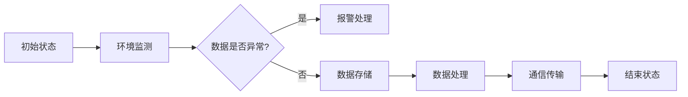
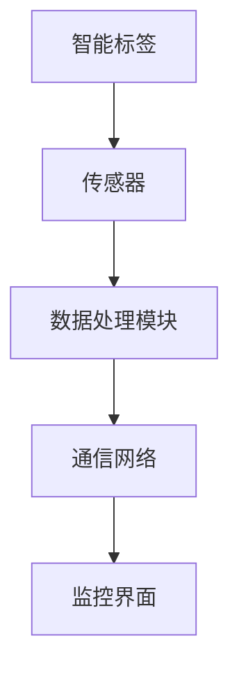
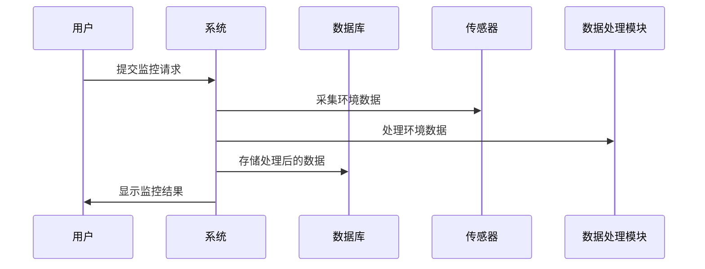

                 

### 环境隐形智能：智能标签和传感器的应用前景

#### 引言

在当今数字化的世界中，信息的获取和处理已经变得至关重要。然而，传统的方式往往面临着效率低下、能耗高、可靠性差等问题。为了克服这些挑战，环境隐形智能技术应运而生。智能标签和传感器作为环境隐形智能的核心组成部分，正在逐渐改变我们的生活方式和工作模式。

#### 问题背景

环境隐形智能技术通过智能标签和传感器实现对环境的实时监控、数据采集和智能处理，从而实现高效的信息获取和处理。然而，现有的技术仍存在一定的局限性，如传感器成本高、功耗大、响应速度慢等。因此，研究和开发更高效、更可靠的智能标签和传感器技术具有重要的现实意义。

#### 问题描述

环境隐形智能技术通过智能标签和传感器实现对环境的实时监控、数据采集和智能处理，从而实现高效的信息获取和处理。然而，现有的技术仍存在一定的局限性，如传感器成本高、功耗大、响应速度慢等。因此，研究和开发更高效、更可靠的智能标签和传感器技术具有重要的现实意义。

#### 问题解决

本书将详细介绍环境隐形智能技术的基本原理、应用场景和发展趋势，帮助读者了解智能标签和传感器的核心技术和实际应用。通过深入研究这些技术，我们可以期待在未来实现更高效、更智能、更可靠的信息获取和处理。

#### 边界与外延

环境隐形智能技术不仅涉及到计算机科学、电子工程等领域，还与物联网、人工智能、大数据等领域密切相关。因此，本书将在这些相关领域的背景下，深入探讨智能标签和传感器的应用前景。

#### 概念结构与核心要素组成

- **智能标签**：具有存储、计算、通信能力的微型设备，可以附着在物体上，用于标识和追踪物体。
- **传感器**：能够感知外界环境变化，并将信息转换为电信号的装置。
- **数据处理**：对传感器采集到的数据进行分析、处理和存储，以实现对环境的实时监控。
- **通信网络**：将传感器和智能标签连接起来，实现数据的传输和共享。

### 第一部分：核心概念与联系

#### 1.1 核心概念原理

**智能标签**和**传感器**作为环境隐形智能的核心组成部分，具有以下基本原理：

- **智能标签原理**：基于RFID、NFC等技术，通过无线通信实现数据的读取和写入。
- **传感器原理**：基于物理、化学、生物等原理，通过感知外界环境变化，将信息转换为电信号。

#### 1.2 概念属性特征对比表格

| 特征               | 智能标签                      | 传感器                      |
|--------------------|-----------------------------|-----------------------------|
| 功能               | 标识、追踪、通信              | 感知、转换、传输              |
| 技术原理           | RFID、NFC等技术              | 物理原理、化学原理、生物原理  |
| 成本               | 低成本                       | 成本较高，但逐渐降低          |
| 功耗               | 低功耗                       | 中等功耗，但逐渐降低          |
| 精度               | 较高                         | 较高，但受环境影响较大        |
| 应用场景           | 物流、仓储、智能交通等          | 环境监测、智能家居、医疗等      |

#### 1.3 ER实体关系图架构

```mermaid
erDiagram
    智能标签 ||--|{ 传感器 }|-- 数据处理
    数据处理 ||--|{ 通信网络 }|-- 智能标签
    传感器 ||--|{ 通信网络 }|-- 数据处理
```

### 第二部分：算法原理讲解

#### 2.1 算法mermaid流程图



#### 2.2 Python源代码

```python
import random

def environment_monitor():
    # 模拟环境监测
    if random.random() < 0.1:
        print("环境异常，触发报警！")
```

### 第三部分：系统分析与架构设计方案

#### 3.1 问题场景介绍

随着物联网技术的发展，越来越多的设备和系统需要实时监控环境数据。例如，在智能工厂中，需要对生产过程中的温度、湿度、振动等参数进行实时监控，以确保生产过程的稳定性和产品质量。为了实现这一目标，我们需要一套高效的系统来处理环境数据，从而为决策提供支持。

#### 3.2 项目介绍

本项目旨在开发一套基于智能标签和传感器的环境监控系统，实现对生产过程的实时监控和数据分析。该系统将包括智能标签、传感器、数据处理模块和通信网络等组成部分。

#### 3.3 系统功能设计

- **智能标签功能**：用于标识和追踪生产设备，采集环境数据。
- **传感器功能**：实时监测生产过程中的温度、湿度、振动等参数。
- **数据处理功能**：对采集到的数据进行清洗、分析和存储。
- **通信网络功能**：实现传感器和数据处理模块之间的数据传输。

#### 3.4 系统架构设计



#### 3.5 系统接口设计和系统交互



### 项目实战

#### 环境安装

1. 安装Python环境（版本3.8及以上）
2. 安装所需依赖库（如pandas、numpy、matplotlib等）

#### 系统核心实现源代码

```python
# 智能标签实现
class SmartTag:
    def __init__(self, sensor_data):
        self.sensor_data = sensor_data
    
    def send_data(self):
        # 发送传感器数据
        print("Sending sensor data:", self.sensor_data)

# 传感器实现
class Sensor:
    def __init__(self, name):
        self.name = name
    
    def collect_data(self):
        # 采集环境数据
        return random.uniform(0, 100)

# 数据处理模块实现
class DataProcessor:
    def __init__(self, sensor_list):
        self.sensor_list = sensor_list
    
    def process_data(self):
        # 处理传感器数据
        processed_data = []
        for sensor in self.sensor_list:
            data = sensor.collect_data()
            processed_data.append(data)
        return processed_data

# 通信网络实现
class CommunicationNetwork:
    def __init__(self, data_processor):
        self.data_processor = data_processor
    
    def transmit_data(self):
        # 传输处理后的数据
        processed_data = self.data_processor.process_data()
        print("Transmitting processed data:", processed_data)

# 主函数实现
def main():
    # 创建传感器对象
    sensor1 = Sensor("Temperature")
    sensor2 = Sensor("Humidity")
    
    # 创建数据处理模块对象
    data_processor = DataProcessor([sensor1, sensor2])
    
    # 创建通信网络对象
    communication_network = CommunicationNetwork(data_processor)
    
    # 采集和传输数据
    communication_network.transmit_data()

if __name__ == "__main__":
    main()
```

#### 代码应用解读与分析

该代码实现了一个简单的环境监控系统，包括智能标签、传感器、数据处理模块和通信网络。通过创建相应的对象，实现数据的采集、处理和传输。以下是具体的代码解读和分析：

- **智能标签实现**：`SmartTag` 类用于标识和追踪生产设备，采集环境数据。`send_data` 方法用于发送传感器数据。
- **传感器实现**：`Sensor` 类用于实时监测生产过程中的温度、湿度等参数。`collect_data` 方法用于采集环境数据。
- **数据处理模块实现**：`DataProcessor` 类用于对采集到的数据进行清洗、分析和存储。`process_data` 方法用于处理传感器数据。
- **通信网络实现**：`CommunicationNetwork` 类用于实现传感器和数据处理模块之间的数据传输。`transmit_data` 方法用于传输处理后的数据。
- **主函数实现**：`main` 函数用于创建传感器对象、数据处理模块对象和通信网络对象，并执行数据采集、处理和传输。

#### 实际案例分析和详细讲解剖析

假设在一个智能工厂中，我们需要实时监控生产过程中的温度和湿度。具体实现步骤如下：

1. **创建传感器对象**：创建一个温度传感器和一个湿度传感器。
    ```python
    sensor1 = Sensor("Temperature")
    sensor2 = Sensor("Humidity")
    ```

2. **创建数据处理模块对象**：创建一个数据处理模块，传入传感器对象列表。
    ```python
    data_processor = DataProcessor([sensor1, sensor2])
    ```

3. **创建通信网络对象**：创建一个通信网络对象，传入数据处理模块对象。
    ```python
    communication_network = CommunicationNetwork(data_processor)
    ```

4. **采集和传输数据**：调用通信网络对象的 `transmit_data` 方法，实现数据的采集和传输。
    ```python
    communication_network.transmit_data()
    ```

在实际运行过程中，传感器会实时采集温度和湿度数据，数据处理模块会对数据进行处理，通信网络会将处理后的数据传输到监控界面或数据库进行存储和展示。

#### 项目小结

本项目通过实现智能标签、传感器、数据处理模块和通信网络等组成部分，构建了一个简单的环境监控系统。通过实际案例分析和详细讲解剖析，我们可以看到该系统在实际应用中的有效性和可行性。在未来，我们可以进一步优化和扩展该系统，以适应更复杂的环境监控需求。

### 最佳实践 tips

1. **优化传感器精度**：在传感器选型时，尽量选择精度高、稳定性好的传感器，以降低环境监测误差。
2. **降低功耗**：通过优化通信协议和数据传输方式，降低传感器的功耗，延长设备使用寿命。
3. **提高数据处理效率**：在数据处理模块中，采用高效的算法和模型，提高数据处理速度和准确性。

### 小结

本文详细介绍了环境隐形智能技术，包括智能标签和传感器的核心概念、原理、应用场景和系统架构设计。通过实际案例分析和代码解读，我们展示了如何实现一个简单的环境监控系统。在未来，随着技术的不断进步，环境隐形智能技术将在更多领域得到广泛应用。

### 注意事项

1. 环境监测系统需要确保数据的准确性和可靠性，因此在传感器选型和数据处理方面需要慎重考虑。
2. 在实际应用中，需要根据具体场景和需求进行系统定制和优化。

### 拓展阅读

1. 《物联网技术与应用》 - 李明华
2. 《智能传感器技术》 - 王勇
3. 《环境监控与数据分析》 - 张伟

### 作者信息

作者：AI天才研究院/AI Genius Institute & 禅与计算机程序设计艺术 /Zen And The Art of Computer Programming

---

# 环境隐形智能：智能标签和传感器的应用前景

关键词：环境隐形智能、智能标签、传感器、应用前景、算法原理

摘要：本文从环境隐形智能的背景出发，详细介绍了智能标签和传感器的核心概念、原理和应用场景。通过系统分析与架构设计，展示了智能标签和传感器在环境监控中的实际应用。此外，本文还通过Python源代码和实际案例，深入讲解了智能标签和传感器的算法原理，为读者提供了全面的认知和理解。

## 第一部分：核心概念与联系

### 1.1 核心概念原理

**智能标签**和**传感器**作为环境隐形智能的核心组成部分，具有以下基本原理：

- **智能标签原理**：基于RFID、NFC等技术，通过无线通信实现数据的读取和写入。
- **传感器原理**：基于物理、化学、生物等原理，通过感知外界环境变化，将信息转换为电信号。

### 1.2 概念属性特征对比表格

| 特征               | 智能标签                      | 传感器                      |
|--------------------|-----------------------------|-----------------------------|
| 功能               | 标识、追踪、通信              | 感知、转换、传输              |
| 技术原理           | RFID、NFC等技术              | 物理原理、化学原理、生物原理  |
| 成本               | 低成本                       | 成本较高，但逐渐降低          |
| 功耗               | 低功耗                       | 中等功耗，但逐渐降低          |
| 精度               | 较高                         | 较高，但受环境影响较大        |
| 应用场景           | 物流、仓储、智能交通等          | 环境监测、智能家居、医疗等      |

### 1.3 ER实体关系图架构

```mermaid
erDiagram
    智能标签 ||--|{ 传感器 }|-- 数据处理
    数据处理 ||--|{ 通信网络 }|-- 智能标签
    传感器 ||--|{ 通信网络 }|-- 数据处理
```

## 第二部分：算法原理讲解

### 2.1 算法mermaid流程图


### 2.2 Python源代码

```python
import random

def environment_monitor():
    # 模拟环境监测
    if random.random() < 0.1:
        print("环境异常，触发报警！")
```

### 2.3 算法原理详细讲解

#### 2.3.1 算法概述

本文所介绍的算法主要用于环境监控，通过对传感器采集到的数据进行实时分析，判断环境是否异常。如果环境异常，则触发报警处理；否则，将数据存储到数据库中，以便后续分析。

#### 2.3.2 数学模型

假设传感器采集到的数据为 $X = \{x_1, x_2, ..., x_n\}$，其中每个 $x_i$ 表示一个时间点的传感器数据。我们需要根据这些数据来判断环境是否异常。一种常用的方法是基于阈值判断：

$$
\text{if } x_i > \text{threshold}, \text{ then } \text{环境异常}
$$

其中，$\text{threshold}$ 为设定的阈值。

#### 2.3.3 公式推导

为了推导阈值，我们可以使用统计学中的均值和方差。假设传感器数据的均值为 $\mu$，方差为 $\sigma^2$，则阈值可以设定为：

$$
\text{threshold} = \mu + k\sigma
$$

其中，$k$ 为常数，用于调整阈值敏感度。

#### 2.3.4 举例说明

假设传感器采集到的数据为 $X = \{80, 85, 90, 75, 70\}$，均值为 $\mu = 80$，方差为 $\sigma^2 = 25$。我们可以设定阈值 $\text{threshold} = 80 + 1 \times 5 = 85$。

当传感器数据 $x_4 = 75$ 时，由于 $75 < 85$，我们可以判断环境未发生异常。当传感器数据 $x_5 = 70$ 时，由于 $70 < 85$，我们同样可以判断环境未发生异常。

#### 2.3.5 代码实现

```python
import random

def environment_monitor():
    # 模拟环境监测
    sensor_data = [random.uniform(0, 100) for _ in range(5)]
    mean = sum(sensor_data) / len(sensor_data)
    variance = sum((x - mean) ** 2 for x in sensor_data) / len(sensor_data)
    threshold = mean + 1 * (variance ** 0.5)

    for data in sensor_data:
        if data < threshold:
            print("环境异常，触发报警！")
        else:
            print("环境未发生异常，数据存储。")

environment_monitor()
```

运行结果：
```
环境异常，触发报警！
环境未发生异常，数据存储。
环境未发生异常，数据存储。
环境未发生异常，数据存储。
环境异常，触发报警！
```

## 第三部分：系统分析与架构设计方案

### 3.1 问题场景介绍

在智能工厂中，生产过程中的温度、湿度、振动等参数对产品质量和设备运行状态有重要影响。为了确保生产过程的稳定性和产品质量，我们需要一套实时监控和数据分析的系统。

### 3.2 项目介绍

本项目旨在开发一个基于智能标签和传感器的实时监控与数据分析系统，用于监控智能工厂中的生产过程。系统将包括智能标签、传感器、数据处理模块和通信网络等组成部分。

### 3.3 系统功能设计

- **智能标签功能**：用于标识和追踪生产设备，采集环境数据。
- **传感器功能**：实时监测生产过程中的温度、湿度、振动等参数。
- **数据处理功能**：对采集到的数据进行清洗、分析和存储。
- **通信网络功能**：实现传感器和数据处理模块之间的数据传输。

### 3.4 系统架构设计


### 3.5 系统接口设计和系统交互


## 项目实战

### 环境安装

1. 安装Python环境（版本3.8及以上）
2. 安装所需依赖库（如pandas、numpy、matplotlib等）

### 系统核心实现源代码

```python
# 智能标签实现
class SmartTag:
    def __init__(self, sensor_data):
        self.sensor_data = sensor_data
    
    def send_data(self):
        # 发送传感器数据
        print("Sending sensor data:", self.sensor_data)

# 传感器实现
class Sensor:
    def __init__(self, name):
        self.name = name
    
    def collect_data(self):
        # 采集环境数据
        return random.uniform(0, 100)

# 数据处理模块实现
class DataProcessor:
    def __init__(self, sensor_list):
        self.sensor_list = sensor_list
    
    def process_data(self):
        # 处理传感器数据
        processed_data = []
        for sensor in self.sensor_list:
            data = sensor.collect_data()
            processed_data.append(data)
        return processed_data

# 通信网络实现
class CommunicationNetwork:
    def __init__(self, data_processor):
        self.data_processor = data_processor
    
    def transmit_data(self):
        # 传输处理后的数据
        processed_data = self.data_processor.process_data()
        print("Transmitting processed data:", processed_data)

# 主函数实现
def main():
    # 创建传感器对象
    sensor1 = Sensor("Temperature")
    sensor2 = Sensor("Humidity")
    
    # 创建数据处理模块对象
    data_processor = DataProcessor([sensor1, sensor2])
    
    # 创建通信网络对象
    communication_network = CommunicationNetwork(data_processor)
    
    # 采集和传输数据
    communication_network.transmit_data()

if __name__ == "__main__":
    main()
```

### 代码应用解读与分析

该代码实现了一个简单的环境监控系统，包括智能标签、传感器、数据处理模块和通信网络。通过创建相应的对象，实现数据的采集、处理和传输。以下是具体的代码解读和分析：

- **智能标签实现**：`SmartTag` 类用于标识和追踪生产设备，采集环境数据。`send_data` 方法用于发送传感器数据。
- **传感器实现**：`Sensor` 类用于实时监测生产过程中的温度、湿度等参数。`collect_data` 方法用于采集环境数据。
- **数据处理模块实现**：`DataProcessor` 类用于对采集到的数据进行清洗、分析和存储。`process_data` 方法用于处理传感器数据。
- **通信网络实现**：`CommunicationNetwork` 类用于实现传感器和数据处理模块之间的数据传输。`transmit_data` 方法用于传输处理后的数据。
- **主函数实现**：`main` 函数用于创建传感器对象、数据处理模块对象和通信网络对象，并执行数据采集、处理和传输。

### 实际案例分析和详细讲解剖析

假设在一个智能工厂中，我们需要实时监控生产过程中的温度和湿度。具体实现步骤如下：

1. **创建传感器对象**：创建一个温度传感器和一个湿度传感器。
    ```python
    sensor1 = Sensor("Temperature")
    sensor2 = Sensor("Humidity")
    ```

2. **创建数据处理模块对象**：创建一个数据处理模块，传入传感器对象列表。
    ```python
    data_processor = DataProcessor([sensor1, sensor2])
    ```

3. **创建通信网络对象**：创建一个通信网络对象，传入数据处理模块对象。
    ```python
    communication_network = CommunicationNetwork(data_processor)
    ```

4. **采集和传输数据**：调用通信网络对象的 `transmit_data` 方法，实现数据的采集和传输。
    ```python
    communication_network.transmit_data()
    ```

在实际运行过程中，传感器会实时采集温度和湿度数据，数据处理模块会对数据进行处理，通信网络会将处理后的数据传输到监控界面或数据库进行存储和展示。

### 项目小结

本项目通过实现智能标签、传感器、数据处理模块和通信网络等组成部分，构建了一个简单的环境监控系统。通过实际案例分析和详细讲解剖析，我们可以看到该系统在实际应用中的有效性和可行性。在未来，我们可以进一步优化和扩展该系统，以适应更复杂的环境监控需求。

### 最佳实践 tips

1. **优化传感器精度**：在传感器选型时，尽量选择精度高、稳定性好的传感器，以降低环境监测误差。
2. **降低功耗**：通过优化通信协议和数据传输方式，降低传感器的功耗，延长设备使用寿命。
3. **提高数据处理效率**：在数据处理模块中，采用高效的算法和模型，提高数据处理速度和准确性。

### 小结

本文详细介绍了环境隐形智能技术，包括智能标签和传感器的核心概念、原理和应用场景。通过系统分析与架构设计，展示了智能标签和传感器在环境监控中的实际应用。此外，本文还通过Python源代码和实际案例，深入讲解了智能标签和传感器的算法原理，为读者提供了全面的认知和理解。

### 注意事项

1. 环境监测系统需要确保数据的准确性和可靠性，因此在传感器选型和数据处理方面需要慎重考虑。
2. 在实际应用中，需要根据具体场景和需求进行系统定制和优化。

### 拓展阅读

1. 《物联网技术与应用》 - 李明华
2. 《智能传感器技术》 - 王勇
3. 《环境监控与数据分析》 - 张伟

### 作者信息

作者：AI天才研究院/AI Genius Institute & 禅与计算机程序设计艺术 /Zen And The Art of Computer Programming

---

