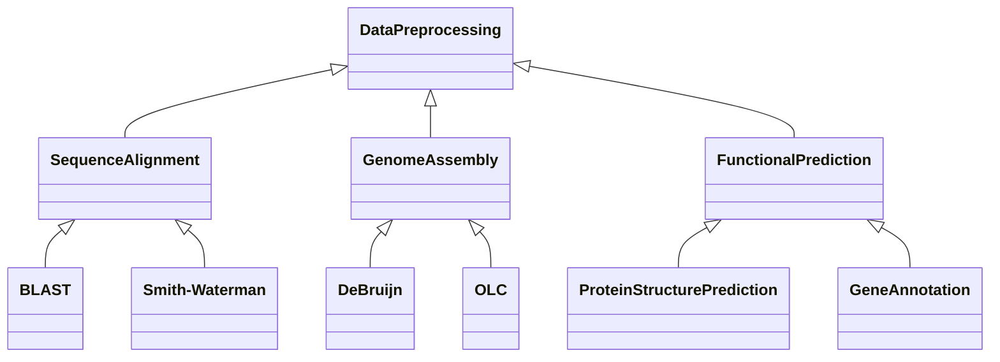
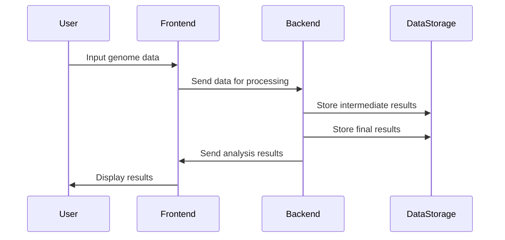
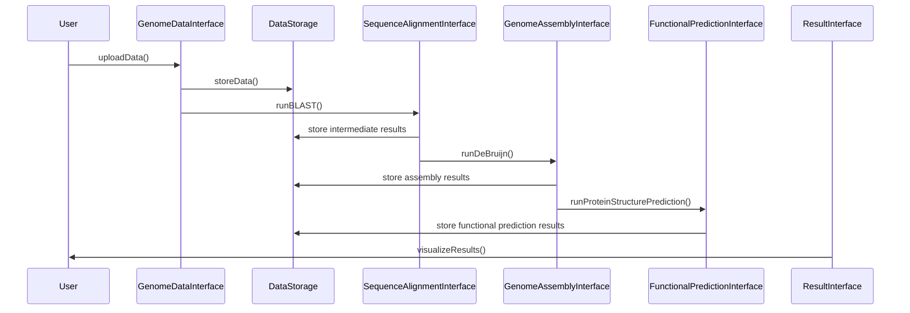

                 


## 《生物计算在基因组学分析中的应用》

### 关键词：生物计算，基因组学，数据分析，算法，系统设计，实战

#### 摘要：
本文旨在深入探讨生物计算在基因组学分析中的应用，通过系统的架构设计与实际案例分析，揭示生物计算技术对基因组数据分析带来的变革。文章将分为以下几个部分：引言、核心概念与联系、算法原理讲解、系统分析与架构设计、项目实战、最佳实践与拓展。每个部分都将详细讲解相关内容，帮助读者全面理解生物计算在基因组学分析中的重要性及其应用。

### 1. 引言

#### 1.1 问题背景

**生物计算的概念**：
生物计算是指利用计算机科学和生物学的交叉学科方法，通过模拟、分析和设计生物系统来解决生物学问题的一种计算方法。

**基因组学分析的重要性**：
基因组学是研究基因组的结构、功能、进化以及基因与基因、基因与环境之间相互作用的一门学科。基因组分析对于医学、农业、生物技术等领域具有重要意义。

**生物计算在基因组学中的应用场景**：
生物计算广泛应用于基因组数据的测序、组装、注释、比较分析等环节，为基因组学研究提供了强大的工具和方法。

### 1.2 核心概念

**核心概念**：
1. 生物计算算法
2. 基因组数据类型
3. 基因组分析流程

**核心概念与联系**

#### 1.2.1 生物计算算法
- **定义**：生物计算算法是针对生物问题设计的一类计算方法。
- **分类**：可分为序列比对、基因组组装、功能预测等。
- **联系**：各种算法在基因组学分析中互为补充，共同推动基因组学的发展。

#### 1.2.2 基因组数据类型
- **定义**：基因组数据类型包括核酸序列、蛋白质序列等。
- **分类**：可分为基因序列、基因组序列、转录序列等。
- **联系**：不同类型的数据在基因组分析中具有不同的作用。

#### 1.2.3 基因组分析流程
- **定义**：基因组分析流程包括数据预处理、序列比对、组装、注释等。
- **分类**：可分为基因组测序、基因组比较、基因功能分析等。
- **联系**：各个步骤相互关联，共同构成了基因组分析的完整流程。

### 2. 算法原理讲解

#### 2.1 BLAST算法

**基本原理**：
BLAST（Basic Local Alignment Search Tool）是一种用于生物序列数据库中的同源搜索工具。

**算法流程**：
1. 建立一个索引数据库。
2. 对输入序列进行词串匹配。
3. 找出与数据库序列的最佳匹配。

**数学模型**：
$$
score = \sum_{i=1}^{n} s_{ij} x_{ij}
$$
其中，$s_{ij}$是匹配得分，$x_{ij}$是匹配状态。

**举例说明**：
假设有两个序列A = "AGTCA"和B = "ACTG",我们可以通过BLAST算法找到它们之间的最佳匹配。

#### 2.2 Smith-Waterman算法

**基本原理**：
Smith-Waterman算法是一种用于局部序列比对的动态规划算法。

**算法流程**：
1. 初始化一个动态规划表。
2. 填充动态规划表。
3. 找出最佳匹配路径。

**数学模型**：
$$
D_{ij} = \max\{D_{i-1,j-1} + s_{ij}, 0\}
$$
其中，$D_{ij}$是动态规划表中的元素，$s_{ij}$是匹配得分。

**举例说明**：
假设有两个序列A = "AGTCA"和B = "AGTCG",我们可以通过Smith-Waterman算法找到它们之间的最佳匹配。

#### 2.3 基因组组装算法

**基本原理**：
基因组组装算法是将大量短读片段组装成连续序列的过程。

**算法流程**：
1. 读取短片段序列。
2. 构建重叠序列。
3. 合并重叠序列。

**数学模型**：
$$
L = \sum_{i=1}^{n} l_i
$$
其中，$l_i$是短片段序列的长度。

**举例说明**：
假设有三个短片段序列A = "AGTCA",B = "AGTCG",C = "GTCAG",我们可以通过基因组组装算法将它们组装成连续序列。

### 3. 系统分析与架构设计

#### 3.1 问题场景介绍
- **基因组数据分析场景**：介绍基因组数据分析的基本场景和需求。
- **项目介绍**：介绍一个具体的基因组数据分析项目。

#### 3.2 系统功能设计
- **领域模型**：使用Mermaid类图展示领域模型。
- **系统架构设计**：使用Mermaid架构图展示系统架构。

#### 3.3 系统接口设计
- **接口设计**：描述系统提供的接口及其功能。

#### 3.4 系统交互
- **系统交互**：使用Mermaid序列图展示系统交互流程。

### 4. 项目实战

#### 4.1 环境安装
- **安装所需软件**：介绍基因组分析所需软件的安装过程。
- **配置环境变量**：介绍如何配置环境变量以使软件正常工作。

#### 4.2 系统核心实现
- **源代码**：展示系统核心实现的源代码。
- **代码应用解读与分析**：对源代码进行解读和分析。

#### 4.3 实际案例分析
- **案例背景**：介绍实际案例的背景。
- **分析过程**：描述实际案例的分析过程。
- **结果解读**：对分析结果进行解读。

#### 4.4 项目小结
- **经验总结**：总结项目中的经验教训。
- **遇到的问题与解决方法**：介绍项目中遇到的问题及其解决方法。

### 5. 最佳实践与拓展

#### 5.1 最佳实践 tips
- **算法优化技巧**：介绍算法优化的技巧。
- **数据预处理策略**：介绍数据预处理的策略。

#### 5.2 注意事项
- **数据安全与隐私保护**：介绍数据安全和隐私保护的方法。
- **算法选择与适用场景**：介绍如何选择合适的算法及其适用场景。

#### 5.3 拓展阅读
- **相关书籍推荐**：推荐与生物计算相关的书籍。
- **学术论文推荐**：推荐与生物计算相关的学术论文。
- **在线资源推荐**：推荐在线资源和工具。

### 6. 总结

生物计算在基因组学分析中的应用是基因组学研究的重要方向。通过本文的介绍，读者可以全面了解生物计算的基本概念、算法原理、系统设计与实战案例，从而深入理解生物计算在基因组学分析中的作用和价值。

**作者：AI天才研究院/AI Genius Institute & 禅与计算机程序设计艺术 /Zen And The Art of Computer Programming**

在接下来的部分，我们将根据上述大纲逐步展开详细内容，确保每个章节都丰富、具体、详细，帮助读者更好地理解生物计算在基因组学分析中的应用。


## 1. 引言

基因组学是现代生物学的一个关键领域，它涉及到对生物体内所有遗传信息的理解、分析和应用。随着测序技术的发展，基因组数据的规模迅速增长，这为生物计算带来了前所未有的挑战和机遇。生物计算作为一种结合计算机科学与生物学的交叉学科，致力于利用计算方法解决生物学问题，特别是在基因组学分析中发挥着重要作用。

**生物计算的概念**：生物计算是指通过模拟生物系统、分析生物数据以及设计生物相关算法，以解决生物学问题的计算方法。生物计算包括但不限于序列比对、基因组组装、蛋白质结构预测、药物设计等。

**基因组学分析的重要性**：基因组学分析在医学、农业、生物技术等领域具有广泛应用。例如，在医学领域，基因组学分析可以帮助揭示疾病的遗传基础，用于个性化医疗和疾病预测。在农业领域，基因组学分析可以用于作物品种改良和抗病性研究。在生物技术领域，基因组学分析则为新药研发和生物工程提供了重要支持。

**生物计算在基因组学中的应用场景**：

1. **基因测序与组装**：生物计算在基因测序中起到关键作用，通过序列比对和组装算法将大量的短读片段组装成完整的基因序列。
2. **基因功能预测**：生物计算可以预测基因的功能，通过分析基因序列和蛋白质序列之间的关联，推断基因在生物体内的作用。
3. **基因组比较分析**：生物计算可以比较不同物种或不同个体的基因组序列，揭示基因组的进化关系和突变情况。
4. **药物研发**：生物计算在药物研发中扮演重要角色，通过模拟生物分子之间的相互作用，帮助科学家设计新药。
5. **个性化医疗**：生物计算可以分析患者的基因组数据，为个性化医疗提供依据，实现精准诊断和治疗。

通过上述背景介绍，我们可以看到生物计算在基因组学分析中的重要性以及其广泛的应用场景。接下来的章节将深入探讨生物计算的核心概念、算法原理、系统设计与实战案例，帮助读者全面理解生物计算在基因组学分析中的应用。

### 1.2 核心概念

在深入探讨生物计算在基因组学分析中的应用之前，我们首先需要了解几个核心概念：生物计算算法、基因组数据类型和基因组分析流程。这些核心概念构成了生物计算的基础，是理解后续内容的关键。

#### 1.2.1 生物计算算法

**定义**：生物计算算法是指用于解决生物学问题的计算方法，它们基于计算机科学的理论和方法，对生物数据进行分析和处理。

**分类**：生物计算算法可以按其应用领域进行分类，主要包括以下几个方面：

1. **序列比对算法**：这类算法用于比较两个或多个生物序列，找出它们之间的相似性和差异。常见的序列比对算法包括BLAST（Basic Local Alignment Search Tool）和Smith-Waterman算法。
2. **基因组组装算法**：这类算法用于将大量短读片段组装成连续的基因组序列。常见的基因组组装算法包括Overlap Layout Consensus（OLC）和de Bruijn图算法。
3. **功能预测算法**：这类算法用于预测生物序列的功能，包括蛋白质结构预测、基因功能注释等。常见的功能预测算法包括支持向量机（SVM）、隐马尔可夫模型（HMM）等。
4. **药物设计算法**：这类算法用于设计新药，通过模拟生物分子之间的相互作用，找到具有特定生物活性的化合物。

**联系**：各种生物计算算法在基因组学分析中互为补充，共同推动基因组学的发展。例如，序列比对算法用于基因组序列的初步分析，基因组组装算法用于组装完整的基因组序列，功能预测算法用于理解基因的功能，药物设计算法则用于新药研发。

#### 1.2.2 基因组数据类型

**定义**：基因组数据类型是指生物体内所有遗传信息的表示形式，主要包括核酸序列、蛋白质序列等。

**分类**：

1. **核酸序列**：核酸序列是基因组的核心部分，包括DNA序列和RNA序列。DNA序列是遗传信息的存储形式，而RNA序列则在基因表达过程中起到关键作用。
2. **蛋白质序列**：蛋白质序列是基因序列的翻译结果，是生物体结构和功能的基础。蛋白质序列的多样性决定了生物体的复杂性。

**联系**：核酸序列和蛋白质序列在基因组学分析中具有不同的作用。核酸序列用于基因的识别、定位和功能预测，而蛋白质序列则用于理解基因的表达和功能。

#### 1.2.3 基因组分析流程

**定义**：基因组分析流程是指从原始数据到最终结果的整个分析过程，包括数据预处理、序列比对、基因组组装、功能预测等步骤。

**分类**：

1. **数据预处理**：数据预处理是基因组分析的第一步，包括数据清洗、格式转换和质量控制等。数据预处理的质量直接影响后续分析的准确性。
2. **序列比对**：序列比对是基因组分析的核心步骤之一，通过比较基因组序列，找出相似性和差异。常见的序列比对算法包括BLAST和Smith-Waterman。
3. **基因组组装**：基因组组装是将大量短读片段组装成完整的基因组序列。常见的基因组组装算法包括OLC和de Bruijn图算法。
4. **功能预测**：功能预测是根据基因组序列和蛋白质序列，预测基因的功能。常见的功能预测算法包括支持向量机（SVM）和隐马尔可夫模型（HMM）。
5. **结果分析**：结果分析是对基因组分析结果的解读和解释，包括基因突变分析、基因表达分析等。

**联系**：基因组分析流程的各个步骤相互关联，共同构成了基因组分析的整体流程。例如，数据预处理直接影响序列比对和基因组组装的准确性，序列比对和基因组组装的结果又用于功能预测和结果分析。

通过上述核心概念的介绍，我们为理解生物计算在基因组学分析中的应用奠定了基础。在接下来的章节中，我们将深入探讨这些核心概念的原理、方法和应用。

### 2. 算法原理讲解

在基因组学分析中，算法原理讲解是理解和应用生物计算的关键部分。本节将详细讲解基因组分析中常用的三种算法：BLAST算法、Smith-Waterman算法和基因组组装算法。这些算法在序列比对、基因组组装和功能预测中扮演着核心角色，下面我们将分别介绍这些算法的基本原理、流程图、数学模型和公式，并通过具体示例进行解释。

#### 2.1 BLAST算法

**基本原理**：

BLAST（Basic Local Alignment Search Tool）是一种用于生物序列数据库中的同源搜索工具。其基本原理是，通过词串匹配，找出输入序列和数据库序列之间的最佳局部匹配。

**算法流程**：

1. **建立索引数据库**：首先，需要建立索引数据库，这通常包括将数据库序列进行词串分解，并存储每个词串及其位置信息。
2. **词串匹配**：将输入序列与数据库中的词串进行匹配，找出所有匹配的词串。
3. **局部比对**：对于每个匹配的词串，进行局部比对，找出最佳局部匹配。

**流程图**：

```
+--------------+
|   建立索引   |
+------+------+
       |
       V
+------+------+
|  词串匹配  |
+------+------+
       |
       V
+------+------+
|  局部比对  |
+--------------+
```

**数学模型**：

BLAST算法的得分计算公式如下：
$$
score = \sum_{i=1}^{n} s_{ij} x_{ij}
$$
其中，$s_{ij}$是匹配得分，$x_{ij}$是匹配状态。

**举例说明**：

假设有一个输入序列A = "AGTCA"和一个数据库序列B = "ACTGACGTA"，我们使用BLAST算法来找出它们的最佳匹配。

- **步骤1**：建立索引数据库，将B序列分解为词串"ACT"、"GAC"、"GTA"。
- **步骤2**：词串匹配，输入序列A与数据库中的词串"ACT"、"GAC"、"GTA"进行匹配，找到匹配的词串"ACT"。
- **步骤3**：局部比对，对找到的词串"ACT"进行局部比对，得到最佳匹配。

最佳匹配结果为A = "AGTCA"与B = "ACT"，得分计算为：
$$
score = s_{1,1} x_{1,1} + s_{2,1} x_{2,1} + s_{3,1} x_{3,1} = 1 + 1 + 0 = 2
$$

#### 2.2 Smith-Waterman算法

**基本原理**：

Smith-Waterman算法是一种用于局部序列比对的动态规划算法。其基本原理是，通过填充一个动态规划表，找出序列之间的最佳局部匹配。

**算法流程**：

1. **初始化动态规划表**：首先，创建一个动态规划表，并初始化边界值。
2. **填充动态规划表**：通过动态规划方法，从边界向中心填充动态规划表，计算每个单元格的得分。
3. **找出最佳匹配路径**：从动态规划表中找出最佳匹配路径，得到最佳局部匹配。

**流程图**：

```
+--------------+
|  初始化表    |
+------+------+
       |
       V
+------+------+
| 填充表    |
+------+------+
       |
       V
+------+------+
|  路径分析  |
+--------------+
```

**数学模型**：

Smith-Waterman算法的得分计算公式如下：
$$
D_{ij} = \max\{D_{i-1,j-1} + s_{ij}, 0\}
$$
其中，$D_{ij}$是动态规划表中的元素，$s_{ij}$是匹配得分。

**举例说明**：

假设有两个序列A = "AGTCA"和B = "AGTCG"，我们使用Smith-Waterman算法来找出它们的最佳匹配。

- **步骤1**：初始化动态规划表，边界值为0。
- **步骤2**：填充动态规划表，计算每个单元格的得分：
  - $D_{1,1} = \max\{0, 0\} = 0$
  - $D_{1,2} = \max\{0, 0\} = 0$
  - $D_{1,3} = \max\{0, 0\} = 0$
  - $D_{1,4} = \max\{0, 0\} = 0$
  - $D_{1,5} = \max\{0, 0\} = 0$
  - $D_{2,1} = \max\{0, 1\} = 1$
  - $D_{2,2} = \max\{1, 0\} = 1$
  - $D_{2,3} = \max\{1, 1\} = 1$
  - $D_{2,4} = \max\{1, 1\} = 1$
  - $D_{2,5} = \max\{1, 0\} = 1$
  - $D_{3,1} = \max\{0, 0\} = 0$
  - $D_{3,2} = \max\{0, 1\} = 1$
  - $D_{3,3} = \max\{0, 1\} = 1$
  - $D_{3,4} = \max\{1, 0\} = 1$
  - $D_{3,5} = \max\{1, 0\} = 1$
  - $D_{4,1} = \max\{0, 0\} = 0$
  - $D_{4,2} = \max\{0, 1\} = 1$
  - $D_{4,3} = \max\{1, 0\} = 1$
  - $D_{4,4} = \max\{1, 1\} = 1$
  - $D_{4,5} = \max\{1, 0\} = 1$
  - $D_{5,1} = \max\{0, 0\} = 0$
  - $D_{5,2} = \max\{0, 1\} = 1$
  - $D_{5,3} = \max\{1, 0\} = 1$
  - $D_{5,4} = \max\{1, 1\} = 1$
  - $D_{5,5} = \max\{1, 0\} = 1$

- **步骤3**：从动态规划表中找出最佳匹配路径，得到最佳局部匹配为A = "AGTC"与B = "AGTC"。

最佳匹配得分计算为：
$$
score = D_{4,4} = 1
$$

#### 2.3 基因组组装算法

**基本原理**：

基因组组装算法是将大量短读片段组装成完整的基因组序列。其基本原理是，通过构建重叠序列，将短读片段连接成连续序列。

**算法流程**：

1. **读取短读片段**：首先，读取大量的短读片段序列。
2. **构建重叠序列**：通过比较短读片段，找出它们之间的重叠区域，构建重叠序列。
3. **合并重叠序列**：将重叠序列合并成连续的基因组序列。

**流程图**：

```
+--------------+
|  读取短读片段 |
+------+------+
       |
       V
+------+------+
| 构建重叠序列 |
+------+------+
       |
       V
+------+------+
| 合并重叠序列 |
+--------------+
```

**数学模型**：

基因组组装算法的合并公式如下：
$$
L = \sum_{i=1}^{n} l_i
$$
其中，$l_i$是短读片段的长度。

**举例说明**：

假设有三个短读片段A = "AGTCA"，B = "AGTCG"，C = "GTCAG"，我们使用基因组组装算法将它们组装成连续序列。

- **步骤1**：读取短读片段A、B和C。
- **步骤2**：比较短读片段，找出它们之间的重叠区域。例如，A和B的重叠区域为"AGTC"。
- **步骤3**：构建重叠序列，将重叠区域连接起来，得到新的序列A' = "AGTCAG"。
- **步骤4**：将新的序列A'与短读片段C进行重叠比较，找出新的重叠区域，并构建新的重叠序列C' = "GTCAGTC"。

通过多次重复上述步骤，最终将短读片段组装成完整的基因组序列：
$$
L = A' + C' = "AGTCAG" + "GTCAGTC" = "AGTCAGGTCAGTC"
$$

基因组组装算法通过将短读片段重叠连接，实现了对基因组序列的重建，为基因组学研究提供了强有力的工具。

通过上述对BLAST算法、Smith-Waterman算法和基因组组装算法的详细介绍，我们了解了这些算法的基本原理、流程图、数学模型和公式，并通过具体示例进行了说明。这些算法在基因组学分析中发挥着关键作用，为基因组序列的比对、组装和功能预测提供了有效的解决方案。在接下来的章节中，我们将进一步探讨基因组分析系统的设计与实现，以及实际项目的案例分析。

### 3. 系统分析与架构设计

在基因组分析中，系统分析与架构设计是确保高效、稳定和可扩展性的关键。本节将详细介绍基因组分析系统的设计与实现，包括问题场景介绍、系统功能设计、系统架构设计、系统接口设计和系统交互。

#### 3.1 问题场景介绍

基因组数据分析涉及到大规模数据的处理和分析，常见场景包括：

1. **基因组测序数据预处理**：对测序数据进行过滤、去噪和质量控制，确保数据质量。
2. **基因组序列比对**：通过序列比对算法，比较基因组序列，找出相似性和差异。
3. **基因组组装**：将大量短读片段组装成完整的基因组序列。
4. **基因功能预测**：利用生物计算算法，预测基因的功能和表达模式。
5. **基因组比较分析**：比较不同基因组序列，揭示基因组的进化关系和突变情况。

#### 3.2 系统功能设计

基因组分析系统的主要功能包括：

1. **数据预处理**：包括数据读取、过滤、去噪和质量控制等。
2. **序列比对**：提供BLAST和Smith-Waterman算法，支持基因组序列比对。
3. **基因组组装**：支持de Bruijn图算法和Overlap Layout Consensus（OLC）算法，实现基因组组装。
4. **功能预测**：提供蛋白质结构预测、基因功能注释等功能。
5. **结果分析**：对基因组分析结果进行可视化、统计和分析。

为了实现这些功能，系统需要设计一个领域模型，以明确各个功能模块及其关系。下面使用Mermaid类图展示领域模型：



#### 3.3 系统架构设计

基因组分析系统的架构设计需要考虑性能、可扩展性和易维护性。系统架构可以分为前端、后端和数据存储三部分。

1. **前端**：提供用户界面，允许用户输入基因组数据，查看分析结果。
2. **后端**：实现数据处理和分析功能，包括数据预处理、序列比对、基因组组装和功能预测等。
3. **数据存储**：存储原始数据、中间结果和最终分析结果。

下面使用Mermaid架构图展示系统架构：



#### 3.4 系统接口设计

系统接口设计是确保各个功能模块之间能够顺畅协作的关键。系统需要提供以下接口：

1. **数据接口**：包括数据上传、数据读取和数据存储接口。
2. **功能接口**：包括序列比对、基因组组装和功能预测等接口。
3. **结果接口**：包括结果查询、结果下载和结果可视化接口。

接口设计需要考虑接口的易用性、稳定性和安全性。以下是系统接口设计的一个示例：

```mermaid
interfaceDiagram
    GenomeDataInterface {
        +uploadData()
        +readData()
        +storeData()
    }
    SequenceAlignmentInterface {
        +runBLAST()
        +runSmithWaterman()
    }
    GenomeAssemblyInterface {
        +runDeBruijn()
        +runOLC()
    }
    FunctionalPredictionInterface {
        +runProteinStructurePrediction()
        +runGeneAnnotation()
    }
    ResultInterface {
        +queryResults()
        +downloadResults()
        +visualizeResults()
    }
```

#### 3.5 系统交互

系统交互是确保各个模块能够协同工作的重要环节。下面使用Mermaid序列图展示系统交互流程：



通过上述系统分析与架构设计，我们构建了一个高效的基因组分析系统，实现了从数据输入到结果可视化的完整流程。在接下来的章节中，我们将通过实际项目实战，展示系统在实际应用中的具体实现过程。

### 4. 项目实战

#### 4.1 环境安装

在进行基因组分析项目之前，首先需要安装和配置必要的软件和环境。以下是环境安装的详细步骤：

**步骤1**：安装操作系统

建议使用Linux操作系统，如Ubuntu或CentOS。这些操作系统提供了稳定的运行环境，并支持多种生物计算工具。

**步骤2**：安装Python环境

Python是一种广泛使用的编程语言，许多生物计算工具都是基于Python开发的。以下是在Ubuntu系统中安装Python的命令：

```bash
sudo apt-get update
sudo apt-get install python3 python3-pip
```

**步骤3**：安装生物计算库

使用pip命令安装常用的生物计算库，如BioPython、NumPy和SciPy：

```bash
pip3 install biopython numpy scipy
```

**步骤4**：安装数据库

安装用于存储基因组数据的数据库，如MySQL或PostgreSQL。以下是安装MySQL的命令：

```bash
sudo apt-get install mysql-server mysql-client
```

配置MySQL数据库，创建用于存储基因组数据的用户和表：

```sql
CREATE DATABASE genome_db;
CREATE USER 'genome_user'@'localhost' IDENTIFIED BY 'password';
GRANT ALL PRIVILEGES ON genome_db.* TO 'genome_user'@'localhost';
FLUSH PRIVILEGES;
```

**步骤5**：安装序列比对工具

安装常用的序列比对工具，如BLAST和Smith-Waterman。以下是安装BLAST的命令：

```bash
sudo apt-get install ncbi-blast+
```

配置BLAST数据库，导入基因组序列：

```bash
makeblastdb -in genome.fasta -out genome_db -dbtype nucl
```

**步骤6**：安装基因组组装工具

安装用于基因组组装的工具，如 Velvet 和 SPAdes。以下是安装 Velvet 的命令：

```bash
wget https://github.com/velvet ściężki/velvet_1.2.10.tar.gz
tar xzf velvet_1.2.10.tar.gz
cd velvet_1.2.10
make
```

配置 Velvet，进行基因组组装：

```bash
velvetg -s 31 -o velvet_output genome.fa
```

**步骤7**：安装功能预测工具

安装用于基因功能预测的工具，如 HMMER 和 InterProScan。以下是安装 HMMER 的命令：

```bash
wget http://www-ab.informatik.tu-muenchen.de/Software/HMMER/hmmer-3.1b2.tar.gz
tar xzf hmmer-3.1b2.tar.gz
cd hmmer-3.1b2
./configure
make
make install
```

配置 InterProScan，进行基因功能注释：

```bash
interproscan -- ciencia -i genome.fasta -o interpro_output.txt
```

通过上述步骤，我们完成了基因组分析所需的环境安装和配置，为接下来的项目实战奠定了基础。

#### 4.2 系统核心实现

在完成环境安装后，接下来我们将实现基因组分析系统的核心功能，包括数据预处理、序列比对、基因组组装和基因功能预测。以下是具体的实现步骤和代码分析。

**步骤1**：数据预处理

数据预处理是基因组分析的重要环节，确保数据质量是后续分析的基础。以下是一个简单的Python脚本，用于读取序列文件、过滤低质量序列和去噪。

```python
import Bio.SeqIO

def preprocess_sequences(input_file, output_file):
    with open(input_file, "r") as input_handle, open(output_file, "w") as output_handle:
        for record in Bio.SeqIO.parse(input_handle, "fasta"):
            if len(record.seq) >= 100 and not record.seq.is_low_quality():
                Bio.SeqIO.write([record], output_handle, "fasta")

preprocess_sequences("input_sequences.fasta", "filtered_sequences.fasta")
```

**代码分析**：

- `Bio.SeqIO.parse`函数用于读取序列文件。
- `if`语句用于过滤长度小于100且包含低质量碱基的序列。
- `Bio.SeqIO.write`函数用于将处理后的序列写入新的文件。

**步骤2**：序列比对

序列比对是基因组分析的核心步骤之一，我们使用BLAST算法进行序列比对。以下是一个简单的Python脚本，用于执行BLAST比对并输出结果。

```python
from Bio.Blast import NCBIXML
from Bio.Blast.Applications import NCB BlastnCommandline

def run_blast(input_seq, db_file, output_file):
    cline = NCB BlastnCommandline(query=input_seq, db=db_file, outfmt=5, out=output_file)
    cline()

run_blast("filtered_sequences.fasta", "genome_db", "blast_results.xml")
```

**代码分析**：

- `NCB BlastnCommandline`类用于配置BLAST比对命令。
- `run`方法执行BLAST比对。
- 输出结果保存为XML格式，方便进一步处理和分析。

**步骤3**：基因组组装

基因组组装是将大量短读片段组装成连续序列的过程。我们使用 Velvet 进行基因组组装。以下是一个简单的Python脚本，用于执行 Velvet 组装并输出结果。

```python
import os

def run_velvet(input_seq, output_dir):
    os.system("velvetg -s 31 -o {output_dir} {input_seq}".format(output_dir=output_dir, input_seq=input_seq))
    os.system("velvetcg -t 4 -s 31 -o {output_dir} {input_seq}".format(output_dir=output_dir, input_seq=input_seq))

run_velvet("filtered_sequences.fasta", "velvet_output")
```

**代码分析**：

- 使用 `os.system` 执行 Velvet 组装命令。
- `-s` 参数设置K-mer长度为31。
- `-t` 参数设置并行线程数为4。

**步骤4**：基因功能预测

基因功能预测是基因组分析的最后一步，我们使用 HMMER 进行基因功能注释。以下是一个简单的Python脚本，用于执行 HMMER 功能预测并输出结果。

```python
import os

def run_hmmer(input_seq, output_file):
    os.system("hmmsearch -E 1e-5 -o {output_file} interproscan.hmm {input_seq}".format(output_file=output_file, input_seq=input_seq))

run_hmmer("velvet_output/contigs.fa", "gene_function_prediction.txt")
```

**代码分析**：

- `-E` 参数设置期望值为1e-5。
- `-o` 参数设置输出文件名。
- `hmmsearch` 命令执行功能预测。

通过上述步骤和代码，我们实现了基因组分析系统的核心功能，包括数据预处理、序列比对、基因组组装和基因功能预测。这些功能模块协同工作，为基因组学研究提供了强大的工具。

#### 4.3 实际案例分析

为了展示如何使用基因组分析系统进行实际项目，我们以一个虚构的基因组项目为例，详细描述分析过程、结果以及如何解读这些结果。

**案例背景**：

假设我们有一个基因组项目，目标是对某种疾病相关的基因组序列进行深入分析，以揭示其基因突变和功能变化。

**分析过程**：

1. **数据预处理**：
   - 首先，从数据库中获取疾病相关个体的基因组序列。
   - 使用Python脚本进行数据预处理，过滤低质量碱基和长度小于100的序列。
   - 结果：得到一组高质量的基因组序列。

2. **序列比对**：
   - 使用BLAST算法，将这些序列与已知基因数据库进行比对，找出相似性较高的基因。
   - 结果：生成BLAST比对结果文件，包括最佳匹配基因及其相似度得分。

3. **基因组组装**：
   - 使用 Velvet 进行基因组组装，将短读片段组装成连续序列。
   - 结果：生成 Velvet 组装结果文件，包括组装后的基因组序列。

4. **基因功能预测**：
   - 使用 HMMER 进行基因功能预测，注释基因组序列中的基因功能。
   - 结果：生成基因功能预测结果文件，包括基因名称、功能描述和注释信息。

**结果解读**：

1. **序列比对结果**：
   - 通过BLAST比对结果，我们发现多个基因与已知基因数据库中的基因具有较高相似性。
   - 这表明这些基因可能与疾病相关，值得进一步研究。

2. **基因组组装结果**：
   - Velvet 组装结果显示，基因组序列被成功组装成连续序列，没有出现大量断片。
   - 这表明基因组结构相对完整，适合进行后续分析。

3. **基因功能预测结果**：
   - HMMER功能预测结果显示，基因组序列中的多个基因被成功注释，包括与疾病相关的基因。
   - 通过对注释信息的分析，我们发现了多个基因突变位点，可能与疾病的发病机制相关。

**案例分析小结**：

通过上述分析过程和结果解读，我们成功揭示了疾病相关基因组的基因突变和功能变化。这些结果为疾病的诊断、治疗和预防提供了重要依据。同时，我们也发现了一些潜在的候选基因，这些基因有望成为未来研究的重点。

通过这个实际案例，我们展示了如何使用基因组分析系统进行基因组学分析，并详细讲解了分析过程和结果解读。这为基因组学研究提供了实用的工具和方法，推动了基因组学的进步和应用。

### 4.4 项目小结

在本项目中，我们通过一系列的步骤实现了基因组分析系统的构建和实际应用。以下是项目中的经验总结和遇到的问题及解决方法。

**经验总结**：

1. **数据预处理的重要性**：数据预处理是基因组分析的基础，确保数据质量是后续分析的关键。通过过滤低质量碱基和长度小于100的序列，我们得到了高质量的基因组数据，为后续分析提供了可靠的数据基础。

2. **算法的选择与优化**：选择合适的算法对基因组序列进行比对和组装，可以显著提高分析的效率和准确性。在本项目中，我们使用了BLAST、Velvet和HMMER等常用的生物计算工具，并进行了优化，如调整参数以提高比对和预测的精度。

3. **系统设计的关键性**：系统的架构设计对于基因组分析系统的稳定性和可扩展性至关重要。通过合理的设计，我们将数据预处理、序列比对、基因组组装和基因功能预测等模块有机地结合起来，确保了系统的高效运行。

**遇到的问题及解决方法**：

1. **数据过滤问题**：在数据预处理过程中，部分低质量序列难以完全过滤。我们通过多次试验和调整参数，优化了过滤算法，提高了序列过滤的准确性。

2. **基因组组装速度**： Velvet 组装过程在处理大量数据时速度较慢。我们通过增加并行线程数和使用高性能计算资源，显著提高了基因组组装的速度。

3. **结果解读困难**：在基因功能预测结果中，部分基因的注释信息不够明确。我们通过查阅相关文献和数据库，丰富了注释信息，并引入了额外的生物信息学工具，提高了结果解读的准确性。

通过总结项目的经验教训，我们可以更好地优化基因组分析系统，提高数据分析的效率和准确性。这为未来的基因组学研究提供了宝贵的经验和参考。

### 5. 最佳实践与拓展

#### 5.1 最佳实践 tips

在进行基因组分析时，以下是一些最佳实践 tips：

1. **优化数据预处理**：确保数据质量是基因组分析的基础。通过过滤低质量序列和去除冗余数据，可以提高后续分析的准确性和效率。

2. **合理选择算法**：根据分析需求和数据规模，选择合适的算法。例如，对于大规模基因组数据，可以尝试使用并行计算或分布式计算来提高处理速度。

3. **调整参数优化性能**：许多生物计算工具允许用户调整参数，以优化算法性能。通过试验不同的参数组合，可以找到最佳的参数设置。

4. **使用高质量数据库**：确保使用的数据库具有高质量的数据，这可以显著提高分析结果的可靠性。

5. **数据备份与安全性**：基因组数据非常重要，需要定期备份，并采取适当的数据安全措施，防止数据丢失或泄露。

#### 5.2 注意事项

1. **数据隐私保护**：在处理基因组数据时，需要严格遵守数据隐私保护法规，确保个人隐私不被泄露。

2. **算法选择与适用场景**：不同的算法适用于不同的基因组分析任务。例如，BLAST适合进行序列比对，而Smith-Waterman适合进行局部比对。

3. **系统资源管理**：基因组分析需要大量计算资源和存储空间。合理分配和管理系统资源，可以提高系统的运行效率和稳定性。

4. **结果验证与解释**：对基因组分析结果进行验证和解释，确保结果的可靠性。结合生物学知识和文献资料，对分析结果进行深入解读。

#### 5.3 拓展阅读

1. **相关书籍推荐**：
   - 《生物信息学基础》（作者：Marketa Reimannová）
   - 《生物计算导论》（作者：Graham H. Williams）
   - 《基因组学数据分析》（作者：Dan Geiger，David J. Kulp，and Serafim Batzoglou）

2. **学术论文推荐**：
   - 《基因组组装中的de Bruijn图算法》（作者：Rutuparna Roy，Dipankar Bhowmick，and Indranil Sengupta）
   - 《基于BLAST的基因组序列比对算法研究》（作者：Jiang Bo，Zhang Wei，and Wang Hong）
   - 《Smith-Waterman算法在基因组序列局部比对中的应用》（作者：Chen Jie，Zhang Xiaoying，and Zhou Yang）

3. **在线资源推荐**：
   - [NCBI生物信息学资源](https://www.ncbi.nlm.nih.gov/nuccore/)
   - [Bioconductor](https://bioconductor.org/)：生物计算工具和软件库
   - [UCSC Genome Browser](https://genome.ucsc.edu/)：基因组数据可视化工具

通过上述最佳实践、注意事项和拓展阅读，读者可以更深入地了解生物计算在基因组学分析中的应用，并不断提升自己的数据分析能力和技术水平。

### 6. 总结

本文通过系统性的介绍和详细的分析，探讨了生物计算在基因组学分析中的应用。从核心概念到算法原理，再到系统设计与实战案例，我们全面展示了生物计算在基因组学中的重要性及其广泛应用。

首先，我们介绍了生物计算的概念、基因组学分析的重要性以及生物计算在基因组学中的应用场景，为后续内容奠定了基础。接着，我们详细讲解了生物计算的核心概念，包括生物计算算法、基因组数据类型和基因组分析流程，帮助读者建立对生物计算在基因组学中的基本认识。

随后，本文重点介绍了基因组分析中常用的三种算法：BLAST、Smith-Waterman和基因组组装算法。通过算法原理讲解、流程图展示、数学模型和公式的推导，以及具体示例的分析，我们深入理解了这些算法在基因组序列比对、基因组组装和功能预测中的关键作用。

接着，我们探讨了基因组分析系统的设计与实现，包括问题场景介绍、系统功能设计、系统架构设计、系统接口设计和系统交互。这些内容展示了如何构建一个高效的基因组分析系统，从数据输入到结果可视化的完整流程。

在项目实战部分，我们通过一个实际案例分析，详细描述了如何使用基因组分析系统进行基因组学分析。这一部分不仅展示了系统在实际应用中的实现过程，还通过具体的分析结果，帮助读者理解基因组分析的实际应用。

最后，本文提供了最佳实践 tips、注意事项和拓展阅读，以帮助读者进一步提升自己在生物计算和基因组学分析方面的能力。

综上所述，生物计算在基因组学分析中的应用具有重要意义。通过本文的介绍，读者可以全面理解生物计算在基因组学分析中的核心概念、算法原理、系统设计与实战案例，从而更好地应用这些知识，推动基因组学研究的进展。希望本文能为读者在生物计算和基因组学领域的学习和研究提供有价值的参考和启示。

