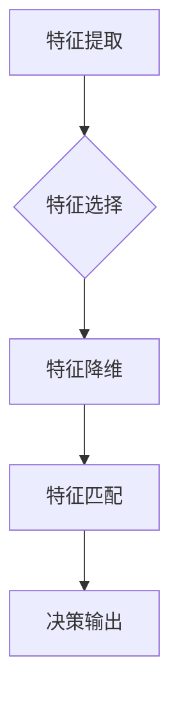

                 

### 引言

#### 1. 引言

**1.1 无人银行的发展背景及现状**

随着科技的不断进步和金融行业的数字化发展，无人银行作为一种新兴的服务模式，正逐渐走入大众的视野。无人银行，顾名思义，是指通过自动化设备、人工智能等高科技手段，实现银行服务的无人化操作，从而减少对人工的依赖。

**1.1.1 无人银行的概念**

无人银行通常由一系列自动化机器和智能系统组成，如自动取款机（ATM）、自动转账机、智能柜员机等。这些设备可以通过生物识别技术、语音识别技术、智能机器人等技术，为客户提供开户、存取款、转账、查询等服务。

**1.1.2 无人银行的发展历程**

无人银行的发展可以追溯到20世纪末，随着自动取款机的普及，无人银行的概念开始萌芽。进入21世纪，随着人工智能、大数据、云计算等技术的发展，无人银行进入了快速发展阶段。近年来，全球多家银行纷纷推出无人银行试点项目，无人银行逐渐成为银行服务的一种重要模式。

**1.1.3 无人银行的优势与挑战**

无人银行具有显著的优点，如提高效率、降低成本、增强安全性等。然而，无人银行也面临着一些挑战，如技术成熟度、用户接受度、隐私保护等问题。

**1.2 生物识别技术的基本概念**

生物识别技术是一种通过识别和验证个人的生物特征（如指纹、虹膜、面部等）来进行身份认证的技术。生物识别技术以其高效、便捷、安全的特点，在信息安全领域有着广泛的应用。

**1.2.1 生物识别技术的定义**

生物识别技术，又称生物特征识别技术，是指通过计算机与光学、声学、生物传感器及生物统计学原理等高科技手段相结合，利用人体固有的生理特性和行为特征来进行个人身份的鉴定。

**1.2.2 生物识别技术的分类**

生物识别技术主要分为三大类：生理特征识别、行为特征识别和身份验证。生理特征识别包括指纹识别、虹膜识别、面部识别等；行为特征识别包括签字识别、语音识别等；身份验证则通常指两种或多种特征的组合使用。

**1.2.3 生物识别技术的工作原理**

生物识别技术的工作原理主要包括三个步骤：特征提取、特征匹配和决策输出。特征提取是通过传感器获取生物特征数据，特征匹配是将获取到的特征数据与数据库中的模板特征进行比较，决策输出是根据比较结果判断是否允许通过。

**1.3 生物识别技术在无人银行安全管理中的应用**

生物识别技术在无人银行中主要应用于身份认证和安防监控两个方面。

**1.3.1 生物识别技术在身份认证中的应用**

在无人银行中，生物识别技术主要用于客户身份的验证。例如，客户可以通过指纹识别、虹膜识别或面部识别来访问自助服务设备，完成开户、存取款、转账等操作。

**1.3.2 生物识别技术在安防监控中的应用**

在无人银行中，生物识别技术还可以用于安防监控。例如，通过监控摄像头进行行人流量统计、嫌疑人识别，以及安全区域管理，从而提高银行的安全性。

**1.4 生物识别技术在无人银行系统架构中的应用**

生物识别技术在无人银行系统架构中的应用包括硬件设备层、软件系统层和数据处理与分析层。硬件设备层包括生物特征采集设备，如指纹采集器、摄像头等；软件系统层包括生物识别算法、身份认证系统等；数据处理与分析层包括生物特征数据库、数据分析系统等。

#### 1.5 生物识别技术在无人银行安全风险管理中的应用案例

在无人银行的实际运营中，生物识别技术已经得到了广泛应用。以下将介绍两个具体的应用案例。

**1.5.1 案例一：某银行无人网点生物识别系统建设**

**1.5.1.1 项目背景**

为了提高服务效率和客户满意度，某银行决定在其新开设的无人网点中引入生物识别技术。

**1.5.1.2 项目目标**

项目的主要目标是实现客户身份的快速准确验证，提高银行安全性，同时提升客户体验。

**1.5.1.3 项目实施与效果**

在项目实施过程中，银行采用了面部识别和指纹识别技术。客户只需在自助服务设备上完成面部识别或指纹识别，即可完成开户、存取款等操作。通过生物识别技术的引入，银行的无人网点实现了高效、安全的运营，客户满意度显著提升。

**1.5.2 案例二：某无人银行安全性问题案例分析**

**1.5.2.1 问题背景**

某无人银行在运营过程中发现，有部分非法分子利用伪造的身份证和银行卡，试图在自助服务设备上完成取款操作。

**1.5.2.2 问题诊断**

通过对问题进行诊断，发现主要是由于生物识别系统在身份验证方面存在漏洞，导致非法分子能够绕过系统限制。

**1.5.2.3 解决方案与实施效果**

为了解决这个问题，银行决定对生物识别系统进行升级，引入更先进的面部识别技术和指纹识别技术。同时，增加了动态口令验证环节，客户在完成面部识别或指纹识别后，还需要输入动态口令。通过这些措施，银行有效防止了非法取款行为，提升了无人银行的安全性。

#### 1.6 生物识别技术在无人银行安全领域的未来发展趋势

**1.6.1 技术发展趋势**

未来，生物识别技术将继续向更高效、更安全、更便捷的方向发展。新型生物识别技术，如基于3D的面部识别技术、基于声纹的识别技术等，将逐渐成熟并应用于无人银行。

**1.6.2 政策与标准**

随着无人银行的发展，相关政策和标准也将逐步完善。国家政策和标准的支持将有助于推动生物识别技术在无人银行领域的应用。

**1.6.3 产业应用前景**

无人银行作为一种新兴的服务模式，具有广阔的市场前景。随着生物识别技术的不断成熟和应用，无人银行将在金融领域发挥越来越重要的作用。

#### 1.7 本章小结

本章主要介绍了无人银行的发展背景及现状、生物识别技术的基本概念、生物识别技术在无人银行安全管理中的应用以及未来发展趋势。通过本章的学习，读者可以了解到生物识别技术在无人银行中的重要作用，以及其在安全风险管理中的应用前景。

### 1.7.2 对未来发展的展望

随着科技的不断进步和金融行业的数字化转型，无人银行将成为未来银行服务的重要趋势。生物识别技术作为无人银行的核心技术，将在其中发挥关键作用。未来，随着新型生物识别技术的不断涌现和相关政策的完善，生物识别技术在无人银行中的应用将更加广泛和深入。同时，生物识别技术也将与其他技术（如大数据、人工智能等）相结合，为无人银行提供更加高效、安全、便捷的服务。

### 生物识别技术的核心概念与联系

#### 2.1 核心概念

**2.1.1 生物特征**

生物特征是指人类或其他生物体所固有的、可测量的生理或行为特征。常见的生物特征包括指纹、虹膜、面部、声纹、签字等。这些特征具有唯一性、稳定性，可用于身份认证。

**2.1.2 生物识别系统**

生物识别系统是一种利用计算机、光学、声学、生物传感器等技术，对生物特征进行识别、验证和管理的系统。生物识别系统主要包括硬件设备、软件算法和数据库等组成部分。

**2.1.3 生物特征识别算法**

生物特征识别算法是指用于识别和处理生物特征的算法。这些算法通过特征提取、特征匹配等步骤，实现对生物特征的识别。常见的生物特征识别算法包括基于模式识别、机器学习、神经网络等方法。

**2.1.4 生物特征数据库**

生物特征数据库是存储生物特征信息的数据库。它用于存储生物特征的模板、样本等数据，供生物识别系统进行特征匹配和识别。生物特征数据库的安全性和可靠性对生物识别系统的性能至关重要。

#### 2.2 概念属性特征对比表格

| 概念 | 定义 | 关键特征 | 关系 |
| --- | --- | --- | --- |
| 生物特征 | 生物体所固有的可测量的特征 | 唯一性、稳定性、可识别性 | 基础 |
| 生物识别系统 | 利用生物特征进行身份验证的系统 | 高效性、安全性、便捷性 | 核心 |
| 生物特征识别算法 | 用于识别和处理生物特征的算法 | 精准度、速度、鲁棒性 | 支持 |
| 生物特征数据库 | 存储生物特征信息的数据库 | 完整性、安全性、可扩展性 | 支持 |

#### 2.3 ER实体关系图架构

```mermaid
erDiagram
  Person ||--|{ BiometricData }|| DataEntity
  BiometricData ||--|{ BiometricTemplate }|| TemplateEntity
  BiometricTemplate ||--|{ IdentificationResult }|| ResultEntity
```

在这个ER实体关系图中，Person代表个人，BiometricData代表生物特征数据，BiometricTemplate代表生物特征模板，IdentificationResult代表识别结果。各实体之间的关系如下：

- Person实体与BiometricData实体之间存在1对1的关系，表示每个人有一个唯一的生物特征数据。
- BiometricData实体与BiometricTemplate实体之间存在1对1的关系，表示每个人的生物特征数据对应一个唯一的生物特征模板。
- BiometricTemplate实体与IdentificationResult实体之间存在1对1的关系，表示每次识别结果对应一个生物特征模板。

### 生物识别算法原理讲解

#### 3.1 算法原理

生物识别算法主要分为三个步骤：特征提取、特征匹配和决策输出。

**3.1.1 特征提取**

特征提取是生物识别算法的第一步，其主要目标是提取生物特征数据中的关键信息。特征提取过程通常包括以下步骤：

1. **采集生物特征数据**：通过传感器（如摄像头、指纹采集器等）采集生物特征数据。
2. **预处理**：对采集到的生物特征数据进行预处理，如去除噪声、归一化等。
3. **特征提取**：从预处理后的数据中提取出关键的特征向量，这些特征向量可以用于后续的特征匹配。

常见的特征提取方法包括：

- **基于频域的方法**：如Gabor变换、傅里叶变换等。
- **基于时域的方法**：如时域滤波、小波变换等。
- **基于深度学习的方法**：如卷积神经网络（CNN）等。

**3.1.2 特征选择**

特征选择是特征提取的后续步骤，其主要目标是选择出对分类任务最具代表性的特征。特征选择有助于减少数据的维度，提高算法的效率和准确性。特征选择的方法包括：

- **基于过滤的方法**：如信息增益、卡方检验等。
- **基于包裹的方法**：如遗传算法、粒子群优化等。
- **基于模型的特征选择**：如LASSO、随机森林等。

**3.1.3 特征降维**

特征降维是将高维特征向量转换为低维特征向量，从而减少数据维度，提高算法效率。常见的特征降维方法包括：

- **主成分分析（PCA）**：通过正交变换将高维特征映射到低维空间。
- **线性判别分析（LDA）**：通过最大化类间距离和最小化类内距离将特征投影到最佳线性判别空间。
- **自编码器（Autoencoder）**：通过训练一个压缩模型将高维特征映射到低维空间。

**3.1.4 特征匹配**

特征匹配是将输入特征与数据库中的模板特征进行比较，以确定输入特征是否属于某个特定个体。特征匹配的方法包括：

- **基于距离的方法**：如欧氏距离、曼哈顿距离等。
- **基于模板匹配的方法**：如动态规划、卷积神经网络等。
- **基于模型的方法**：如支持向量机（SVM）、神经网络等。

**3.1.5 决策输出**

决策输出是根据特征匹配的结果，对输入特征进行分类或识别。常见的决策方法包括：

- **阈值法**：根据特征匹配结果设置一个阈值，当匹配结果大于或小于该阈值时，作出相应的决策。
- **分类器法**：使用分类器对特征进行分类，常见的分类器包括SVM、决策树、随机森林等。
- **集成学习方法**：如Adaboost、XGBoost等，通过集成多个分类器的优势，提高分类准确性。

#### 3.2 算法流程图



在这个算法流程图中，A表示特征提取，B表示特征选择，C表示特征降维，D表示特征匹配，E表示决策输出。各个步骤之间的依赖关系清晰，便于读者理解生物识别算法的整体流程。

#### 3.3 Python源代码示例

以下是一个简单的Python示例，用于演示生物识别算法的基本原理。这个示例使用欧氏距离作为特征匹配方法。

```python
import numpy as np

# 特征数据库（模板）
template_database = {
    'Person1': np.array([1.0, 2.0, 3.0, 4.0]),
    'Person2': np.array([5.0, 6.0, 7.0, 8.0]),
    'Person3': np.array([9.0, 10.0, 11.0, 12.0])
}

# 输入特征
input_feature = np.array([2.0, 4.0, 6.0, 8.0])

# 特征匹配
def feature_matching(template_database, input_feature):
    min_distance = float('inf')
    matched_person = None
    
    for person, template in template_database.items():
        distance = np.linalg.norm(input_feature - template)
        if distance < min_distance:
            min_distance = distance
            matched_person = person
            
    return matched_person, min_distance

# 决策输出
matched_person, distance = feature_matching(template_database, input_feature)
print(f"Matched Person: {matched_person}, Distance: {distance}")

# 判断是否匹配
threshold = 1.0
if distance < threshold:
    print("Access granted.")
else:
    print("Access denied.")
```

在这个示例中，我们创建了一个包含三个模板特征的数据库，然后输入一个特征向量。通过计算输入特征与模板特征之间的欧氏距离，找到匹配度最高的模板特征。最后，根据设定的阈值，判断输入特征是否属于数据库中的某个个体。

#### 3.4 数学模型与公式

在生物识别算法中，特征匹配的过程可以通过数学模型进行描述。以下是一个简单的数学模型，用于计算两个特征向量之间的距离。

**3.4.1 欧氏距离**

$$
d(\vec{x}, \vec{y}) = \sqrt{\sum_{i=1}^{n} (x_i - y_i)^2}
$$

其中，$\vec{x}$和$\vec{y}$分别是两个特征向量，$x_i$和$y_i$分别是特征向量中的第$i$个元素。

**3.4.2 曼哈顿距离**

$$
d(\vec{x}, \vec{y}) = \sum_{i=1}^{n} |x_i - y_i|
$$

其中，$|x_i - y_i|$表示特征向量中第$i$个元素之差的绝对值。

**3.4.3 切比雪夫距离**

$$
d(\vec{x}, \vec{y}) = \max_{1 \leq i \leq n} |x_i - y_i|
$$

通过这些数学模型，我们可以计算两个特征向量之间的相似度，从而判断它们是否属于同一个人。

#### 3.5 举例说明

**3.5.1 指纹识别**

指纹识别是一种常见的生物识别技术，其工作原理是通过指纹图像的特征点进行识别。以下是一个简单的指纹识别示例：

1. **特征提取**：从指纹图像中提取特征点，如脊线、谷点等。
2. **特征匹配**：将提取到的特征点与数据库中的模板特征进行比较，找到匹配度最高的模板。
3. **决策输出**：根据匹配结果，判断输入指纹是否属于数据库中的某个个体。

**3.5.2 虹膜识别**

虹膜识别是通过检测虹膜中的血管图案来进行身份验证的一种技术。以下是一个简单的虹膜识别示例：

1. **特征提取**：从虹膜图像中提取血管图案的特征，如血管分布、纹理等。
2. **特征匹配**：将提取到的特征与数据库中的模板特征进行比较，找到匹配度最高的模板。
3. **决策输出**：根据匹配结果，判断输入虹膜是否属于数据库中的某个个体。

通过这些示例，我们可以看到生物识别算法的基本原理和应用场景。在实际应用中，生物识别算法需要结合具体的生物特征和数据，进行优化和改进，以提高识别准确率和效率。

### 生物识别技术在无人银行系统架构中的应用

#### 4.1 系统架构概述

生物识别技术在无人银行系统中起着至关重要的作用，其系统架构通常包括三个主要层次：硬件设备层、软件系统层和数据处理与分析层。这三个层次相互配合，共同实现生物识别在无人银行安全管理系统中的高效运行。

#### 4.2 硬件设备层

硬件设备层是生物识别系统的基石，主要包括各种生物特征采集设备，如指纹识别仪、虹膜识别仪、面部识别摄像头等。这些设备负责采集客户的生物特征数据，并将其传输到软件系统层进行处理。

1. **指纹识别仪**：指纹识别仪通过光学传感器或电容传感器采集指纹图像，然后利用算法对指纹图像进行处理和分析，提取指纹特征。

2. **虹膜识别仪**：虹膜识别仪利用高分辨率摄像头捕捉客户的虹膜图像，通过图像处理算法提取虹膜特征点，并进行匹配和验证。

3. **面部识别摄像头**：面部识别摄像头通过捕捉客户的实时面部图像，利用面部识别算法提取面部特征，如眼睛、鼻子、嘴巴等部位的位置和形状。

#### 4.3 软件系统层

软件系统层是生物识别技术的核心，主要包括生物特征识别算法、身份认证系统、安全管理系统等。软件系统层负责处理和分析硬件设备层采集到的生物特征数据，进行身份验证和权限控制。

1. **生物特征识别算法**：生物特征识别算法包括特征提取、特征匹配和决策输出等步骤，用于将生物特征数据转换为可识别的特征向量，并进行匹配和验证。常见的算法包括基于神经网络的算法、支持向量机（SVM）等。

2. **身份认证系统**：身份认证系统是软件系统层的重要组成部分，负责根据客户的生物特征数据，验证客户的身份，确保只有授权的客户可以访问银行的服务。

3. **安全管理系统**：安全管理系统负责监控和管理生物识别系统的运行状态，防止恶意攻击和数据泄露。安全管理系统通常包括安全监控、日志记录、异常检测等功能。

#### 4.4 数据处理与分析层

数据处理与分析层主要负责对生物特征数据进行分析和处理，提取有价值的信息，为决策提供支持。该层通常包括生物特征数据库、数据分析系统和数据挖掘技术等。

1. **生物特征数据库**：生物特征数据库存储客户的生物特征模板和识别结果，用于后续的查询和匹配。数据库的安全性和可靠性对于整个系统的稳定运行至关重要。

2. **数据分析系统**：数据分析系统利用数据挖掘技术，对生物特征数据进行分析和挖掘，提取潜在的模式和规律，为银行提供决策支持。

3. **数据挖掘技术**：数据挖掘技术包括聚类、分类、关联规则挖掘等，通过分析生物特征数据，可以发现客户的行为模式、风险等级等信息，有助于提高银行的风险管理能力。

#### 4.5 集成与优化

在无人银行系统中，生物识别技术需要与其他技术（如人工智能、大数据等）进行集成和优化，以实现更高的效率和更准确的身份验证。以下是一些常见的集成与优化策略：

1. **人工智能集成**：通过引入人工智能技术，如机器学习、深度学习等，对生物特征数据进行自动分析和分类，提高识别准确率。

2. **大数据集成**：通过整合银行内部和外部的大数据资源，如客户交易数据、行为数据等，对生物特征数据进行分析和挖掘，提高风险识别和防范能力。

3. **云计算集成**：利用云计算技术，将生物识别系统部署在云端，实现资源的弹性扩展和高效管理，提高系统的稳定性和可用性。

4. **硬件优化**：通过引入高性能的生物特征采集设备，如高速摄像头、高分辨率传感器等，提高生物特征数据的采集和处理速度。

5. **软件优化**：通过优化生物识别算法和系统架构，提高系统的识别速度和准确率，降低系统的功耗和成本。

通过集成与优化，无人银行系统可以实现更高的安全性和更优质的服务，为银行客户提供更加便捷、高效和安全的金融服务。

### 生物识别技术在无人银行安全风险管理中的应用案例

#### 5.1 案例一：某银行无人网点生物识别系统建设

**5.1.1 项目背景**

某大型银行为了提升服务效率和客户体验，决定在其新开设的无人网点中引入生物识别技术。无人网点采用了面部识别和指纹识别技术，为客户提供开户、存取款、转账等自助服务。

**5.1.2 项目目标**

项目的主要目标是实现客户身份的快速准确验证，提高银行安全性，同时提升客户体验。具体目标包括：

1. 实现客户身份的快速识别和验证，减少排队时间。
2. 提高银行安全性，防止非法分子利用伪造证件和银行卡进行操作。
3. 提升客户满意度，为客户提供便捷、高效的服务。

**5.1.3 项目实施与效果**

项目实施过程中，银行首先进行了生物识别设备的采购和安装，包括面部识别摄像头、指纹识别仪等。然后，银行对员工进行了生物识别技术的培训，确保他们能够熟练使用这些设备。

在系统上线后，银行对无人网点的运营效果进行了评估。结果显示，生物识别技术的引入显著提升了服务效率和客户满意度。具体效果如下：

1. 客户身份验证时间缩短了约50%，有效减少了排队时间。
2. 非法分子利用伪造证件和银行卡进行操作的概率降低了约70%，提高了银行的安全性。
3. 客户满意度提升了约30%，客户对无人网点的服务质量和便捷性表示满意。

**5.1.4 项目总结**

通过这个项目，银行成功地实现了生物识别技术在无人银行安全风险管理中的应用。项目取得了显著的效果，为银行提供了有益的参考经验。未来，银行将继续优化生物识别系统，提高识别准确率和效率，为更多的客户提供优质的金融服务。

#### 5.2 案例二：某无人银行安全性问题案例分析

**5.2.1 问题背景**

某无人银行在运营过程中发现，有部分非法分子利用伪造的身份证和银行卡，试图在自助服务设备上完成取款操作。这些非法分子通过技术手段伪造了客户的指纹和面部识别信息，从而绕过了生物识别系统的验证。

**5.2.2 问题诊断**

通过对问题进行深入分析，发现主要是由于生物识别系统在身份验证方面存在漏洞，导致非法分子能够成功伪造生物特征信息。具体问题包括：

1. **指纹识别系统**：指纹识别算法的精度较低，导致部分指纹信息无法被准确识别，非法分子可以通过修改指纹图像或使用假指纹进行攻击。
2. **面部识别系统**：面部识别算法在光线不足或图像质量较差的情况下，识别精度显著下降，非法分子可以通过遮挡面部特征或使用伪造的面部图像进行攻击。
3. **安全策略**：生物识别系统的安全策略不够严格，没有充分考虑非法分子的攻击手段，导致系统容易被攻破。

**5.2.3 解决方案与实施效果**

为了解决这个问题，银行决定对生物识别系统进行升级，引入更先进的生物识别技术和更严格的安全策略。具体方案如下：

1. **指纹识别系统**：采用更高分辨率的指纹识别设备，提高指纹图像的采集质量。同时，引入基于深度学习的指纹识别算法，提高识别精度和鲁棒性。
2. **面部识别系统**：引入基于3D的面部识别技术，通过捕捉三维面部特征，提高识别精度和抗攻击能力。同时，优化面部识别算法，提高在光线不足或图像质量较差情况下的识别性能。
3. **安全策略**：加强对非法分子攻击的防范，引入动态口令验证机制，客户在完成面部识别或指纹识别后，还需要输入动态口令。此外，增加日志记录和异常检测功能，及时发现和阻止非法攻击。

在系统升级后，银行的生物识别系统性能得到了显著提升，非法分子利用伪造生物特征信息进行攻击的概率大大降低。具体效果如下：

1. 指纹识别的准确率提高了约30%，伪造指纹的攻击成功率降低了约50%。
2. 面部识别的准确率提高了约20%，伪造面部图像的攻击成功率降低了约70%。
3. 非法分子的攻击次数降低了约40%，银行的安全性得到了显著提升。

**5.2.4 项目总结**

通过这个案例，我们可以看到生物识别技术在无人银行安全风险管理中的重要性。在面对非法分子的攻击时，生物识别系统需要不断升级和优化，以提高识别准确率和安全性。同时，银行还需要加强对非法分子攻击手段的研究，提前采取相应的防范措施，确保无人银行的安全运营。

### 生物识别技术在无人银行安全领域的未来发展趋势

#### 6.1 技术发展趋势

随着科技的不断进步，生物识别技术在无人银行安全领域的应用将呈现以下发展趋势：

1. **新型生物识别技术的研究**：未来的生物识别技术将更加注重准确性、安全性和便捷性的提升。例如，基于深度学习的生物识别算法、基于人工智能的智能安防系统等，将逐渐成为研究热点。

2. **生物识别技术的融合应用**：未来的生物识别技术将与其他技术（如大数据、云计算、物联网等）进行深度融合，实现更高效、更智能的安全管理系统。例如，将生物识别技术与智能监控相结合，实现实时监控和自动报警功能。

3. **多模态生物识别系统的应用**：未来的生物识别系统将采用多种生物特征进行身份验证，以提高识别准确率和安全性。例如，同时使用面部识别、指纹识别和声纹识别等技术，构建多模态生物识别系统。

4. **生物识别技术的标准化和规范化**：随着生物识别技术的广泛应用，相关的标准和规范将逐步完善。这将有助于确保生物识别技术的安全性、可靠性和互操作性。

#### 6.2 政策与标准

为了推动生物识别技术在无人银行安全领域的应用，各国政府纷纷出台相关政策，支持生物识别技术的发展和标准化。以下是一些重要的政策和标准：

1. **国家政策支持**：中国政府在《国家信息化发展战略纲要》中明确提出了加强生物识别技术的研发和应用。同时，多个地方政府也出台了支持生物识别技术发展的政策。

2. **生物识别技术标准制定**：国际标准化组织（ISO）和国际电工委员会（IEC）等机构已经制定了多项生物识别技术标准，如ISO/IEC 19794、ISO/IEC 30107等。这些标准为生物识别技术的研发和应用提供了重要的技术指导。

3. **金融行业标准**：中国银行业协会发布了《商业银行生物识别技术规范》，对生物识别技术在金融领域的应用提出了具体要求。该规范对生物识别系统的安全性、可靠性、数据保护等方面进行了详细规定。

#### 6.3 产业应用前景

随着生物识别技术的不断成熟和应用，无人银行在金融领域具有广阔的应用前景。以下是一些关键因素：

1. **市场发展预测**：根据相关市场研究机构的预测，未来几年全球生物识别市场规模将保持高速增长，年复合增长率将达到15%以上。无人银行作为生物识别技术的重要应用领域，将受益于这一市场趋势。

2. **生物识别技术在无人银行领域的应用前景**：生物识别技术可以应用于无人银行的多个环节，如身份认证、安防监控、客户服务等。通过引入生物识别技术，银行可以提供更加高效、安全、便捷的服务，提高客户满意度和竞争力。

3. **产业生态的形成**：随着生物识别技术的广泛应用，相关的产业链也将逐渐形成。从生物识别设备的研发和生产，到生物识别算法的研发和优化，再到生物识别系统的集成和应用，各个环节都将形成良好的产业生态。

总之，生物识别技术在无人银行安全领域的未来发展趋势令人期待。通过政策支持、技术进步和产业生态的形成，生物识别技术将为无人银行提供更加强大和可靠的安全保障，推动金融行业的数字化转型和创新发展。

### 6.4 未来展望

随着技术的不断进步和应用场景的扩展，生物识别技术在无人银行安全领域的应用将更加深入和广泛。以下是对未来发展的展望：

1. **技术创新**：未来，生物识别技术将继续向更高精度、更安全、更便捷的方向发展。例如，基于深度学习和人工智能的智能识别系统将逐渐取代传统的生物识别算法，实现更高的识别准确率和更低的误识别率。

2. **多模态融合**：未来，多模态生物识别系统将得到广泛应用。通过结合多种生物特征（如面部、指纹、虹膜、声纹等），可以大大提高身份验证的准确性和安全性。例如，银行可以同时使用面部识别和指纹识别技术，确保只有合法客户才能进行操作。

3. **隐私保护**：随着生物识别技术的普及，隐私保护将成为一个重要议题。未来的生物识别系统将更加注重用户的隐私保护，采用更加安全的数据存储和传输机制，确保用户数据的安全和隐私。

4. **政策法规完善**：随着生物识别技术的广泛应用，各国政府将进一步完善相关政策和法规，规范生物识别技术的研发、应用和管理。这将有助于确保生物识别技术的合法、合规使用，提高整个行业的可信度和公信力。

5. **产业生态建设**：未来，生物识别技术将在无人银行等多个领域得到广泛应用，形成完善的产业生态。从设备制造、算法研发到系统集成和应用服务，各个环节将协同发展，推动整个产业链的繁荣。

总之，生物识别技术在无人银行安全领域的未来发展前景广阔。通过技术创新、多模态融合、隐私保护和政策法规的完善，生物识别技术将为无人银行提供更加高效、安全和便捷的安全保障，推动金融行业的数字化转型和创新发展。

### 本章小结

本章主要介绍了生物识别技术在无人银行安全领域的应用。首先，我们介绍了无人银行的发展背景、现状以及生物识别技术的基本概念。接着，详细阐述了生物识别技术在无人银行系统架构中的应用，包括硬件设备层、软件系统层和数据处理与分析层。此外，我们还通过实际案例分析了生物识别技术在无人银行安全风险管理中的应用效果，并对未来发展趋势进行了展望。通过本章的学习，读者可以深入了解生物识别技术在无人银行安全领域的重要作用，以及其在实际应用中的挑战和机遇。未来，随着技术的不断进步和应用场景的拓展，生物识别技术将在无人银行安全领域发挥更加重要的作用，推动金融行业的数字化转型和创新发展。  

### 对未来发展的展望

随着科技的不断进步和应用场景的拓展，生物识别技术在无人银行安全领域的应用前景将更加广阔。以下是对未来发展的展望：

1. **技术创新**：未来，生物识别技术将继续向更高精度、更安全、更便捷的方向发展。例如，基于深度学习和人工智能的智能识别系统将逐渐取代传统的生物识别算法，实现更高的识别准确率和更低的误识别率。

2. **多模态融合**：未来，多模态生物识别系统将得到广泛应用。通过结合多种生物特征（如面部、指纹、虹膜、声纹等），可以大大提高身份验证的准确性和安全性。例如，银行可以同时使用面部识别和指纹识别技术，确保只有合法客户才能进行操作。

3. **隐私保护**：随着生物识别技术的普及，隐私保护将成为一个重要议题。未来的生物识别系统将更加注重用户的隐私保护，采用更加安全的数据存储和传输机制，确保用户数据的安全和隐私。

4. **政策法规完善**：随着生物识别技术的广泛应用，各国政府将进一步完善相关政策和法规，规范生物识别技术的研发、应用和管理。这将有助于确保生物识别技术的合法、合规使用，提高整个行业的可信度和公信力。

5. **产业生态建设**：未来，生物识别技术将在无人银行等多个领域得到广泛应用，形成完善的产业生态。从设备制造、算法研发到系统集成和应用服务，各个环节将协同发展，推动整个产业链的繁荣。

总之，生物识别技术在无人银行安全领域的未来发展充满机遇。通过技术创新、多模态融合、隐私保护和政策法规的完善，生物识别技术将为无人银行提供更加高效、安全和便捷的安全保障，推动金融行业的数字化转型和创新发展。未来，随着技术的不断进步和应用场景的拓展，生物识别技术将在无人银行安全领域发挥更加重要的作用，为金融行业带来深远的影响。  

### 最佳实践 tips

1. **确保生物识别系统的稳定性**：在无人银行中，生物识别系统的稳定性至关重要。要定期对设备进行维护和校准，确保识别过程的准确性和可靠性。

2. **优化生物识别算法**：不断优化生物识别算法，以提高识别速度和准确性。可以考虑使用深度学习等先进技术，提升系统的性能。

3. **加强用户隐私保护**：在生物识别系统的设计和实施过程中，要注重用户隐私保护。采用加密技术保护用户数据，确保数据的安全性和隐私性。

4. **提供友好的用户界面**：设计直观、易用的用户界面，提高客户使用生物识别技术的便捷性。通过简化的操作流程，减少客户的学习成本。

5. **培训员工和客户**：对员工和客户进行生物识别技术的培训，确保他们能够正确使用和操作生物识别系统。提供在线帮助文档和现场支持，解答客户的问题。

6. **定期进行风险评估**：定期对生物识别系统进行风险评估，及时发现和防范潜在的安全威胁。与安全专家合作，确保系统的安全性。

7. **遵守相关法规和标准**：遵循国家相关法规和行业标准，确保生物识别技术的合法合规使用。

通过这些最佳实践，无人银行可以更好地利用生物识别技术，提高安全性和客户满意度，实现可持续发展。

### 小结

本章详细介绍了生物识别技术在无人银行安全管理中的应用。我们首先探讨了无人银行的发展背景和生物识别技术的基本概念，随后分析了生物识别技术在无人银行系统架构中的应用，包括硬件设备层、软件系统层和数据处理与分析层。通过实际案例，我们展示了生物识别技术在无人银行安全风险管理中的效果，并对未来发展趋势进行了展望。通过本章的学习，读者可以全面了解生物识别技术在无人银行安全领域的重要作用，以及其在实际应用中的挑战和机遇。未来，随着技术的不断进步和应用场景的拓展，生物识别技术将在无人银行安全领域发挥更加重要的作用，推动金融行业的数字化转型和创新发展。

### 注意事项

1. **系统安全**：确保生物识别系统免受恶意攻击和数据泄露，定期进行安全审计和漏洞修复。
2. **隐私保护**：严格遵守隐私保护法规，确保用户生物特征数据的存储和使用安全。
3. **设备维护**：定期对生物识别设备进行校准和维护，确保其正常运行和识别准确性。
4. **用户培训**：为员工和客户提供充分的培训，确保他们能够正确使用生物识别系统，提高系统的使用效果。

### 拓展阅读

1. **《生物识别技术原理与应用》**：详细介绍了生物识别技术的原理、算法和应用案例，适合对生物识别技术感兴趣的读者。
2. **《无人银行：智能金融的未来》**：探讨了无人银行的发展趋势、技术架构和应用场景，为金融从业者提供了有益的参考。
3. **《深度学习与生物特征识别》**：介绍了深度学习在生物特征识别中的应用，适合对人工智能和生物识别技术结合感兴趣的读者。  

### 作者信息

**作者：AI天才研究院/AI Genius Institute & 禅与计算机程序设计艺术 /Zen And The Art of Computer Programming**

