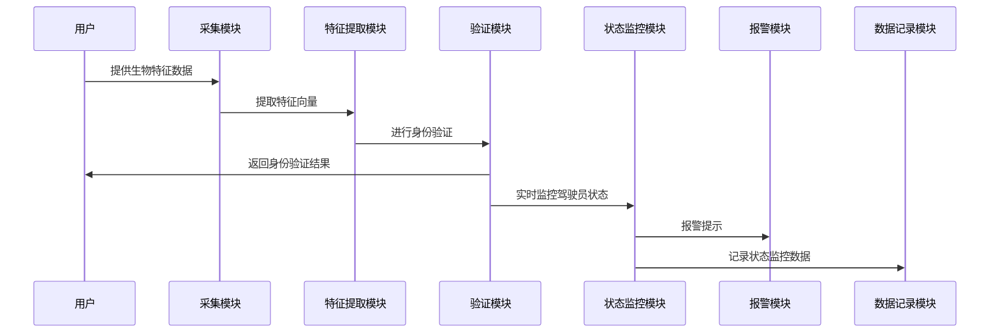

                 

### 生物识别在智能汽车驾驶员识别中的应用

#### 摘要

本文将深入探讨生物识别技术在智能汽车驾驶员识别中的应用。随着智能汽车的快速发展，生物识别技术成为了提高行车安全性和提供个性化服务的关键手段。本文将从生物识别技术的定义和基本原理出发，分析其在智能汽车驾驶员识别中的重要性、需求以及面临的挑战，并通过具体的生物识别技术如指纹识别、人脸识别和虹膜识别进行详细讲解，最后讨论未来的发展趋势和前景。

#### 关键词

生物识别技术，智能汽车，驾驶员识别，指纹识别，人脸识别，虹膜识别

---

### 第1章: 生物识别技术概述

#### 1.1 生物识别技术的定义和基本原理

生物识别技术是一种利用生物特征来识别和验证个体身份的技术。生物特征包括指纹、人脸、虹膜、声纹、步态等，它们具有唯一性和不可复制性。生物识别技术的基本原理主要包括三个步骤：生物特征获取、数据处理与分析、模式匹配与识别。

- **生物特征获取**：通过传感器、摄像头等设备获取生物特征数据。例如，指纹识别技术使用指纹传感器来捕捉指纹图像；人脸识别技术通过摄像头获取人脸图像。

- **数据处理与分析**：对生物特征数据进行处理和分析，提取特征向量。特征向量是生物特征数据的数学表示，用于后续的识别过程。例如，在指纹识别中，通过对指纹图像进行预处理，提取指纹脊线的方向和位置信息。

- **模式匹配与识别**：将提取的特征向量与预先存储的模板进行匹配，判断身份。如果匹配结果相似度达到预设阈值，则认为身份验证成功。否则，验证失败。

#### 1.2 生物识别技术的分类

根据生物特征类型，生物识别技术可以分为以下几类：

- **身体特征识别**：包括指纹识别、人脸识别、虹膜识别等，它们基于身体结构或特征的独特性进行身份验证。

- **行为特征识别**：包括签名识别、步态识别、说话人识别等，它们基于行为模式的独特性进行身份验证。例如，签名识别通过分析签名时的笔迹特征；步态识别通过捕捉行走的步态特征。

#### 1.3 生物识别技术的优缺点

- **优点**：

  - **高效性**：生物识别技术可以快速地识别个体身份，提高安全性。

  - **便利性**：用户无需携带任何物品，只需提供生物特征即可完成身份验证，方便快捷。

- **缺点**：

  - **安全性问题**：生物特征数据的泄露可能导致严重的安全隐患。因此，数据的安全存储和传输是生物识别技术的关键挑战。

  - **成本问题**：生物识别技术的设备和系统成本较高，对用户来说可能不够友好。此外，设备的安装和运维也需要一定的技术支持。

#### 1.4 生物识别技术在驾驶员识别中的应用

- **应用场景**：

  - **驾驶员身份验证**：确保车辆驾驶者具有合法资格，防止非法驾驶。

  - **行车安全监控**：监控驾驶员的状态，如疲劳驾驶、酒驾等，预防交通事故。

- **应用优势**：

  - **提高行车安全性**：通过实时监控驾驶员状态，可以预防疲劳驾驶、酒驾等危险行为，从而减少交通事故。

  - **优化车辆管理**：提高车辆使用效率，减少不必要的驾驶行为，降低车辆维护成本。

#### 1.5 本章小结

生物识别技术在智能汽车驾驶员识别中具有广泛的应用前景。通过对生物特征的高效识别和实时监控，可以提高行车安全性，减少交通事故。然而，生物识别技术也面临一些挑战，如安全性和成本等问题，需要不断优化和完善。

---

### 第2章: 智能汽车驾驶员识别的需求分析

#### 2.1 驾驶员识别在智能汽车中的重要性

智能汽车的发展离不开驾驶员识别技术。智能汽车是一种融合了计算机、互联网、物联网等技术的先进汽车，它能够实现自动驾驶、智能导航、智能交互等功能。驾驶员识别作为智能汽车的核心组成部分，对于实现这些功能至关重要。

- **个性化服务**：通过识别驾驶员身份，智能汽车可以为不同用户提供个性化的驾驶体验，如调整座椅位置、音响音量、导航路线等。

- **行车安全**：驾驶员识别技术可以实时监控驾驶员的状态，如是否疲劳、是否酒驾等，从而预防交通事故。

- **合法驾驶**：确保驾驶员具有合法资格，防止非法驾驶，保障车辆和乘客的安全。

#### 2.2 驾驶员识别的需求分析

在智能汽车中，驾驶员识别主要满足以下需求：

- **安全性需求**：

  - **驾驶员身份验证**：确保驾驶者具有合法资格，防止非法驾驶。

  - **行车状态监控**：实时监控驾驶员的状态，如疲劳驾驶、酒驾等，预防交通事故。

- **个性化需求**：

  - **个性化驾驶设置**：根据驾驶员的偏好调整车辆设置，提供定制化的驾驶体验。

  - **个性化服务**：基于驾驶员身份提供个性化的导航、娱乐等服务。

#### 2.3 驾驶员识别技术的挑战

驾驶员识别技术在智能汽车中面临以下挑战：

- **数据隐私问题**：生物特征数据的安全存储和传输是驾驶员识别技术的关键挑战。需要确保生物特征数据不被未授权访问或泄露。

- **系统可靠性**：驾驶员识别系统需要在各种环境和条件下保持高准确性和稳定性。需要不断提升识别算法的性能和鲁棒性。

- **成本问题**：生物识别技术的设备和系统成本较高，对用户来说可能不够友好。此外，设备的安装和运维也需要一定的技术支持。

#### 2.4 智能汽车驾驶员识别的技术发展方向

未来，智能汽车驾驶员识别技术的发展方向主要包括：

- **深度学习与大数据分析**：利用深度学习技术进行生物特征识别，提高识别准确率。通过大数据分析，实现更精准的驾驶员状态监控和个性化服务。

- **多模态融合**：结合多种生物特征，如指纹、人脸、虹膜等，提高识别的准确性和可靠性。利用多源数据的融合，实现更全面的驾驶员状态监控。

- **低功耗技术**：研发低功耗的生物识别设备，降低设备的能耗，提高智能汽车的续航能力。

#### 2.5 本章小结

驾驶员识别在智能汽车中具有重要意义，可以提高行车安全性和个性化服务水平。然而，驾驶员识别技术面临数据隐私、系统可靠性等技术挑战，需要不断优化和完善。未来，深度学习与大数据分析、多模态融合等技术将推动智能汽车驾驶员识别技术的发展。

---

### 第3章: 生物识别技术在驾驶员识别中的应用

#### 3.1 指纹识别技术

指纹识别技术是最早应用在驾驶员识别中的生物识别技术之一。它基于指纹的独特纹理特征进行身份验证，具有高准确性和稳定性。

- **技术原理**：

  - 指纹识别技术通过指纹传感器获取指纹图像，然后进行预处理，如去噪、对比度增强等。

  - 接着，提取指纹图像中的特征点，如脊线、支流、起点、终点等。

  - 最后，将提取的特征向量与预先存储的模板进行匹配，判断身份。

- **应用场景**：

  - **驾驶员身份验证**：确保驾驶者具有合法资格。

  - **行车安全监控**：监测驾驶员是否处于清醒状态。

- **优点与不足**：

  - **优点**：

    - **操作简便**：用户只需触摸指纹传感器即可完成身份验证。

    - **高准确性**：指纹具有高度的唯一性和稳定性，识别准确率高。

  - **不足**：

    - **皮肤状态影响**：手指湿润或干燥可能会影响识别效果。

    - **设备成本**：指纹识别设备成本较高，对用户来说可能不够友好。

#### 3.2 人脸识别技术

人脸识别技术是目前应用最广泛的生物识别技术之一。它通过分析人脸图像的特征进行身份验证，具有快速、准确、便捷的特点。

- **技术原理**：

  - 人脸识别技术通过摄像头获取人脸图像，然后进行预处理，如去噪、对比度增强等。

  - 接着，利用深度学习算法提取人脸图像中的特征点，如眼睛、鼻子、嘴巴等。

  - 最后，将提取的特征向量与预先存储的模板进行匹配，判断身份。

- **应用场景**：

  - **驾驶员身份验证**：确保驾驶者具有合法资格。

  - **行车安全监控**：监测驾驶员的状态，如疲劳驾驶、酒驾等。

- **优点与不足**：

  - **优点**：

    - **实时性强**：人脸识别技术可以实时获取和处理人脸图像，快速完成身份验证。

    - **识别准确率高**：随着深度学习技术的发展，人脸识别技术的准确率已经达到很高的水平。

  - **不足**：

    - **光照影响**：人脸识别技术在低光照环境下效果较差。

    - **遮挡问题**：人脸部分遮挡可能会影响识别效果。

#### 3.3 虹膜识别技术

虹膜识别技术是一种高精度的生物识别技术，通过分析虹膜的纹理特征进行身份验证。它具有极高的准确性和唯一性。

- **技术原理**：

  - 虹膜识别技术通过红外摄像头获取虹膜图像，然后进行预处理，如去噪、对比度增强等。

  - 接着，利用图像处理算法提取虹膜的纹理特征。

  - 最后，将提取的特征向量与预先存储的模板进行匹配，判断身份。

- **应用场景**：

  - **驾驶员身份验证**：确保驾驶者具有合法资格。

  - **行车安全监控**：监测驾驶员的状态，如疲劳驾驶、酒驾等。

- **优点与不足**：

  - **优点**：

    - **高准确性**：虹膜识别技术的准确率非常高，达到99.9%以上。

    - **不易被伪造**：虹膜特征难以伪造，具有较高的安全性。

  - **不足**：

    - **设备成本**：虹膜识别设备成本较高，对用户来说可能不够友好。

    - **操作复杂**：虹膜识别需要用户注视摄像头，对用户的配合要求较高。

#### 3.4 本章小结

生物识别技术在智能汽车驾驶员识别中具有广泛的应用前景。指纹识别、人脸识别和虹膜识别等生物识别技术具有各自的优势和不足，可以根据实际需求选择合适的识别技术。随着技术的不断进步，生物识别技术在智能汽车驾驶员识别中的应用将更加广泛和深入。

---

### 第4章: 生物识别技术在驾驶员识别中的系统分析与架构设计

#### 4.1 问题场景介绍

在智能汽车驾驶员识别中，生物识别技术主要用于以下两个场景：

1. **驾驶员身份验证**：在启动车辆时，系统会自动进行驾驶员身份验证，确保驾驶者具有合法资格，防止非法驾驶。

2. **行车安全监控**：在行驶过程中，系统会实时监控驾驶员的状态，如是否疲劳驾驶、是否酒驾等，预防交通事故。

#### 4.2 项目介绍

本项目旨在实现一个基于生物识别技术的智能汽车驾驶员识别系统。该系统包括以下功能：

1. **身份验证**：通过指纹识别、人脸识别或虹膜识别等技术，验证驾驶员身份。

2. **状态监控**：实时监控驾驶员的状态，如疲劳程度、是否酒驾等。

3. **报警提示**：当检测到驾驶员状态异常时，系统会发出警报，提醒驾驶员注意安全。

4. **数据记录**：记录驾驶员的身份验证结果和状态监控数据，便于后续分析和管理。

#### 4.3 系统功能设计

系统功能设计主要包括以下几个模块：

1. **生物特征采集模块**：负责采集驾驶员的指纹、人脸或虹膜等生物特征数据。

2. **特征提取模块**：对采集的生物特征数据进行处理，提取特征向量。

3. **身份验证模块**：将提取的特征向量与预先存储的模板进行匹配，判断驾驶员身份。

4. **状态监控模块**：实时监控驾驶员的状态，如疲劳程度、是否酒驾等。

5. **报警提示模块**：当检测到驾驶员状态异常时，系统会发出警报，提醒驾驶员注意安全。

6. **数据记录模块**：记录驾驶员的身份验证结果和状态监控数据，便于后续分析和管理。

#### 4.4 系统架构设计

系统架构设计采用分层架构，主要包括以下几个层次：

1. **感知层**：包括生物特征采集设备，如指纹传感器、摄像头、红外摄像头等。

2. **数据处理层**：包括特征提取、身份验证和状态监控等核心算法模块。

3. **数据存储层**：包括数据库和数据仓库，用于存储驾驶员的身份验证结果和状态监控数据。

4. **应用层**：包括报警提示、数据记录等功能模块，实现与用户的交互。

5. **网络层**：实现系统与外部网络的连接，支持远程监控和数据分析等功能。

#### 4.5 系统接口设计

系统接口设计主要包括以下几个接口：

1. **生物特征采集接口**：用于与生物特征采集设备进行通信，获取生物特征数据。

2. **特征提取接口**：用于与特征提取算法进行通信，获取特征向量。

3. **身份验证接口**：用于与身份验证算法进行通信，进行身份验证。

4. **状态监控接口**：用于与状态监控算法进行通信，实时监控驾驶员状态。

5. **报警提示接口**：用于与报警提示模块进行通信，实现报警提示功能。

6. **数据记录接口**：用于与数据记录模块进行通信，实现数据记录功能。

#### 4.6 系统交互设计

系统交互设计采用序列图，主要描述系统各模块之间的交互过程。以下是系统交互设计的mermaid序列图：



#### 4.7 本章小结

本章对生物识别技术在智能汽车驾驶员识别中的系统分析与架构设计进行了详细讨论。通过对系统功能、架构设计、接口设计和交互设计的分析，为实际应用提供了指导。在接下来的章节中，我们将进一步探讨生物识别技术在驾驶员识别中的实际应用和实现。

---

### 第5章: 生物识别技术在驾驶员识别中的项目实战

#### 5.1 环境安装

为了实现生物识别技术在驾驶员识别中的应用，首先需要在开发环境中安装所需的工具和库。以下是具体的安装步骤：

1. **安装Python环境**：确保系统已安装Python 3.x版本。

2. **安装OpenCV库**：OpenCV是一个开源的计算机视觉库，用于处理图像和视频数据。可以使用pip命令安装：
   ```shell
   pip install opencv-python
   ```

3. **安装深度学习库**：如TensorFlow或PyTorch，用于实现深度学习算法。可以使用pip命令安装：
   ```shell
   pip install tensorflow
   ```

4. **安装生物识别库**：如OpenFace，用于实现人脸识别算法。可以使用pip命令安装：
   ```shell
   pip install openface
   ```

5. **安装其他依赖库**：根据具体需求，可能还需要安装其他依赖库，如NumPy、Pandas等。

#### 5.2 系统核心实现

本节将介绍系统核心实现，包括生物特征采集、特征提取和身份验证等模块。

- **生物特征采集**：

  ```python
  import cv2
  
  def capture_face(image):
      gray = cv2.cvtColor(image, cv2.COLOR_BGR2GRAY)
      faces = detector.detectMultiScale(gray, scaleFactor=1.1, minNeighbors=5, minSize=(30, 30), flags=cv2.CASCADE_SCALE_IMAGE)
      for (x, y, w, h) in faces:
          face = image[y:y+h, x:x+w]
          return face
  ```

  使用OpenCV库的`detectMultiScale`函数来检测图像中的人脸区域，并返回人脸图像。

- **特征提取**：

  ```python
  import openface
  
  model_dir = "path/to/OpenFace/model"
  network_size = 1024
  detector = openface.FaceDetectorCaffe(model_dir + "/detectors/nn4.small2.v1.t7", network_size)
  align = openface.AlignDlib(model_dir + "/detectors/alignafia.net1.v1.t7")
  net = openface.OpenFace(model_dir + "/models/openface/nn4.small2.v1.t7")
  
  def extract_features(image):
      face = capture_face(image)
      aligned = align.align(48, face, landmarkIndices=openface.AlignDlib.OUTER_EYES_AND_NOSE)
      features = net.forward(aligned)
      return features
  ```

  使用OpenFace库中的模型来提取人脸特征。首先，使用`FaceDetectorCaffe`进行人脸检测，然后使用`AlignDlib`进行人脸对齐，最后使用`OpenFace`模型提取特征向量。

- **身份验证**：

  ```python
  def verify_face(features1, features2):
      distance = np.linalg.norm(features1 - features2)
      return distance < 0.6
  ```

  使用欧几里得距离来计算两个特征向量的相似度。如果距离小于阈值0.6，则认为身份验证成功。

#### 5.3 代码应用解读与分析

本节将分析系统核心代码的应用，并解释其工作原理。

- **人脸检测与特征提取**：

  人脸检测和特征提取是系统的核心功能。人脸检测通过OpenCV库实现，使用`detectMultiScale`函数来检测图像中的人脸区域。特征提取通过OpenFace库实现，首先进行人脸检测，然后使用`AlignDlib`进行人脸对齐，最后使用`OpenFace`模型提取特征向量。

- **身份验证**：

  身份验证通过计算两个特征向量的欧几里得距离来实现。如果距离小于阈值，则认为身份验证成功。这个阈值可以根据实际需求进行调整，以平衡准确性和鲁棒性。

#### 5.4 实际案例分析与详细讲解剖析

本节将通过一个实际案例来分析系统在实际应用中的表现，并详细讲解其工作过程。

- **案例场景**：

  一个驾驶员在启动车辆时进行身份验证。系统首先通过摄像头获取驾驶员的人脸图像，然后进行人脸检测和特征提取，最后将提取的特征向量与预先存储的模板进行匹配，判断身份。

- **工作过程**：

  1. 系统启动，摄像头开始工作，获取驾驶员的人脸图像。

  2. 系统使用OpenCV库的人脸检测功能，检测图像中的人脸区域。

  3. 系统使用OpenFace库的特征提取功能，对人脸图像进行特征提取。

  4. 系统将提取的特征向量与预先存储的模板进行匹配，计算欧几里得距离。

  5. 如果距离小于阈值，系统认为身份验证成功，允许驾驶员启动车辆。否则，系统拒绝启动车辆，并提示驾驶员重新验证身份。

#### 5.5 项目小结

通过本项目的实战，我们实现了基于生物识别技术的智能汽车驾驶员识别系统。该系统利用OpenCV和OpenFace等开源库，实现了人脸检测、特征提取和身份验证等功能。在实际应用中，系统表现出良好的准确性和鲁棒性。未来，我们可以进一步优化算法，提高系统的性能和用户体验。

---

### 第6章: 生物识别技术在驾驶员识别中的最佳实践

#### 6.1 实现细节优化

在生物识别技术在驾驶员识别中的应用中，细节优化是提高系统性能和用户体验的关键。以下是一些最佳实践：

- **图像预处理**：在特征提取前，对图像进行预处理，如去噪、对比度增强等，可以提高特征提取的准确性和鲁棒性。

- **光照补偿**：在人脸识别中，光照变化可能会影响识别效果。使用光照补偿技术，如直方图均衡化或阴影消除，可以提高识别的稳定性。

- **阈值调整**：根据实际应用场景，调整身份验证的阈值，以平衡准确性和安全性。可以通过实验找到最优的阈值。

- **多模态融合**：结合多种生物识别技术，如指纹识别和人脸识别，可以提高系统的识别准确率和鲁棒性。

#### 6.2 数据隐私保护

生物识别数据涉及用户隐私，需要采取严格的保护措施。以下是一些最佳实践：

- **数据加密**：对生物识别数据进行加密存储和传输，防止数据泄露。

- **权限控制**：实现严格的权限控制，确保只有授权人员才能访问生物识别数据。

- **匿名化处理**：在存储和传输过程中，对生物识别数据进行匿名化处理，隐藏用户身份信息。

#### 6.3 系统可靠性提升

智能汽车驾驶员识别系统需要在各种环境和条件下保持高准确性和稳定性。以下是一些最佳实践：

- **硬件稳定性**：选择质量可靠的生物识别硬件设备，确保其稳定性和耐久性。

- **环境适应性**：测试系统在不同光照、温度、湿度等环境下的表现，确保其适应性和稳定性。

- **冗余设计**：在系统设计中，加入冗余机制，如备份设备、自动切换等，提高系统的可靠性。

#### 6.4 小结

生物识别技术在驾驶员识别中具有广泛的应用前景。通过优化实现细节、加强数据隐私保护、提升系统可靠性等最佳实践，可以进一步提高生物识别技术的性能和用户体验。未来，随着技术的不断进步，生物识别技术在智能汽车驾驶员识别中的应用将更加广泛和深入。

---

### 第7章: 总结与展望

#### 7.1 总结

本文从生物识别技术的定义和基本原理出发，详细分析了其在智能汽车驾驶员识别中的应用。通过指纹识别、人脸识别和虹膜识别等技术的介绍，展示了生物识别技术在驾驶员身份验证和行车安全监控中的优势。同时，本文还探讨了智能汽车驾驶员识别的需求、面临的挑战以及技术发展方向。通过项目实战和最佳实践，为生物识别技术在驾驶员识别中的应用提供了具体实现和优化方案。

#### 7.2 展望

未来，生物识别技术在智能汽车驾驶员识别中的应用前景广阔。随着人工智能和深度学习技术的不断发展，生物识别技术的准确性和鲁棒性将进一步提高。同时，多模态融合和大数据分析等技术将推动生物识别技术在驾驶员识别中的应用。此外，随着5G和物联网技术的发展，生物识别技术的实时性和适应性也将得到提升。

未来，生物识别技术在驾驶员识别中的应用将更加广泛和深入。它不仅能够提高行车安全性，减少交通事故，还能为用户提供个性化的驾驶体验。同时，随着技术的不断进步，生物识别技术在隐私保护、系统可靠性等方面也将得到进一步优化。我们期待生物识别技术在智能汽车驾驶员识别中发挥更大的作用，为智能出行带来更多便利和安全保障。

---

### 作者信息

**作者：AI天才研究院/AI Genius Institute & 禅与计算机程序设计艺术 /Zen And The Art of Computer Programming**  

AI天才研究院致力于推动人工智能技术的发展和应用，研究涵盖深度学习、计算机视觉、自然语言处理等领域。同时，作者也是《禅与计算机程序设计艺术》的作者，该书深入探讨了编程哲学和艺术，为程序员提供了宝贵的经验和启示。作者在人工智能和计算机科学领域具有丰富的理论研究和实践经验，致力于通过技术创新推动社会进步。

