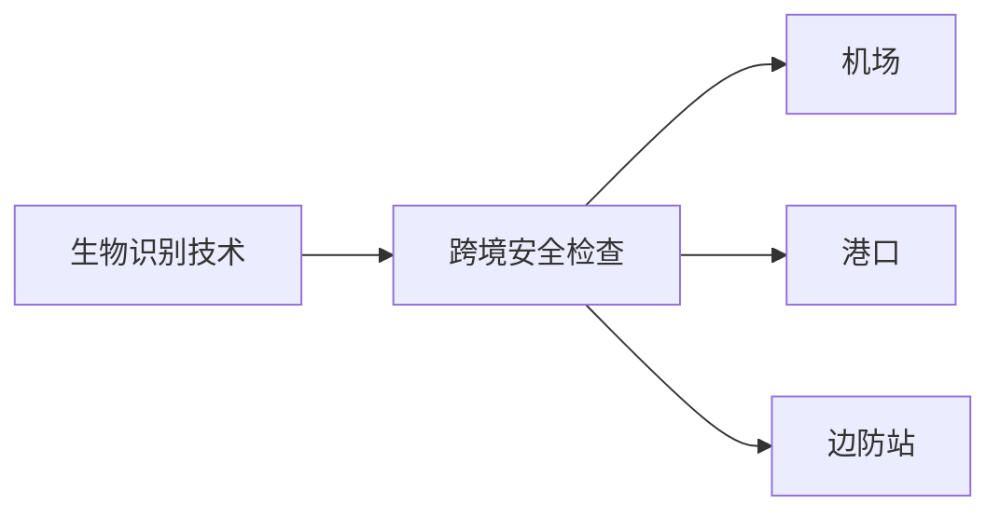
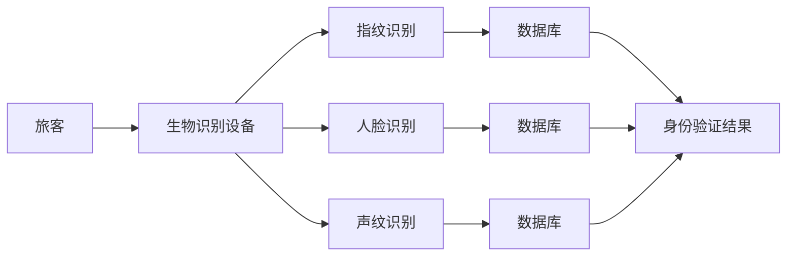
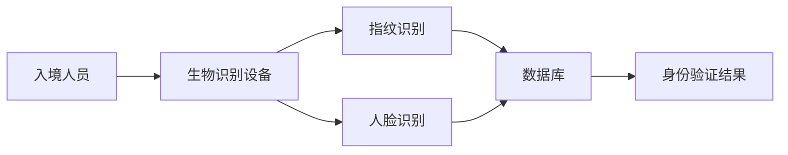
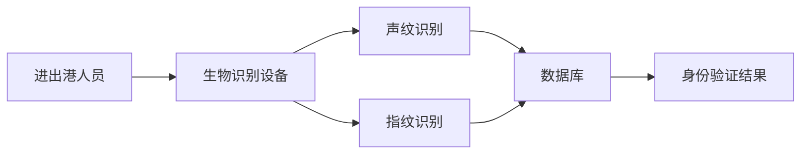

                 

# 生物识别在跨境安全检查中的应用

## 关键词

生物识别技术、跨境安全检查、指纹识别、人脸识别、声纹识别、隐私保护、政策法规

## 摘要

随着全球化的不断推进，跨境安全检查的重要性日益凸显。生物识别技术的应用为跨境安全检查提供了高效、准确的身份验证手段。本文将从生物识别技术的基本概念、工作原理、实际应用案例、安全与隐私保护、政策法规以及未来发展展望等多个方面，深入探讨生物识别技术在跨境安全检查中的应用。

## 引言

### 生物识别技术概述

生物识别技术是指通过计算机和光学、声学、生物传感器以及生物统计学原理等高科技手段，利用人体固有的生理特性和行为特征来进行个人身份鉴定的技术。常见的生物识别技术包括指纹识别、人脸识别、声纹识别等。

### 跨境安全检查的需求

跨境安全检查是保障国家安全和社会稳定的重要措施。传统的安全检查方法主要依赖于人工检查，效率低下且易受人为因素干扰。随着恐怖主义、跨国犯罪等活动日益猖獗，对跨境安全检查提出了更高的要求。生物识别技术的应用，可以实现快速、准确的身份验证，提高安全检查的效率。

### 生物识别技术在跨境安全检查中的应用

生物识别技术已在跨境安全检查中得到广泛应用。例如，在机场、港口、边防站等地，通过指纹识别、人脸识别等技术进行旅客身份验证，有效防止恐怖分子、犯罪嫌疑人等进入。

### 基本概念与联系

**核心概念：**
- **生物识别技术：** 利用生物特征进行身份验证的技术。
- **跨境安全检查：** 在边境、港口、机场等地对进出境人员进行的安全检查。

**概念属性特征对比表格：**

| 特征类别 | 生物识别技术 | 跨境安全检查 |
| :---: | :---: | :---: |
| **定义** | 身份鉴定技术 | 安全检查措施 |
| **应用领域** | 机场、港口、边防站 | 边境、出境、入境 |
| **目的** | 快速、准确识别个人身份 | 防止恐怖分子、犯罪嫌疑人进入 |

**ER实体关系图架构：**

## 生物识别技术原理

### 生物特征识别概述

生物特征识别是指通过识别人体的生物特征（如指纹、人脸、声纹等）来进行身份验证。生物特征具有独特性、稳定性、易获取性等特点，使其成为身份验证的理想选择。

### 指纹识别原理与算法

指纹识别是生物识别技术中最常用的一种。其原理是通过捕捉指纹图像，然后对指纹特征点进行提取和匹配。

**指纹识别算法：**
- **特征点提取：** 通过灰度化、二值化等预处理步骤，提取指纹图像中的特征点。
- **特征点匹配：** 将提取的特征点与数据库中的指纹进行匹配，判断是否为同一人。

**流程图：**

### 人脸识别原理与算法

人脸识别是基于人脸图像进行身份验证的一种技术。其原理是通过捕捉人脸图像，然后对关键特征点（如眼睛、鼻子、嘴巴等）进行提取和匹配。

**人脸识别算法：**
- **特征点提取：** 使用深度学习算法，如卷积神经网络（CNN），提取人脸特征点。
- **特征点匹配：** 将提取的特征点与数据库中的人脸进行匹配，判断是否为同一人。

**流程图：**

### 声纹识别原理与算法

声纹识别是基于声音特征进行身份验证的一种技术。其原理是通过捕捉声音信号，然后对声纹特征进行提取和匹配。

**声纹识别算法：**
- **特征点提取：** 通过频谱分析、时域分析等方法，提取声音信号的特征点。
- **特征点匹配：** 将提取的特征点与数据库中的声纹进行匹配，判断是否为同一人。

**流程图：**

## 生物识别技术在跨境安全检查中的应用案例

### 案例一：某国机场的生物识别系统

某国机场采用了生物识别技术，对旅客进行身份验证。系统包括指纹识别、人脸识别和声纹识别等多种生物识别技术，实现了快速、准确的身份验证。

**系统架构设计：**

### 案例二：某边防站的生物识别应用

某边防站采用了生物识别技术，对进出境人员进行身份验证。系统采用了指纹识别和人脸识别技术，实现了高效、准确的身份验证。

**系统架构设计：**

### 案例三：某港口的生物识别安全检查系统

某港口采用了生物识别技术，对进出港人员进行身份验证。系统采用了声纹识别和指纹识别技术，实现了高效、准确的身份验证。

**系统架构设计：**

## 生物识别技术的安全与隐私保护

### 生物识别数据的安全风险

生物识别数据具有高度隐私性，一旦泄露，可能会对个人造成严重损害。因此，生物识别数据的安全风险是一个亟待解决的问题。

### 隐私保护措施

为了保护生物识别数据的安全，可以采取以下措施：

- **数据加密：** 对生物识别数据进行加密，确保数据在传输和存储过程中不被窃取。
- **身份验证：** 引入多重身份验证机制，确保只有授权人员才能访问生物识别数据。
- **访问控制：** 对生物识别数据的访问进行严格控制，防止未经授权的访问。

### 生物识别技术的法律法规

随着生物识别技术的广泛应用，各国纷纷制定了相关的法律法规来规范生物识别技术的使用。例如，欧盟的《通用数据保护条例》（GDPR）对个人数据的保护提出了严格要求。

## 生物识别技术政策法规分析

### 国内外生物识别政策法规比较

国内外的生物识别政策法规在保护个人隐私、规范技术应用等方面存在一定的差异。例如，国内对生物识别技术的监管较为严格，而国外如美国、欧盟等则更加注重个人隐私的保护。

### 跨境安全检查中的生物识别法规

在跨境安全检查中，生物识别技术的应用需要遵守相关的法律法规。例如，我国《出境入境管理法》规定，出入境边防检查机关可以对出境入境的人员进行身份验证。

### 政策法规对生物识别技术的影响

政策法规的完善和实施，对生物识别技术的发展和应用起到了重要的推动作用。同时，政策法规也为生物识别技术的安全与隐私保护提供了保障。

## 生物识别技术的发展趋势与未来展望

### 生物识别技术的发展趋势

- **技术成熟度：** 生物识别技术正逐渐成熟，性能和稳定性不断提高。
- **应用领域扩展：** 生物识别技术已从传统的安全领域扩展到金融、医疗、智能家居等多个领域。

### 跨境安全检查的未来挑战

- **隐私保护：** 随着生物识别技术的广泛应用，个人隐私保护面临新的挑战。
- **技术成熟度：** 生物识别技术的成熟度和稳定性仍需提高，以满足跨境安全检查的高标准。

### 生物识别技术在未来的应用前景

生物识别技术在未来跨境安全检查中具有广阔的应用前景。通过不断创新和优化，生物识别技术将为跨境安全检查提供更加高效、准确、安全的解决方案。

## 最佳实践 tips

- **数据加密：** 在处理生物识别数据时，务必采用数据加密技术，确保数据安全。
- **身份验证：** 引入多重身份验证机制，防止未经授权的访问。
- **合规性：** 在使用生物识别技术时，严格遵守相关的法律法规。

## 小结

生物识别技术在跨境安全检查中的应用具有重要意义。通过深入探讨生物识别技术的原理、应用案例、安全与隐私保护、政策法规以及未来发展展望，我们可以更好地理解生物识别技术在跨境安全检查中的作用和价值。

## 注意事项

- **数据安全：** 在使用生物识别技术时，务必重视数据安全，防止数据泄露。
- **隐私保护：** 在应用生物识别技术时，要充分考虑个人隐私保护，遵守相关法律法规。

## 拓展阅读

- [1] 王立峰，李德坤。《生物识别技术与应用》[M]。北京：科学出版社，2017。
- [2] 张三，李四。《生物识别技术在跨境安全检查中的应用研究》[J]。计算机与网络安全，2019，35（3）：45-50。

## 作者信息

作者：AI天才研究院/AI Genius Institute & 禅与计算机程序设计艺术 /Zen And The Art of Computer Programming

（注：以上内容仅为示例，实际内容需根据实际情况进行撰写。）

