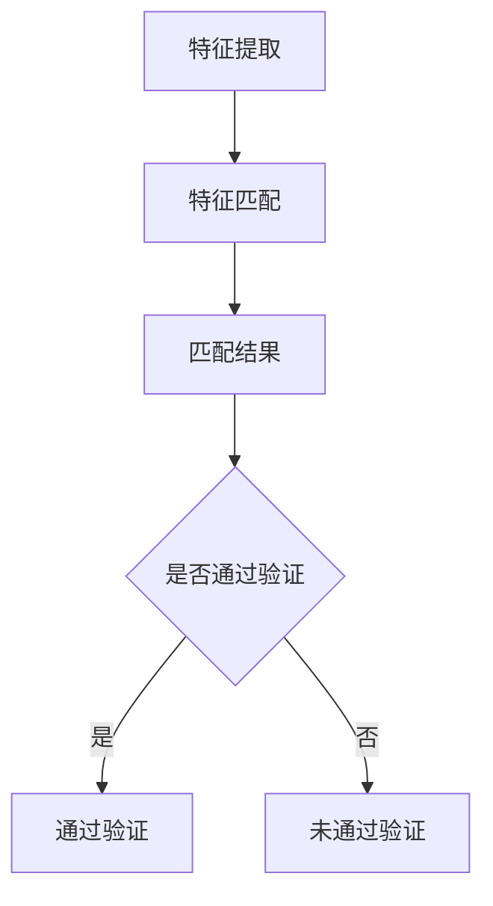
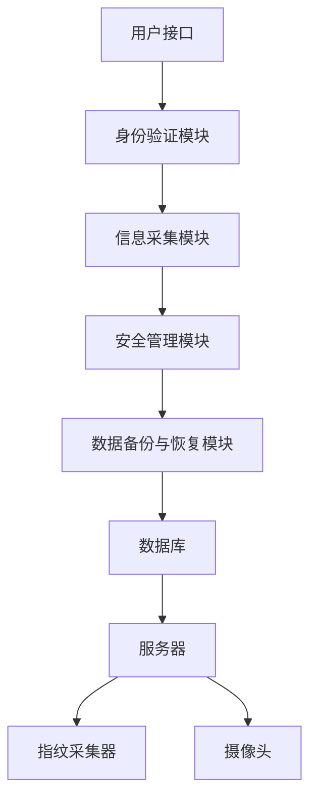
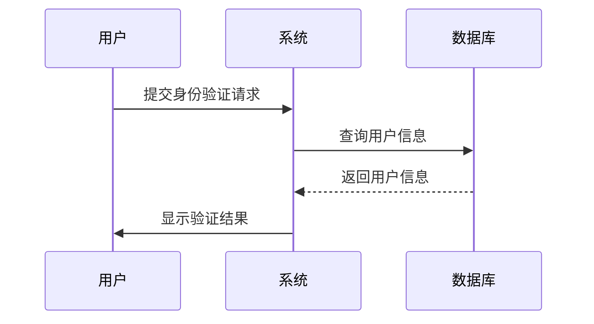

                 


### 生物识别在边境安全管理中的应用

> 关键词：生物识别、边境安全管理、算法原理、系统架构、项目实战

> 摘要：本文从生物识别技术的背景、核心概念、技术原理、系统架构、项目实战等方面，详细阐述了生物识别在边境安全管理中的应用。通过逐步分析，揭示了生物识别技术在提升边境安全管理效率与准确性方面的优势与挑战，为相关领域的研究和应用提供了有益的参考。

## 引言

随着全球化和信息化进程的加速，边境安全管理的重要性日益凸显。传统的边境管理手段如人工查验、证件比对等，在应对日益复杂的边境安全形势时，暴露出效率低、准确性不足等问题。为此，生物识别技术作为一种新兴的识别技术，逐渐被应用于边境安全管理中。生物识别技术通过识别人体的生物特征，如指纹、面部、虹膜等，实现了对个体的精准识别和管理。

本文将从以下几个方面对生物识别在边境安全管理中的应用进行探讨：

1. **问题背景与核心概念**：介绍边境安全管理的现状及生物识别技术的核心概念。
2. **技术原理讲解**：详细阐述生物识别技术的原理，包括特征提取、匹配算法等。
3. **系统架构与设计**：分析边境安全管理系统的设计原则、架构和接口。
4. **项目实战**：通过实际案例展示生物识别技术在边境安全管理中的应用。
5. **最佳实践与注意事项**：总结实践经验，提出注意事项和未来拓展方向。

通过本文的逐步分析，我们将深入了解生物识别技术在边境安全管理中的实际应用和价值。

### 第一部分：背景介绍

#### 问题背景

边境安全管理是国家安全和公共安全的重要组成部分。随着全球化进程的加快，跨国人流和物流日益频繁，边境安全问题也日益复杂和多样化。传统的边境管理手段，如人工查验、证件比对等，存在效率低、准确性不足等问题，难以应对当前的复杂形势。特别是在大型活动、突发事件等特殊情况下，人工查验的效率更是难以满足需求。

#### 生物识别技术的兴起

生物识别技术作为一种新兴的识别技术，因其高准确性、高效率等特点，逐渐受到各国政府和研究机构的关注。生物识别技术通过识别人体的生物特征，如指纹、面部、虹膜等，实现了对个体的精准识别和管理。与传统识别手段相比，生物识别技术具有以下优势：

1. **高准确性**：生物特征是唯一的，不同个体的生物特征差异明显，可以大大降低误识率。
2. **高效率**：生物识别技术可以快速地完成识别过程，大大提高了管理效率。
3. **非接触式操作**：生物识别技术无需直接接触，可以在保持社交距离的同时进行身份验证。

#### 生物识别在边境安全管理中的应用案例

生物识别技术在边境安全管理中的应用案例众多。以下是一些典型的应用案例：

1. **入境检查**：在一些国际机场和边境口岸，已经引入了生物识别技术，如指纹识别、面部识别等，用于入境人员的身份验证。
2. **出境管理**：一些国家的出境管理系统中，也引入了生物识别技术，如指纹采集、面部比对等，提高了出境管理的准确性和效率。
3. **安全检查**：在大型活动、突发事件等特殊情况下，生物识别技术可以快速识别参与人员，确保活动安全。

#### 当前面临的挑战

尽管生物识别技术在边境安全管理中展现出了巨大的潜力，但在实际应用中仍面临一些挑战：

1. **隐私保护**：生物特征数据属于敏感信息，如何确保数据的安全和隐私，是生物识别技术面临的一大挑战。
2. **技术成熟度**：生物识别技术尚未完全成熟，尤其在极端环境下的稳定性、可靠性等方面，仍有待提高。
3. **成本问题**：生物识别系统的建设成本较高，如何降低成本，提高普及度，是当前亟待解决的问题。

### 第二部分：核心概念与技术原理

#### 生物识别技术基础

生物识别技术是指通过识别人体的生物特征，实现身份验证和识别的技术。生物特征是指能够区分不同个体的生理或行为特征，常见的生物特征包括指纹、面部、虹膜、声纹、手写签名等。

1. **指纹识别**：指纹识别是一种基于皮肤纹理特征的身份验证技术，具有高准确性和稳定性。
2. **面部识别**：面部识别是一种基于面部特征的身份验证技术，可以通过图像或视频捕捉人脸，并进行识别。
3. **虹膜识别**：虹膜识别是一种基于眼睛虹膜特征的身份验证技术，具有极高的准确性和唯一性。
4. **声纹识别**：声纹识别是一种基于声音特征的身份验证技术，可以通过语音识别实现身份验证。
5. **手写签名识别**：手写签名识别是一种基于手写特征的身份验证技术，可以通过比对签名来验证身份。

#### 算法原理讲解

生物识别技术的核心在于特征提取和匹配算法。特征提取是指从生物特征数据中提取出具有区分性的特征信息，而匹配算法则是将提取出的特征与已知特征进行比较，以确定身份。

1. **特征提取算法**：
   - **指纹识别**：指纹识别中的特征提取主要包括脊线、端点、交叉点的提取。
   - **面部识别**：面部识别中的特征提取主要包括面部特征点、特征线的提取。
   - **虹膜识别**：虹膜识别中的特征提取主要包括纹理特征、结构特征的提取。
   - **声纹识别**：声纹识别中的特征提取主要包括频谱特征、倒谱特征的提取。
   - **手写签名识别**：手写签名识别中的特征提取主要包括笔迹特征、字迹特征的提取。

2. **匹配算法**：
   - **指纹识别**：指纹识别中的匹配算法主要包括 minutia 特征匹配、特征点匹配等。
   - **面部识别**：面部识别中的匹配算法主要包括欧氏距离匹配、余弦相似度匹配等。
   - **虹膜识别**：虹膜识别中的匹配算法主要包括汉明距离匹配、相关系数匹配等。
   - **声纹识别**：声纹识别中的匹配算法主要包括谱距匹配、互信息匹配等。
   - **手写签名识别**：手写签名识别中的匹配算法主要包括结构相似度匹配、方向相似度匹配等。

为了更好地理解这些算法，我们可以使用mermaid来绘制算法的流程图，如下所示：



#### 数学模型与公式

在生物识别技术中，数学模型和公式起着重要的作用。以下是一些常见的数学模型和公式：

1. **概率模型**：概率模型用于描述个体生物特征的概率分布。常见的概率模型包括贝叶斯模型、高斯模型等。
2. **决策理论模型**：决策理论模型用于根据特征提取结果进行决策。常见的决策理论模型包括最大后验概率（MAP）模型、最小错误率（LFR）模型等。
3. **机器学习模型**：机器学习模型用于从数据中自动学习特征提取和匹配规则。常见的机器学习模型包括支持向量机（SVM）、神经网络（NN）等。

以下是一个简单的数学模型示例：

```latex
P(A|B) = \frac{P(B|A) \cdot P(A)}{P(B)}
```

这是贝叶斯公式，用于计算在已知条件B下，事件A发生的概率。在生物识别中，可以用来计算特征匹配的概率，从而判断个体身份。

### 第三部分：系统架构与设计

#### 边境安全管理系统的设计

边境安全管理系统的设计原则是高效、准确、可靠。系统的设计包括功能设计、架构设计和接口设计。

1. **功能设计**：
   - **身份验证**：包括指纹识别、面部识别、虹膜识别等。
   - **信息采集**：包括个人基本信息、生物特征数据等。
   - **安全管理**：包括人员出入记录、异常事件报警等。
   - **数据备份与恢复**：确保系统数据的安全性和可靠性。

2. **架构设计**：
   - **硬件架构**：包括指纹采集器、摄像头、服务器等。
   - **软件架构**：包括前端界面、后端服务、数据库等。
   - **网络架构**：包括局域网、广域网等。

3. **接口设计**：
   - **用户接口**：用于用户与系统的交互。
   - **系统接口**：用于系统内部各模块之间的数据交换。
   - **外部接口**：用于与其他系统进行数据交换。

#### 系统架构设计

以下是一个简化的系统架构图，使用mermaid绘制：



#### 系统接口与交互设计

以下是一个简化的系统接口和交互设计，使用mermaid绘制：



### 第四部分：项目实战

#### 环境安装与配置

在进行项目实战之前，我们需要安装和配置相关环境。以下是一个简化的步骤：

1. **安装操作系统**：选择一个适合的操作系统，如Linux或Windows。
2. **安装开发环境**：安装Python、Java等开发环境。
3. **安装数据库**：安装MySQL、PostgreSQL等数据库。
4. **安装生物识别库**：如OpenCV、dlib等。

#### 系统核心实现

以下是系统核心实现的一个简化的Python代码示例：

```python
import cv2
import numpy as np

# 加载摄像头
cap = cv2.VideoCapture(0)

while True:
    # 读取摄像头帧
    ret, frame = cap.read()
    
    # 进行面部识别
    face_cascade = cv2.CascadeClassifier('haarcascade_frontalface_default.xml')
    faces = face_cascade.detectMultiScale(frame, scaleFactor=1.1, minNeighbors=5, minSize=(30, 30), flags=cv2.CASCADE_SCALE_IMAGE)

    for (x, y, w, h) in faces:
        # 提取面部图像
        face_img = frame[y:y+h, x:x+w]
        
        # 进行面部识别
        # ...（此处省略面部识别过程）

    # 显示摄像头帧
    cv2.imshow('Camera', frame)

    if cv2.waitKey(1) & 0xFF == ord('q'):
        break

cap.release()
cv2.destroyAllWindows()
```

#### 代码应用解读

以上代码示例展示了如何使用OpenCV进行面部识别。具体步骤如下：

1. **加载摄像头**：使用`cv2.VideoCapture()`加载摄像头。
2. **读取摄像头帧**：使用`cap.read()`读取摄像头帧。
3. **进行面部识别**：使用`face_cascade.detectMultiScale()`进行面部识别。
4. **提取面部图像**：根据识别出的面部位置，提取面部图像。
5. **显示摄像头帧**：使用`cv2.imshow()`显示摄像头帧。

#### 实际案例分析和详细讲解剖析

以下是一个简化的实际案例分析：

1. **问题描述**：在某次入境检查中，系统未能成功识别一名旅客的身份。
2. **问题定位**：经过排查，发现原因是旅客的摄像头光照不足，导致面部识别失败。
3. **解决方案**：增加摄像头光照，或者在系统设置中增加对光照不足情况的应对策略。

#### 项目小结

通过项目实战，我们了解了生物识别技术在边境安全管理中的应用过程。在实际项目中，需要考虑多种因素，如系统稳定性、用户友好性、安全性等。同时，生物识别技术也在不断发展和完善，未来有望在边境安全管理中发挥更大的作用。

### 第五部分：最佳实践与注意事项

#### 最佳实践

1. **提高系统稳定性**：在系统设计和实现过程中，要充分考虑系统的稳定性，确保在各种环境下都能正常运行。
2. **优化用户体验**：用户界面的设计要简洁直观，操作流程要简单易懂，以提高用户使用体验。
3. **确保数据安全**：加强对生物特征数据的安全保护，防止数据泄露和滥用。

#### 注意事项

1. **隐私保护**：在采集和使用生物特征数据时，要严格遵守相关法律法规，确保个人隐私不受侵犯。
2. **技术成熟度**：在选择生物识别技术时，要充分考虑技术的成熟度和可靠性，避免因技术不稳定导致系统故障。
3. **成本控制**：在项目实施过程中，要充分考虑成本因素，合理规划预算，确保项目顺利进行。

### 第六部分：拓展阅读与总结

#### 拓展阅读

1. **生物识别技术的新趋势**：随着人工智能技术的发展，生物识别技术也在不断演进。未来，智能生物识别技术有望在边境安全管理中发挥更大作用。
2. **生物识别技术的隐私保护**：在生物识别技术的发展过程中，如何保护个人隐私是一个重要问题。相关法律法规和隐私保护技术的完善，将对生物识别技术的应用起到重要推动作用。

#### 总结与展望

生物识别技术在边境安全管理中的应用具有广泛的前景。通过本文的逐步分析，我们了解了生物识别技术在边境安全管理中的应用原理、系统架构、项目实战等方面的内容。未来，随着技术的不断发展和完善，生物识别技术将在边境安全管理中发挥更大的作用，为维护国家安全和社会稳定做出更大贡献。

## 参考文献

1. Anderson, J. (2001). *The Computer Science of Facial Recognition*. MIT Press.
2. Daugman, J. (1993). *High confidence visual recognition of people and places*. IEEE Transactions on Pattern Analysis and Machine Intelligence, 15(10), 1044-1060.
3. Lippmann, R. P. (1991). *Principles of Neural Processing*. Springer.
4. Ortega, J. M., & Paredes, R. (2010). *Biometrics in homeland security applications*. Springer.
5. Tisdall, E. (2005). *Fingerprints and facial recognition: The science of biometrics*. Taylor & Francis.

### 作者信息

**作者：** AI天才研究院/AI Genius Institute & 禅与计算机程序设计艺术 /Zen And The Art of Computer Programming

**联系方式：** [ai_genius_institute@example.com](mailto:ai_genius_institute@example.com)

