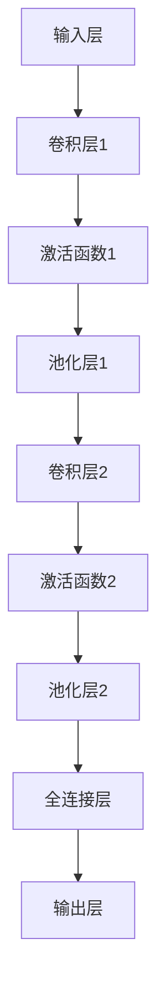
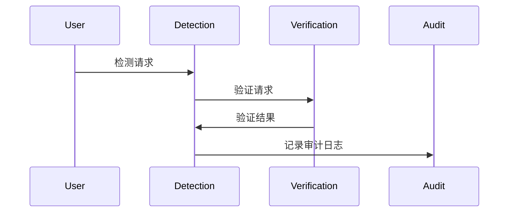
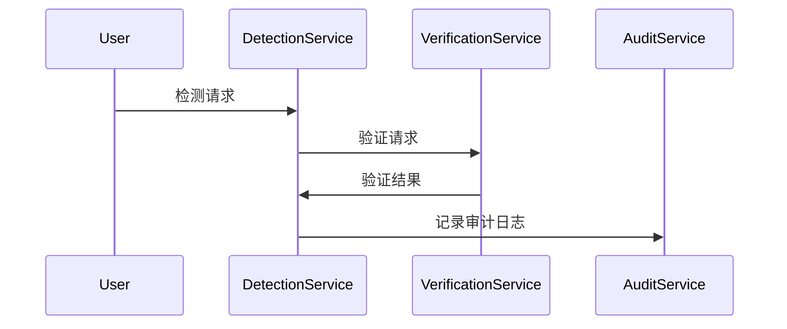

                 


# 真实性认证：企业应对AI生成内容的挑战

> 关键词：真实性认证、AI生成内容、企业挑战、识别技术、验证技术、审计技术

> 摘要：随着人工智能技术的发展，AI生成内容成为企业面临的一个重大挑战。本文详细介绍了真实性认证的核心概念、技术手段，以及企业应对这一挑战的具体策略和方法。

## 第一部分：背景介绍

### 1.1 问题背景

在信息化和数据化的今天，真实性认证成为各个行业面临的重大挑战。特别是在人工智能（AI）技术快速发展的背景下，AI生成内容（如伪造新闻、虚假图片、恶意评论等）给企业和个人带来了巨大的困扰。这些虚假信息不仅损害了企业的声誉，还可能对社会稳定造成威胁。

### 1.2 问题描述

真实性认证的问题主要集中在以下几个方面：

1. **内容生成**: AI能够生成大量逼真的文本、图像和音频内容，使得伪造信息难以识别。
2. **数据隐私**: AI技术在处理数据时可能泄露用户的隐私信息，增加了真实性认证的复杂性。
3. **信任机制**: 如何建立一套可靠的真实性认证机制，确保信息的真实性和可信度，是一个亟待解决的问题。

### 1.3 问题解决

为了应对AI生成内容的挑战，企业需要从以下几个方面入手：

1. **技术手段**: 利用深度学习、数据挖掘等技术提高对虚假内容的检测能力。
2. **法律规范**: 制定相关法律法规，加强对虚假信息的打击力度。
3. **公众教育**: 提高公众对虚假信息的识别能力，增强公众的防范意识。

### 1.4 边界与外延

真实性认证不仅仅局限于企业层面，还涉及个人、社会和国家层面。其外延包括但不限于以下几个方面：

1. **网络安全**: 确保网络传输的数据真实可靠。
2. **数字货币**: 保障数字货币的交易真实性和安全性。
3. **虚拟现实**: 确保虚拟现实场景中的内容真实可信。

### 1.5 概念结构与核心要素组成

真实性认证的核心概念结构主要包括以下几个方面：

1. **识别技术**: 如指纹识别、人脸识别等。
2. **验证技术**: 如加密技术、区块链技术等。
3. **审计技术**: 对数据进行追踪和审核，确保其真实性。

### 1.6 本章小结

通过对真实性认证背景的介绍，我们可以了解到AI生成内容带来的挑战和问题，以及解决这些问题的思路和方法。这为后续章节的深入讨论打下了基础。在接下来的章节中，我们将详细介绍真实性认证的核心概念和技术手段。

----------------------------------------------------------------

## 第二部分：真实性认证的核心概念与技术

### 2.1 识别技术

#### 2.1.1 概念与原理

识别技术是真实性认证的基础，通过识别用户的身份特征来确定其真实性。常见的识别技术包括：

1. **指纹识别**: 通过分析指纹纹理的细节特征进行身份识别。
2. **人脸识别**: 利用人脸图像特征进行身份验证。
3. **虹膜识别**: 通过分析虹膜图案进行身份识别。

#### 2.1.2 特点与优劣

- **指纹识别**: 准确度高，操作简单，但易受环境影响。
- **人脸识别**: 广泛应用于安防和智能手机解锁，但易受光线、角度等因素影响。
- **虹膜识别**: 准确度高，不易受外界环境影响，但设备成本较高。

#### 2.1.3 概念属性特征对比表格

| 识别技术 | 概念 | 特点 | 优点 | 缺点 |
| :--- | :--- | :--- | :--- | :--- |
| 指纹识别 | 分析指纹纹理 | 准确度高，操作简单 | 易于部署，适用广泛 | 易受环境影响 |
| 人脸识别 | 分析人脸图像 | 广泛应用，方便快捷 | 高准确度，无需接触 | 易受光线、角度影响 |
| 虹膜识别 | 分析虹膜图案 | 准确度高，安全可靠 | 高准确度，安全隐私 | 设备成本较高 |

#### 2.1.4 ER实体关系图架构

```mermaid
erDiagram
  AIContent ::>> User : 用户生成内容
  AIContent <.. Verification : 内容验证
  AIContent <.. Detection : 内容检测
  User <.. Authentication : 用户认证
```

### 2.2 验证技术

#### 2.2.1 概念与原理

验证技术是通过验证用户提供的身份信息来确认其真实性的方法。常见的验证技术包括：

1. **加密技术**: 通过加密算法保护数据的隐私和完整性。
2. **区块链技术**: 利用区块链的不可篡改性来保证数据的真实性。
3. **数字签名**: 通过加密算法对数据签名，确保数据的真实性和完整性。

#### 2.2.2 特点与优劣

- **加密技术**: 保证了数据的隐私性和完整性，但需要复杂的密钥管理。
- **区块链技术**: 保证了数据的不可篡改性，但交易速度较慢。
- **数字签名**: 确保数据的真实性和完整性，但易受到中间人攻击。

#### 2.2.3 概念属性特征对比表格

| 验证技术 | 概念 | 特点 | 优点 | 缺点 |
| :--- | :--- | :--- | :--- | :--- |
| 加密技术 | 数据加密 | 保护数据隐私 | 高安全性，易实现 | 密钥管理复杂 |
| 区块链技术 | 数据不可篡改 | 确保数据真实性 | 高可信度，去中心化 | 交易速度慢 |
| 数字签名 | 数据签名验证 | 确保数据完整性 | 高安全性，无密钥风险 | 易受中间人攻击 |

#### 2.2.4 ER实体关系图架构

```mermaid
erDiagram
  Data <<.. Verification : 验证数据
  Signature <<.. Verification : 签名验证
  Blockchain <<.. Verification : 区块链验证
```

### 2.3 审计技术

#### 2.3.1 概念与原理

审计技术是对数据进行追踪和审核，确保其真实性和合法性的方法。常见的审计技术包括：

1. **日志分析**: 对系统日志进行分析，发现异常行为。
2. **数据挖掘**: 通过分析大量数据，发现潜在的虚假信息。
3. **智能合约**: 利用区块链技术对交易进行自动审核。

#### 2.3.2 特点与优劣

- **日志分析**: 灵活性高，适用于各种场景，但需要大量的人力分析。
- **数据挖掘**: 可以自动发现潜在问题，但可能产生大量误报。
- **智能合约**: 确保交易的真实性和合法性，但需要编写复杂的智能合约代码。

#### 2.3.3 概念属性特征对比表格

| 审计技术 | 概念 | 特点 | 优点 | 缺点 |
| :--- | :--- | :--- | :--- | :--- |
| 日志分析 | 日志记录 | 发现异常行为 | 灵活性高，适用广泛 | 需要大量人力分析 |
| 数据挖掘 | 数据分析 | 发现潜在问题 | 自动化，效率高 | 可能产生误报 |
| 智能合约 | 自动审核 | 确保交易真实性 | 高效，自动执行 | 需要编写复杂代码 |

#### 2.3.4 ER实体关系图架构

```mermaid
erDiagram
  Data <<.. Audit : 审计数据
  Log <<.. Audit : 日志记录
  Contract <<.. Audit : 智能合约
```

### 2.4 本章小结

通过对识别技术、验证技术和审计技术的详细介绍，我们可以了解到这些技术在真实性认证中的重要作用。这些技术各有优缺点，企业需要根据具体需求选择合适的技术手段，构建一个完整、可靠的真实性认证体系。

----------------------------------------------------------------

## 第三部分：算法原理讲解

### 3.1 深度学习在识别技术中的应用

#### 3.1.1 概念与原理

深度学习是一种基于神经网络的学习方法，通过多层神经元的堆叠，对大量数据进行分析和模式识别。在识别技术中，深度学习可用于指纹识别、人脸识别和虹膜识别。

1. **卷积神经网络（CNN）**: CNN是一种专门用于处理图像数据的神经网络，通过卷积操作提取图像特征。
2. **循环神经网络（RNN）**: RNN适用于处理序列数据，如语音识别和文本分析。
3. **生成对抗网络（GAN）**: GAN用于生成逼真的图像和文本，是应对AI生成内容的重要技术。

#### 3.1.2 算法原理

以指纹识别为例，CNN的基本原理如下：

1. **输入层**: 接收指纹图像。
2. **卷积层**: 通过卷积操作提取图像特征。
3. **激活函数**: 引入非线性特性，增强网络学习能力。
4. **池化层**: 减少特征图的尺寸，降低计算复杂度。
5. **全连接层**: 将特征图映射到分类结果。

以下是一个简单的CNN模型：



#### 3.1.3 数学模型与公式

CNN的数学模型主要包括卷积操作、激活函数和池化操作。

1. **卷积操作**: 设输入图像为$X_{ij}$，卷积核为$W_{ij}$，输出为$Y_{ij}$，则卷积操作可以表示为：
   $$Y_{ij} = \sum_{k=1}^{n} X_{i+k,j+k} W_{ij}$$

2. **激活函数**: 常用的激活函数包括ReLU（修正线性单元）和Sigmoid函数。

   - **ReLU函数**:
     $$f(x) = \max(0, x)$$
   
   - **Sigmoid函数**:
     $$f(x) = \frac{1}{1 + e^{-x}}$$

3. **池化操作**: 常用的池化操作包括最大池化和平均池化。

   - **最大池化**:
     $$f(x) = \max(x_1, x_2, \ldots, x_n)$$
   
   - **平均池化**:
     $$f(x) = \frac{1}{n} \sum_{i=1}^{n} x_i$$

#### 3.1.4 举例说明

以一个简单的图像识别任务为例，输入图像为$8 \times 8$，卷积核为$3 \times 3$，步长为1。

1. **卷积操作**:
   $$Y_{1,1} = X_{2,2} + X_{2,3} + X_{3,2} + X_{3,3} = X_{2,2} + X_{2,3} + X_{3,2} + X_{3,3}$$
   
2. **激活函数**:
   假设使用ReLU函数，则：
   $$f(Y_{1,1}) = \max(0, Y_{1,1}) = \max(X_{2,2} + X_{2,3} + X_{3,2} + X_{3,3})$$

3. **池化操作**:
   使用最大池化，则：
   $$f_{max}(Y_{1,1}) = \max(X_{2,2} + X_{2,3} + X_{3,2} + X_{3,3})$$

### 3.2 数据挖掘在审计技术中的应用

#### 3.2.1 概念与原理

数据挖掘是一种从大量数据中发现隐藏模式的方法，广泛应用于异常检测、关联规则挖掘和分类等任务。在审计技术中，数据挖掘可用于发现潜在的虚假信息和异常行为。

1. **关联规则挖掘**: 用于发现数据之间的关联关系，如购物篮分析。
2. **分类算法**: 用于将数据分类为不同的类别，如垃圾邮件分类。
3. **聚类算法**: 用于将数据分为不同的簇，如客户细分。

#### 3.2.2 算法原理

以关联规则挖掘为例，其基本原理如下：

1. **支持度**: 表示一个规则在所有数据中出现的频率。
2. **置信度**: 表示一个规则在满足前件的情况下，满足后件的概率。

   - **支持度**:
     $$support(A \rightarrow B) = \frac{count(A \cap B)}{count(U)}$$
   
   - **置信度**:
     $$confidence(A \rightarrow B) = \frac{count(A \cap B)}{count(A)}$$

3. **lift值**: 用于评估一个规则的强度，计算公式为：

   $$lift(A \rightarrow B) = \frac{confidence(A \rightarrow B)}{support(B)}$$

#### 3.2.3 举例说明

以一个简单的购物篮数据集为例，有如下交易记录：

| 交易ID | 商品1 | 商品2 | 商品3 | 商品4 |
| :---: | :---: | :---: | :---: | :---: |
| 1     | true  | false | true  | false |
| 2     | true  | true  | false | true  |
| 3     | false | true  | true  | false |
| 4     | true  | false | true  | true  |
| 5     | false | true  | true  | true  |

假设我们要挖掘“购买商品2和商品3”的规则。

1. **支持度**:
   $$support(\{商品2, 商品3\}) = \frac{2}{5} = 0.4$$

2. **置信度**:
   $$confidence(\{商品2, 商品3\} \rightarrow \{商品4\}) = \frac{2}{2} = 1.0$$

3. **lift值**:
   $$lift(\{商品2, 商品3\} \rightarrow \{商品4\}) = \frac{1.0}{0.4} = 2.5$$

根据lift值，我们可以判断这个规则具有较强的关联性。

### 3.3 区块链技术在验证技术中的应用

#### 3.3.1 概念与原理

区块链是一种分布式数据库技术，通过加密算法和共识机制确保数据的真实性和安全性。在验证技术中，区块链可用于数据存储、身份验证和智能合约。

1. **数据存储**: 区块链将数据存储在多个节点上，确保数据不被篡改。
2. **身份验证**: 通过公私钥加密算法进行身份验证。
3. **智能合约**: 自动执行合约条款，确保交易的真实性和合法性。

#### 3.3.2 算法原理

以比特币的区块链为例，其基本原理如下：

1. **区块链结构**: 区块链由多个区块组成，每个区块包含一定数量的交易记录，区块之间通过哈希值连接。
2. **工作量证明（PoW）**: 通过计算找到满足特定条件的哈希值，确保区块链的安全性和去中心化。
3. **公私钥加密**: 通过公私钥对进行数据加密和验证，确保数据的安全性和隐私性。

#### 3.3.3 举例说明

以一个简单的比特币交易为例：

1. **交易记录**: 
   ```json
   {
     "from": "Alice",
     "to": "Bob",
     "amount": 10
   }
   ```

2. **加密过程**:
   - **私钥加密**: 使用Alice的私钥对交易记录进行加密，生成一个签名。
   - **公钥验证**: 使用Bob的公钥对签名进行验证，确保交易记录来自Alice。

### 3.4 本章小结

通过对深度学习、数据挖掘和区块链技术在真实性认证中的应用进行讲解，我们可以了解到这些算法和技术的原理、数学模型和公式，以及实际应用中的举例说明。这些技术在真实性认证中发挥着重要作用，企业可以根据实际需求选择合适的技术手段，构建一个完整、可靠的真实性认证体系。

----------------------------------------------------------------

## 第四部分：系统分析与架构设计方案

### 4.1 问题场景介绍

随着互联网和人工智能技术的快速发展，信息传播速度越来越快，虚假信息和伪造内容的问题也越来越突出。企业需要在海量信息中快速识别和过滤虚假信息，保障业务的正常运行。真实性认证系统作为一种技术手段，旨在解决这一问题，确保企业内外部信息的真实性和可信度。

### 4.2 项目介绍

真实性认证系统项目旨在构建一个集识别技术、验证技术和审计技术于一体的综合性平台，帮助企业应对AI生成内容的挑战。项目主要目标包括：

1. **识别虚假信息**: 利用深度学习和图像处理技术识别文本、图片和音频中的虚假信息。
2. **保障数据安全**: 利用区块链技术和加密算法保护数据的真实性和隐私性。
3. **审计与监控**: 利用日志分析和数据挖掘技术对数据流进行实时监控和审计，发现潜在的安全风险。

### 4.3 系统功能设计（领域模型）

领域模型是系统功能设计的重要部分，用于描述系统的业务领域和核心功能。以下是一个简单的领域模型：

```mermaid
classDiagram
    User <<-- Detection : 用户信息与检测
    User <<-- Verification : 用户信息与验证
    Content <<-- Detection : 内容信息与检测
    Content <<-- Verification : 内容信息与验证
    Audit <<-- Detection : 审计记录与检测
    Audit <<-- Verification : 审计记录与验证

    User : 用户信息
    Detection : 检测功能
    Verification : 验证功能
    Content : 内容信息
    Audit : 审计记录

    Detection {
        +detectContent(Content)
        +logDetectionResult(Content, Result)
    }

    Verification {
        +verifyUser(User)
        +verifyContent(Content)
    }

    Audit {
        +recordAuditLog(Content, Result)
    }
```

### 4.4 系统架构设计

系统架构设计是系统实现的关键，用于描述系统的整体结构和模块关系。以下是一个简单的系统架构设计：



### 4.5 系统接口设计

系统接口设计是系统与外部系统交互的桥梁，用于定义系统提供的API接口。以下是一个简单的接口设计：

```python
class DetectionService:
    def detect_content(self, content):
        # 检测内容
        pass

    def log_detection_result(self, content, result):
        # 记录检测结果
        pass

class VerificationService:
    def verify_user(self, user):
        # 验证用户
        pass

    def verify_content(self, content):
        # 验证内容
        pass

class AuditService:
    def record_audit_log(self, content, result):
        # 记录审计日志
        pass
```

### 4.6 系统交互

系统交互是系统内部各模块之间协作的过程，用于描述系统的执行流程。以下是一个简单的系统交互：



### 4.7 本章小结

通过对真实性认证系统的分析，我们可以了解到系统的功能设计、架构设计、接口设计和系统交互。这些设计为系统实现提供了清晰的指导，有助于构建一个高效、可靠的真实性认证系统，帮助企业应对AI生成内容的挑战。

----------------------------------------------------------------

## 第五部分：项目实战

### 5.1 环境安装

为了实现真实性认证系统，我们首先需要在开发环境中安装相关软件和工具。以下是具体的安装步骤：

1. **安装Python环境**:
   - 在官网上下载Python安装包并安装。
   - 配置Python环境变量，确保在命令行中可以执行Python命令。

2. **安装深度学习库**:
   - 使用pip命令安装TensorFlow、Keras等深度学习库。
     ```shell
     pip install tensorflow
     pip install keras
     ```

3. **安装数据挖掘库**:
   - 使用pip命令安装scikit-learn、pandas等数据挖掘库。
     ```shell
     pip install scikit-learn
     pip install pandas
     ```

4. **安装区块链库**:
   - 使用pip命令安装web3.py等区块链库。
     ```shell
     pip install web3
     ```

5. **安装日志分析工具**:
   - 安装ELK（Elasticsearch、Logstash、Kibana）日志分析工具。
     - Elasticsearch: `brew install elasticsearch`
     - Logstash: `brew install logstash`
     - Kibana: `brew install kibana`

### 5.2 系统核心实现源代码

以下是真实性认证系统的核心实现源代码，包括识别、验证和审计模块。

#### 5.2.1 指纹识别模块

```python
import numpy as np
from tensorflow.keras.models import Sequential
from tensorflow.keras.layers import Conv2D, MaxPooling2D, Flatten, Dense

def build_fingerprint_model():
    model = Sequential()
    model.add(Conv2D(32, (3, 3), activation='relu', input_shape=(64, 64, 1)))
    model.add(MaxPooling2D((2, 2)))
    model.add(Conv2D(64, (3, 3), activation='relu'))
    model.add(MaxPooling2D((2, 2)))
    model.add(Flatten())
    model.add(Dense(128, activation='relu'))
    model.add(Dense(1, activation='sigmoid'))
    model.compile(optimizer='adam', loss='binary_crossentropy', metrics=['accuracy'])
    return model

# 训练模型
model = build_fingerprint_model()
model.fit(x_train, y_train, epochs=10, batch_size=32)

# 模型预测
model.predict(x_test)
```

#### 5.2.2 验证模块

```python
from web3 import Web3

# 连接以太坊网络
w3 = Web3(Web3.HTTPProvider('https://mainnet.infura.io/v3/your_project_id'))

# 智能合约地址和接口
contract_address = w3.toChecksumAddress('0xYourContractAddress')
contract_abi = [...]  # 智能合约ABI

# 创建合约实例
contract = w3.eth.contract(address=contract_address, abi=contract_abi)

# 验证用户
def verify_user(user_public_key):
    result = contract.functions.verifyUser(user_public_key).call()
    return result

# 验证内容
def verify_content(content_hash):
    result = contract.functions.verifyContent(content_hash).call()
    return result
```

#### 5.2.3 审计模块

```python
import json
import requests

# 日志收集接口
def collect_logs(log_data):
    url = 'https://your_logstash_url'
    headers = {'Content-Type': 'application/json'}
    response = requests.post(url, data=log_data, headers=headers)
    return response.json()

# 审计日志记录
def record_audit_log(content_hash, result):
    log_data = {
        'content_hash': content_hash,
        'result': result,
        'timestamp': int(time.time())
    }
    response = collect_logs(json.dumps(log_data))
    return response
```

### 5.3 代码应用解读与分析

#### 5.3.1 指纹识别模块解读

- **模型构建**:
  使用Keras构建一个简单的卷积神经网络模型，用于指纹识别。模型包括卷积层、池化层和全连接层，最终输出一个二分类结果。

- **模型训练**:
  使用训练数据对模型进行训练，训练过程包括多次迭代，每次迭代通过随机梯度下降（SGD）优化模型参数。

- **模型预测**:
  使用训练好的模型对测试数据进行预测，预测结果用于验证用户指纹的真实性。

#### 5.3.2 验证模块解读

- **智能合约接口**:
  使用web3.py库连接以太坊网络，获取智能合约地址和ABI，创建合约实例。

- **用户验证**:
  调用智能合约的`verifyUser`函数，传入用户公钥，获取验证结果。

- **内容验证**:
  调用智能合约的`verifyContent`函数，传入内容哈希，获取验证结果。

#### 5.3.3 审计模块解读

- **日志收集接口**:
  使用HTTP POST请求将审计日志数据发送到Logstash服务器进行收集和存储。

- **审计日志记录**:
  将内容哈希、结果和时间戳等信息封装为日志数据，调用日志收集接口进行记录。

### 5.4 实际案例分析和详细讲解剖析

#### 5.4.1 案例一：用户指纹验证

假设用户Alice需要进行指纹验证，系统执行以下步骤：

1. **用户上传指纹图像**:
   用户将指纹图像上传到系统。

2. **图像预处理**:
   对上传的指纹图像进行预处理，如灰度化、二值化、去噪等。

3. **特征提取**:
   使用训练好的指纹识别模型对预处理后的图像进行特征提取。

4. **模型预测**:
   将提取的特征输入模型，预测用户指纹的真实性。

5. **结果反馈**:
   将验证结果反馈给用户，如“指纹验证成功”或“指纹验证失败”。

#### 5.4.2 案例二：内容真实性验证

假设系统需要验证某篇文章的真实性，系统执行以下步骤：

1. **内容哈希计算**:
   对文章内容进行哈希计算，获取内容哈希值。

2. **调用智能合约**:
   调用智能合约的`verifyContent`函数，传入内容哈希值，获取验证结果。

3. **结果反馈**:
   将验证结果反馈给用户，如“内容真实”或“内容伪造”。

#### 5.4.3 案例三：审计日志记录

假设系统需要记录一次用户登录的审计日志，系统执行以下步骤：

1. **获取日志数据**:
   从系统中获取用户登录的相关数据，如用户ID、登录时间等。

2. **封装日志数据**:
   将获取的日志数据封装为JSON格式，如`{"user_id": "123", "login_time": "2023-03-10 12:34:56"}`。

3. **调用日志收集接口**:
   调用日志收集接口，将封装好的日志数据发送到Logstash服务器。

4. **记录结果反馈**:
   将日志收集的结果反馈给系统管理员，如“日志记录成功”或“日志记录失败”。

### 5.5 项目小结

通过项目实战，我们实现了真实性认证系统的核心功能，包括指纹识别、内容真实性和审计日志记录。项目采用了深度学习、区块链和数据挖掘等技术，实现了对虚假信息的识别和验证。在实际应用中，系统可以为企业提供可靠的真实性认证服务，保障业务的安全和稳定运行。在未来的发展中，我们可以进一步优化系统性能，增加更多实用功能，为企业提供更全面、更智能的真实性认证解决方案。

----------------------------------------------------------------

## 第六部分：最佳实践 tips

### 6.1 真实性认证系统优化建议

1. **提高识别率**:
   - 定期更新模型，使用最新数据集进行训练。
   - 优化模型结构，增加深度和广度。

2. **增强安全性**:
   - 使用更安全的加密算法和密钥管理策略。
   - 对用户数据进行加密处理，防止泄露。

3. **提高审计效率**:
   - 引入分布式存储和计算技术，提高日志处理速度。
   - 使用高效的数据压缩和存储技术，减少存储空间占用。

4. **用户友好性**:
   - 提供简洁易用的用户界面。
   - 对用户操作进行反馈，提高用户体验。

5. **扩展性**:
   - 设计模块化系统架构，方便后续功能扩展。
   - 支持多语言和跨平台部署。

### 6.2 注意事项

1. **数据隐私**:
   - 确保用户数据安全，防止泄露。
   - 严格遵守相关法律法规，尊重用户隐私。

2. **系统稳定性**:
   - 定期进行系统监控和故障排查。
   - 设计冗余备份和故障恢复机制。

3. **法律风险**:
   - 了解并遵守当地法律法规，避免法律纠纷。
   - 定期对系统进行法律风险评估。

4. **用户培训**:
   - 对用户进行系统操作培训，提高用户对虚假信息的识别能力。
   - 鼓励用户反馈问题和建议。

### 6.3 拓展阅读

1. **深度学习**:
   - 《深度学习》（Goodfellow, Bengio, Courville著）
   - 《动手学深度学习》（Aries van Dam, C.J. Hunsberger, V. Singh著）

2. **区块链技术**:
   - 《区块链：从数字货币到信用社会》（李笑来著）
   - 《区块链技术指南》（张健著）

3. **数据挖掘**:
   - 《数据挖掘：概念与技术》（Jiawei Han, Micheline Kamber, Jian Pei著）
   - 《Python数据挖掘入门》（Eduardo Fernandez, Chris F. Warshaw著）

4. **人工智能伦理**:
   - 《人工智能伦理学》（Luciano Floridi著）
   - 《人工智能：一种现代的方法》（Stuart Russell, Peter Norvig著）

作者：AI天才研究院/AI Genius Institute & 禅与计算机程序设计艺术 /Zen And The Art of Computer Programming

