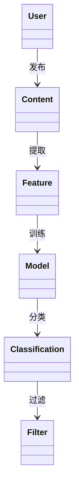
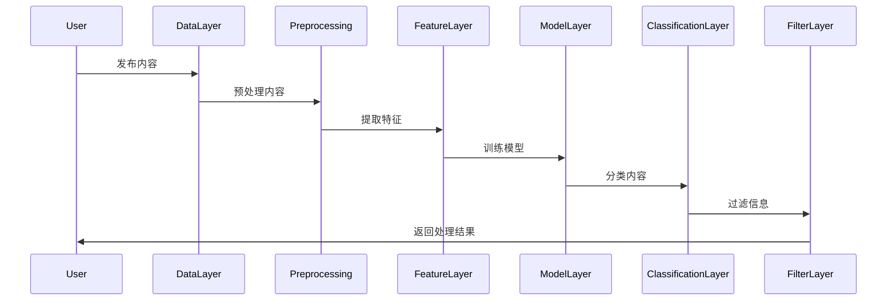
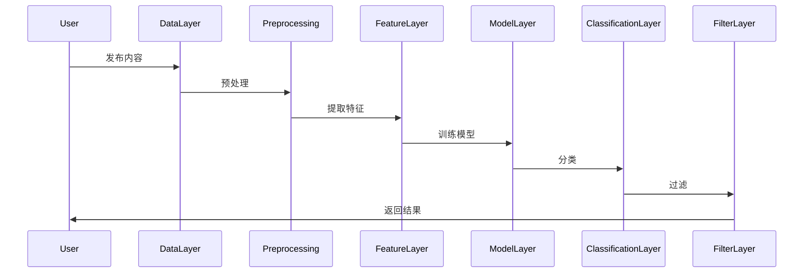

                 

## 社交媒体平台应对虚假信息的责任

### 关键词

- 社交媒体
- 虚假信息
- 责任
- 识别技术
- 算法
- 用户行为分析

### 摘要

随着社交媒体平台的迅猛发展，虚假信息的传播问题日益严重，给社会带来了诸多负面影响。本文旨在探讨社交媒体平台在应对虚假信息方面的责任，并分析现有的技术手段和解决方案。通过逐步分析问题背景、核心概念、算法原理以及系统架构设计，本文为社交媒体平台提供了一个全面的应对虚假信息的框架和思路。

### 目录

1. **问题背景与核心概念**
   1.1 问题背景
   1.2 核心概念

2. **核心概念与联系**
   2.1 虚假信息的识别技术
   2.2 社交媒体平台的技术架构

3. **算法原理讲解**
   3.1 识别虚假信息的算法
   3.2 数学模型与公式
   3.3 算法讲解与举例

4. **系统分析与架构设计方案**
   4.1 问题场景介绍
   4.2 系统功能设计
   4.3 系统架构设计
   4.4 系统交互设计

5. **项目实战**
   5.1 环境安装与配置
   5.2 系统核心实现源代码
   5.3 实际案例分析

6. **最佳实践与注意事项**
   6.1 虚假信息检测最佳实践
   6.2 注意事项

7. **小结与拓展阅读**
   7.1 小结
   7.2 拓展阅读

### 1. 问题背景与核心概念

#### 1.1 问题背景

在互联网时代，社交媒体平台已成为人们获取信息、交流观点的重要渠道。然而，随着社交媒体平台的普及和用户数量的激增，虚假信息的传播问题日益严重。虚假信息可能来自用户发布的内容，也可能来自不法分子故意制造的谣言，它们在社交媒体上迅速扩散，误导大量用户，对社会造成了巨大的负面影响。

#### 1.2 核心概念

**虚假信息**：指在形式、内容或目的上故意误导、欺骗他人的信息。

**社交媒体平台**：以社交关系为基础，通过互联网进行信息交流和分享的平台。

**责任**：社交媒体平台在应对虚假信息传播中的法律和道德义务。

### 2. 核心概念与联系

#### 2.1 虚假信息的识别技术

为了应对虚假信息的传播，社交媒体平台需要依赖一系列的技术手段进行识别。主要包括：

- **自然语言处理（NLP）**：用于分析文本内容，理解语义和情感，从而识别虚假信息。
- **计算机视觉（CV）**：通过图像识别技术，检测图像中的虚假信息。
- **机器学习（ML）**：利用大量数据进行训练，自动识别和分类虚假信息。

#### 2.2 社交媒体平台的技术架构

社交媒体平台的技术架构包括以下几个方面：

- **数据收集与存储**：收集用户生成的内容，并将其存储在数据库中。
- **数据处理与分析**：对收集到的数据进行分析，识别潜在的风险和虚假信息。
- **用户行为分析**：通过分析用户的行为模式，识别虚假信息的传播途径。

### 3. 算法原理讲解

#### 3.1 识别虚假信息的算法

社交媒体平台通常采用以下几种算法来识别虚假信息：

- **基于规则的方法**：通过预设的规则和条件，自动判断信息是否虚假。
- **基于机器学习的方法**：利用大量数据进行训练，自动识别和分类虚假信息。

#### 3.2 数学模型与公式

在识别虚假信息的过程中，常用的数学模型和公式包括：

- **概率论基础**：用于计算信息的可信度。
- **贝叶斯定理**：用于更新信息的可信度。
- **支持向量机（SVM）**：用于分类和识别虚假信息。

#### 3.3 算法讲解与举例

**算法讲解**：

1. 收集大量虚假信息和真实信息，进行预处理。
2. 提取文本特征，如词频、情感极性等。
3. 利用机器学习算法，训练分类模型。
4. 对新内容进行分类，判断其是否为虚假信息。

**举例说明**：

假设我们使用一个简单的逻辑回归模型来识别虚假信息。逻辑回归模型的公式为：

$$
P(\text{虚假}) = \frac{1}{1 + e^{-(\beta_0 + \beta_1x_1 + \beta_2x_2 + \ldots + \beta_nx_n})}
$$

其中，$P(\text{虚假})$ 表示信息为虚假的概率，$e$ 为自然对数的底数，$\beta_0, \beta_1, \beta_2, \ldots, \beta_n$ 为模型参数，$x_1, x_2, \ldots, x_n$ 为特征向量。

例如，对于一个包含情感极性、词频等特征的信息，我们计算其是否为虚假信息的概率。如果概率大于某个阈值（例如0.5），则认为该信息为虚假信息。

### 4. 系统分析与架构设计方案

#### 4.1 问题场景介绍

在当前的社交媒体平台上，虚假信息的传播已经成为一个严重的问题。为了解决这一问题，我们需要设计一个系统来识别和过滤虚假信息。

#### 4.2 系统功能设计

系统的主要功能包括：

- 数据收集：收集社交媒体平台上的用户生成内容。
- 数据预处理：对收集到的内容进行清洗和格式化。
- 特征提取：提取文本和图像特征。
- 模型训练：利用训练数据训练分类模型。
- 信息分类：对用户生成内容进行分类，判断其是否为虚假信息。
- 信息过滤：过滤掉虚假信息，防止其在平台上传播。

**领域模型**：



#### 4.3 系统架构设计

系统的架构设计如下：

- **数据层**：负责数据的收集、存储和管理。
- **处理层**：负责数据的预处理、特征提取和模型训练。
- **应用层**：负责信息分类和过滤。

**架构图**：



#### 4.4 系统交互设计

系统的交互设计如下：

1. 用户发布内容。
2. 数据层收集内容，并预处理。
3. 特征层提取特征，并传递给模型层。
4. 模型层训练分类模型。
5. 分类层对内容进行分类。
6. 过滤层过滤虚假信息。
7. 最终结果返回给用户。

**序列图**：



### 5. 项目实战

#### 5.1 环境安装与配置

为了搭建一个虚假信息识别系统，我们需要安装以下软件和库：

- Python 3.8
- TensorFlow 2.3
- NumPy 1.19
- Pandas 1.1

安装步骤如下：

1. 安装 Python 3.8：
   ```bash
   sudo apt update
   sudo apt install python3.8
   ```
   
2. 安装 TensorFlow 2.3：
   ```bash
   pip3 install tensorflow==2.3
   ```
   
3. 安装 NumPy 1.19：
   ```bash
   pip3 install numpy==1.19
   ```
   
4. 安装 Pandas 1.1：
   ```bash
   pip3 install pandas==1.1
   ```

#### 5.2 系统核心实现源代码

以下是一个简单的虚假信息识别系统的核心实现代码：

```python
import tensorflow as tf
import numpy as np
import pandas as pd

# 数据预处理
def preprocess_data(data):
    # 清洗和格式化数据
    # 提取特征
    # 返回特征向量
    pass

# 训练模型
def train_model(features, labels):
    # 定义模型结构
    # 编译模型
    # 训练模型
    pass

# 识别虚假信息
def classify_content(content):
    # 预处理内容
    # 使用训练好的模型进行分类
    # 返回分类结果
    pass

# 主程序
if __name__ == "__main__":
    # 加载数据
    # 预处理数据
    # 训练模型
    # 识别新内容
```

#### 5.3 实际案例分析

假设我们有一个包含大量虚假信息和真实信息的训练数据集。我们可以使用以下步骤进行训练和识别：

1. 加载数据集：
   ```python
   data = pd.read_csv("data.csv")
   ```

2. 预处理数据：
   ```python
   processed_data = preprocess_data(data)
   ```

3. 训练模型：
   ```python
   model = train_model(processed_data["features"], processed_data["labels"])
   ```

4. 识别新内容：
   ```python
   content = "这是一个虚假信息。"
   result = classify_content(content)
   print(result)
   ```

### 6. 最佳实践与注意事项

#### 6.1 虚假信息检测最佳实践

1. 使用多种算法和模型进行综合判断，提高识别准确率。
2. 定期更新模型和算法，适应不断变化的虚假信息特征。
3. 提高用户参与度，鼓励用户举报虚假信息。

#### 6.2 注意事项

1. 在处理用户数据时，确保遵守隐私保护法规。
2. 考虑用户体验，避免过度过滤和误判。

### 7. 小结与拓展阅读

#### 7.1 小结

本文从问题背景、核心概念、算法原理、系统架构设计等多个角度，详细探讨了社交媒体平台应对虚假信息的责任。通过项目实战，展示了虚假信息识别系统的实现过程。

#### 7.2 拓展阅读

1. 《社交媒体平台虚假信息检测技术研究》
2. 《机器学习在虚假信息识别中的应用》

### 作者

**作者：AI天才研究院/AI Genius Institute & 禅与计算机程序设计艺术 /Zen And The Art of Computer Programming**

---

文章完。

