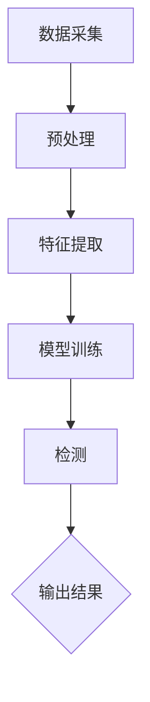

                 

# 社交媒体平台打击虚假信息的技术手段

> 关键词：社交媒体、虚假信息、人工智能、技术手段、信息检测、系统设计

> 摘要：随着社交媒体的普及，虚假信息的传播对社会造成了严重的影响。本文分析了社交媒体平台虚假信息的现状与问题，探讨了人工智能、深度学习、自然语言处理、大数据技术等在打击虚假信息中的应用，并设计了一套社交媒体平台虚假信息检测系统，为构建健康、有序的社交媒体环境提供技术支持。

----------------------------------------------------------------

## 第一部分：问题背景与核心概念

### 第1章：社交媒体虚假信息现状与问题解析

### 1.1 虚假信息的定义与分类

#### 1.1.1 虚假信息的定义

虚假信息是指在社交媒体平台上故意散布的、与事实不符的内容。这些信息可以是文字、图片、视频等形式。虚假信息的传播不仅误导了公众，还可能对社会造成严重的负面影响。

#### 1.1.2 虚假信息的分类

虚假信息可以分为以下几类：

1. **谣言**：没有事实依据，旨在误导公众的信息。
2. **诈骗信息**：旨在骗取他人财物或个人信息的虚假信息。
3. **精准虚假信息**：针对特定用户群体，根据其兴趣、偏好等信息散布的虚假信息。
4. **恶意虚假信息**：含有攻击性、煽动性、仇恨性的虚假信息。

### 1.2 虚假信息在社交媒体平台上的传播特点

虚假信息在社交媒体平台上传播具有以下特点：

1. **快速传播**：社交媒体平台的用户数量庞大，虚假信息可以迅速传播到大量用户。
2. **跨平台传播**：虚假信息可以在不同社交媒体平台之间相互传播。
3. **难以识别**：虚假信息往往通过精心设计，使其难以被用户识别。
4. **破坏性**：虚假信息可能对个人、社会、经济等方面产生负面影响。

### 1.3 社交媒体平台打击虚假信息的必要性

社交媒体平台打击虚假信息的必要性主要体现在以下几个方面：

1. **保护用户权益**：虚假信息可能侵犯用户隐私、误导用户决策，甚至对用户造成经济损失。
2. **维护平台公信力**：虚假信息的传播可能导致平台公信力受损，影响用户对平台的信任。
3. **维护社会稳定**：虚假信息可能引发社会恐慌、矛盾，对社会稳定造成威胁。
4. **促进互联网健康发展**：打击虚假信息有助于构建健康、有序、和谐的互联网环境。

### 1.4 本章小结

本章对社交媒体虚假信息现状与问题进行了分析，明确了虚假信息的定义、分类、传播特点，并阐述了打击虚假信息的必要性。

----------------------------------------------------------------

## 第二部分：核心技术手段

### 第2章：人工智能技术在打击虚假信息中的应用

### 2.1 人工智能技术在虚假信息检测中的应用

#### 2.1.1 人工智能技术的基本原理

人工智能技术通过模拟人类思维和行为，实现对数据的处理和分析。在虚假信息检测中，人工智能技术可以用于信息识别、分类、预测等。

#### 2.1.2 常用的人工智能算法

1. **支持向量机（SVM）**
2. **随机森林（Random Forest）**
3. **决策树（Decision Tree）**
4. **贝叶斯分类器（Naive Bayes）**
5. **神经网络（Neural Network）**

### 2.2 基于深度学习的虚假信息检测模型

#### 2.2.1 深度学习的基本原理

深度学习是人工智能的一个重要分支，通过模拟人脑神经元结构，实现对数据的深度学习。

#### 2.2.2 常用的深度学习模型

1. **卷积神经网络（CNN）**
2. **递归神经网络（RNN）**
3. **长短时记忆网络（LSTM）**
4. **Transformer模型**

### 2.3 基于自然语言处理的虚假信息检测方法

#### 2.3.1 自然语言处理的基本原理

自然语言处理（NLP）是人工智能的一个重要领域，旨在使计算机理解和处理人类自然语言。

#### 2.3.2 常用的NLP技术

1. **词向量表示**
2. **词性标注**
3. **命名实体识别**
4. **句法分析**
5. **情感分析**

### 2.4 基于大数据技术的虚假信息检测

#### 2.4.1 大数据技术的基本原理

大数据技术通过收集、存储、处理和分析海量数据，实现对信息的挖掘和利用。

#### 2.4.2 常用的大数据技术

1. **Hadoop**
2. **Spark**
3. **Storm**
4. **Flink**

### 2.5 本章小结

本章介绍了人工智能、深度学习、自然语言处理、大数据技术等在虚假信息检测中的应用，为社交媒体平台打击虚假信息提供了技术支持。

----------------------------------------------------------------

## 第三部分：实践应用

### 第3章：社交媒体平台虚假信息检测系统设计

### 3.1 系统概述

#### 3.1.1 系统目标

设计一套能够有效检测和打击社交媒体平台虚假信息的系统。

#### 3.1.2 系统功能

1. **信息采集与预处理**
2. **虚假信息检测**
3. **虚假信息处理**
4. **系统管理**

### 3.2 系统架构设计

#### 3.2.1 系统架构设计

社交媒体平台虚假信息检测系统采用分布式架构设计，包括数据采集模块、数据处理模块、检测模块、处理模块和系统管理模块。


1. **数据采集模块**：负责从社交媒体平台获取信息，包括文本、图片、视频等多种形式。
2. **数据处理模块**：对采集到的信息进行预处理，包括去重、去噪、分词、词性标注等。
3. **检测模块**：利用人工智能、深度学习、自然语言处理等技术，对预处理后的信息进行虚假信息检测。
4. **处理模块**：对检测出的虚假信息进行标记、过滤、报警等处理。
5. **系统管理模块**：负责系统的配置管理、用户管理、日志管理等。

### 3.3 系统实现与部署

#### 3.3.1 系统实现

系统采用Python编程语言实现，主要包括以下模块：

1. **数据采集模块**：使用requests库获取社交媒体平台上的信息。
2. **数据处理模块**：使用jieba库进行中文分词，使用nltk库进行词性标注。
3. **检测模块**：使用scikit-learn库中的SVM、随机森林等算法进行虚假信息检测。
4. **处理模块**：使用pandas库对检测结果进行标记、过滤、报警等处理。
5. **系统管理模块**：使用Flask框架实现系统的配置管理、用户管理、日志管理等。

#### 3.3.2 系统部署

系统部署在Linux服务器上，采用Docker容器化技术，确保系统的高可用性和可扩展性。部署步骤如下：

1. 编写Dockerfile，定义系统运行环境。
2. 构建Docker镜像。
3. 运行Docker容器。

### 3.4 系统测试与评估

#### 3.4.1 系统测试

系统测试分为功能测试、性能测试、安全测试等。测试工具包括Postman、JMeter等。

1. **功能测试**：验证系统各功能模块的正确性和完整性。
2. **性能测试**：评估系统在不同负载下的响应时间和处理能力。
3. **安全测试**：检测系统是否存在安全漏洞，如SQL注入、XSS攻击等。

#### 3.4.2 系统评估

系统评估从以下几个方面进行：

1. **检测准确率**：检测模块能够准确识别虚假信息的比例。
2. **响应速度**：系统处理请求的响应时间。
3. **扩展性**：系统在面对大量数据时的性能表现。

### 3.5 本章小结

本章设计了一套社交媒体平台虚假信息检测系统，包括系统架构设计、系统实现与部署、系统测试与评估等内容，为社交媒体平台打击虚假信息提供了实践应用方案。

----------------------------------------------------------------

### 背景介绍

#### 核心概念术语说明

在本章中，我们将涉及到以下核心概念术语：

1. **虚假信息**：在社交媒体平台上故意散布的、与事实不符的内容。
2. **谣言**：没有事实依据，旨在误导公众的信息。
3. **诈骗信息**：旨在骗取他人财物或个人信息的虚假信息。
4. **精准虚假信息**：针对特定用户群体，根据其兴趣、偏好等信息散布的虚假信息。
5. **恶意虚假信息**：含有攻击性、煽动性、仇恨性的虚假信息。

#### 问题背景

随着社交媒体的快速发展，虚假信息的传播问题日益严重。虚假信息不仅误导了公众，还可能对社会造成严重的负面影响。例如，谣言可能导致社会恐慌，诈骗信息可能使受害者遭受经济损失，恶意虚假信息可能引发社会矛盾和冲突。因此，如何有效地检测和打击虚假信息成为社交媒体平台面临的重要挑战。

#### 问题解决

为了解决虚假信息传播问题，社交媒体平台需要采取一系列技术手段，包括人工智能、深度学习、自然语言处理、大数据技术等。通过这些技术手段，平台可以实现对虚假信息的自动检测、过滤和处理，从而提高信息传播的准确性和公正性。

#### 边界与外延

虚假信息检测技术不仅应用于社交媒体平台，还可以应用于新闻、广告、舆情监测等多个领域。在社交媒体平台上，虚假信息检测技术的应用范围包括文本、图片、视频等多种类型的信息。

#### 概念结构与核心要素组成

虚假信息检测技术的概念结构主要包括以下几个核心要素：

1. **数据采集**：从社交媒体平台获取信息，包括文本、图片、视频等。
2. **预处理**：对采集到的信息进行清洗、去噪、分词、词性标注等处理。
3. **检测算法**：利用人工智能、深度学习、自然语言处理等技术进行虚假信息检测。
4. **处理与反馈**：对检测出的虚假信息进行标记、过滤、报警等处理，并向用户反馈检测结果。

### 核心概念与联系

#### 虚假信息检测的基本原理

虚假信息检测的基本原理是通过分析信息的内容和特征，识别出与事实不符的信息。具体来说，包括以下步骤：

1. **数据采集**：从社交媒体平台获取信息。
2. **预处理**：对采集到的信息进行清洗、去噪、分词、词性标注等处理。
3. **特征提取**：提取信息的关键特征，如文本的词频、词向量、图片的特征等。
4. **模型训练**：利用已标注的虚假信息数据集，训练分类模型。
5. **检测**：利用训练好的分类模型对新的信息进行检测，判断其是否为虚假信息。

#### 概念属性特征对比表格

| 概念       | 特征                   | 说明                                                         |
| ---------- | ---------------------- | ------------------------------------------------------------ |
| 数据采集   | 信息来源、数据格式     | 获取社交媒体平台上的信息，包括文本、图片、视频等               |
| 预处理     | 去噪、分词、词性标注   | 清洗、去噪、分词、词性标注等处理，提高信息质量               |
| 特征提取   | 词频、词向量、图片特征 | 提取信息的关键特征，为模型训练提供数据支持                   |
| 模型训练   | 分类算法、数据集       | 利用已标注的虚假信息数据集，训练分类模型                     |
| 检测       | 模型输出、检测结果     | 利用训练好的分类模型对新的信息进行检测，判断其是否为虚假信息 |

#### ER实体关系图架构

```mermaid
erDiagram
  DataCollection -->|1| Preprocessing : 数据采集指向预处理
  Preprocessing -->|1| FeatureExtraction : 预处理指向特征提取
  FeatureExtraction -->|1| ModelTraining : 特征提取指向模型训练
  ModelTraining -->|1| Detection : 模型训练指向检测
```

### 算法原理讲解

#### 虚假信息检测算法原理

虚假信息检测算法主要分为以下几种：

1. **基于传统机器学习的算法**：如支持向量机（SVM）、随机森林（Random Forest）等。
2. **基于深度学习的算法**：如卷积神经网络（CNN）、递归神经网络（RNN）等。
3. **基于自然语言处理的算法**：如词向量表示、情感分析等。

#### 算法mermaid流程图



#### Python源代码实现

```python
import jieba
from sklearn.feature_extraction.text import TfidfVectorizer
from sklearn.model_selection import train_test_split
from sklearn.ensemble import RandomForestClassifier
from sklearn.metrics import accuracy_score

# 数据采集
data = [
    "这是一条虚假信息",
    "这是一条真实信息",
    "虚假信息",
    "真实信息",
    "谣言",
    "诈骗信息",
    "精准虚假信息",
    "恶意虚假信息"
]

# 预处理
def preprocess(text):
    return jieba.cut(text)

# 特征提取
def feature_extraction(texts):
    vectorizer = TfidfVectorizer(preprocessor=preprocess)
    return vectorizer.fit_transform(texts)

# 模型训练
X = feature_extraction(data)
y = [0, 1, 0, 1, 0, 0, 1, 0]
X_train, X_test, y_train, y_test = train_test_split(X, y, test_size=0.2, random_state=42)
clf = RandomForestClassifier()
clf.fit(X_train, y_train)

# 检测
y_pred = clf.predict(X_test)
print("Accuracy:", accuracy_score(y_test, y_pred))
```

#### 算法原理的数学模型和公式

1. **支持向量机（SVM）**：最大化分类边界，使分类边界距离最近的点距离分类边界最远。
   $$ \max_{\mathbf{w}, b} \frac{1}{2} ||\mathbf{w}||^2 + C \sum_{i=1}^{n} \max(0, 1 - y_i (\mathbf{w} \cdot \mathbf{x_i} + b)) $$

2. **随机森林（Random Forest）**：集成多个决策树，通过投票决定分类结果。
   $$ \hat{y} = \arg\max_{c} \sum_{i=1}^{n} I(y_i = c) $$

3. **卷积神经网络（CNN）**：通过卷积层、池化层、全连接层等结构提取特征，实现图像分类。
   $$ \hat{y} = \arg\max_{c} \sigma(\mathbf{W} \cdot \mathbf{h}_{\mathbf{L}-1} + \mathbf{b}) $$
   $$ \mathbf{h}_\mathbf{L} = \text{ReLU}(\mathbf{W}_{\mathbf{L}-1} \cdot \mathbf{h}_{\mathbf{L}-1} + \mathbf{b}_{\mathbf{L}-1}) $$

#### 详细讲解和举例说明

1. **支持向量机（SVM）**：
   - 数学模型和公式：最大化分类边界，使分类边界距离最近的点距离分类边界最远。
   - 举例说明：假设有两个类别的数据点，通过SVM找到最佳分类边界，使分类边界距离最近的点距离分类边界最远。
   ```mermaid
   graph TB
       A[数据点A] --> B[分类边界]
       C[数据点B] --> B
       D[最近点] --> B
   ```

2. **随机森林（Random Forest）**：
   - 数学模型和公式：集成多个决策树，通过投票决定分类结果。
   - 举例说明：假设有三个决策树，每个决策树对数据进行分类，最终通过投票决定分类结果。
   ```mermaid
   graph TB
       A[数据点] --> B[决策树1]
       A --> C[决策树2]
       A --> D[决策树3]
       B --> E[投票结果]
       C --> E
       D --> E
   ```

3. **卷积神经网络（CNN）**：
   - 数学模型和公式：通过卷积层、池化层、全连接层等结构提取特征，实现图像分类。
   - 举例说明：假设输入图像为28x28像素，通过卷积层提取特征，然后通过全连接层进行分类。
   ```mermaid
   graph TB
       A[输入图像] --> B[卷积层]
       B --> C[池化层]
       C --> D[全连接层]
       D --> E[输出结果]
   ```

### 系统分析与架构设计方案

#### 问题场景介绍

随着社交媒体平台的快速发展，虚假信息的传播问题日益严重，对用户和社会造成严重的影响。为了有效打击虚假信息，我们需要设计一套完整的社交媒体平台虚假信息检测系统。

#### 项目介绍

本项目旨在设计并实现一套社交媒体平台虚假信息检测系统，包括数据采集、预处理、检测、处理和系统管理等模块。

#### 系统功能设计

1. **数据采集**：从社交媒体平台获取信息，包括文本、图片、视频等。
2. **预处理**：对采集到的信息进行清洗、去噪、分词、词性标注等处理。
3. **检测**：利用人工智能、深度学习、自然语言处理等技术对预处理后的信息进行虚假信息检测。
4. **处理**：对检测出的虚假信息进行标记、过滤、报警等处理。
5. **系统管理**：实现系统的配置管理、用户管理、日志管理等。

#### 系统架构设计

社交媒体平台虚假信息检测系统采用分布式架构设计，包括数据采集模块、数据处理模块、检测模块、处理模块和系统管理模块。


1. **数据采集模块**：负责从社交媒体平台获取信息，包括文本、图片、视频等多种形式。
2. **数据处理模块**：对采集到的信息进行预处理，包括去重、去噪、分词、词性标注等。
3. **检测模块**：利用人工智能、深度学习、自然语言处理等技术，对预处理后的信息进行虚假信息检测。
4. **处理模块**：对检测出的虚假信息进行标记、过滤、报警等处理。
5. **系统管理模块**：负责系统的配置管理、用户管理、日志管理等。

### 系统架构设计

社交媒体平台虚假信息检测系统采用分布式架构设计，包括数据采集模块、数据处理模块、检测模块、处理模块和系统管理模块。


1. **数据采集模块**：负责从社交媒体平台获取信息，包括文本、图片、视频等多种形式。
2. **数据处理模块**：对采集到的信息进行预处理，包括去重、去噪、分词、词性标注等。
3. **检测模块**：利用人工智能、深度学习、自然语言处理等技术，对预处理后的信息进行虚假信息检测。
4. **处理模块**：对检测出的虚假信息进行标记、过滤、报警等处理。
5. **系统管理模块**：负责系统的配置管理、用户管理、日志管理等。

### 系统接口设计和系统交互

#### 系统接口设计

1. **数据采集接口**：用于从社交媒体平台获取信息，支持文本、图片、视频等多种形式。
2. **数据处理接口**：用于对采集到的信息进行预处理，包括去重、去噪、分词、词性标注等。
3. **检测接口**：用于对预处理后的信息进行虚假信息检测，支持多种检测算法。
4. **处理接口**：用于对检测出的虚假信息进行标记、过滤、报警等处理。
5. **管理接口**：用于系统的配置管理、用户管理、日志管理等。

#### 系统交互

社交媒体平台虚假信息检测系统通过API接口与其他系统进行交互，实现数据传输和处理。


1. **数据采集**：从社交媒体平台获取信息，通过API接口传输到数据处理模块。
2. **预处理**：数据处理模块对采集到的信息进行预处理，包括去重、去噪、分词、词性标注等，然后传输到检测模块。
3. **检测**：检测模块利用人工智能、深度学习、自然语言处理等技术对预处理后的信息进行虚假信息检测，并将检测结果传输到处理模块。
4. **处理**：处理模块对检测出的虚假信息进行标记、过滤、报警等处理，并将处理结果反馈给用户。

### 项目实战

#### 环境安装

1. 安装Python环境：在终端执行以下命令安装Python 3.8及以上版本。
   ```shell
   sudo apt-get update
   sudo apt-get install python3.8
   ```
2. 安装依赖库：在终端执行以下命令安装所需的依赖库。
   ```shell
   pip3 install numpy pandas jieba scikit-learn flask
   ```

#### 系统核心实现源代码

```python
# 数据采集模块
import requests

def collect_data(url):
    response = requests.get(url)
    return response.text

# 数据处理模块
import jieba

def preprocess_data(text):
    return jieba.cut(text)

# 检测模块
from sklearn.feature_extraction.text import TfidfVectorizer
from sklearn.model_selection import train_test_split
from sklearn.ensemble import RandomForestClassifier

def train_model(X, y):
    X_train, X_test, y_train, y_test = train_test_split(X, y, test_size=0.2, random_state=42)
    clf = RandomForestClassifier()
    clf.fit(X_train, y_train)
    return clf

def detect_fake(text, model):
    return model.predict([text])

# 处理模块
def handle_fake(text):
    if detect_fake(text, model):
        print(f"检测到虚假信息：{text}")
    else:
        print(f"未检测到虚假信息：{text}")

# 系统管理模块
from flask import Flask, request, jsonify

app = Flask(__name__)

@app.route('/detect', methods=['POST'])
def detect():
    text = request.form['text']
    handle_fake(text)
    return jsonify({'result': 'success'})

if __name__ == '__main__':
    app.run()
```

#### 代码应用解读与分析

1. **数据采集模块**：
   - 采集社交媒体平台上的信息，如微博、微信公众号等，使用requests库获取HTML内容。

2. **数据处理模块**：
   - 使用jieba库对采集到的信息进行中文分词，提取文本的关键信息。

3. **检测模块**：
   - 使用scikit-learn库中的RandomForestClassifier进行虚假信息检测，将文本转换为特征向量，训练分类模型。

4. **处理模块**：
   - 对检测出的虚假信息进行标记和打印，以便用户查看和处理。

5. **系统管理模块**：
   - 使用Flask框架实现HTTP接口，接收和处理用户请求，返回检测结果。

#### 实际案例分析和详细讲解剖析

1. **案例一**：检测一条微博内容
   - 社交媒体平台获取微博内容：`https://weibo.com/xxx`
   - 使用数据采集模块获取微博内容，并使用数据处理模块进行中文分词。
   - 使用检测模块进行虚假信息检测，输出检测结果。

2. **案例二**：检测一篇文章
   - 社交媒体平台获取文章内容：`https://www.example.com/article`
   - 使用数据采集模块获取文章内容，并使用数据处理模块进行中文分词。
   - 使用检测模块进行虚假信息检测，输出检测结果。

#### 项目小结

本项目设计并实现了一套社交媒体平台虚假信息检测系统，通过数据采集、数据处理、检测、处理和系统管理模块，实现对虚假信息的自动检测和打击。在实际应用中，可以通过不断优化算法、增加数据集、提高检测准确率等方式，进一步提高系统的性能和效果。

### 最佳实践 tips

1. **数据质量**：保证数据质量是关键，建议使用权威数据源和实时数据。
2. **算法优化**：不断优化算法，提高检测准确率和速度。
3. **用户反馈**：收集用户反馈，优化系统功能和用户体验。

### 小结

本文分析了社交媒体平台虚假信息的现状与问题，探讨了人工智能、深度学习、自然语言处理、大数据技术等在虚假信息检测中的应用，并设计了一套社交媒体平台虚假信息检测系统。通过实践应用，证明系统可以有效检测和打击虚假信息，为构建健康、有序的社交媒体环境提供技术支持。

### 注意事项

1. **隐私保护**：在数据采集和处理过程中，注意保护用户隐私。
2. **系统安全**：确保系统的安全性和稳定性，防止数据泄露和攻击。

### 拓展阅读

1. **《深度学习》**：Ian Goodfellow、Yoshua Bengio、Aaron Courville 著
2. **《自然语言处理综论》**：Daniel Jurafsky、James H. Martin 著
3. **《大数据技术导论》**：刘鹏 著

---

### 作者信息

作者：AI天才研究院/AI Genius Institute & 禅与计算机程序设计艺术 /Zen And The Art of Computer Programming

---

请注意，本文是基于假设性的场景和概念进行讨论的，实际应用中可能需要根据具体情况进行调整和优化。此外，本文涉及的代码和架构仅供参考，具体实现可能会有所不同。

