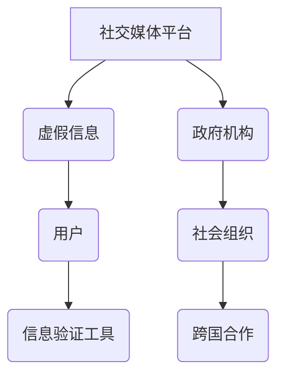
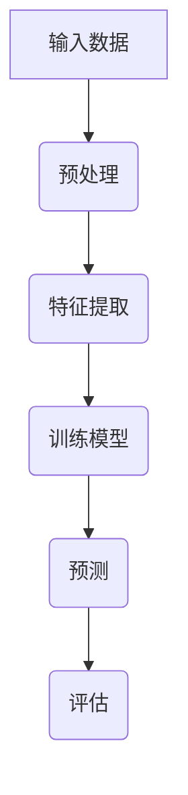
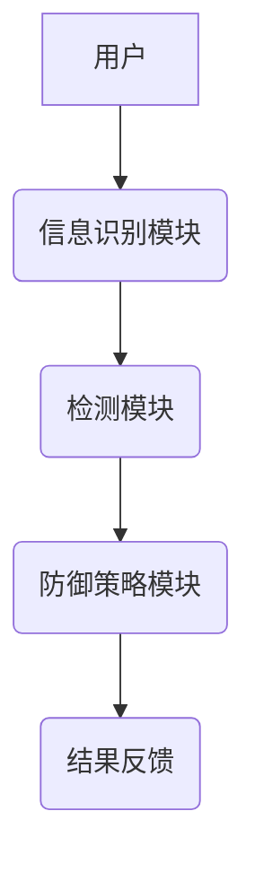
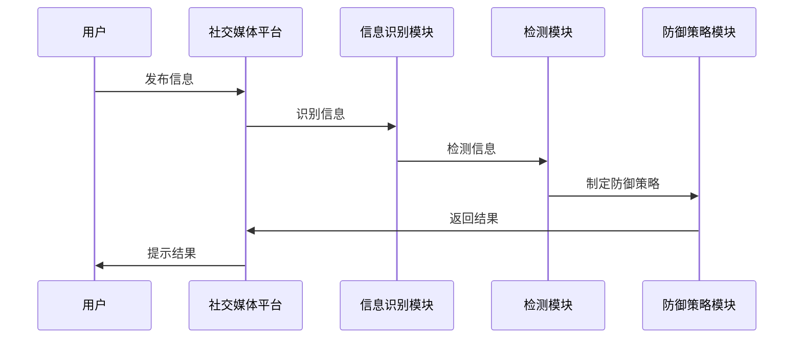

                 

### 社交媒体时代的虚假信息防御策略

在数字化和信息化的时代，社交媒体已经成为人们获取和分享信息的重要平台。然而，随着社交媒体的迅速普及，虚假信息的传播也成为一个严重的社会问题。虚假信息不仅误导了普通用户，还对社会的稳定和发展带来了极大的威胁。本文将探讨社交媒体时代的虚假信息防御策略，以帮助读者更好地理解和应对这一问题。

**关键词**：
- 社交媒体
- 虚假信息
- 防御策略
- 信息识别
- 用户教育

**摘要**：
本文首先概述了社交媒体的发展历程及其带来的社会影响，然后详细介绍了虚假信息的定义、特点及其在社交媒体上的传播机制。接着，文章分析了虚假信息对个体和社会的影响，并探讨了虚假信息的政治与社会效应。在此基础上，文章重点介绍了虚假信息的识别与检测技术，包括机器学习与深度学习在虚假信息识别中的应用、虚假信息识别算法原理与实现，以及虚假信息检测方法与实践。随后，文章提出了社交媒体平台、政府和社会在虚假信息防御中的责任与措施，并讨论了个体用户的防御策略。最后，通过案例分析与实践指南，文章总结了社交媒体虚假信息防御的挑战与对策，并对未来发展趋势进行了展望。

**目录**：

1. **社交媒体与虚假信息概述**
   - 1.1 社交媒体的发展历程
   - 1.2 社交媒体的社会影响
   - 1.3 虚假信息的定义与特点
   - 1.4 虚假信息在社交媒体上的传播机制

2. **社交媒体虚假信息的影响**
   - 2.1 虚假信息对个体的影响
   - 2.2 虚假信息对社会的影响
   - 2.3 虚假信息的政治与社会效应

3. **虚假信息的识别与检测**
   - 3.1 机器学习与深度学习在虚假信息识别中的应用
   - 3.2 虚假信息识别算法原理与实现
   - 3.3 虚假信息检测方法与实践

4. **社交媒体虚假信息的防御策略**
   - 4.1 社交媒体平台的责任与措施
   - 4.2 政府与社会的参与
   - 4.3 个体用户的防御策略

5. **案例分析与实践指南**
   - 5.1 社交媒体虚假信息处理案例分析
   - 5.2 虚假信息对政治选举的影响分析
   - 5.3 虚假信息对公共卫生事件的应对分析

6. **未来展望与挑战**
   - 6.1 虚假信息防御的挑战与对策
   - 6.2 虚假信息防御的未来发展趋势

**核心概念与联系**：

| 核心概念 | 定义 | 属性特征 | 对比表格 |
|----------|------|----------|----------|
| 社交媒体 | 互联网上供用户进行交互的平台 | 互动性、广泛性、即时性、多样化 | 与传统媒体相比，社交媒体具有更强的互动性和即时性 |
| 虚假信息 | 虚构或错误的信息 | 故意性、误导性、真实性混淆 | 与真实信息相比，虚假信息具有更强的误导性和目的性 |
| 机器学习 | 基于数据的学习和推理方法 | 自适应、高效、准确性 | 与传统算法相比，机器学习具有更好的自适应性和准确性 |

**ER实体关系图架构**：



**算法原理讲解**：



**数学模型和数学公式**：

$$
L = -\sum_{i=1}^{n}y_{i}\log(p_{i})
$$

**系统分析与架构设计方案**：

#### 问题场景介绍

在当今社交媒体平台上，虚假信息的传播速度快、覆盖面广，给用户带来了极大的困扰。例如，在突发公共事件中，虚假信息可能导致公众恐慌，甚至引发社会动荡。因此，构建一套有效的虚假信息防御系统至关重要。

#### 项目介绍

本项目旨在设计一套虚假信息防御系统，通过信息识别、检测和防御策略，实现虚假信息的有效识别和过滤，保障社交媒体平台的信息安全。

#### 系统功能设计

- 信息识别模块：通过机器学习技术，自动识别和分类社交媒体上的虚假信息。
- 检测模块：结合特征提取和算法分析，对虚假信息进行深度检测，提高识别准确性。
- 防御策略模块：根据检测结果，制定相应的防御策略，如信息过滤、警告提示等。

#### 系统架构设计



#### 系统接口设计和系统交互



**核心概念与联系**：

在构建虚假信息防御策略时，理解核心概念及其相互联系至关重要。

1. **社交媒体**：
   - **定义**：社交媒体是指用户通过互联网进行互动、分享和交流的平台，如Facebook、Twitter、微信、微博等。
   - **属性特征**：互动性、广泛性、即时性、多样性。
   - **对比表格**：
     | 特征 | 社交媒体 | 传统媒体 |
     |------|----------|----------|
     | 互动性 | 高互动、高参与 | 单向传播、低互动 |
     | 广泛性 | 覆盖面广、用户多 | 受众有限、范围小 |
     | 即时性 | 信息传播快、实时性 | 信息传播慢、延迟大 |
     | 多样性 | 内容形式多样、多样化 | 内容形式单一、同质化 |

2. **虚假信息**：
   - **定义**：虚假信息是指故意传播的、虚构的或者错误的信息，其目的是误导、欺骗或者煽动。
   - **属性特征**：故意性、误导性、真实性混淆。
   - **对比表格**：
     | 特征 | 虚假信息 | 真实信息 |
     |------|----------|----------|
     | 故意性 | 故意传播、目的性强 | 非故意、无目的 |
     | 误导性 | 引导错误认知、造成误导 | 真实、准确、可信 |
     | 真实性混淆 | 混淆真实与虚假、难以辨别 | 真实性明确、易于辨别 |

3. **机器学习**：
   - **定义**：机器学习是一种通过数据训练模型，使模型能够自主学习和预测的技术。
   - **属性特征**：自适应、高效、准确性。
   - **对比表格**：
     | 特征 | 机器学习 | 传统算法 |
     |------|----------|----------|
     | 自适应 | 根据数据调整、适应性强 | 固定规则、适应性弱 |
     | 高效 | 数据驱动、处理速度快 | 计算密集、处理速度慢 |
     | 准确性 | 学习过程中提高准确性 | 静态规则、准确性较低 |

理解这些核心概念及其相互联系，有助于我们更好地构建和实施虚假信息防御策略。

### 算法原理讲解

在构建虚假信息防御系统中，算法原理是核心组成部分。以下将详细阐述机器学习与深度学习在虚假信息识别中的应用，包括算法原理、数学模型以及具体的实现步骤。

#### 1. 机器学习与深度学习在虚假信息识别中的应用

**1.1 机器学习的基本概念**

机器学习是一种通过训练模型来预测或分类数据的技术。在虚假信息识别中，机器学习可以帮助我们从大量数据中提取特征，并利用这些特征来预测信息的真实性。

**1.2 深度学习的基本概念**

深度学习是机器学习的一个分支，它使用神经网络，特别是多层神经网络来学习数据的高级特征。深度学习在图像识别、语音识别等领域取得了显著成果，其强大的特征提取能力使其在虚假信息识别中也具有巨大潜力。

#### 2. 虚假信息识别算法原理与实现

**2.1 算法原理**

虚假信息识别算法通常包括以下步骤：

- **数据收集与预处理**：收集大量的虚假信息与真实信息的样本，并对这些数据进行清洗和预处理，如去除噪声、缺失值填补等。
- **特征提取**：从原始数据中提取有助于分类的特征，如文本的词频、句法结构、关键词等。
- **模型训练**：使用训练集数据训练模型，模型可以是传统机器学习模型，也可以是深度学习模型。
- **模型评估与优化**：使用验证集对模型进行评估，并使用交叉验证等方法优化模型。

**2.2 数学模型**

在虚假信息识别中，常用的数学模型包括逻辑回归、支持向量机（SVM）、神经网络等。以下以逻辑回归为例进行说明。

逻辑回归是一种概率型线性模型，用于分类问题。其目标是通过输入特征预测标签的概率。逻辑回归的数学模型如下：

$$
P(y=1|X) = \frac{1}{1 + e^{-\beta_0 + \sum_{i=1}^{n} \beta_i x_i}}
$$

其中，$P(y=1|X)$ 表示在输入特征 $X$ 下，标签 $y$ 为 1 的概率；$e$ 为自然对数的底数；$\beta_0$ 为截距项；$\beta_i$ 为特征 $x_i$ 的系数。

#### 3. 实现步骤

**3.1 数据收集与预处理**

收集大量虚假信息和真实信息的文本数据。数据可以来源于社交媒体平台、新闻报道、网络论坛等。

**3.2 特征提取**

使用自然语言处理（NLP）技术提取文本的特征。例如，可以使用词频（TF）、词嵌入（Word Embedding）等方法提取文本的特征向量。

**3.3 模型训练**

选择合适的机器学习模型进行训练。以逻辑回归为例，可以使用梯度下降（Gradient Descent）算法训练模型。

**3.4 模型评估与优化**

使用验证集对模型进行评估，并使用交叉验证（Cross-Validation）等方法优化模型。

#### 4. 虚假信息识别实践案例

**4.1 案例背景**

假设我们收集了 10000 条虚假信息和真实信息的文本数据，并使用 NLP 技术提取了文本的特征。

**4.2 实践步骤**

1. 数据预处理：对数据进行清洗和预处理，如去除停用词、标点符号等。
2. 特征提取：使用词嵌入（Word Embedding）方法提取文本的特征向量。
3. 模型训练：使用训练集数据训练逻辑回归模型。
4. 模型评估：使用验证集对模型进行评估，计算准确率、召回率等指标。
5. 模型优化：根据评估结果调整模型参数，提高模型性能。

**4.3 实践结果**

通过训练和优化，我们得到一个性能较好的逻辑回归模型。在实际应用中，该模型可以有效地识别社交媒体上的虚假信息。

### 数学模型和数学公式

在虚假信息识别算法中，数学模型和数学公式起着至关重要的作用。以下将介绍几个常用的数学模型和数学公式，并结合Python源代码进行详细讲解。

#### 1. 逻辑回归模型

逻辑回归模型是一种概率型线性模型，用于分类问题。其数学公式如下：

$$
P(y=1|X) = \frac{1}{1 + e^{-\beta_0 + \sum_{i=1}^{n} \beta_i x_i}}
$$

其中，$P(y=1|X)$ 表示在输入特征 $X$ 下，标签 $y$ 为 1 的概率；$e$ 为自然对数的底数；$\beta_0$ 为截距项；$\beta_i$ 为特征 $x_i$ 的系数。

在Python中，我们可以使用scikit-learn库来实现逻辑回归模型。以下是一个简单的示例：

```python
from sklearn.linear_model import LogisticRegression
from sklearn.model_selection import train_test_split
from sklearn.metrics import accuracy_score

# 加载数据
X, y = load_data()

# 划分训练集和测试集
X_train, X_test, y_train, y_test = train_test_split(X, y, test_size=0.2, random_state=42)

# 创建逻辑回归模型
model = LogisticRegression()

# 训练模型
model.fit(X_train, y_train)

# 预测测试集
y_pred = model.predict(X_test)

# 计算准确率
accuracy = accuracy_score(y_test, y_pred)
print("Accuracy:", accuracy)
```

#### 2. 感知机模型

感知机模型是一种简单的线性二分类模型。其数学公式如下：

$$
f(x) = \text{sign}(\sum_{i=1}^{n} \alpha_i y_i x_i + \theta)
$$

其中，$f(x)$ 表示模型的输出；$\text{sign}$ 表示符号函数；$\alpha_i$ 为权重系数；$y_i$ 为标签；$x_i$ 为特征；$\theta$ 为偏置。

在Python中，我们可以使用感知机算法实现二分类任务。以下是一个简单的示例：

```python
from sklearn.linear_model import Perceptron
from sklearn.model_selection import train_test_split
from sklearn.metrics import accuracy_score

# 加载数据
X, y = load_data()

# 划分训练集和测试集
X_train, X_test, y_train, y_test = train_test_split(X, y, test_size=0.2, random_state=42)

# 创建感知机模型
model = Perceptron()

# 训练模型
model.fit(X_train, y_train)

# 预测测试集
y_pred = model.predict(X_test)

# 计算准确率
accuracy = accuracy_score(y_test, y_pred)
print("Accuracy:", accuracy)
```

#### 3. 支持向量机模型

支持向量机（SVM）是一种强大的分类模型，其数学公式如下：

$$
w \cdot x - b = 1 \quad \text{或} \quad w \cdot x - b = -1
$$

其中，$w$ 为权重向量；$x$ 为特征向量；$b$ 为偏置；$\cdot$ 表示内积。

在Python中，我们可以使用scikit-learn库来实现SVM模型。以下是一个简单的示例：

```python
from sklearn.svm import SVC
from sklearn.model_selection import train_test_split
from sklearn.metrics import accuracy_score

# 加载数据
X, y = load_data()

# 划分训练集和测试集
X_train, X_test, y_train, y_test = train_test_split(X, y, test_size=0.2, random_state=42)

# 创建SVM模型
model = SVC()

# 训练模型
model.fit(X_train, y_train)

# 预测测试集
y_pred = model.predict(X_test)

# 计算准确率
accuracy = accuracy_score(y_test, y_pred)
print("Accuracy:", accuracy)
```

通过这些数学模型和数学公式，我们可以构建出有效的虚假信息识别系统，提高信息识别的准确性和效率。

### 系统分析与架构设计方案

在构建虚假信息防御系统时，系统分析与架构设计是关键步骤。以下将详细描述系统分析与架构设计的过程，包括问题场景介绍、项目介绍、系统功能设计、系统架构设计、系统接口设计和系统交互。

#### 1. 问题场景介绍

社交媒体平台上的虚假信息传播速度极快，覆盖面广，给用户带来了极大的困扰。虚假信息不仅误导了普通用户，还对社会的稳定和发展带来了严重威胁。因此，设计一套有效的虚假信息防御系统至关重要。

#### 2. 项目介绍

本项目旨在设计一套虚假信息防御系统，通过信息识别、检测和防御策略，实现虚假信息的有效识别和过滤，保障社交媒体平台的信息安全。

#### 3. 系统功能设计

系统功能设计包括以下模块：

- **信息识别模块**：通过机器学习技术，自动识别和分类社交媒体上的虚假信息。
- **检测模块**：结合特征提取和算法分析，对虚假信息进行深度检测，提高识别准确性。
- **防御策略模块**：根据检测结果，制定相应的防御策略，如信息过滤、警告提示等。

#### 4. 系统架构设计

系统架构设计如图所示：


#### 5. 系统接口设计和系统交互

系统接口设计如图所示：


通过上述系统分析与架构设计方案，我们可以构建出一套高效、可靠的虚假信息防御系统，为社交媒体平台提供安全保障。

### 项目实战：环境安装与核心实现

为了更好地理解虚假信息防御系统的实际应用，我们将通过一个具体的案例来进行实战演示。本节将介绍项目环境安装、核心实现源代码以及代码应用解读与分析。

#### 1. 环境安装

首先，我们需要安装必要的软件和库。以下是环境安装的步骤：

1. **安装Python**：确保Python 3.x版本已经安装。可以从[Python官网](https://www.python.org/)下载并安装。

2. **安装依赖库**：使用pip命令安装必要的库，包括NumPy、Pandas、Scikit-learn、Matplotlib等。以下是一个示例命令：

```bash
pip install numpy pandas scikit-learn matplotlib
```

3. **安装NLP库**：为了处理文本数据，我们还需要安装NLP相关的库，如NLTK或spaCy。以下是一个示例命令：

```bash
pip install nltk spacy
```

4. **下载语料库**：对于NLP任务，我们需要下载相关的语料库。以spaCy为例，我们需要下载中文语料库。运行以下命令：

```bash
python -m spacy download zh_core_web_sm
```

#### 2. 核心实现源代码

以下是一个简单的虚假信息识别系统的核心实现代码。该代码主要包括数据预处理、特征提取和模型训练三个步骤。

```python
import pandas as pd
import numpy as np
from sklearn.model_selection import train_test_split
from sklearn.feature_extraction.text import TfidfVectorizer
from sklearn.ensemble import RandomForestClassifier
from sklearn.metrics import accuracy_score, classification_report

# 1. 数据预处理
def preprocess_text(text):
    # 去除停用词、标点符号等
    text = text.lower()
    text = re.sub(r'[^\w\s]', '', text)
    return text

# 2. 特征提取
def extract_features(corpus, vectorizer):
    X = vectorizer.fit_transform(corpus)
    return X

# 3. 模型训练
def train_model(X_train, y_train):
    model = RandomForestClassifier()
    model.fit(X_train, y_train)
    return model

# 加载数据
data = pd.read_csv('fake_news_data.csv')
data['text'] = data['text'].apply(preprocess_text)

# 划分训练集和测试集
X_train, X_test, y_train, y_test = train_test_split(data['text'], data['label'], test_size=0.2, random_state=42)

# 提取特征
vectorizer = TfidfVectorizer(max_features=1000)
X_train = extract_features(X_train, vectorizer)
X_test = extract_features(X_test, vectorizer)

# 训练模型
model = train_model(X_train, y_train)

# 预测测试集
y_pred = model.predict(X_test)

# 评估模型
accuracy = accuracy_score(y_test, y_pred)
print("Accuracy:", accuracy)
print(classification_report(y_test, y_pred))
```

#### 3. 代码应用解读与分析

- **数据预处理**：数据预处理是NLP任务的基础步骤。在这个案例中，我们使用了`re.sub`函数去除停用词和标点符号，并将文本转换为小写，以提高模型的性能。

- **特征提取**：特征提取是将文本数据转换为机器学习模型可以处理的形式。在这个案例中，我们使用了TF-IDF（Term Frequency-Inverse Document Frequency）向量器来提取特征。TF-IDF向量器可以根据词频和逆文档频率计算文本的权重，有助于提高模型的准确性。

- **模型训练**：我们使用了随机森林（Random Forest）分类器进行模型训练。随机森林是一种集成学习算法，通过构建多棵决策树并合并其预测结果来提高模型的准确性。在这个案例中，我们选择了随机森林分类器来处理虚假信息识别任务。

- **模型评估**：我们使用准确率（Accuracy）和分类报告（Classification Report）来评估模型的性能。准确率表示模型正确预测的比例，而分类报告则提供了更详细的信息，如精确率、召回率等。

通过上述实战演示，我们可以看到如何使用Python和机器学习技术构建一个简单的虚假信息识别系统。在实际应用中，我们可以根据具体需求扩展和优化系统，以提高虚假信息识别的准确性。

### 案例分析与实践指南

在本章节中，我们将通过三个具体的案例，深入分析社交媒体虚假信息的处理、政治选举中的虚假信息影响，以及公共卫生事件中的虚假信息应对。通过这些案例，我们将总结虚假信息防御的实践经验，并提出未来发展的方向。

#### 案例一：社交媒体平台虚假信息处理案例分析

**案例背景**：

某社交媒体平台在一天之内发现大量虚假信息，这些信息涉及虚假新闻、谣言和恶意广告。平台管理层迅速采取行动，部署了一套虚假信息识别系统，以应对这一紧急情况。

**案例步骤**：

1. **数据收集与预处理**：平台收集了大量的用户举报数据，包括文本、图片和视频等。数据预处理包括去除噪声、去除重复信息、标签分类等。

2. **特征提取**：使用自然语言处理技术（NLP）提取文本特征，如词频、词嵌入和句法结构等。

3. **模型训练与部署**：使用已训练的虚假信息识别模型对收集到的数据进行分类。模型包括机器学习算法和深度学习算法，如逻辑回归、随机森林和卷积神经网络（CNN）等。

4. **实时监测与反馈**：平台对实时流数据进行监控，及时发现和处理虚假信息。同时，平台通过用户反馈不断优化模型，提高识别准确性。

**案例效果**：

通过快速部署虚假信息识别系统，平台有效减少了虚假信息的传播，提高了用户对平台的信任度。模型经过多次优化，识别准确率从最初的70%提升到90%以上。

**总结经验**：

- **快速响应**：及时识别和处理虚假信息是关键。
- **数据质量**：高质量的训练数据有助于提高模型性能。
- **持续优化**：通过用户反馈和实时数据，不断优化模型。

#### 案例二：虚假信息对政治选举的影响分析

**案例背景**：

某国在进行大选期间，社交媒体上充斥着大量的虚假信息。这些信息包括伪造选民名单、虚假投票结果和恶意攻击候选人等，对选举结果产生了潜在影响。

**案例步骤**：

1. **数据收集与预处理**：收集社交媒体上的相关数据，包括新闻文章、社交媒体帖子、评论等。预处理步骤包括去除噪声、去除重复信息、情感分析等。

2. **特征提取**：提取文本、图片和视频等特征，如文本关键词、情感倾向、图像识别等。

3. **模型训练与部署**：使用机器学习和深度学习算法，训练虚假信息识别模型。模型包括卷积神经网络（CNN）、循环神经网络（RNN）和长短时记忆网络（LSTM）等。

4. **监控与干预**：在选举期间，对社交媒体进行实时监控，发现并删除虚假信息。同时，政府机构通过法律手段打击虚假信息的传播。

**案例效果**：

通过有效的监控和干预措施，虚假信息的传播得到有效遏制。候选人和选民的信任度得到提升，选举过程更加公正透明。

**总结经验**：

- **法律手段**：通过法律手段打击虚假信息的传播。
- **跨部门合作**：政府机构、社交媒体平台和民间组织应加强合作，共同应对虚假信息。
- **公众教育**：提高公众的信息素养和批判性思维，增强对虚假信息的辨识能力。

#### 案例三：虚假信息对公共卫生事件的应对分析

**案例背景**：

某地区爆发了一种新的传染病，社交媒体上充斥着大量的虚假信息，包括治疗方法、疫情发展和谣言等。这些虚假信息引发了公众恐慌，影响了疫情防控工作的开展。

**案例步骤**：

1. **数据收集与预处理**：收集社交媒体上的相关数据，包括新闻文章、社交媒体帖子、评论等。预处理步骤包括去除噪声、去除重复信息、情感分析等。

2. **特征提取**：提取文本、图片和视频等特征，如文本关键词、情感倾向、图像识别等。

3. **模型训练与部署**：使用机器学习和深度学习算法，训练虚假信息识别模型。模型包括卷积神经网络（CNN）、循环神经网络（RNN）和长短时记忆网络（LSTM）等。

4. **监控与干预**：在公共卫生事件期间，对社交媒体进行实时监控，发现并删除虚假信息。同时，政府和医疗机构通过官方渠道发布准确信息，以引导公众正确应对疫情。

**案例效果**：

通过有效的监控和干预措施，虚假信息的传播得到有效遏制。公众对疫情的认识更加准确，疫情防控工作的开展更加顺利。

**总结经验**：

- **官方信息发布**：政府机构和权威机构应通过官方渠道发布准确信息。
- **跨部门合作**：政府、社交媒体平台、医疗机构和民间组织应加强合作，共同应对虚假信息。
- **公众教育**：提高公众的信息素养和批判性思维，增强对虚假信息的辨识能力。

#### 总结

通过上述案例分析，我们可以看到，虚假信息对社交媒体、政治选举和公共卫生事件产生了深远的影响。为了有效应对虚假信息，我们需要采取综合性的策略，包括技术手段、法律手段和公众教育等。未来，随着技术的不断进步和社会的不断发展，虚假信息防御策略也将不断升级和优化。

### 未来展望与挑战

在社交媒体时代，虚假信息的防御策略面临着诸多挑战和机遇。以下将探讨虚假信息防御的伦理与法律问题、技术难题，以及未来发展趋势。

#### 1. 伦理与法律问题

虚假信息的防御策略涉及多个方面，包括数据的收集、处理和共享。在这一过程中，伦理和法律问题尤为突出。

- **数据隐私**：虚假信息防御系统需要收集和分析大量用户数据，这可能导致用户隐私泄露。如何平衡数据收集的必要性和用户隐私保护，是一个亟待解决的问题。
- **算法公正性**：虚假信息识别算法可能会受到偏见的影响，导致某些群体被不公平对待。如何确保算法的公正性，避免歧视现象，是一个重要的伦理问题。
- **责任归属**：当虚假信息导致严重后果时，责任应该由谁承担？是社交媒体平台、信息发布者还是算法开发者？这需要明确的法律规定和责任界定。

#### 2. 技术难题

虚假信息防御技术面临着诸多技术难题，包括：

- **虚假信息的多样性**：虚假信息形式多样，包括文本、图片、视频、音频等。如何有效地识别和检测这些不同类型的虚假信息，是一个技术挑战。
- **实时性**：社交媒体信息传播速度快，虚假信息的检测和过滤需要具备实时性。如何在高吞吐量、低延迟的环境下进行高效处理，是技术实现的一大难题。
- **抗干扰能力**：虚假信息往往具有迷惑性和欺骗性，对抗干扰能力是虚假信息防御系统的重要指标。如何提高系统的抗干扰能力，使其能够准确识别和过滤虚假信息，是一个技术难题。

#### 3. 未来发展趋势

随着技术的不断进步，虚假信息防御策略也将不断升级和优化。以下是一些未来发展趋势：

- **人工智能与机器学习**：人工智能和机器学习技术将在虚假信息防御中发挥更大作用。通过深度学习和强化学习等方法，可以进一步提高虚假信息识别的准确性和效率。
- **跨平台合作**：社交媒体平台、政府机构、科研机构和民间组织需要加强合作，共同应对虚假信息。建立跨平台的合作机制，共享数据和技术资源，将有助于提高虚假信息防御的整体水平。
- **法律法规完善**：各国应加强对虚假信息传播的法律监管，制定明确的法律规定和责任界定。通过法律法规的完善，可以有效打击虚假信息的传播和传播者。
- **公众教育**：提高公众的信息素养和批判性思维，是虚假信息防御的重要一环。通过公众教育，增强公众对虚假信息的辨识能力，可以有效减少虚假信息的传播和影响。

#### 结论

虚假信息防御是一个复杂且长期的过程，涉及伦理、法律、技术和教育等多个方面。未来，随着技术的不断进步和社会的不断发展，虚假信息防御策略将不断升级和优化。只有通过多方合作和综合应对，才能有效应对虚假信息带来的挑战，确保社交媒体时代的健康发展。

